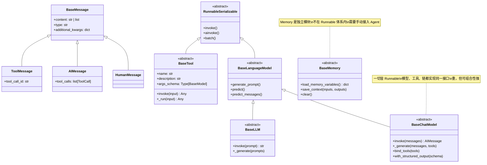
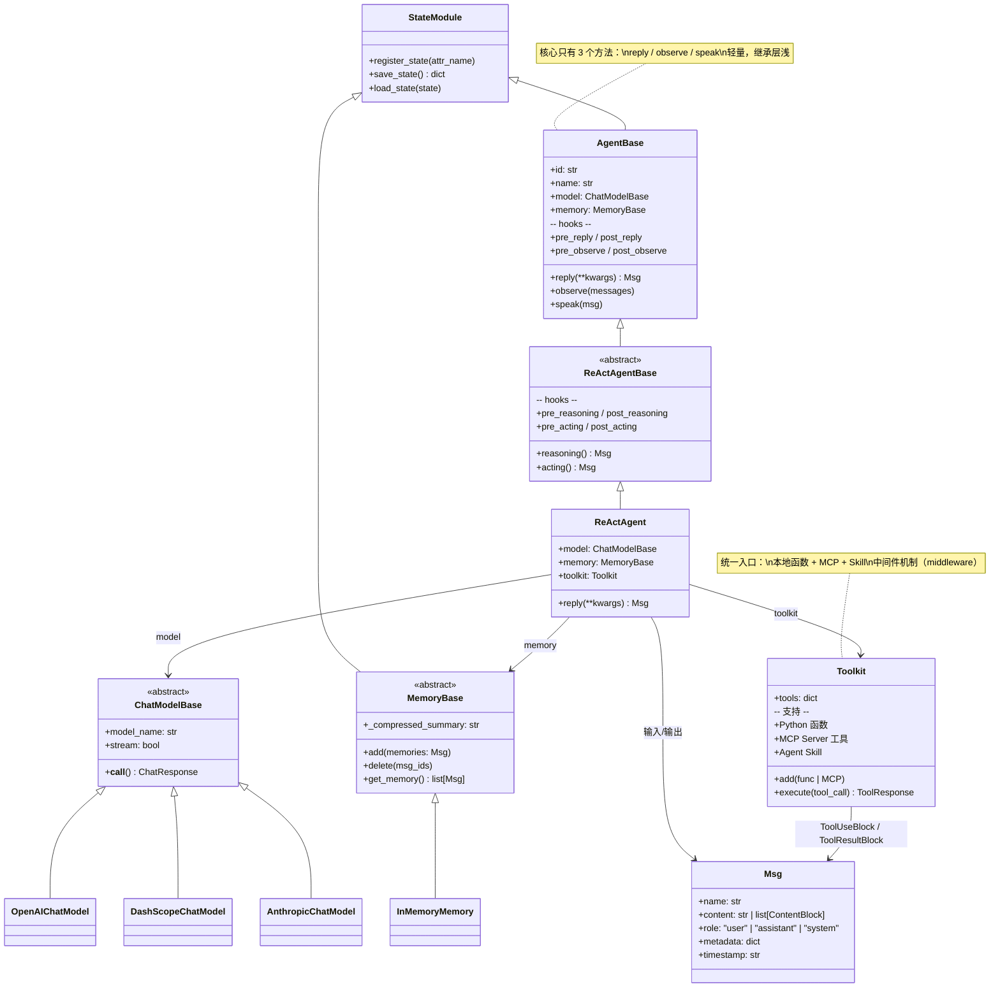
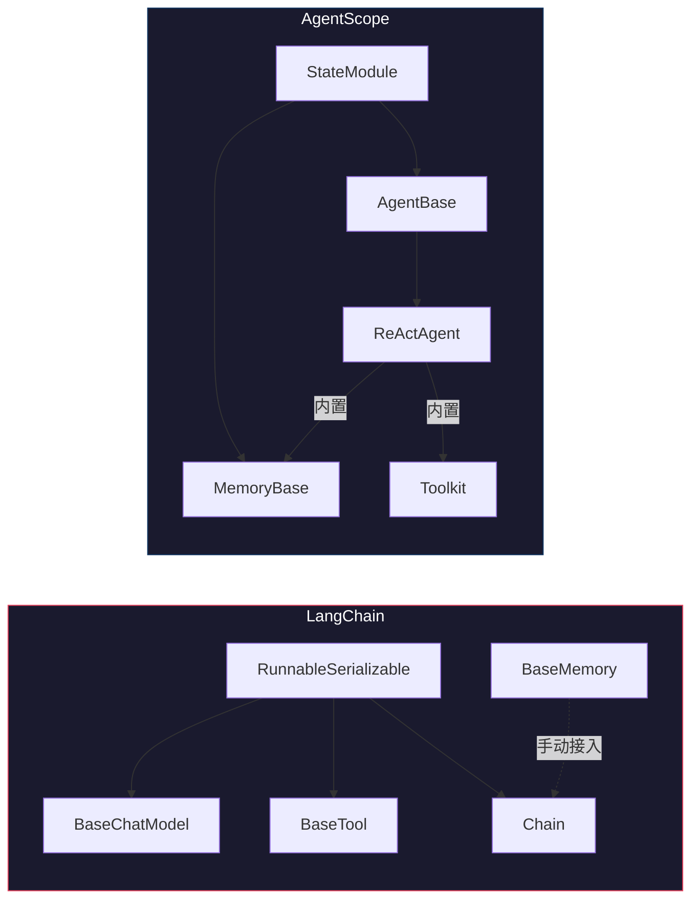

# Agent 框架调研：OpenClaw / LangChain(LangGraph) / ClawSwarm / AgentScope

## 结论

| 框架 | 适用度 | 一句话 |
|:---|:---|:---|
| **AgentScope** | ★★★★★ | **首选。** 阿里出品，有分布式 actor 模型，有边缘部署论文，有 Java 版，最贴需求 |
| **LangChain + LangGraph** | ★★★★ | 生态最大，OH 上已跑通 Python 运行时，但重，分布式能力弱 |
| **OpenClaw** | ★★ | 本质是聊天机器人网关（Telegram/Discord），不是设备端 agent 协同 |
| **ClawSwarm** | ★ | OpenClaw 的轻量版，更不是 |

---

## 一、四层架构对比

### 第 1 层：Agent 运行时（单个 Agent 的 tools / skills / 记忆）

| | LangChain | AgentScope |
|:---|:---|:---|
| Agent 定义 | Python 类，ReAct 循环 | Python 类，ReAct 循环，几乎一样 |
| Tools | `@tool` 装饰器，函数即工具 | 类似，内置 MCP 客户端 |
| 记忆 | 对话历史 + 外挂向量库 | 内置 ReMe 长期记忆模块，带压缩 |
| 模型接入 | OpenAI / Anthropic / 本地模型，生态最广 | 同样广，额外支持阿里系（通义千问） |
| 运行时依赖 | Python，依赖重（pydantic-core Rust .so 等） | Python，依赖轻，核心是纯 Python |

**差异：** LangChain 生态大但重，AgentScope 刻意做轻。

#### LangChain 运行时类结构（源码）



**LangChain 设计哲学：一切皆 Runnable。** 模型、工具、链都继承 `RunnableSerializable`，可以用 `|` 管道符串联。代价是抽象层深（BaseTool 继承了 5 层），pydantic 校验重。

#### AgentScope 运行时类结构（源码）



**AgentScope 设计哲学：消息驱动 + 状态可序列化。** Agent 的核心就 3 个方法（reply/observe/speak），所有组件继承 `StateModule` 可以序列化状态——这是分布式迁移的基础。Toolkit 统一了本地函数、MCP 工具和 Agent Skill，不像 LangChain 的 `BaseTool` 那样需要继承重型基类。

#### 关键差异一图看懂



**LangChain：** 工具和模型是平级的 Runnable，Memory 游离在体系外，组合灵活但要自己接线。
**AgentScope：** Agent 是一等公民，Model/Memory/Toolkit 都是 Agent 的内置组件，开箱即用但定制性稍弱。

#### LangChain 的 Runnable 管道

LangChain 里几乎所有核心组件都是 Runnable（ChatModel、Tool、Prompt、OutputParser、Retriever），可以用 `|` 管道符串联：

```python
from langchain_core.prompts import ChatPromptTemplate
from langchain_core.output_parsers import StrOutputParser
from langchain_openai import ChatOpenAI

# 三个 Runnable 用 | 串联成一条链
chain = (
    ChatPromptTemplate.from_template("用一句话解释{topic}")
    | ChatOpenAI(model="deepseek-chat")
    | StrOutputParser()
)

result = chain.invoke({"topic": "量子纠缠"})
# → "量子纠缠是两个粒子无论相距多远都能瞬间相互影响的现象。"
```

每个 `|` 把前一个 Runnable 的输出喂给下一个的输入。本质是函数组合，统一的 `invoke()` 接口。

AgentScope 不这么玩——它的组件不是平级的管道，而是 Agent 内部的器官。Model 和 Toolkit 是 Agent 的属性，不需要从外面串联。**LangChain 是"搭积木"，AgentScope 是"造生物"。**

#### 多 Agent 调用方式对比

**LangGraph（LangChain 的多 agent 层）——声明式，画图：**

```python
from langgraph.graph import StateGraph

graph = StateGraph(State)
graph.add_node("researcher", researcher_agent)    # 声明节点
graph.add_node("writer", writer_agent)
graph.add_node("reviewer", reviewer_agent)
graph.add_edge("researcher", "writer")            # 声明边
graph.add_edge("writer", "reviewer")
graph.add_conditional_edges("reviewer", decide_next)  # 条件分支

app = graph.compile()              # 编译成不可变的图
app.invoke({"task": "写篇报告"})   # 数据沿边流转
```

**AgentScope——命令式，写代码：**

```python
msg = Msg(name="user", content="写篇报告", role="user")
result = researcher.reply(msg)       # 研究员干活
result = writer.reply(result)        # 研究结果传给写手
result = reviewer.reply(result)      # 写手结果传给审稿人
# 条件分支？写 if。循环？写 while。
```

| | LangGraph | AgentScope |
|:---|:---|:---|
| 编排方式 | 画图，编译，声明式 | 写代码，命令式 |
| 分布式 | ❌ 全在一个进程里 | ✅ agent 可以在不同机器上 |
| 调试 | 难（状态在图里流转） | 简单（就是 Python 代码） |
| 复杂工作流 | 图结构清晰，一眼看懂 | 代码多了会乱 |
| 可视化 | 图本身就是可视化 | AgentScope Studio 从运行时消息流生成图 |

LangGraph 要 3 个 API（add_node + add_edge + compile）才能让 agent 对话，AgentScope 1 行 `.reply()` 搞定。

### 第 2 层：编排架构（多步骤任务的流程控制）

| | LangGraph | AgentScope |
|:---|:---|:---|
| 模型 | **有向图（DAG + 循环）** | **消息传递 + Pipeline/DAG** |
| 状态管理 | StateGraph 中心化状态，编译后不可变 | 消息即状态，agent 间消息传递 |
| 条件分支 | 边上的条件函数 | Pipeline 中的条件路由 |
| 人机协作 | Human-in-the-loop 节点 | 同样支持 |
| 持久化 | Checkpoint 机制 | Agent 状态持久化 + 中断恢复 |

**差异：** LangGraph 更"图论"——画一个 DAG，编译，跑。AgentScope 更"消息驱动"——agent 之间发消息，框架路由。

LangGraph 的图模型对复杂工作流更精确，但调试难（状态转换出 bug 很难追踪）。AgentScope 的消息模型更直觉，但不如图模型精确。

### 第 3 层：群体协同（多 Agent 协作）——关键差异

| | LangGraph | AgentScope | OpenAI Swarm |
|:---|:---|:---|:---|
| Supervisor 模式 | ✅ 一个 boss 调度多个 worker | ✅ | ✅ |
| Network 模式 | ✅ agent 之间平等通信 | ✅ | ❌ |
| 层级模式 | ✅ 多级 supervisor | ✅ | ❌ |
| **分布式部署** | ❌ 单进程 | ✅ **actor 模型，多机分布式** | ❌ |
| A2A 协议 | 通过 MCP | ✅ 原生支持 | ❌ |
| 蜂群/群聊 | 需要自己搭 | ✅ 内置 group chat | ❌ |

**这层是关键差异。** LangGraph 的多 agent 协同是单进程内的——所有 agent 跑在一个 Python 进程里，通过图的边传递消息。AgentScope 有**基于 actor 的分布式机制**——agent 可以跑在不同机器上，通过网络通信。

"无人机蜂群"场景：每个设备上跑一个 agent，设备之间协同——本质上就是分布式 multi-agent。LangGraph 做不了（单进程），AgentScope 天然支持。

### 第 4 层：OpenHarmony 可移植性

| | 移植难度 | 说明 |
|:---|:---|:---|
| LangChain + LangGraph | **已验证** | 已在 RK3568 OH 6.0 上跑通 langchain-core |
| AgentScope | **中等** | 核心是纯 Python，比 LangChain 轻，需验证依赖链 |
| OpenClaw | **不适用** | 聊天网关，不是设备端框架 |
| ClawSwarm | **不适用** | 同上 |

---

## 二、OpenClaw 和 ClawSwarm 为什么不是我们要的

OpenClaw（27万 star）本质是**个人 AI 助手网关**——把 ChatGPT/Claude/Gemini 接到 Telegram/Discord/Slack 上。它的"multi-agent"是指：一个网关后面挂多个 AI 身份，不同聊天频道路由到不同 agent。这是**聊天机器人编排**，不是**设备端 agent 协同**。

ClawSwarm 是 OpenClaw 的轻量版，更偏向消息平台集成，加了一些 Solana 链上操作（发 token 之类的）。

**这俩的"swarm"是营销词，不是技术架构。**

---

## 三、AgentScope 分布式机制详解

### 核心：`.to_dist()` 一行代码从本地变分布式

**本地版：**

```python
researcher = ReActAgent(name="研究员", model=model)
writer = ReActAgent(name="写手", model=model)

result = researcher.reply(msg)
result = writer.reply(result)
```

**分布式版——加一个 `.to_dist()`：**

```python
researcher = ReActAgent(name="研究员", model=model).to_dist()  # ← 就加这个
writer = ReActAgent(name="写手", model=model).to_dist()

result = researcher.reply(msg)    # 自动走 gRPC
result = writer.reply(result)     # 自动走 gRPC
```

**多机部署——指定远程 IP：**

```python
# 板子 A 上跑研究员
researcher = ReActAgent(name="研究员", model=model).to_dist(host="192.168.1.101", port=12345)
# 板子 B 上跑写手
writer = ReActAgent(name="写手", model=model).to_dist(host="192.168.1.102", port=12345)

# 主控端代码完全不变
result = researcher.reply(msg)
result = writer.reply(result)
```

### `.to_dist()` 底层做了什么

```
主控机（你写代码的机器）
    │
    │  researcher = Agent("研究员").to_dist(host="板子A", port=12345)
    │
    │  实际发生了什么：
    │  1. 把 Agent 对象序列化（StateModule.save_state()）
    │  2. 通过 gRPC 发给板子A 的 RpcAgentServerLauncher
    │  3. 板子A 上反序列化，重建一个完整的 Agent
    │  4. 本地只留一个 RPC 代理（空壳）
    │
    │  之后调 researcher.reply(msg)：
    │  → 空壳把 msg 通过 gRPC 发给板子A
    │  → 板子A 上的真 Agent 执行
    │  → 结果通过 gRPC 返回
    │
    ▼

    主控机（写代码的地方）
    ┌─────────────────────────────────────────────────────────┐
    │  researcher_proxy ─── gRPC ───→ 板子A [真·研究员 Agent]  │
    │  writer_proxy     ─── gRPC ───→ 板子B [真·写手 Agent]    │
    │  reviewer_proxy   ─── gRPC ───→ 板子C [真·审稿人 Agent]  │
    │                                                          │
    │  main.py 只看到三个"本地对象"                              │
    │  不知道它们其实在远程                                      │
    └─────────────────────────────────────────────────────────┘
```

本质是 **代理模式（Proxy Pattern）**：本地的 agent 变量不是真的 Agent，是个 RPC 代理壳。调 `.reply()` 时，代理壳把参数序列化 → gRPC 发到远程 → 远程执行 → 结果返回。代码完全感知不到这个过程。

### 多机启动流程

```
步骤 1：在每台板子上预先启动 Agent 服务器（一次性）

    板子A:
        from agentscope.server import RpcAgentServerLauncher
        launcher = RpcAgentServerLauncher(host="0.0.0.0", port=12345)
        launcher.launch()
        launcher.wait_until_terminate()

    板子B: 同上
    板子C: 同上

    这些服务器是空容器，等着接收 Agent。

步骤 2：在主控机上运行你的程序（唯一写代码的地方）

    researcher = Agent("研究员").to_dist(host="板子A", port=12345)
    writer     = Agent("写手").to_dist(host="板子B", port=12345)
    reviewer   = Agent("审稿人").to_dist(host="板子C", port=12345)

    # 这三行执行完，三个 Agent 已经分别部署到三块板子上了
    # 下面的代码和本地开发一模一样

    result = researcher.reply(msg)
    result = writer.reply(result)
    result = reviewer.reply(result)
```

### 两种分布式模式

| 模式 | 用法 | 场景 |
|:---|:---|:---|
| **Child 模式**（默认） | `.to_dist()` 不传参 | 单机多进程并行，自动分配端口 |
| **Independent 模式** | `.to_dist(host="远程IP", port=端口)` | 多机分布式，需预先启动远程服务 |

### 为什么 LangChain/LangGraph 做不了

AgentScope 能做分布式的关键是 `StateModule`——所有组件（Agent、Memory、Toolkit 配置）都能序列化/反序列化。`.to_dist()` 序列化整个 Agent 发到远程重建。

LangChain 没有这个机制。`BaseTool` 继承的是 `RunnableSerializable`，但它的"serializable"是给 LangSmith 追踪用的，不是给分布式迁移用的。Agent 的状态（对话历史、工具绑定）没有统一的序列化接口，无法整体搬到另一台机器。

### 已有的分布式实测

| 案例 | 说明 |
|:---|:---|
| [边缘部署论文](https://arxiv.org/pdf/2508.03345) | 华为云边缘节点（2核 2G 内存），agent 自主在节点间迁移 |
| Docker / K8s 部署 | AgentScope Runtime 支持容器化部署 |
| 阿里云函数计算 | Serverless 部署 Agent |
| Agent-as-a-Service | AgentScope Runtime 1.0（2025.12）提供 API 化部署 |
| 分布式中断与恢复 | 执行中的 agent 可以被中断，状态持久化后在另一台机器恢复 |

### 其他优势

**A2A 协议：** 2025 年 12 月加入 Agent-to-Agent 协议支持，agent 跨设备/跨框架通信有标准接口。

**Java 版：** AgentScope 有官方 Java 版。如果 OH 上 Java/ArkTS 比 Python 好搞，可以走这条路。

**中文生态：** 阿里出品，中文文档全，和国内模型（通义千问、DeepSeek）对接顺畅。

**AgentScope Studio：** 可视化开发环境，能看到 agent 之间的消息流、调试、监控。不需要像 LangGraph 那样先画图——代码跑完后自动从运行时消息传递中推导出流程图。

---

## 四、建议路线

**短期（调研 + 原型）：AgentScope**

- 分布式 actor 模型现成，不用造轮子
- 边缘部署有学术论文和实测数据
- A2A 原生支持
- 有 Java 版备选

**中期（OH 移植）：在 RK3568 上跑 AgentScope**

Python 运行时已有（CPython 3.11 交叉编译产物）。AgentScope 依赖链分析如下：

**需要新交叉编译的（C/Rust .so）：**

| 包 | 底层 | 已有？ | 说明 |
|:---|:---|:---|:---|
| tiktoken | Rust (PyO3) | ❌ 新的 | token 计数，AgentScope 核心依赖 |
| numpy | C/Fortran | ❌ 新的 | 大头，但有 `--minimal` 纯 C 模式 |
| greenlet (SQLAlchemy) | C | ❌ 新的 | 小 C 扩展，一行 clang |
| sounddevice | C (PortAudio) | ❌ | 音频，板子上不需要，跳过 |
| pydantic-core | Rust | ✅ 已有 | LangChain 移植时已编 |
| jiter | Rust | ✅ 已有 | |
| uuid-utils | Rust | ✅ 已有 | |
| xxhash | C | ✅ 已有 | |

**纯 Python 直接丢：** aioitertools, anthropic, dashscope, docstring_parser, json5, json_repair, mcp, openai, python-datauri, opentelemetry-*, python-socketio, shortuuid, python-frontmatter, aiofiles

**可跳过（optional）：** sounddevice, scipy, redis, qdrant, pymilvus, ray

**对比 LangChain 的额外工作量：多编 tiktoken + numpy + greenlet 三个包。** 其中 tiktoken 是 Rust/PyO3，用 maturin 模板一套命令；greenlet 是小 C 扩展一行搞定；numpy 需要摸索一下（`--minimal` 模式纯 C 编译，不依赖 BLAS/LAPACK）。预计半天到一天。

**备选：LangChain + LangGraph + 自建分布式层**

已在 OH 上跑通，如果 AgentScope 移植有坑，可以在 LangGraph 上面自己搭分布式通信层（HTTP/gRPC），多写一层胶水代码。

---

## 参考链接

- OpenClaw: https://github.com/openclaw/openclaw
- ClawSwarm: https://github.com/The-Swarm-Corporation/ClawSwarm
- LangGraph: https://www.langchain.com/langgraph
- LangGraph 架构分析: https://latenode.com/blog/ai-frameworks-technical-infrastructure/langgraph-multi-agent-orchestration/langgraph-multi-agent-orchestration-complete-framework-guide-architecture-analysis-2025
- AgentScope: https://github.com/agentscope-ai/agentscope
- AgentScope Runtime: https://github.com/agentscope-ai/agentscope-runtime
- AgentScope 论文: https://arxiv.org/abs/2402.14034
- AgentScope 边缘部署论文: https://arxiv.org/pdf/2508.03345
- AgentScope Java: https://github.com/agentscope-ai/agentscope-java
- OpenAI Swarm: https://github.com/openai/swarm
- AgentScope 分布式教程: https://doc.agentscope.io/en/tutorial/208-distribute.html
- AgentScope Samples: https://github.com/agentscope-ai/agentscope-samples

---

*调研日期：2026-03-12*
