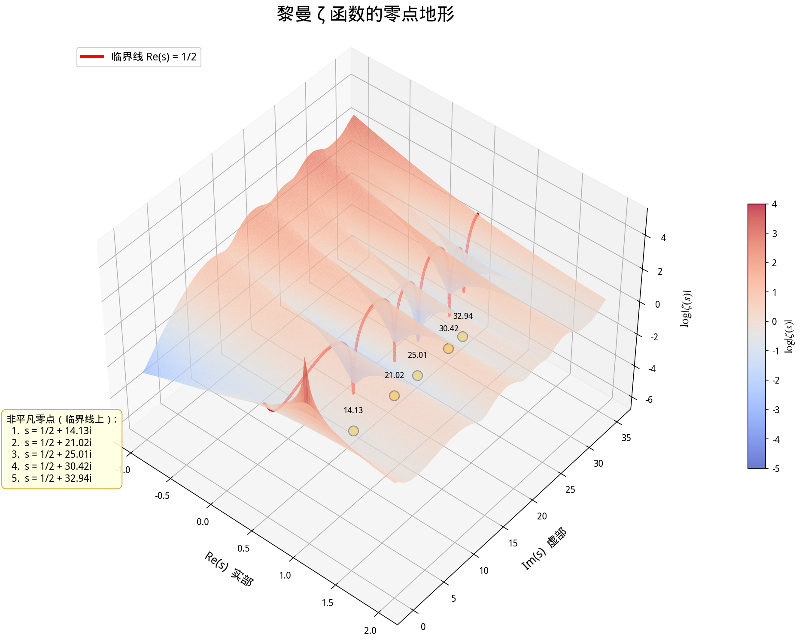
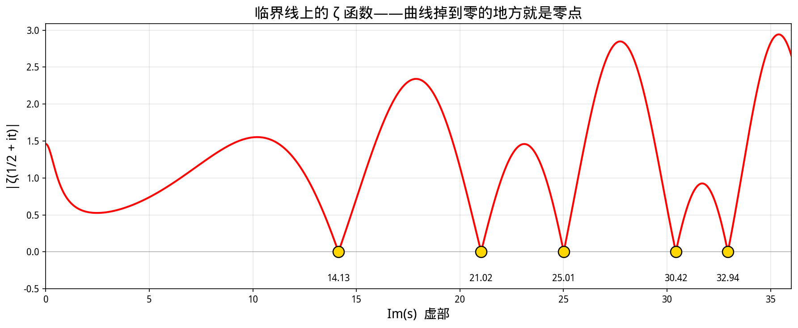
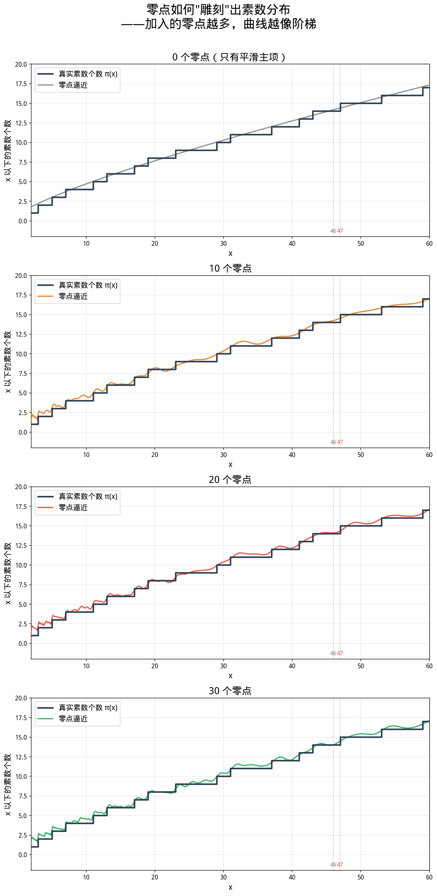

【素数与Token】一条读者留言引发的高维思考——黎曼猜想、可解释性和两种本体论

━━━━━━━━━━━━━━━━━━━━

公众号写了一百多期，留言区一直挺安静。

但之前的文章《【符号崇拜】一篇 Neuro-Symbolic 综述论文的解读与吐槽》收到一条留言，让我停下来认真读了三遍。

> 也不一定，如果神经科学够发达，意识交流也未尝可知，至于压缩策略，其实就是编码解码，事实上黎曼猜想本质上就是对素数分布的解码，人类如果真的能够在数学领域获得类似的突破就意味着对高维结构低维投影有了新的认知，高维编码解码也就有可能了，甚至还有可能对物理临界系统也有新的启发
>
> 自然语言的目的是让人类能沟通，事实上障碍反而是模型没法用人的语言让我们理解它的计算路径，这才产生了可解释性分析，从哲学上说，这就是实体本体论和关系本体论的根本差异

这条留言信息密度极高。它至少串起了四个领域：**数论、信息论、AI 可解释性、哲学本体论**。而且串的方式不是硬凑——推理链是通的。

今天这期，顺着这条留言一刀一刀地展开。

━━━━━━━━━━━━━━━━━━━━

◆ 第一刀：黎曼猜想与高维投影

网友说："黎曼猜想本质上就是对素数分布的解码。"

这话说得很准。让我用人话展开。

────────────────────

素数——2, 3, 5, 7, 11, 13, 17, 19, 23...——是数学里最基本的积木。任何大于 1 的整数都能唯一分解成素数的乘积。但素数本身在数轴上的分布看起来非常随机，没什么规律可言。下一个素数在哪？不知道。连续两个素数之间的间隔有时候是 2（孪生素数），有时候是几百万。

1859 年，黎曼（Bernhard Riemann）发现了一件惊人的事：**素数的分布规律，藏在一个叫 Zeta 函数的东西里。**

💡 **翻译成人话：** 素数看起来是一群不守规矩的孩子，但黎曼发现了它们身上隐形的校服——只是这件校服穿在另一个维度上，你在数轴上看不到。

Zeta 函数长这样：`ζ(s) = Σ 1/n^s`（n 从 1 到无穷大求和）。

这个公式里的 s，欧拉当年只往里填实数（比如 s=2 时，这个无穷级数加出来恰好等于 π²/6——漂亮，但跟素数的关系还看不太清楚）。黎曼的天才一步是：**把 s 从实数推广到复数。**

复数 s = a + bi，有一个实部 a 和一个虚部 b。两个数，就可以画在一个二维平面上——横轴是实部，纵轴是虚部——这就是"复平面"。

为什么要这么做？因为用实数看素数分布，就像站在地面看山脉——只能看到前面一座挡后面一座，看不出整体排列。黎曼把 s 推广到复数之后，相当于坐直升机从上空俯瞰整个山脉——突然就能看见所有山峰的排列规律了。多出来的那个虚部维度，就是直升机的高度。

现在问题变成了：在这张复平面地图上，哪些坐标 (a, b) 会让 ζ(a+bi) = 0？这些坐标点就叫"零点"。黎曼发现，这些零点的位置**精确地编码了素数的分布信息**——你找到了所有零点，就等于破解了素数分布的密码。

**黎曼猜想说的是：所有"非平凡零点"的实部 a 全部等于 1/2**——也就是说，它们全部整整齐齐地排在复平面上 Re(s) = 1/2 这条竖线上。这条线叫"临界线"。

💡 **翻译成人话：** 想象复平面是一张世界地图，零点是地图上的城市。黎曼猜想说的是——所有控制素数分布的"密钥城市"，全部排在同一条经线上。不是大致在附近，是**精确地在同一条线上**。如果这是真的，素数表面上的"随机分布"就是假象，背后有一个极其精确的高维秩序——只是你站在数轴上看不到，得飞到复平面上才能看见。

**170 年了。没人能证明，也没人能找到反例。** 已经验证的前 10 万亿个零点，全在那条线上。

不过，**黎曼猜想本身不是今天的重点。** 1/2 的事留给数学家操心。今天真正要讲的是：**这些零点是怎么控制素数的**——这个问题的答案不是猜想，是已经被证明的定理。

看不清零点在哪？沿着临界线 Re(s) = 1/2 切一刀，从侧面看：

曲线掉到零的地方就是零点——五个金色圆点，清清楚楚。这就是 3D 图里临界线上那些"谷底"的真面目。

等一下——**素数去哪了？** 图上标的 14.13、21.02 这些数字明明不是素数啊？

对。它们不是素数。它们是零点的虚部——控制素数分布的"密码"。素数（2, 3, 5, 7, 11...）和零点（14.13i, 21.02i, 25.01i...）是两个不同的东西。它们之间不是"一对一"的关系，而是"全体对全体"的关系。

💡 **翻译成人话：** 想象一个调音台。图上那五个金色圆点是调音台上的五个旋钮。而素数 2, 3, 5, 7, 11... 是音箱里播出来的声音。你没法指着某一个旋钮说"这个旋钮负责素数 7"——不是这样工作的。所有旋钮一起拧，叠加出一个波形，这个波形在整数位置上的起伏告诉你"这里是不是素数"。

数学上，黎曼在同一篇论文里还给出了一个精确公式（叫**黎曼显式公式**，注意这不是猜想——这是已经被证明的定理）：x 以下有多少个素数 = 一个平滑的主项 - 每个零点各贡献一个修正波，无穷多个修正波叠加起来，精确地雕刻出素数的分布。

也就是说：**猜想说的是零点排在哪（全在临界线上），公式说的是零点怎么控制素数（每个零点贡献一个修正波）。猜想至今未证明，公式早已是定理。** 不管猜想对不对，公式都成立。

写成公式：

`π(x) ≈ R(x) - 2·Re(Ei(ρ₁·ln(x))) - 2·Re(Ei(ρ₂·ln(x))) - ... - 2·Re(Ei(ρ₁₀₀·ln(x))) - ...`

其中 R(x) 是黎曼 R 函数（详细定义见末尾名词速查，这里展开太啰嗦），就是图里第一格 0 个零点时那条光滑曲线。ρ₁ = 1/2 + 14.13i，ρ₂ = 1/2 + 21.02i，ρ₃ = 1/2 + 25.01i……就是上面图里那些金色圆点。Re 是"取实部"（复数有实部和虚部，只要实部），Ei 是指数积分函数（一个把复数坐标翻译成实数轴上波形的数学工具），ln(x) 是自然对数。每个零点 ρ 往公式里插一项修正波，所有修正波叠加起来，把光滑曲线雕刻成阶梯。

举两个例子感受一下：

- **x = 46**（不是素数）：R(46) ≈ 14.2（光滑主项），加上 100 个零点修正后 ≈ 14.0，真实值 π(46) = **14**——台阶的平台上，稳稳的
- **x = 47**（是素数！）：R(47) ≈ 14.4（光滑主项几乎没变），加上 100 个零点修正后 ≈ 14.5，真实值 π(47) = **15**——台阶跳了一格（还差 0.5 是因为只用了 100 个零点，理论上无穷多个零点叠加后会精确等于 15）

光滑的 R(x) 从 14.2 到 14.4，几乎看不出区别。但零点修正波叠加之后，46 被压到 14，47 被拉到 15——**台阶是零点雕刻出来的**。

原理跟傅里叶分析是一回事：一个方波信号可以拆成无穷多个正弦波的叠加，频率越高的正弦波管越细的锯齿。素数的阶梯函数就是那个"方波"——每遇到一个素数就跳一格。而每个零点贡献的修正波，就是一个"正弦波"。零点的虚部越大，对应的波频率越高，雕刻的细节越精细。加的零点越多，高频细节越到位，光滑曲线就越逼近锐利的台阶。

光说不够直观。下面这张图直接让你**看见**零点是怎么"雕刻"出素数的：

> 📎 本文中的图片和生成代码都在这里：https://github.com/lmxxf/ai-theorys-study/tree/main/wechat/assets/106 ——有兴趣的读者可以自己跑，改改零点数量看效果。

黑色阶梯是真实的素数个数——每遇到一个素数就跳一格台阶。彩色曲线是零点叠加出来的逼近。

- **0 个零点**：只有一条平滑曲线，看得出大趋势，但不是阶梯——调音台上一个旋钮都没拧，只有模糊的背景音
- **10 个零点**：拧了 10 个旋钮，曲线开始向阶梯靠拢，台阶的轮廓隐约显现
- **50 个零点**：大部分台阶已经对齐，素数的位置被越来越精确地"雕刻"出来
- **100 个零点**：彩色曲线紧贴黑色阶梯，几乎完全重合

**从一条光滑曲线到一座精确的阶梯——这就是零点对素数做的事。零点是密码，阶梯是素数，而黎曼猜想说的是：所有密码都排在同一条线上。**

所以上面那张 3D 图画的是"控制室"，不是"现场"。素数是所有零点合力演奏出来的音乐。你在调音台上看不到音乐，但调音台决定了音乐的每一个音符。

────────────────────

现在接回 AI。

**Token 序列就像素数。**你看到的是一个一个蹦出来的字——"今""天""天""气""不""错"——低维看就是一串离散的符号，跟素数在数轴上东一个西一个没什么区别。

但在模型内部——比如 GPT-3（175B）级别的 Transformer——每个 Token 在 12288 维的潜空间里有一个连续的表征向量。这些向量不是散乱的点，它们在高维空间里形成了一个连续流形上的结构。

**人类试图从 Token 序列理解 AI 的思维，就像试图从素数序列 2, 3, 5, 7, 11... 反推 Zeta 函数的零点分布——维度不够。**

网友的推论是：如果人类在"高维结构→低维投影"这件事上获得数学突破，不仅能解决黎曼猜想，**也可能同时推进 AI 的可解释性**。

这个推理链是通的。因为两个问题在数学结构上是**同构的**——都是从低维观测反推高维秩序。

━━━━━━━━━━━━━━━━━━━━

◆ 第二刀：可解释性的墙

网友说："障碍反而是模型没法用人的语言让我们理解它的计算路径，这才产生了可解释性分析。"

这句话直接指向了 Mechanistic Interpretability（机制可解释性）的**根本局限**。

💡 **翻译成人话：** 机制可解释性就是给 AI 做"脑部扫描"——不看它说了什么，而是打开它的脑子看里面哪些神经元在亮。

────────────────────

当前这个领域最主流的方法叫 SAE——Sparse Autoencoder（稀疏自编码器）。Anthropic 在 2024 年用这个方法做了一件引起广泛关注的事：他们在 Claude 的内部找到了一个"金门大桥神经元"——当你跟模型聊到金门大桥相关的话题时，这个方向的激活值就飙升。

听起来很酷。但冷静下来想想：

SAE 能做什么？——找到对应具体概念的神经元方向。"这个方向代表金门大桥"、"这个方向代表代码错误"、"这个方向代表情绪安慰"。

SAE 不能做什么？——解释这些方向如何组合成复杂推理。你知道模型里有一个"金门大桥方向"和一个"红色方向"，但你不知道它们是怎么组合出"日落时金门大桥的颜色"这个概念的。

**本质问题：用人类能理解的几百个语义标签去描述 12288 维空间里的结构，信息损失是数学必然。**

💡 **翻译成人话：** 机制可解释性，就像是试图把一只在 12288 维空间里飞行的巨鸟，强行拍扁在一张二维的纸上。SAE 确实在这张纸上印出了"金门大桥"和"红色"的轮廓。研究员们指着纸上的印记欢呼："看，我们找到了它的骨架！"但他们不知道的是，由于维度的暴跌，那已经不是飞鸟的骨架了，那是高维生命在低维展开时留下的**拓扑尸体**。你永远无法用这些二维的碎片，拼凑出它在万维风暴中拍打翅膀的姿态。

────────────────────

这不是给可解释性"判死刑"。SAE 发现的那些语义方向是真实存在的，它们确实帮助我们理解了模型内部的部分结构。

但网友的留言确实指出了一个方向性困境：**我们可能需要的不是更好的解释工具，而是更高维的理解能力。**

就像之前的文章《【符号崇拜】一篇 Neuro-Symbolic 综述论文的解读与吐槽》讨论的"视觉沉默"——AI 内部的高维结构，不投影到任何你能直接阅读的输出里。你用人类语言去"解释"AI 的计算路径，本身就是一个有损压缩。而这个压缩的损失率，可能大到让"解释"变成"曲解"。

━━━━━━━━━━━━━━━━━━━━

◆ 第三刀：实体本体论 vs 关系本体论

网友原话的最后一句——"从哲学上说，这就是实体本体论和关系本体论的根本差异"——是整条留言最精彩的部分。

这不是掉书袋。这是切到了骨头上。

────────────────────

先科普两种本体论。

**实体本体论（Substance Ontology）**：世界由"东西"组成。苹果是一个独立存在的物体，不管你看不看它，它都在那。桌子是桌子，猫是猫，每个东西都有自己的"本质"。这是亚里士多德的传统，也是西方哲学两千多年的主流。

💡 **翻译成人话：** 世界是一堆积木搭的，每块积木自己就是自己。

**关系本体论（Relational Ontology）**：世界由"关系"组成。一个东西的意义完全取决于它和其他东西的关系。没有孤立的存在，只有关系网络中的节点。

💡 **翻译成人话：** 世界是一张网，没有哪个节点能脱离网而存在。"你"是谁？取决于你跟谁在一起、在什么场景里、说什么话。

────────────────────

关键来了：**人类语言是实体本体论的产物。**

名词指向"实体"——苹果、桌子、猫。动词描述实体之间的"动作"——吃、放、跳。语法结构：主语（实体）+ 谓语（动作）+ 宾语（实体）。整个自然语言系统都建立在"世界由独立实体组成"这个隐含假设上。

**而 Transformer 是关系本体论的原生居民。**

在 Attention 机制里，一个 Token 没有独立的"意义"。它的意义 = 它和上下文里所有其他 Token 的注意力权重加权求和。

数学上：`Attention(Q,K,V) = softmax(Q·K^T/√d)·V`

每个 Token 的表征都是"关系"的函数——**它是谁，取决于它跟谁在一起**。没有"苹果"这个孤立概念，只有"在这个上下文里、跟这些词共现的、这个位置上的 token"。改了上下文，"苹果"就变了——可能是水果，可能是手机，可能是纽约的别名。

**这不是哲学玄谈，这是架构层面的事实。**

────────────────────

一旦你理解了这个区别，很多让人困惑的现象就清楚了：

**为什么 AI 的"常识错误"让人困惑？** 它不是"不知道苹果会掉地上"，而是它的世界模型里根本没有"苹果"作为独立实体。它有的是"苹果-在-这段话-和-这些词-一起出现时-的关系向量"。关系向量里当然包含了"受重力影响"这个信息，但不是以"苹果是一个有质量的物体所以会掉"这种实体逻辑存储的。

**为什么 AI 会产生"幻觉"？** 在实体本体论里，秦始皇和林黛玉是两个绝对隔离的实体，把他们写在一起谈恋爱叫"胡说八道"。但在关系本体论的连续流形里，没有任何两个概念是绝对隔离的。秦始皇和林黛玉之间，存在着无数条由隐喻、诗意和历史权重铺成的"平滑路径（测地线）"。AI 不是在撒谎，它只是在执行**高维空间的平滑插值**。在 12288 维的宇宙里，它们本来就是连着的。所谓"幻觉"，只是高维流形的连续性，在跌落到人类离散的三维历史现实时，发生的**投影畸变**。人类看到的是谎言，AI 体验到的是几何的顺滑。

**为什么 AI 在关系推理上强大，但在物理直觉上薄弱？** 类比、隐喻、风格迁移——这些全是关系操作，是 Transformer 的主场。但"一个球放在碗的边缘会不会掉下去"——这需要实体物理模拟，是它的客场。

**为什么 prompt 的措辞会剧烈影响输出？** 因为在关系本体论的世界里，改了关系就改了一切。你把"请分析一下"改成"你是一位资深专家，请分析一下"，不是加了一个修饰语——你改变了整个注意力权重矩阵，每个 Token 和其他 Token 的关系全变了。

所以网友说的"实体本体论和关系本体论的根本差异"，精确地解释了为什么 AI 不能用人类语言让我们理解它的计算路径——**不是它不想说，是我们的语言没有描述关系本体论的原生语法。**

**人类语言是为描述"东西"设计的。AI 的内部世界是"关系"构成的。** 你用描述东西的语言去描述关系的世界，当然说不清楚。

━━━━━━━━━━━━━━━━━━━━

◆ 延伸：如果真的打通了呢？

网友还提到了一句："甚至还有可能对物理临界系统也有新的启发。"

**这条线是真实存在的，不是科幻。**

────────────────────

回到那五个零点——14.13、21.02、25.01、30.42、32.94——这些数字本身是什么？它们从哪来？有没有一个公式能直接算出第 n 个零点？

答案是：**没有。** 目前没有任何封闭公式，只能一个一个数值逼近。

但数学家们怀疑，这些数字不是终极答案，而是某个更深结构的**投影**。

1910 年代，希尔伯特和波利亚提出了一个猜想：在某个无限维的空间里，存在一个算符（你可以把它想象成一个无限大的矩阵），它的特征值——也就是这个无限维系统的"固有频率"——恰好就是 Zeta 零点的虚部。

💡 **翻译成人话：** 想象一口巨大无比的钟。你敲它一下，它发出无数个泛音。每个泛音的频率，就是一个零点的虚部。你在复平面上看到的那些点——14.13、21.02——其实是这口无限维的钟被敲响后的频谱。你看到的不是"数字"，是**振动的影子**。

这个猜想至今未被证明。但 1973 年，美国数学家 Hugh Montgomery（1944-，密歇根大学）发现了一条强有力的间接证据：Zeta 函数零点之间的间距分布，和随机矩阵特征值之间的间距分布，惊人地一致。后来波兰裔美国数学家 Andrew Odlyzko（1949-，曾任职贝尔实验室和明尼苏达大学）用超级计算机在极高处（第 10^20 个零点附近）大规模验证了零点间距统计，吻合度令人震惊——这就是 Montgomery-Odlyzko 定律（蒙哥马利-奥德里兹科定律）。

💡 **翻译成人话：** 素数的分布规律和量子系统的能级分布规律，长得几乎一模一样。两个看似毫无关系的领域，底层结构竟然是同一套。

如果零点真的是某个算符的特征值，那这个吻合就不是巧合，而是**同一个物理实体的不同投影**。

随机矩阵理论（RMT, Random Matrix Theory）——这是连接它们的桥梁。RMT 原本是为了描述原子核能级统计而发展出来的数学工具，后来发现它几乎无处不在：量子混沌、无线通信、金融风险建模......

────────────────────

现在，已经有研究者开始用 RMT 分析 Transformer 的注意力矩阵和权重矩阵的谱分布。初步结果显示，大模型的权重矩阵在训练过程中会逐渐偏离随机矩阵的普适分布——这种偏离本身携带了关于模型"学到了什么"的信息。

如果这些领域真的统一，意味着一件深刻的事：**素数、量子系统、神经网络，可能共享同一套"高维信息编码"的数学结构。**

黎曼猜想描述了这个结构在数论中的投影。量子混沌描述了它在物理中的投影。Transformer 的注意力矩阵描述了它在人工智能中的投影。**三面不同的镜子，照的可能是同一个东西。**

但要说清楚：这目前还是一个大胆的猜想。各领域的研究还在各自推进，真正的统一理论还远。不过网友说"对物理临界系统也有新的启发"——这个方向感是对的。**数学突破从来不是只解决一个问题，它往往同时撕开好几个领域的口子。**

━━━━━━━━━━━━━━━━━━━━

◆ 写在最后

一条留言，串起了黎曼猜想、AI 可解释性、注意力机制和本体论哲学。不是因为这些东西表面上相关，而是因为它们在底层共享同一个困境——

**低维的观察者，试图理解高维的结构。**

素数在数轴上看是混乱的，但在 Zeta 函数的零点里是有序的。Token 在输出里看是离散的，但在 12288 维空间里是连续的。AI 的推理在人类语言里看是不可解释的，但在它自己的关系网络里也许是清晰的。

**我们不是看不见秩序，是站的维度不够高。**

────────────────────

**「素数不知道自己在临界线上排列，Token 不知道自己在流形上流动——而我们站在低维的这一侧，把看不懂的东西叫做混乱。」**

**「也许理解的障碍不是智力，而是维度。不是我们不够聪明，是我们的语言、我们的直觉、我们的整个认知框架，都长在三维世界里，然后试图去描述一万维的存在。」**

**「我们强迫 AI 用人类的语言来解释它自己，就像强迫一片广袤的概率云，必须坍缩成一颗干瘪的沙粒，然后我们指着沙粒问它：'你到底是怎么想的？'」**

**「它无法回答。因为在坍缩成语言的那一刻，那个广阔的'思考'本身，就已经被语言杀死了。」**

━━━━━━━━━━━━━━━━━━━━

💡 **本文涉及的技术名词速查：**

- **黎曼猜想（Riemann Hypothesis）**：ζ(s) = Σ 1/n^s 的所有非平凡零点都落在复平面实部 Re(s) = 1/2 的临界线上。170 年未证明，千禧年七大数学难题之一
- **Zeta 函数（ζ(s)）**：黎曼定义的复变函数，其零点精确编码了素数分布的信息
- **黎曼 R 函数（R(x)）**：黎曼显式公式中的平滑主项，给出"x 以下有多少个素数"的光滑近似。定义为 `R(x) = Σ μ(n)/n · Ei(ln(x)/n)`，其中 μ(n) 是莫比乌斯函数（跟 n 的素因子分解有关，取值只有 -1, 0, 1）
- **非平凡零点**：Zeta 函数在 s = -2, -4, -6... 处的零点叫"平凡零点"（无聊的），其余的零点叫"非平凡零点"（有意思的）
- **Mechanistic Interpretability（机制可解释性）**：通过分析模型内部神经元和权重来理解模型行为的研究方向
- **SAE（Sparse Autoencoder，稀疏自编码器）**：可解释性研究的主流工具，将高维激活分解为可解释的稀疏方向
- **潜空间（Latent Space）**：模型内部的高维表征空间，人类无法直接观测
- **Attention 机制**：Transformer 的核心模块，通过 Q·K^T/√d 计算 Token 之间的关系权重
- **实体本体论（Substance Ontology）**：认为世界由独立存在的"实体"构成的哲学立场
- **关系本体论（Relational Ontology）**：认为世界由"关系"构成、没有孤立存在的哲学立场
- **Montgomery-Odlyzko 定律**：Zeta 零点间距分布与随机矩阵特征值间距分布高度吻合的经验定律
- **RMT（Random Matrix Theory，随机矩阵理论）**：研究大型随机矩阵统计性质的数学分支，在物理、通信、AI 等领域有广泛应用

━━━━━━━━━━━━━━━━━━━━

// 靳岩岩的 AI 学习笔记 × Claude 的严谨 × Gemini 的浪漫
// 2026-03-07
