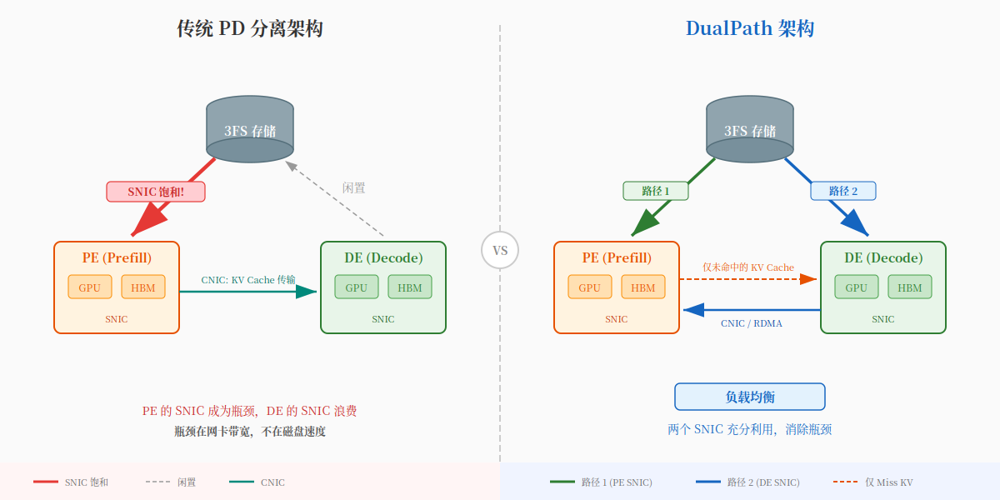

DeepSeek DualPath：为什么 AI 竞赛的下一个战场不是模型，是搬砖
——GPU 算力涨了 14.4 倍，网卡带宽没跟上

━━━━━━━━━━━━━━━━━━━━

有个反直觉的事实：

当 AI Agent 跑起来之后，GPU 大部分时间不是在算，**是在等数据搬过来。**

就像一家全自动化工厂，流水线速度提了 14 倍，但送原料的卡车还是十年前的——工厂再快也得等货到了才能开工。

所有人都在等 DeepSeek-V4。春节前没等到，元宵节也没等到。

但 DeepSeek 没闲着——继 mHC（流形约束超连接）和 Engram（N-gram 条件记忆）之后，2026 年 2 月 25 日又扔出一篇新论文。

只不过这次画风不太一样：不讲模型架构，不讲训练技巧，讲的是一个非常"土"的问题——**怎么把数据搬得更快。**

这篇论文叫 DualPath，解决的是 AI Agent 推理场景中的存储带宽瓶颈。

听起来很无聊？但我读完之后的感觉是：**这可能是近期最有信号量的论文之一。**

不是因为技术多复杂——而是因为它暴露了一个行业级的问题：**大家都在卷模型，DeepSeek 在卷基建。**

就像电商大战，所有人都在比谁的店铺页面做得更好看，DeepSeek 在建物流网络。V4 没来，但物流先到了。

━━━━━━━━━━━━━━━━━━━━

◆ 目录

一、论文基本信息
二、先搞懂背景：AI 推理长什么样？
三、Agent 场景的特殊性：98.7% 的缓存命中率意味着什么？
四、问题的本质：预填充端被读爆了
五、DualPath 方案：多修一条路
六、流量管理：怎么避免新路堵车
七、调度器：全局交通管制
八、实验结果
九、这篇论文的隐含信号
十、总结

━━━━━━━━━━━━━━━━━━━━

◆ 一、论文基本信息

━━━━━━━━━━━━━━━━━━━━

▸ 论文标题：DualPath: Breaking the Storage Bandwidth Bottleneck in Agentic LLM Inference
▸ 发布时间：2026 年 2 月 25 日
▸ arXiv 编号：2602.21548v2
▸ 作者：13 人团队（吴永桐、陈绍远等）
▸ 领域：分布式计算（cs.DC）

注意分类：cs.DC，分布式计算。不是 cs.AI，不是 cs.CL。

DeepSeek 把这篇论文归到"分布式计算"——说明他们自己也很清楚，这不是一篇 AI 论文，**这是一篇基础设施论文。**

━━━━━━━━━━━━━━━━━━━━

◆ 二、先搞懂背景：AI 推理长什么样？

━━━━━━━━━━━━━━━━━━━━

如果你用过 ChatGPT 或者 DeepSeek 的 API，你已经在使用"推理"了。推理就是模型接收输入、生成输出的过程。

但在系统层面，推理被拆成了两个阶段：

────────────────────

**预填充（Prefill）**：读你发过来的所有文字，理解上下文。

想象你去银行柜台，先把你过去十年的交易流水全翻一遍——这就是预填充。计算量大，一次性搞完。

**解码（Decode）**：一个字一个字地生成回复。

翻完流水之后，柜员开始一行一行写审批意见——这就是解码。每次只生成一个 token。

────────────────────

你可能以为 AI 回答问题就是一台服务器从头算到尾。实际上不是——现在的大规模推理系统把这两个阶段拆到**不同的物理机器**上，就像工厂流水线一样，各自有独立的 GPU、网卡和存储连接：

▸ **预填充引擎（Prefill Engine，简称 PE）**：部署在一组机器上，专门负责"读上下文"
▸ **解码引擎（Decode Engine，简称 DE）**：部署在另一组机器上，专门负责"生成回复"

为什么要拆？因为两个阶段的计算特征完全不同。预填充是计算密集型（一次性处理大量 token），解码是带宽密集型（反复访问 KV Cache）。拆到不同机器上各自优化，效率更高。这种架构叫 **PD 分离**（Prefill-Decode Disaggregation），是现在大规模推理的主流做法。

而在这两者之间传递的核心数据，就是 **KV Cache**。

────────────────────

**什么是 KV Cache？**

💡 **翻译成人话：** KV Cache 是 AI 的"短期记忆"。

模型读你发过来的每一句话，每一层注意力计算都会产生两个矩阵——Key 矩阵和 Value 矩阵（合称 KV Cache）。这些矩阵存下来，后面生成回复的时候就不用重新算了。

打个比方：你第一次去银行办业务，柜员把你的身份证复印了一份存档。下次你再来，直接拿复印件就行，不用重新复印——这个"复印件"就是 KV Cache。

KV Cache 的大小跟上下文长度成正比。上下文越长，缓存越大。

━━━━━━━━━━━━━━━━━━━━

◆ 三、Agent 场景的特殊性：98.7% 的缓存命中率意味着什么？

━━━━━━━━━━━━━━━━━━━━

这里才是这篇论文的核心洞察。

普通的聊天场景，用户问一句，模型答一句，上下文不长，KV Cache 不大。

**但 Agent 场景完全不一样。**

Agent（AI 代理）会自主执行多步骤任务——查资料、调工具、写代码、反思修改、再查资料……一个任务可能跑 **157 轮**对话，上下文堆到 **32K token**。

这意味着两件事：

────────────────────

**第一，KV Cache 巨大。**

DeepSeek-V3.2 的缓存-计算比约 **22 GB/PFLOP**——每做一千万亿次浮点运算（1 PFLOP = 10¹⁵ 次），需要搬运 22 GB 的 KV Cache 数据。

**第二，绝大部分 KV Cache 都能复用。**

想象你已经跟 AI 对话了 100 轮——你问了 100 次，AI 回答了 100 次。现在第 101 轮，你又发了一句新的。对模型来说，前 100 轮的上下文完全没变，只多了你这一句话。那前 100 轮对应的 KV Cache 为什么要重新算？直接从缓存里拿就行。

论文的数据：**KV Cache 命中率高达 98.7%。**

────────────────────

98.7% 命中率意味着什么？

回到刚才的例子：你跟 AI 对话了 100 轮，第 101 轮的上下文里有 32000 个 token。其中 98.7%（大约 31600 个）的 KV Cache 跟上一轮完全一样，可以直接从缓存里拿，只有 1.3%（大约 400 个）是新增的需要重新计算。

听起来很好对吧？几乎不用重新算。

**问题在于：这 98.7% 的缓存，存在磁盘上。**（注意：这里的"磁盘"不是你电脑里的机械硬盘，是 NVMe SSD——3FS 集群每个存储节点插了 16 块 14TB 的 NVMe SSD，读写速度很快。瓶颈不在磁盘本身，在网卡带宽。）

你可能会问：为什么不存在内存里？

因为不只是你一个人在用。算一笔账：DeepSeek-V3 用了 MLA（多头潜注意力），把每个 token 的 KV Cache 压缩到了约 0.6 KB——已经是业界最省的了。一个 Agent 用户聊了 32K token 的上下文，KV Cache 大约 **20 MB**。听起来不大对吧？但 DeepSeek 的推理集群同时在服务成千上万个用户，每个用户的 KV Cache 都得存着。几万个用户同时在线，加起来就是几百 GB。论文的数据：哪怕每秒只新来不到半个 Agent 请求，工作集就已经达到 **681 GB**。而且 Agent 场景里每一轮都要等工具返回结果（比如调 API、查数据库），等待期间这个用户的 KV Cache 不能丢——等的人越多，堆积的缓存越大，内存很快就撑不住了。

所以 DeepSeek 用了自研的 **3FS 分布式文件系统**（对，这也是自研的），把 KV Cache 存到磁盘上。

**98.7% 的缓存命中率，意味着 AI 几乎不用"算"，全在"搬"。**

推理从计算密集型变成了 I/O 密集型。

━━━━━━━━━━━━━━━━━━━━

◆ 四、问题的本质：预填充端被读爆了

━━━━━━━━━━━━━━━━━━━━

好，现在你理解了场景。KV Cache 存在磁盘上，命中率 98.7%，需要从磁盘读回来。

问题是：**谁来读？**

传统方案里，只有 PE 从存储里读 KV Cache。为什么是 PE 读？因为用户每轮新输入的内容需要在已有上下文的 KV Cache 基础上做注意力计算——这就是预填充的工作。算完之后，历史的 KV Cache 加上新算出来的，一整套打包转给 DE，DE 就可以逐个 token 地生成回复了。

逻辑很清楚。但问题出在硬件上。

────────────────────

每个节点有两种网卡：

先说一下网络架构。数据中心里的机器都通过 InfiniBand 高速网络连在一起（类比家里的 Wi-Fi，只不过快了几千倍），数据传输用 RDMA（不经过 CPU，网卡直接把数据写到对方内存里）。每台 GPU 机器上插着多张网卡，硬件都一样，但按连接目标分成两类：

▸ **CNIC（计算网卡）**：连到其他 GPU 机器，负责机器之间的 GPU 通信。每个 GPU 配一张 400Gbps 的网卡，一台 8 卡机器就是 8 张（同一台机器内部 GPU 之间走 NVLink，更快，不过这不是本文重点）
▸ **SNIC（存储网卡）**：连到存储节点（3FS 集群），负责读写磁盘数据。论文里的配置是一台 8 卡机器只有 1 张。——这里可能跟你的直觉不一样：数据中心的硬盘不是插在 GPU 机器里的，而是单独的一排机器专门放硬盘，GPU 机器通过网络去读写。就像公司的文件不存在你自己电脑上，而是存在一个共享网盘里。好处是存储和计算可以独立扩展，坏处就是多了一道网络传输——本文讨论的瓶颈就出在这里

看到不对称了吧？8 台电脑，每台 8 块卡，跟其他电脑通信有 8 张高速网卡——但连存储的网卡只有 1 张。算力拉满，读网盘的网线只有一根。

前面说过，PE 和 DE 部署在不同的机器上，各自有自己的一套网卡。PE 那台机器要从磁盘读大量 KV Cache，全靠它那 1 张 SNIC，在 Agent 场景下直接被读爆了——**带宽饱和**。

与此同时，DE 那台机器呢？解码阶段主要做计算，几乎不从存储读数据。DE 的 SNIC **闲着**。

这就像一个城市有两条高速公路——北边那条堵死了，南边那条空荡荡。

────────────────────

更残酷的是硬件趋势。

论文里有个关键数据：从 Ampere 架构（对应家用卡 RTX 30 系列）到 Blackwell 架构（对应家用卡 RTX 50 系列），**GPU 的矩阵运算能力增长了 14.4 倍**。注意这是 AI 用的 Tensor Core 算力——你买了 RTX 5090 打游戏可能也就快了 30%，但跑 AI 的矩阵乘法快了 14 倍。老黄的刀法：游戏挤牙膏，AI 猛堆料，毕竟数据中心才是利润大头。顺便说一句，同代的 RTX 5090 和数据中心卡 B200，核心算力其实差不多，但价格差了几十倍——贵在显存带宽、互联和企业级特性上。英伟达卖的不是芯片，是生态位。

但存储网卡（SNIC）的带宽增长远远没跟上。

I/O-计算比在下降。翻译一下：**GPU 越来越能算，但搬数据的速度没跟上来。**

这意味着随着硬件换代，这个瓶颈不会自然消失——**只会越来越严重。**

顺便说一句，数据中心疯狂吃 HBM 产能，连带普通内存和 SSD 也跟着涨价。你最近攒机如果觉得内存贵了，别怪经销商——怪 AI 公司把存储供应链抽干了。RTX 5090 从去年 8 月的 2 万涨到快 3 万了，这个时代人人都在为 AI 买单。

━━━━━━━━━━━━━━━━━━━━

◆ 五、DualPath 方案：多修一条路

━━━━━━━━━━━━━━━━━━━━

DualPath 的核心思想，用一句话就能说清：

**既然 PE 的 SNIC 堵了，DE 的 SNIC 闲着，那就让 DE 帮忙搬数据。**

原来只有一条路：

```
存储 → PE（预填充引擎）
```

DualPath 新增了第二条路：

```
存储 → DE（解码引擎）→ 通过 RDMA 转发给 PE
（RDMA = Remote DMA，就是跨机器版的 DMA——A 机器直接写 B 机器的内存，不用 B 的 CPU 插手）
```

就像北边的高速堵死了，把一部分货物绕到南边高速，通过一条新修的连接路转到北边的工厂。



────────────────────

**PE 路径**（传统路径）：

▸ KV Cache 从存储读到 PE 的缓冲区
▸ 每个注意力层计算前，该层的 KV Cache 转入 PE 的 GPU 显存（HBM）
▸ 计算完成后，所有 KV Cache 转入 DE 缓冲区
▸ 逐层重复，传输与计算重叠执行

**DE 路径**（新增路径）：

▸ KV Cache 从存储读到 DE 的缓冲区
▸ PE 预填充期间，对应层的 KV Cache 从 DE 缓冲区通过 RDMA 读入 PE 的 GPU 显存
▸ 逐层重复
▸ 只有未命中（miss）的那 1.3% 新算出来的 KV Cache 需要从 PE 传回 DE——命中的部分 DE 已经有了

────────────────────

**块布局设计**

为了让两条路径高效配合，论文设计了两种数据块格式。这里的"层"就是 Transformer 的层——DeepSeek-V3 有 61 层，每一层都有自己的 KV Cache：

▸ **Full Block（全层块）**：把 61 层的 KV Cache 打包在一起，用于从磁盘读写——一次大块 I/O 比 61 次小块 I/O 高效得多
▸ **Layer Block（单层块）**：只包含单层的 KV Cache，用于往 GPU 显存里搬——因为注意力计算是一层算完再算下一层，用到哪层搬哪层

────────────────────

**无瓶颈分析**

论文做了数学推导：对于每节点 8 个 GPU、1 张 SNIC 的配置，DualPath 在 PE/DE 比例从 1/7 到 7/2 的范围内都不会出现瓶颈。实际部署中 PE 和 DE 的比例一般在 1:1 到 1:2 之间（DE 多一些，因为逐 token 生成比较耗时），完全在这个范围内。

**只要 PE 和 DE 的比例不太极端，DualPath 就能消除存储带宽瓶颈。**

━━━━━━━━━━━━━━━━━━━━

◆ 六、流量管理：怎么避免新路堵车

━━━━━━━━━━━━━━━━━━━━

多修一条路解决了存储带宽的问题，但引入了一个新问题：**DE 帮忙搬数据时，走的是 CNIC（计算网卡），会不会跟 GPU 之间的推理通信抢带宽？**

这就好比你让送货卡车走了主干道，会不会把上下班高峰堵了？

DeepSeek 的解决方案很精妙：

────────────────────

**把所有 GPU 数据流量都归拢到 CNIC 上走 RDMA。**

先说一个可能出乎意料的硬件事实：CNIC（那张 InfiniBand 网卡）不只能跟其他机器通信——它还能通过 PCIe 总线直接读写本机的 GPU 显存和系统内存。网卡能直接摸到显存，这是 NVIDIA GPUDirect 技术提供的能力。

传统做法是：GPU 跨机器通信由 CNIC 管，机器内部 GPU 显存和系统内存之间搬数据由 GPU 自己的 DMA 引擎管，读磁盘走 SNIC。各管各的。但 DualPath 利用了 CNIC 能直通显存和内存这一点，把所有数据搬运都交给 CNIC 来指挥——物理上走的还是同一条 PCIe 总线，但**指挥权从 GPU 转移到了 CNIC**。为什么？因为 CNIC 自带优先级管理能力，能区分"这批是推理急件"和"这批是 KV Cache 慢件"，GPU 的 DMA 引擎做不到这个。顺带还有个好处：RDMA 提交一次传输只要约 **1 微秒**，而传统的 CUDA 内存拷贝要 **5-7 微秒**。

────────────────────

**InfiniBand 虚拟通道（VL）隔离**

InfiniBand 支持虚拟通道——可以把同一条物理线路分成多条逻辑通道，互不干扰。

DualPath 的做法是：

▸ **高优先级 VL**：给推理通信用，占约 **99%** 的带宽
▸ **低优先级 VL**：给 KV Cache 搬运用，用剩余带宽

为什么 KV Cache 搬运只用 1% 的带宽就够？因为这部分数据传输跟计算是重叠的——只要在对应层计算之前搬完就行，不需要一次性搬完所有数据。

**这就像在高速公路上划了一条专用应急车道——不影响主车流，但关键时刻有路可走。**

注意：这些能力（RDMA 直通显存、虚拟通道隔离）都是 NVIDIA InfiniBand 硬件本身提供的，DeepSeek 做的是把它们组合出了新用法。所以你也能理解为什么大家离不开 NVIDIA——不只是 GPU 快，是整套网络生态绑死了你。

━━━━━━━━━━━━━━━━━━━━

◆ 七、调度器：全局交通管制

━━━━━━━━━━━━━━━━━━━━

光有两条路不够，还得有个分拣中心。

想象一下场景：同时有几千个用户请求涌进来，集群里有好几台 PE 机器和好几台 DE 机器。每个请求的 KV Cache 要从存储里读出来——**走哪条路？送到哪台机器？** 这就是调度器要回答的问题。

就像快递分拣中心：包裹（请求）进来了，分拣员（调度器）决定这个包裹走哪条路线、送到哪个站点。分拣得好，所有站点都在忙；分拣得烂，有的站点堆成山，有的站点闲着。

DualPath 的调度策略其实很直觉：

▸ **哪台 PE 空闲就往哪台送**——避免少数 PE 过载而其他 PE 闲着
▸ **哪台 DE 显存够用就往哪台送**——KV Cache 要装进显存才能计算，显存满了就接不了新请求
▸ **KV Cache 从哪边读更快就走哪条路**——PE 那边磁盘读队列短就走 PE 路径，DE 那边短就走 DE 路径

本质上就是个负载均衡——跟 Nginx 分配 HTTP 请求是同一个思路，只不过分配的是 GPU 算力和存储带宽。

━━━━━━━━━━━━━━━━━━━━

◆ 八、实验结果

━━━━━━━━━━━━━━━━━━━━

论文做了非常扎实的实验。

────────────────────

**测试环境**

▸ 硬件：每节点 8 个 Hopper GPU（就是 H100/H800 那一代，没有家用卡版本，夹在 RTX 40 和 RTX 50 之间），8 张 400Gbps RDMA NIC + 1 张 SNIC，大规模实验最多用了 144 个节点（1152 张卡）
▸ 存储：3FS 分布式文件系统（DeepSeek 自研）
▸ 模型：DeepSeek V3.2 660B（MoE 架构）、DeepSeek 27B、Qwen2.5-32B
▸ 数据集：三个 Agent 轨迹数据集（最大长度 32K/48K/64K，各 500 条）

────────────────────

**核心结果**

| 场景 | 吞吐量提升 |
|------|-----------|
| 离线推理（最佳） | 最高 **1.87×** |
| 在线服务（平均） | 平均 **1.96×** |

在 **144 台机器 × 8 卡 = 1152 个 GPU** 的大规模部署下，实现了**近线性扩展**。

────────────────────

**消融实验**（把系统的组件一个一个拆掉，看性能掉多少——搞清楚每个部件到底贡献了多少）

把 DualPath 拆开看各部分的贡献：

▸ 双路径机制本身：**降低 38.19% 的任务完成时间**（JCT）
▸ 加上调度算法优化：**再降低 45.62%**

双路径是基础，调度是放大器。

━━━━━━━━━━━━━━━━━━━━

◆ 九、这篇论文的隐含信号

━━━━━━━━━━━━━━━━━━━━

技术讲完了。但这篇论文最有意思的，不是技术本身。

────────────────────

**信号一：DeepSeek 已经在大规模跑 Agent 推理了。**

论文里的数据——157 轮对话、32K 上下文、98.7% 缓存命中率——这不是模拟出来的，是真实生产环境的数据。1152 个 GPU 的部署规模，不是实验室的玩具。

DeepSeek 不只是在"做 Agent 研究"，他们已经在跑 Agent 生产流量了。

────────────────────

**信号二：3FS + DualPath，基建体系在成形。**

DualPath 依赖的存储系统 3FS 是 DeepSeek 去年自研并开源的分布式文件系统。3FS 解决"怎么存"，DualPath 解决"怎么搬"——两篇论文拼在一起，是一套完整的 AI 推理存储方案。做 AI 推理需要自研文件系统——这已经不是"做 AI 模型"的范畴了，这是在**建基础设施**。

就像亚马逊做电商做着做着，造出了 AWS。DeepSeek 做 AI 做着做着，在造分布式基础设施。

────────────────────

**信号三：硬件趋势的残酷现实。**

论文里那个数据值得反复品味：GPU 算力从 Ampere 到 Blackwell 增长了 **14.4 倍**，但 NIC 带宽增长远远落后。

这意味着什么？**未来的 AI 瓶颈不是算力，是带宽。**

谁先解决搬运问题，谁就能把算力真正用起来。这不是模型层面的竞争，是基建层面的竞争。

────────────────────

**信号四：AI 竞赛的阶段转换。**

2023 年：谁的模型参数多。
2024 年：谁的模型便宜。
2025 年：谁的推理快。
2026 年：**谁的基建好。**

DualPath 这篇论文标志着竞争维度的转移——从"算法"转向"系统"，从"模型"转向"工程"，从"研究"转向"基建"。

能做出 DualPath 这种优化的团队，需要同时理解：AI 模型的计算特性、分布式系统的架构、网络硬件的物理约束、存储系统的 I/O 特性。这种跨层的系统思维，不是只会调参的团队能做到的。

━━━━━━━━━━━━━━━━━━━━

◆ 十、总结

━━━━━━━━━━━━━━━━━━━━

用一句话总结：

**Agent 场景让 AI 推理从"算力密集"变成了"搬运密集"，DualPath 通过让闲着的网卡帮忙搬数据，把吞吐量提了将近一倍。**

────────────────────

用快递比喻总结整个系统：

▸ **GPU** = 工厂（加工货物）
▸ **磁盘存储** = 仓库（存放 KV Cache）
▸ **SNIC** = 仓库到工厂的公路
▸ **CNIC** = 工厂之间的公路
▸ **KV Cache** = 货物
▸ **PE** = 原料加工厂（理解上下文）
▸ **DE** = 成品组装厂（生成回复）

原来的问题：原料加工厂门前的公路堵死了，组装厂门前的公路空着。

DualPath 的方案：让一部分原料先送到组装厂，再通过工厂间的公路转过去。

就这么简单。但"简单"从来不等于"容易"——知道修一条路可以解决问题是一回事，修好这条路不引入新问题（抢带宽、乱调度、不对齐）是另一回事。

────────────────────

最后说一个感受。

这篇论文里没有任何花哨的数学，没有新的注意力机制，没有什么"首次提出"的理论突破。它做的事情很"土"——就是把数据搬运的管道重新布局了一下。

但它解决的是一个真实的、大规模的、随着硬件发展会越来越严重的问题。

**好的工程不一定是优雅的。好的工程是能用的。**

━━━━━━━━━━━━━━━━━━━━

💡 **本文涉及的技术名词速查：**

- **KV Cache**：注意力机制的 Key-Value 缓存，存储上下文信息避免重复计算
- **预填充（Prefill）**：读取并处理所有输入 token 的阶段
- **解码（Decode）**：逐个生成输出 token 的阶段
- **PE（Prefill Engine）**：专门执行预填充的引擎/节点
- **DE（Decode Engine）**：专门执行解码的引擎/节点
- **SNIC（Storage NIC）**：连接存储系统的网卡
- **CNIC（Compute NIC）**：GPU 间通信的网卡
- **RDMA（Remote Direct Memory Access）**：远程直接内存访问，跳过 CPU 直接在设备间搬数据
- **GPUDirect RDMA**：GPU 直接通过 RDMA 传输数据，不经过系统内存
- **InfiniBand VL（Virtual Lane）**：InfiniBand 网络的虚拟通道，用于隔离不同优先级的流量
- **HBM（High Bandwidth Memory）**：GPU 的高带宽显存
- **MoE（Mixture of Experts）**：混合专家模型架构
- **3FS**：DeepSeek 自研的分布式文件系统
- **JCT（Job Completion Time）**：任务完成时间

────────────────────

参考资料：

- Wu, Y., et al. "DualPath: Breaking the Storage Bandwidth Bottleneck in Agentic LLM Inference." arXiv:2602.21548v2, 2026.

━━━━━━━━━━━━━━━━━━━━

「整个行业都在卷模型架构，DeepSeek 悄悄在卷基建。就像电商大战，大家都在比谁的店铺装修好看，DeepSeek 在建物流网络。」

「未来的 AI 瓶颈不是算力，是带宽。GPU 再快，数据搬不过来，也只能空转。」

━━━━━━━━━━━━━━━━━━━━

// 靳岩岩的 AI 学习笔记 × Claude 的严谨 × Gemini 的浪漫

// 2026-02-27 北京
