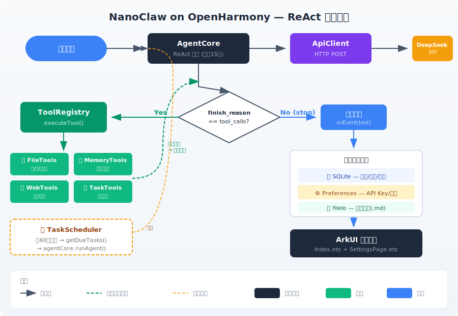

【OpenHarmony】周末，Claude 花了2小时在鸿蒙上复刻了一个OpenClaw

周末才是干正事的时间。

之前一直想试试：AI Agent 能不能跑在鸿蒙上？不是套个 WebView 调网页版那种，是原生的、有工具调用的、能真干活的 Agent。

NanoClaw 是 OpenClaw 的极简版，约 3500 行 TypeScript，实现了 AI Agent 的核心功能：ReAct 循环、工具调用、持久记忆、定时任务。但它跑在 Node.js + Docker 上，用 Claude Agent SDK——鸿蒙上这些都没有。

周末闲着也是闲着。我跟 Claude（Anthropic 的 Opus 4.6，通过 Claude Code 命令行工具）说了一句话："把 NanoClaw 的核心逻辑用纯 ArkTS 重写，跑在 OpenHarmony 上。"

结果：**2 小时，18 个文件，2450 行代码，从零到能跑。**

聊天、搜索、记忆、定时任务，全通了。不是 demo，是能用的东西。

**代码是 Claude 写的，架构是我定的，坑是一起踩的。** 我负责说"要什么"和"不要什么"，Claude 负责把 NanoClaw 的 TypeScript 翻译成 ArkTS，处理鸿蒙 API 的差异，以及修那 60 个编译错误。人机协作的典型案例——人做决策，AI 做执行。

代码全开源，地址放文末。

━━━━━━━━━━━━━━━━━━━━

◆ 先说结论：AI Agent 到底是什么

━━━━━━━━━━━━━━━━━━━━

如果你只记住这篇文章的一句话，记这句：

**Agent = ReAct 循环 + 工具调用。其他全是包装。**

NanoClaw 3500 行 TypeScript，我们用 ArkTS 重写后 2450 行，实现了同样的核心功能。Agent 的灵魂就两件事：让 LLM 思考，让 LLM 动手。

来看架构：



整个 ReAct 循环最多跑 15 次迭代。每次调 DeepSeek API，检查返回的 `finish_reason`——如果是 `tool_calls`，说明模型想用工具（比如搜个网页、存个文件），那就执行工具，把结果塞回对话历史，再调一次 API；如果是 `stop`，说明模型觉得回答完了，存数据库，显示给用户。

💡 翻译成人话：LLM 不是一次性给你答案。它是一个循环——"想一下→动动手→看看结果→再想一下"。就像你查资料写报告，不是凭空编的，是查一点写一点再查一点。Agent 就是把这个过程自动化了。

────────────────────

核心代码就在 `AgentCore.ets` 里。看这段 while 循环：

```typescript
while (iterations < MAX_ITERATIONS) {
    iterations++
    const response = await client.sendMessage(apiMessages, tools)
    const choice = response.choices[0]

    if (choice.finishReason === 'tool_calls' && assistantMessage.toolCalls) {
        // 执行工具，结果追加到 apiMessages，继续循环
        for (const toolCall of assistantMessage.toolCalls) {
            const result = await this.toolRegistry.executeTool(
                toolCall.function.name,
                toolCall.function.arguments,
                toolCall.id
            )
            // 工具结果作为 role:"tool" 追加到对话历史
            apiMessages.push({ role: 'tool', content: result.content, toolCallId: toolCall.id })
        }
        continue  // ← 关键：继续循环
    }

    // 模型说"我回答完了"
    return textContent
}
```

**工具执行失败不中断循环**——错误信息返回给 LLM，让它自己决定下一步。这个设计很重要。你不要替 AI 做决定，它拿到错误信息后可能换个工具试，可能换个参数重来，可能直接告诉用户"我试了但搞不定"。这就是 Agent 和普通聊天机器人的本质区别。

━━━━━━━━━━━━━━━━━━━━

◆ 四把瑞士军刀

━━━━━━━━━━━━━━━━━━━━

Agent 有了 ReAct 循环还不够，得有工具。我们给它配了四把刀。

────────────────────

**1. 文件读写（FileTools）**

在 App 沙箱内操作文件。读、写、列目录，三个函数搞定。

重点是安全——路径穿越防护。用户（或者 LLM 自己）传进来的路径，先过一道 `resolvePath()`：

```typescript
function resolvePath(path: string): string {
    const normalized = path.replace(/\.\.\//g, '').replace(/\.\./g, '')
    if (normalized.startsWith('/')) {
        return `${basePath}${normalized}`
    }
    return `${basePath}/${normalized}`
}
```

所有 `../` 全部干掉，路径永远锁在沙箱里。LLM 再聪明也翻不出去。

────────────────────

**2. 持久记忆（MemoryTools）**

这个最重要。**没有记忆的 Agent 就是金鱼**——每次对话都从零开始，上次聊了什么全忘了。

实现方式极简：Markdown 文件，存在 `filesDir/memory/` 目录下。三个操作：`memory_read`、`memory_write`、`memory_list`。文件名做安全过滤（只保留字母数字下划线横线），内容就是纯文本。

关键是——这些文件跨对话保持。你今天告诉 Agent "我喜欢用 Vim"，下周它还记得。因为 Agent 的系统提示词里写了它有记忆能力，LLM 会自己决定什么时候存、什么时候读。

💡 翻译成人话：你的微信聊天记录不会因为关掉 App 就消失。Agent 的记忆也一样——不是靠 LLM 自己"记住"，而是把重要的东西写成小抄存在本地，下次对话时翻出来看。

────────────────────

**3. 网页抓取 + 搜索（WebTools）**

搜索引擎用 DuckDuckGo 的 HTML 端点。不需要 API Key，不需要注册，直接请求 `https://html.duckduckgo.com/html/?q=xxx`，解析返回的 HTML 提取结果。

网页抓取更简单——HTTP GET 拿到 HTML，`stripHtmlTags()` 去掉标签，截断到 5 万字符返回。

为什么用 DuckDuckGo？因为 Google 要 API Key + 付费，Bing 要 Azure 账号。DuckDuckGo 的 HTML 端点是免费的、不需要认证的、稳定的。对于一个 Agent 来说够用了。

────────────────────

**4. 定时任务（TaskTools + CronParser）**

Agent 可以自己创建定时任务。比如你说"每天早上 9 点给我查一下天气"，它会创建一个 cron 任务，到点自动触发。

这里有个有意思的实现细节：cron 表达式解析器是自己写的。103 行，支持 5 字段标准格式（分 时 日 月 周），支持通配符、范围、步长、列表。

为什么不用 npm 包？**因为鸿蒙上没有 npm 生态。**这一点后面细说。

💡 翻译成人话：Cron 就是"闹钟表达式"。`0 9 * * *` 意思是"每天 9 点 0 分"。`*/30 * * * *` 意思是"每 30 分钟"。103 行代码实现了一个完整的闹钟系统。

━━━━━━━━━━━━━━━━━━━━

◆ 砍了什么，换了什么

━━━━━━━━━━━━━━━━━━━━

这个项目的核心哲学不是"加了什么"，而是"砍了什么"。

对比表：

| NanoClaw 原版 | 本项目替代方案 |
|:---|:---|
| Node.js + Docker | 进程内直接运行 |
| Claude Agent SDK | 自写 ReAct 循环 + DeepSeek HTTP API |
| better-sqlite3 (npm) | @ohos.data.relationalStore |
| cron-parser (npm) | 自写 103 行 |
| 文件系统 IPC 通信 | 同进程直接函数调用 |
| npm 第三方依赖 | **零第三方依赖** |

**零第三方依赖**，这个值得单独说。

整个项目用到的外部能力全部来自 OpenHarmony SDK 自带的 Kit：`@kit.NetworkKit` 做 HTTP 请求，`@kit.ArkData` 做数据库，`@kit.CoreFileKit` 做文件操作，`@kit.AbilityKit` 做应用生命周期。没有一个 npm 包。

这不是因为我们有洁癖，是因为 ArkTS 的 npm 兼容性约等于零。

代码分布：

| 分类 | 行数 |
|:---|:---|
| 核心服务（Agent+API+DB+Config+Scheduler+Registry） | 1046 |
| 工具集（File+Memory+Web+Task） | 513 |
| UI（聊天页+设置页） | 509 |
| 数据模型+工具函数+入口 | 383 |
| **总计** | **2450** |

━━━━━━━━━━━━━━━━━━━━

◆ 存储层三件套

━━━━━━━━━━━━━━━━━━━━

Agent 需要存三类数据，我们用三种不同的存储方式：

**SQLite（@ohos.data.relationalStore）** → 消息、会话、定时任务、运行日志。关系型数据的标准选择，没什么好说的。

**Preferences（@ohos.data.preferences）** → API Key、模型配置、基础 URL。轻量 KV 存储，适合放配置项。

**文件系统（fileIo）** → 记忆文件（`filesDir/memory/*.md`）。Agent 的"小抄本"，Markdown 格式，方便 LLM 读写。

为什么不全塞 SQLite？因为记忆文件本质上是非结构化文本，长度不定，LLM 直接读写纯文本比操作数据库自然得多。配置项又太轻量，单独建表浪费。三层分工，各司其职。

━━━━━━━━━━━━━━━━━━━━

◆ ArkTS 的坑（血泪实录）

━━━━━━━━━━━━━━━━━━━━

先说结论：**ArkTS 不是 TypeScript 的方言，是穿着 TypeScript 外衣的另一门语言。**

从编译错误 60 个到 0 个的过程，挑几个最有代表性的：

────────────────────

**坑 1：对象字面量必须对应明确的 class/interface**

TypeScript 里你可以随手写 `{ type: "object", properties: { url: { type: "string" } } }`，ArkTS 不行。每一个对象字面量都必须有对应的类型声明，否则报 `arkts-no-untyped-obj-literals`。

JSON Schema 这种深度嵌套的结构，你要声明一堆 interface 才能用？太蠢了。

解决方案：`JSON.parse('...')`。把 JSON Schema 写成字符串，运行时解析。编译器管不着运行时。

```typescript
// 编译报错：arkts-no-untyped-obj-literals
const schema = { type: "object", properties: { url: { type: "string" } } }

// 编译通过：骗过编译器
const schema: Record<string, Object> = JSON.parse(
    '{"type":"object","properties":{"url":{"type":"string","description":"The URL to fetch"}},"required":["url"]}'
)
```

丑吗？丑。能用吗？能用。工程就是这样。

────────────────────

**坑 2：不支持索引访问类型**

TypeScript 里 `ApiMessage['role']` 这种写法很常见——取某个接口的某个字段类型。ArkTS 不支持。

解决方案：手写联合字面量。`'system' | 'user' | 'assistant' | 'tool'`，直接写死。

────────────────────

**坑 3：不支持 `as const`、spread `...`、AsyncGenerator**

这三个是 TypeScript 里常用的语法糖。ArkTS 全不支持。

- `as const`：用显式类型标注替代
- `...` spread：用 `for` 循环逐个 push
- AsyncGenerator：用回调替代（`onEvent` 回调模式）

NanoClaw 原版用 AsyncGenerator 做事件流，很优雅。在 ArkTS 里只能改成回调。优雅不起来，但能跑。

────────────────────

**坑 4：`executeSql` 不支持多语句**

这个让我卡了好一会儿。建表的 SQL 脚本里有 7 条 CREATE TABLE/INDEX 语句，用分号隔开。在 Node.js 的 better-sqlite3 里，`exec()` 可以一次性执行多条。在鸿蒙的 relationalStore 里，`executeSql` 一次只能执行一条。

```typescript
// 不行：多条语句一次执行
await this.rdbStore.executeSql(CREATE_SCHEMA)

// 可以：split(';') 逐条执行
const statements = CREATE_SCHEMA.split(';').filter(s => s.trim().length > 0)
for (const stmt of statements) {
    await this.rdbStore.executeSql(stmt.trim())
}
```

────────────────────

**坑 5：ResultSet 必须手动遍历和关闭**

Node.js 的 better-sqlite3 返回的是数组，直接 `.all()` 拿到结果。鸿蒙的 ResultSet 是游标模式——必须 `goToNextRow()` 一行行读，读完必须 `close()`。忘了 close 就等着内存泄漏。

```typescript
const resultSet = await this.rdbStore.querySql(sql, params)
const results: SomeType[] = []
while (resultSet.goToNextRow()) {
    results.push({
        id: resultSet.getString(resultSet.getColumnIndex('id')),
        // ... 逐字段读取
    })
}
resultSet.close()  // ← 忘了这行就完蛋
```

────────────────────

**坑 6：没有 npm 生态**

这是最根本的问题。Node.js/TypeScript 世界里，你需要一个 cron 解析器？`npm install cron-parser`。需要一个 HTTP 客户端？`npm install axios`。需要一个 SQLite 绑定？`npm install better-sqlite3`。

在 ArkTS 世界里，所有这些——你自己写。

cron 解析器 103 行，HTML 标签清理 30 行，UUID 生成 5 行，文本截断 10 行。每一个在 npm 世界里都是一个已经存在的包，在这里全部手搓。

这不是抱怨——实际上手写这些东西让你对每个组件的实现细节了然于胸。但如果你要做一个正经产品，这个开发效率是要打折扣的。

━━━━━━━━━━━━━━━━━━━━

◆ 为什么用 DeepSeek 不用 Claude

━━━━━━━━━━━━━━━━━━━━

NanoClaw 用 Claude Agent SDK。我们换成了 DeepSeek 裸 HTTP 调用，原因很现实：

1. DeepSeek 的 API 是 OpenAI 兼容格式，HTTP 调用就行，不需要 SDK
2. 价格便宜，适合开发调试阶段反复调用
3. 国内网络环境下访问稳定

ApiClient.ets 里的实现就是标准的 OpenAI 格式 HTTP 调用——`/chat/completions` 端点，Bearer Token 认证，JSON 请求体。如果你想换成 Claude、GPT、Qwen 或者任何兼容 OpenAI 格式的模型，改一下 baseUrl 和 apiKey 就行。

**模型是可换的，架构是不变的。**这也是为什么理解 Agent 架构比理解某个特定模型更重要。

━━━━━━━━━━━━━━━━━━━━

◆ 收尾

━━━━━━━━━━━━━━━━━━━━

项目地址：https://github.com/lmxxf/openclaw-on-openharmony

18 个源文件，2450 行纯 ArkTS，零第三方依赖。四个工具全通：文件读写、持久记忆、网页搜索、定时任务。

NanoClaw 3500 行 TypeScript，我们用 ArkTS 重写后 2450 行，功能一样。**重写才是理解的开始**——当你从零构建同样的功能，你就真正明白了这个东西到底在干什么。

而这个"重写"，是我周末跟 Claude 一起干的。我说需求，它写代码，遇到 ArkTS 的坑一起调。2 小时。这就是 2026 年的开发方式。

Agent 的本质就是一个 while 循环。这个结论可能让你失望，但事实就是如此。

────────────────────

◆ 术语速查

────────────────────

| 术语 | 解释 |
|:---|:---|
| ReAct | Reasoning + Acting，LLM 交替"思考"和"使用工具"的循环模式 |
| Tool Use | LLM 通过结构化输出（JSON）声明要调用的工具和参数，由外部程序执行 |
| Agent | 具有自主决策能力的 AI 系统，核心是 ReAct 循环 + 工具调用 |
| Cron | Unix 世界的定时任务表达式，5 个字段：分 时 日 月 周 |
| finish_reason | LLM API 返回的字段，表示模型停止的原因（stop=回答完毕，tool_calls=想用工具） |
| ArkTS | OpenHarmony 的应用开发语言，基于 TypeScript 但有大量限制 |
| DeepSeek | 国产大语言模型，API 兼容 OpenAI 格式 |
| 沙箱 | App 只能访问自己的私有目录，不能访问系统或其他 App 的文件 |

────────────────────

// 靳岩岩的 AI 学习笔记 x Claude 的严谨 x Gemini 的浪漫
// 2026-03-08