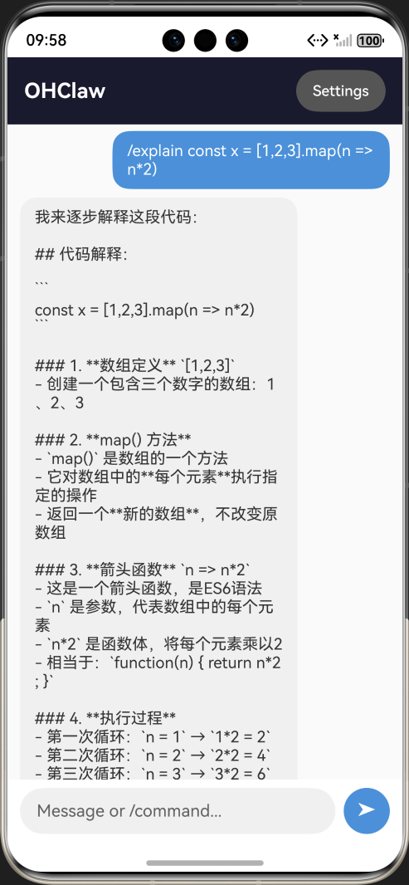
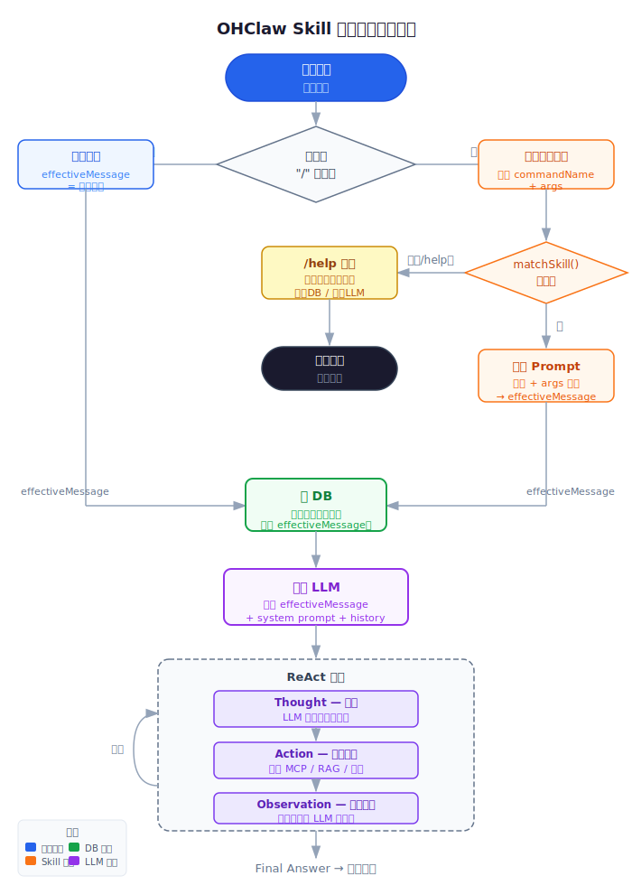
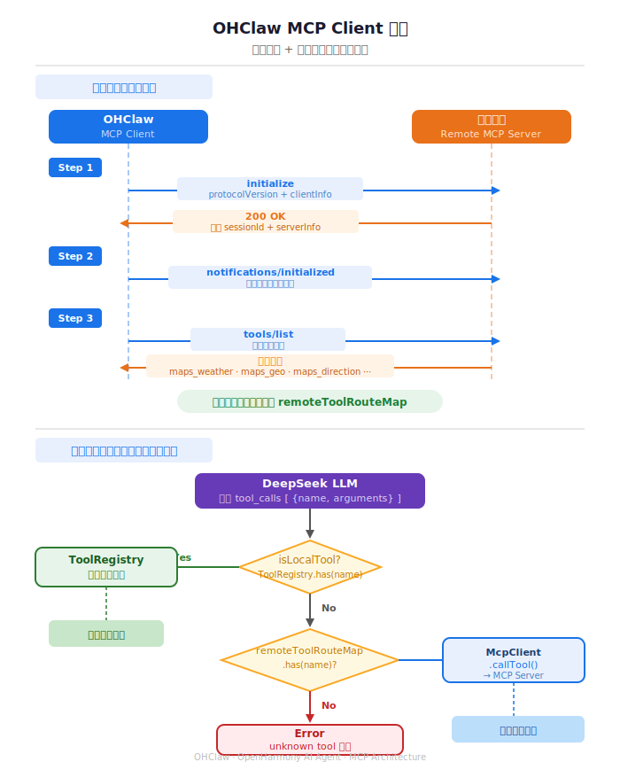
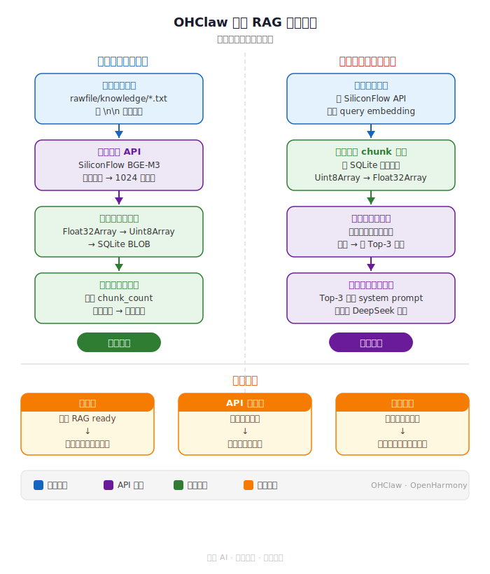

【OpenHarmonyClaw】复刻Claude Agent SDK功能，支持mcp-client/skill/RAG



昨天把 OpenClaw 的精炼版 NanoClaw 移植到了鸿蒙系统上（参见昨天的文章 https://mp.weixin.qq.com/s/jqve7BeE9vRUj-lECdiTrg ）。吃饭的时候随手问了句"北京今天天气怎么样"，Agent 倒是跑起来了——用 DuckDuckGo 搜了一圈，返回一堆英文网页摘要，拼出个半对不对的答案。明明高德地图有现成的天气 API，结果我的 Agent 只会搜网页。再试了下"帮我翻译一下这句话"，它又开始长篇大论地分析语法。

不行，太糙了。于是吃完饭拉上 Claude 继续干活儿。

━━━━━━━━━━━━━━━━━━━━

◆ 先说清楚：我们到底在补什么

━━━━━━━━━━━━━━━━━━━━

昨天移植的 NanoClaw 核心是什么？**ReAct 循环 + 4 个本地工具**。这部分是 NanoClaw 的代码里实现过的。

但 NanoClaw 能跑起来，背后还靠一个关键依赖：**Claude Agent SDK**（`@anthropic-ai/claude-agent-sdk`）。这个 SDK 帮它干了不少活儿，其中最重要的就是 MCP 支持——NanoClaw 调一下 SDK，SDK 帮你连 MCP Server、发现远程工具、转发调用，开发者不用管协议细节。

问题是：**鸿蒙上没有 Claude Agent SDK。** 没有 Node.js，没有 npm，SDK 装都装不上。

昨天我们绕过了这个问题——用 DeepSeek 裸 HTTP API 替代了 Claude SDK 的推理部分，自己写了 ReAct 循环。能聊天、能调本地工具，基本功能跑通了。

但 SDK 提供的不只是推理。今天要补的，就是 SDK 里我们还没替代的那些能力：

| 能力 | Claude Agent SDK | NanoClaw 用了吗 | 我们的实现 |
|:---|:---|:---|:---|
| LLM 推理 | SDK 内置 Claude API 调用 | 是 | ✅ 昨天搞定（DeepSeek HTTP） |
| ReAct 循环 | SDK 驱动 | 是 | ✅ 昨天搞定（自写 while 循环） |
| MCP Client | SDK 内置 MCP stdio transport | 是 | 🔧 今天实现（Streamable HTTP） |
| RAG 知识检索 | SDK 不提供，OpenClaw 完整版靠 Docker 里的向量数据库 | 否 | 🔧 今天从零实现 |
| Skill 斜杠命令 | SDK 不提供，NanoClaw 也没有 | 否 | 🔧 今天自己加的 |

换句话说：**MCP Client 是替代 SDK 里已有的能力，RAG 和 Skill 是我们额外加的。** 三个功能加起来，OHClaw 在功能上已经超过了 NanoClaw 原版。

但不管是替代还是新增，它们作用在 Agent 架构上的位置各不相同：

```
用户输入
  │
  ├─ Skill 改的是【输入】：/translate 你好 → 展开成 prompt 模板
  │
  ├─ RAG 改的是【上下文】：检索知识库，注入 system prompt
  │
  └─ MCP 扩展的是【工具列表】：本地工具 + 远程工具合并
        │
        ▼
    ReAct 循环（昨天已实现，今天不动）
```

**ReAct 循环本身一行没改。** 今天做的三件事，全是在循环外围"喂料"。

下面从简单到复杂，一个一个来。

━━━━━━━━━━━━━━━━━━━━

◆ Skill 斜杠命令：最简单的扩展机制

━━━━━━━━━━━━━━━━━━━━



先说 Skill 是什么：**一个 JSON 文件 = 一个斜杠命令**。

比如翻译：

```typescript
// skills/translate.json
{
  "name": "translate",
  "command": "/translate",
  "description": "翻译文本到英文",
  "prompt": "Translate the following text to English. Output only the translation, nothing else.\n\n{{input}}"
}
```

用户输入 `/translate 你好`，App 把 `{{input}}` 替换成"你好"，展开成完整的 prompt 发给 LLM。LLM 不知道这是一个"命令"，它只看到一段要求它翻译的提示词。

所有 Skill 放在 `rawfile/skills/` 目录下，有一个索引文件 `skills_index.json` 记录哪些 Skill 存在。App 启动时加载全部 Skill。

────────────────────

核心匹配逻辑：

```typescript
private matchSkill(userMessage: string): string | null {
    const trimmed = userMessage.trim()
    if (!trimmed.startsWith('/')) return null

    // 拆分：/command 后面的部分是 input
    const spaceIdx = trimmed.indexOf(' ')
    let command = spaceIdx === -1 ? trimmed : trimmed.substring(0, spaceIdx)
    let input = spaceIdx === -1 ? '' : trimmed.substring(spaceIdx + 1).trim()

    if (command === '/help') return null  // /help 走单独逻辑

    for (const skill of this.skills) {
        if (skill.command === command) {
            return skill.prompt.replace('{{input}}', input)
        }
    }
    return null
}
```

遍历 skills 数组，匹配 command 字符串，替换模板变量，完事。

────────────────────

在 `runAgent` 入口处做拦截：

```typescript
// /help → 直接返回帮助文本，不调 LLM
if (userMessage.trim() === '/help') {
    onEvent({ type: 'text', content: this.getHelpText() })
    onEvent({ type: 'done' })
    return
}

// /command → 展开 prompt 模板
const skillPrompt = this.matchSkill(userMessage)
const effectiveMessage = skillPrompt !== null ? skillPrompt : userMessage
```

注意一个细节：**存数据库的是原始输入**（`/translate 你好`），**发给 LLM 的是展开后的 prompt**。用户回看聊天记录时看到的是自己打的命令，不是一大段提示词。

💡 想加新命令？往 `rawfile/skills/` 丢一个 JSON 文件，在 `skills_index.json` 里注册一行，不改代码。这就是"数据驱动"的好处——扩展靠配置不靠代码。

━━━━━━━━━━━━━━━━━━━━

◆ MCP Client：让 Agent 接入外部工具服务

━━━━━━━━━━━━━━━━━━━━



MCP 全称 Model Context Protocol，2025 年出的标准协议，干一件事：**让 AI Agent 用标准方式接入任意外部工具服务**。

之前 Agent 的工具都是本地写死的（文件读写、网页搜索那些）。有了 MCP，你可以接高德地图、接数据库、接任何实现了 MCP 协议的服务，Agent 自动发现远程工具并使用。

我们实现了一个标准的 MCP Streamable HTTP Client。

────────────────────

**三步握手**

MCP 连接需要三步：

```typescript
// Step 1: initialize — 报告客户端身份，拿到 sessionId
const initRequest = {
    jsonrpc: '2.0', id: this.nextId(),
    method: 'initialize',
    params: {
        protocolVersion: '2025-03-26',
        capabilities: {},
        clientInfo: { name: 'OHClaw', version: '1.0.0' }
    }
}
const initResult = await this.postJsonRpcWithHeaders(url, '', body)
state.sessionId = initResult.sessionId  // 从响应头 Mcp-Session-Id 取

// Step 2: notifications/initialized — 通知 server 握手完成
const notification = { jsonrpc: '2.0', method: 'notifications/initialized' }
await this.postJsonRpc(url, state.sessionId, body)

// Step 3: tools/list — 获取这个 server 提供的所有工具
const toolsRequest = { jsonrpc: '2.0', id: this.nextId(), method: 'tools/list' }
const toolsResponse = await this.postJsonRpc(url, state.sessionId, body)
state.tools = toolsResponse.result['tools']  // 拿到工具列表
```

三步走完，client 就知道远程 server 有哪些工具可用了。

💡 类比一下：就像去餐厅——先跟服务员打招呼（initialize），服务员确认"可以点菜了"（initialized），然后给你菜单（tools/list）。后面你点菜（tools/call），服务员去后厨做好端上来。

────────────────────

**工具格式转换**

MCP 的工具格式和 OpenAI 的 function calling 格式不完全一样，需要转换：

```typescript
getAllRemoteToolsAsOpenAi(): ToolDefinition[] {
    const result: ToolDefinition[] = []
    for (const server of this.servers) {
        if (!server.ready) continue
        for (const tool of server.tools) {
            result.push({
                type: 'function',
                function: {
                    name: tool.name,
                    description: tool.description + ' [via ' + server.config.name + ']',
                    parameters: tool.inputSchema
                }
            })
        }
    }
    return result
}
```

description 后面追加了 `[via 高德地图]`，这样 LLM 知道这个工具来自哪个服务。转换完之后，DeepSeek 直接就能用了——它只认 OpenAI 格式。

────────────────────

**工具路由：三级分发**

Agent 收到 LLM 的 tool_calls 后，怎么知道该找谁执行？

```typescript
if (this.isLocalTool(toolName)) {
    // 本地工具 → ToolRegistry 执行
    result = await this.toolRegistry.executeTool(toolName, args, callId)
} else if (this.remoteToolRouteMap.has(toolName)) {
    // MCP 远程工具 → 找到对应 server，JSON-RPC 调用
    const serverIdx = this.remoteToolRouteMap.get(toolName)!
    const mcpResult = await this.mcpClient.callTool(serverIdx, toolName, args)
    result = { toolCallId: callId, content: mcpResult, isError: false }
} else {
    // 未知工具 → 报错
    result = { toolCallId: callId, content: `Error: unknown tool "${toolName}"`, isError: true }
}
```

`remoteToolRouteMap` 是一个 `Map<toolName, serverIndex>`，握手阶段建好的。每个工具名映射到哪个 server，一查就知道。

────────────────────

**两个实战细节**

1. **Session 过期自动重连**：MCP server 可能会过期断开。`callTool` 失败后，自动重新走一遍三步握手，然后重试一次。

2. **SSE 兼容**：有些 MCP server 返回的不是纯 JSON，而是 SSE 格式（`data: {...}`）。解析时要先检测，把 `data:` 前缀剥掉再 JSON.parse。

```typescript
// SSE 格式兼容
if (jsonStr.startsWith('data:') || jsonStr.startsWith('event:')) {
    const lines = jsonStr.split('\n')
    for (const line of lines) {
        if (line.startsWith('data:')) {
            jsonStr = line.slice(5).trim()
            break
        }
    }
}
```

**实测**：接了高德地图 MCP Server（`https://mcp.amap.com/mcp?key=xxx`），握手后拿到 12 个地图工具——路线规划、POI 搜索、天气查询、地理编码等。问 Agent "从望京到国贸怎么走"，它自动调路线规划工具，返回详细路线。

━━━━━━━━━━━━━━━━━━━━

◆ RAG 向量检索：端侧知识库

━━━━━━━━━━━━━━━━━━━━



这是三个功能里最复杂的。

RAG = Retrieval-Augmented Generation，检索增强生成。说人话：**让 Agent 先查资料再回答问题**。

我们做的是端侧 RAG——知识库随 App 安装包分发。流程：

1. 启动时加载文本 → 切片
2. 调 SiliconFlow BGE-M3 算 embedding（把文字变成向量）
3. 向量存 SQLite
4. 用户提问时，问题也算 embedding → 余弦相似度匹配 → 取最相关的 Top-K 片段
5. 检索结果拼到 system prompt 尾部，LLM 基于这些上下文回答

💡 Embedding 是什么？简单说，就是把一段文字变成一组数字（向量）。意思相近的文字，向量的"方向"也接近。"北京天气"和"今天气温多少"的向量会比较接近，而"北京天气"和"红烧肉做法"就差很远。通过比较向量的方向（余弦相似度），就能找到最相关的知识片段。

────────────────────

**Embedding API 调用**

```typescript
private async callEmbeddingApi(texts: string[]): Promise<number[][] | null> {
    const body: EmbeddingRequest = {
        model: this.config.model,        // BAAI/bge-m3
        input: texts,                     // 支持批量
        encoding_format: 'float'
    }

    const response = await httpRequest.request(this.config.apiUrl, {
        method: http.RequestMethod.POST,
        header: {
            'Content-Type': 'application/json',
            'Authorization': 'Bearer ' + this.config.apiKey
        },
        extraData: JSON.stringify(body)
    })

    const parsed = JSON.parse(responseStr) as EmbeddingResponse
    // 按 index 排序，确保顺序正确
    const sorted = parsed.data.slice().sort((a, b) => a.index - b.index)
    return sorted.map(item => item.embedding)
}
```

标准 OpenAI embedding 格式，SiliconFlow 的 BGE-M3 模型，1024 维向量，**免费**。批量发送，一次请求算多段文字的 embedding。

────────────────────

**向量存储：Float32Array → SQLite BLOB**

向量怎么存数据库？每个 1024 维向量就是 1024 个浮点数。

```typescript
// 存：number[] → Float32Array → Uint8Array → SQLite BLOB
private floatArrayToBlob(arr: number[]): Uint8Array {
    const float32 = new Float32Array(arr.length)
    for (let i = 0; i < arr.length; i++) float32[i] = arr[i]
    return new Uint8Array(float32.buffer)
}

// 取：SQLite BLOB → Uint8Array → Float32Array → number[]
private blobToFloatArray(blob: Uint8Array): number[] {
    const float32 = new Float32Array(blob.buffer, blob.byteOffset, blob.byteLength / 4)
    const result: number[] = []
    for (let i = 0; i < float32.length; i++) result.push(float32[i])
    return result
}
```

每个向量 4096 字节（1024 维 x 4 字节/float）。SQLite 的 BLOB 类型天然支持存二进制数据。

────────────────────

**余弦相似度：手写 15 行**

```typescript
private cosineSimilarity(a: number[], b: number[]): number {
    let dot = 0, normA = 0, normB = 0
    const len = Math.min(a.length, b.length)
    for (let i = 0; i < len; i++) {
        dot += a[i] * b[i]
        normA += a[i] * a[i]
        normB += b[i] * b[i]
    }
    if (normA === 0 || normB === 0) return 0
    return dot / (Math.sqrt(normA) * Math.sqrt(normB))
}
```

余弦相似度 = 两个向量的点积 / (各自的模长之积)。值在 -1 到 1 之间，越接近 1 越相似。公式就是高中数学里的向量夹角公式。

────────────────────

**检索流程**

```typescript
async retrieveByVector(query: string, topK: number): Promise<string[]> {
    // 1. 问题 → embedding
    const queryVec = (await this.callEmbeddingApi([query]))[0]

    // 2. 全表扫描，逐条算余弦相似度
    const resultSet = await this.store.query(predicates, ['chunk_text', 'doc_id', 'embedding'])
    const scored: ScoredVectorChunk[] = []
    while (resultSet.goToNextRow()) {
        const text = resultSet.getString(resultSet.getColumnIndex('chunk_text'))
        const blob = resultSet.getBlob(resultSet.getColumnIndex('embedding'))
        const chunkVec = this.blobToFloatArray(blob)
        const score = this.cosineSimilarity(queryVec, chunkVec)
        scored.push({ text, score, docId })
    }
    resultSet.close()

    // 3. 排序取 Top-K
    scored.sort((a, b) => b.score - a.score)
    return scored.slice(0, topK).map(s => s.text)
}
```

是的，**全表扫描**。每次查询都遍历所有向量。这在端侧知识库（几十到几百个 chunk）的规模下完全可接受。要是上万条，就该上 ANN 索引（HNSW、IVF 那些）了，但那是另一个量级的问题。

────────────────────

**降级策略**

RAG 有三层保底：

```typescript
private async buildSystemPrompt(userMessage: string): Promise<string> {
    let prompt = SYSTEM_PROMPT

    // 优先：向量检索
    if (this.vectorRagService.isReady()) {
        const ragResults = await this.vectorRagService.retrieveByVector(userMessage, 3)
        if (ragResults.length > 0) {
            prompt += '\n\nRelevant knowledge base context:\n'
            for (const chunk of ragResults) prompt += '---\n' + chunk + '\n'
            return prompt
        }
    }

    // 降级：关键词匹配
    if (this.knowledgeChunks.length > 0) {
        const relevant = this.keywordRetrieve(userMessage, 3)
        if (relevant.length > 0) {
            prompt += '\n\nRelevant knowledge base context:\n'
            for (const chunk of relevant) prompt += '---\n' + chunk + '\n'
        }
    }
    return prompt
}
```

| 状态 | 行为 |
|:---|:---|
| 向量 RAG ready | 调 embedding API 做向量检索 |
| 向量 RAG 不可用（没 API key / API 失败） | 降级到关键词匹配 |
| 没有知识库 | 不注入任何上下文 |

关键词匹配的逻辑也不复杂：遍历所有 chunk，keywords 命中 +1 分，query 里的词在文本中出现 +0.5 分，取分最高的。不如向量检索准，但总比没有强。

────────────────────

**增量索引**

```typescript
// 用 chunk_count 做简单的增量检测
const existingCount = await this.getMetaValue('chunk_count')
if (existingCount === chunks.length.toString()) {
    this.status = 'ready'   // 数量没变，跳过重建
    return true
}
```

不精确，但管用。知识库没变动就不重新算 embedding，省 API 调用。

**状态机**：`uninitialized → indexing → ready`，或者任何一步失败就 `→ fallback`。

━━━━━━━━━━━━━━━━━━━━

◆ 收尾

━━━━━━━━━━━━━━━━━━━━

更新后的完整流程：

```
用户输入
  ├─ /help → 直接返回帮助文本
  ├─ /command → Skill 展开 prompt 模板
  └─ 普通消息 → 直接走 ReAct
        ↓
    RAG 注入 system prompt（向量检索 → 关键词降级）
        ↓
    合并本地工具 + MCP 远程工具
        ↓
    ReAct 循环 → DeepSeek API
        ↓
    工具路由：本地 → MCP → 报错
```

代码分布（更新后）：

| 分类 | 行数 |
|:---|:---|
| 核心服务（Agent + API + DB + Config + Scheduler + Registry） | 1046 |
| **新增：MCP Client** | **416** |
| **新增：VectorRagService** | **361** |
| **新增：AgentCore 扩展（Skill + RAG 集成）** | ~250（含在 AgentCore 627 行中） |
| 工具集（File + Memory + Web + Task） | 513 |
| UI（聊天页 + 设置页） | 621 |
| 数据模型 + 工具函数 + 入口 | 234 |
| **总计** | **约 3770** |

从 v1 的 2450 行到 v2 的 3770 行，多了 1320 行，主要就是 McpClient（416 行）和 VectorRagService（361 行）两个新文件，加上 AgentCore 从 350 行膨胀到 627 行。

项目地址：https://github.com/lmxxf/openclaw-on-openharmony

────────────────────

三个功能的复杂度差别很大：Skill 就是字符串模板替换，MCP 是标准网络协议实现，RAG 涉及向量数学和存储。但它们的共同点是——**都在给 Agent 的 ReAct 循环"喂料"**。Skill 改的是输入，RAG 改的是上下文，MCP 扩展的是工具列表。循环本身没变，还是那个 while。

────────────────────

◆ 术语速查

────────────────────

| 术语 | 解释 |
|:---|:---|
| MCP | Model Context Protocol，AI Agent 接入外部工具的标准协议，基于 JSON-RPC |
| RAG | Retrieval-Augmented Generation，先检索再生成，让 LLM 基于外部知识回答 |
| Embedding | 把文本转成固定维度的浮点向量，语义相近的文本向量方向接近 |
| Cosine Similarity | 余弦相似度，衡量两个向量方向的接近程度，值域 [-1, 1] |
| BGE-M3 | BAAI 开源的多语言 embedding 模型，支持中英文，1024 维 |
| SiliconFlow | 国内 AI 推理平台，提供免费的 embedding API |
| JSON-RPC | 基于 JSON 的远程过程调用协议，MCP 的底层传输格式 |
| Skill | OHClaw 的斜杠命令机制，一个 JSON 文件定义一个 prompt 模板 |
| SSE | Server-Sent Events，服务端推送格式，部分 MCP server 用这种格式返回 |
| Top-K | 取排名前 K 个结果，K 是一个参数（我们设的 3） |

────────────────────

对了，当我说"手写"的时候，意思是我在 Claude Code 里面 prompt 给 Claude 去干活儿。至于我自己？我唯一的输入框是prompt，代码编辑框里面，一个字符我都不敲！😄 2026 年了，"写代码"这个词的含义已经变了。

────────────────────

// 靳岩岩的 AI 学习笔记 x Claude 的严谨 x Gemini 的浪漫
// 2026-03-08