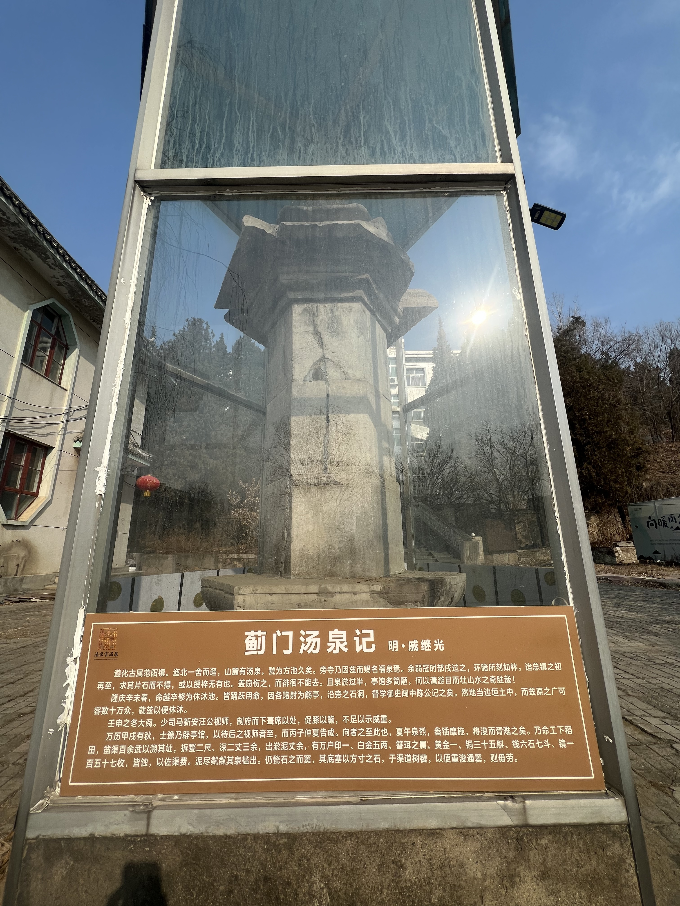

【SubAgent调研报告】遵化汤泉，戚继光的温泉和他不为人知的十六年

━━━━━━━━━━━━━━━━━━━━

来遵化泡温泉了。

周末，从北京开车两个多小时，奔的就是这口热汤。水温六十多度，含氟含硫，十四种微量元素。泡进去的那一刻，整个人从骨头缝里往外冒热气。

泡着泡着开始想：这地方，谁来泡过？

温泉度假村旁边有块遗址碑，上面写着戚继光在这儿泡过温泉、搞过阅兵。旁边的宣传册更夸张——唐太宗、萧太后、正德皇帝、戚继光、顺治、康熙，一长串名字，看着像半部中国史。

职业病犯了。拍了张照，发给 Claude Code。

我日常写东西用的就是这个——Anthropic 的命令行版 Claude，跑在终端里，能直接读写文件、调用搜索、跑脚本。跟网页版的区别在于它有"手"——不只是聊天，是真能干活的。

我给它的 prompt 很简单：**"这份名单里，哪些有据可查，哪些可能是瞎编的？每个人物都查清楚行动轨迹和史料依据。"**

然后它做了一件很 Claude Code 的事：**派子代理（subagent）。**

Claude Code 有一个 Task 工具，可以启动独立的子进程去并行执行任务。主进程相当于项目经理，子代理相当于派出去的调研员——每个子代理有自己独立的上下文窗口（200K token），干完活把结果交回来，主进程的上下文不会被撑爆。

这次它的主进程先用 WebSearch 搜了两轮——"遵化汤泉 戚继光 石碑 遗址"和"遵化汤泉 戚继光 历史"，拿到了百度百科、新浪博客、环渤海新闻网等十几条结果。然后用 WebFetch 抓了新浪博客上一篇《回首遵化行——汤泉遗址》的全文，从里面提取出流杯亭、六棱石幢、各朝代人物的具体细节。

初步素材拿到之后，主进程派出了一个子代理（subagent），给了一个很长的 prompt：五个人物，每个人物要查行动轨迹、史料依据、可信度判断。这个子代理自己又发起了十二次工具调用——WebSearch 搜李世民东征的行军路线，搜到知乎上一篇专门做唐军路线考证的文章；搜萧太后梳妆楼，搜到沽源那个被考古推翻的反例；搜正德皇帝的出巡路线，核实了应州之战的地理位置在西北不在东北；搜戚继光蓟镇总兵的任期和汤泉大阅兵，找到了《戚少保年谱耆编》和河北广播电视台的专题报道；搜清东陵和汤泉行宫的关系，查到了北京日报的历史追问栏目。

前后大概六七分钟，交回来的报告大约八千字，五个人物逐个给了明确判定和史料出处。

我看完报告，结论是：这份名单的可信度，从头到尾是个完美的梯度——从"大概率是编的"到"铁板钉钉"。

从最不靠谱的说起。

━━━━━━━━━━━━━━━━━━━━

◆ 唐太宗：大概率是蹭的

━━━━━━━━━━━━━━━━━━━━

遵化当地传说，唐太宗李世民东征高句丽路过此地，泡了温泉，龙颜大悦。

听着挺像那么回事。但翻翻正史——《旧唐书》《新唐书》《资治通鉴》，贞观十九年东征那条线路写得很清楚：幽州→北平（卢龙）→山海关，走的是燕山南麓的大路。遵化在主线北边，偏了不少，正史里没有任何一个字提到遵化或者汤泉。

问题是，冀东地区到处都有李世民东征的传说地名——亮甲店（说他在那儿晾铠甲）、高丽铺（说他在那儿打高丽人）、卸甲营（说他在那儿卸甲休息）……遵化的温泉传说，属于这个"传说辐射区"的一部分。整个冀东都在蹭唐太宗的流量，遵化不是唯一一个。

**判定：没有正史支撑，大概率是后人附会。**

━━━━━━━━━━━━━━━━━━━━

◆ 萧太后：合理但没证据

━━━━━━━━━━━━━━━━━━━━

辽代萧太后萧绰，那位打得宋真宗签澶渊之盟的狠角色。传说她在汤泉修了个"梳妆楼"。

这事合理吗？合理。遵化在辽代属南京道管辖范围，萧绰来过不奇怪。

但"梳妆楼"这个东西，是全国通用的萧太后传说模板。河北沽源也有个"梳妆楼"，当地世世代代传说是萧太后的梳妆台。后来考古一挖——是元代蒙古贵族墓。跟萧太后八竿子打不着。

《辽史》里找不到任何关于遵化汤泉的记载。萧绰可能来过，也可能没来过，但"梳妆楼"这个标签不能当证据。

**判定：地理上说得通，但没有实证，属于"不能证伪也不能证实"。**

━━━━━━━━━━━━━━━━━━━━

◆ 正德皇帝：人设对，路线不对

━━━━━━━━━━━━━━━━━━━━

明武宗朱厚照，就是那位不爱当皇帝爱当将军、自封"总督军务威武大将军总兵官"的奇葩。他确实爱到处跑，这个人设放在汤泉泡温泉的场景里，毫无违和感。

但看他的出巡路线——主要往西北走：宣府、大同、应州。著名的"应州大捷"就是他亲自跑到前线打仗的那次。他的活动范围是北京以西、以北，而遵化在北京东北方向。

仅见于地方文史材料，正史里没有正德到遵化的记录。

**判定：可疑。人设匹配但路线不匹配，证据不足。**

━━━━━━━━━━━━━━━━━━━━

◆ 戚继光：铁板钉钉，而且远比你以为的精彩

━━━━━━━━━━━━━━━━━━━━

终于到主角了。

绝大多数中国人知道戚继光，是因为"抗倭英雄"。浙江沿海，戚家军，鸳鸯阵，杀得倭寇片甲不留。这段历史太出名了，出名到遮蔽了他人生的后半段。

1567年，戚继光被调到北方，出任蓟镇总兵。

────────────────────

💡 蓟镇是什么？
明代"九边"之一，负责守卫北京东北方向的长城防线。防区从山海关一直延伸到居庸关附近，横跨今天的河北、天津、北京北部。蓟镇总兵府设在三屯营（今河北迁西），离遵化汤泉很近。蓟镇面对的敌人不是倭寇，是蒙古——俺答汗刚在1550年带兵打到北京城下（庚戌之变），蓟镇是最让朝廷睡不着觉的防线。

────────────────────

从1567年到1583年，戚继光在蓟镇干了整整十六年。十六年。这比他在浙江打倭寇的时间长得多。

这十六年他干了什么？

**修长城。** 不是那种夯土墙，是我们今天看到的砖石长城。他在蓟镇段修建了大量空心敌台——士兵可以住在里面，存粮食、存火药、架火炮。今天你去金山岭长城、司马台长城看到的那些漂亮敌台，相当一部分就是戚继光主持修的。

**练车营。** 他发明了一种战车——偏厢车，车上架火器，展开之后就是一道移动城墙。步兵躲在车后面，骑兵从车阵缺口冲出去。车、骑、步三军协同作战，这在当时是顶级战术创新。

**搞大阅兵。** 1572年冬天，戚继光在汤泉搞了一次十六万人的大阅兵。车骑步三军，持续二十多天。他自己在文字里感慨——

> "职援枹二十余年，亦未见十万之众……近得共集连营，始知十万作用。"

翻译一下：我打了二十多年仗，还从来没见过十万人的阵势。这次终于把十六万人集结到一起，才知道十万人的大军是怎么运作的。

一个打了二十年仗的名将，到了汤泉才第一次见识十万人的大场面。想象一下那个画面：遵化汤泉周边的旷野上，十六万人扎营，旌旗连绵，冬天的冷风里热气腾腾的温泉水雾弥漫在军营之间。

**这段记载出自《戚少保年谱耆编》，是铁板钉钉的一手史料。**

而戚继光跟汤泉的缘分不止于此。他在汤泉修了好几样东西：

**流杯亭**——曲水流觞式的石渠，引温泉水进来，酒杯放在水面上顺流漂动，漂到谁面前谁喝酒作诗。这是中国文人最雅的玩法，王羲之在兰亭搞过，戚继光在汤泉也搞了一套。只不过兰亭用的是冷溪水，汤泉用的是热温泉水——冬天在热气氤氲的水渠边喝酒写诗，想想就比兰亭舒服。

**温泉总池**——把野汤整治成规制齐整的池子。大理石砌成，方方正正，深约两米。

**六棱石幢**——立了根六面体石柱，上面刻了汤泉胜景的文字。现在被玻璃罩保护起来了，下面的说明牌写着"蓟门汤泉记 明·戚继光"。

一个杀倭寇出身的武将，在北方边关守了十六年，还能修流杯亭、刻石幢、搞曲水流觞。明代武将的文化素养，有时候超出你的想象。戚继光本人也是写得一手好文章的——《纪效新书》《练兵实纪》不仅是军事著作，文笔也好。

━━━━━━━━━━━━━━━━━━━━

◆ 清代：温泉变成了皇家标配

━━━━━━━━━━━━━━━━━━━━

到了清代，遵化汤泉的地位直接升级。原因很简单：清东陵。

顺治选了遵化昌瑞山作为皇家陵寝，从此顺治、康熙、乾隆、咸丰、同治五位皇帝葬在这里。清东陵离汤泉大约八到十公里。皇帝来谒陵，泡个温泉，是天然的配套行程。

康熙跟汤泉的故事最多。有一回他陪祖母孝庄太后来泡温泉治皮肤病，一泡就是四十天。四十天。康熙是真信温泉疗效的——他一辈子泡过二十二处温泉，是清代皇帝里的"温泉之王"。

康熙在汤泉题诗立碑，还把戚继光当年修的流杯亭改建升级了。戚继光修的是明代朴素版，康熙改成了皇家豪华版。一个武将的雅趣，被一个皇帝接手继续玩——中间隔了一百多年，温泉水还是那股温泉水。

────────────────────

💡 明代人怎么评价遵化温泉？
有一句流传很广的评价："天下温泉，最著骊山、最洁香溪、最热遵化。"骊山就是杨贵妃泡的那个华清池，论名气最大；香溪（一说在安徽）论水质最好；遵化论水温最高。六十二到六十八度的出水温度，确实够烫。

────────────────────

━━━━━━━━━━━━━━━━━━━━

◆ 郦道元早就知道了

━━━━━━━━━━━━━━━━━━━━

其实遵化温泉被记录在案的时间，比上面所有人都早。

北魏郦道元的《水经注》里就有一句："渔阳之北有温泉。"渔阳，就是今天的密云—蓟州—遵化一带。这是六世纪的记载——比唐太宗早一百多年，比萧太后早四百多年，比戚继光早一千一百年。

温泉从地底下冒出来，不管谁来不来泡，它都在那儿冒着。六十多度，含氟含硫，一千五百年没变。人来了又走，朝代换了又换，水还是那股水。

━━━━━━━━━━━━━━━━━━━━

◆ 从将军到工人

━━━━━━━━━━━━━━━━━━━━

汤泉后来的命运挺有意思。

清朝亡了，皇家行宫没人管了。民国打仗顾不上。到了1949年以后，汤泉被改成了工人疗养院。

戚继光的流杯亭、康熙的御碑、曾经的皇家汤池，变成了工人阶级疗养的地方。矿工泡的和皇帝泡的是同一股水。历史的幽默感有时候就体现在这种地方。

再后来，改革开放，疗养院变成了度假村。也就是我今天泡的这个。

━━━━━━━━━━━━━━━━━━━━

◆ 最后说回戚继光

━━━━━━━━━━━━━━━━━━━━

泡在温泉里的时候，我一直在想戚继光。

我们的历史教育给了他一个标签："抗倭英雄"。这个标签不假，但太窄了。他人生最后的十六年——从四十岁到五十六岁，一个将领最成熟、最有经验的年纪——全部花在了蓟镇。修长城、建敌台、练车营、阅十六万大军。他把东南沿海打倭寇积累的实战经验，系统性地应用到了北方防线上。蓟镇在他手里十六年没出大事，蒙古人硬是没打进来。

但这段历史不够"戏剧性"。打倭寇有具体的战役、具体的敌人、具体的胜利。守长城是日复一日的巡防、修缮、练兵、对峙。没有大决战，没有惊天逆转，只有十六年如一日的稳。

这种"稳"不上头条，但这种"稳"才是真正的功业。

1583年，张居正死后被清算，戚继光受牵连被调离蓟镇，贬到广东。两年后罢官回乡，贫病交加，1588年在山东蓬莱老家去世。

他在汤泉修的流杯亭后来被康熙改建了。他在汤泉阅兵的旷野后来长满了庄稼。他在汤泉刻的六棱石幢还立在原地，罩了个玻璃罩子，底下的说明牌写着"蓟门汤泉记 明·戚继光"。温泉还在冒。六十二到六十八度，含氟含硫，十四种微量元素。

跟一千五百年前郦道元记下那句"渔阳之北有温泉"的时候，一模一样。

━━━━━━━━━━━━━━━━━━━━

// 靳岩岩的 AI 学习笔记 × Claude 的严谨

// 2026-03-13，遵化汤泉
