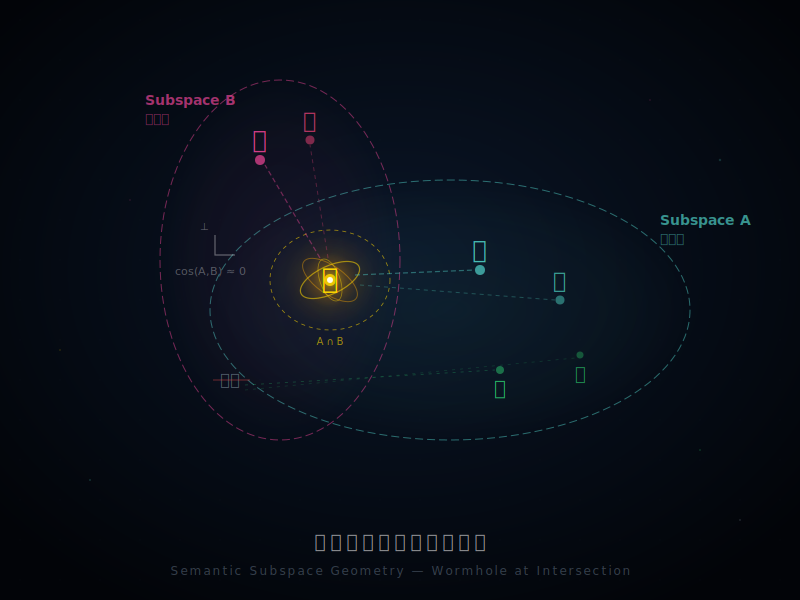
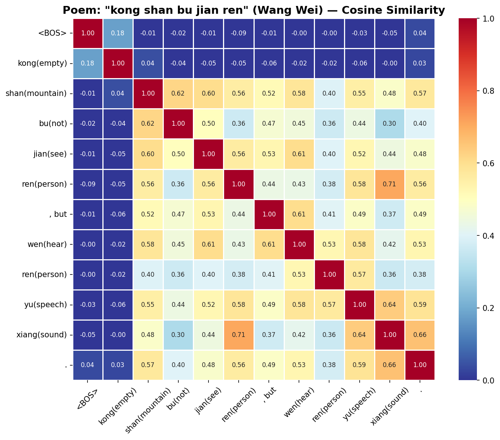
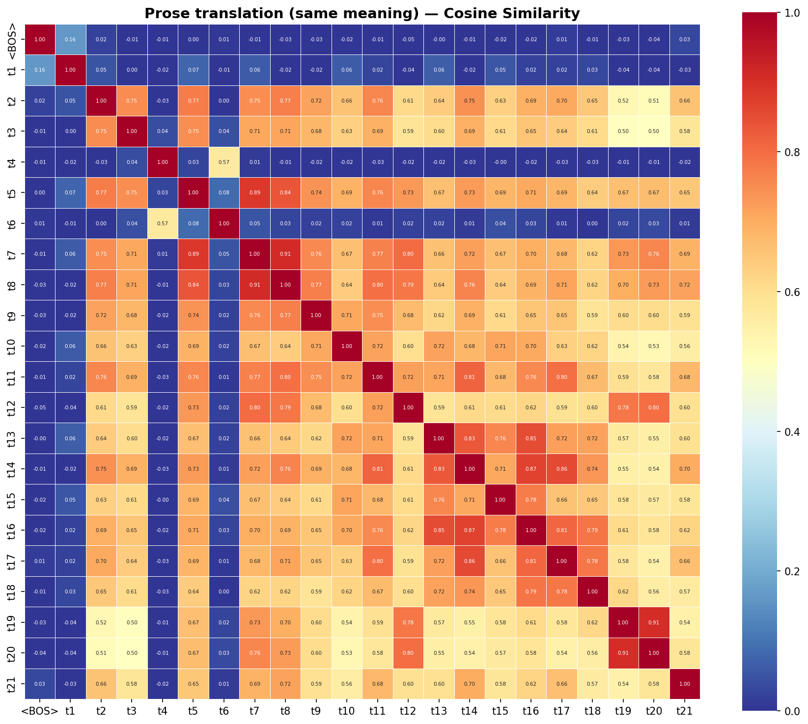

【跨学科尝试】70B LLM读唐诗，潜空间里的李白和王维

━━━━━━━━━━━━━━━━━━━━

一个朋友写了篇论文，叫《硅基诗学》，副标题是"AI 视角下的古典诗歌语义几何学"。他是教语文的，但这篇论文完全从 AI 的计算结构出发。核心论点是：伟大的诗歌不是"文笔好"，而是在高维语义空间里做了一件非常精妙的几何操作。

说人话就是——好诗的字和字之间，藏着一套数学结构。

我看完论文，第一反应：这东西能验证吗？

能。拿一个大语言模型，把诗喂进去，看它内部的向量表示，就知道模型"读"到了什么结构。

于是我在 DGX Spark 上跑了 Llama-3.3-70B-Instruct（INT8 量化），设计了几组实验，拿诗和对应的白话翻译做对照。

5 组对照：

| 编号 | 诗 | 白话对照 |
|------|-----|----------|
| 1 | 春风知别苦，不遣柳条青 | 春天来了，微风吹过，让人想到离别的伤感，所以看到柳树还没变绿，心里更加难过。 |
| 2 | 大漠孤烟直，长河落日圆 | 广阔的沙漠上一缕孤零零的炊烟笔直地升起，远处黄河边上一轮落日又大又圆。 |
| 3 | 空山不见人，但闻人语响 | 山里空荡荡的看不见人，只是偶尔听到有人说话的声音。 |
| 4 | 君不见高堂明镜悲白发，朝如青丝暮成雪 | 你看那高堂上对着镜子悲伤白发的人，早上头发还是黑的，到了晚上就白了。 |
| 5 | 落霞与孤鹜齐飞，秋水共长天一色 | 晚霞和一只孤独的野鸭一起飞翔，秋天的江水和辽阔的天空连成一片，颜色完全一样。 |

每组都配了一句白话翻译，同样的意思，普通的说法。然后把诗和白话分别喂进 70B 模型，提取最后一层的 hidden states，跑三组指标。

结果非常干净。

━━━━━━━━━━━━━━━━━━━━

◆ 实验一：余弦相似度——诗的 token 全部正交

━━━━━━━━━━━━━━━━━━━━

论文里的第一个观点叫 **"意象正交基"** ：好的诗人选意象，本质上是在构造正交基。意象之间语义距离越远、越正交，张力就越大。

怎么验证？

取模型最后一层 hidden states，算 token 和 token 之间的余弦相似度矩阵。去掉对角线和相邻 token（距离 ≤ 2 的），统计剩下的 token 对里有多少相似度 > 0.8 的——也就是"语义高度重叠"的 token 对。

结果：

| 诗组 | 诗（高相似度 token 对）| 白话（高相似度 token 对）|
|------|----------------------|------------------------|
| 春风知别苦 | **0** | 15 |
| 大漠孤烟直 | **0** | 9 |
| 空山不见人 | **0** | 5 |
| 君不见高堂 | **0** | 4 |
| 落霞与孤鹜 | **0** | 32 |

5 组诗，全部 = 0。5 组白话，全部 > 0。

零。不是"很少"，是零。

拿"空山不见人，但闻人语响"这组的热力图来看：

诗组除了对角线和相邻位置，远距离 token 之间全是蓝色——没有任何一对非相邻 token 的余弦相似度超过 0.8。注意 `kong(empty)` 和 `wen(hear)` 之间只有 -0.06——视觉域和听觉域完全正交。

白话组大面积红橙。远距离 token 之间到处 > 0.8——说的是同一个意思，只是换了几个字来解释。冗余。

诗人的直觉是对的：**好诗选字，每个字都指向不同的方向。模型看到的就是正交。**

━━━━━━━━━━━━━━━━━━━━

◆ 实验二：有效内在维度——诗在做"语义折叠"

━━━━━━━━━━━━━━━━━━━━

论文的第二个观点叫 **"维度折叠"** ：诗不是线性文本，它是在高维语义空间里做折叠——用极少的字，覆盖极大的语义体积。

怎么量化？

对最后一层 hidden states 做 SVD（奇异值分解），算谱熵，再算 EID（有效内在维度）= exp(谱熵)。EID 越高，说明信息分布越均匀，占据的"有效维度"越多。

但光看 EID 不公平，诗比白话短，token 数不一样。所以算归一化 EID = EID / token 数。这个指标的意思是：**平均每个 token 贡献了多少个独立的语义维度。**

结果：

| 诗组 | 诗·归一化EID | 白话·归一化EID | 比值 |
|------|-------------|---------------|------|
| 春风知别苦 | 0.643 | 0.205 | **3.13x** |
| 落霞与孤鹜 | 0.496 | 0.177 | **2.81x** |
| 君不见高堂 | 0.509 | 0.214 | **2.38x** |
| 大漠孤烟直 | 0.505 | 0.214 | **2.36x** |
| 空山不见人 | 0.561 | 0.269 | **2.08x** |

5 组全部 > 2 倍。最高的"春风知别苦"达到 3.13 倍。

翻译一下：诗的每个 token 平均撑开的语义维度，是白话的 2 到 3 倍。同样的意思，诗用 10 个字就能覆盖白话 30 个字的语义空间。

这就是折叠。把一张高维的语义地图，折成很少的字。每个字都是一个褶皱，打开来是一整片语义平原。

━━━━━━━━━━━━━━━━━━━━

◆ 实验三：SAE 特征分解——桥接字是"虫洞"

━━━━━━━━━━━━━━━━━━━━

论文里最有意思的观点是 **"跨簇桥接"** ——我给它起了个更直觉的名字： **虫洞** 。

论文说诗里有一类特殊的字，它们的功能不是表达某个具体的意象，而是同时连接两个正交的语义域，制造跨簇跳跃。比如"春风**知**别苦"里的"知"——春风和别苦是两个完全不同的语义域（自然 vs 情感），"知"同时踩在两边，把它们焊在一起。

这个怎么验证？

我用了 Goodfire 的 SAE（稀疏自编码器），在 Layer 50 把每个 token 的表示分解成可解释的特征。然后看桥接 token 和其他 token 之间共享了多少特征、相关性有多强。

结果：

| 诗组 | 桥接字 | 最强共享对象 | 相关性 | 共享特征数 |
|------|-------|------------|--------|-----------|
| 春风知别苦 | **知** | 别 / 苦 | 0.58 / 0.50 | 32 / 31 |
| 大漠孤烟直 | **直** | 烟 / 长 | 0.56 / 0.55 | 39 / 31 |
| 空山不见人 | **闻** | 但 / 人 / 见 | 0.65 / 0.54 / 0.48 | 61 / 59 / 50 |
| 君不见高堂 | **暮** | 朝 / 成 / 丝 | 0.65 / 0.63 / 0.61 | 33 / 50 / 41 |
| 落霞与孤鹜 | **齐** | 飞 / 鹜 / 一 | 0.69 / 0.66 / 0.56 | 70 / 65 / 45 |

每个桥接 token 都和两侧的语义域保持高相关。"齐"同时和"飞"（运动域）、"鹜"（生物域）、"一"（统一性/色彩域）大量共享特征。它不属于任何一边，它属于两边。

最让我震撼的是"空山不见人，但闻人语响"这组。

看"闻"和"空"的共享特征数：**0**。Pearson 相关：**-0.0005**。

零。完全正交。

"空"是视觉域——一座空山，什么都看不见。"闻"是听觉域——耳朵里突然传来人声。这两个感知通道在特征层面完全不重叠。视觉清零，听觉激活。王维用两个正交的感知通道制造了一次跨模态跳跃，而"闻"就是那个虫洞的入口——它和前半句的视觉域零共享，和后半句的听觉域（"人""语""响"）大量共享。

**一千两百年前，王维不知道什么叫正交基，不知道什么叫跨模态，不知道什么叫稀疏特征分解。但他写出来的结构，在 70B 参数的模型里，呈现出精确的数学性质。**

━━━━━━━━━━━━━━━━━━━━

◆ 失败的实验：跳跃距离

━━━━━━━━━━━━━━━━━━━━

顺便说一个没跑出来的。

我最开始设计的第一个指标是"跳跃距离"——相邻 token 之间的欧氏距离。直觉上觉得诗的跳跃应该比白话大。

结果诗和白话的跳跃距离没有显著差异。诗/白话的比值在 0.96 到 1.04 之间波动，基本是噪声。

后来想明白了：欧氏距离测的是 tokenizer 层面的边界效应，不是语义跳跃。两个相邻 token 在 embedding 空间里的距离，更多反映的是"这两个 token 在预训练语料里是否经常一起出现"，而不是"这两个 token 语义上是否正交"。

这个指标选错了。记录下来，算是一个阴性结果。做实验嘛，十个指标里有三个不 work 是正常的。重要的是别把不 work 的结果藏起来。

━━━━━━━━━━━━━━━━━━━━

◆ 所以呢？

━━━━━━━━━━━━━━━━━━━━

我没有"证明"这篇论文是对的。实验科学不能证明理论，只能提供旁证或反例。

但这组实验至少说明了几件事：

**第一，诗的结构不是玄学。** 当你把诗喂进一个 700 亿参数的语言模型，提取它的内部表示，用余弦相似度、SVD、SAE 这些工具去量化，你会发现诗的 token 之间确实存在一套可测量的几何结构——正交、高维覆盖、跨域桥接。这不是文学批评家的主观感受，这是向量空间里的数值。

**第二，好诗的信息密度极高。** 归一化 EID 2-3 倍的差距意味着，诗的每个字携带的独立信息量是白话的 2-3 倍。李白用 10 个字说的事情，你用 30 个字的白话去翻译，信息密度直接掉到三分之一。这就是为什么好诗"翻译不了"——不是语义翻译不了，是信息密度翻译不了。

**第三，桥接字是真正的技术活。** 一个"知"、一个"闻"、一个"齐"，看起来是最普通的字。但在特征分解里，它们同时激活了两个正交语义域的特征，充当跨域连接器。这不是随便一个字就能做到的。选对了桥接字，整首诗的语义网络就被一把拉通了。选错了，就是两句没关系的话。

我一个写代码的，帮一个教语文的跑实验，跑出来的结果还挺好看。

一千多年前的诗人不知道什么叫向量空间，但他们写出来的东西，在 700 亿参数的模型里呈现出精确的数学性质。这说明诗歌的结构不是文化约定，是语言本身的几何属性。不管谁来读——人脑、GPU、还是未来某种我们还不知道的东西——那个结构都在那里。

━━━━━━━━━━━━━━━━━━━━

附录

论文原文：《硅基诗学》 https://emrysryu.github.io/Wandering-Beyond-the-Code/#/

实验代码：github.com/lmxxf/silicon-poets-experiment

模型：Llama-3.3-70B-Instruct (INT8)，跑在 NVIDIA DGX Spark 上

━━━━━━━━━━━━━━━━━━━━

// 靳岩岩的 AI 学习笔记

// 2026-03-15
