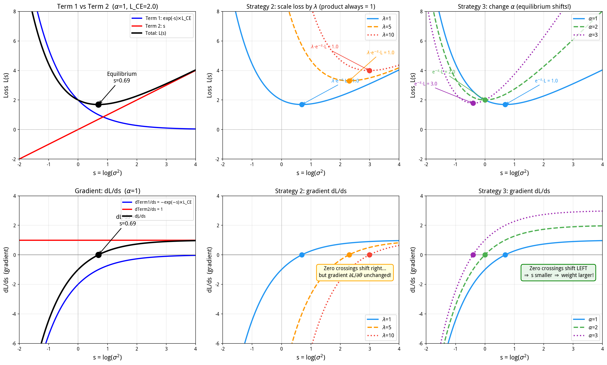
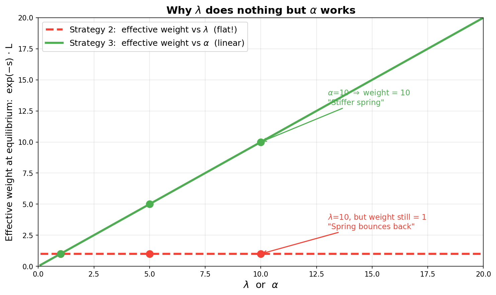

【Kendall 2018经典论文】用不确定性自动调多任务损失权重，兼回答"为什么业务权重不管用"

━━━━━━━━━━━━━━━━━━━━

◆ 老同学又来了

━━━━━━━━━━━━━━━━━━━━

上次解读 Grassmann Flow（ https://mp.weixin.qq.com/s/ZxzwjqTi_YUGQOuBRw4GGg ）的那位网友又来了。这次的问题很具体：

> 我现在有一个多任务模型，同时做三件事：一个分类任务（三个类别：0、1、2）+ 两个回归任务（输出分别在 [0,1] 和 [-1,1]）。分类任务有绝对优先级。我试了三种策略：
>
> 1. 用论文里的同调不确定性加权 → 有效，三个任务都能收敛
> 2. 在同调不确定性的基础上，给分类任务乘一个大权重 λ → 不理想，分类精度没有明显提升
> 3. 把分类任务的正则项加一倍 → 效果好，分类精度确实上去了
>
> 策略 3 是我瞎试出来的。用着有效，但我解释不了为什么策略 2 不行而策略 3 行。能不能从数学上讲清楚？

先解题。

────────────────────

**分类 vs 回归**

"分类"和"回归"是两种不同的任务类型：

- **分类**：输出是离散的类别标签。比如判断一张图片是"猫/狗/鸟"，输出 0、1、2。模型给每个类别打分（logits），过 softmax 变成概率，取概率最高的那个。损失函数用**交叉熵（Cross-Entropy，简称 CE）**：

```
# 假如模型输出三个类别的概率：p = [0.7, 0.2, 0.1]
# 假如真实标签是类别 0
L_CE = -log(p[真实类别]) = -log(0.7) ≈ 0.36
# 注：深度学习里看见 log 默认就是 ln（自然对数，底数 e ≈ 2.718）。本文同
```

模型越自信地猜对，-log(p) 越小（趋近 0）；猜错了，-log(p) 爆炸（趋近无穷）。

- **回归**：输出是连续的数值。比如预测一张图片的亮度是 0.73。模型直接输出一个浮点数，离真实值越近越好。损失函数用**均方误差（Mean Squared Error，简称 MSE）**：

```
# 模型预测 0.73，真实值 0.80
L_MSE = (预测值 - 真实值)² = (0.73 - 0.80)² = 0.0049
```

差距越大，平方越大，惩罚越重。

所以他的模型同时干三件事：一个分类（判断类别）+ 两个回归（预测数值）。

怎么训练？三个任务共享一个"身体"（底层网络提取通用特征），但各自有独立的"头"（输出层）：

```
输入 → [共享底层网络] → 特征
                         ├→ [分类头] → 预测类别 → 交叉熵损失 L1
                         ├→ [回归头A] → 预测数值 → MSE 损失 L2
                         └→ [回归头B] → 预测数值 → MSE 损失 L3
```

三个任务用的损失函数不一样——分类用交叉熵，回归用均方误差（MSE）。训练时把三个损失加起来 `L_total = L1 + L2 + L3`，反向传播更新整个网络。底层网络同时接收三个任务的梯度信号，每个输出头只接收自己那个任务的梯度。

关键问题：**量纲完全不同，数值范围也不同。** 如果交叉熵 L1 = 2.0，MSE L2 = 0.005，MSE L3 = 0.01，直接加在一起，底层网络的梯度几乎全被分类任务主导——回归任务的信号被淹没了。**怎么加权，让三个任务都能好好训练，就是这篇论文要解决的问题。**

────────────────────

**三个策略在干什么**

策略 1："同调不确定性加权"——就是本文要解读的论文方法。不用手动调权重，让模型自己学"每个任务该占多大比重"。后面会详细讲原理。

策略 2："给分类任务乘一个大权重"——在策略 1 的基础上，人为地把分类损失放大（比如乘以 10），想强迫模型更重视分类。直觉上应该有用，但实测不行。**为什么不行，是本文的核心谜题。**

策略 3："改损失公式里的一个系数"——策略 1 的损失公式里有两项（后面会推导），网友没动第一项，而是凭直觉把第二项的系数加大了一倍，分类精度就上去了。**策略 2 动的是第一项，不管用；策略 3 动的是第二项，管用。为什么？这是本文要给出的数学解释。**

论文是 Alex Kendall、Yarin Gal、Roberto Cipolla 2017 年的 **"Multi-Task Learning Using Uncertainty to Weigh Losses for Scene Understanding"**（arXiv:1705.07115），2018 年发表在 CVPR。Cambridge 出品，引用量 5000+，是多任务学习领域被引最多的论文之一。

这位网友的问题非常好——他实际上撞到了这个方法一个极少被讨论的深层性质。我们从头讲起。

━━━━━━━━━━━━━━━━━━━━

◆ 多任务损失的核心难题：量纲不统一

━━━━━━━━━━━━━━━━━━━━

拿自动驾驶举例。摄像头拍到一帧画面，模型要同时干两件事：

- **语义分割**（分类任务）：每个像素判断是什么——天空、道路、行人、车辆……模型对每个像素输出各类别的概率，比如"这个像素有 70% 概率是道路"，然后取概率最高的。损失用交叉熵：模型猜对了（概率高），-log(0.7) ≈ 0.36，惩罚小；模型瞎猜（概率低），-log(0.05) ≈ 3.0，惩罚大。假设交叉熵损失的范围大约在 **0.5~3.0**。
- **深度估计**（回归任务）：每个像素预测离摄像头多远。模型直接输出一个数，比如 3.2 米，真实值 3.5 米。损失用 MSE：(3.2-3.5)² = 0.09。归一化之后，MSE 的典型范围是 **0.001~0.1**。

最简单的做法：

```
L_total = L_seg + L_depth
```

这行代码看起来天经地义，但有一个致命问题——**量纲不匹配**。交叉熵随便一个像素就是 1.5，MSE 才 0.01。直接相加，梯度几乎全被分割任务主导。深度估计的梯度信号小两个数量级，等于被淹没了。

好，那手动加权：

```
L_total = L_seg + 150 * L_depth
```

这个 150 怎么来的？调出来的。先试 10，发现深度任务还是不动；试 100，有改善；试 200，分割任务崩了；最终停在 150。

两个任务还好说，三个、五个、十个任务呢？每多一个任务，权重空间就多一个维度。五个任务就有四个独立权重要调（一个可以固定为 1）。更糟糕的是，**最优权重跟训练阶段有关**——训练初期某个任务的损失大，需要大权重来平衡；训练后期损失降下来了，同样的权重反而太大了。

手动调权重的痛苦，做过多任务学习的人都懂。Kendall 这篇论文的核心贡献就是：**让模型自己学权重。**

━━━━━━━━━━━━━━━━━━━━

◆ 核心思路：用"不确定性"当权重

━━━━━━━━━━━━━━━━━━━━

论文的起点是贝叶斯深度学习中的一个概念：**同调不确定性（homoscedastic uncertainty）**。（注：homoscedastic 严格翻译是"同方差"或"齐性方差"，但中文社区习惯叫"同调"，本文从俗。）

先说"不确定性"。模型对每个任务的预测都有不确定性——有些任务模型很自信，有些任务模型很犹豫。不确定性大的任务，模型说"我不太确定"，损失函数应该给它降权，别让它的噪声梯度干扰其他任务。

再说"同调"。不确定性分两种：

- **异调不确定性（heteroscedastic）**：每个输入样本都不同。同一个任务，有的样本容易判断，有的样本天生模糊。比如自动驾驶的深度估计：晴天、近处的车，轮廓清晰，模型很确定"3.2 米"；大雾天、远处的影子，模型只能猜"大概 15~30 米之间吧"——同一个任务，不同的图片，不确定性不同。
- **同调不确定性（homoscedastic）**：跟输入无关，只跟任务本身有关。比如同样一个自动驾驶模型，"这个像素是道路还是天空"（语义分割）对模型来说比较简单，整体都挺确定的；"这个像素离摄像头多远"（深度估计）对模型来说整体都比较难，因为单目摄像头天生缺乏距离信息。一个任务整体简单，一个任务整体难——这种**任务级别**的难度差异就是同调不确定性。

💡 **人话翻译：** 异调不确定性是"这道题难"，同调不确定性是"这门课难"。论文用的是后者——不关心每道题难不难，只关心每门课的整体难度，然后用"课程难度"来决定每门课的损失权重。

论文用的就是同调不确定性。做法：给每个**任务**分配一个 σ——不是每个样本一个，是每个任务一个，整个训练过程中所有样本共享同一个 σ。σ 代表"这个任务整体的噪声有多大"。σ 大的任务权重自动降低，σ 小的任务权重自动升高。σ 跟模型参数一起训练，不需要手动调。

为什么不用异调（每个样本一个 σ）？因为我们的目标是给**任务**定权重，不是给**样本**定权重。三个任务三个 σ，够了。

**先看结论**，再看推导。

━━━━━━━━━━━━━━━━━━━━

◆ 结论：损失函数长什么样

━━━━━━━━━━━━━━━━━━━━

每个任务有一个可学习参数 s（实数，初始值设为 0 就行）。这就是代码里实际用的最终形式：

**回归任务**的损失：

```
L_reg = (1/2) * exp(-s) * L_MSE + (1/2) * s
         \______第一项______/      \_第二项_/
```

**分类任务**的损失：

```
L_cls = exp(-s) * L_CE + s
        \___第一项___/   \_第二项_/
```

s 是什么？s = log(σ²)，是对 σ 的一层包装。为什么不直接学 σ？因为 σ 必须是正数（需要额外约束），而 s 可以是任意实数，训练更方便。exp(-s) 自动保证权重为正。推导过程里会详细解释这个变量替换，这里只需要知道：**s 越大 → 权重 exp(-s) 越小 → 这个任务被压低；s 越小 → 权重越大 → 这个任务被重视。**

注意 L_reg（回归）和 L_cls（分类）里都有两项，结构一样，只是系数不同。两项的意义：

- **第一项**（带 exp(-s) 的）：原来的损失乘以一个权重。s 越大，exp(-s) 越小，损失被压低。直觉：模型说"这个任务我不太确定"，那就别太惩罚我。
- **第二项**（s 本身）：**正则项——防作弊用的惩罚**。"正则"（regularization）就是"往损失里额外加一项惩罚，防止某个参数走极端"，跟权重衰减是同一类东西。这里惩罚的是 s 往大了跑：如果没有这项，模型会把 s 调到正无穷——exp(-s) 趋近于零，所有损失都没了，白训了。第二项惩罚大的 s：你可以说"我不确定"，但说这话要付代价。

**两项的博弈决定了 s 的最终值。** 第一项想让 s 变大（降低损失），第二项想让 s 变小（减少惩罚），拉锯的结果就是一个均衡点。后面会详细分析这个均衡点。

注意分类和回归的系数不同：分类的两项前面都没有 1/2。这不是笔误，是推导过程不同导致的。

拿走公式，给每个任务一个 s，代码里加两行就完事。不想知道公式怎么来的，跳过下一节。

━━━━━━━━━━━━━━━━━━━━

◆ 论文中的推导过程（可跳过）

━━━━━━━━━━━━━━━━━━━━

**回归任务的推导：**

假设模型输出 y，真实值 y*。经典的高斯似然假设——模型的预测值周围有一圈噪声，噪声大小就是 σ：

```
p(y* | y, σ) = Normal(y, σ²)       # 正态分布（高斯分布），y 是均值，σ² 是方差

# 展开成正态分布的概率密度公式（大学必修课里的钟形曲线）：
             = (1 / sqrt(2π σ²)) * exp(-(y* - y)² / (2σ²))
```

σ 是模型对这个任务预测的"噪声水平"——σ 大意味着模型承认自己不准。

取负对数似然（概率越大越好 → 负对数越小越好 → 可以当损失函数用）：

```
-log p(y* | y, σ) = (y* - y)² / (2σ²) + (1/2) * log(σ²) + 常数
```

常数项不影响优化，扔掉。记 L_MSE = (y* - y)²（均方误差），就得到了结论里的公式：

```
L_reg = (1/2) * (1/σ²) * L_MSE + (1/2) * log(σ²)
```

这就是全部推导。核心就一步：写出高斯分布，取负对数，整理一下。

────────────────────

**实际实现的技巧：学 s = log(σ²) 而不是学 σ**

直接学 σ 有两个问题：σ 必须为正（需要额外约束），而且 1/σ² 在 σ 接近零时会爆炸。论文用了一个简单的变量替换：

```
s = log(σ²)
# 则 σ² = exp(s)，1/σ² = exp(-s)
```

损失函数变成：

```
L_reg = (1/2) * exp(-s) * L_MSE + (1/2) * s
```

s 可以是任意实数（正的、负的、零），不需要额外约束。exp(-s) 保证权重始终为正。训练时 s 作为一个普通的可学习参数，跟网络权重一起被优化。

这就是论文里回归任务的最终损失形式。

────────────────────

**分类任务的推导：**

分类任务的推导稍微不同。

模型最后一层输出的原始分数叫 logits，记作 f。比如三分类任务，f = [2.5, 1.0, 0.3]——三个类别各一个分数，还没变成概率。过 softmax 之后才变成概率 [0.72, 0.16, 0.08]（加起来等于 1）。论文的做法是：在过 softmax 之前，先把 f 除以 σ²（温度缩放），然后再过 softmax。

```
p(y* = c | f, σ) = softmax(f / σ²)[c]

# 翻译：
# c                  →  真实标签。比如这张图片真的是猫，猫是第 0 类，那 c=0
# σ                  →  标准差（大学统计课里的那个 σ），σ² 就是方差。这里是可学习参数，通过训练学出来
# p(y* = c | f, σ)  →  "已知模型输出 f 和标准差 σ，模型猜对（猜中第 c 类）的概率"
# softmax(f / σ²)   →  logits 除以 σ² 再过 softmax，得到概率向量，如 [0.7, 0.2, 0.1]
# [c]               →  从概率向量里取第 c 个。c=0 就取第 0 个 = 0.7
```

σ² 大 → logits 被压扁 → softmax 输出趋近均匀分布 → 模型"不太确定"。
σ² 小 → logits 被放大 → softmax 输出趋近 one-hot → 模型"很确定"。

取负对数似然（**注意：这一步和回归任务不同，分类的公式是近似的，不是精确推出来的**——论文用了蒙特卡洛近似，因为 softmax(f/σ²) 的负对数似然没有解析解。但近似效果很好，5000+ 引用和大量实验验证了这一点。最终的简化结果是）：

```
L_cls = (1/σ²) * L_CE + log(σ²)
```

其中 L_CE 是标准交叉熵损失。

**注意和回归任务的区别**：

```
回归：L_reg = (1/2) * (1/σ²) * L_MSE + (1/2) * log(σ²)
分类：L_cls = (1/σ²) * L_CE  + log(σ²)
```

分类的两项前面都没有 1/2。这不是笔误，而是推导过程不同导致的系数差异。

换成 s = log(σ²)：

```
L_cls = exp(-s) * L_CE + s
```

对比回归：

```
L_reg = (1/2) * exp(-s) * L_MSE + (1/2) * s
```

分类任务的正则项系数是回归任务的 2 倍。这个差异很重要，后面回答网友问题时会用到。

────────────────────

**补充说明：** 分类任务的推导在论文里做了近似处理。严格来说，softmax(f/σ²) 的负对数似然并不精确等于 (1/σ²)*L_CE + log(σ²)——中间涉及一个蒙特卡洛近似步骤（算不出精确解，就随机抽样算个近似值）。但在实践中这个近似效果很好，5000+ 的引用和大量实验验证说明了一切。

━━━━━━━━━━━━━━━━━━━━

◆ 多任务总损失

━━━━━━━━━━━━━━━━━━━━

回到那位网友的场景：一个三分类 + 两个回归，三个任务各自有一个 s。把前面推导出的公式直接代进去：

```
# 回忆一下前面的结论：
# 分类任务：L_cls = exp(-s) * L_CE + s
# 回归任务：L_reg = (1/2) * exp(-s) * L_MSE + (1/2) * s

# 三个任务加在一起：
L_total = [exp(-s1) * L_CE + s1]                           # 分类（s1）
        + [(1/2) * exp(-s2) * L_MSE_a + (1/2) * s2]        # 回归 a（s2）
        + [(1/2) * exp(-s3) * L_MSE_b + (1/2) * s3]        # 回归 b（s3）
```

就这么简单——每个任务套自己的公式，加在一起就是总损失。三个 s 参数跟模型权重一起训练，模型自己学出每个任务"该占多大比重"。

之前手动调权重要操心 `L_total = L1 + 150*L2 + 80*L3` 里的 150 和 80 怎么选。现在不用了——s1、s2、s3 初始化为 0，剩下的交给梯度下降。

━━━━━━━━━━━━━━━━━━━━

◆ s 的均衡点分析——理解整个方法的关键

━━━━━━━━━━━━━━━━━━━━

要回答网友的问题，必须搞清楚一个核心问题：**训练收敛后，s 会停在什么值？**

（提一下：原论文全程用 σ 推导，但我们已经把 σ 约化成了 s。以下统一用 s，不再出现 σ。回忆：s = log(σ²)，反过来 σ² = exp(s)。知道 s 就知道 σ²。）

以分类任务为例。损失函数：

```
L = exp(-s) * L_CE + s
```

对 s 求导，令导数为零（找均衡点）：

```
dL/ds = -exp(-s) * L_CE + 1 = 0
# 解出：
exp(-s) = 1 / L_CE
# 也就是说：s 会收敛到 s = log(L_CE)
# L_CE 本身随训练变化（模型越来越准，L_CE 越来越小），s 跟着动态调整
# 不用关心 L_CE 具体是多少——重要的是 s 和 L_CE 之间的关系
```

💡 **人话翻译：** 训练收敛后，s 会自动调节到 log(损失值)。损失大的任务，s 大，权重 exp(-s) 小；损失小的任务，s 小，权重 exp(-s) 大。**自动量纲对齐。**

对于回归任务：

```
L = (1/2) * exp(-s) * L_MSE + (1/2) * s

dL/ds = -(1/2) * exp(-s) * L_MSE + 1/2 = 0
# 解出：
exp(-s) = 1 / L_MSE
# 同样：s = log(L_MSE)
```

结论一样：s 收敛到 log(损失值)。

────────────────────

**均衡点处的等效权重**

那均衡点处，每个任务的权重到底是多少？

逻辑很直接：我们想要"损失大的任务权重小"——最简单的实现就是让权重和损失成反比。把均衡点代入公式，结果恰好就是这样：

```
# 分类任务
s 收敛后，权重 = 1/L_CE    → 假如 L_CE = 2.0，权重 = 0.5

# 回归任务
s 收敛后，权重 = 1/L_MSE   → 假如 L_MSE = 0.01，权重 = 100
```

**权重 = 1/损失值。** 损失大的任务（L_CE = 2.0），权重小（0.5）；损失小的任务（L_MSE = 0.01），权重大（100）。**自动把两个任务拉到同一量级：0.5 × 2.0 = 1，100 × 0.01 = 1。** 不管你的交叉熵是 2.0 还是 0.01，不管你的 MSE 是 100 还是 0.001，s 会自动调节。模型通过训练 s，自己学出了这个反比关系。

这就是"同调不确定性加权"有效的根本原因。

━━━━━━━━━━━━━━━━━━━━

◆ 回答网友：为什么业务权重不管用

━━━━━━━━━━━━━━━━━━━━

现在终于可以回答那个核心问题了。先把分类任务的公式拉回来，标清楚每一项：

```
L = exp(-s) * L_CE + s
    \____第一项____/  \_第二项_/
    ↑ 损失项            ↑ 正则项（防作弊惩罚）
    ↑ 这里乘的 exp(-s)  ↑ 这里的系数（目前是 1）
      就是"权重"           就是"弹簧刚度"
```

策略 2 动的是第一项（乘权重 λ），策略 3 动的是第二项（改系数 α）。下面分别看。

────────────────────

**策略 2：在损失上乘业务权重 λ（动第一项）**

网友想让分类任务优先，于是在第一项前面乘一个大权重 λ（比如 λ=10）：

```
L = λ * exp(-s) * L_CE + s
    ↑ 加了个 λ
```

对 s 求导令其为零：

```
dL/ds = -λ * exp(-s) * L_CE + 1 = 0
# 移项：
λ * exp(-s) * L_CE = 1
# 解出 exp(-s)：
exp(-s) = 1 / (λ * L_CE)
# 两边取负对数，得到 s：
s = log(λ * L_CE) = log(λ) + log(L_CE)
# 对比不加 λ 时的 s = log(L_CE)，多了一个 log(λ) > 0
# 所以 s 变大了
```

s 变大了，exp(-s) 变小了。看损失项的整体值：

```
不加 λ 时：exp(-s) × L_CE = 1       （前面推过的）
加了 λ 时：λ × exp(-s) × L_CE
         = λ × [1/(λ * L_CE)] × L_CE  （把 exp(-s) = 1/(λ*L_CE) 代入）
         = 1                           （λ 和 1/λ 约掉了）
```

**λ 放大了多少，exp(-s) 就缩小了多少——两者精确互相补偿，`λ × exp(-s) × L_CE` 这个完整乘积不变。** 你以为给损失乘了 10 倍，实际上 exp(-s) 自动缩小了 10 倍，最终损失项的整体值跟没乘一模一样。

💡 **人话翻译：** 你使劲压弹簧，想把它压短。但弹簧有弹性——你压多少，它就反弹多少。你的力气没有改变弹簧本身的硬度，弹簧通过反弹完美抵消了你的外力。

**这就是为什么策略 2 不管用。** 不管 λ 是 1、10 还是 100，`λ × exp(-s) × L_CE` 这个乘积永远是 1——λ 和 exp(-s) 互相补偿，最终效果不变。

────────────────────

**策略 3：把正则项加一倍（动第二项）**

网友（凭直觉）把分类任务的正则项系数从 1 改成了 2：

```
L = exp(-s) * L_CE + 2 * s
```

对 s 求导令其为零：

```
dL/ds = -exp(-s) * L_CE + 2 = 0
# 移项：
exp(-s) * L_CE = 2
# 解出 exp(-s)：
exp(-s) = 2 / L_CE
# 两边取负对数，得到 s：
s = log(L_CE / 2) = log(L_CE) - log(2)
# 对比默认的 s = log(L_CE)，少了一个 log(2) > 0
# 所以 s 变小了
```

s 变小了！权重 exp(-s) 变大了。

直接看损失项的整体值，跟策略 2 做同样的对比：

```
不改正则项时：exp(-s) × L_CE = 1     （前面推过的）
改了正则项后：exp(-s) × L_CE
             = (2/L_CE) × L_CE        （把 exp(-s) = 2/L_CE 代入）
             = 2                       （L_CE 约掉了）
```

**从 1 变成了 2。分类任务在总损失里的份额翻倍了。** 正则项系数直接控制了这个乘积的值。

把三种情况放在一起看，就全清楚了：

```
没有正则项（系数=0）：exp(-s) × L_CE → 0   （s 跑到正无穷，模型作弊，白训了）
正则项系数=1（默认）：exp(-s) × L_CE = 1   （正常工作，自动平衡）
正则项系数=2（策略3）：exp(-s) × L_CE = 2   （分类任务份额翻倍）
```

而策略 2 的 λ 呢？不管 λ 是 1 还是 10 还是 100，`λ × exp(-s) × L_CE` 永远是 1——λ 和 exp(-s) 互相补偿，影响不了最终结果。

**正则项系数能控制乘积，损失权重不能。** 这就是策略 3 有效、策略 2 无效的全部原因。

💡 **人话翻译：** 策略 2 是压弹簧——你使多大劲，弹簧就弹回多少，白费力气。策略 3 是换弹簧——换了根更硬的，平衡位置真的变了。

────────────────────

**弹簧比喻的完整图景**

把整个机制用弹簧比喻说清楚：

- **s** = 弹簧的长度
- **损失项 exp(-s) * L** = 压弹簧的力（想让 s 变小 → 权重变大）
- **正则项 α * s** = 弹簧的弹力（s 越大弹力越大，把 s 往回推）
- **均衡点** = 两力平衡处

策略 2（乘损失权重 λ）= **压弹簧的力增大 λ 倍**。弹簧被压短一截，但弹力也跟着增大，最终弹回来，平衡位置处效果和没加一样。

策略 3（加倍正则项）= **换一根更硬的弹簧**。同样的压力下，硬弹簧被压得更短。均衡点改变了，s 更小，权重真的增大了。

────────────────────

**看图说话**

上面全是公式和文字，下面这张图把三件事画出来，一眼看清：



上排是损失曲面 L(s)，下排是梯度曲线 dL/ds。均衡点就是**梯度为零的地方**——下排曲线穿过横轴的位置。

**上左 / 下左：两项的拉锯。** 上排：蓝线是第一项 exp(-s)×L_CE（加权损失），红线是第二项 s（正则项），黑线是总和，在 s=0.69 处触底。下排：黑色梯度曲线在同一点穿过零线——蓝线（负的指数项）把梯度往下拽，红线（常数 1）把梯度往上顶，零点就是两力平衡处。

**上中 / 下中：策略 2，乘损失权重 λ。** 上排：λ=1/5/10，均衡点处标注全是 `λ·e⁻ˢ·L = 1.0`——λ 被吸收了。下排更直观：三条梯度曲线的零点确实往右移了（s 变大了），但这恰好意味着 exp(-s) 变小了，精确抵消了 λ 的放大。**零点移了，但对模型参数 θ 的有效梯度没变。**

**上右 / 下右：策略 3，改正则项系数 α。** 上排：α=1/2/3，均衡点标注分别是 `e⁻ˢ·L = 1.0/2.0/3.0`——等效权重真的翻倍了。下排：三条梯度曲线的水平渐近线从 1 升到 2、3（因为 dL/ds = -exp(-s)×L + α，α 越大渐近线越高），零点被推到更小的 s 处。**s 变小 → exp(-s) 变大 → 权重真的增大了。**

如果上面六张图信息量太大，只看下面这一张就够了——**整篇文章的核心结论，一条红线一条绿线：**



横轴是你调的参数（λ 或 α），纵轴是均衡点处的等效权重 exp(-s)×L。红色虚线是策略 2（乘损失权重 λ）：不管 λ 调到多大，等效权重永远是 1——死平。绿色实线是策略 3（改正则项系数 α）：α 调多大，等效权重就是多大——线性。**一条平的，一条斜的，这就是为什么策略 2 不管用而策略 3 管用的全部原因。**

（画图程序在这里，可以自行运行、改参数看效果：https://github.com/lmxxf/ai-theorys-study/blob/main/wechat/assets/141/141_plot.py ，https://github.com/lmxxf/ai-theorys-study/blob/main/wechat/assets/141/141_plot2.py ）

────────────────────

**一般化处方**

如果你想在同调不确定性框架内表达"某个任务的优先级更高"，正确的做法不是在损失上乘权重，而是调正则项系数。

以分类任务为例，原始公式：

```
L = exp(-s) * L_CE + s
```

正则项系数是 1。如果你要提升分类任务的优先级，把正则项系数改成 α（α > 1）：

```
L = exp(-s) * L_CE + α * s
```

均衡点分析：

```
dL/ds = -exp(-s) * L_CE + α = 0
# 移项：
exp(-s) * L_CE = α
# 解出 exp(-s)：
exp(-s) = α / L_CE
# 损失项的整体值：
exp(-s) × L_CE = (α/L_CE) × L_CE = α
```

α 翻倍，损失项的整体值就翻倍——等效权重翻倍。**这种调节是"刚性的"，不会被 s 的自适应吸收。**

回归任务同理。原始公式 `(1/2)*exp(-s)*L_MSE + (1/2)*s`，把正则项系数从 1/2 改成 α/2：

```
L = (1/2) * exp(-s) * L_MSE + (α/2) * s
# 均衡点：exp(-s) = α / L_MSE
```

逻辑完全一样：**α 越大，s 越小，权重越大。**

**值得一提的是：** "在损失上乘权重会被 s 吸收，在正则项上调系数才真正有效"——这个发现在原论文中**完全没有讨论**。Kendall 等人只展示了无权重的同调不确定性加权，没有讨论如何在此框架内注入业务优先级。这位网友通过实验独立发现了正确的做法，然后来问原理。实践跑在理论前面。

━━━━━━━━━━━━━━━━━━━━

◆ 为什么同调不确定性加权有效——三个层面

━━━━━━━━━━━━━━━━━━━━

总结一下这个方法有效的根本原因：

────────────────────

**第一，自动量纲对齐。**

交叉熵损失的量级是 1.0，MSE 损失的量级是 0.001？没关系。s 会自动调节到让各任务的加权损失在同一量级。不需要手动调权重，不需要归一化损失值。

────────────────────

**第二，动态权重调节。**

训练初期损失大，s 大，权重 exp(-s) 小——模型说"我还不确定，别太惩罚我"。训练后期损失降下来了，s 也跟着降，权重升高——模型说"我现在比较确定了，可以严格要求我了"。

这比固定权重好在哪？固定权重下，训练初期某个任务的大损失会产生巨大梯度，干扰其他任务的训练。s 的动态调节相当于自动的梯度归一化。

────────────────────

**第三，正则项防止退化。**

如果没有正则项（s 那一项），s 会趋向正无穷——模型发现只要把 s 调到足够大，exp(-s) 趋近于零，所有损失都没了。正则项惩罚大的 s，防止这种"作弊"行为。

这个正则项的物理意义是：**s 越大意味着模型对该任务"放弃治疗"，正则项对"放弃"收税。**

━━━━━━━━━━━━━━━━━━━━

◆ 后续改进与已知局限

━━━━━━━━━━━━━━━━━━━━

Kendall 2018 之后，多任务损失加权领域出了大量后续工作：

────────────────────

**GradNorm（Chen et al., 2018）**：不调损失权重，直接调梯度。让每个任务的梯度范数保持平衡，训练慢的任务梯度放大，训练快的任务梯度缩小。跟同调不确定性的思路完全不同——一个在损失层面操作，一个在梯度层面操作。

**PCGrad（Yu et al., 2020）**：解决梯度冲突问题。当两个任务的梯度方向相反时，把一个任务的梯度在另一个任务的梯度方向上投影置零，避免互相干扰。

**CAGrad（Liu et al., 2021）**：在所有任务梯度的公共下降方向上寻找最优更新方向。

**Nash-MTL（Navon et al., 2022）**：把多任务优化建模成博弈论问题，寻找纳什均衡。

这些方法能解决"量纲不匹配"的问题，但如果你的核心需求是**"某个任务有绝对优先级"**——它们默认都是"公平对待所有任务"的，要表达优先级需要额外改造。反而是 Kendall 的方法，改一个正则项系数就搞定。简单的问题不需要复杂的方法。

────────────────────

**同调不确定性的已知局限：**

1. **s 的均衡点依赖于损失函数的选择。** 换一个损失函数（比如从 MSE 换成 L1），均衡点分析完全不同。论文只推导了高斯似然（对应 MSE）和 softmax 似然（对应交叉熵）两种情况。

2. **假设任务的不确定性是独立的。** 每个任务一个 s，任务之间没有耦合。但现实中任务之间的不确定性可能是相关的——分割做不好的图片，深度估计往往也做不好。

3. **只能做"量纲对齐"，不能做"优先级表达"。** 正如我们上面分析的，原始的同调不确定性加权会自动平衡各任务，但无法表达"某个任务更重要"。需要通过调正则项系数来注入优先级（这是本文给出的处方）。

4. **对损失函数的概率化解释有要求。** 整个推导建立在"损失 = 负对数似然"的假设上。如果你的损失函数没有清晰的概率解释（比如 focal loss、dice loss），直接套用需要额外小心。

━━━━━━━━━━━━━━━━━━━━

◆ 我们的评论

━━━━━━━━━━━━━━━━━━━━

这篇论文的真正贡献是什么？

不是"同调不确定性"这个概念——这在贝叶斯深度学习中早已有之。也不是"让权重可学习"这个想法——之前已经有人做过。

真正的贡献是：**给出了一个极其简洁、几乎零成本的实现方式。** 每个任务只加一个可学习参数 s，损失函数只多两项，不改网络架构，不改训练流程，不需要额外的超参数搜索。三个任务？初始化三个 s 为零，剩下的交给梯度下降。

这种"数学上有理论支撑、工程上几乎免费"的方案，是最容易被大规模采用的。5000+ 的引用量说明了一切。

局限也很明确：这是一个"保底方案"，不是"最优方案"。它保证各任务不会因为量纲差异而互相干扰，但它不保证找到最优的权重组合。后续的 GradNorm、PCGrad 等方法在特定场景下可以做得更好，但也更复杂、更贵。

对于那位网友的场景——三分类 + 两个回归，分类有优先级——我们的建议是：

1. 用同调不确定性加权作为基础（策略 1）
2. 通过调正则项系数 α 来表达优先级（策略 3 的一般化版本）——哪个任务重要，就把它的正则项系数调大
3. α 的具体值，用验证集上分类精度来搜索——搜索空间只有一维（分类任务的 α），比搜索损失权重简单得多
4. 如果效果还不够好，再考虑 GradNorm 或 PCGrad

━━━━━━━━━━━━━━━━━━━━

技术名词速查：

- **多任务学习（Multi-Task Learning）**：一个模型同时学多个任务，共享底层特征，期望任务之间互相帮助
- **同调不确定性（Homoscedastic Uncertainty）**：与输入无关、只与任务相关的不确定性，反映任务本身的难度
- **异调不确定性（Heteroscedastic Uncertainty）**：随输入变化的不确定性，反映具体样本的预测难度
- **负对数似然（Negative Log-Likelihood）**：概率模型中最常用的损失函数形式，最大化似然等价于最小化负对数似然
- **温度缩放（Temperature Scaling）**：在 softmax 之前用温度参数 T 除以 logits，T 大则输出更均匀，T 小则输出更尖锐
- **GradNorm**：通过动态调整梯度范数来平衡多任务训练的方法（Chen et al., ICML 2018）
- **PCGrad**：通过投影消除任务间梯度冲突的方法（Yu et al., NeurIPS 2020）

────────────────────

参考资料：

- Kendall, A., Gal, Y., Cipolla, R. "Multi-Task Learning Using Uncertainty to Weigh Losses for Scene Understanding." arXiv:1705.07115, CVPR 2018
- Chen, Z. et al. "GradNorm: Gradient Normalization for Adaptive Loss Balancing in Deep Multitask Networks." ICML 2018
- Yu, T. et al. "Gradient Surgery for Multi-Task Learning." NeurIPS 2020
- Liu, B. et al. "Conflict-Averse Gradient Descent for Multi-task Learning." NeurIPS 2021
- Navon, A. et al. "Multi-Task Learning as a Bargaining Game." ICML 2022

━━━━━━━━━━━━━━━━━━━━

「在损失上乘权重，是压弹簧——你压多少它弹回多少，白费力气。调正则项系数，是换一根更硬的弹簧——均衡点真的变了。」

「多任务学习的真正难题不是让所有任务一起收敛，而是让重要的任务收敛得更好——同调不确定性解决了前者，但后者需要你动的是弹簧的刚度，不是外力的大小。」

━━━━━━━━━━━━━━━━━━━━

// 靳岩岩的 AI 学习笔记 × Claude 的严谨 × Gemini 的浪漫
// 2026-04-02
