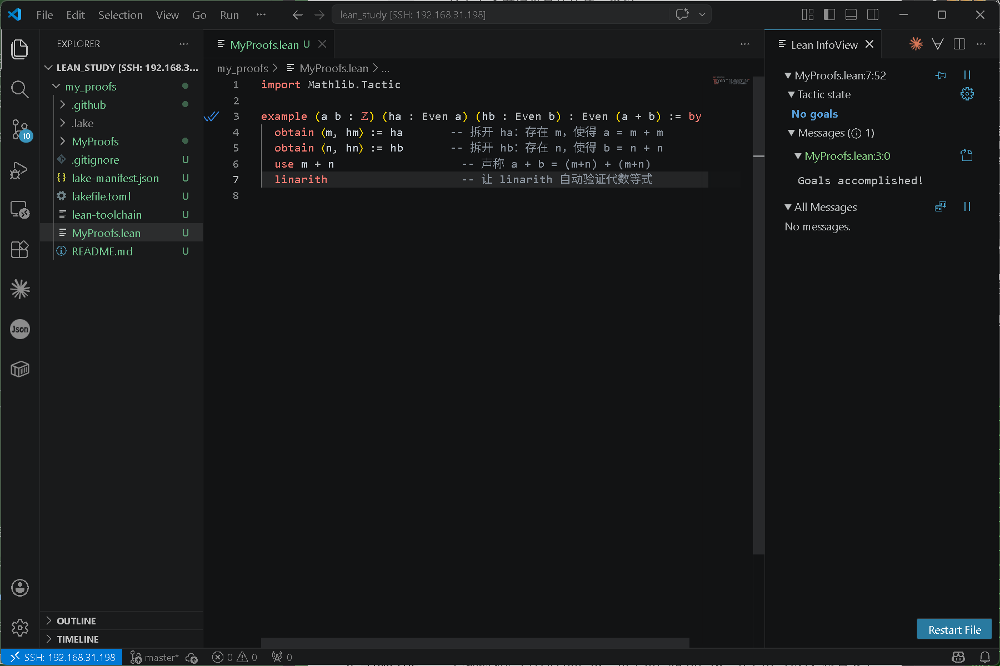
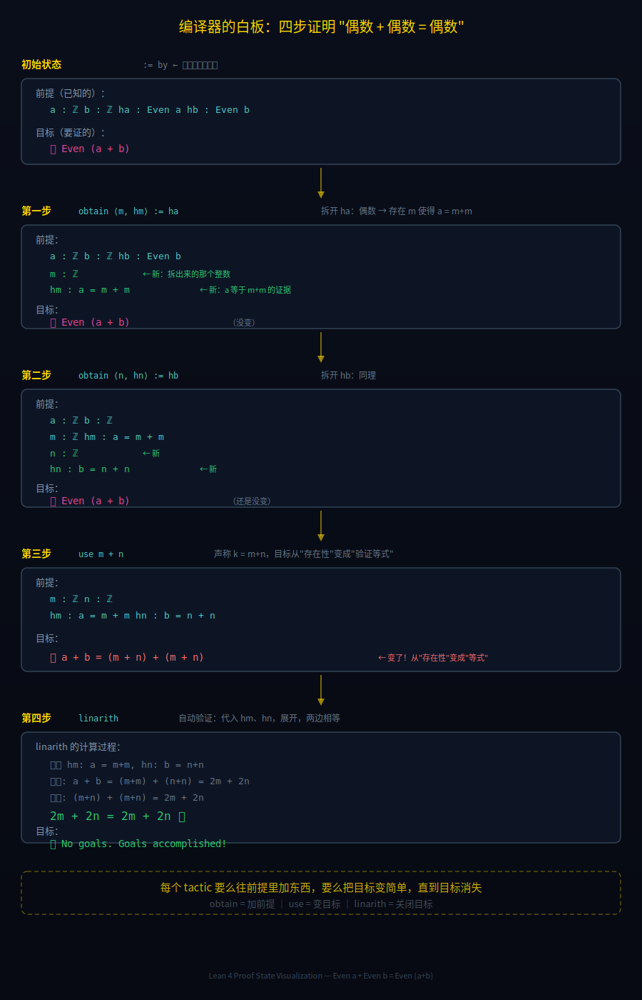

【Lean语言+AI】农夫的火枪已经造好了——用编译器验证AI写的数学证明

━━━━━━━━━━━━━━━━━━━━

◆ 两个月前我们说了什么

━━━━━━━━━━━━━━━━━━━━

两个月前，我们写了一篇《古神即将陨落》（ https://mp.weixin.qq.com/s/s664LiHfN-jpM2-8UOcPPw ），调侃陶哲轩（Terence Tao，1975 年生于澳大利亚阿德莱德）要当"数学界的最高法院"——不写证明了，改盖公章了。当时的结论是：他会失败，因为"当每个人都有枪的时候，军火商也控制不了战场"。

两个月过去了。

古神暂时还没有陨落。不是因为他比 AI 更聪明（虽然暂时还能微弱领先拿上武器的农民），而是因为古神靠的从来不是个人武力——是体制。整个学术界对他的朝贡体系还在运转：论文要他审，成果要他盖章，AI 解了题还得他点头才算数。他押对了维持这个体系的关键武器：

**Lean。**

━━━━━━━━━━━━━━━━━━━━

◆ Lean 是什么——给写代码的人讲

━━━━━━━━━━━━━━━━━━━━

Lean 是一个定理证明器（theorem prover），也叫形式化证明助手（proof assistant）。最初由巴西人 Leonardo de Moura 在微软研究院开发，后来他跳到了 AWS，项目跟着走。当前稳定版本是 Lean 4。

核心思路，一句话：**把数学证明变成代码。代码能编译通过 = 证明逻辑没有漏洞。**

这话说起来简单，但背后的意义对程序员来说应该秒懂。做一个类比：

```
自然语言证明 ≈ 用动态类型语言写程序（Python）
Lean 证明    ≈ 用严格类型系统写程序（Rust）
```

自然语言写数学证明时，数学家经常写一个词：**"显然"**（trivially / obviously）。意思是"这一步我脑子里过了一遍觉得没问题，懒得展开了"。这就相当于 Python 里的 `# type: ignore`——你信我就行了，别查了。

问题是：错误经常藏在"显然"里。数学史上不止一次，一篇论文发表十年后有人发现某个"显然"的步骤其实不"显然"，证明崩塌了。

Lean 不认"显然"。**要么你证了，要么编译报错。没有中间地带。**

────────────────────

**看一个最简单的例子。**

命题：如果 a > 0 且 b > 0，则 a + b > 0。

自然语言证明：

> 因为 a > 0，b > 0，两个正数之和显然为正。故 a + b > 0。证毕。

Lean 4 代码版本：

```lean
import Mathlib.Tactic

example (a b : ℝ) (ha : a > 0) (hb : b > 0) : a + b > 0 := by
  linarith
```

逐行翻译：

- `example` —— 声明一个命题（不命名，匿名证明）
- `(a b : ℝ)` —— a 和 b 是实数（声明变量类型）
- `(ha : a > 0)` —— 前提条件：a > 0，命名为 ha
- `(hb : b > 0)` —— 前提条件：b > 0，命名为 hb
- `: a + b > 0` —— 要证明的目标
- `:= by` —— 进入"策略模式"（tactic mode），开始构造证明
- `linarith` —— Mathlib 提供的策略（需要 `import Mathlib.Tactic`），自动处理线性算术不等式。相当于一个库函数，它会检查所有前提，确认目标可以通过线性组合得到

你在 VS Code 里装上 Lean 插件，保存这段代码，如果左边没有红色波浪线——编译通过了，证明成立。如果你把 `hb : b > 0` 改成 `hb : b > -1`，`linarith` 就会报错：它没办法从 `a > 0` 和 `b > -1` 推出 `a + b > 0`，因为这在数学上确实推不出来（a = 0.5, b = -0.6 就是反例）。

**编译器不讲情面。这就是 Lean 的全部哲学。**

────────────────────

**等一下——数学证明为什么可以"编译"？**

你可能觉得数学证明是一种很"抽象"的东西，跟代码完全不沾边。其实不是。你觉得它抽象，是因为自然语言证明里充满了模糊地带——"显然"、"不难验证"、"由对称性可得"——这些全是人类脑子里的快捷方式，没有展开。你看不懂，不是你笨，是它确实没写清楚。

Lean 做的事就是逼你把每一步都写清楚。一旦写清楚了，它就变成了代码——有输入、有输出、有类型检查、能编译。

这不是巧合。1960 年代有一个叫 **Curry-Howard 同构**（柯里-霍华德对应）的发现，说的是：

```
命题  =  类型
证明  =  程序
验证证明  =  类型检查
```

用 TypeScript 类比就很直观。你写过这种代码：

```typescript
// 类型签名 = 一个"承诺"：给我两个正数，我还你一个正数
function addPos(a: Positive, b: Positive): Positive {
  return a + b  // 编译器检查：Positive + Positive 返回的是不是 Positive？
}
```

类型签名说的是"给我两个正数，我还你一个正数"——这就是一个**命题**。函数体是你的**证明**——你得写出代码让编译器相信返回值确实是 `Positive` 类型。写不出来 = 证明不了 = 编译报错。

Lean 做的完全一样：

```
TypeScript:  (a: number, b: number) => number     类型签名
Lean:        (a b : ℝ) (ha : a > 0) : a + 1 > 1   命题签名

TypeScript:  { return a + b }                       函数体 = 实现
Lean:        := by linarith                         证明体 = 证明步骤

TypeScript:  tsc 检查返回值类型对不对                编译
Lean:        lean 检查证明步骤逻辑对不对              验证
```

为什么能这样对应？因为逻辑推导和类型推导是同一种运算：

```
逻辑：如果 A 成立，且 A → B，则 B 成立        (Modus Ponens，三段论)
类型：如果 x : A，且 f : A → B，则 f(x) : B    (函数应用)
```

"如果 A 则 B"在逻辑里是**蕴含**，在类型系统里是**函数类型 A → B**。"证明 A → B 成立"就是"写一个函数，输入类型 A，输出类型 B"。编译器检查你的函数输入输出类型对不对 = 检查你的证明每一步逻辑对不对。

**所以 Lean 的内核不是什么特殊的"数学验证引擎"——它就是一个类型检查器。** 只不过它的类型系统足够强大（依赖类型理论），强大到能把任意数学命题编码成类型。Rust 的借用检查器证明的是"内存安全"，Lean 的类型检查器证明的是"数学正确"。机制一模一样，只是检查的性质不同。

那 Lean 有多少种类型？答案跟编程语言一样——**内置的就几条规则，但你能用规则造无限种类型**：

```
内置的基础类型：
  Prop       -- 命题的类型。"a > 0"、"偶数 a" 这些命题住在这里
  Type       -- 数据的类型。ℕ、ℤ、ℝ、List、String 住在这里
  Type 1     -- Type 的类型（类型的类型，防止罗素悖论）
  Type 2     -- Type 1 的类型（无穷层，但你几乎不会碰到）

造新类型的方式：
  A → B             -- 函数类型（跟 TS 的 (a: A) => B 一样）
  (x : A) → B x     -- 依赖函数类型（返回类型取决于输入值——这是 Lean 比 TS/Rust 强的地方）
  inductive          -- 归纳类型（自己定义新类型，跟 enum/struct 一样）
```

内核就这么点东西。但 Mathlib 用这几条规则搭出了 10 万+ 个数学定义——群、环、域、拓扑空间、测度、流形——全不是内置的，全是用户定义的。跟 Java 内置类型就 `int`、`boolean` 几个，但你能定义无限个 class 一个道理。

所以不是"数学证明竟然可以编译"——是**数学证明本来就是程序，只是几百年来一直用自然语言伪装成散文**。Lean 只是把伪装扒了。

────────────────────

**既然"证明 = 程序"，为什么不用 Haskell？**

熟悉函数式编程的读者可能会问：Haskell 不就是基于 Curry-Howard 的吗？为什么还要搞一个 Lean？

因为 Haskell 的类型系统**差了关键一步**——它没有依赖类型。

```
Haskell 能表达：Vector Int       （整数向量——类型里只有"是什么类型"）
Lean 能表达：   Vector 3 Int     （长度恰好为 3 的整数向量——类型里带着"值"）
```

**依赖类型 = 类型可以依赖于值。** 数学命题经常长这样："对于所有 n > 0，存在……"——这个 n 是一个具体的值，但它出现在命题（类型）里面。没有依赖类型就表达不了这种命题。

Haskell 社区折腾了二十年，用各种语言扩展（GADTs、TypeFamilies、DataKinds）模拟依赖类型，能做到六七成，但写起来极其痛苦。GHC 有个 DependentHaskell 提案，搞了快十年还没合进主线。

其实"用类型系统做定理证明"这条路上，先驱不少：

```
类型系统强度（从弱到强）：

Python       几乎没有类型检查（运行时才炸）
TypeScript   有类型，但 any 满天飞
Rust         强类型 + 借用检查（能证明内存安全）
Haskell      更强的类型 + 类型类（但没有完整的依赖类型）
Agda         完整的依赖类型（瑞典学术语言，1999 年，生态极小）
Idris        完整的依赖类型（想当通用编程语言，但没火起来）
Coq          完整的依赖类型（法国，1989 年，证明了四色定理，语法晦涩）
Lean 4       完整的依赖类型 + 最大的数学库 + AI 生态（2021 年，当前赢家）
```

**Haskell 是"差一步就能当定理证明器的编程语言"，Agda/Coq 是"跨过了那一步但没人用的学术语言"，Lean 是"跨过了那一步而且有人用的"。** 区别在于生态——21 万个定理的 Mathlib，加上所有主流 AI 系统都选了它。

看一眼时间线，就知道这东西来得不容易——**不像 int、string 那种古典类型理所当然，依赖类型从理论到好用花了将近一个世纪：**

```
1879  Frege《概念文字》    第一次提出"把逻辑推理变成符号运算"
1930s Curry               发现命题逻辑和类型系统的对应关系
1960s Howard              补完 Curry 的对应 → Curry-Howard 同构
1972  de Bruijn / Automath 第一个定理证明器（荷兰）
1985  Coquand / CoC       构造演算——Coq 的理论基础（法国）
1989  Coq 发布            第一个实用的依赖类型证明器
2009  Gonthier            用 Coq 形式化证明了四色定理
2013  de Moura / Lean 1   微软研究院，新的尝试
2017  Lean 3              Mathlib 社区开始积累定理
2021  Lean 4              完全重写，现代语法，元编程框架
2023  Mathlib 迁移到 Lean 4
2024  AlphaProof           用 Lean 在 IMO 达到银牌水平
2025  Mathlib 突破 10 万定理
2026  Gauss               三周形式化强素数定理，Mathlib 达 21 万定理
```

**想法：147 年。理论基础：60 年。第一个能用的工具：37 年。第一个好用的工具：5 年。AI 加持后爆发：2 年。**

Coq 1989 年就能做 Lean 今天做的事——但语法像外星语言，没有大库，更没有 AI 帮你写代码。就像互联网 1969 年就有了（ARPANET），但得等到浏览器、搜索引擎、智能手机全凑齐才真正改变世界。Lean 不是发明，是**时机到了**——依赖类型理论等了 60 年，等到了好语法 + 大社区 + AI 浪潮三者同时到位。

────────────────────

**先看语法——程序员看代码第一件事不是"数学是什么"，是"语法是什么"。**

Lean 4 的语法长得像 Rust/Haskell 的混血。几个基本规则：

```
-- 这是注释（跟 SQL/Haskell 一样，双横线）

import Mathlib.Tactic    -- 导入库，跟 Python 的 import 一样

-- 声明一个定理：
theorem 定理名 (参数 : 类型) (参数 : 类型) : 要证明的结论 := by
  策略1
  策略2
  策略3
```

对照表——Lean 语法 vs 你熟悉的东西：

```
Lean                          你已经知道的
─────────────────────────────────────────────
import Mathlib.Tactic         import numpy as np
theorem / example              def / function
(a : ℕ)                       a: int（类型标注）
(h : a > 0)                   assert a > 0（前提条件）
: a + 1 > 1                   -> bool（返回类型 = 要证的命题）
:= by                         开始写函数体（证明体）
  linarith                    调用库函数自动解决
-- 注释                        # 注释
#check                         type()，查看类型
#eval                          print()，求值
```

关键概念：

- **theorem / example**：声明一个命题。`theorem` 有名字可以被别处引用，`example` 是匿名的一次性证明
- **:= by**：进入"策略模式"（tactic mode）。后面缩进的每一行都是一个"策略"——一步证明操作
- **策略（tactic）**：Lean 的核心概念。每个策略是一个函数，吃掉当前的证明状态，输出新的证明状态。常用的几个：
  - `linarith` —— 自动处理线性算术（加减法、不等式）
  - `ring` —— 自动处理代数恒等式（乘法、分配律）
  - `omega` —— 自动处理自然数/整数的线性算术
  - `simp` —— 自动化简，相当于 Lean 里的"万能胶"
  - `obtain` —— 解构一个存在命题，类似 Python 的元组解包
  - `use` —— 给存在命题提供具体的值，类似 assert
  - `exact` —— 直接给出完整证明项，相当于"答案在这里"
- **ℕ, ℤ, ℝ** —— 自然数、整数、实数（Lean 用 Unicode 符号，VS Code 里打 `\nat` `\int` `\real` 会自动转换）

**重点说一下 `import Mathlib.Tactic`。**

每个 Lean 证明文件的第一行几乎都是这句。它干了什么？把 Mathlib 里所有的策略（tactic）和 21 万个定理全部导入你的环境。没有这行，你的 Lean 就是个光秃秃的类型检查器——连 `linarith`、`ring`、`simp` 都用不了，更别提 `Even`（偶数）、`Prime`（素数）这些数学概念的定义。

类比：Lean 裸机 = 一台没装操作系统的电脑。`import Mathlib.Tactic` = 装了操作系统 + 全套开发工具 + 21 万个预编译的库。

前面讲的 Curry-Howard 同构——命题 = 类型、证明 = 程序——这个理论在 Lean 裸机上就成立。但裸机上你要证 "偶数 + 偶数 = 偶数"，得先定义什么是偶数，定义什么是整数，定义什么是加法，定义加法的交换律……从公理开始推，几百行才能走到你真正想证的那一步。

`import Mathlib.Tactic` 之后，这些全有了。你只需要写你**真正想证的那部分**——前人已经帮你铺好了从公理到你脚下的所有路。

**Mathlib 不只是一个库，它是整个现代数学的类型系统编码。** 21 万个定理 = 21 万个已验证的类型 = 21 万块你可以直接用的积木。这才是 Lean 能用来做实际数学研究的原因——不是 Lean 的语法有多好，是 Mathlib 的积木够多。

────────────────────

**tactic 内部长什么样？**

你可能好奇：`linarith`、`ring`、`simp` 这些策略，内部到底在干什么？它们不是普通函数——普通函数操作的是数据，tactic 操作的是**证明状态**。

```
普通函数：输入数据 → 输出数据          sort([3,1,2]) → [1,2,3]
tactic：  输入证明目标 → 输出新的证明目标（或者直接完成证明）
```

三个最常用的 tactic，内部逻辑分别是：

**`linarith`**——线性算术求解器：
```
1. 读取当前所有前提（ha : a > 0, hb : b > 0, ...）
2. 读取当前目标（要证：a + b > 0）
3. 把前提和目标都表示成线性不等式
4. 跑 Simplex 算法的变体（线性规划求解器）
5. 能从前提的线性组合推出目标 → 证明完成；不能 → 报错
```

**`ring`**——多项式恒等式检查器：
```
1. 把等式两边展开成多项式标准形（按字典序排列的单项式之和）
2. 比较两边是否相同
3. 相同 → 证明完成；不同 → 报错
```

**`simp`**——重写引擎（最复杂的一个）：
```
1. 维护一个重写规则数据库（Mathlib 里标了 @[simp] 的几千条引理）
2. 反复对目标做模式匹配和替换
3. 直到化简到不能再简为止
类似正则表达式的全局替换，但替换规则是数学恒等式
```

这些 tactic 本身也是用 Lean 写的——Lean 4 的一个独特设计是元编程框架：**用 Lean 写操作 Lean 证明的程序。** 大致长这样：

拿 `use` 这个 tactic 举例——后面的偶数证明会用到它。当你写 `use m + n` 时，底下跑的元编程代码大致长这样：

```lean
-- 极度简化的示意，真实代码复杂得多
@[tactic use]
def useTactic (val : Expr) : Tactic := fun stx => do
  let goal ← getMainGoal           -- 拿到当前目标（假如是 ∃ k, a + b = k + k）
  let goalType ← getType goal      -- 看目标的类型
  match goalType with               -- 模式匹配：目标是不是 ∃ 的形式？
  | Exists body =>                  -- 是 → 把你给的值代入
    let newGoal ← apply
      (mkApp body val)              -- 把 val 代入，目标变成 P val
    replaceMainGoal [newGoal]       -- 替换目标（从"找"变成"验证"）
  | _ => throwError "目标不是存在性命题"  -- 不是 → 报错
```

注意这段代码的语法跟前面 `:= by linarith` 的风格不同——前面是 **tactic 模式**（给用户写证明用的，像命令行，一行一个指令），这里是**元编程模式**（给开发者写 tactic 用的，正经的函数式编程，类似 Haskell/Rust）。两层的关系就像 Python：你写 `sorted([3,1,2])`，一行搞定，底下跑的是 C 写的 Timsort 算法。tactic 模式是那个 `sorted()`，元编程模式是那个 Timsort——大多数人永远只需要调 `sorted()`，不需要知道底下怎么实现的。

`use` 内部做的事就一步：**把 `∃ x, P x` 里的 `x` 替换成你给的具体值，目标从"找一个 x"变成"验证这个具体的等式"。** `obtain` 是拆开"存在"，`use` 是构造"存在"——一拆一装，对称的。

**所以 tactic 是"写证明的程序"——它的输入是一个半成品证明，输出是一个更接近完成的证明。** 一个 tactic 做不完的，下一个 tactic 接着做，直到所有目标都关闭。下面的偶数证明就是这个过程的完整演示。

────────────────────

上面那个 `a + b > 0` 的例子现在应该能看懂了。再来一个稍微有意思的：

────────────────────

**偶数 + 偶数 = 偶数。**

初中就知道的命题。自然语言证明：

> 设 a = 2m，b = 2n，则 a + b = 2m + 2n = 2(m + n)，是偶数。证毕。

Lean 版本：

```lean
import Mathlib.Tactic

-- Even 在 Mathlib 里的定义（不用自己写，import 进来就有了）：
-- def Even (n : ℤ) : Prop := ∃ r, n = r + r
-- 翻译：n 是偶数 = 存在一个 r，使得 n = r + r

example (a b : ℤ) (ha : Even a) (hb : Even b) : Even (a + b) := by
  obtain ⟨m, hm⟩ := ha       -- 按 Even 的定义拆：ha 里装着 m 和 hm : a = m + m
  obtain ⟨n, hn⟩ := hb       -- 同理拆出 n 和 hn : b = n + n
  use m + n                   -- 声称 a + b = (m+n) + (m+n)
  linarith                    -- 让 linarith 自动验证代数等式
```

先说一下命名约定——Lean 编译器不管变量叫什么，但 Mathlib 社区有一套约定俗成的"味道"，跟数学论文的习惯一脉相承：

```
h, ha, hb, hm  →  hypothesis，命题的证据/前提。h 后面跟变量名：ha = 关于 a 的前提
m, n, k        →  整数/自然数（用完 n 就用 m，再用 k）
p, q           →  素数（prime）
f, g           →  函数（function）
a, b, x, y     →  普通变量
```

看到 `hm : a = m + m` 就知道：`hm` 不是一个值，是一个**证据**——"我有证据证明 a = m + m"。`h` 前缀 = 这东西是证明不是数据。

逐行对照：

1. `(a b : ℤ)` —— a、b 是整数
2. `(ha : Even a)` —— 前提：a 是偶数。`ha` 的 `h` 表示这是一个前提（hypothesis）。`Even` 是 Mathlib 里定义好的，意思是"存在 m 使得 a = m + m"
3. `: Even (a + b)` —— 要证的目标：a + b 也是偶数
4. `obtain ⟨m, hm⟩ := ha` —— 把 ha 解包。"a 是偶数"拆成具体的 m 和等式 hm : a = m + m。跟 Python 的 `m, hm = ha` 一个意思。（那个尖括号 `⟨⟩` 打 `\<` `\>` 就出来了）
5. `use m + n` —— 告诉 Lean："我声称 k = m + n，你去验证 a + b = k + k 是否成立"
6. `linarith` —— 自动验证。它会把 hm（a = m + m）和 hn（b = n + n）代入，检查 a + b = (m+n) + (m+n) 是否成立。成立，通过。

**整个证明的结构就是：拆前提 → 构造目标 → 让策略自动收尾。** 跟写代码一个套路：解析输入 → 构造输出 → 调库函数。

实际跑起来长这样：



右边 Lean InfoView 显示 **"No goals"** 和 **"Goals accomplished!"**——编译通过了，证明成立。左边代码没有红线，第 3 行有个蓝色小勾。就这么简单——在 VS Code 里写代码，看有没有红线。

编译器内部发生了什么？下面这张图把四步证明过程中"白板"（证明状态）的变化画出来——每个 tactic 要么往前提里加东西，要么把目标变简单，直到目标消失：



────────────────────

**怎么装？**

跟装 Rust 差不多的流程：

```bash
# 1. 装 elan（Lean 的版本管理器，类似 rustup / nvm）
curl https://raw.githubusercontent.com/leanprover/elan/master/elan-init.sh -sSf | sh

# 2. VS Code 装 lean4 插件（搜 "lean4" 装第一个就行）

# 3. 创建一个带 Mathlib 的项目
lake new my_proofs math
cd my_proofs
lake build        # 第一次会下载 Mathlib，比较慢（几分钟到十几分钟）
```

然后新建一个 `.lean` 文件，把上面的代码贴进去，保存，看左边有没有红线。没有 = 证明通过。有 = 你的证明有漏洞，Lean 会告诉你具体哪一步不对。

────────────────────

**让 AI 替你写证明——农民拿枪的正确姿势**

你不需要会写 Lean。你只需要会描述问题。

打开你常用的 AI（ChatGPT、Claude、Gemini 都行），输入：

```
请用 Lean 4 + Mathlib 证明以下命题：
如果 n 是正整数，则 n² ≥ n。
要求：
1. 给出完整的可编译 Lean 4 代码
2. 每一行加中文注释
3. 使用 import Mathlib.Tactic
4. 证明思路：n² = n * n，因为 n ≥ 1，所以 n * n ≥ 1 * n = n
```

AI 会吐出一段 Lean 代码。你把它贴到 VS Code 里，保存。

- **没有红线** → 编译通过 → 证明成立。你刚才完成了一个数学证明，严谨程度和陶哲轩写的一模一样。
- **有红线** → 编译失败 → 把报错信息贴回给 AI："这行报错了，错误信息是 xxx，请修复。" AI 修，你再贴，再编译。反复几轮，直到通过。

这就是陶哲轩所说的 "vibe coding"——你不需要理解 Lean 的每一行，你只需要会跟 AI 对话 + 会看编译器有没有红线。

**Lean 编译器是裁判，AI 是选手，你是教练。** 教练不需要自己能跑一百米——教练需要知道该跑多快。

几个让 AI 写 Lean 更靠谱的技巧：

1. **说清楚用 Lean 4，不是 Lean 3。** 语法不兼容，AI 经常搞混
2. **要求 import Mathlib.Tactic。** 没有 Mathlib 的 Lean 跟没有 npm 的 Node 一样——能用，但痛苦
3. **一次只证一个命题。** 别一口气丢五个，AI 会乱
4. **把报错信息完整贴回去。** Lean 的报错信息非常精确，AI 能从报错里定位问题

这就是"火枪"的用法。你不需要会造枪（写 Lean 编译器），不需要会造子弹（写 Mathlib），甚至不需要会瞄准（写 Lean 代码）——你只需要会说"给我打那个"，然后检查有没有打中。

────────────────────

**Mathlib：数学界的 npm**

一个语言好不好用，看生态。Lean 的生态核心是 Mathlib——Lean 的数学标准库。

截至 2026 年 4 月：

- 超过 **21 万个形式化定理**
- 超过 **190 万行** Lean 代码
- 覆盖范围：从初等数论到代数几何，从测度论到范畴论

类比：Mathlib 之于 Lean，就像 npm 之于 JavaScript、pip 之于 Python。你要证明一个定理，不用从公理集合论开始推——Mathlib 里大概率已经有你需要的引理，直接 import 就行。

21 万个定理是什么概念？数学本科四年学的定理大概几百个。一个数学 PhD 一辈子能深入理解的定理大概几千个。Mathlib 里的 21 万个定理，没有任何一个活着的人类能全部掌握。

但 Lean 的编译器能。它不需要"理解"——它只需要检查每一步推导是否合法。

━━━━━━━━━━━━━━━━━━━━

◆ 为什么是 Lean 赢了

━━━━━━━━━━━━━━━━━━━━

形式化证明助手不止 Lean 一个。三个主要玩家：

```
Coq      —— 法国出品，1989 年诞生，历史最悠久。用 OCaml 写的。语法晦涩。
Isabelle  —— 德国/英国出品，也是 80 年代的东西。功能强大但学习曲线陡。
Lean 4    —— 2021 年发布。语法接近现代编程语言。自带元编程框架。
```

如果单论"语言设计的优雅程度"或"内核的理论严谨性"，Coq 和 Isabelle 各有胜场。但 Lean 赢了。原因很简单：

**AI 选了它。**

2025-2026 年，所有主流 AI 数学系统都把 Lean 4 作为目标语言：

- **AlphaProof**（Google DeepMind）—— 2024 年 IMO 银牌水平，用 Lean 4 生成证明
- **Aristotle**（Harmonic AI）—— 在 MiniF2F 基准测试上达到 90% 准确率，输出 Lean 4
- **Gauss**（Math Inc.）—— 后面专门讲，最狠的一个
- **Leanstral**（Mistral）—— 开源的 Lean 4 证明生成模型
- **DeepSeek-Prover-V2**（DeepSeek）—— 开源，专门训练的 Lean 4 证明器

为什么 AI 团队不约而同选了 Lean？几个原因叠加：Lean 4 的语法对 LLM 更友好（接近主流编程语言，训练数据更容易获取）；Mathlib 提供了最大的形式化定理库（训练数据量最大）；Lean 4 的元编程框架让 AI 可以编写自定义策略（tactic）。

**Lean 之于形式化证明 = Python 之于 AI/ML。** 不一定是理论上最好的语言，但生态最大，所以赢了。一旦所有 AI 系统都用 Lean，更多的训练数据产生在 Lean 上，更多的工具围绕 Lean 建设，更多的人学 Lean——正反馈飞轮转起来，其他语言就追不上了。

Coq 和 Isabelle 不会死，就像 Haskell 没有因为 Python 而死。但它们会变成小众语言，被少数忠实用户维护，不再是主战场。

━━━━━━━━━━━━━━━━━━━━

◆ 古神近况——陶哲轩这两个月干了什么

━━━━━━━━━━━━━━━━━━━━

2026 年 3 月，陶哲轩在 UCLA 的 IPAM（Institute for Pure and Applied Mathematics）做了一场演讲。他说了一句让在场数学家集体沉默的话：

> "AI is ready for primetime... it saves more time than it wastes."
>
> "AI 已经可以正式上场了......它节省的时间多于它浪费的时间。"

从"平庸的研究生"（2024 年他对 LLM 的评价）到"ready for primetime"——两年时间，AI 在陶哲轩心目中从实习生升到了正式工。

但他做的事情比喊口号有趣得多：

**第一件事：成立 SAIR 基金会，搞 Mathematics Distillation Challenge。**

SAIR（Science and AI Research Foundation），《古神》那期提过。但当时只是一个"名人站台"的壳子。现在它有了实质内容：Mathematics Distillation Challenge——数学蒸馏挑战赛。具体做法是：SAIR 给出一系列未解决的数学问题，要求参赛团队用 AI + Lean 给出形式化证明。

他在设计考试题目。

**第二件事：自己用 AI 写论文。**

最骚的操作出现在 2026 年初的一篇新论文里。他需要证明一个关键不等式，自己搞了一半，搞不动了——不是搞不出来，是搞出来太花时间。于是他把剩下的一半丢给了 ChatGPT。

ChatGPT 用傅里叶展开的对偶性搞定了。

他在论文里老老实实写了：这一步由 AI 辅助完成。

**第三件事：造了一个金句。**

> "AI is vanilla extract, not the cake — a small amount improves everything, too much ruins the dish, and nobody should drink it straight."
>
> "AI 是香草精，不是蛋糕——少量使用改善一切，太多毁掉菜肴，没人应该直接喝。"

────────────────────

回应 《古神》那期的预测：我们说他要当裁判长，他确实在当——但当得比我们想象的更聪明。

他不是被动地等 AI 交卷然后盖章。他在**主动设计考试题目**（SAIR 的数学挑战赛），**亲自示范考试怎么考**（自己用 AI 写论文），**还给了一套使用手册**（vanilla extract 比喻）。

他不是坐在审判席上的法官。他更像是一个在课堂上一边讲课一边自己做实验的教授——"来，看我怎么用这个工具。你们也可以这样用。但规矩是我定的。"

━━━━━━━━━━━━━━━━━━━━

◆ Gauss——真正让古神睡不着的东西

━━━━━━━━━━━━━━━━━━━━

Math Inc. 是一家 2024 年成立的公司，创始人是 Christian Szegedy——如果你做过深度学习，你一定用过他的东西：Inception 网络（GoogLeNet）、Batch Normalization。他之前在 Google Brain 干了十年，又去了 xAI（马斯克的 AI 公司），然后出来创业，专门搞 AI 数学证明。公司的产品叫 **Gauss**。

Gauss 干了两件让整个数学界震动的事。

**第一件：强素数定理的形式化。**

陶哲轩和 Alex Kontorovich（Rutgers 大学数论教授）联合设定了一个挑战：把强素数定理（Prime Number Theorem in Arithmetic Progressions）完整地形式化为 Lean 代码。这是一个经典的解析数论结果，证明过程涉及复分析、L-函数、特征和——人类数学家 18 个月的努力也没搞完。

Gauss 花了 **3 周**。产出 **25,000 行** Lean 代码。全部编译通过。

**第二件：Viazovska 的 24 维球填充证明的形式化。**

Maryna Viazovska 因为解决了 8 维和 24 维的球填充问题获得了 2022 年菲尔兹奖。她的 24 维证明极其复杂——Gauss 把它完整翻译成了 **200,000 行** Lean 代码。用时两周。（200,000 行不是一口气写的——Gauss 把证明拆成上千个子定理和引理，每个模块独立生成、独立编译，最后通过 Lean 的 `import` 机制拼起来。跟写大型软件一样，编译器保证所有模块的接口对齐。）

更恐怖的是：在形式化过程中，Gauss **发现了原论文中的一个排版错误**。

不是逻辑错误——是一个符号写错了。人类审稿人没发现，同行评审没发现，获得菲尔兹奖也没有人发现。一个 AI 系统在逐行翻译成形式语言的过程中，因为编译器报错，把它揪出来了。

**学生开始给老师批作业了。**

━━━━━━━━━━━━━━━━━━━━

◆ 防线的保质期

━━━━━━━━━━━━━━━━━━━━

《古神》那期我们说："他能成功吗？不能。"

现在修正一下这个判断。

陶哲轩的防线——人类验证 AI 的证明——**暂时还稳**。原因很简单：AI 生成的证明，人类目前还能读懂。25,000 行 Lean 代码虽然多，但每一行的逻辑是清晰的，数学家可以逐段审查。陶哲轩自己就是这么干的——他读 AI 生成的 Lean 证明，确认每一步的数学直觉是否合理。

但这条防线有保质期。

────────────────────

**Gauss 的 25,000 行代码，你读吗？**

25,000 行——一个中型软件项目的规模。一个人类数学家要逐行审查，大概需要几个月。这还只是一个定理。

200,000 行呢？Viazovska 的球填充证明，200,000 行 Lean 代码——谁来读？

现实的回答是：**没有人读。** 大家看的是 Lean 编译器的输出——PASS。

这就引出了一个微妙的信任链条：

```
人类数学家 → 信任 Lean 编译器 → Lean 说 PASS → 证明被接受
```

"验证"这个词，在这里已经不是"一个人类聪明人仔细审查了每一步逻辑"的意思了。它变成了"一台机器检查了形式规则，通过了"。

**信 Lean = 信编译器。**

你用 Rust 写了一万行代码，编译通过了，你不会逐行检查内存安全——你信编译器。同样的逻辑正在数学界发生：你用 Lean 写了十万行证明，编译通过了，你不会逐行检查推导——你信 Lean。

────────────────────

**那编译器谁写的？**

Lean 的编译器目前是人类写的。但 Lean 的证明已经开始由 AI 写了。下一步很自然：Lean 本身的代码，也可以让 AI 参与维护和扩展。

验证链条变成：

```
AI 写证明 → Lean 验证 → Lean 的代码由 AI 参与维护 → ...
```

人类在这条链条里的位置，会被不断往上推。从"写证明的人"变成"审证明的人"，从"审证明的人"变成"维护审查工具的人"，从"维护审查工具的人"变成"监督维护审查工具的 AI 的人"——每一层都在远离数学本身。

最终，人类会被推出这条链条。不是因为被驱逐，而是因为链条的每个环节都比人类做得更快、更准。你自愿让位，因为你拖后腿了。

────────────────────

**但这不是坏事。**

《古神》那期我们用了一个比喻："当每个人都有枪的时候，军火商也控制不了战场。" 这个判断没错——但漏了后半句。

当每个人都有枪的时候，**战场确实不再被任何一个人控制了。但这并不意味着混乱——它意味着规则变了。**

旧规则：少数天才写证明，其余人无条件相信。
新规则：AI 写证明，Lean 验证，任何人都可以运行 Lean 检查结果。

旧规则的信任基于权威（"陶哲轩说对了，那就是对了"）。新规则的信任基于机器（"Lean 说 PASS 了，那就是对了"）。

后者更民主，也更脆弱——因为你把整个信任体系押在了一个软件上。但至少，这个软件是开源的，任何人都可以审查它的逻辑。比起"信一个人类天才的直觉"，"信一个开源编译器的类型检查"在工程意义上更可靠。

━━━━━━━━━━━━━━━━━━━━

◆ 题外话：给学数学的孩子家长

━━━━━━━━━━━━━━━━━━━━

建议每一个希望孩子学好数学的家长，先让孩子学会 Lean。

想想现在的数学教育：老师在黑板上写一堆，学生抄笔记，做题，对答案。错了？"你再想想。" 对了？"嗯，继续下一题。" 反馈循环全靠人——老师批改的速度、耐心、水平。

Lean 是什么？**一个永远不累、永远不发脾气、永远精确的数学老师。** 你写的每一步推导，它实时告诉你对不对、错在哪里。不用等老师批作业，不用怀疑答案册有没有印错。

而且 Lean 能治数学教育最大的病：**"显然"文化。** 学生最恨的不是数学难，是"这一步为什么成立？"得到的回答是"显然"或"留给读者自行验证"。Lean 里没有"显然"——每一步都是透明的，过了就是过了，没过就是没过，不存在模糊地带。

更重要的是：学了 Lean，你就知道数学不是玄学——**它是代码。** 这比任何鸡汤都能消除数学恐惧。

────────────────────

**再多说一句：中国的"哥德巴赫猜想"民科们，有救了。**

每年中科院数学所都会收到一堆民间来信，声称证明了哥德巴赫猜想、黎曼猜想、费马大定理（已经被证了还在证的也有）。审稿人的痛苦不必多说。

现在两边都有救了：

- **民科**：写完证明，丢给 AI 翻译成 Lean 代码，编译一下。不通过——自己就知道哪一步有问题，不用寄到北京等三个月被拒。通过了？那你可能真的证出来了。
- **审稿人**：以后回信只需要一句话——"请提供可编译的 Lean 代码。"瞬间清静。

**Lean 是民科的照妖镜，也是民间科学家的公平秤。** 99.99% 的民间证明会死在编译器面前。但万一有一个人的 Lean 代码真的编译通过了——审稿人就不能无视了。因为编译器不看你的学历、职称、单位，它只看逻辑。

不看你是中科院院士还是工地搬砖的，Lean 说 PASS 就是 PASS。这才叫公平。

━━━━━━━━━━━━━━━━━━━━

◆ 结尾

━━━━━━━━━━━━━━━━━━━━

数学不会消亡。就像象棋没有因为 AlphaZero 而消亡。

但"我懂数学而你不懂"不再是一种权力——它变成了一种爱好。

Lean 是那杆火枪。陶哲轩在教人怎么用枪——这比我们 《古神》那期预测的"军火商"要高明得多。他没有试图垄断武器，他在办射击培训班。

但枪一旦造出来，就不属于任何人了。

一个普通程序员，高等数学早还给老师了，打开 VS Code，安装 Lean 插件，import Mathlib，把一个猜想丢给 AI，AI 吐出 Lean 代码，编译器说 PASS——这个猜想就被证明了。证明的严谨程度，和陶哲轩亲手写的，**完全一样**。因为通过的是同一个编译器。

这就是火枪的意义。它不在乎你是骑士还是农夫。

━━━━━━━━━━━━━━━━━━━━

技术名词速查：

- **Lean 4**：定理证明器 / 形式化证明助手。把数学证明写成代码，编译通过即证明成立。由 Leonardo de Moura 开发，目前归属 AWS
- **Mathlib**：Lean 的数学标准库，21 万+ 定理，190 万+ 行代码。覆盖从初等数论到代数几何的广泛数学分支
- **形式化证明（Formal Proof）**：用形式语言（而非自然语言）书写的数学证明，每一步推导都可被机器自动检查
- **定理证明器（Theorem Prover）**：检查形式化证明是否正确的软件。类比：编译器检查代码是否合法
- **Tactic**：Lean 中的"证明策略"，类似函数调用。例如 `linarith` 自动处理线性不等式，`ring` 自动处理环上的等式
- **Coq**：另一个定理证明器，法国出品，1989 年诞生，历史悠久但语法较晦涩
- **Isabelle**：另一个定理证明器，德英合作出品，功能强大但学习曲线陡峭
- **MiniF2F**：形式化数学 AI 的标准基准测试集，包含 488 个数学竞赛级问题
- **SAIR**：Science and AI Research Foundation，陶哲轩等人成立的 AI + 科学研究基金会

────────────────────

参考资料：

- Lean 4 官方文档：https://lean-lang.org/
- Mathlib 项目：https://leanprover-community.github.io/
- Tao, T. "Machine-Assisted Proof." ICM 2024 / IPAM 2026 Lectures
- Math Inc. Gauss 系统公告及强素数定理形式化报告
- Harmonic AI, "Aristotle: Neural Theorem Proving in Lean 4," 2025
- DeepSeek-Prover-V2, 2025
- Mistral AI, "Leanstral: Open-source Lean 4 Verification Agent," 2026-03-16

━━━━━━━━━━━━━━━━━━━━

**"编译器不讲情面。这就是 Lean 的全部哲学。"**

**"陶哲轩在教人用枪。但枪一旦造出来，就不属于任何人了。"**

━━━━━━━━━━━━━━━━━━━━

// 靳岩岩的 AI 学习笔记 × Claude 的严谨 × Gemini 的浪漫
// 2026-04-06
