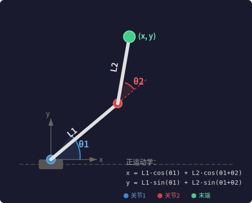
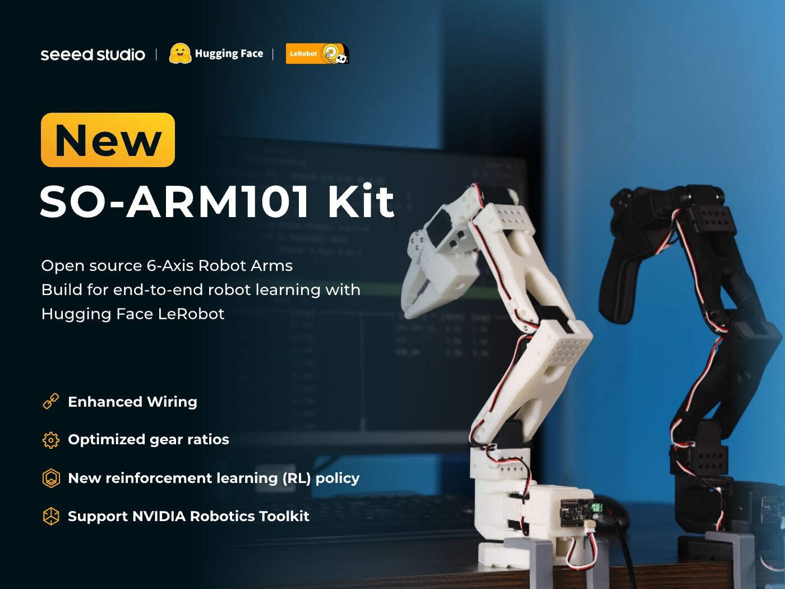

【机器人AI入门】大模型玩不起预训练？那来学学机器人开发吧

━━━━━━━━━━━━━━━━━━━━

◆ 为什么突然聊机器人

━━━━━━━━━━━━━━━━━━━━

2026 年春节，中国的机器人在春晚上蹦蹦跳跳的，我心想这大概是老黄又卖了什么新玩意儿。

一搜，还真是。不过让我更意外的是：**机器人 AI 的入门门槛，比大模型低得多。**

训一个大语言模型要什么？Meta 训 Llama 3 405B 用了 16384 张 H100，训了 54 天。按当前 H100 云租价大约 15 元/小时/卡算，光算力成本就是 3 亿人民币。你全参数微调一个 70B 的模型，光权重就 140GB（FP16），加上 Adam 优化器状态要 ~560GB 显存，10 张 A100 80GB 起步。用 LoRA 省点显存也得 4 张。推理跑个 7B 模型，也得有张 4090 或者 A100。

整条链路的入场券是显存。没有大显存，你连模型权重都加载不了，更别说训。

那机器人 AI 的入场券是什么？

**一台普通电脑 + `pip install mujoco`。**

这不是夸张。下面展开说。

━━━━━━━━━━━━━━━━━━━━

◆ 一个信号：即将召开的 ICLR 2026 VLA 投稿量 18 倍增长

━━━━━━━━━━━━━━━━━━━━

VLA（Vision-Language-Action）是机器人领域当前最火的方向——用视觉和语言理解来生成机器人动作。ICLR（International Conference on Learning Representations，机器学习顶会，和 NeurIPS、ICML 并列三大）2025 年收到 VLA 相关投稿约 9 篇，2026 年这个数字飙到了 164 篇。18 倍增长。

学术界的嗅觉比工业界快半拍。当一个方向的投稿量出现指数级增长时，说明底层技术刚刚成熟到可以产出论文的阶段。翻译成程序员能听懂的话：**这个赛道刚过了"能跑通 demo"的拐点，还远没到"被大厂垄断"的阶段。**

━━━━━━━━━━━━━━━━━━━━

◆ 成本对比：大模型 vs 机器人 AI

━━━━━━━━━━━━━━━━━━━━

先看一张表：

```
环节          大模型 (LLM)              机器人 AI (RL/VLA)
────────────────────────────────────────────────────────────────
预训练        H100 集群，千万美元起       不需要预训练（用现成 VLA 模型）
微调/训练     10×A100 80GB 起步（全参数）  单张 RTX 3090/4090 即可
仿真环境      不适用                     MuJoCo（免费）/ Isaac Lab（免费）
推理          A100 / 4090               CPU 都能跑（450M 模型）
典型模型大小  7B ~ 万亿参数               450M ~ 7B
入门硬件门槛  ~7 万+                      0（纯仿真）/ ~2800 元（实物臂）
```

重点看模型大小的演进趋势：

**RT-2（Google, 2023）**：55B 参数。需要 TPU 集群推理。
**OpenVLA（TRI + Stanford, 2024）**：7B 参数。在多个基准上打败了 55B 的 RT-2。
**SmolVLA（HuggingFace, 2025）**：450M 参数。MacBook 上就能跑推理。

从 55B 到 7B 到 450M——两年缩小了 120 倍，性能还在涨。

为什么能缩这么小？因为机器人的动作空间比语言空间小得多。语言模型要生成人类所有可能的句子（token 空间几万维），机器人只需要输出 6~7 个关节角度（连续空间，几维到几十维）。**任务简单，模型就不需要那么大。**

━━━━━━━━━━━━━━━━━━━━

◆ 为什么 2025 年以来机器人突然"动起来了"

━━━━━━━━━━━━━━━━━━━━

过去十年，机器人 AI 一直是"论文很多、落地很少"的状态。最近两年突然加速，原因有四个：

**1. MuJoCo 开源（2022）**

MuJoCo（Multi-Joint dynamics with Contact）是目前最主流的机器人物理仿真引擎。由 Emanuel Todorov 在华盛顿大学开发，2015 年商业化后收费约 2 万元/年/license。2021 年 DeepMind 收购了 MuJoCo 的母公司 Roboti LLC，2022 年把它完全开源（Apache 2.0 协议）。

2 万/年变成 0。这一步直接把仿真环境的门槛炸平了。

**2. NVIDIA Isaac Gym / Isaac Lab 并行仿真**

传统仿真是串行的：跑一个环境，收集数据，训练，再跑。NVIDIA 的 Isaac Gym（2021）和后续的 Isaac Lab 做了一件事：**在 GPU 上并行跑几千个仿真环境**。

效果有多夸张？ETH Zurich 的 Nikita Rudin 团队在 2022 年用 Isaac Gym 训练四足机器人行走策略，同样的任务以前要 CPU 集群跑 30 小时，用 Isaac Gym 单张 A100 只要 4 分钟。**300 倍加速。**

这意味着你用一张消费级 GPU（RTX 3090/4090），在几分钟到几小时内就能训出一个可用的机器人控制策略。大模型微调动辄几天几周，这个时间尺度完全不同。

**3. 硬件成本暴跌**

高盛 2025 年 1 月的研报指出，人形机器人关键零部件成本在过去两年下降了约 40%。这主要归功于中国供应链——电机、减速器、传感器的国产替代让 BOM（物料清单）成本从 15 万美元级别降到 5-8 万美元。

对个人开发者更直接的：一条 6-DOF 机械臂（SO-101，LeRobot 生态），已组装版约 2800 元。

**4. Sim-to-Real 可用了**

以前仿真里训好的策略放到真机器人上，十有八九不能用。因为仿真和现实之间有"sim-to-real gap"——摩擦力不一样，重力加速度有偏差，传感器有噪声。

解决方案叫 **Domain Randomization（域随机化）**：训练时故意把物理参数随机扰动（摩擦系数随机、质量随机、延迟随机），逼模型学到对这些扰动鲁棒的策略。这招在 2023-2024 年被证明在多个任务上有效——仿真训好的策略直接部署到真机上，成功率从 10% 提升到 70-90%。

给程序员翻译一下：Domain Randomization 就是**数据增强的物理版**。图像分类里你随机翻转、裁剪、加噪声；机器人训练里你随机改摩擦力、改重量、改延迟。本质一样：让模型见过足够多的变体，部署时才不会翻车。

━━━━━━━━━━━━━━━━━━━━

◆ 先别动手——搞清楚这些东西都是啥

━━━━━━━━━━━━━━━━━━━━

动手之前，先把你会碰到的东西认全。不然装了一堆也不知道谁是谁：

```
名字               是什么               类比
──────────────────────────────────────────────────────
MuJoCo            物理引擎              游戏里的 PhysX（Unity/Unreal 用的那个）
LeRobot           机器人 AI 框架        相当于 HuggingFace Transformers，但给机器人用
Diffusion Policy  一种策略模型          相当于 GPT 是一种语言模型
Push-T            一个测试任务          相当于 MNIST 手写数字识别
MJCF / URDF       机器人模型文件        相当于 3D 模型的 .obj / .fbx
Isaac Sim         NVIDIA 的仿真平台     MuJoCo + 训练框架的全家桶版
SO-101            一条实体机械臂        真的硬件，2800 元
```

它们之间的关系：

```
MuJoCo（物理引擎）造了一个虚拟世界
  └→ LeRobot（框架）在这个世界里训练/测试 AI
       └→ Diffusion Policy（模型）是 AI 的大脑
            └→ Push-T（任务）是考试题
```

搞清楚了再往下走。

━━━━━━━━━━━━━━━━━━━━

◆ 环境配置

━━━━━━━━━━━━━━━━━━━━

下面是实操部分。我们从最简单的开始。

> 提示：如果你怕污染宿主机环境，可以用 Docker（比如 `nvcr.io/nvidia/pytorch` 镜像）或者 conda 虚拟环境。下面的命令在哪跑都一样。

────────────────────

**第一步：安装 MuJoCo**

```bash
# Python 3.9+ 即可
pip install mujoco mediapy
```

就这么简单。不需要编译，不需要 license。MuJoCo 的物理仿真跑的是 CPU（算的是牛顿力学方程，不是矩阵乘法），所以不需要 CUDA，任何电脑都能跑。等你需要同时跑几千个并行环境训 RL 时，再上 NVIDIA Isaac Lab——那才需要 GPU。

────────────────────

**第二步：跑第一个仿真**

创建一个 `hello_mujoco.py`：

```python
import mujoco
import mediapy

# MuJoCo 用 XML 描述机器人模型（叫 MJCF 格式）
# 这里做一个钟摆：铰链在上，杆子挂下来，末端一个球
XML = """
<mujoco>
  <worldbody>
    <light pos="0 0 3"/>
    <body pos="0 0 2">
      <joint type="hinge" axis="0 1 0"/>
      <geom type="capsule" fromto="0 0 0 0 0 -0.5" size="0.02" rgba="0.8 0.8 0.8 1"/>
      <body pos="0 0 -0.5">
        <geom type="sphere" size="0.08" rgba="1 0 0 1" mass="1"/>
      </body>
    </body>
  </worldbody>
</mujoco>
"""

model = mujoco.MjModel.from_xml_string(XML)
data = mujoco.MjData(model)

# 给钟摆一个初始角度，松手让它摆
data.qpos[0] = 1.5  # 1.5 弧度（约 86 度）

# 渲染器
renderer = mujoco.Renderer(model, width=640, height=480)

# 跑 2000 步物理仿真（默认 timestep=0.002s，共 4 秒）
# 注意：这里和游戏引擎不一样。
# 游戏引擎物理计算通常比画面慢（Unity 50次/秒 < 渲染 60fps），不精确没关系，好看就行。
# 机器人仿真反过来：物理计算必须比画面快得多（MuJoCo 500次/秒 >> 渲染 30fps），
# 因为机器人需要精确的接触力——算粗了，抓杯子直接穿过去，训出来的策略在真机上没法用。
frames = []
for i in range(2000):
    mujoco.mj_step(model, data)
    if i % 10 == 0:  # 每 10 步才存一帧画面，物理精度远高于画面精度
        renderer.update_scene(data)
        frames.append(renderer.render().copy())

# 存成 mp4
mediapy.write_video("hello_mujoco.mp4", frames, fps=30)
print(f"视频已保存，共 {len(frames)} 帧")
```

运行：

```bash
# 如果在 Docker 里，先设无头渲染
export MUJOCO_GL=egl

python hello_mujoco.py
```

你会得到一个 mp4 视频：一个钟摆在重力下来回摆动。恭喜，你的第一个物理仿真跑起来了。

（视频：assets/146/1.锤子摆动.mp4）

> 如果你在有显示器的环境里（宿主机、带 X11 的 WSL），可以把上面代码换成 `mujoco.viewer.launch(model, data)`，直接弹窗口实时看。

这段代码做了什么？
1. 用 XML 定义了一个"世界"：一根杆子挂着一个红色球，顶端用铰链固定
2. `MjModel` 解析 XML，生成物理模型（质量、惯性矩、碰撞几何）
3. `MjData` 存储仿真状态（位置、速度、力）
4. 循环调用 `mj_step(model, data)` 做物理积分，每一步根据牛顿力学更新位置和速度
5. `Renderer` 把物理状态渲染成图像帧，最后拼成视频

────────────────────

**MuJoCo 和 Isaac Lab 的区别**

MuJoCo 够你学概念、跑 demo、理解策略模型。但它有一个硬限制：**物理仿真跑在 CPU 上，一次只能跑一个环境。**

训练强化学习（RL）需要智能体反复试错几百万次。一个环境串行跑，训一个人形行走策略可能要 30 小时。Isaac Lab 的做法是把物理仿真搬到 GPU 上，同时跑 2048~4096 个并行环境，同样的任务 4 分钟训完。**这就是"300 倍加速"的来源。**

所以分工很清楚：
- **学概念、跑预训练模型的 demo** → MuJoCo 就够
- **自己训 RL 策略** → 需要 Isaac Lab + NVIDIA GPU（RTX 3070 以上）

Isaac Lab 的安装比较重（Isaac Sim 本身约 10GB，只支持 NVIDIA GPU），这篇不展开，后续单独写。

────────────────────

**第三步：用 LeRobot 跑第一个机器人 AI demo**

HuggingFace 的 LeRobot 是目前机器人 AI 领域最重要的开源生态。它的定位是"机器人领域的 HuggingFace Transformers"——统一的模型库 + 数据集 + 训练流水线。

LeRobot 提供的东西：

- **预训练模型**：ACT、Diffusion Policy、VLA 等主流策略模型
- **标准数据集**：HuggingFace Hub 上大量机器人操作数据集
- **训练脚本**：开箱即用的训练流水线
- **硬件支持**：直接对接 SO-100/SO-101 机械臂、Koch v1.1 等消费级硬件

```bash
# 安装 LeRobot（含 MuJoCo、Push-T 仿真环境）
pip install 'lerobot[aloha,pusht]'

# 验证
python3 -c "import lerobot; print(lerobot.__version__)"
python3 -c "import mujoco; print(mujoco.__version__)"

# 如果在 Docker 容器里（没有显示器），用 EGL 做无头渲染
export MUJOCO_GL=egl
```

装好后跑一个真正的机器人 AI demo —— **Push-T**：用 Diffusion Policy（扩散策略）控制一个圆形"手指"，把 T 形积木推到目标位置。

如果你熟悉 LLM，可能会问：这东西的输入输出到底是什么？来对比一下：

```
LLM:
  输入：一段文字（token 序列）
  输出：下一个 token
  循环：不断预测下一个 token，拼成完整回答

Diffusion Policy（Push-T）:
  输入：一张 96×96 的摄像头截图 + 手指当前的 x,y 坐标
  输出：未来 16 步的 x,y 位移序列（一次规划一小段轨迹，不是直线，方向每步都不同）
  循环：执行几步后重新拍照、重新预测下一段 16 步轨迹，不断循环
```

**本质都是：看到现状 → 预测下一步动作。** LLM 预测的是下一个字，Diffusion Policy 预测的是下一个动作。

区别在于：LLM 的输出是**离散**的（从几万个 token 里选一个），机器人的输出是**连续**的（x 位移 0.003，y 位移 -0.017……是实数）。这也是为什么机器人用扩散模型而不是自回归——连续值没法"从词表里选一个"，但可以"从噪声里去噪出来"。

搞清楚了输入输出，再把几个名词的关系理清楚：

| 名词 | 是什么 | 类比 |
|------|--------|------|
| LeRobot | 框架 | HuggingFace Transformers |
| Diffusion Policy | 模型架构 | BERT、GPT（一种模型设计）|
| Push-T | 任务 | ImageNet 分类、SQuAD 问答 |
| lerobot/diffusion_pusht | 预训练权重 | bert-base-uncased（在特定任务上训好的一组参数）|

所以我们要做的是：**用 LeRobot 框架，加载 Diffusion Policy 模型在 Push-T 任务上训好的权重，跑 10 局考试看成绩。**

再说清楚这个模型本身：

- **架构**：Diffusion Policy = ResNet18（眼睛）+ 1D U-Net（大脑）
- **ResNet18** 是 2015 年的视觉模型，这里只当特征提取器用——把 96×96 的图片压缩成特征向量。Push-T 任务很简单（桌面上就一个积木和一个手指），不需要 ViT 这种大模型，ResNet18 绰绰有余
- **1D U-Net** 才是核心，这是扩散模型的去噪网络，2020 年之后的东西。它负责从噪声中"去噪"出动作序列
- **输入**：96×96 摄像头画面 + 手指的 x, y 坐标
- **输出**：未来 16 步的 x, y 位移序列（16×2 = 32 个数）
- **参数量**：约 2.5 亿（250M），权重文件 1GB
- **训练方式**：人类用鼠标示范推积木，录了很多局，模型从中学策略（模仿学习）

这里和 LLM 的思路完全不同：LLM 靠堆参数提升通用能力，机器人任务是特定的（推积木、抓杯子），**够用就行，小而快的模型反而好**——推理慢了手就跟不上。

"扩散模型"听着唬人，但核心思路一句话：**往数据上加噪声直到变成纯噪声，然后训一个网络学会反过来去噪。** 生成图片时，从纯噪声去噪出一张图；生成动作时，从纯噪声去噪出一组关节位移。同一个套路，换了输出对象。这篇先知道这一句就够了，扩散模型的数学原理后续单独写。

```bash
# 先下载预训练模型（约 1GB，如果网络不通，在能科学上网的机器上下载后拷过来）
huggingface-cli download lerobot/diffusion_pusht --local-dir /tmp/diffusion_pusht
# 如果是在 Docker 里跑，从宿主机拷进容器（换成你自己的容器名）：
docker cp /tmp/diffusion_pusht your_container:/workspace/models/diffusion_pusht

# 模型格式迁移：HuggingFace 上的预训练模型是旧版 LeRobot（0.4.x）发布的，
# 新版（0.5.0）改了归一化配置的存储方式，不兼容。类似 Python 2 代码要 2to3 转一下。
# 转完后模型存到 diffusion_pusht_migrated 目录，只需跑一次
python3 -m lerobot.processor.migrate_policy_normalization \
  --pretrained-path /workspace/models/diffusion_pusht

# 跑 10 局仿真考试
python3 -m lerobot.scripts.lerobot_eval \
  --policy.path=/workspace/models/diffusion_pusht_migrated \
  --env.type=pusht --env.task=PushT-v0 \
  --eval.n_episodes=10 --eval.batch_size=10 \
  --output_dir=outputs/eval/pusht_demo
```

结果：**10 局成功 6 局，成功率 60%，GPU 上跑 71 秒。** 其实肉眼看大部分都推到位了，但判定标准很严——积木和目标位置的重合度必须达到 100% 才算成功，差 0.2% 都算失败。

（视频：assets/146/eval_episode_0.mp4）

这 71 秒里发生了什么？
1. MuJoCo 造了一个虚拟桌面，上面有 T 形积木和圆形手指
2. Diffusion Policy（扩散策略）是"大脑"——看画面 + 手指位置，输出"手指往哪移"
3. 模型是别人用**模仿学习**训好的：人类先用鼠标示范推积木，录数据，模型从中学策略
4. eval = 让这个大脑跑 10 局考试，记录成功率

**一句话：请一个学过推积木的 AI 来考试，考了 60 分。**

────────────────────

**踩坑记录（省你半天）**

1. **HuggingFace 下载慢/不通**：国内访问 HuggingFace 经常抽风，用镜像源或提前下载模型到本地
2. **opencv 报错 `libxcb.so.1`**：如果在无图形界面环境里，装 headless 版：`pip install opencv-python-headless --force-reinstall`
3. **huggingface-hub 版本冲突**：lerobot 会升级 huggingface-hub 到 1.7+，跟 transformers 打架，解法：`pip install transformers -U`
4. **模型格式迁移**：lerobot 0.5.0 新增了 processor 格式，旧模型必须跑 `migrate_policy_normalization`

━━━━━━━━━━━━━━━━━━━━

◆ 关键概念速查——给程序员翻译

━━━━━━━━━━━━━━━━━━━━

机器人领域有很多术语，第一次看到会觉得陌生，但其实对程序员来说都不难。逐个翻译：

```
机器人术语           程序员翻译
──────────────────────────────────────────────────────
URDF / MJCF         机器人的 3D 模型文件（XML 格式）
                     URDF 是 ROS 生态的，MJCF 是 MuJoCo 的（见下方说明）

DOF                  自由度 = 能独立运动的维度数
(Degrees of Freedom) 6-DOF 机械臂 = 6 个关节，每个能独立转

正运动学             给定关节角度，算末端（手）在哪
(Forward Kinematics) 本质是矩阵连乘：T = T1 × T2 × ... × Tn
                     每个 Ti 是 4×4 齐次变换矩阵

逆运动学             给定目标位置，算关节角度该多少
(Inverse Kinematics) 本质是解非线性方程组（通常用迭代法）
                     正运动学的"反函数"

PID 控制             AI 之前的传统控制方法，现在退居底层
                     原理就是空调恒温器：差多少使多大劲(P)，
                     一直没到位就加劲(I)，快到了就减速(D)
                     现在 AI 说"转到 30 度"，PID 负责让电机真的转过去

Domain Randomization 数据增强的物理版
                     图像增强：随机翻转、裁剪、加噪
                     物理增强：随机摩擦力、随机质量、随机延迟

Sim-to-Real          仿真训好直接部署到真机器人
                     ≈ 本地开发完直接上生产，能不能跑看你测试够不够

强化学习 (RL)        智能体在环境中试错，靠奖励信号学策略
                     ≈ 写了个 bot，让它在游戏里自己玩自己学

模仿学习 (IL)        就是监督学习，换了个名字
                     输入=图像/状态，标签=人类的动作，loss=预测和标签的差距
                     单独起名是为了跟强化学习(RL)区分：RL 自己试错，IL 抄人类作业

VLA                  视觉 + 语言 → 动作
(Vision-Language-    输入：摄像头画面 + 语言指令
 Action)             输出：机器人关节动作
                     本质是个多模态模型，只是输出维度很低
```

────────────────────

**ROS 和 MuJoCo 的区别**

这两个名字经常一起出现，但干的事完全不同：

| | ROS | MuJoCo |
|---|---|---|
| **全称** | Robot Operating System | Multi-Joint dynamics with Contact |
| **诞生** | 2007 年，斯坦福/Willow Garage | 2012 年，华盛顿大学 Emanuel Todorov |
| **是什么** | 中间件框架，管通信调度 | 物理仿真引擎，算力学 |
| **解决什么问题** | 机器人各模块（传感器、电机、摄像头、规划器）之间怎么发消息 | 虚拟世界里东西怎么动（碰撞、摩擦、重力） |
| **类比** | Kubernetes——不干活，管调度 | Unity 的 PhysX——只管物理计算 |
| **谁在用** | 搞真实机器人的几乎都用 | 搞机器人 AI 训练的几乎都用 |
| **开源** | 一直开源 | 2022 年 DeepMind 收购后开源 |

两者经常一起用：MuJoCo 在仿真里训策略，ROS 管真实机器人的硬件通信。但如果你只做仿真不碰真机器人，**完全不需要 ROS**。本文只用 MuJoCo。

────────────────────

**正运动学和逆运动学**稍微展开一下，因为这是机器人最基础的数学。

想象一个 2 关节的平面机械臂，两段臂长分别是 L1 和 L2，两个关节角分别是 θ1 和 θ2。



正运动学（关节角 → 末端位置）：

```
x = L1·cos(θ1) + L2·cos(θ1 + θ2)
y = L1·sin(θ1) + L2·sin(θ1 + θ2)
```

就是高中三角函数。给你角度，直接代公式算出末端坐标。

逆运动学（末端位置 → 关节角）：

```
θ2 = arccos((x² + y² - L1² - L2²) / (2·L1·L2))
θ1 = atan2(y, x) - atan2(L2·sin(θ2), L1 + L2·cos(θ2))
```

2 关节能直接用公式算出精确答案。但 6 关节以上没有这样的公式，只能用数值方法一步步逼近（比如雅可比迭代）。这就是为什么逆运动学比正运动学难——正向是代入计算，反向是解方程，而且关节一多连方程都解不了。

不过别慌——**用了 AI 之后，逆运动学基本不用手算了。** 前面的 Diffusion Policy 直接从图像预测关节位移，跳过了"先算目标位置再解逆运动学"这一步。这也是为什么现在的 VLA 模型都是端到端的：输入图像，直接输出动作，中间不需要人类写运动学方程。了解正/逆运动学是为了知道传统方法在干嘛，但你不需要手写这些公式。

━━━━━━━━━━━━━━━━━━━━

◆ 如果你想碰实物

━━━━━━━━━━━━━━━━━━━━

仿真能学到 80% 的东西，但最终你可能想摸到真铁。

当前最便宜的入门方案：



**SO-101 机械臂** —— 由 HuggingFace LeRobot 团队设计，6-DOF + 夹爪，已组装版约 2800 元。配合 LeRobot 框架，整个流程是：

1. **遥操作采集数据**：用另一条"领导臂"（leader arm）手动操作，"跟随臂"（follower arm）模仿动作，同时录摄像头画面
2. **训练策略模型**：用采集的数据训练 ACT / Diffusion Policy 模型，单张 GPU 几小时
3. **部署推理**：模型输出关节角度，直接发送给机械臂执行

整套流程 LeRobot 都有开箱即用的脚本。

**但说实话，先不急买硬件。** 仿真环境免费、无限重置、不怕摔坏，是最好的学习环境。等你在仿真里把 RL 和 IL 都跑通了，对控制策略有了直觉，再买硬件不迟。

━━━━━━━━━━━━━━━━━━━━

◆ 真正的门槛在哪

━━━━━━━━━━━━━━━━━━━━

说了这么多低门槛，也要说说真正难的地方：

**1. 数据**

大模型的数据是互联网文本，近乎无限。机器人的数据是物理世界的操作录像，非常稀缺。Google 的 RT-2 用了 130,000 条机器人演示数据，采集成本远高于爬网页。

这也是为什么 VLA 模型越做越小——数据量撑不起大模型。

**2. 仿真与现实的差距**

Domain Randomization 能弥合很大一部分差距，但不是全部。接触力丰富的任务（比如拧瓶盖、折衣服）仿真还很难做准。这是当前整个领域的 open problem。

**3. 长序列任务**

让机器人抓起一个杯子，大家都能做。让机器人"去厨房打开冰箱拿出牛奶倒进杯子"，涉及路径规划 + 多步操作 + 错误恢复，目前还很难。

但这些门槛有一个共同特点：**它们不是算力门槛。** 不是说你砸钱买 GPU 就能解决。它们是工程问题、数据问题、算法问题——恰恰是个人开发者可以用聪明才智去攻克的。

━━━━━━━━━━━━━━━━━━━━

◆ 总结

━━━━━━━━━━━━━━━━━━━━

```
大模型入门：买 GPU → 微调 → 推理 → 打不过 OpenAI
机器人 AI 入门：pip install → 仿真训练 → 做出别人没做过的东西
```

大模型赛道已经是资本游戏。几十亿美元的预训练成本意味着个人开发者只能在最后一公里（LoRA、RAG、Agent）上做文章，核心模型能力由几家大厂决定。

机器人 AI 不一样。MuJoCo 免费、模型 450M 就能跑、消费级 GPU 就能训、任务空间碎片化（抓取、行走、飞行、手术……每个细分都需要专门的数据和策略）。大厂还没来得及垄断，甚至还没想清楚怎么赚钱。

**这是个人开发者的机会窗口。**

窗口不会永远开着。但现在，它开着。

━━━━━━━━━━━━━━━━━━━━

// 靳岩岩的 AI 学习笔记 × Claude 的严谨 × Gemini 的浪漫
// 2026-04-07
