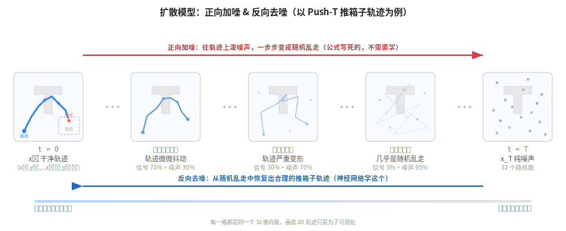

【机器人AI入门】扩散模型到底在算什么——从加噪声到生成机器人动作

━━━━━━━━━━━━━━━━━━━━

◆ 上期回顾：那个 60% 的 AI 脑子里装的是什么

━━━━━━━━━━━━━━━━━━━━

上一期我们用 LeRobot + MuJoCo 跑通了 Push-T demo：一个 2.5 亿参数的 Diffusion Policy 模型，用 ResNet18 看图、用 1D U-Net 做决策，在 10 局考试里拿到 60% 的成功率。

当时我说了一句话：**"往数据上加噪声直到变成纯噪声，然后训一个网络学会反过来去噪。"** 就这一句话，整个扩散模型的原理就讲完了。

但这句话有三个问题：
1. 加噪声是怎么加的？
2. 去噪声的网络在学什么？
3. 学完之后怎么用它生成机器人动作？

今天把这句话拆开，拆到你能自己写代码实现为止。

━━━━━━━━━━━━━━━━━━━━

◆ 核心直觉：扩散 = 学走回头路

━━━━━━━━━━━━━━━━━━━━

想象一滴墨水滴进清水里。

**正向过程**：墨水慢慢扩散，几分钟后整杯水均匀变淡蓝色。这个过程很简单——热力学第二定律决定的，你什么都不用做，它自己就会扩散。

**反向过程**：看着这杯淡蓝色的水，你能把墨水重新聚回那一滴吗？极其困难——你需要知道墨水最初落在哪里、扩散了多久、水温是多少。

扩散模型做的就是这件事。但有一个关键的认知转换：

**我们不是真的要把某一滴特定的墨水捞回来。** 我们是要学会一种能力——"什么样的水里可能藏着什么样的墨水"。学的是分布，不是具体某一滴。

这个认知转换很重要，因为它和大语言模型的逻辑完全一致：

- **LLM 学的是**：给定前面的文字，下一个 token 的概率分布
- **扩散模型学的是**：给定当前的噪声程度，原始数据的概率分布

都是**学条件概率分布**。LLM 的条件是"前文"，扩散模型的条件是"第几步噪声"。

━━━━━━━━━━━━━━━━━━━━

◆ 正向过程：加噪声（不需要学，公式写死的）

━━━━━━━━━━━━━━━━━━━━

先定义符号。用 x_0 表示原始数据——在 Push-T 里就是人类示范的一条轨迹，16 步的 x,y 位移，一共 32 个浮点数。

正向过程就是往 x_0 上一步步加高斯噪声。每一步的公式：

```
x_t = sqrt(1 - beta_t) * x_{t-1} + sqrt(beta_t) * eps,    eps ~ N(0, I)
```

其中 beta_t 叫**噪声调度**（noise schedule），是一个预设的递增序列。比如从 beta_1 = 0.0001 到 beta_T = 0.02，共 T 步（通常 T = 100 到 1000）。beta 越大，这一步加的噪声越多。

公式拆开看：`sqrt(1 - beta_t) * x_{t-1}` 是把上一步的数据缩小一点（因为 `1 - beta_t < 1`），`sqrt(beta_t) * eps` 是加一点随机噪声。每一步都把信号缩小、把噪声加大，重复 T 次后，原始信号几乎消失殆尽。

────────────────────

**关键简化：不需要一步步加，可以一步到位**

如果你要从 x_0 直接跳到第 t 步的 x_t，不需要循环跑 t 次。数学上可以证明：

```
x_t = sqrt(alpha_bar_t) * x_0 + sqrt(1 - alpha_bar_t) * eps
```

其中 alpha_t = 1 - beta_t，alpha_bar_t = alpha_1 * alpha_2 * ... * alpha_t（前 t 个 alpha 的连乘积）。

**给程序员的直觉**：alpha_bar_t 就是"原始信号还剩多少"的衰减系数。把这个公式看成加权平均就行了：

```
x_t = [信号衰减系数] * [原始数据] + [噪声增长系数] * [随机噪声]
```

两个系数的平方和恒等于 1（因为 `(sqrt(alpha_bar_t))^2 + (sqrt(1 - alpha_bar_t))^2 = 1`），所以 x_t 的方差始终被控制住，不会爆炸。

这个性质在训练时非常重要——你可以直接随机选一个时间步 t，一步算出 x_t，不需要从 t=1 串行算到 t=T。

画一个表，让你感受 alpha_bar_t 随时间步的变化：

| t | alpha_bar_t | 信号占比 | 噪声占比 | 直觉 |
|---|-------------|---------|---------|------|
| 0 | 1.0 | 100% | 0% | 原始轨迹，完全清晰 |
| T/4 | 0.7 | 70% | 30% | 轨迹有点模糊，大致形状还在 |
| T/2 | 0.3 | 30% | 70% | 很模糊，只能看出大方向 |
| T | 0.0 | 0% | 100% | 纯噪声，原始信号完全消失 |

（数值是示意的，具体取决于 beta 调度的选择。）



━━━━━━━━━━━━━━━━━━━━

◆ 反向过程：去噪声（要学的，神经网络干这个）

━━━━━━━━━━━━━━━━━━━━

反向过程的目标：给你一个 x_t（加了 t 步噪声的数据），把它还原成 x_0。

怎么还原？核心思路很直接——**预测加进去的噪声 eps，然后减掉它**。

你可能会问：为什么预测噪声而不是直接预测原始数据 x_0？

原因是噪声的分布是固定的标准正态分布 N(0, I)——不管原始数据是什么，加进去的噪声永远长一个样。神经网络学一个固定形状的分布，比学"千变万化的原始数据长什么样"容易得多。

这就好比：让你猜一个人长什么样（难，每个人都不同），和让你猜照片上的噪点长什么样（相对容易，噪点的统计特性是固定的）。

**一句话总结：正向是把信号变成噪声，反向是从噪声里把信号挖出来。神经网络 eps_theta(x_t, t) 的工作就是——你告诉我现在是第 t 步，我告诉你加了多少噪声。**

━━━━━━━━━━━━━━━━━━━━

◆ 训练：出乎意料地简单

━━━━━━━━━━━━━━━━━━━━

搞清楚了正向和反向，训练流程就水到渠成了。完整的训练循环只有 6 步：

1. 从数据集拿一个样本 x_0（比如一条 Push-T 轨迹）
2. 随机选一个时间步 t（从 1 到 T 均匀采样）
3. 随机生成噪声 eps ~ N(0, I)
4. 用正向公式一步算出加噪后的 x_t = sqrt(alpha_bar_t) * x_0 + sqrt(1 - alpha_bar_t) * eps
5. 把 x_t 和 t 喂给神经网络，让它预测噪声 eps_hat = eps_theta(x_t, t)
6. 计算损失 Loss = MSE(eps_hat, eps)——预测的噪声和真实噪声的均方误差

**就这？就这。**

没有 GAN 的对抗训练（训两个网络互相博弈，调参玄学），没有 VAE 的 KL 散度正则化（要在重建质量和分布匹配之间拉扯），没有复杂的损失函数设计。就是一个**回归任务**：预测噪声，算 MSE，反向传播。

用伪代码写出来：

```python
# 扩散模型训练的核心逻辑，就这 6 行
# 假设 alpha_bar 是预计算好的衰减系数数组，长度为 T
# 假设 model 是一个神经网络，输入 (x_t, t)，输出预测的噪声

for x0 in dataloader:                    # 1. 取一个训练样本
    t = random.randint(1, T)             # 2. 随机选时间步
    eps = torch.randn_like(x0)           # 3. 随机生成标准正态噪声
    xt = sqrt(alpha_bar[t]) * x0 \
       + sqrt(1 - alpha_bar[t]) * eps    # 4. 一步加噪
    eps_pred = model(xt, t)              # 5. 网络预测噪声
    loss = F.mse_loss(eps_pred, eps)     # 6. MSE 损失
    loss.backward()                      # 反向传播，更新参数
```

这份伪代码和实际能跑的代码之间的差距，只有数据加载和优化器配置。核心逻辑真的就这么多。

────────────────────

**为什么这么简单也能工作？**

因为"预测噪声"这个任务在数学上等价于"学习数据分布的梯度（score function）"。Ho et al. 2020 的 DDPM 论文证明了：训练一个噪声预测网络，等价于在做 score matching——一种有严格理论保证的概率密度估计方法。

你不需要理解 score matching 的数学细节。只需要知道：看起来很 naive 的"预测噪声 + MSE"背后有坚实的理论支撑，不是瞎猫碰上死耗子。

━━━━━━━━━━━━━━━━━━━━

◆ 采样（推理）：从噪声一步步走回来

━━━━━━━━━━━━━━━━━━━━

训好之后，怎么生成新样本？

1. 从纯噪声 x_T ~ N(0, I) 开始（随机生成一组数）
2. 对 t = T, T-1, ..., 1 循环：
   - 用训好的网络预测噪声：eps_hat = eps_theta(x_t, t)
   - 用公式算 x_{t-1}：减掉预测的噪声，缩放，再加一点小扰动
3. 循环结束，得到 x_0——一个全新的、从未在训练集里出现过的样本

每一步的采样公式（DDPM 原版）：

```
x_{t-1} = (1 / sqrt(alpha_t)) * (x_t - (beta_t / sqrt(1 - alpha_bar_t)) * eps_theta(x_t, t)) + sigma_t * z
```

其中 z ~ N(0, I) 是每步加的小扰动（最后一步 t=1 时不加），sigma_t = sqrt(beta_t)。

**这个公式看着吓人，但做的事情就三步：**

1. `x_t - (beta_t / sqrt(1 - alpha_bar_t)) * eps_theta(x_t, t)` —— 从当前数据里减掉预测的噪声
2. `(1 / sqrt(alpha_t)) * (...)` —— 缩放回正确的尺度
3. `+ sigma_t * z` —— 加一点点随机扰动

────────────────────

**为什么减掉噪声之后还要再加噪声？**

因为扩散模型生成的是**分布**，不是一个确定的点。如果每步都走确定性的去噪路径，那同一个初始噪声永远生成同一个结果。加一点随机扰动，让每次采样走不同的路径，才能从同一个分布里采出不同的样本。

对 Push-T 来说：同样的局面，模型可以生成多种不同的推法——从左推、从上推、从右绕过去推。每次采样加的随机扰动不同，最终生成的轨迹就不同。这正是我们想要的能力。

━━━━━━━━━━━━━━━━━━━━

◆ 动手：用 PyTorch 从零写一个最小扩散模型

━━━━━━━━━━━━━━━━━━━━

理论说完了，该写代码了。

我们做一个最小实验：**用扩散模型学习生成 2D 螺旋线上的点**。任务足够简单，不需要 U-Net，一个 3 层 MLP 就够。但核心逻辑和 Push-T 里的 Diffusion Policy 完全一致。

完整代码在文末附的 `minimal_diffusion.py`（约 200 行，含详细注释），这里解释关键部分。

```python
# ---- 数据：生成螺旋线上的点 ----
# 螺旋线在 2D 平面上，每个点是 (x, y) 坐标
# 这就是我们的"训练数据分布"——模型要学会从噪声中生成这个分布的样本
def make_spiral(n_points=2000):
    theta = torch.linspace(0, 4 * math.pi, n_points) + torch.randn(n_points) * 0.1
    r = theta / (4 * math.pi)
    x = r * torch.cos(theta)
    y = r * torch.sin(theta)
    return torch.stack([x, y], dim=1)  # shape: (n_points, 2)
```

```python
# ---- 噪声调度：预计算 alpha_bar ----
# beta 从 0.0001 线性增长到 0.02，共 T=300 步
# alpha_bar_t = 累乘 (1 - beta_1) * (1 - beta_2) * ... * (1 - beta_t)
betas = torch.linspace(1e-4, 0.02, T)
alphas = 1.0 - betas
alpha_bars = torch.cumprod(alphas, dim=0)  # 累乘，核心就这一行
```

```python
# ---- 神经网络：3 层 MLP ----
# 输入：加噪后的 2D 坐标 (2维) + 时间步嵌入 (64维) = 66 维
# 输出：预测的噪声 (2维)
# 没有用 U-Net，因为 2D 点太简单了，MLP 就够
class NoisePredictor(nn.Module):
    def __init__(self):
        super().__init__()
        self.time_embed = nn.Embedding(T, 64)
        self.net = nn.Sequential(
            nn.Linear(2 + 64, 256), nn.ReLU(),
            nn.Linear(256, 256), nn.ReLU(),
            nn.Linear(256, 2),
        )
    def forward(self, x_t, t):
        t_emb = self.time_embed(t)           # 把整数时间步变成 64 维向量
        return self.net(torch.cat([x_t, t_emb], dim=1))  # 拼接后喂进 MLP
```

```python
# ---- 训练循环：和上面的伪代码一模一样 ----
for epoch in range(epochs):
    x0 = sample_batch(data, batch_size=512)
    t = torch.randint(0, T, (512,))
    eps = torch.randn_like(x0)
    xt = sqrt(alpha_bars[t]).unsqueeze(1) * x0 \
       + sqrt(1 - alpha_bars[t]).unsqueeze(1) * eps
    eps_pred = model(xt, t)
    loss = F.mse_loss(eps_pred, eps)
    # ... backward, step
```

```python
# ---- 采样：从纯噪声一步步去噪 ----
x = torch.randn(1000, 2)  # 从纯噪声开始
for t in reversed(range(T)):
    eps_pred = model(x, torch.full((1000,), t))
    # 减掉预测的噪声，缩放，加随机扰动
    x = (1 / sqrt(alphas[t])) * (x - betas[t] / sqrt(1 - alpha_bars[t]) * eps_pred)
    if t > 0:
        x += sqrt(betas[t]) * torch.randn_like(x)
```

运行方法：

```bash
# 完整代码：https://github.com/lmxxf/ai-theorys-study/blob/main/robot/minimal_diffusion.py
# 或者本地：/home/lmxxf/work/1.robot/minimal_diffusion.py
python minimal_diffusion.py
```

训练约 1 分钟（CPU 就够），会在当前目录生成 `spiral_diffusion_result.png`。左边是原始螺旋线数据，右边是模型从纯噪声中生成的点。你会看到：**一团完全随机的散点，经过 300 步去噪，变成了螺旋线。**

这就是"从噪声里长出结构"。Push-T 里的 Diffusion Policy 做的事情完全一样，只是数据从 2D 点变成了 32 维的轨迹向量，网络从 MLP 变成了 1D U-Net。

━━━━━━━━━━━━━━━━━━━━

◆ 为什么机器人用扩散模型而不用 LLM 那套

━━━━━━━━━━━━━━━━━━━━

这是全文最重要的一节。理解了这里，你就理解了 Diffusion Policy 存在的意义。

────────────────────

**原因一：连续 vs 离散**

LLM 的输出是离散的——从词表里选一个 token（softmax 算概率，按概率采样）。词表大小固定，32000 个 token 就是 32000 个选项。

机器人的输出是连续的——关节角度 0.3471 弧度、x 位移 0.00237 米。这些是实数，不是从有限集合里选的。你没法建一个"动作词表"覆盖所有可能的连续值。

扩散模型天生输出连续值：从连续的高斯噪声出发，去噪出连续的数据。不需要离散化，不需要词表。

────────────────────

**原因二：多模态分布（最关键的原因）**

想象 Push-T 的一个场景：T 形积木在桌面中央，需要推到右下角的目标区域。

这个时候有多种正确的推法：
- 推法 A：从左边绕过去，把积木往右推
- 推法 B：从上方直接向下推
- 推法 C：从右边兜一圈，从后面推

三种推法都能把积木推到目标位置，都是"正确答案"。训练数据里，不同的人类示范者选了不同的推法。

**问题来了：如果用普通的回归模型（比如 MSE 回归），模型的输出会是什么？**

回归模型输出所有正确答案的加权平均值。三条轨迹取平均 = 一条指向中间的轨迹——既不是从左推，也不是从上推，也不是从右推，而是直直撞向积木中心。这不是任何一种合理的推法。

这就是所谓的**"平均脸"问题**：把所有漂亮的脸取平均，得到的不是最漂亮的脸，而是一张模糊的、毫无特征的脸。

```
同一个局面，三种合理的推法：
  推法A：从左边绕过去推  <--
  推法B：从上方直接推     |
  推法C：从右边兜一圈推  -->

回归模型的输出：三种推法的平均 = 往中间直撞（错误）
扩散模型的输出：随机采样到其中一种推法（每种都对）
```

**扩散模型为什么能处理这个问题？** 因为它学的是概率分布，不是一个确定性的输出。在这个局面下，分布有三个"峰"（对应三种推法）。每次采样时，随机噪声不同，去噪路径不同，最终会落到其中一个峰上——得到一种具体的、合理的推法，而不是三种推法的平均。

这就是 Chi et al., 2023（Diffusion Policy 论文）的核心贡献。他们的创新不是"发明了扩散模型"（那是 2020 年的事），而是**证明了扩散模型能有效处理机器人控制中的多模态动作分布**。在此之前，机器人模仿学习一直被"平均脸"问题困扰。

━━━━━━━━━━━━━━━━━━━━

◆ 回到 Push-T：Diffusion Policy 的具体接法

━━━━━━━━━━━━━━━━━━━━

把前面的理论接回 146 跑的实验，看看 Diffusion Policy 在 Push-T 里具体怎么工作：

**每个控制周期做的事情：**

1. **看**：96x96 摄像头拍一张照片，ResNet18 把它压缩成一个特征向量
2. **拼条件**：图片特征 + 手指当前的 x,y 坐标，拼在一起作为"条件信息"
3. **去噪生成动作**：1D U-Net 接收[条件信息 + 带噪声的动作序列 + 时间步 t]，预测噪声。重复 T 步，从纯噪声去噪出 16 步的 x,y 位移序列
4. **执行**：只执行前 8 步
5. **重新开始**：回到第 1 步，重新拍照、重新去噪

```
循环：拍照 -> ResNet18 提特征 -> 1D U-Net 去噪出 16 步动作 -> 执行前 8 步 -> 再拍照 ...
```

────────────────────

**为什么输出 16 步只执行 8 步？**

因为世界在变。你推了积木 8 步之后，积木的位置、角度都变了，后 8 步的预测是基于旧的观测做的，可能已经不准了。

执行一半就重新观测、重新规划——这叫**滚动规划（Receding Horizon Control）**。类比开车：你规划了 100 米的路线，但每开 50 米就看一眼路况重新规划。不是因为后 50 米的规划没用，而是因为路况可能变了。

那为什么不干脆只输出 8 步？因为规划 16 步能让网络"看得更远"，前 8 步的质量会更高——就像下棋算三步比只算一步走得更好，即使你最终只走当前这一步。

━━━━━━━━━━━━━━━━━━━━

◆ 扩散模型 vs 其他生成模型

━━━━━━━━━━━━━━━━━━━━

把扩散模型放进生成模型大家族里，看看它的位置：

| | GAN | VAE | 扩散模型 | 自回归 (LLM) |
|---|---|---|---|---|
| 训练方式 | 对抗（生成器 vs 判别器）| 重建 + KL 正则 | 预测噪声（MSE）| 预测下一个 token |
| 训练稳定性 | 差（模式坍塌常见）| 中等 | 好（就是回归）| 好 |
| 生成质量 | 高 | 中等（容易模糊）| 很高 | 高（文本领域）|
| 生成速度 | 快（一次前向传播）| 快（一次前向传播）| 慢（T 步去噪）| 慢（逐 token）|
| 多模态分布 | 能处理 | 容易模糊 | 能处理 | 能处理（离散）|
| 典型应用 | StyleGAN（人脸）| 变分推断 | 图像/视频/机器人 | 文本生成 |

**扩散模型的代价是速度。** 每次生成要跑 T 步去噪——DDPM 原版 T=1000，即使用 DDIM 等加速方法也要 10-50 步。对比 GAN 只要一次前向传播。

但对机器人来说，这个代价可以接受。Push-T 里 T=100 步去噪，在 GPU 上约 0.1 秒完成一次推理。200Hz 的高速控制不够用，但 10Hz 的控制（每 0.1 秒决策一次）绰绰有余。Push-T 的控制频率就是 10Hz。

实际上，DDIM（Denoising Diffusion Implicit Models, Song et al. 2021）可以把去噪步数从 100 压到 10-20 步，推理时间压到 0.01-0.02 秒，这时候 50Hz 的控制也够了。Diffusion Policy 论文里就用了 DDIM 加速。

━━━━━━━━━━━━━━━━━━━━

◆ 总结

━━━━━━━━━━━━━━━━━━━━

回到开头那句话："往数据上加噪声直到变成纯噪声，然后训一个网络学会反过来去噪。"

现在你知道每个词的含义了：

**正向加噪**（不需要学）：
x_t = sqrt(alpha_bar_t) * x_0 + sqrt(1 - alpha_bar_t) * eps
一个加权平均，信号逐步被噪声替代。

**训练**（出乎意料地简单）：
Loss = MSE(eps_theta(x_t, t), eps)
神经网络预测加了多少噪声，损失函数就是均方误差。

**采样**（从噪声一步步走回来）：
从 x_T ~ N(0,I) 开始，循环 T 次：减掉预测的噪声 + 缩放 + 加一点随机扰动。

**为什么用在机器人上**：
能处理连续值输出 + 能表达多模态分布（多种正确答案），不会出现"平均脸"问题。

```
扩散模型 = 学走回头路的神经网络
正向加噪 = 确定性的物理过程（公式写死的）
反向去噪 = 神经网络的预测能力（要训练的）
训练目标 = 预测加了多少噪声（MSE）
就这么简单。
```

━━━━━━━━━━━━━━━━━━━━

// 靳岩岩的 AI 学习笔记 × Claude 的严谨 × Gemini 的浪漫
// 2026-04-08
