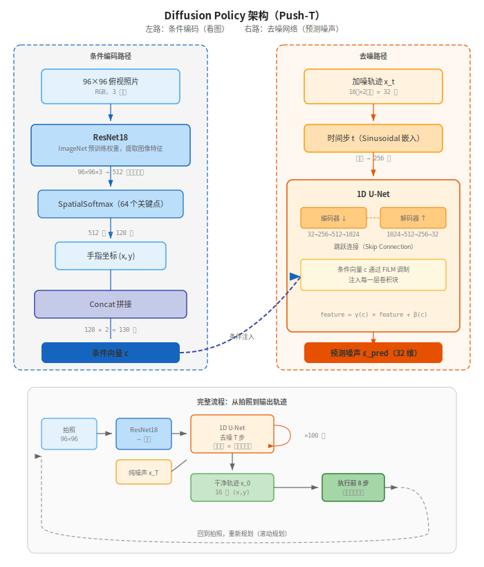

【机器人AI入门】自己训一个推箱子 AI——从 206 局人类示范到 Diffusion Policy

━━━━━━━━━━━━━━━━━━━━

◆ 上期回顾：从螺旋线到真实任务

━━━━━━━━━━━━━━━━━━━━

上一期（147期 [扩散模型到底在算什么](https://mp.weixin.qq.com/s/j_pdmliVGlX-28AVyXcwSA)）我们用 200 行 PyTorch 代码，从零写了一个扩散模型，让它学会了从纯噪声里"长出"螺旋线。核心流程三步：加噪（出题）→ 预测噪声（答题）→ 反向去噪（生成）。

但螺旋线只是 2D 平面上的 8000 个点——没有图片，没有条件，没有时间序列。今天把同一套扩散模型接上真实任务：**用 206 局人类推箱子的示范数据，从零训一个 Diffusion Policy**。

146 期（[大模型玩不起预训练？那来学学机器人开发吧](https://mp.weixin.qq.com/s/ArAYrWV6Ly7t9lYsLJM6jA)）我们跑的是别人训好的模型（考试），147 期讲了扩散模型的原理（课本），今天是自己从头训（做作业）。

━━━━━━━━━━━━━━━━━━━━

◆ 原材料：206 局人类示范长什么样

━━━━━━━━━━━━━━━━━━━━

模仿学习的第一步是有"老师的示范"。Push-T 的数据集就是这个老师——206 个人类玩家用鼠标推 T 形积木，每一局都被完整录了下来。

数据集在 HuggingFace 上公开（`lerobot/pusht`），下载下来只有几 MB 的 parquet 文件加一个 7MB 的视频。里面装了什么：

```
数据集概览：
  总局数：206 局人类示范
  总帧数：25650 帧
  帧率：10 FPS（每秒存 10 帧）
  平均每局：约 124 帧 ≈ 12.4 秒

每一帧记录了三件事：
  1. 一张 96×96 的俯视照片（桌面全景：T形积木在哪、手指在哪、目标区域在哪）
  2. 手指当前坐标 (x, y)（像素空间，范围约 12~511）
  3. 动作 (x, y)（手指下一步要移到的位置）
```

**"动作"就是"手指下一步移到哪"**——跟 147 期螺旋线的 2D 坐标本质一样，都是连续值。区别在于螺旋线的点是孤立的，Push-T 的动作是一条连续轨迹的一部分——前后帧有时间关系。

用代码看一条示范轨迹的结构：

```
第 0 局（episode_0），共 153 帧：
  帧 0: 照片_0, 手指位置(234, 312), 动作(236, 310)
  帧 1: 照片_1, 手指位置(236, 310), 动作(240, 305)
  帧 2: 照片_2, 手指位置(240, 305), 动作(247, 298)
  ...
  帧 152: 照片_152, 手指位置(281, 206), 动作(281, 206)  ← 积木推到位了，结束

注意：上一帧的"动作"就是下一帧的"手指位置"
      因为"动作"就是"手指下一步移到哪"
```

**一句话总结：数据集就是 206 个人类玩家的推箱子录像回放——每 0.1 秒存一张快照，记下当时看到了什么、手在哪、手往哪移了。**

━━━━━━━━━━━━━━━━━━━━

◆ 从螺旋线到推箱子：变了什么

━━━━━━━━━━━━━━━━━━━━

147 期的螺旋线和这次的 Push-T，底层是同一套扩散模型，但有几个关键升级。对比着看就明白了：

```
                    147 螺旋线                    148 Push-T
━━━━━━━━━━━━━━━━━━━━━━━━━━━━━━━━━━━━━━━━━━━━━━━━━━━━━━━━━━━━━━━━
数据来源          代码生成 8000 个点            206 局人类示范，25650 帧
每个样本          一个 2D 点 (x,y)             16 步轨迹 [x₁,y₁,...,x₁₆,y₁₆] = 32 维向量
条件信息          无（无条件生成）              96×96 照片 + 手指当前位置
网络结构          MLP（3 层残差块）             ResNet18（看图）+ 1D U-Net（去噪）
加噪步数 T        50                           100
训练数据量        8000 个点                     25650 帧
显存需求          不需要 GPU                    约 4-8GB（RTX 3060 就够）
训练时间          2 分钟（CPU）                 5-12 小时（视 GPU 而定）
```

**最大的变化是多了"条件"。**

螺旋线是无条件生成——模型只需要学"螺旋线长什么样"，不需要看任何额外信息。采样时从纯噪声出发，直接去噪出螺旋线上的点。

Push-T 是**条件生成**——模型不光要学"推箱子轨迹长什么样"，还要学"**在这张照片下**，轨迹应该长什么样"。看到积木在左边就输出"往右推"，看到积木在上面就输出"往下推"。条件不同，输出不同。

**条件是怎么喂进去的？**

```
螺旋线的网络输入：
  [加噪的(x,y)] + [时间步t]  → MLP → 预测噪声

Push-T 的网络输入：
  [加噪的16步轨迹] + [时间步t] + [照片特征 + 手指位置]  → 1D U-Net → 预测噪声
                                    ↑
                              ResNet18 把 96×96 照片
                              压缩成一个特征向量
```

ResNet18 是一个现成的图像识别网络（ImageNet 上预训练的），它的工作就是把 96×96 的照片变成一个紧凑的特征向量——"照片里有什么"的摘要。这个摘要和手指位置拼在一起，作为条件信息注入去噪网络。



去噪网络也从 MLP 升级成了 **1D U-Net**。为什么？因为输出从 2 维变成了 32 维（16 步×2 坐标），而且这 32 维有时间顺序——第 3 步的动作和第 4 步的动作之间有连续性。1D U-Net 的卷积结构天生擅长处理这种一维序列的局部关联，比 MLP 强。跟图像生成用 2D U-Net 是同一个道理，只是从二维空间降到了一维时间。

**参数量对比：总共约 2.6 亿参数，分布极不均匀。**

| 组件 | 参数量 | 占比 | 角色 |
|------|--------|------|------|
| ResNet18 | ~1200 万 | ~4.5% | "眼睛"——看照片，提取特征 |
| 1D U-Net | ~2.49 亿 | ~95.5% | "大脑"——去噪，预测轨迹 |

参数几乎全在 U-Net 里。ResNet18 就是个"翻译器"，把 96×96 的像素翻译成 128 维的特征向量就完事了。真正的重活——从噪声里恢复出合理的 16 步轨迹——全靠 U-Net。

────────────────────

**两层循环，别搞混**

Push-T 运行时有两层循环，对应两个完全不同的"步"：

```
外层循环（和环境交互，每秒 10 次）：
  拍照 →【内层循环】→ 拿到 16 步轨迹 → 执行前 8 步 → 再拍照 → ...

  内层循环（去噪，纯 GPU 计算，约 0.1 秒跑完）：
    x_100 = 纯噪声（32 个随机数）
    x_99  = U-Net 看着照片，去噪一步
    x_98  = U-Net 再去噪一步
    ...（重复 100 次）
    x_0   = 干净轨迹（16 步动作）  ← 这就是输出
```

- **内层的 T=100 步**：就是 147 期螺旋线的那个 T。从纯噪声走回干净数据，每步调一次 U-Net。螺旋线用了 T=50，Push-T 用 T=100（数据更复杂，需要更多步才能去干净）。这 100 步全在 GPU 里算，外面看不见，就是"想了 0.1 秒"。
- **外层的 8 步执行**：真正让手指动起来的步数。执行完 8 步就重新拍照、重新走一遍内层的 100 步去噪，生成新的 16 步轨迹。这就是滚动规划。

一句话：**内层循环是"想"（去噪 100 步 ≈ 0.1 秒），外层循环是"做"（执行 8 步 ≈ 0.8 秒），想完了做，做完了再想。**

────────────────────

**但训练循环本身没变：**

```
还是这 6 步，一步没多：
  1. 取一条人类示范轨迹 x_0（16 步动作）
  2. 随机选时间步 t
  3. 随机生成噪声 eps
  4. 加噪得到 x_t
  5. 网络看着 x_t + 当前照片 + t，预测噪声 eps_pred
  6. Loss = MSE(eps_pred, eps)

唯一的区别：第 5 步多了一个"当前照片"作为输入。
```

━━━━━━━━━━━━━━━━━━━━

◆ 训练命令拆解：每个参数都在干什么

━━━━━━━━━━━━━━━━━━━━

用 LeRobot 框架从头训一个 Diffusion Policy，只需要一行命令：

```bash
python3 -m lerobot.scripts.lerobot_train \
  --policy.type=diffusion \
  --dataset.repo_id=lerobot/pusht \
  --dataset.root=/workspace/datasets/lerobot_pusht \
  --env.type=pusht \
  --env.task=PushT-v0 \
  --batch_size=64 \
  --steps=200000 \
  --eval_freq=25000 \
  --save_freq=25000 \
  --output_dir=/workspace/outputs/train/diffusion_pusht \
  --wandb.enable=false \
  --policy.push_to_hub=false
```

逐个分析：

| 参数 | 值 | 意思 |
|------|-----|------|
| `--policy.type=diffusion` | diffusion | 用扩散策略（不是 ACT、不是 VQ-BeT，就是 147 讲的那套） |
| `--dataset.repo_id` | lerobot/pusht | 用 Push-T 数据集（206 局人类示范） |
| `--dataset.root` | 本地路径 | 数据集已经下到本地了，不用联网 |
| `--env.type=pusht` | pusht | 评估时用 Push-T 仿真环境（MuJoCo） |
| `--batch_size=64` | 64 | 每次从 25650 帧里随机抽 64 帧来训练 |
| `--steps=200000` | 200000 | 总共训 20 万步（不是 epoch，是 step） |
| `--eval_freq=25000` | 25000 | 每训 25000 步，暂停训练，让模型进仿真环境推几局箱子，看成功率 |
| `--save_freq=25000` | 25000 | 每 25000 步存一个 checkpoint（模型快照） |
| `--wandb.enable=false` | 关闭 | 不上传训练日志到 W&B（我们本地看就行） |
| `--policy.push_to_hub=false` | 关闭 | 训完不上传模型到 HuggingFace |

────────────────────

**一些你可能会问的问题：**

**Q：20 万步是多少轮（epoch）？**

一步 = 从数据集随机抽 64 帧，训一次。数据集总共 25650 帧，所以一步只看了 64/25650 ≈ 0.25% 的数据。20 万步 × 64 帧 = 1280 万次样本，相当于把 25650 帧重复看了约 500 遍。

但这里说"遍"不太准确——每次抽样是随机的，而且每次随机选的时间步 t 不同，同一帧数据在 t=3 和 t=47 的加噪版本完全不同。所以网络看到的"题目"每次都不一样，即使底层数据重复了。

**Q：为什么用 step 不用 epoch？**

大模型训练也是用 step（token 数）而不是 epoch。原因一样：数据集大小差异太大，用 epoch 没法跨任务比较。"训了 200k 步"比"训了 500 个 epoch"更有参考价值。

**Q：eval_freq=25000 是在干什么？**

每 25000 步暂停训练，让当前模型进 MuJoCo 仿真环境推几局箱子，记录成功率。相当于**阶段性考试**——看模型从完全不会推到逐渐学会推的过程。

━━━━━━━━━━━━━━━━━━━━

◆ 训练过程中发生了什么

━━━━━━━━━━━━━━━━━━━━

训练开始后，终端会刷进度条：

```
2356/200000 [08:40<11:45:35,  4.67step/s]
```

4.67 step/s，20 万步，约 12 小时。螺旋线 2 分钟就训完了，这里怎么变成 12 小时了？差了 360 倍。拆开看：

| | 螺旋线 | Push-T | 差多少 |
|---|---|---|---|
| 数据维度 | 2 维 | 32 维 | ×16 |
| 网络参数 | 几万 | 2.6 亿 | ×几千 |
| 每步计算 | MLP 三层 | ResNet18 看图 + 1D U-Net 去噪 | 重得多 |
| 训练步数 | 几千 | 20 万 | ×几十 |

维度变大、网络变深、还要看图、训练步数还多几十倍——乘起来就是几百倍的差距。螺旋线是骑自行车绕小区，Push-T 是开卡车跑长途。

在 NVIDIA DGX Spark（GB10 芯片）上跑的——GB10 和 RTX 5070 是同一颗 Blackwell 芯片，算力基本一样，所以这个速度对 5070 用户也有参考价值。RTX 4090 大约 5-7 小时，RTX 5090 大约 2-3 小时。显存方面这个任务只需要 4-8GB，5070 的 12GB 完全够用。

**训练的每一步在做什么？**

```
Step 2356：
  1. 从 25650 帧里随机抽 64 帧
     → 每帧包含：一张 96×96 照片、手指位置、以及该帧前后共 16 步的动作轨迹
  2. 64 条轨迹各自随机选一个时间步 t（1~100）
  3. 用正向公式给 64 条轨迹泼对应步数的噪声
  4. ResNet18 看 64 张照片，压缩成特征向量
  5. 1D U-Net 接收 [加噪轨迹 + 照片特征 + 手指位置 + t]，预测噪声
  6. MSE(预测噪声, 真实噪声) → 反向传播 → 更新参数

这就是一步。重复 200000 次。
```

**关于 Loss 的预期**（延续 147 的经验）：

扩散模型的 Loss 不会降到 0，会在某个范围内来回波动。这和 147 螺旋线一样——预测的目标是随机噪声，每个 batch 的 t 和 eps 都不同，Loss 天然有波动。**不用盯着 Loss 数字焦虑，看 eval 成功率更靠谱。**

────────────────────

**阶段性考试：每 25000 步让模型推一次箱子**

训练不是跑完 20 万步才看结果。每训 25000 步，程序会自动暂停训练，让当前模型进 MuJoCo 仿真环境推几局箱子，记录成功率。终端会显示这样的进度条：

```
Running rollout with at most 300 steps:  36%|██████████  | 109/300 [00:42<00:50, 3.79it/s, running_success_rate=2.0%]
```

这里的 `300 steps` 不是训练步数，是仿真里的帧数——每局最多给 300 帧（30 秒）让模型推积木，推到位算成功，超时算失败。`running_success_rate` 是已考完的几局的成功率。

第 25000 步的考试成绩：**2%**。模型刚学会动手指，但完全不知道往哪推。就像小孩刚学会迈腿，能走但走不到目的地。

这没什么好慌的——才训了总量的 12.5%。后面每 25000 步再考一次，我们能看到一条从"瞎推"到"会推"的成长曲线：

```
训练步数        成功率        状态
─────────────────────────────────
  25,000        2%           刚学会动，瞎推
  50,000 ~ 175,000           （中间过程的终端输出被滚没了，
                               下次记得用 tmux……）
 200,000        30%          最终成绩
─────────────────────────────────
 146期模型      60%          别人训好的（参考）
```

从 2% 到 30%——模型确实从"完全不会推"学到了"能推动"。

━━━━━━━━━━━━━━━━━━━━

◆ 踩坑记录

━━━━━━━━━━━━━━━━━━━━

从"想训一个模型"到"真正跑起来"，中间踩了几个坑：

**1. 训练脚本的名字变了**

LeRobot 0.5.0 把所有脚本都加了 `lerobot_` 前缀。网上很多教程写的 `python -m lerobot.scripts.train` 已经不能用了，要改成：

```bash
python3 -m lerobot.scripts.lerobot_train
```

同理，eval 是 `lerobot.scripts.lerobot_eval`。这种改名没有在文档里特别说明，只能自己去翻安装目录下的文件名。

**2. 默认要往 HuggingFace 上传模型**

不加 `--policy.push_to_hub=false` 会报错要求填 `policy.repo_id`。训练脚本默认假设你要把模型发布到 Hub 上——对于本地实验来说是多余的，关掉就好。

**3. GPU 没认到**

Docker 容器重启后偶尔会出现 `Can't initialize NVML` 警告，导致 fallback 到 CPU 训练（会慢几十倍）。解法简单粗暴：

```bash
docker restart d2l_exp
```

重启容器后 GPU 重新挂载，进去验证一下：

```python
import torch
print(torch.cuda.is_available())  # 应该是 True
```

**4. 数据集需要提前下载**

`--dataset.repo_id=lerobot/pusht` 会尝试联网下载数据集。如果你的训练环境没外网（比如我们的 Docker 容器被墙了），需要在宿主机上提前下载：

```bash
huggingface-cli download lerobot/pusht --repo-type dataset --local-dir ~/work/datasets/lerobot_pusht
```

然后训练时指定本地路径 `--dataset.root=/workspace/datasets/lerobot_pusht`。

**5. `--help` 会炸**

`python3 -m lerobot.scripts.lerobot_train --help` 会报 `ValueError`——这是参数解析库 draccus 的 bug，不是你的问题。想看参数列表只能去读源码或者直接瞎试报错看 usage。

━━━━━━━━━━━━━━━━━━━━

◆ 训练结果

━━━━━━━━━━━━━━━━━━━━

训练总耗时：**12 小时 18 分钟**（NVIDIA DGX Spark，GB10 芯片）。

最终 eval 结果（10 局考试）：

```
成功率：30%（3/10）

逐局明细：
局 0:  max_reward=0.016  ❌  几乎没推动
局 1:  max_reward=0.000  ❌  完全没动
局 2:  max_reward=1.000  ✅  满分，完美推到位
局 3:  max_reward=1.000  ✅  满分
局 4:  max_reward=0.978  ❌  差一点（重合度 97.8%，但判定要 100%）
局 5:  max_reward=1.000  ✅  满分
局 6:  max_reward=0.473  ❌  推了一半
局 7:  max_reward=0.995  ❌  差 0.5%（99.5% 重合度，严格判定不算）
局 8:  max_reward=0.537  ❌  推了一半
局 9:  max_reward=0.672  ❌  推了大半
```

注意第 4 局（97.8%）和第 7 局（99.5%）——积木几乎完全推到位了，但判定标准极严：**必须 100% 完美重合**。如果放宽到 95% 重合度，成功率就是 50%（5/10）。

**对比 146 期的预训练模型（60%），我们自己训的模型拿了 30%。** 差距在哪？

1. **超参数没调**：我们用的全是默认配置，没有针对 Push-T 做任何调优
2. **学习率调度**：官方模型大概率调过学习率衰减策略，我们用的是默认值
3. **采样策略**：官方模型可能用了 DDIM 加速采样（更少的去噪步数但效果更好），我们用的是默认的 DDPM

但核心事实不变：**从 206 局人类示范出发，一行命令，12 小时后，一个完全从零开始的模型学会了推箱子。** 成功率不是 0%，不是随机乱推，而是 30%——有三局拿了满分。这就是模仿学习的威力。

━━━━━━━━━━━━━━━━━━━━

◆ 从一行命令到整个训练流程：回顾全貌

━━━━━━━━━━━━━━━━━━━━

回顾一下从 146 到 148 我们走过的路：

```
146 期：跑别人训好的模型
  → "我按了个按钮，AI 会推箱子了，成功率 60%"
  → 知道了 Diffusion Policy 能干什么

147 期：从零写一个扩散模型（螺旋线）
  → 加噪 / 预测噪声 / 去噪采样
  → 知道了扩散模型怎么工作的

148 期：自己从头训一个 Push-T
  → 数据集 / 条件生成 / 真实训练
  → 知道了模仿学习的完整流程
```

**三期串起来就是模仿学习的完整链条：**

```
人类示范（数据集）
  ↓
扩散模型学习"看着照片预测合理轨迹"（训练）
  ↓
给一张新照片，从噪声里去噪出一条轨迹（推理）
  ↓
在仿真环境里执行轨迹、推积木（eval）
```

下一期换个方向——聊聊强化学习和模仿学习的区别，以及为什么机器人领域两条路都在走。

━━━━━━━━━━━━━━━━━━━━

// 靳岩岩的 AI 学习笔记 × Claude 的严谨 × Gemini 的浪漫
// 2026-04-09
