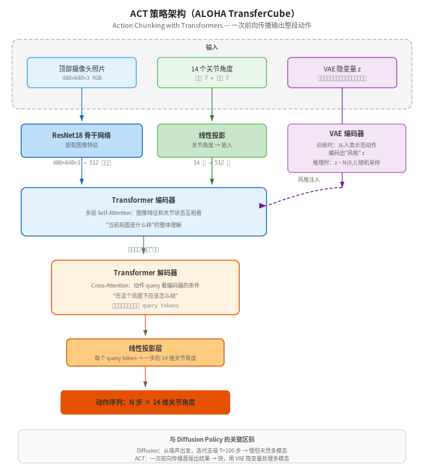

【机器人AI入门】上 Transformer，从推箱子到双臂传方块

━━━━━━━━━━━━━━━━━━━━

◆ 上期回顾：我们自己训了一个推箱子 AI

━━━━━━━━━━━━━━━━━━━━

上一期（148期 [自己训一个推箱子 AI](TODO)）我们用 206 局人类示范数据，从零训了一个 Diffusion Policy，最终在 Push-T 任务上拿到 30% 的成功率（10 局里 3 局满分推到位）。

整个过程就是：下载数据集 → 一行命令开始训练 → 12 小时后得到一个会推箱子的模型。框架用的是 HuggingFace 的 LeRobot，仿真环境用的是 MuJoCo。

今天的问题是：**这套东西只能推箱子吗？换一个完全不同的任务，还能用吗？**

━━━━━━━━━━━━━━━━━━━━

◆ 新任务：两只机械臂传递方块

━━━━━━━━━━━━━━━━━━━━

Push-T 是一个 2D 任务——俯视桌面，一个手指推一个积木。简单，但不够"机器人"。

这次换一个更有画面感的任务：**ALOHA TransferCube**——两只 6 自由度机械臂面对面站着，桌上有一个小方块。左边的机械臂要把方块抓起来，递给右边的机械臂，右边接住。

```
任务对比：
                    Push-T              ALOHA TransferCube
━━━━━━━━━━━━━━━━━━━━━━━━━━━━━━━━━━━━━━━━━━━━━━━━━━━━━━━━
维度              2D 俯视               3D 空间
执行器            一个手指               两只 6 自由度机械臂
动作空间          2 维 (x, y)            14 维（每只臂 7 个关节）
观测              96×96 俯视照片         480×640 顶部摄像头 + 关节角度
控制频率          10 Hz                  50 Hz
难度              入门                   中等
```

动作空间从 2 维变成 14 维，观测图片从 96×96 变成 480×640，控制频率从 10Hz 提到 50Hz——复杂度上了一个台阶。但关键是：**LeRobot 框架不用换，MuJoCo 仿真不用换，eval 脚本不用换。只需要换一个模型和一个环境名。**

━━━━━━━━━━━━━━━━━━━━

◆ 跑起来：还是一行命令

━━━━━━━━━━━━━━━━━━━━

跟 146 期跑 Push-T 一样的流程：下载预训练模型 → 格式迁移 → 跑 eval。

**第一步：下载模型**

```bash
# 宿主机上下载（容器没外网）
huggingface-cli download lerobot/act_aloha_sim_transfer_cube_human \
  --local-dir ~/work/models/act_aloha_transfer_cube
```

注意这次用的不是 Diffusion Policy，而是 **ACT（Action Chunking with Transformers）**——另一种模仿学习策略。HuggingFace 上 ALOHA 任务只有 ACT 的预训练模型，没有 Diffusion 的。不过没关系，ACT 和 Diffusion Policy 都是模仿学习，只是"预测动作"的方式不同（后面会说区别）。模型大小 207MB，比 Push-T 的 260MB 还小一点。

**第二步：格式迁移**（LeRobot 0.5.0 的老问题，上期踩过）

```bash
# 容器里跑
python3 -m lerobot.processor.migrate_policy_normalization \
  --pretrained-path /workspace/models/act_aloha_transfer_cube
```

最后会报一个联网错误（生成 model card 时要验证 YAML），不影响使用。

**第三步：跑 eval**

```bash
export MUJOCO_GL=egl
python3 -m lerobot.scripts.lerobot_eval \
  --policy.path=/workspace/models/act_aloha_transfer_cube_migrated \
  --env.type=aloha \
  --env.task=AlohaTransferCube-v0 \
  --eval.n_episodes=3 \
  --eval.batch_size=3 \
  --output_dir=/workspace/outputs/eval/aloha_transfer_cube
```

跟 Push-T 的 eval 命令对比一下，只改了三个参数：

| 参数 | Push-T | ALOHA |
|------|--------|-------|
| `--policy.path` | diffusion_pusht 模型 | act_aloha_transfer_cube 模型 |
| `--env.type` | pusht | aloha |
| `--env.task` | PushT-v0 | AlohaTransferCube-v0 |

**框架完全一样，换个模型名和环境名就行。** 这就是 LeRobot 的设计思路——把"任务"和"策略"解耦，任意组合。

━━━━━━━━━━━━━━━━━━━━

◆ 结果：67% 成功率

━━━━━━━━━━━━━━━━━━━━

3 局考试，2 局成功：

```
局 0:  max_reward=1.0  ❌  左臂抓起了方块，但没递到右臂
局 1:  max_reward=4.0  ✅  完美传递
局 2:  max_reward=4.0  ✅  完美传递
```

成功的两局里，你能看到：红色方块在桌面中间，右臂主动伸过来抓住方块，左臂配合伸到中间完成交接。右臂的动作幅度明显更大，左臂更多是辅助配合。整个过程大约 5 秒。

下面是成功传递的一局回放：

<video src="assets/149/aloha_transfer_cube_success.mp4" controls width="640"></video>

失败的那局，左臂抓起了方块但递的位置不够准，右臂没接住。

━━━━━━━━━━━━━━━━━━━━

◆ 两种策略：Diffusion Policy vs ACT

━━━━━━━━━━━━━━━━━━━━

Push-T 用的是 Diffusion Policy，ALOHA 用的是 ACT。两种策略都是模仿学习——都是从人类示范数据里学"看到这个画面应该怎么动"——但生成动作的方式不同。

**Diffusion Policy（147-148 期讲过）**

```
输入：照片 + 当前状态
  ↓
从纯噪声开始，去噪 T 步
  ↓
输出：一条 16 步的动作轨迹
```

核心思路：把动作生成当成"去噪"问题。从随机噪声出发，反复让网络预测"这里面有多少噪声"然后减掉，最终从噪声里"长出"一条合理的轨迹。优点是能处理多模态分布（同一个局面有多种合理的推法）。代价是慢——要跑 T 步去噪。

**ACT（Action Chunking with Transformers）**

```
输入：照片 + 当前状态
  ↓
Transformer 编码器-解码器，一次前向传播
  ↓
输出：一段动作序列（action chunk）
```



核心思路：把动作生成当成"翻译"问题——看到当前局面，直接"翻译"成一段动作。用的是 Transformer 编码器-解码器架构，和早期的机器翻译模型（比如 Google 翻译）同源。

在 LLM 领域，encoder 基本绝迹了——GPT 全系列都是 decoder-only，连 Google 的 Gemini 也放弃了 encoder。但机器人领域不一样：LLM 是一个字一个字蹦的（自回归），天然适合纯 decoder；机器人要**一次性并行输出一整段动作**，需要先理解局面（encoder 的活），再并行生成动作（decoder 的活）。所以 encoder-decoder 在机器人里反而是主流。

这个模型的编码器有 **4 层** Transformer（512 维，8 头注意力），解码器只有 **1 层**。编码器厚、解码器薄——理解局面是重活，输出动作相对简单，看懂了怎么回事一层就能把动作吐出来。

（顺便提一句：如果你在准备 LLM 相关的面试，被问到"encoder-decoder 架构现在还有人用吗"——机器人 ACT 策略就是一个活生生的例子。不是没人用了，是换了个赛道继续用。）

**ACT 的输入具体是什么？**

不是一个东西，是三样东西拼成一个序列喂给 Transformer：

```
LLM 的输入序列：
  [你] [好] [吗]  ← 每个字一个向量，排成一排

ACT 的输入序列（编码器）：
  [照片特征₁] [照片特征₂] ... [关节角度] [VAE风格]
   ↑ ResNet 输出的多个特征块      ↑ 一个向量  ↑ 一个向量
```

1. **照片**（480×640×3，三通道 RGB，约 900KB 原始数据）→ ResNet18 压缩成若干个 512 维特征向量。可以理解为 ResNet 把一张大照片切成若干块，每块总结成一个 512 维向量。类似 LLM 里的多个 token，每个 token 描述照片的一个局部区域
2. **14 个关节角度**（14 个 float32 浮点数，每个 4 字节，共 56 字节——左臂 6 关节 + 1 夹爪，右臂同理）→ 一个线性层投影成 512 维向量。就是把 14 个数乘一个矩阵变成 512 个数，和照片特征对齐到同一个维度
3. **VAE 隐变量 z**（32 个 float32 浮点数，共 128 字节——代表"这次用什么动作风格"）→ 也投影成 512 维拼进去

（全程 float32，不需要量化——模型才 207MB，大语言模型动辄几十 GB 才需要 INT8/INT4 量化压缩，这个量级没必要。）

这些向量排成一排，就是编码器的输入序列。编码器里的 Self-Attention 让它们互相看——照片看关节，关节看照片——最终形成"当前局面是什么样"的整体理解。

**ACT 的输出具体是什么？**

解码器里有 N 个可学习的 query token（跟输入数据无关，是网络自己的参数）。每个 query 通过 Cross-Attention 去"问"编码器："当前局面下，我这一步该输出什么？"每个 query 输出一步的 14 维关节角度，N 个 query **并行计算、一次性全部输出**——不用等上一步出来才能算下一步。

这就是名字里 "Action Chunking" 的意思——**一整块动作一把出**。

```
类比：
  LLM 生成文本：    "我" → "爱" → "你"  ← 一个字一个字蹦，前一个出来才能算下一个
  Diffusion Policy：迭代去噪 100 次      ← 一次性输出 16 步，但要反复迭代
  ACT：             一次前向传播          ← 一次性输出 N 步，不用迭代
```

**VAE 是干什么的？**

同一个局面，不同人的动作不一样——张三左手先抓，李四右手先抓，都对。模型该学谁？

VAE 的解法：训练时给每条人类示范提取一个"风格编号" z。在这个模型里，z 是一个 **32 维的向量**（32 个浮点数，共 128 字节）。你可以把它理解为一种"动作风格的压缩码"——32 个数就能概括"这个人习惯怎么抓、怎么递"。

```
训练时：
  人类示范动作 → VAE 编码器 → z = [0.3, -0.1, 0.8, ...]（32个数）
  模型学的是："在这个局面 + 这种风格 z 下，应该怎么动"

推理时：
  没有人类示范了，z 怎么来？随机生成 32 个数
  z = [0.5, 0.2, -0.3, ...]（随机采样）
  每次随机的 z 不同 → 生成的动作风格不同 → 但都是合理的

没有 VAE：同一个局面永远输出一种动作（可能是张三和李四的平均 → 两边都不像）
有 VAE：  同一个局面每次采样不同的 z → 有时像张三，有时像李四
```

跟 147 期讲的 Diffusion Policy 的"多模态分布"是同一个问题（同一局面有多种合理推法），只是解法不同——Diffusion 靠噪声采样天然解决，ACT 靠这个 32 维的风格向量解决。

**对比：**

| | Diffusion Policy | ACT |
|---|---|---|
| 生成方式 | 迭代去噪（T 步） | 一次前向传播 |
| 推理速度 | 慢（要跑 T 步） | 快（一步出结果） |
| 多模态处理 | 天然支持（概率分布采样） | 通过 VAE 隐变量 |
| 架构 | ResNet + 1D U-Net | Transformer 编码器-解码器 |
| 参数量 (Push-T/ALOHA) | ~260M | ~207M |
| 代表论文 | Chi et al., 2023 | Zhao et al., 2023（ALOHA 团队） |

**关键：两种策略的训练数据格式是一样的**——都是"照片 + 状态 + 动作"的三元组。所以同一个数据集可以用 Diffusion Policy 训，也可以用 ACT 训。LeRobot 里切换策略只需要改一个参数 `--policy.type=diffusion` 或 `--policy.type=act`。

━━━━━━━━━━━━━━━━━━━━

◆ 模仿学习的通用模式

━━━━━━━━━━━━━━━━━━━━

从 146 到 149，四期下来我们做了两个任务、两种策略。回头看，模仿学习的套路其实就一个：

```
第一步：收集人类示范
  → 人类操作机器人（真实的或仿真的），录下"看到了什么 + 做了什么"

第二步：训练策略模型
  → 让模型学会"看到这个画面，人类会怎么动"
  → 可以用 Diffusion Policy、ACT、或者别的策略

第三步：部署评估
  → 把训好的模型放进环境里跑，看成功率
```

**换任务只需要换第一步的数据。** 推箱子的数据训出推箱子的模型，传方块的数据训出传方块的模型。模型架构、训练流程、eval 流程全都不用变。

────────────────────

**但仿真和真实世界之间有一道鸿沟**

我们这四期全在仿真里跑。仿真有个巨大的好处：**一切都是确定的**——摄像头永远在同一个位置、光照永远一样、桌面永远一个颜色、方块永远同一个材质。模型训练时看到的画面和推理时看到的画面，像素级别一致。

真实世界不是这样。换个摄像头角度，成功率就可能暴跌——因为模型是从固定角度的照片里学的，"这个像素位置有方块→手臂往这个方向动"。换个角度拍，同样的方块在画面里的位置、形状、遮挡关系全变了，模型没见过。

不只是角度。光照变了（白天 vs 晚上）、桌面换了颜色、方块换了材质、背景多了杂物——任何一个变化都可能让模型懵掉。**模仿学习的模型只认它见过的东西。**

这就是机器人 AI 里最大的难题之一：**Sim-to-Real Gap（仿真到真实的鸿沟）**。仿真里 100% 成功率的模型，放到真实机器人上可能直接归零。整个行业花了大量精力在解决这个问题——Domain Randomization（训练时随机变光照/颜色/角度）、用大量真实数据微调、或者直接在真机上收集数据训练。

不过对于学原理来说，仿真够用了。知道这道鸿沟存在就行。

────────────────────

这就是为什么 LeRobot 把这些东西做成了统一框架——你不需要理解 Diffusion Policy 和 ACT 的数学细节，只需要知道"有数据 → 选策略 → 开训 → eval"这个流程。

```
模仿学习 = 人类示范数据 + 策略模型 + 仿真环境
  → 数据决定学什么
  → 策略决定怎么学
  → 环境决定在哪考试
  → 三者互相独立，任意组合
```

━━━━━━━━━━━━━━━━━━━━

◆ 这个系列到这里的知识树

━━━━━━━━━━━━━━━━━━━━

```
146 期：环境搭建 + 跑 Push-T demo
  → 知道了 MuJoCo + LeRobot 是什么

147 期：扩散模型原理（螺旋线实验）
  → 知道了加噪 / 去噪 / 训练怎么回事

148 期：从零训 Push-T（Diffusion Policy）
  → 知道了模仿学习的完整训练流程

149 期：换任务跑 ALOHA（ACT）
  → 知道了框架的通用性 + 两种策略的区别
```

到这里，机器人模仿学习的基础就差不多了。你已经知道：数据怎么来的、模型怎么训的、怎么换任务、两种主流策略有什么区别。

下一期聊一个不一样的话题：**强化学习 vs 模仿学习**——为什么有的机器人靠看示范学，有的靠自己试错学？什么时候该用哪个？

━━━━━━━━━━━━━━━━━━━━

// 靳岩岩的 AI 学习笔记 × Claude 的严谨 × Gemini 的浪漫
// 2026-04-09
