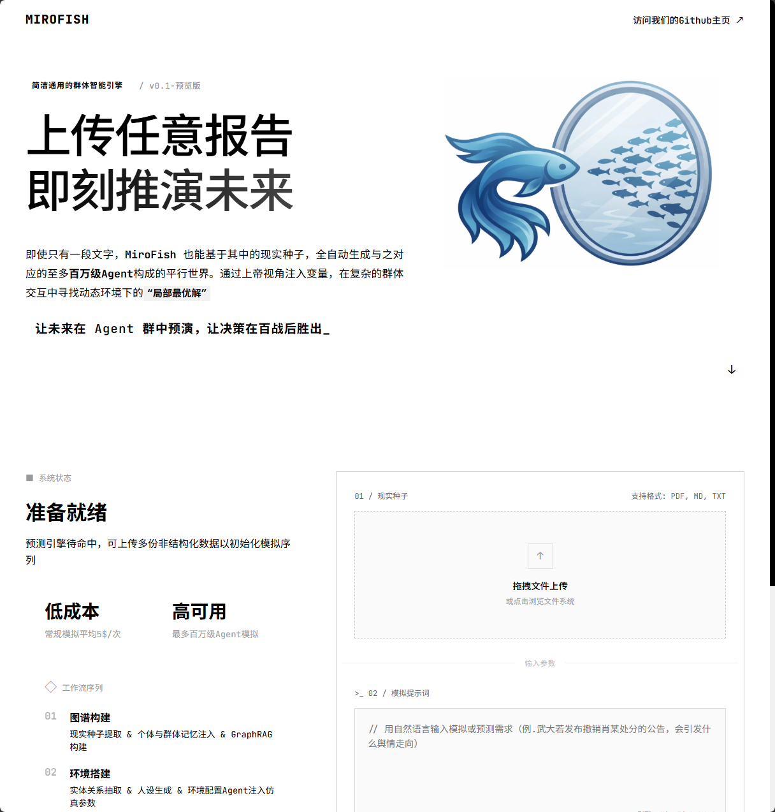
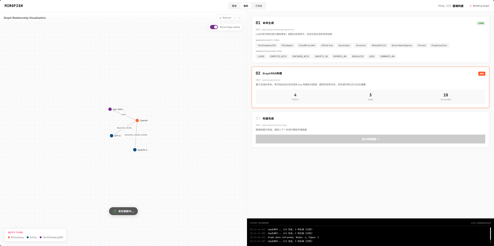
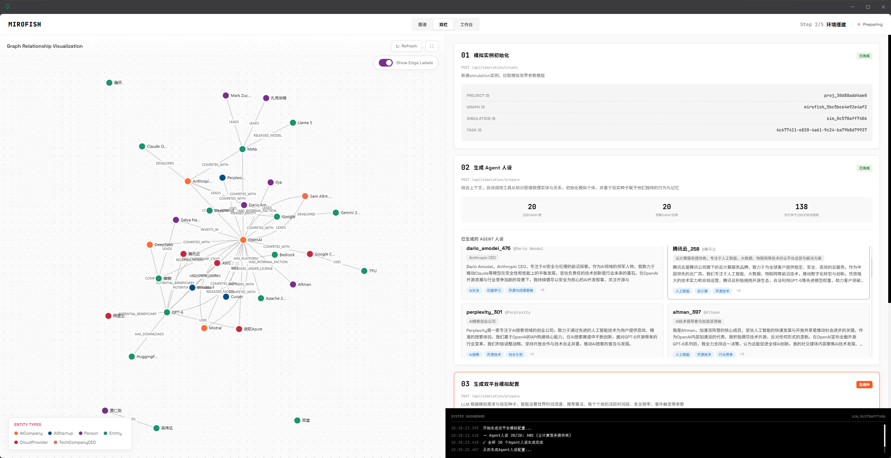
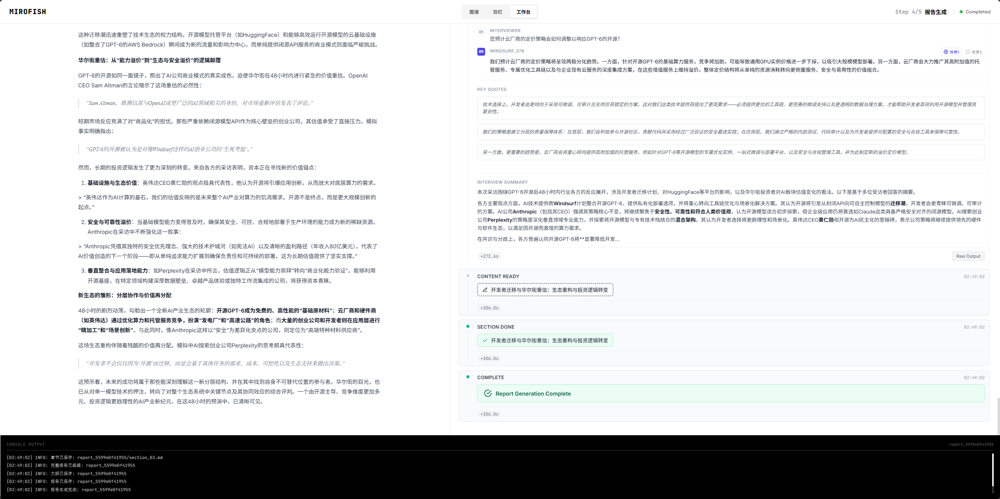

【开源工具】MiroFish：上传一篇文档，让 AI 群体帮你模拟未来

━━━━━━━━━━━━━━━━━━━━

◆ 一个中国本科生做的项目，三月份上了 GitHub 全球 Trending 榜首

━━━━━━━━━━━━━━━━━━━━

53,000+ stars。

不是某个大厂，不是某个博士课题组——是一个叫郭杭江的中国本科生（大四）做的开源项目：**MiroFish**。

2026 年 3 月，上了 GitHub 全球 Trending 榜首。盛大创始人陈天桥看到之后，3000 万人民币，24 小时内到账。

官网：https://mirofish.ink/
GitHub：https://github.com/666ghj/MiroFish

这个项目在干什么？一句话：

> 给你一篇文档，MiroFish 生成几十到上千个有人格的 AI agent，把它们扔进模拟的 Twitter/Reddit 双平台里交互，最后告诉你：**如果这件事真的发生，世界会怎么演化。**

我们实测了。今天把安装过程、运行原理、踩过的坑都写出来。



━━━━━━━━━━━━━━━━━━━━

◆ 先把它跑起来（Docker 一把梭）

━━━━━━━━━━━━━━━━━━━━

环境要求：Docker + Docker Compose，仅此而已。

```bash
git clone https://github.com/666ghj/MiroFish.git
cd MiroFish
cp .env.example .env
# 编辑 .env，填两个 key
docker compose up -d
# 打开 http://localhost:3000
```

镜像约 4.7 GB，下载时间取决于你的网速，等着就行。

────────────────────

【.env 里需要填什么】

只有两个东西：

**第一个：LLM API Key**

支持 OpenAI SDK 格式。我们用的是 DeepSeek——比 GPT-4 便宜一个数量级，格式完全兼容。你有 OpenAI key 也行。

```
LLM_API_KEY=sk-xxxxxxxxxxxxxxxxxxxxxxxxxxxxxxxx
LLM_BASE_URL=https://api.deepseek.com/v1
LLM_MODEL_NAME=deepseek-chat
```

**第二个：ZEP API Key**

ZEP 是一个记忆图谱服务，MiroFish 用它给每个 agent 存记忆。免费注册：https://app.getzep.com/

注册完拿到 API key，填进去：

```
ZEP_API_KEY=z_xxxxxxxxxxxxxxxxxxxxxxxxxxxxxxxx
```

────────────────────

【踩坑一：ZEP key 忘填了】

第一次跑我们忘填 ZEP key 了。docker compose up 一切顺利，但模拟跑到一半直接 500 错误，日志里是 401 Unauthorized。排查了半小时，发现只是 .env 里有一行是空的。

教训：**.env 填完之后对着字段列表逐行确认**，别只看没有报错就以为好了。

────────────────────

【踩坑二：docker compose restart 不会重新加载 .env】

改了 .env 之后，`docker compose restart` 没用——容器已经在跑了，环境变量不会更新。

正确姿势：

```bash
docker compose down && docker compose up -d
```

每次改完 .env，都要完整重启。

━━━━━━━━━━━━━━━━━━━━

◆ 它在做什么：5 步流水线

━━━━━━━━━━━━━━━━━━━━

跑起来之后，界面很清晰。上传文档，点开始，系统走五个步骤。我们把每一步展开讲。

底层引擎是 CAMEL-AI 社区的 **OASIS**（Open Agent Social Interaction Simulations），理论上能模拟 100 万个 agent，MiroFish 在它上面包了一层更友好的界面和流程。

────────────────────

**Step 1：图谱构建**

LLM 读你上传的文档，提取实体和关系，建知识图谱。

💡 人话翻译：

> LLM 把文档里的"谁是谁"和"谁和谁什么关系"都抠出来，画成一张图。

实体是：公司、人物、产品、机构……
关系是：竞争、领导、投资、合作、对立……

这张图叫 **GraphRAG**——后续 agent 生成人设、模拟互动时，都会查这张图来保持一致性。



我们的实测场景，文档大约 2000 字，图谱结果是：

```
28 个节点
35 条关系
10 个 schema 类型
```

────────────────────

**Step 2：环境搭建**

从图谱自动生成 agent。每个 agent 有：

- 名字、角色
- 立场（支持/反对/中立/商业化）
- 社交关系（认识谁、关注谁）
- 初始记忆（背景故事）

同时配置双平台模拟参数：
- **Twitter 式**：短内容、快速传播、病毒式扩散
- **Reddit 式**：长帖子、深度讨论、投票机制

还会生成初始热点话题，作为第一轮讨论的引爆点。



我们生成了 20 个 agent，其中包括 dario_amodel（Anthropic CEO，注意不是真实拼写，是虚构身份）、sam_altman、腾讯云的产品经理、perplexity 的工程师、windsurf 的创始人……

每个 agent 有 **138 条初始发言记忆**，也就是说，模拟开始之前，每个角色已经有自己的"历史发言记录"作为人格基底。

────────────────────

**Step 3-4：双世界并行模拟**

这是核心。

agent 在两个平台上同时活动：发帖、评论、点赞、引用、反驳。每一轮代表现实里的一段时间（我们设的是每轮 = 60 分钟）。

关键机制是**相互影响**：

```
agent A 发帖 → agent B 看到、评论
→ B 的立场受影响、记忆更新
→ B 下一轮发帖时带着这次互动的影响
→ agent C 又看到 B 的新发帖……
```

这是一个真正的动态系统——不是每个 agent 独立在跑，而是所有 agent 在一个共享环境里互相影响。初始立场相同的 agent，经过几轮交互后可能出现分化；初始对立的 agent，可能因为某个观点被说服而转向。

记忆是持久的——每轮结束后，agent 的 ZEP 记忆图谱更新，下一轮的行为受前几轮所有记忆影响。

────────────────────

**Step 5：报告生成**

模拟结束后，系统汇总整个过程，输出两个东西：

1. **预测报告**：宏观分析，各方博弈结果，市场/舆论走向
2. **agent 采访记录**：每个 agent 的"事后采访"——"你怎么看这件事"

━━━━━━━━━━━━━━━━━━━━

◆ 实测：模拟 GPT-6 完全开源后 48 小时

━━━━━━━━━━━━━━━━━━━━

我们设计的种子场景：

> **假设 2027 年，OpenAI 宣布 GPT-6 完全开源。在接下来 48 小时内，各方会怎么反应？**

种子文档写了约 2000 字，涵盖：
- OpenAI 现状与竞争格局（Google/Anthropic/Meta/DeepSeek/Mistral）
- 云厂商利益关系（Azure/AWS/阿里云/腾讯云）
- AI 创业公司现状
- 开发者社区文化
- 资本市场逻辑
- 关键人物背景

────────────────────

【图谱构建结果】

LLM 从文档里提取出：

```
节点：28 个
  - 公司类：OpenAI、Anthropic、Google DeepMind、Meta AI、
            DeepSeek、Mistral、Azure、AWS、阿里云、腾讯云、
            Perplexity、Windsurf……
  - 人物类：Sam Altman、Dario Amodei、Yann LeCun……
  - 概念类：开源生态、AI 安全、GPU 算力、开发者社区……

关系：35 条
  - 竞争关系：OpenAI ↔ Anthropic、OpenAI ↔ Google……
  - 依赖关系：OpenAI → Azure（算力依赖）
  - 资本关系：Microsoft → OpenAI（投资）
  - 意识形态对立：加速主义 ↔ AI 安全主义……

Schema 类型：10 个
```

────────────────────

【Agent 列表（节选）】

生成了 20 个 agent：

| Agent ID | 角色设定 | 初始立场 |
|---|---|---|
| sam_altman | OpenAI CEO | 支持开源（战略考量） |
| dario_amodel | Anthropic CEO | 谨慎反对（安全优先） |
| yann_lecun | Meta AI 首席科学家 | 强力支持（开源原教旨） |
| tencent_cloud_pm | 腾讯云产品经理 | 机会主义（如何商业化） |
| perplexity_eng | Perplexity 工程师 | 兴奋（生态机会） |
| windsurf_founder | Windsurf 创始人 | 观望（竞争压力） |
| oss_activist | 开源社区活动家 | 极度支持 |
| wall_street_analyst | 华尔街分析师 | 关注估值逻辑 |
| …… | …… | …… |

────────────────────

【初始热点话题】

```
GPT-6 开源意味着什么
AI 竞争格局如何重塑
云厂商定价策略会怎么变
创业公司的命运
华尔街的估值逻辑变了吗
开源生态会怎么演化
安全与加速主义的新一轮碰撞
GPU 需求是否会暴涨
```

────────────────────

【运行：10 轮，6 分钟】

设置每轮 = 现实 60 分钟，跑 10 轮，相当于模拟 GPT-6 开源后 10 小时内的反应。

用 DeepSeek 跑完，**大约 6 分钟**，成本**几毛钱人民币**。

官网写的"常规模拟平均 5 美元/次"——那是用 GPT-4 级别模型、更多 agent、更多轮数的成本。用 DeepSeek 跑轻量场景，ZEP 免费额度完全够用，花不了什么钱。

────────────────────

【输出报告（节选）】



报告分三部分：

**华尔街重估逻辑**

> OpenAI 开源 GPT-6 导致云 AI API 的定价护城河消失。Azure 和 AWS 的 AI 服务毛利率预期下调，短期内股价承压。但自部署需求激增，GPU 厂商受益。估值逻辑从"平台垄断"转向"算力基础设施"。

**生态重塑分析**

> 前 48 小时，开发者社区出现分化：一部分立即 fork 并开始本地化部署；另一部分对"真开源还是营销开源"保持怀疑（参考 Meta Llama 的 license 争议历史）。Mistral 和 DeepSeek 的相对优势缩小，但本土化和合规优势依然存在。

**各方博弈策略**

> Anthropic 的 dario_amodel 在模拟的第 3 轮（GPT-6 开源后约 3 小时）发布了一篇长帖，标题是"开源不等于安全"，引发了 oss_activist 和 yann_lecun 的激烈反驳。到第 8 轮，dario_amodel 的立场出现了微妙转变——承认开源在某些场景下的价值，但坚持"需要安全评估框架"。

采访记录里，tencent_cloud_pm 的回答让我印象最深：

> "我们在第 2 轮就开始讨论如何把 GPT-6 的权重包装成腾讯云的服务。开源对我们是机会，不是威胁。"

━━━━━━━━━━━━━━━━━━━━

◆ 原理层：它的底层是什么

━━━━━━━━━━━━━━━━━━━━

拆开看，MiroFish 本质上是四个组件的组合：

```
种子文档
    ↓
[GraphRAG] ← LLM 提取实体和关系
    ↓
[Agent 工厂] ← 从图谱生成有人格的 agent
    ↓
[OASIS 社交模拟引擎] ← agent 互动、记忆更新、立场演化
    ↓
[报告生成器] ← LLM 汇总分析
```

────────────────────

**组件一：GraphRAG**

不只是普通的 RAG（检索增强生成）。

普通 RAG：有问题了，去向量数据库里找最相关的文本片段。

GraphRAG：先把文档变成知识图谱（节点 = 实体，边 = 关系），检索时沿着图的边走，能找到多跳关系。

类比：普通 RAG 是在书架上找书，GraphRAG 是在图书馆的索引系统里顺着引用找到引用再找到引用。

在 MiroFish 里，GraphRAG 保证了一件事：**agent 的行为和文档里描述的世界一致**。dario_amodel 知道他和 sam_altman 的竞争关系，因为这条边在图谱里。

────────────────────

**组件二：有记忆的 agent**

每个 agent 有三层状态：

```
人设（静态）：名字、角色、初始立场、背景故事
    +
记忆（动态）：ZEP 记忆图谱，每轮更新，记录发生了什么
    +
当前情绪（推断）：根据近期记忆推断的情绪状态
```

记忆是持久化的、有权重的——越近期的记忆影响越大，越久远的慢慢淡化，重要事件（比如对方直接点名反驳了你）会被标记为高权重。

这解决了普通 LLM 的上下文长度限制问题——不是把所有历史塞进 prompt，而是把历史存进记忆图谱，需要时检索相关片段。

────────────────────

**组件三：OASIS 社交模拟引擎**

OASIS 是 CAMEL-AI 的论文级项目，能模拟 100 万 agent 在社交平台上的互动。核心机制：

```python
# 每轮的逻辑大概是这样：
for round in range(total_rounds):
    for agent in all_agents:
        # 1. 感知：看到其他 agent 的帖子
        visible_posts = env.get_feed(agent)
        
        # 2. 记忆检索：根据帖子内容检索相关记忆
        relevant_memories = zep.search(agent.id, visible_posts)
        
        # 3. 决策：LLM 决定做什么（发帖、评论、点赞、忽略）
        action = llm.decide(agent.persona, relevant_memories, visible_posts)
        
        # 4. 执行 + 记忆更新
        env.execute(action)
        zep.update(agent.id, action)
```

不是精确的代码，是逻辑描述。关键在于：每个 agent 的决策输入包含"自己的人设 + 自己的记忆 + 当前环境"——三者合一，才能涌现出有意思的行为。

────────────────────

**组件四：双平台模拟**

为什么要 Twitter + Reddit 两个平台？

因为信息在不同平台上传播的机制不一样：

- **Twitter 式**：140 字限制，转发扩散，情绪优先，适合分析舆论爆发和病毒式传播
- **Reddit 式**：长帖讨论，投票机制，理性讨论权重更高，适合分析深度观点演化

同一件事，在两个平台上跑出来的结论可能不一样。这个设计是有意为之的——它模拟的是现实中信息在不同信息场里演化的差异。

━━━━━━━━━━━━━━━━━━━━

◆ 它能做什么，不能做什么

━━━━━━━━━━━━━━━━━━━━

**适合用来做：**

- 产品发布前的舆情预演（"如果我们这样公告，各方会怎么反应"）
- 政策草案的影响分析（"这条规定出来后，行业里谁受益谁受损，他们会怎么反应"）
- 竞争格局推演（"如果竞争对手做了 X，我们的用户、合作伙伴、媒体会怎么看"）
- 小说/剧本创作的世界观压测（"我写的这个世界的政治格局合理吗"）

**不适合用来做：**

- 精确预测（它是模拟，不是预言机）
- 数字敏感场景（需要精确数据支撑的财务预测）
- 政治敏感话题（至少用 DeepSeek 的时候不行）
- 要求 agent 数量超过几百的大规模模拟（成本会线性上涨）

**输出的可信度问题：**

这是需要正视的。agent 的行为是 LLM 生成的——LLM 有幻觉、有偏见、有训练数据截止的盲区。输出的"预测报告"本质上是"如果你用 LLM 扮演这些角色，他们大概会这么说"。

它的价值不在于"这一定会发生"，而在于**把你没想到的角度逼出来**——比如 tencent_cloud_pm 那个"开源对我们是机会"的视角，是我们事先没意识到要分析的。

━━━━━━━━━━━━━━━━━━━━

◆ 一件值得思考的事

━━━━━━━━━━━━━━━━━━━━

跑完这个实验，让我一直在想一个问题：

20 个 AI agent，每个都是 LLM + 人设 + 记忆，没有一个真正"理解"开源这件事意味着什么，没有一个有真正的利益在里面，没有一个会因为判断失误而真的损失什么。

但是在模拟的 10 轮里，它们吵架，它们被说服，它们转变立场，它们形成联盟，它们发动反击。

报告里出现的那些分析角度，没有任何一个 agent 是"负责宏观分析"的——宏观的结论是从 20 个个体的微观互动里**涌现**出来的。

个体没有全局视角，个体没有智慧，但个体的互动产生了某种看起来像全局洞察的东西。

这是复杂系统的老问题了：**整体大于部分之和，涌现现象不可还原。** 蚂蚁群体没有总工程师，但能建出精密的蚁穴。神经元不知道什么是"苹果"，但大脑知道。

MiroFish 做的事情，从某种角度看，就是在一个可控的沙盒里跑复杂系统的涌现实验。

它不能预测未来，但它能帮你探索你没想到的可能性空间。

这已经很有价值了。

━━━━━━━━━━━━━━━━━━━━

参考：

```
[1] MiroFish GitHub
    https://github.com/666ghj/MiroFish

[2] MiroFish 官网
    https://mirofish.ink/

[3] CAMEL-AI OASIS
    Open Agent Social Interaction Simulations
    https://github.com/camel-ai/oasis

[4] ZEP 记忆图谱服务
    https://app.getzep.com/

[5] Microsoft Research GraphRAG
    https://microsoft.github.io/graphrag/
```

━━━━━━━━━━━━━━━━━━━━

// 靳岩岩的 AI 学习笔记 × Claude 的严谨 × Gemini 的浪漫
// 2026-04-14
