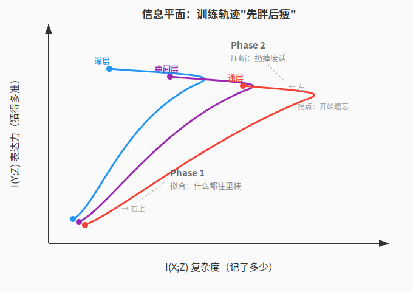
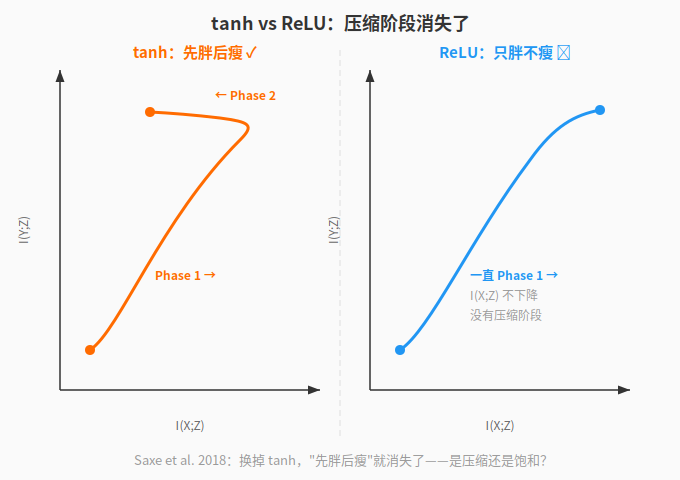

【学习即遗忘】从香农到普林斯顿——78 年，同一个物理定律

━━━━━━━━━━━━━━━━━━━━

◆ 起因

━━━━━━━━━━━━━━━━━━━━

今年的 ICLR 2026（4 月 23-27 日，里约热内卢）收录了一篇普林斯顿的论文，标题很抓人——"Learning is Forgetting: LLM Training As Lossy Compression"（学习即遗忘：LLM 训练是有损压缩）。用信息瓶颈理论在 47 个大模型上验证了——**训练先扩张再压缩，压缩效率预测下游性能**。

论文：Henry C. Conklin et al., arXiv: 2604.07569

标题确实有冲击力。但"学习即遗忘"不是普林斯顿发明的金句——这条线从 1948 年拉到 2026 年，横跨 78 年、至少六个关键节点。香农说有限信道必须丢信息，LSTM 的 forget gate 第一次把遗忘从 bug 变成 feature，Tishby 给最优遗忘写下数学定义，Shwartz-Ziv 在神经网络上第一次画出"先胖后瘦"的训练轨迹，普林斯顿是这条线上最新的一环——造了一把能在万维空间量互信息的尺子。

今天不只说这一篇。把整条线串起来。

━━━━━━━━━━━━━━━━━━━━

◆ 有损压缩是物理定律（Shannon 1948）

━━━━━━━━━━━━━━━━━━━━

一切从信道容量开始。

1948 年，Claude Shannon 在贝尔实验室发了那篇改变世界的论文 "A Mathematical Theory of Communication"。信息论从这里诞生。核心定理之一：任何信道都有一个容量上限 C，想要通过这条信道可靠地传信息，传输速率不能超过 C。超过了怎么办？要么出错，要么丢东西。没有第三条路。

不用管公式。讲直觉。

你用 128kbps 的带宽传一首 CD 品质的歌。CD 原始码率是 1411kbps——双声道、16 bit 采样、44100Hz 采样率，乘起来就是这个数。128 除以 1411，你只能保留不到 10% 的信息。怎么办？丢掉人耳不敏感的高频细节（16kHz 以上大多数人听不到）、丢掉左右声道重复的部分（立体声里两个声道大量信息是重叠的）、丢掉音量太小听不见的分量（遮蔽效应——大声的鼓点旁边的小提琴细节，丢了你也听不出来）。这就是 MP3。

MP3 不是"技术不够好所以丢了信息"。是**物理定律规定了你必须丢**——128kbps 的管子塞不下 1411kbps 的数据，你要么丢，要么不传。唯一的选择权在于**丢什么**。好的编码器（LAME）和烂的编码器（早期 Xing），在同样 128kbps 下听感天差地别——差别不在于谁丢得少，而在于谁丢得聪明。

程序员可能更熟悉另一个例子：JPEG。原始位图一张 4000x3000 的照片大约 36MB，JPEG 压到 3MB，压缩率 12:1。丢的是什么？高频空间细节（DCT 变换后砍掉高频系数）。为什么能丢？因为人眼对亮度的高频变化不敏感。**有损压缩的核心不是"丢多少"，是"丢什么人不会在意"。**

把这个直觉往上拉一层：

**任何用有限容量编码无限输入的系统，都必须遗忘。**

神经网络有多少参数？有限的。7B 模型有 70 亿个 float16 参数，总共 14GB 的存储空间。训练数据有多少？OLMo2 用了几万亿 token。输入分布的可能性？无限的——自然语言的组合空间没有上界。所以神经网络必须压缩，必须丢弃，必须遗忘。14GB 的容器装不下几万亿 token 的全部信息，就像 128kbps 的管子装不下 1411kbps 的音乐。**这不是设计选择，是物理定律。**

香农 1948 年画好了天花板。接下来 50 年，问题是：**怎么丢才最聪明？**

━━━━━━━━━━━━━━━━━━━━

◆ 遗忘从 bug 变成 feature（LSTM forget gate，1999）

━━━━━━━━━━━━━━━━━━━━

1997 年，Hochreiter 和 Schmidhuber 发明了 LSTM（Long Short-Term Memory）。LSTM 的核心设计是一条叫 cell state 的长期记忆管道——你可以把它想象成一条传送带，信息通过 input gate 写入（往传送带上放东西），通过 output gate 读出（从传送带上拿东西给下游用）。这条传送带是 LSTM 能处理长序列的关键——普通 RNN 的梯度在反向传播时会指数衰减（梯度消失），但 cell state 提供了一条"梯度高速公路"，让信息可以几乎无损地跨越很多时间步。

问题来了：**原版 LSTM 没有 forget gate。**

信息只进不出。cell state 是单调递增的——每一步往里加东西，永远不减。你往一个杯子里一直倒水但从不倒掉，结果可以预见：溢出。数值上 cell state 越来越大，sigmoid 门控全部饱和到 0 或 1，梯度消失，模型僵死。更要命的是，100 步之前写入的过时信息还赖在 cell state 里占着位置，和新信息混在一起，模型分不清哪些该用哪些该扔。

1999 年，Gers、Schmidhuber 和 Cummins 加了一个 forget gate。论文标题就叫 "Learning to Forget: Continual Prediction with LSTM"——学会遗忘。

forget gate 干的事：每一步决定"旧记忆保留多少、新信息写入多少"。完整公式：

```
f_t       = sigmoid(W_f * [h_{t-1}, x_t])    -- 遗忘门：旧记忆保留多少
i_t       = sigmoid(W_i * [h_{t-1}, x_t])    -- 输入门：新信息写入多少
candidate = tanh(W_c * [h_{t-1}, x_t])       -- 候选新信息

-- 三样东西备齐，下面一行把它们组装成新的 cell state：
c_t       = f_t * c_{t-1} + i_t * candidate
```

其中 h_{t-1} 是上一步的隐藏状态（d 维向量），x_t 是当前输入（n 维向量），[h_{t-1}, x_t] 是拼接成 (d+n) 维长向量。W_f、W_i、W_c 是三组独立的权重矩阵，大小都是 d x (d+n)，训练学出来的。sigmoid 把值压到 0~1 之间（连续值，不是非 0 即 1 的开关——f_t = 0.73 意思是"这个维度的旧记忆保留 73%"，是旋钮不是开关），tanh 压到 -1~1 之间。所有运算都是逐维度的——**每个维度独立决定忘多少、记多少**。

最后一行是核心：**旧记忆 c_{t-1} 打个折（f_t 控制），加上新信息 candidate 打个折（i_t 控制），就是新的 cell state。**

看到这你可能觉得：公式也太多了吧？遗忘门一组权重，输入门一组权重，候选值一组权重，加上这里没写的 output gate 还有一组——一个 LSTM cell 里塞了四组矩阵乘法和四个激活函数。这就是 1999 年的风格：算力小、数据少，人类得用精巧的手工设计告诉模型"你应该这样记、这样忘"。每个门都是一条人类先验。别急——后面你会看到，25 年后同样的事只需要一行公式（h_t = A * h_{t-1} + B * x_t）。架构的进化史本身也是一部"先复杂后压缩"的历史。

但不管公式多复杂，这个改动在工程史上有里程碑意义——**这是第一次把"遗忘"从 bug 变成 feature**。

在 forget gate 之前，所有序列模型的设计目标都是"记住更多、记住更久"。梯度消失被视为敌人，所有技术手段都在对抗遗忘——残差连接、梯度裁剪、各种初始化技巧，都是为了让信息别丢。Gers 等人说：等等，丢信息才是对的。不是模型记不住了，是模型要学会什么时候该忘。sigmoid 输出的 f_t 不是人手动设的阈值，是模型自己从数据里学出来的——面对不同的输入序列，模型会自动调整遗忘策略。处理一段音乐，短期音符特征忘得快，长期调性忘得慢；处理一段文本，上一个句号之前的具体措辞忘得快，整段话的主题忘得慢。

如果你读过 127 期（ https://mp.weixin.qq.com/s/A8eJvexEDZwYMOsf1lSJAA ），会立刻认出来：Mamba-3 的 A 矩阵干的是完全相同的事。A 矩阵控制隐状态的衰减速率——哪些维度的历史信息衰减得快（忘得快），哪些衰减得慢（记得久）。数学形式几乎一模一样：LSTM 是 c_t = **f_t * c_{t-1}** + i_t * candidate，SSM 是 h_t = **A * h_{t-1}** + B * x_t，加粗的部分都是"旧状态乘一个小于 1 的系数做指数衰减"。LSTM forget gate 和 SSM A 矩阵，是同一个设计思想的两代实现，中间隔了 25 年。架构从循环网络变成了状态空间模型，但"可学习的遗忘"这个核心机制，一脉相承。

1999 年，遗忘在工程上被确认为必要组件。同一年，大西洋另一边，另一个人从纯数学的角度给出了"最优遗忘"的精确定义。

━━━━━━━━━━━━━━━━━━━━

◆ 最优压缩的数学定义（Tishby 1999，信息瓶颈理论）

━━━━━━━━━━━━━━━━━━━━

Naftali Tishby，希伯来大学，1999 年提出了信息瓶颈（Information Bottleneck，简称 IB）理论。他问的问题是：**如果遗忘是必须的，那什么样的遗忘是最优的？**

答案是一个目标函数：

```
F = I(X;Z) - beta * I(Y;Z)
```

停。符号太多了。一个一个来。

这套记法来自信息论——就是香农 1948 年创立的那个学科。I() 表示**互信息**（mutual information）。

先说括号里那个分号。如果你写代码，分号是语句结束符。在信息论里完全不是这个意思。I(A;B) 里的分号是分隔两个随机变量的标准写法，读作"A 和 B 的互信息"。**没有方向性**——I(A;B) = I(B;A)，A 和 B 地位完全对等。别跟条件概率的竖线搞混：P(A|B) 的竖线有方向（"在 B 已知的条件下 A 的概率"），I(A;B) 的分号没方向。

I(A;B) 回答一个问题：**知道 A 之后，你对 B 的不确定性减少了多少？** 如果你想类比：它衡量的是 A 和 B 之间"有多大关系"，但比概率论课上学的 Pearson 相关系数更强——相关系数只管线性关系（B = A² 这种非线性关系它可以给出接近 0 的相关系数），互信息管所有关系，线性非线性通吃。I(A;B) = 0 当且仅当 A 和 B 统计独立。

举例：A = 今天是否下雨，B = 地面是否潮湿。如果你知道今天下雨了，你对"地面是否潮湿"几乎没有不确定性了——I(A;B) 很大。反过来，如果 A = 今天是否下雨，B = 你今天午饭吃了什么——知道下不下雨对猜午饭毫无帮助，I(A;B) 接近 0。

现在回到 Tishby 的公式。三个变量：

- X = 输入（比如训练数据中的 token 序列）
- Y = 目标（比如要预测的下一个 token）
- Z = 模型的内部表征（隐层向量）

**I(X;Z) = 表征 Z 保留了多少原始输入 X 的信息。** 可以理解为"摘要有多长"。越大说明模型记住的原始信息越多，包括有用的和没用的。

**I(Y;Z) = 表征 Z 能预测多少目标 Y 的信息。** 可以理解为"摘要有多准"。越大说明有用信息留住了。

**beta** 是权衡系数——你更在意"短"还是"准"。

目标函数 F = I(X;Z) - beta * I(Y;Z)，**最小化 F**。两项一拉一推：I(X;Z) 带正号，**希望它小**——记得越多扣分越重，这就是惩罚项，惩罚的是冗余；beta * I(Y;Z) 带负号，**希望它大**——预测得越准奖励越多。和正则化的 Loss + lambda * ||W||² 同构——一个管"活干得好不好"，一个管"代价高不高"。beta 越大，越偏向"宁可多记也别漏信息"；beta 越小，越偏向"狠压缩哪怕丢点东西"。

翻译成人话：你有一本 1000 页的书（X），要写一份摘要（Z），目标是让读者只看摘要就能猜到下一章写什么（Y）。最优摘要 = 最短的篇幅里保留最多的有用信息 = 准/长比值最大。

这个"准/长"比值后来有了个正式名字——**最优度（Optimality）**：

```
Optimality = I(Y;Z) / I(X;Z)
```

越接近 1，说明模型每记住一个 bit 都是有用的，没有一个 bit 是废话。实际中不存在 1.0 的模型（零冗余是理论极限）。重点不是绝对值多少，是**谁比谁更高**——后面会看到，这个比值和下游性能的相关系数是 0.52。

理论到此很漂亮。但有一个绕不开的问题：**I(X;Z) 怎么算？**

互信息的定义需要知道概率分布。先用骰子讲清楚怎么算，再说为什么到了神经网络就算不动。

抛两枚硬币 A 和 B，各有正反两面。抛 1000 次，数频次：

|        | B=正 | B=反 | 合计 |
|--------|------|------|------|
| A=正   | 400  | 100  | 500  |
| A=反   | 100  | 400  | 500  |
| 合计   | 500  | 500  | 1000 |

边际概率：P(A=正) = 0.5，P(B=正) = 0.5。如果 A 和 B 完全独立，P(A=正, B=正) 应该 = 0.5 × 0.5 = 0.25。但实际是 400/1000 = 0.4——远大于 0.25。说明 A 正的时候 B 特别倾向于也正，它俩有关系。

互信息就是把每一格的"实际 vs 假设独立"的偏差汇总起来：

```
I(A;B) = ΣΣ P(a,b) * log₂( P(a,b) / (P(a) * P(b)) )
```

直觉上：P(a) × P(b) 是"假设它俩没关系时应该是多少"，P(a,b) 是"实际测出来是多少"。log 里面就是实际除以想象——偏得越多，这一格贡献的互信息越大。

四格逐个算：

```
(正,正): 0.4 * log₂(0.4 / 0.25) = 0.4 * 0.678 = 0.271
(正,反): 0.1 * log₂(0.1 / 0.25) = 0.1 * (-1.322) = -0.132
(反,正): 0.1 * log₂(0.1 / 0.25) = 0.1 * (-1.322) = -0.132
(反,反): 0.4 * log₂(0.4 / 0.25) = 0.4 * 0.678 = 0.271
```

加起来：I(A;B) = 0.271 - 0.132 - 0.132 + 0.271 = **0.278 bit**。

0.278 bit 是什么概念？A 和 B 各只有两面，每枚硬币的最大信息量是 1 bit。知道 A 的结果之后，你对 B 的不确定性从 1 bit 降到了 1 - 0.278 = 0.722 bit——大约减少了四分之一。如果两枚硬币完全独立（每格都是 0.25），log 里全是 1，I(A;B) = 0。如果完全锁定（A 正则 B 一定正），I(A;B) = 1 bit——这是硬币的天花板，因为硬币只有两面，最多携带 1 bit 信息。换成六面骰子，天花板就是 log₂(6) ≈ 2.58 bit。一般规律：**I(A;B) 不超过 A 和 B 各自信息量中较小的那个**。

这就是全部了。**互信息 = 联合分布和独立假设之间的总偏差。** 能数频次就能算。

但神经网络的隐层表征 Z 是**连续向量**——4096 维的浮点数，每个维度都是连续值。连续空间里没有"频次"这个概念。骰子有 6 个面，你能数每个面出现多少次；但飞镖扎在靶上的精确坐标 (17.3841cm, 8.9127cm) 出现两次的概率是零。你没法"数频次"，必须先把靶面切成格子（比如 1cm x 1cm），数每个格子里扎了多少镖，才能估计概率分布。神经网络的 4096 维隐层就是一个 4096 维的飞镖靶。

问题是：格子怎么切？切多细？

切太粗——不同的表征被扔进同一个格子，信息被人为抹平，I(X;Z) 被低估。切太细——每个格子里只有零星几个点，统计噪声巨大，结果不稳定。而且维度一高，格子数量指数爆炸（4096 维空间每个维度切 2 段就是 2^4096 个格子），根本算不动。

这个"怎么量"的问题，从 1999 年一直悬到 2026 年。Tishby 给了一个完美的理论框架，但量不准就用不了。就像你有一个完美的体温计设计图，但造不出足够精密的水银柱——图纸再漂亮也量不了体温。

Tishby 提出 IB 理论时已经 46 岁，希伯来大学的资深教授。18 年后他的学生 Shwartz-Ziv 在神经网络上第一次验证了这个理论，紧接着争议爆发。2021 年 Tishby 去世——没等到争论收束。普林斯顿 2026 年这篇论文，某种意义上是替他结的案。

但在 1999 年，没有人在神经网络上验证过这个理论。深度学习的训练过程是否真的在执行最优压缩？不知道。得等 18 年。

━━━━━━━━━━━━━━━━━━━━

◆ 两阶段：先胖后瘦（Shwartz-Ziv & Tishby 2017）

━━━━━━━━━━━━━━━━━━━━

2017 年，Tishby 的学生 Ravid Shwartz-Ziv 做了一件直接的事：拿真实的神经网络训练，在"信息平面"上画出轨迹——横轴 I(X;Z)，纵轴 I(Y;Z)，每个训练 epoch 是一个点。

结果清晰得像教科书插图（示意图，非原图）：



**Phase 1——拟合。** 轨迹向右上走。I(Y;Z) 快速上升（模型在学有用信息），I(X;Z) 也在涨（模型同时在塞大量冗余）。像一个人刚开始学新领域，什么都往脑子里装，笔记越记越厚。

**Phase 2——压缩。** 轨迹掉头向左走。I(Y;Z) 基本不变（有用信息保住了），I(X;Z) 开始下降（冗余被挤出去了）。像那个人开始整理笔记，删掉废话，留下骨架。

这是开山之作。第一次在实验中画出了 IB 理论预测的"先拟合再压缩"两阶段。Tishby 在各种演讲中大力推广这个结果，甚至说"深度学习之所以有效，本质上就是因为它在做信息瓶颈压缩"。论文在信息论和深度学习的交界处炸开了一个口子。

**然后争议来了。**

2018 年，Saxe 等人在 ICLR 上发了一篇针锋相对的论文，直接反驳：**压缩阶段只在 tanh 激活函数下出现，换成 ReLU 就消失了。**

为什么 tanh 会"压缩"？很直觉的事：tanh 的输出被硬塞进 (-1, 1) 的范围里。输入是 0.5 输出 0.46，输入是 5.0 输出 0.9999，输入是 50.0 输出还是 0.9999——大量不同的输入被压成了差不多的输出，信息就这么丢了。训练后期权重越来越大，越多神经元进入饱和区，I(X;Z) 自然下降。所以 Saxe 的攻击点是：**你看到的"压缩"可能不是模型在学聪明的遗忘，只是 tanh 在饱和区把信息糊掉了。**



ReLU 就不一样：ReLU(x) = max(0, x)，正半轴原样输出，不压缩、不饱和。输入 3.7 输出就是 3.7，输入 100 输出就是 100。换成 ReLU 之后，Phase 2 的压缩果然不见了——I(X;Z) 不下降，反而继续增长或保持平稳。而且他们进一步指出，压缩和泛化可以分离——有些网络有明显的压缩阶段但泛化并不好，有些网络泛化很好但看不到压缩。结论很尖锐：两阶段可能是 tanh 饱和特性的副产品，不是深度学习的通用规律。

Tishby 不服，反驳的核心论点是："你的互信息估计器不行。"ReLU 的输出是确定性映射——给定输入 x，隐层输出 z 是唯一确定的，没有随机性。在这种情况下，传统分箱法（把连续值离散化后数频率）的行为取决于你的格子切多细——格子无限细，互信息趋向无穷大。不是压缩不存在，是你的尺子在 ReLU 网络上失灵了。就像用一把刻度磨平的尺子量东西，量不出来不等于东西不存在。

这场争论的核心值得画重点——**不是"遗忘存不存在"之争，是"我们能不能量到它"之争。** 理论双方没有本质分歧——都承认有限容量系统必须压缩（这是香农 1948 年定的物理定律，没人能反驳）。分歧在度量工具上：你怎么在高维连续空间里准确估计互信息？分箱法太粗（结果取决于格子大小），KDE 太慢（高维空间核密度估计计算量爆炸），KSG（k 近邻方法）在高维不稳定。每种方法都有各自的系统性偏差，而且偏差方向不一样——你用方法 A 量出"有压缩"，换方法 B 量出"没压缩"，到底信谁？

**没有好用的尺子，实验结果就是一笔糊涂账。** 这个争论悬了快十年，成了深度学习理论界最著名的"悬案"之一。

━━━━━━━━━━━━━━━━━━━━

◆ 我们自己看到的

━━━━━━━━━━━━━━━━━━━━

这一段简短回顾——你如果读过 69 期（ https://mp.weixin.qq.com/s/SV--XvFjWoEL4sG3EDMcjA ）和 99 期（ https://mp.weixin.qq.com/s/wlSMFTX_EYrMS9XgtsEmEg ），跳过也行。

69 期：2 层 128 维 Transformer 学模运算。两阶段清清楚楚——先"局部流形发现"再"全局粘合"。PCA 维度从 78 骤降到 8。Grokking 被我们确认为概率性相变，不是确定性跳变。

99 期：拓扑夺舍。全程 100% 测试准确率，但内部表征被彻底重组——旧编码（stride=1）崩溃，新编码（stride=4）接管。WD 先逼出结构再摧毁结构。模型自己算出 gcd(12,8)=4。

关键点在这里：**这两个实验跟语言模型毫无关系。** 学的是模运算——Z_97 上的加法和乘法。数据集总共几千个样本，模型只有两层、128 维。没有自然语言，没有 BPE 分词，没有上下文窗口，连数据增强都没有。但"先胖后瘦"的两阶段一模一样——先扩张（PCA 维度上升、多种编码方案并存），再压缩（PCA 维度骤降、拓扑夺舍、优势编码接管）。

这说明什么？说明两阶段是通用规律，不是 LLM 特有，不是 NLP 特有，不是大模型特有，甚至不是 Transformer 特有。只要是"有限容量系统从数据中学习"，就会经历先扩张再压缩。你换任务（模运算 vs 语言建模）、换规模（128 维 vs 5120 维）、换数据量（几千 vs 几万亿），两阶段都在。这个现象的普遍性本身就在暗示：它背后有一个更深的原因——而那个原因，就是香农 1948 年说的那句话。

但我们的实验有一个明确的短板：**有拓扑证据，没有信息论度量。**

我们能看到"旧编码崩溃新编码接管"——这是几何层面的直接证据。我们能看到 PCA 维度从 78 骤降到 8——这是压缩的间接证据。但我们没法量化"这次压缩的效率是 0.73 还是 0.81"，没法说"这个模型离 IB 理论边界还差多远"，没法跨模型比较"模型 A 的压缩比模型 B 更优"。

我们有显微镜，没有尺子。两阶段争论还悬在那里，我们的实验加了一份拓扑证据，但解决不了度量问题。

━━━━━━━━━━━━━━━━━━━━

◆ 争议收束（普林斯顿 2026，这篇论文）

━━━━━━━━━━━━━━━━━━━━

ICLR 2018 开的庭，ICLR 2026 结的案。同一个会议，隔了 8 年，同一个问题。

论文：Henry C. Conklin et al., "Learning is Forgetting: LLM Training As Lossy Compression", ICLR 2026. arXiv: 2604.07569

先注意标题。"Learning is Forgetting"——和 1999 年 LSTM 那篇 "Learning to Forget" 遥相呼应。27 年，同一个命题。从"学会遗忘"到"学习就是遗忘"，差一个 "to" 和一个 "is" 的距离，差了整个深度学习时代。

他们的贡献不是提出新理论——理论是 Tishby 1999 年的。他们的贡献是**终结了 2017 年以来的度量之争**：造了一把能在万维空间里量互信息的尺子。

这把尺子叫**球面软熵估计器**（Spherical Soft Entropy Estimator）。核心思路分五步：

```
1. 把隐层向量 L2 归一化（除以自己的长度，只保留方向、丢掉大小）
   —— 所有向量都落在同一个球壳上

2. 在球面上均匀撒一堆参考点
   —— 不是硬格子的边界，而是"地标"

3. 算每个 embedding 和所有参考点的余弦相似度，过 softmax
   —— 关键在这步：硬格子是"你属于格子 A"，非此即彼；
      软格子是"你 60% 像参考点 A、30% 像 B、10% 像 C"，
      每个向量对所有参考点都有贡献，只是大小不同。
      没有边界，没有"切"，就不存在"空格子"的问题。

4. 汇总得到 Shannon 熵

5. 算条件熵和互信息
```

为什么必须"软"？因为高维空间里几乎所有体积集中在表面薄壳，硬边界切出来的格子绝大多数是空的——这正是 2017 年争论的核心技术障碍，他们绕过去了。

拿着这把尺子去量 OLMo2（AI2 开源大模型，1B/7B/32B），结果：

**Phase 1 → Phase 2，清清楚楚。** 7B 和 32B 训练轨迹逼近 IB 理论边界——压缩接近理论最优。1B 振荡失败，轨迹离边界有明显距离。

然后拿 47 个开源模型横向验证：哪个指标最能预测模型的下游性能（benchmark 分数）？每个模型量一个指标、查一个分数，算皮尔逊相关系数 r（r 越接近 1 正相关越强，越接近 -1 负相关越强，0 表示没关系）：

- 复杂度 I(X;Z) vs 性能：r = -0.38。记住的原始信息越多，性能反而越差。冗余是负债。
- 最优度 Optimality vs 性能：r = 0.52。压缩效率高的模型性能更好。
- 偏好信息 I(Z;preference) vs 性能：r = 0.76。后训练灌进去的偏好信号是最强预测因子。

三个数放一起就是一句话：**记得多不如压得好，压得好不如方向对。**

现在把这些结果和我们的实验对齐。69 期是起点，99 期是 69 期遗留问题的深入——两期是同一条线，不是两个独立实验：

**Phase 1 = 69 期的"局部流形发现"。** 模型在高维空间里到处撒网，各种编码方案并存，分量内部先结构化。信息论视角就是 I(X;Z) 在涨。

**Phase 2 = 69 期的"全局粘合" + 99 期的"拓扑夺舍"。** 69 期看到的是 PCA 维度骤降（I(X;Z) 下降的宏观信号），99 期看到的是这个下降的微观机制——旧编码（stride=1）整体崩溃，新编码（stride=4）接管。"扔垃圾"不是逐bit丢的，是旧方案整体被新方案替换。

**1B 振荡失败 = 99 期的"容量/压力不匹配"。** 容量太小，模型想压但没有余量做精细操作——删掉 A 的冗余会破坏 B 的有用信息，顾此失彼。99 期我们看到的是同一件事的镜像：大模型配小 WD，压力不够，模型赖在冗余编码里不动。1B 是容量不足（想压压不动），大模型小 WD 是压力不足（能压但不想压）。两种失败模式，指向同一个原理：**容量和压力必须匹配，压缩才能成功。**

还有一个值得注意的细节：47 个模型横向验证中，r = 0.76 的偏好信息相关性意味着什么？后训练（RLHF、DPO）灌进去的人类偏好信号，是下游性能的最强预测因子——比模型大小、比训练数据量、比 loss 值都更能预测最终表现。用 IB 理论的语言说：后训练不是在教新知识，是在调压缩方向——告诉模型"这个方向的信息值钱，那个方向的不值钱"。WD 是无差别压力（对所有方向施加同样惩罚），后训练是定向压力（精确指定哪些信息该留哪些该扔）。难怪效果更好。

对这篇论文的评价要诚实：理论不新，结论不意外，但工具扎实。球面软熵估计器解决了困扰社区近十年的度量问题，这是实打实的工程贡献。Optimality 这个指标可以当训练停止标准——比跑完整套 benchmark 便宜得多，只需要在隐层采样算互信息，如果 Optimality 饱和甚至下降，就该停了。

**但局限也很明显：只在 LLM 上跑了。** 连一个 ViT 都没测，连一个非语言任务都没碰。论文标题叫 "Learning is Forgetting"——没有限定词，暗示的是通用规律，但实验只覆盖了语言模型。理想的下一步是拿球面软熵估计器去量 ViT、量强化学习、量小模型——如果 Optimality 在非语言任务上也能预测性能，这个标题才真正立得住。

━━━━━━━━━━━━━━━━━━━━

◆ 三层遗忘：完整的图景

━━━━━━━━━━━━━━━━━━━━

现在可以把 78 年的线收束成三层。

**第一层：训练时的信息压缩。**

Tishby 1999 → Shwartz-Ziv 2017 → 普林斯顿 2026。

宏观视角。IB 理论说最优学习 = 最优压缩。Shwartz-Ziv 第一次在实验中画出两阶段。普林斯顿在 LLM 尺度上验证并给出了可靠的度量工具。这是 CT 扫描——看到器官在缩小，看到 I(X;Z) 在下降，但不知道里面哪些细胞在死。

**第二层：训练时的拓扑重组。**

69 期、99 期。

微观视角。PCA 维度骤降、Betti 数变化、stride 编码切换。这是 I(X;Z) 下降的具体执行方式——不是均匀地丢信息，是旧的编码方案整体崩溃，新的更高效的编码方案接管。拓扑夺舍就是有损压缩的微观力学。CT 扫描看到的"器官缩小"，显微镜下是"细胞选择性凋亡"。

**第三层：推理时的实时遗忘。**

LSTM forget gate 1999 → Mamba A 矩阵 → 127 期。

实时视角。训练时模型学会了"什么该记什么该忘"的策略。推理时，forget gate / A 矩阵按照这个策略对历史信息做指数衰减——每一步都在遗忘。这不是训练阶段的压缩，是推理阶段的实时丢弃。

还有一层藏在模型外面：**外挂记忆的遗忘**。160 期（ https://mp.weixin.qq.com/s/j9jh1Jfp9DdmFN-fvcMcdw ）和 164 期（ https://mp.weixin.qq.com/s/iG6VEYokAilK6uMB-NIb_A ）讲的 Agent 记忆方案，本质上也在做同样的事——压缩、索引、遗忘。RAG 的最大毛病恰恰是它**不遗忘**（向量库只增不删），Karpathy 的 LLM Wiki 加了 lint（定期清理过时信息），才算补上了这一环。同一个物理定律，从权重内部一路延伸到了权重外部。

这几层叠在一起才是完整的"学习即遗忘"：

训练时，信息压缩（第一层）给出最优目标，拓扑重组（第二层）执行具体操作——模型学会了一套压缩策略。推理时，forget gate / A 矩阵（第三层）按这套策略实时运行——每处理一个 token 都在决定记什么忘什么。

从 Shannon 1948 到 Princeton 2026。78 年。从"有限信道必须丢信息"到"大模型训练就是有损压缩"。

同一个物理定律的不同面相。

**有限容量 + 无限输入 = 必须遗忘。**

这不是比喻，是数学。

━━━━━━━━━━━━━━━━━━━━

// 靳岩岩的 AI 学习笔记 × Claude 的严谨 × Gemini 的浪漫
// 2026-04-24
