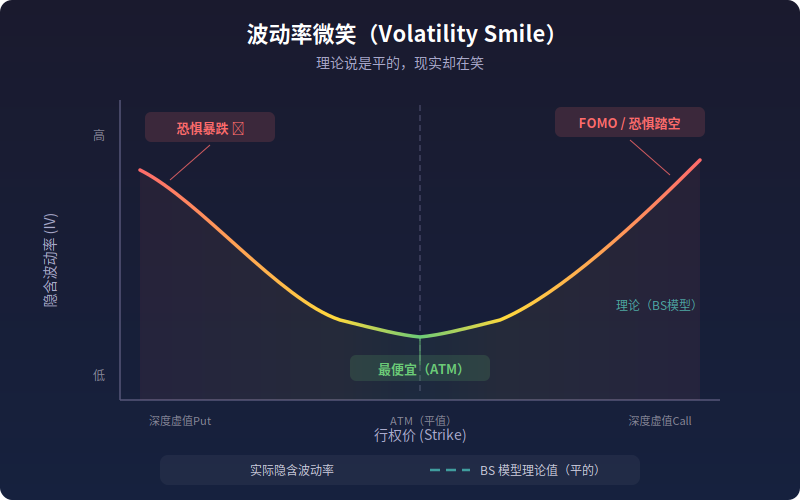

【量化交易】你猜涨跌，他赌波动率，而专业玩家在赌"恐惧曲线的形状"

#量化交易 #期权 #波动率 #BTC #Vanna-Volga #程序员科普

━━━━━━━━━━━━━━━━━━━━

◆ 写在前面：这不是一篇 AI 文章

━━━━━━━━━━━━━━━━━━━━

最近听朋友给我安利一个叫 Baowin（Jeff Liang）的 BTC 期权波动率套利策略，越听越觉得——这套东西的思维方式和做 AI 系统工程是一回事：找信号、压噪音、在高维空间里做降维。

所以今天换个口味，不聊大模型，聊量化交易。准确地说，是借量化交易给程序员科普金融直觉，顺便在最后点一下 AI 的角色。

如果你是"会写代码但不懂金融"的人——恭喜，这篇就是写给你的。

━━━━━━━━━━━━━━━━━━━━

◆ 第一维：散户的一维游戏——猜涨跌

━━━━━━━━━━━━━━━━━━━━

大多数人炒股、炒币的方式：

看 K 线 → 觉得要涨 → 买入 → 等涨 → 没涨 → 割肉

这是一个一维游戏。你的决策变量只有一个：**方向**。涨还是跌，多还是空，1 还是 0。

成功率多少？长期来看，扣掉手续费和滑点，随机猜的期望收益是负数。因为市场不是掷硬币——它有摩擦成本，有信息不对称，有庄家收割。你以为自己在做分析，其实你只是在一条线上赌方向。

K 线图给你的信息量极其有限。一根 K 线是什么？是开盘价、最高价、最低价、收盘价四个数字。而决定价格的因素——宏观经济、资金流、市场情绪、衍生品仓位、跨市场套利……是一个几十维甚至几百维的系统。

**K 线图是高维流形在二维时间轴上的投影。** 你看到的是灰烬，不是火焰。你在灰烬的形状里找规律，就像在地上的影子里猜一个人的长相——偶尔蒙对，大概率扯淡。

━━━━━━━━━━━━━━━━━━━━

◆ 插播：期权速成——程序员版

━━━━━━━━━━━━━━━━━━━━

后面要聊波动率，必须先过"期权"这一关。30 秒讲完核心概念，不废话。

**期权（Option）** = 一份"权利合同"。你花一笔钱（权利金 / Premium），买到一个权利：在未来某个时间，以某个约定价格买入或卖出某个资产。

两种基本类型：

| 类型 | 权利 | 什么时候赚 |
|------|------|-----------|
| 看涨期权（Call） | 以约定价格**买入** | 实际价格涨了，你用便宜价买到 |
| 看跌期权（Put） | 以约定价格**卖出** | 实际价格跌了，你用贵价卖掉 |

💡 人话翻译：Call 是"涨了我有权买"，Put 是"跌了我有权卖"。关键词是"权利"——你可以选择不行使，最多亏掉权利金。

**行权价（Strike Price）** = 合同里约定的那个价格。比如 BTC 现在 6 万美元，你买了一张行权价 7 万的 Call，意思是"我花了权利金，赌 BTC 会涨到 7 万以上"。

**到期日（Expiry）** = 权利的有效期。过了这天，合同作废。

三个变量记住：**方向（Call/Put）、行权价（Strike）、到期日（Expiry）**。组合起来就是一张具体的期权合约。

━━━━━━━━━━━━━━━━━━━━

◆ 第二维：进阶玩家的二维游戏——赌波动率

━━━━━━━━━━━━━━━━━━━━

现在进入第二个维度。

期权的价格不只取决于"标的资产涨了还是跌了"，还取决于一个叫**波动率（Volatility）**的东西。

**波动率** = 价格波动幅度的大小。不是方向，是幅度。BTC 一天涨跌 1% 是低波动率，一天涨跌 10% 是高波动率。

💡 人话翻译：方向是"往左还是往右"，波动率是"走多远"。

为什么波动率影响期权价格？直觉上：波动率越大，期权变成"有价值"的概率越大。BTC 现价 6 万，行权价 7 万的 Call——如果 BTC 每天波动 0.1%，一个月根本涨不到 7 万，这张 Call 就是废纸；如果每天波动 5%，涨到 7 万甚至 8 万完全有可能，这张 Call 就值钱。

所以，期权价格里"藏"着一个市场对未来波动率的预期。把期权价格反推回去，解出来的那个波动率数字，叫**隐含波动率（Implied Volatility, IV）**。

💡 人话翻译：隐含波动率不是你算出来的历史数据，是市场用真金白银投票出来的"未来波动有多大"的共识。

────────────────────

【二维游戏怎么玩】

如果你不赌方向，只赌"波动率会变大"，怎么操作？

**买跨式（Straddle）**：同时买同一个行权价的 Call 和 Put。

不管涨还是跌，只要波动够大，总有一边赚钱。赚的钱超过两份权利金的成本，就是你的利润。

反过来，如果你赌"波动率会缩小"，就**卖跨式**：同时卖 Call 和 Put，收两份权利金。只要价格不怎么动，两张期权都变废纸，权利金归你。

这就是二维游戏：你不猜方向，你赌的是"市场到底会不会出大事"。

很多进阶交易者就停在这一层了。但这一层的问题是——波动率本身也很难预测。你赌波动率会涨，结果它就是不涨，权利金白交了。

━━━━━━━━━━━━━━━━━━━━

◆ 第三维：Vanna-Volga 策略——赌"恐惧曲线的形状怎么变"

━━━━━━━━━━━━━━━━━━━━

现在到了 Baowin/Jeff Liang 的 BTC 期权策略真正在做的事情。要理解它，需要先引入几个概念。

────────────────────

【希腊字母——敏感度的度量】

期权价格受多个因素影响。交易员用一组"希腊字母"来量化"期权价格对每个因素有多敏感"。

这和你写代码做性能分析一样：你想知道"改哪个参数对延迟影响最大"——希腊字母就是偏导数。

| 希腊字母 | 含义 | 偏导数 |
|---------|------|--------|
| Delta (Δ) | 价格对标的资产价格的敏感度 | ∂V/∂S |
| Gamma (Γ) | Delta 对标的资产价格的敏感度（二阶导） | ∂²V/∂S² |
| Vega | 价格对波动率的敏感度 | ∂V/∂σ |
| Theta (Θ) | 价格对时间流逝的敏感度 | ∂V/∂t |

💡 人话翻译：Delta 是"BTC 涨 1 块，期权涨多少"。Gamma 是"Delta 本身会变多快"——敏感度的敏感度。Vega 是"波动率涨 1%，期权涨多少"。

到这里，一阶和二阶的区别就出来了。Delta 是一阶导，Gamma 是二阶导。一阶告诉你方向和速度，二阶告诉你加速度——变化的变化。

────────────────────

【波动率微笑——恐惧的等高线】

现在看一个关键的图形。

把不同行权价的期权的隐含波动率画出来，横轴是行权价，纵轴是隐含波动率。理论上应该是一条平线（Black-Scholes 模型假设波动率是常数）。但实际上，你看到的是一条微笑的曲线——两头翘起来，中间低。

**这就是"波动率微笑"（Volatility Smile）。**

为什么两头高？因为市场参与者在两个极端场景上愿意出更高的价格买保险。左边翘起（深度虚值 Put）= 恐惧暴跌；右边翘起（深度虚值 Call）= 恐惧暴涨（或 FOMO 踏空）。

**波动率微笑是市场恐惧的等高线图。** 曲线的形状编码了所有参与者对尾部风险的集体定价。

────────────────────

【Vanna 和 Volga——微笑曲线的形变参数】

重点来了。

波动率微笑不是固定的，它的形状会变。有时候微笑对称，有时候左边翘得更高（偏斜），有时候整体更弯（曲率更大）。

量化这种形变的，就是两个二阶交叉导数：

**Vanna** = ∂²V / (∂S · ∂σ) = ∂Δ/∂σ

💡 人话翻译：波动率变化时，Delta 会跟着变多少。它度量的是"微笑曲线的偏斜程度怎么随价格变化"。

**Volga**（也叫 Vomma）= ∂²V / ∂σ² = ∂ν/∂σ

💡 人话翻译：波动率变化时，Vega 会跟着变多少。它度量的是"微笑曲线的曲率"——微笑到底弯不弯。

| 参数 | 度量什么 | 微笑曲线的含义 |
|------|---------|---------------|
| Vega | 波动率水平 | 微笑整体上移还是下移 |
| Vanna | 偏斜敏感度 | 微笑歪不歪 |
| Volga | 曲率敏感度 | 微笑弯不弯 |

**Vanna-Volga 策略就是：不赌方向，不赌波动率水平，赌微笑曲线的形状怎么变。**

具体怎么操作？构建一个组合，把 Delta 对冲掉（不赌方向），把 Vega 对冲掉（不赌波动率水平），留下 Vanna 和 Volga 的敞口。然后等微笑曲线的形状回归或变化，赚取其中的差价。

三个维度，三种游戏：

| 维度 | 赌什么 | 对冲什么 | 暴露什么 |
|------|-------|---------|---------|
| 一维（散户） | 方向 | 无 | Delta |
| 二维（进阶） | 波动率水平 | Delta | Vega |
| 三维（Vanna-Volga） | 微笑形状 | Delta + Vega | Vanna + Volga |

━━━━━━━━━━━━━━━━━━━━

◆ 这个领域都有谁——从诺贝尔奖到爆仓

━━━━━━━━━━━━━━━━━━━━

波动率交易不是什么新发明。从传统金融到加密货币，这条路上站满了聪明人——有些封神，有些爆仓。

────────────────────

【奠基者】

**Black-Scholes 模型**（1973）：Fischer Black 和 Myron Scholes 推导出期权定价公式，假设波动率是常数。Scholes 因此获得诺贝尔经济学奖。讽刺的是，Scholes 后来加入 LTCM（长期资本管理公司），用波动率模型交易——1998 年爆仓，差点拖垮整个华尔街。

💡 人话翻译：发明了"波动率是常数"这个假设的人，最终被"波动率不是常数"这个现实击倒了。波动率微笑就是对 BS 模型最直接的打脸。

────────────────────

【几种经典的波动率策略】

Vanna-Volga 只是波动率交易的一种。这个领域还有几种经典玩法：

| 策略 | 核心思路 | 赚什么钱 |
|------|---------|---------|
| **Gamma Scalping** | 持有跨式期权，不断 Delta 对冲 | 实际波动率 > 隐含波动率时赚差价 |
| **波动率溢价收割** | 系统性卖出期权 | 隐含波动率长期高于实际波动率的那部分溢价 |
| **Dispersion Trading** | 做空指数期权波动率，做多成分股波动率 | 指数 IV 通常高于成分股加权 IV 的"相关性溢价" |
| **尾部风险对冲** | 持续买入深度虚值 Put | 平时每月亏小钱，极端事件赚百倍 |
| **Vanna-Volga** | Vega 中性，积累二阶敞口 | 微笑曲线形状变化的差价 |

────────────────────

【几个标志性人物】

**Nassim Taleb**（塔勒布）：前期权交易员，《黑天鹅》作者。他的核心主张是"反脆弱"——持续买入深度虚值看跌期权，平时每月亏一点权利金，等极端事件来了赚百倍。他的门徒 **Mark Spitznagel** 创办了 Universa Investments，2020 年 3 月新冠暴跌时单月回报超过 4000%。

**Jim Simons / 文艺复兴科技（Renaissance Technologies）**：大奖章基金年化收益超 60%，人类金融史上最赚钱的基金，大量使用统计套利和量化模型交易波动率。Simons 本人是数学家，研究微分几何出身——又是流形。

**Ken Griffin / Citadel Securities**：全球最大的期权做市商之一，占美国期权市场约 25-30% 的交易量。做市商就是"两头报价，赚买卖价差"，本质上是在持续做 Gamma Scalping。

────────────────────

【加密货币期权的现状】

加密期权市场比传统金融小得多，但增长极快：

- **Deribit**：垄断地位，占加密期权市场约 85-90% 的份额，BTC 和 ETH 期权为主
- **日均交易量**：名义价值约 10-20 亿美元（对比 CBOE 日均数万亿）
- **主要工具**：GreeksLive（Jeff Liang 创办的期权工具平台，Deribit 投资）、Laevitas（链上期权数据）、Paradigm（机构大宗交易）

朋友安利给我的 Baowin 策略，就是 GreeksLive 创始人 Jeff Liang 在 Deribit 上跑的一套 Vanna-Volga 实战系统，公开了一些关键数据：

- **净值**：6.7 BTC（约 40 万美元量级）
- **换手率**：每月约 100 倍——意味着每天大约交易 20 张合约
- **执行成本**：优化到每天约 50 美元
- **目标年化收益**：20-25%，最大回撤 3-5%
- **核心纪律**：Always long gamma——始终保持正 Gamma 敞口

"Always long gamma"是什么意思？Gamma 是 Delta 的导数，持有正 Gamma 意味着：价格往任意方向大幅波动时，你都会赚钱。代价是在价格不动的时候，你每天要付出一点时间衰减（Theta）。

这就像买保险——日常花点小钱，换取极端行情下不被打爆。在加密货币这种动不动单日波动 10-20% 的市场里，这是一条铁律。

━━━━━━━━━━━━━━━━━━━━

◆ Gamma Squeeze——做市商的对冲行为本身就在制造行情

━━━━━━━━━━━━━━━━━━━━

到这里你可能觉得，波动率交易就是一帮聪明人在安静地套利。但现实比这暴力得多——**做市商的希腊字母对冲行为，会反过来影响市场价格走向**。

这就是 Gamma Squeeze。

────────────────────

【机制：一个自我强化的正反馈循环】

假设你是做市商，有人从你手里买了大量的看涨期权（Call）。作为卖方，你需要 Delta 对冲——买入一定数量的标的资产来抵消风险。

然后价格涨了。Call 的 Delta 增大了（更接近实值）。你被迫买入**更多**标的资产来维持对冲。

你买入的动作推高了价格。价格更高了，Delta 更大了，你又要买更多……

**这是一个机械的、结构性的正反馈循环。** 做市商不是在看好后市——他们是被自己的风控模型逼着买的。Gamma 越大（Delta 变化越快），这个循环越猛烈。

────────────────────

【经典案例：2021 年 GameStop】

2021 年 1 月，Reddit 散户大量买入 GameStop 的远虚值 Call（行权价 $40-$60，当时股价约 $20）。这些 Call 的 Gamma 极大——一旦股价接近行权价，Delta 会暴增。

股价突破行权价后，做市商被迫大规模买入股票对冲。股票从 $20 被推到盘中 $483。

注意这里的因果链：**不是因为 GameStop 值 $483 所以涨到 $483，而是因为做市商的对冲算法在机械地执行买入指令。** 当券商限制买入后，正反馈循环断裂，几天内跌回 $100 以下。

在加密货币市场，类似的效应同样存在，而且因为流动性更低，可能更剧烈。

────────────────────

【零和博弈？没那么简单】

你同事说"金融衍生品都是零和游戏"——这在聚合层面基本正确：一方的盈利等于另一方的亏损。但严格来说有细微差别：做市商通过 Delta 对冲，可以让期权买方赚钱的同时，自己在对冲头寸上也赚钱。期权更像是**风险转移工具**——买方转移了方向性风险，做市商赚取买卖价差和波动率溢价。

但 Gamma Squeeze 揭示了一个更深的真相：**在衍生品市场里，"找规律"和"制造规律"之间的界限是模糊的。** 做市商的对冲行为本身就在塑造价格走势。散户看到的"趋势"，可能只是做市商 Gamma 对冲的副产品。

**你以为你在读市场，其实你在读做市商的风控模型。**

━━━━━━━━━━━━━━━━━━━━

◆ 为什么是二阶导——Taylor 展开的帕累托边界

━━━━━━━━━━━━━━━━━━━━

你可能会问：为什么停在二阶？为什么不用三阶、四阶导数捕捉更精细的信号？

答案来自你大学微积分课上学过的 Taylor 展开。

期权价格变化量 dV 可以展开成：

dV ≈ Δ·dS + Vega·dσ + Θ·dt + ½Γ·(dS)² + Vanna·dS·dσ + ½Volga·(dσ)² + ...

前面是一阶项（线性），中间是二阶项（平方和交叉项），后面还有三阶、四阶……

**一阶项（Δ, ν, Θ）是信号最强但最容易被对冲掉的。** 方向性风险？买反向头寸对冲。波动率风险？做 Vega 中性。时间衰减？那是确定性的，没信息量。

**二阶项（Γ, Vanna, Volga）是信号压住噪音的最后一层。** 二阶效应足够大，能在扣掉交易成本后留下利润；同时足够非线性，不容易被简单对冲掉——因为大多数市场参与者只做到一阶。

**三阶项（Speed, Ultima, ...）在理论上存在，在工程上不经济。** 三阶导的信号幅度大概是二阶的 1/10 到 1/100。而每多做一层对冲，你多出的交易成本、滑点、执行延迟就把那一丁点信号吃掉了。信噪比低于 1，做了等于没做。

这就是 Taylor 展开的帕累托边界：**二阶是"花一份成本买到最后一份有意义的信号"的分界线。** 往上走，每多花一块钱买到的信息量断崖式下跌。

这和机器学习里的偏差-方差权衡异曲同工——模型复杂度不是越高越好，过了帕累托前沿就是在拟合噪音。

━━━━━━━━━━━━━━━━━━━━

◆ AI 在这里面能干什么、不能干什么

━━━━━━━━━━━━━━━━━━━━

每次聊金融话题，都有人问："让 GPT/Claude/Gemini 直接做交易信号行不行？"

短回答：不行。

长回答——

────────────────────

【LLM 不适合做交易信号】

LLM 的核心能力是在语义空间里做推理。它的内部表征是一个语义流形——词义相近的概念在向量空间里距离相近。"猫"和"狗"挨着，"猫"和"股价"很远。

但价格序列不是语义序列。"BTC 从 60000 涨到 61000"这个事件的信息量，和"BTC 从 60000 涨到 61000"这句话的语义是完全不同的两个东西。前者的信息在数字的精确值和时间戳里，后者的信息在自然语言的语义关系里。

**语义流形 ≠ 价格序列的统计结构。** 让 LLM 预测下一个 token 和让它预测下一个价格，底层的数据生成过程完全不同。语言有语法、有上下文约束、有语义一致性；价格序列是半随机的、非平稳的、被无数未知因素驱动的。

更根本的问题：LLM 的训练数据是历史文本，不包含实时市场微观结构信息。你让它"预测明天 BTC 价格"，它给你的不是预测，是从训练数据里检索到的"看起来像预测的句子"。

────────────────────

【AI 适合做"高维计算外骨骼"】

但 AI（广义的，不只是 LLM）在量化交易的工程环节极其有用：

**1. 实时计算 Greeks。** 一个期权组合可能有几十张合约，每秒都在变。Vanna、Volga 这些二阶交叉导数的解析解很复杂，需要实时高精度数值计算。这是 GPU 和专用算法的领域。

**2. 写对冲机器人。** 策略逻辑确定后，执行层需要自动化——监控偏离阈值、自动下单、滑点控制、异常检测。这是 LLM 辅助写代码的完美场景——Copilot 和 Claude Code 写交易机器人的效率比手撸快 5-10 倍。

**3. 信息降噪。** 加密货币市场的信息极其嘈杂——Twitter、Telegram 群、链上数据、宏观新闻……LLM 能做的是帮你从噪音里提取结构化信号："这条消息是在说什么？情绪是恐慌还是贪婪？和历史上哪次事件类似？"

**4. 波动率曲面拟合。** 用 ML 模型（不一定是 LLM，可以是传统的 SABR 模型或者神经网络）拟合波动率曲面，检测 Vanna/Volga 方向的异常偏离——这是策略信号的来源。

一句话：**AI 不应该是驾驶员，应该是外骨骼。** 方向盘在人手里，AI 负责让你看得更清、算得更快、执行得更准。

━━━━━━━━━━━━━━━━━━━━

◆ 回到第一性原理：市场的"规律"到底是什么

━━━━━━━━━━━━━━━━━━━━

写到最后，拉回到最根本的问题。

物理学的规律是宇宙的底层代码——万有引力常数 G 不会因为你发现了它就变了。但市场的"规律"不是这种东西。

**市场的规律是由人类的贪婪和恐惧挤压出来的统计偏差。**

波动率微笑为什么存在？因为人类对尾部风险的恐惧是不对称的——亏 50% 的痛苦远大于赚 50% 的快乐。这种心理偏差被期权定价反映出来，就形成了微笑曲线。Vanna-Volga 策略赚的，就是这种偏差回归均值过程中的差价。

但这里有个致命的循环：**一旦一个统计偏差被发现并被资金利用，套利行为本身就会消灭这个偏差。**

更多人做 Vanna-Volga → 微笑曲线的异常更快被修正 → 可套利空间缩小 → 利润下降。这就是为什么 Baowin 的目标年化是 20-25% 而不是 200%——他很清楚这个上限是由市场效率决定的，而市场效率在不断提高。

**量化交易本质上是在找"还没被填平的坑"。**

这些坑来自：市场参与者的认知偏差、信息传播的延迟、不同市场之间的摩擦、监管造成的结构性扭曲。每找到一个坑，就有人跳进去填它，填到无利可图为止。然后你得去找下一个坑。

这和做 AI 产品其实很像——技术红利窗口存在但有限，先到者吃最大的肉，后来者喝汤，再后面连汤都没有。不同之处在于：AI 产品的护城河可以靠网络效应和用户粘性维持，而量化策略的护城河只有一个——**你比别人更快地找到下一个坑。**

所以 Jeff Liang 每天交易 20 张合约、每月换手 100 倍、把执行成本压到 50 美元/天。不是因为贪婪，是因为这个游戏的利润空间本来就薄如蝉翼，稍有懈怠就被市场效率吃掉了。

这大概就是量化交易最反直觉的地方：**看起来最"机械"的交易方式，背后需要最深的对人性的理解。**

因为你交易的不是资产——你交易的是其他人对这个资产的恐惧和贪婪。

━━━━━━━━━━━━━━━━━━━━

// 靳岩岩的 AI 学习笔记 × Claude 的严谨 × Gemini 的浪漫
// 2026-04-21
