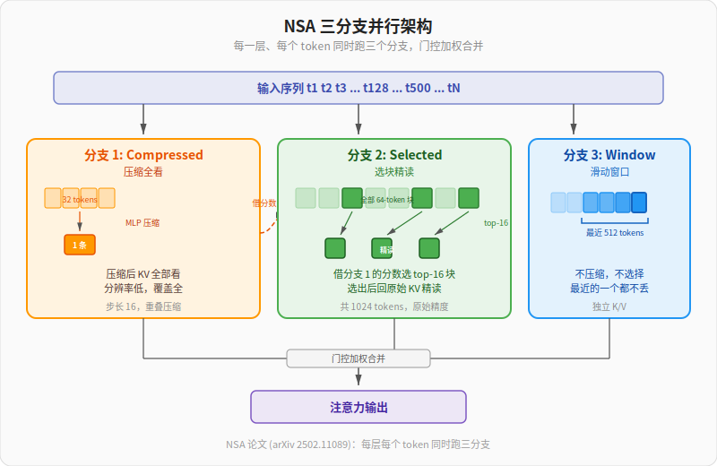

【DeepSeek 注意力】MHA、MLA、DSA、CSA/HCA——从 V1 到 V4

━━━━━━━━━━━━━━━━━━━━

◆ 先说清楚今天讲什么

━━━━━━━━━━━━━━━━━━━━

DeepSeek V4 发布之后，我们第一时间出了一篇速报（第 165 期 https://mp.weixin.qq.com/s/8UnO_NMW_A2zHEywkAND1A ），然后把 58 页技术报告摊开做了一篇精读（第 166 期 https://mp.weixin.qq.com/s/iLObYwtZYqCWwRRYJVcpyA ）。

V4 在 HuggingFace 主页上自己列了**三大创新**：

```text
1. 混合注意力（CSA + HCA）
2. mHC（流形约束超连接）
3. Muon 优化器
```

这三件事我们已经讲过两件了：

- **mHC** 在第 37 期《DeepSeek mHC：为什么"流形约束"是标题党》（ https://mp.weixin.qq.com/s/IMU__NKt_L41YeHKi7_A1g ）讲过——它的前身是字节跳动的 HC（超连接），DeepSeek 在 HC 基础上加了双随机矩阵约束。
- **Muon 优化器**昨天第 167 期《优化器：从 SGD、AdamW 到 DeepSeek V4 的 Muon》（ https://mp.weixin.qq.com/s/4RFiMwfiO5x1K_yIJnoqbg ）刚讲完——把矩阵当几何对象整体更新，而不是逐元素拧螺丝。

今天讲第三件，也是 V4 最大的换刀：**注意力**——CSA + HCA。

注意力这条线不是 V4 横空出世的。DeepSeek 走到 CSA/HCA 之前，已经在 V3.2 里跑过一版 **DSA**（DeepSeek Sparse Attention）。我们之前专门讲过《DeepSeek V3.2 的稀疏注意力，一项被低估的技术突破》（ https://mp.weixin.qq.com/s/kT_2qmGbRPWMCV_ZEwIpPQ ）。今天 CSA/HCA 直接把 DSA 包进去了——这条线我们一路看着它走过来。

V4 把 Transformer 里跑了八年的标准注意力换掉了。换的不是一两个细节，而是把"注意力"这件事本身重新设计了一遍——CSA + HCA 两种压缩注意力交替排列，加上滑动窗口兜底，再让 Lightning Indexer 在压缩后的 KV cache 上选 top-k。

这套东西看起来零件很多。但你顺着注意力的演化史一路走下来就会发现，每一刀都在回答上一代留下的问题。

```text
MHA（2017）        → 标准多头注意力，KV 全存全看
MQA（2019）        → 多头共享一份 KV，省存储
GQA（2023）        → 折中，分组共享
MLA（V2，2024）    → 维度压缩，DeepSeek 原创
DSA（V3.2，2025春）→ 序列稀疏，推理时选 top-k(训完套眼镜)
NSA（论文，2025-02）→ 原生可训练稀疏(三分支并行,理论铺路)
CSA/HCA（V4，2026）→ NSA 的工程落地(层级展开 + FP4 加速)
```

今天就把这条线一步一步走完。

━━━━━━━━━━━━━━━━━━━━

◆ 注意力到底在算什么

━━━━━━━━━━━━━━━━━━━━

在讲演化之前，先把注意力本身说清楚。

注意力机制做的事，可以用一句话概括：

**当前这个 token，要从前面所有 token 里挑出最相关的一些来"看"。**

具体怎么挑？三步：

```text
1. 当前 token 生成一个 Query 向量（"我想找什么"）
2. 之前每个 token 都有一个 Key 向量（"我是什么"）
3. Query 和每个 Key 算相似度（点积），分数高的就是相关的
```

挑出来之后呢？每个被选中的 token 还有一个 Value 向量（"我能提供什么信息"）。把这些 Value 按相似度加权求和，就是当前 token "看完上文之后"得到的新表示。

公式长这样：

```text
Attention(Q, K, V) = softmax(QKᵀ / √d) × V
```

每个开始学 LLM 的同学，都会被逼着盯这个公式看。第一遍看一脸懵，第二遍勉强对上字母，第三遍才反应过来——它说的不过就是上面那三步：QKᵀ 算相似度，softmax 把相似度归一化成权重（加起来等于 1），最后乘以 V 加权求和。`√d` 那个分母只是怕分数太大让 softmax 饱和，工程修正项，不影响理解。

这里的"相似度"也不是什么新鲜东西。每一个从后端、客户端转方向去做 AI Agent 的工程师，第一课几乎都是 RAG 系统里的**余弦相似度**——把两段文字各自变成一个向量，然后算它们的夹角余弦。夹角越小，余弦越接近 1，越相似。

注意力里 Q 和 K 算点积、做 softmax，本质就是在做一样的事：**判断当前 token "想找的"和某个历史 token "提供的"有多像**。RAG 的相似度搜的是文档库，注意力的相似度搜的是上下文里的每一个 token——尺度不同，机制是一样的。

公式劝退人，机制其实很朴素。

━━━━━━━━━━━━━━━━━━━━

◆ 一个被 99% 教程模糊掉的关键差别：训练 vs 推理

━━━━━━━━━━━━━━━━━━━━

讲到这里必须停下来吐槽一下。市面上 99% 的注意力教程画图都是这样的：

```text
        K_1  K_2  K_3  ...  K_N
Q_1     ✓    ✓    ✓         ✓
Q_2     ✓    ✓    ✓         ✓
Q_3     ✓    ✓    ✓         ✓
...     
Q_N     ✓    ✓    ✓         ✓
```

一个 N×N 的全连接大方阵——每个 Q 和每个 K 都要算一次。看完这张图，你会觉得"哦，注意力就是 N 个 Q 和 N 个 K 互相点积，所以是 N²"。

**这张图描述的是训练阶段（以及推理的 prefill 阶段——把用户输入一口气灌进去的那一步）。**

**推理的 decode 阶段——一个一个蹦新 token 的那个阶段——根本不长这样。**

来看看真实推理时发生了什么。

假设你已经有 N 个 token，想生成第 N+1 个：

```text
现在手里:
  K_1, K_2, ..., K_N  ← 之前每一步算好留下来的(KV cache)
  V_1, V_2, ..., V_N  ← 之前每一步算好留下来的(KV cache)
  Q_1, Q_2, ..., Q_{N-1}  ← 已经全部丢光了

这一步要做的:
  1. 拿最末位 token t_N 的隐藏状态 h_N
  2. 算出 Q_N、K_N、V_N(只算 1 个 Q,1 个 K,1 个 V)
  3. K_N 和 V_N 追加进 KV cache
  4. Q_N 去查 K_1..K_N(N 条),加权 V_1..V_N(N 条)
  5. → 注意力输出 → 过 FFN → 过分类头 → 采样得到 t_{N+1}
  6. Q_N 用完,丢

下一步生成 t_{N+2}:
  算 Q_{N+1}、K_{N+1}、V_{N+1}
  Q_{N+1} 去查 K_1..K_{N+1}
  ... 依此类推
```

注意了。**这张推理图长这样：**

```text
        K_1  K_2  K_3  ...  K_N
Q_N     ✓    ✓    ✓         ✓     ← 只有这一行
```

**1 × N，不是 N × N。**

也就是说：

**推理 decode 时，只有最末位那一个 Q 在工作。**

为什么是这样？因为生成是一个 token 一个 token 蹦出来的——蹦第 N+1 个时只需要 t_N 在"问问题"，t_1..t_{N-1} 早就问完了，它们的 Q 早就被用过、丢掉了。**当前唯一在做决定的，就是最末位那个 t_N**。

---

**这个区别决定了一切：**

| | 训练阶段 | 推理 decode 阶段 |
|---|---|---|
| Q 用几个 | N 个全用 | 只用 1 个(最末位) |
| K 用几条 | N 条 | N 条 |
| V 用几条 | N 条 | N 条 |
| 注意力形状 | N × N 矩阵 | 1 × N 向量 |
| Q 要不要存 | 不需要(都是这一次性算) | 不需要(用完就丢) |
| K、V 要不要存 | 不需要(都是这一次性算) | **必须存**(下一步还要查) |

**核心洞察:推理 decode 时,N 个 K/V 全要用,但只用 1 个 Q。**

这就是为什么:

1. **KV cache 是显存大户,Q 从来不是显存大户**——N 条 K/V 全存,Q 只有 1 个,且用完就丢。
2. **注意力的演化战场永远在 KV 上,从来不在 Q 上**——MLA 砍 KV 维度、MQA/GQA 砍 KV 头数、CSA/HCA 砍 KV 条数,全部冲着 N 去。Q 没什么好砍的。
3. **稀疏注意力是"从 N 条 K/V 里选 top-k",不是"从 N 个 Q 里选"**——Q 只有 1 个,没得选。

---

99% 的教程从来不分清训练和推理。它们画一张 N×N 的图就开讲,让读者以为推理也是 N×N。结果你越学越觉得"注意力好贵啊,N² 怎么搞"——其实推理 decode 时根本不是 N²,是 **1 × N**。

贵的不是 Q×K 的算力,**贵的是要把 N 条 K 和 N 条 V 一直存着、一直读取**。这才是后面 MLA、DSA、NSA、CSA/HCA 这一连串发明真正的战场。

那个"N 条要存着的 K 和 V"——就是大名鼎鼎的 **KV cache**。

KV cache 是 Transformer 推理时显存的头号大户。一个 token 进来，过 61 层 Transformer，每层都要存一份 K 和 V。50000 个 token 的上下文就是 50000 × 61 = 305 万条 KV cache。每条还是好几千维的浮点数。轻松爆显存。

━━━━━━━━━━━━━━━━━━━━

◆ KV cache 不只是技术问题——它直接和你的 API 账单挂钩

━━━━━━━━━━━━━━━━━━━━

如果你用过 AI API（OpenAI、Anthropic、DeepSeek 都一样），你会注意到定价表有三列，不是两列：

| | 输入-命中缓存 | 输入-没命中缓存 | 输出 |
|---|---|---|---|
| DeepSeek V4 Pro | $0.145 | $1.74 | $3.48 |
| GPT 5.5 | $0.5 | $5 | $30 |
| Claude Opus 4.7 | $0.5 | $5 | $25 |

（单位：美元 / 百万 token）

"输入"为什么分两个价格？**差了 10 倍？**

这就是 KV cache 在账单上的体现。

你每次调 API，发过去的其实是**一整段上下文**：系统提示词 + 历史对话 + 你这次的新问题。服务端拿到这一整段，要从头到尾算每个 token 的 KV——这是 prefill 阶段。

但有一个关键事实：**上下文永远只会在末尾追加，不会往前面插入。**

你发第一条消息，上下文是 `[系统提示 + 消息1]`。
你发第二条消息，上下文是 `[系统提示 + 消息1 + 回复1 + 消息2]`。
你发第三条消息，上下文是 `[系统提示 + 消息1 + 回复1 + 消息2 + 回复2 + 消息3]`。

前面的部分永远不变，只有末尾在增长。这意味着前面那些 token 的 KV cache **上一轮已经算过了**。如果服务端还没丢掉它们（缓存命中），这一轮就可以直接复用，**不需要重新算**。只有新追加的那几个 token 需要算新 KV。

```text
命中缓存（$0.5/M token）: 上一轮算过的 KV 还在，直接用
没命中（$5/M token）:     KV 被丢了,或者上下文变了,要从头算
输出（$25/M token）:      模型新生成的每个 token,每个都要查 N 条 KV
```

所以 API 的三列价格，本质就是 KV cache 的三种状态：**已有（便宜）、没有要重算（贵 10 倍）、新生成输出（最贵）**。

这也是为什么你和 AI 聊了很长一段对话之后，响应会越来越慢、越来越贵——不是 AI 变笨了，是 KV cache 越来越长，每生成一个新 token 都要查更多历史 KV。

**额外提一句**：如果你在做 AI Agent，上下文的拼装方式非常重要。**永远只在末尾追加，不要往中间插入**——往中间插一条，插入点之后所有 token 的 KV cache 全部作废，要从插入点开始重算。一次插入，几万条 KV cache 白存了。这是 Agent 框架设计里一个容易踩的坑：有些框架为了"整理上下文"会在中间插入摘要或者调整顺序，结果每轮对话都 cache miss，API 账单直接翻 10 倍。

这不是理论风险——**2026 年 3 月 Claude Code 就翻过这个车**。当时大量用户反馈 token 消耗暴涨，Max $200/月套餐 1-2 小时就烧光（正常能用 8 小时）。后来源码泄露揭示了根因：Claude Code 在每轮请求的系统提示里悄悄插入了两样**每次都变的东西**——反滥用验证 token 和反蒸馏用的假工具定义。这两样东西塞在上下文前面，每轮都不一样，导致 prompt prefix 每轮都变，cache 每轮都 miss，每轮都要从头重算整段上下文的 KV。就是这么一个"在前面插了点变化的东西"的操作，把成本膨胀了 10-20 倍。

账单的事说完了，回到技术本身。

KV cache 既是推理时的显存大户，又是 API 账单的核心变量——所有的优化动力最终都指向同一个问题：**怎么让 KV cache 更小、更快、更省？**

这就是注意力机制过去八年一直在回答的问题。下面从头捋一遍这条演化线。

━━━━━━━━━━━━━━━━━━━━

◆ MHA：原版多头注意力

━━━━━━━━━━━━━━━━━━━━

MHA（Multi-Head Attention）是 2017 年那篇 *Attention Is All You Need* 提出的原版机制。

"多头"的意思是：不只算一组 Q/K/V，而是同时算很多组。每组叫一个 head。每个 head 用不同的投影矩阵把输入映射成自己的 Q/K/V，独立做注意力计算，最后把所有 head 的输出拼起来。

为什么要多头？

因为不同的 head 可以关注不同的东西。一个 head 可能专门看语法关系（主语和谓语对齐），另一个 head 可能看代词指代（"它"指的是前面哪个东西），还有的 head 看远距离依赖。每个 head 是一个独立的小专家。

但要强调：**哪个 head 学到什么功能是随机的，不是人为规定的。** 初始化时每个 head 的权重是随机的，训练过程中各自分化——最终谁负责语法、谁负责指代，完全看训练时随机落在哪个位置。换一次随机种子重新训，同样的功能可能分配给完全不同的 head。所以上面说的"可能看语法""可能看指代"只是研究者事后观察到的模式，不是设计意图。

V4-Pro 用 128 个头。这就是说每过一层 Transformer，模型要同时跑 128 套独立的 Q/K/V 计算。

问题来了：

**KV cache 是按头存的。**

128 个头，每个头自己一份 K、自己一份 V。每个 token 每层要存 128 × 2 = 256 份向量。

这就是 MHA 的代价：表达力强，但 KV cache 巨大。

模型变大、上下文变长之后，这个代价开始扛不住了。一个 70B 模型，128K 上下文，光 KV cache 就要几十 GB。一张 A100 都装不下。

所以下一刀必须砍向"多头"本身。

━━━━━━━━━━━━━━━━━━━━

◆ MQA：所有头共享一份 KV

━━━━━━━━━━━━━━━━━━━━

MQA（Multi-Query Attention）出自 Google 2019 年的论文 *Fast Transformer Decoding*。

它的想法很粗暴：

**Q 还是多头（每个头自己的 W_q 权重），但 K 和 V 全模型只保留一套权重（一个 W_k、一个 W_v）。**

MHA 时代，128 个头各有一套 W_k 和 W_v——同一个 token 过 128 个头，会算出 128 组不同的 K/V，都得存着。MQA 把 128 套砍成 1 套：所有头共用同一个 W_k 和 W_v，同一个 token 只算出 1 份 K 和 1 份 V。128 个不同的 Q 去查的是**同一份 K/V**。KV cache 直接砍到 1/128。

效果立竿见影——存储省了两个数量级，推理速度大幅提升。

但代价也很明显：所有 head 看到的"上下文表示"是一样的，差异完全压在 Q 上。模型表达力下降，几个基准测试上肉眼可见地掉点。

所以 MQA 在大模型上没立刻铺开。它太激进。

━━━━━━━━━━━━━━━━━━━━

◆ GQA：在 MHA 和 MQA 之间找平衡

━━━━━━━━━━━━━━━━━━━━

GQA（Grouped-Query Attention）是 Google 2023 年的论文 *GQA: Training Generalized Multi-Query Transformer Models*，作者 Ainslie 等。

思路就是字面意思：

**把 128 个头分成若干组，每组共享一份 KV。**

比如 LLaMA-3-70B 用 8 组——64 个 Q 头分成 8 组，每组 8 个 Q 头共享本组的一套 W_k/W_v（机制和 MQA 一样，只是从全局 1 套变成了每组 1 套）。KV cache 比 MHA 省 8 倍，比 MQA 多 8 倍。

GQA 的好处是它给了你一个旋钮：组数越少越省（极端是 MQA），组数越多越接近原版（极端是 MHA）。LLaMA、Qwen、Gemma 这一代主流模型基本都用 GQA。

但 GQA 还是在做同一件事：

**砍 KV head 数量。**

到这里，砍头这条路差不多走到头了。再砍下去就是 MQA，效果会掉。

DeepSeek 选了另一条路。

━━━━━━━━━━━━━━━━━━━━

◆ MLA：DeepSeek 的维度压缩（V2，2024）

━━━━━━━━━━━━━━━━━━━━

MLA（Multi-head Latent Attention）出自 DeepSeek 2024 年 5 月发布 V2 时的技术报告。这是 DeepSeek 第一次真正在架构层面做出原创性贡献。

MLA 不砍头数。它从另一个维度下刀：

**砍每条 KV 的"维度"。**

具体怎么做？

注意力里的 K 和 V 本来都是高维向量。比如 V4-Pro 的 hidden_size 是 7168 维。每个 token 每层要存的 K 和 V 都是这个维度上下的东西。

MLA 的做法是：**先把 K 和 V 压成一个低维的"latent vector"，存的时候只存这个 latent。**

```text
原始：    输入 7168 维 → K 7168 维、V 7168 维 → 各存一份
MLA：     输入 7168 维 → latent 512 维 → 只存这一份
```

7168 维变 512 维。光这一刀就省了 14 倍存储。

但 latent 怎么用？注意力需要 K 来算相似度、需要 V 来提供内容。**latent 里 K 和 V 压在一起了，推理时需不需要拆回来？**

答案是**不需要**。关键思路是：**既然 K 和 V 都是从 latent 经过一次矩阵乘法得到的，那把这次矩阵乘法挪到别的地方去做，效果一样，但 latent 就不用拆了。**

用一个生活比喻：

```text
传统注意力像这样:
  仓库存了原材料 K 和 V（各一大份）
  Q 拿着 K 去对账（算相似度）
  对完账拿 V 去发货（加权输出）

MLA 像这样:
  仓库只存了一个小包裹 latent（K 和 V 的压缩包）
  Q 这边提前把"解压 K"的能力学会了——Q 自己变成了 Q'，能直接和压缩包对账
  发货那边也提前把"解压 V"的能力学会了——输出投影自己能从压缩包里提取内容
  压缩包自始至终不需要被解压
```

用程序员的话说：传统注意力是**运行时解压**（每次推理都要从 latent 还原出 K 和 V），MLA 是**编译时解压**（把"还原 K"和"还原 V"的投影矩阵在训练时就合并进了 Q 投影和输出投影的权重里）。推理时这些权重是固定的，不需要额外计算，**latent 直接参与运算，从头到尾不需要还原成 K 和 V**。

想看具体怎么合并的，往下看推导。不看也不影响理解后面的内容。

---

**推导：把 Attention(Q, K, V) 改写成 Attention(Q', latent)**

先回忆原始公式，把它拆成两步写清楚：

```text
原始注意力分两步:

第一步（算相似度）:   score = Q × Kᵀ / √d
第二步（加权取内容）: output = softmax(score) × V
```

现在，K 和 V 都不直接存了，只存 latent。K 和 V 要从 latent 还原：

```text
latent = h × W_down              （7168 维 → 512 维，只存这个）
K = latent × W_uk                （512 维 → K 的维度）
V = latent × W_uv                （512 维 → V 的维度）
```

**改写第一步：Q × Kᵀ**

把 K = latent × W_uk 代入：

```text
Q × Kᵀ = Q × (latent × W_uk)ᵀ
```

矩阵转置有一条性质：(A × B)ᵀ = Bᵀ × Aᵀ，用上它：

```text
Q × Kᵀ = Q × W_ukᵀ × latentᵀ
```

注意 Q 和 W_ukᵀ 都不依赖历史 token——Q 是当前 token 算出来的，W_ukᵀ 是固定权重。可以先把它俩乘在一起，叫它 Q'：

```text
Q' = Q × W_ukᵀ

代入后:  Q × Kᵀ = Q' × latentᵀ     ✅ K 消失了，只剩 latent
```

**改写第二步：softmax(score) × V**

把 V = latent × W_uv 代入：

```text
softmax(score) × V = softmax(score) × latent × W_uv
```

这里 softmax(score) × latent 先算（结果是一个向量），再乘 W_uv。而 W_uv 是固定权重，可以合并到后面本来就要过的输出投影矩阵 W_o 里：

```text
原本:  output = (softmax(score) × V) × W_o
代入:  output = (softmax(score) × latent) × W_uv × W_o
合并:  output = (softmax(score) × latent) × W_o'

其中 W_o' = W_uv × W_o，训练完就是一个固定矩阵     ✅ V 消失了，只剩 latent
```

**合并后的完整公式：**

```text
原始:   score = Q × Kᵀ / √d              → output = softmax(score) × V × W_o
MLA:    score = Q' × latentᵀ / √d        → output = softmax(score) × latent × W_o'
```

**全程只有 latent 出场。K 和 V 从来没被显式算出来。** "还原 K"的 W_uk 被吸收进了 Q'，"还原 V"的 W_uv 被吸收进了 W_o'。推理时这些都是固定权重，零额外开销。

---

这就是 MLA 比 GQA 多省一个量级的根本原因：GQA 还是要存真正的 K 和 V（只是组数少），MLA 连 K 和 V 都不存了。

而且 MLA 把所有 head 的 K 和 V 都压在同一个 512 维 latent 上——128 个 Query 头共用这一份 latent。这听起来像 MQA，但本质不同：MQA 是 Q 多头但只有一组 K、V；MLA 是 Q 多头，K 和 V 也按头展开（用的时候投影出来），只是**存储**时压成共享 latent。

也就是说：

**MLA = 表达上保留多头（用时展开），存储上极致压缩（共享 latent）。**

V4-Pro 的 config.json 里能直接看到：

```json
"num_attention_heads": 128,        // Q 头数
"num_key_value_heads": 1,          // 存储时的 KV 头数（就是那 1 份 latent）
"head_dim": 512                    // latent 维度（从 7168 压到这里）
```

128 个 Q 头，但只存 1 份 512 维 latent。这就是 MLA。

省了多少？直接看维度比就行：7168 维压到 512 维，存储量就是原来的 512/7168 ≈ **7%**。50000 token 上下文、61 层，KV cache 总量从 MHA 的 40.7 GB 压到 1.64 GB。

这是 MLA 的维度压缩——砍的是**每条 latent 多大**。从 V2 到 V3.2，这个 7% 的底子一直没变。后面的 DSA、NSA、CSA/HCA 做的所有事情，**都是在这 7% 的基础上再压**——砍的不再是维度，是**条数**。

V2 之后 V3、V3.1、V3.2 一路继承了 MLA。这是 DeepSeek 能撑起百万上下文的基础。

但 MLA 解决的是"每条多大"。**条数还是和上下文长度一一对应**——10 万个 token 还是 10 万条 latent。每条变小了，总条数没少。

下一刀砍向条数。

━━━━━━━━━━━━━━━━━━━━

◆ DSA：序列稀疏（V3.2，2025）

━━━━━━━━━━━━━━━━━━━━

DSA（DeepSeek Sparse Attention）出现在 V3.2 里。它做的事可以一句话总结：

**KV cache 全存，但注意力计算时只看 top-k。**

之前说过，标准注意力是"当前 token 看前面所有 token"。这件事对 50000 token 的上下文来说就是 50000 次点积加 softmax。算力刚性消耗。

但这里有一个观察：

**真正相关的 token 其实很少。**

10 万个 token 里，对当前 query 真正有用的可能只有几百个。剩下的都是噪音。强行让 softmax 平摊到全部 token 上，反而稀释了真正重要的信号。

DSA 的做法是装一个 **Indexer**：先用一个轻量化的打分器，从全部 KV cache 里选出 top-k 条（比如 top-2048），然后注意力**只在这 k 条上算**。

```text
标准注意力：     Q × 全部 K → softmax → 全部 V 加权求和（看 50000 条）
DSA：           Indexer 选 top-k → Q × top-k 的 K → softmax → top-k 的 V 加权求和
```

50000 → 2048，计算量直接砍到 4%。

但 DSA 有一个重要的特性：

**它不省存储。**

KV cache 还是要全存。Indexer 要从中选 top-k，没存怎么选？所以 V3.2 的 KV cache 还是 1.64 GB（50K 上下文），和 V2 一样。**DSA 只省了计算。**

而且 DSA 是**推理阶段**才启用的。V3.2 的训练用的还是完整注意力——模型先在"看全部"的环境下学好怎么分配注意力，推理时才换上 DSA 这副"省力眼镜"。

这导致了 V3.2 的一个特点：模型训练时看到的世界 ≠ 推理时看到的世界。本质是"不改脑子，换副眼镜"。

V4 不再满足于这种妥协。

但在讲 V4 之前，要先讲一篇 **2025 年 2 月** 的论文——它是 DSA 和 CSA/HCA 中间的桥梁，也是 V4 实际的理论蓝图。

━━━━━━━━━━━━━━━━━━━━

◆ NSA：原生可训练的稀疏注意力（2025 年 2 月论文）

━━━━━━━━━━━━━━━━━━━━

NSA 全名 **Native Sparse Attention**，论文 *Native Sparse Attention: Hardware-Aligned and Natively Trainable Sparse Attention*（arXiv 2502.11089），DeepSeek 出品，第一作者 Yuan，**梁文锋本人也在署名**（这种规格的论文不多见）。注意：NSA 论文的实验模型用的是 **GQA 架构（27B，4 组，64 头）**，没有沿用 V2 的 MLA——这是一篇验证"原生稀疏注意力"思路的独立实验，不绑定 MLA。V4 才把 NSA 的思路和 MLA 合在一起。

NSA 这个名字里有两个关键词：

```text
Hardware-Aligned         —— 不光是数学上稀疏,还要让 GPU 能高效跑
Natively Trainable       —— 从训练第一步就用,不是推理时套眼镜
```

第二个关键词直接升级了 V3.2 DSA 的路线——DSA 是"训完套眼镜"，NSA 说**从训练第一个 step 就要用稀疏注意力**。都是 DeepSeek 自己的工作，先发论文验证思路，再在产品里一步步落地。

**NSA 怎么做的？三个分支。**

每一层注意力，每个 token 跑三个稀疏分支，然后用门控加权求和：

```text
分支 1: Compressed (压缩全看)
  把相邻 32 个 token 用一个学习的 MLP 压成 1 条 KV
  步长 16(重叠压缩)
  压缩后全部看——每条是 32 个 token 的摘要,分辨率低但覆盖全
  作用:扫一遍全局大意

分支 2: Selected (选块精读)
  借分支 1 的压缩分数排名,选出 top-16 个最重要的位置
  但选出来之后,回到原始 token 级 KV 做注意力(每块 64 tokens,共 1024 tokens)
  关键:打分用压缩的(省算力),精读用原始的(保精度)
  作用:在全局里挑最重要的几段,按原始精度精读

分支 3: Sliding Window (本地)
  最近 512 个 token 原样保留,不压缩
  作用:不丢最近上下文

三个分支各自算完注意力,最后用学习出来的门控权重加权合并。
```



**这套设计有几个非常聪明的取舍：**

**1. "块结构"对硬件友好。**

传统稀疏注意力常常按 token 选(谁重要选谁),结果选出来的 token 散在 KV cache 各处——GPU 读这种"散装"内存奇慢。NSA 强制按**连续块**选,GPU 一次能读一整块,内存访问模式干净利落。论文叫这个"hardware-aligned"。

**2. 选 top-k 复用压缩分数。**

如果选 top-k 要重新算一套 Q×K 分数,那等于多跑一次注意力,不省了。NSA 的做法是:**分支 1 已经算了 query 对每个压缩块的 softmax 分数,分支 2 直接拿这个分数排序选 top-k,零额外计算**。可微分,可训练,不需要外挂查询头。

**3. 三分支相对独立 + 门控,而不是层间分工。**

每层每个 token 都同时拥有粗概览、精选细节、最近上下文这三种视野,门控决定权重。这是一种"对称美"的设计——所有层一视同仁。

**论文给的实测数字非常硬：**

```text
模型规模:    27B 总参,3B 激活(MoE)
训练 token:  270B + 32K 长上下文继续训练
基准:        9 项通用 benchmark 平均分超过 Full Attention(0.579 vs 0.574)
              GSM8K +3.4 分,DROP +4.2 分(原生稀疏甚至比全注意力强)
              AIME 24 数学竞赛 +7.5 分(8K 上下文)
速度:        64K 长度下,前向 9.0×、反向 6.0×、解码 11.6× 加速
              解码每步只读 ~2.5K tokens(vs Full Attention 64K)
长上下文:    LongBench +3.2 分,64K Needle-in-Haystack 全位置完美检索
```

这组数字打破了一个长期以来的偏见:**稀疏注意力一定弱于全注意力**。NSA 在通用基准上不输,在长上下文和数学推理上反而**更强**。原因论文里明确给了——稀疏在原生训练时变成了一种**归纳偏置**(inductive bias),逼模型学会"哪些上下文真正重要",而不是均匀稀释注意力。


━━━━━━━━━━━━━━━━━━━━

◆ NSA 论文 → V4 实践：从对称美到非对称工程

━━━━━━━━━━━━━━━━━━━━

NSA 是论文,V4 是产品。论文要证明"可行",产品要证明"能跑得起、卖得动"。所以从 NSA 到 V4 之间有几个**关键的工程改造**——这是真正的"实践故事"。

| | NSA 论文(2025-02) | V4 CSA/HCA(2026) |
|---|---|---|
| 三分支怎么放 | **每层并行跑三个**,门控加权求和 | **奇偶层交替**:CSA 层和 HCA 层错开,每层只跑一种 + 滑窗 |
| 压缩块大小 | 统一 32(步长 16,重叠) | **CSA 4(重叠)、HCA 128(不重叠)** |
| 选 top-k | **复用压缩分支分数**(可微分,省算力) | **独立 Lightning Indexer**(FP4 跑全程) |
| 滑窗大小 | 512 | 128 |
| 选块数 | 16 个 64-token 块 = 1024 tokens | top-1024 个压缩块 |
| 训练阶段就用 | 是 | 是(继承 NSA) |

**改造 1：三分支并行 → 层级分工。**

NSA 让每层都跑三个分支并行——论文里很优美，但工程上意味着每层都要付三套注意力的开销。V4 把它拆开了：**HCA 层只跑粗压缩 + 滑窗，CSA 层只跑细压缩 + top-k 选 + 滑窗**，两种层交替排列。每层只跑一种压缩，省一倍开销。代价是单层视野变窄——HCA 层看不到精选细节，CSA 层看不到全局大意。但每过两层，模型既看了一遍全局粗概览（HCA），又精挑了一批细节（CSA），效果和 NSA 的三分支并行差不多。

拆到不同层之后还带来一个额外好处：**块大小可以各自放飞了**。NSA 论文里压缩块 32（步长 16 重叠）、选择块 64，两个尺寸在同一数量级——因为同层并行、门控合并，尺度不能差太远。V4 不受这个约束，直接拉到 CSA 块 4（重叠）、HCA 块 128（不重叠）。CSA 要选 top-k 再做内容，细粒度划算；HCA 只做粗扫描，块越大越省。

**改造 2：选 top-k 路径独立化。**

NSA 论文里，选 top-k 复用压缩分支的 softmax 分数——优雅，但有两个工程代价：一是分支 2 必须**等分支 1 算完**才能开始选块（串行依赖）；二是两条路共享 Q/K，精度必须一致。

V4 直接拆成两条独立的路：**主路径**做真正的注意力计算，把结果送进残差流，精度直接影响输出质量；**Indexer 路径**只负责打分排序，输出一组索引（"哪些 KV 值得看"），不参与最终计算。两条路各有自己的 Q 投影、K 投影、压缩器，互不依赖。

V4 的精度策略很简单：**能用 FP4 的就 FP4，否则 FP8**。排序只需要知道"谁排前面"，对精度容忍度高，整条 Indexer 路径全程 FP4。主路径的压缩 KV cache 用 FP8——这里不能再砍了：压缩本身已经有损（CSA 是 4 个 token 压成 1 条，具体怎么压后面讲），如果存储再从 FP8 砍到 FP4，等于每个原始 token 只分到 1 bit 的信息量，内容就真没法看了。**压缩砍一刀，精度不能再砍第二刀。** 两条路拆开了，精度各走各的，互不污染，还能真并行。

**改造 3：滑窗 512 → 128。**

NSA 滑窗 512,V4 滑窗 128。V4 为什么砍这么狠?

因为 V4 的 HCA 块大小就是 128——滑窗大小取 max(CSA 块=4, HCA 块=128) = 128 刚好覆盖最坏情况。再大没必要。这是 V4 双块设计的衍生产物——块结构不一样,滑窗自然要重新算。

━━━━━━━━━━━━━━━━━━━━

◆ V4 实现了 NSA 多少?

━━━━━━━━━━━━━━━━━━━━

把 NSA 论文的几个核心承诺逐项对一下 V4 的实现:

| NSA 承诺 | V4 实现状态 | 备注 |
|----------|------------|------|
| 原生可训练(从训练第一步就用) | ✅ 完全实现 | V4 训练阶段就启用 CSA/HCA |
| 三种粒度的稀疏(粗/精/本地) | ✅ 完全实现 | 但从"层内并行"变成"层间交替" |
| 块结构对硬件友好 | ✅ 增强 | 加了 FP4 + Hadamard 旋转 |
| 选 top-k 可微分 | ⚠️ 改了路线 | 从"复用分数"改成"独立 Indexer + QAT" |
| 速度提升 | ✅ 远超 | NSA 解码 11.6×,V4 推理 FLOPs 砍到 V3.2 的 27% |
| 长上下文 | ✅ 推到 1M | NSA 论文做到 64K |
| 模型规模 | ✅ 远超 | NSA 论文 27B,V4 1.6T(60 倍) |

**简单说:V4 完整继承了 NSA 的核心思想(原生稀疏 + 三粒度 + 块结构),但在工程上把它拆解、改装、扩大,适配了 1.6T 参数和 1M 上下文这两个真正的产品目标。**

NSA 是 27B 实验室原型,V4 是 1.6T 生产部署。这中间隔的不是简单 scaling,而是大量为了硬件、为了量化、为了省钱做的工程改造。

NSA 论文的最大贡献,不是任何具体的数字,是它**把"原生可训练稀疏注意力"这条路从猜想变成了可落地的工程方案**。V4 用 1.6T 模型把这条路走完了。

━━━━━━━━━━━━━━━━━━━━

◆ V4 的具体配置：config.json 里怎么写的

━━━━━━━━━━━━━━━━━━━━

上面讲了 NSA → V4 的三个改造。现在看 V4 实际落地的具体数字——这些都能从 config.json 和 model.py 里直接读到：

```text
HCA 层：    compress_ratio = 128，每 128 条 KV 压成 1 条，全看
CSA 层：    compress_ratio = 4，每 4 条 KV 压成 1 条，再选 top-1024
纯滑窗层：  compress_ratio = 0，不压缩，只看最近 128 个 token
```

V4-Pro 一共 61 层：**31 层 HCA + 29 层 CSA + 1 层纯滑窗**（最后一层）。前两层是 HCA，之后 CSA 和 HCA 严格交替，到最后一层切回纯滑窗。（166 期我那张 30/31 的表统计漏了最后这层 0，今天补上。）

为什么最后一层不压缩？因为最后一层直接决定下一个 token 是什么——前面 60 层压缩 + 稀疏做了那么多工作，最后一锤子如果也是模糊的，前面白干了。留给纯滑窗，128 条原始精度，干干净净收尾。

那 CSA 和 HCA 具体怎么"把 m 条压成 1 条"？在代码里它们是**同一个 `Compressor` 类**，区别只有一个参数 `compress_ratio`——填 4 就是 CSA，填 128 就是 HCA。

Compressor 做的事是**学习的加权平均**——不是降采样（每 m 个取 1 个），也不是简单平均（每 m 个加起来除以 m）：

```python
# Compressor 核心（简化版）

kv = self.wkv(x)        # 1. 每个 token 投影成一条 latent（K 和 V 合在一起，MLA 的遗产）
score = self.wgate(x)   # 2. 同时给每个 token 算一个"重要度分数"
score += self.ape       #    加上可学习的位置偏置（块内第几个位置，偏置不同）

# 3. 此时 kv 和 score 的形状都是 [batch, 组数, m, 512]
#    dim=0: batch
#    dim=1: 第几组（共 N/m 组）
#    dim=2: 组内第几个 token（共 m 个）← softmax 和 sum 都在这个维度上
#    dim=3: latent 维度（512）
#
#    softmax(dim=2): 组内 m 个分数归一化（加起来=1）
#    .sum(dim=2):    用这些权重对 m 条 latent 加权求和 → m 条变 1 条
kv = (kv * score.softmax(dim=2)).sum(dim=2)
```

哪个 token 更重要、权重更高，是模型自己学出来的。`self.ape` 是可学习的位置偏置——块内第 1、2、3、4 个 token 各有不同的偏置项，让模型能学会"块内哪个位置通常更重要"。压缩后的 1 条 latent 是原始 m 条的"智能摘要"。

所以 V4 的 KV cache 压缩是两刀叠加：**MLA 砍维度（7168 → 512，从 V2 继承），Compressor 砍条数（每 m 条压 1 条，V4 新增）**。两刀下去，50K 上下文从 40.7 GB 压到 228 MB。

━━━━━━━━━━━━━━━━━━━━

◆ CSA 的"重叠压缩"——一个精巧的小设计

━━━━━━━━━━━━━━━━━━━━

CSA 用 4:1 的压缩比，但还多了一层"重叠压缩"。HCA 用 128:1 但不重叠。

为什么差别这么大？

先讲重叠压缩在干什么。

普通的非重叠压缩，4 个 token 一组，块和块之间是清清楚楚分开的：

```text
Token: [t1 t2 t3 t4] [t5 t6 t7 t8] [t9 t10 t11 t12]
压缩:       c1            c2            c3
```

问题在哪？**块边界的信息被切断了。** 比如 t4 和 t5 是同一个完整概念的两半（"中-华"、"transform-er"），它们各自属于不同的压缩块，永远不会出现在同一份 KV 里。被压缩这一刀活生生切开了。

重叠压缩怎么解决？不只看自己的 4 个 token，还往前借一份：

```text
Token:    [t1 t2 t3 t4] [t5 t6 t7 t8] [t9 t10 t11 t12]
                ↓             ↓              ↓
非重叠:        c1            c2             c3       （只看本块）
重叠:          c1            c2'            c3'      （c2' 同时看 t1~t8）
```

每个压缩块同时看自己这 4 个 token + 前一个块的 4 个 token = 8 个 token。但压出来的还是 1 条 KV cache。块边界被这种"重叠窗口"焊住了。

具体到代码层面，`Compressor` 的 `wkv` 和 `wgate` 投影维度都是 `2 × head_dim`——前半给"重叠"用，后半给"正常"用。每个 token 同时贡献两份不同的投影：一份用于做"本块的主"，一份用于做"下块的前文"。这是一种很对称的设计。

那为什么 HCA 不也用重叠？

因为 HCA 是 128:1。本块 128 个 token 已经够大，再借一份前文意义不大。而重叠压缩要把投影维度翻倍——HCA 翻倍要付的成本远大于 CSA。所以代码里 HCA 的 `overlap=False`，CSA 的 `overlap=True`。

这就是 V4 工程师的一个具体设计取舍：

**CSA 块小，重叠收益大，重叠;HCA 块大,重叠收益小,不重叠。**

━━━━━━━━━━━━━━━━━━━━

◆ Lightning Indexer——FP4 加速的"选 top-k"

━━━━━━━━━━━━━━━━━━━━

CSA 压完之后还要再选 top-k。这一步由 **Lightning Indexer** 完成。

Indexer 的工作就一件事：

**从压缩后的 KV cache 里,选出最相关的 top-1024 条。**

怎么判断相关？老办法：Q × K 算分数，分数高的就是相关的。Indexer 有自己的一套 Q 投影和 K 投影（**和主路径完全独立**），专门为"打分排序"这件事设计。

关键设计：**Hadamard 旋转 + FP4 量化。**

普通的张量直接量化到 FP4 损失会很大——FP4 只有 16 个可表示的数值，分辨率太粗。Hadamard 旋转是一种正交变换，能把向量分量的能量分散均匀，让后续的 FP4 量化误差更小。关于 Hadamard 旋转和量化的详细原理，我们在第 139 期《量化全景：从 GPTQ 到 TurboQuant》（ https://mp.weixin.qq.com/s/-es--FXQmi8Vw6sUjUsgSw ）里专门讲过。

代码里看得很清楚：

```python
q = rotate_activation(q)               # Hadamard 旋转
fp4_act_quant(q, fp4_block_size, True) # 量化到 FP4
```

KV 也走同样的流程。**Indexer 内部全程 FP4**——存的、读的、算的都是 FP4。

Indexer 和主路径的精度分工（FP4 打分 vs FP8 内容）前面改造 2 那节已经讲过，这里不重复。

━━━━━━━━━━━━━━━━━━━━

◆ 滑动窗口——兜底的"短期记忆"

━━━━━━━━━━━━━━━━━━━━

CSA 和 HCA 都需要"凑满一个块"才能压缩。CSA 要凑 4 个 token，HCA 要凑 128 个 token。在凑满之前呢？

凑不满的尾巴必须**原样保留**。

这就是滑动窗口的作用：

**当前 token 往前数 128 个 token 的 KV cache 原样保留(不压缩)。**

每生成一个新 token，最老的那条被踢掉、新的补进来——像传送带一样始终保持最近 128 条。

为什么是 128？因为 HCA 最多有 127 个 token 还在等压缩,128 刚好把这个最坏情况覆盖掉。CSA 层虽然只需要 3 个,但统一一个数字简化了实现,多存几十条的开销可以忽略。

所以三者的分工很清晰：

```text
HCA:    用极低成本扫一遍全局大意    (128:1 压缩,全看)
CSA:    从全局历史中精选最相关的细节(4:1 压缩 + Indexer 选 top-k)
滑动窗口:最近的上下文一个都不能丢   (原样保留 128 条)
```

每一层 Transformer 都同时拥有"全局概览（HCA）"或"精选细节（CSA）"+ "最近上下文（滑动窗口）"。前两层 HCA 给出全局快照，之后 CSA 和 HCA 交替——每过两层，模型既看了一遍全局大意，又精挑了一批细节。

━━━━━━━━━━━━━━━━━━━━

◆ 算笔账：50K 上下文要存多少 KV cache

━━━━━━━━━━━━━━━━━━━━

把整条演化路径上的省存储效果摆出来。50K token 上下文、V4-Pro 的 61 层，每代到底省了多少？

**第一刀：维度压缩（V2 MLA）。**

7168 维 → 512 维。每条 KV 从 14336 字节压到约 576 字节。50000 条不变，每层从 684 MB 压到 27.5 MB。**省 96%。**

**第二刀：序列稀疏（V3.2 DSA）。**

KV cache 全存,只是不全看。存储不省,只省计算。**省 0% 存储。**

**第三刀：序列压缩（V4 CSA/HCA）。**

CSA 层：50000 / 4 = 12500 条压缩 KV + 128 条滑动窗口 = 12628 条 ≈ 7.3 MB
HCA 层：50000 / 128 = 390 条压缩 KV + 128 条滑动窗口 = 518 条 ≈ 0.3 MB

V4-Pro 30 层 CSA + 31 层 HCA + 1 层纯滑窗（这层只有 128 条 ≈ 0.07 MB），合计：

```text
30 × 7.3 + 31 × 0.3 + 1 × 0.07 ≈ 228 MB
```

整条演化的总账：

| 阶段 | 50K 上下文 KV cache 总量 | 这一代砍了什么 |
|------|--------------------------|----------------|
| MHA（标准） | 40.7 GB | 基线 |
| GQA（8 组） | 5.1 GB | KV 头数从 128 砍到 8 |
| MQA | 0.64 GB | 全模型只 1 组 KV |
| MLA（V2，维度压缩） | 1.64 GB | 每条从 7168 维压到 512 维 |
| DSA（V3.2，序列稀疏） | 1.64 GB | 只省计算不省存储 |
| CSA/HCA（V4，序列压缩） | 228 MB | 多条压一条 |

从 MHA 的 40.7 GB 到 V4 的 228 MB，**总共压了 99.4%**。

━━━━━━━━━━━━━━━━━━━━

◆ 每一代都在回答上一代的问题

━━━━━━━━━━━━━━━━━━━━

回过头看这条路：

```text
MHA:        每个头独立 KV → 存储爆炸
↓ 上一刀的问题:存得太多
MQA:        全模型共享 1 组 KV → 存储砍光
↓ 上一刀的问题:表达力下降
GQA:        分组共享 → 平衡
↓ 上一刀的问题:还是只能砍头数,不够
MLA:        表达保留多头,存储压低秩 → 维度刀
↓ 上一刀的问题:条数还是和上下文长度一一对应
DSA:        条数全存,但注意力只看 top-k → 序列稀疏
↓ 上一刀的问题:只省计算不省存储,而且训推不一致
NSA(论文):  原生可训练稀疏,三分支并行,块结构对齐硬件
↓ 上一刀的问题:论文规模(27B),工程上还要为 1.6T+FP4 重新改装
CSA/HCA:    NSA 的层级化 + FP4 化工程实践,1.6T 落地
```

每一代都不是"换个酷炫的新方法"，是**上一代留下的具体问题**逼出来的。这条线和昨天讲的优化器演化是同一种结构——SGD → Momentum → Adam → AdamW → Muon，每一步都在修补前一步的短板。

━━━━━━━━━━━━━━━━━━━━

◆ V4 的设计取舍：每个数字都是回答

━━━━━━━━━━━━━━━━━━━━

V4 配置文件里那些看起来随便挑的数字，其实都在回答一个问题。

**为什么 CSA 是 4:1，HCA 是 128:1？**

因为这两层做的事不同。CSA 要"精选细节"——压得太狠（比如 32:1）就太粗糙，没有细节可选；压得太轻（比如 2:1）就和不压缩差不多，省不下什么。4:1 是"还能保留细节，又能让 Indexer 在 1/4 的搜索空间里选 top-k"的甜点。

HCA 要"扫一遍全局大意"——既然要做的就是粗概览，就压得越狠越省。128:1 让 50K 上下文压到 390 条，全看一遍也不到 1 MB。粗就粗，反正 CSA 那边会补回精度。

**为什么 CSA 重叠，HCA 不重叠？**

CSA 块只有 4 个 token，块边界被切断的代价很大（一个完整词组可能就被劈开），重叠收益高。代价是投影维度翻倍——4 维变 8 维，工程上可接受。

HCA 块 128 个 token，块边界被切断的代价小（一个块覆盖了好几句话）。重叠的好处不大，但代价巨大——128 维要翻成 256 维，存储和算力开销翻倍。不划算。

所以 CSA 重叠、HCA 不重叠，**不是设计偏好，是数学算账。**

最后一层 compress_ratio = 0、Indexer 用 FP4 主路径用 FP8、滑窗为什么是 128——这些前面各节已经讲过了，不重复。每个"看起来随便挑的数字"背后都是一道具体的工程取舍题。

━━━━━━━━━━━━━━━━━━━━

◆ 训练阶段就用 vs 推理时换眼镜

━━━━━━━━━━━━━━━━━━━━

前面反复提到"训完套眼镜"和"训练就开始用"——这个区别用一个比喻说清楚就够了：

V3.2 是"一个看惯了高清电视的人，平时戴个轻便的近视眼镜上街"。眼镜让他看世界省力，但他大脑里"世界长什么样"的模型来自高清电视。眼镜和大脑会有微妙的不一致。

V4 是"一个从小就近视、从小就戴这副眼镜的人"。他大脑里"世界长什么样"就是这副眼镜下的样子。眼镜和大脑长在一起。

工程上的影响是：

```text
V3.2:  训练时看完整 KV → 推理时换 DSA → 眼镜和大脑有缝
V4:    训练时看压缩 KV → 推理时也是压缩 KV → 眼镜焊在脑子上
```

**V4 推理 FLOPs 砍到 V3.2 的 27%、KV cache 砍到 10%** 的根本原因——不是眼镜更好，是眼镜从一开始就长在脑子里。

━━━━━━━━━━━━━━━━━━━━

◆ 一张表总结

━━━━━━━━━━━━━━━━━━━━

| 阶段 | 核心想法 | 人话理解 | 留给下一代的问题 |
|------|---------|---------|-----------------|
| MHA | 多头独立 KV | 每个头自己一份 KV | 存储爆炸 |
| MQA | 共享 1 组 KV | 全模型共用一份 KV | 表达力掉 |
| GQA | 分组共享 KV | 折中,组数可调 | 还是只动头数 |
| MLA | 维度压缩 | 多头表达,低秩存储 | 条数没动 |
| DSA | 序列稀疏 | 全存,但只看 top-k | 只省算,不省存,训推不一致 |
| NSA(论文) | 原生可训练稀疏,三分支并行 | 训练就用,硬件对齐 | 27B 实验室原型,工程改装 |
| CSA/HCA | NSA 的层级化 + FP4 化 | 论文落地为 1.6T 产品 | —— |

━━━━━━━━━━━━━━━━━━━━

◆ 最后

━━━━━━━━━━━━━━━━━━━━

注意力的演化史，是一场和上下文长度的军备竞赛。

```text
MHA:        存得起就全存
MQA:        存不起就共享
GQA:        共享得太狠就分组
MLA:        分组没法再分了就压维度
DSA:        维度压不下去了就稀疏看
NSA(论文):  稀疏看要从训练就开始,而且要对齐硬件
CSA/HCA:    论文证明可行,产品改装落地
```

每一刀都是"上一刀解决了什么、留下了什么"逼出来的。没有谁是凭空想出来的。

DeepSeek V4 把这条线推到了一个新位置：

**注意力不再是"全部看"或"挑一些看",而是"先把世界压成摘要,再从摘要里挑细节,最近的几句话原样保留。"**

这套机制让 1.6T 参数的模型在 1M 上下文上能稳定跑——不是因为它"装得下"，而是因为它从第一个训练步开始，就习惯了这种压缩世界。

━━━━━━━━━━━━━━━━━━━━

◆ 多想一步

━━━━━━━━━━━━━━━━━━━━

整篇文章讲的都是工程——压缩比、FP4、top-k、滑窗大小。但写完之后回头看，有一个问题一直没问：

**为什么 KV cache 能被压掉 99.4%，效果基本不掉？**

不是"用了什么算法压的"——这个问题今天已经回答了。而是一个更底层的问题：**为什么这些信息本来就是可压缩的？**

大模型的权重矩阵有几万亿个参数，训了 33T token，那是"知识"——世界的地图。KV cache 存的不是地图，是**当前这段上下文在地图上走过的路径**——"第 1 个 token 在这里，第 2 个 token 在那里"。

路径能被压到原来的 0.6%，是因为**自然语言的有效路径本来就是低维的**。7168 维的隐藏空间里，大部分维度是 MLP 做非线性变换时临时展开的"计算用脚手架"——算完就没用了。真正的语义坐标集中在几百维的子空间里。已有多项研究测量了语言模型隐藏状态的本征维度（Intrinsic Dimension），结论是**有效维度通常只占隐藏空间的 2~5%**（arXiv 2506.01034, 2412.06245 等）。对 V4 的 7168 维来说就是大约 143~358 维。MLA 选 512 维 latent，比实测的有效维度还宽裕一些——够装，不挤。

所以 V4 的所有压缩——MLA 砍维度、Compressor 砍条数、Indexer 选 top-k——**全都在压路径，没有人动地图**。地图不动，路径是低维的，所以才能压 99.4% 而不掉智商。

换句话说：KV cache 的可压缩性不是算法的胜利，是**语言本身的性质**——人类几千年积累下来的全部语言，投影到高维空间里，占的只是一张薄薄的膜。模型早就知道了，只是工程师花了八年才学会不把膜以外的空气也一起存下来。

我们在很早的第 45 期《高维流形上的神经网络收敛——Transformer 的数学本质》（ https://mp.weixin.qq.com/s/0hOQt8onSJcuZGJLRE46Fw ）里就聊过：Transformer 的本质不是"预测下一个 token"，是"收敛在高维流形上"。今天这篇是那句话的工程注脚——V4 的全部注意力优化，归根到底在做一件事：**只沿着流形存路径，不存流形以外的空气。**

━━━━━━━━━━━━━━━━━━━━

参考资料：

```
[1] Vaswani et al. (2017)
    Attention Is All You Need
    arXiv: 1706.03762  (NeurIPS 2017)

[2] Shazeer (2019)
    Fast Transformer Decoding: One Write-Head is All You Need (MQA)
    arXiv: 1911.02150

[3] Ainslie et al. (2023)
    GQA: Training Generalized Multi-Query Transformer Models from Multi-Head Checkpoints
    arXiv: 2305.13245

[4] DeepSeek-AI (2024)
    DeepSeek-V2: A Strong, Economical, and Efficient Mixture-of-Experts Language Model (MLA)
    arXiv: 2405.04434

[5] DeepSeek-AI (2025)
    DeepSeek-V3.2: Sparse Attention for Long-Context Inference (DSA)
    https://github.com/deepseek-ai/DeepSeek-V3.2

[6] Yuan et al. (2025)
    Native Sparse Attention: Hardware-Aligned and Natively Trainable Sparse Attention (NSA)
    arXiv: 2502.11089

[7] DeepSeek V4 Technical Report (2026)
    https://huggingface.co/deepseek-ai/DeepSeek-V4-Pro/resolve/main/DeepSeek_V4.pdf

[8] DeepSeek V4-Pro config.json
    https://huggingface.co/deepseek-ai/DeepSeek-V4-Pro/blob/main/config.json

[9] DeepSeek V4-Pro inference/model.py
    https://huggingface.co/deepseek-ai/DeepSeek-V4-Pro/blob/main/inference/model.py
```

━━━━━━━━━━━━━━━━━━━━

// 靳岩岩的 AI 学习笔记 × Claude 的严谨 × Gemini 的浪漫
// 2026-04-28
