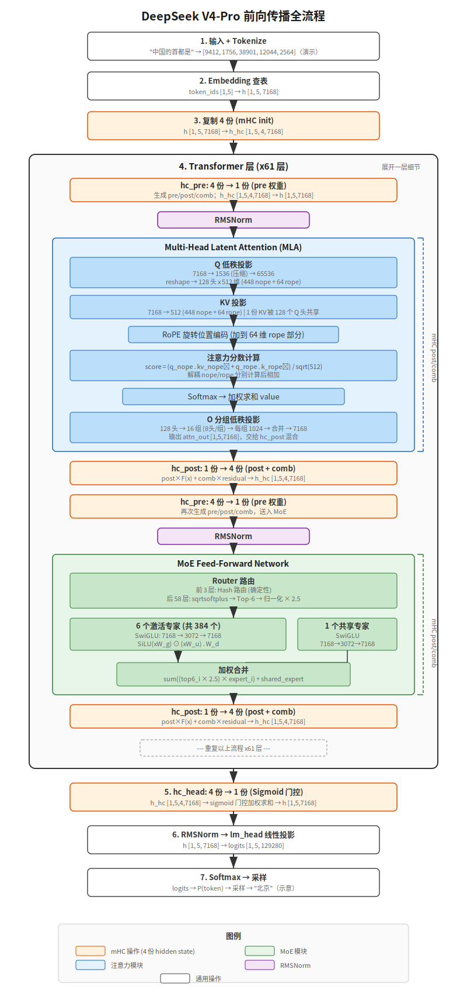

【一个token的旅程】Deepseek V4预测"中国的首都是"的全流程总复习

━━━━━━━━━━━━━━━━━━━━

◆ 今天干什么

━━━━━━━━━━━━━━━━━━━━

今天这篇是一个"总复习"——拿一句"中国的首都是"作为输入，一步一步走完 DeepSeek V4-Pro 的整条前向传播路径，从文字变成 token ID，到 embedding，到 61 层 Transformer，到最后 softmax 采样出"北京"。每一步都标维度变化，一个矩阵乘法都不漏。

先看一张全流程图，心里有个整体印象：



这篇会涉及我们之前讲过的很多零件。如果你对以下内容不太熟悉，建议先翻一翻对应的期数：

- **Transformer 基础** 第 26 期《Transformer 是怎么发明的？——回到深度学习的蛮荒时代@2016》（ https://mp.weixin.qq.com/s/4fyAAHOaETAg3y-j6xt1lw ）
- **位置编码（RoPE）** 第 39 期《Transformer 的位置编码：AI 怎么知道"谁先谁后"？》（ https://mp.weixin.qq.com/s/uSsGZDGLV2Z_Wkk_YbO9CQ ）
- **mHC（流形超连接）** 第 37 期《DeepSeek mHC：为什么"流形约束"是标题党》（ https://mp.weixin.qq.com/s/IMU__NKt_L41YeHKi7_A1g ）
- **MoE 基础** 第 33 期《DeepSeek MoE：671B 的噱头与 37B 的真相》（ https://mp.weixin.qq.com/s/SGAt3w3d1C3icAB3JbgDYw ）
- **MoE 与 FP4 Indexer** 第 158 期《Mega MoE 和 FP4 Indexer——V4 发布前的两记重拳》（ https://mp.weixin.qq.com/s/g4NH_rcXxx83pPrhN5OloQ ）
- **优化器（Muon）** 第 167 期《从 SGD、AdamW 到 DeepSeek V4 的 Muon》（ https://mp.weixin.qq.com/s/4RFiMwfiO5x1K_yIJnoqbg ）
- **投机解码** 第 132 期《大模型推理加速的最大公开秘密——你用的每个AI可能都在"作弊"》（ https://mp.weixin.qq.com/s/0eLtEaX8_dDD7l6OuKlAhg ）
- **注意力演化（MHA→CSA/HCA）** 第 168 期《MHA、MLA、DSA、CSA/HCA——从 V1 到 V4》（ https://mp.weixin.qq.com/s/YqcTnIrGKEYZ2n-sMAelKg ）

如果你正在准备面试，但读到中间某些部分发现不知所云——说明那个零件你还没搞清楚，赶紧查缺补漏。上面这些文章就是对应的补课材料。

好，开始走。

先把 V4-Pro 的关键参数摆出来，后面随时查：

| 参数 | 值 | 说明 |
|------|-----|------|
| 词表大小 | 129,280 | |
| 隐藏维度 | 7,168 | hidden_size |
| Transformer 层数 | 61 | |
| 注意力头数 | 128 | Q 头数 |
| KV 头数 | 1 | MLA，每个 token 只存 1 份 512 维 latent |
| Q 低秩 | 1,536 | q_lora_rank，7168→1536→65536 |
| KV latent 维度 | 512 | head_dim，其中 448 非 RoPE + 64 RoPE |
| RoPE 维度 | 64 | qk_rope_head_dim |
| O 低秩 | 1,024 | o_lora_rank，16 组 |
| 滑动窗口 | 128 | |
| mHC（流形超连接） | 4 份副本 | hc_mult = 4 |
| MoE 专家总数 | 384 | |
| 每 token 激活专家 | 6 | top-6 |
| 共享专家 | 1 | |
| 专家中间维度 | 3,072 | SwiGLU |
| MoE 打分函数 | sqrtsoftplus | sqrt(softplus(x)) |
| 前 3 层路由 | hash-based | token ID 直接映射 |
| 其余 58 层路由 | score-based | 打分选 top-6 |
| MTP 层 | 1 | compress_ratio = 0，纯滑动窗口 |

压缩注意力配置（61 层主干 + 1 层 MTP）：

```text
层 0:   ratio=128  HCA
层 1:   ratio=128  HCA
层 2:   ratio=4    CSA（带 Indexer）
层 3:   ratio=128  HCA
层 4:   ratio=4    CSA（带 Indexer）
...（CSA 和 HCA 交替）
层 60:  ratio=4    CSA（带 Indexer）
MTP:    ratio=0    纯滑动窗口
```

HCA = Highly Compressed Attention，128:1 粗压缩，全看。
CSA = Compressed Sparse Attention，4:1 细压缩，Indexer 选 top-1024。

━━━━━━━━━━━━━━━━━━━━

◆ Step 1: Tokenize——文字变 token ID

━━━━━━━━━━━━━━━━━━━━

输入："中国的首都是"

Tokenizer（V4 用的是 BPE 类 tokenizer，词表 129,280）。为了演示维度流动，下面假设 tokenizer 把这句话切成 5 个 token：

```text
"中国" → token_id = 9412
"的"   → token_id = 1756
"首"   → token_id = 38901
"都"   → token_id = 12044
"是"   → token_id = 2564
```

（切法和具体 ID 都是演示用的，真实 tokenizer 可能不同。重点是后面的维度怎么流动。）

输出：一个整数数组 `[9412, 1756, 38901, 12044, 2564]`，形状 `[1, 5]`（batch=1, seq_len=5）。

这一步纯查表，没有任何神经网络计算。

━━━━━━━━━━━━━━━━━━━━

◆ Step 2: Embedding——token ID 变向量

━━━━━━━━━━━━━━━━━━━━

模型有一张 embedding 表，形状 `[129280, 7168]`——词表里每个 token 对应一行 7168 维向量。

```text
输入:  token_ids [1, 5]
查表:  embedding_table [129280, 7168]
输出:  h [1, 5, 7168]
```

5 个 token ID 各自去 embedding 表里查到自己那一行，得到 5 个 7168 维向量。

这一步也是纯查表（不是矩阵乘法，是 index select）。

此时 `h` 的形状是 `[1, 5, 7168]`——batch=1，序列长度=5，每个 token 是 7168 维。

━━━━━━━━━━━━━━━━━━━━

◆ Step 3: 61 层 Transformer——核心计算

━━━━━━━━━━━━━━━━━━━━

从这里开始，5 个 token 要穿过 61 层 Transformer。每一层内部的流程完全一样，只是参数不同。

每一层做两件大事：**注意力** 和 **MoE FFN**。

但 V4 不用标准的残差连接（`output = input + layer(input)`）。它用 **mHC（manifold Hyper-Connections，流形约束超连接）**——我们在第 37 期专门讲过。mHC 同时维护 **4 份 hidden state 副本**，每件大事前后都有 mHC 的合并/展开操作。

一层的完整流程：

```text
[hc_pre]    4 份 → 1 份（送入注意力）
[RMSNorm]   归一化
[Attention]  注意力计算
[hc_post]   1 份 → 4 份（和残差组合）
[hc_pre]    4 份 → 1 份（送入 MoE）
[RMSNorm]   归一化
[MoE FFN]   混合专家前馈
[hc_post]   1 份 → 4 份（和残差组合）
```

下面拆开讲每一步。

━━━━━━━━━━━━━━━━━━━━

◆ 3.1 hc_pre: 4 份合并为 1 份

━━━━━━━━━━━━━━━━━━━━

进第一层注意力之前，先要把 `h [1, 5, 7168]` 复制成 4 份 `h_hc [1, 5, 4, 7168]`（batch=1，序列长度=5，4 份副本，每份 7168 维）——这是 mHC 要求的输入格式。然后 hc_pre 把 4 份合并回 1 份送入注意力。

源码里的 hc_pre 不是一个固定的残差加法，而是先根据当前 hidden state 动态算出一组混合权重：

```text
输入:  h_hc [1, 5, 4, 7168]
操作:
  先把 4 份展平: [x_1; x_2; x_3; x_4] → [1, 5, 28672]
  过一个线性层，生成 hc mixing 参数
  hc_split_sinkhorn(...) 把参数拆成 pre、post、comb

  pre  [1, 5, 4]       ← hc_pre 用的 4 个权重
  post [1, 5, 4]       ← hc_post 里 F(x) 注入 4 份副本的权重
  comb [1, 5, 4, 4]    ← hc_post 里旧 4 份残差互相混合的权重矩阵

  h = pre_1×x_1 + pre_2×x_2 + pre_3×x_3 + pre_4×x_4
输出:  h [1, 5, 7168]
```

**Sinkhorn 约束是 mHC 的核心**。`hc_split_sinkhorn` 通过 Sinkhorn 迭代把混合参数约束到稳定的范围里，让 4 条 hidden state 路径不是简单相加，而是受约束地动态混合。标准残差连接只有"原样保留 + 加上变化"两条路，mHC 同时维护 4 条路，每一层都可以重新决定这 4 条路怎么合并、怎么接收本层输出。

同时，原始的 `h_hc` 会保留为 `residual`——后面 hc_post 还要用它做残差。hc_pre 算出来的 `post` 和 `comb` 也会暂存下来，等注意力输出出来之后继续用。

第二层开始，h_hc 已经是 4 份了（上一层 hc_post 的输出），不需要再复制。

━━━━━━━━━━━━━━━━━━━━

◆ 3.2 RMSNorm

━━━━━━━━━━━━━━━━━━━━

```text
输入:  h [1, 5, 7168]
操作:  RMSNorm（均方根归一化，eps=1e-6）
       RMS = sqrt(mean(h²) + eps)
       h = h / RMS × γ        （γ 是可学习的缩放参数，7168 维）
输出:  h [1, 5, 7168]          （形状不变，数值归一化了）
```

RMSNorm 比 LayerNorm 简单——不减均值，只除均方根。效果差不多，速度快。

━━━━━━━━━━━━━━━━━━━━

◆ 3.3 注意力——重头戏

━━━━━━━━━━━━━━━━━━━━

注意力是整个 Transformer 最复杂的部分。V4 的注意力比标准注意力多了好几层嵌套：**Q 低秩投影、MLA 的 KV latent、RoPE、Compressor、Indexer、分组低秩 O 投影**。

一步一步来。

---

**3.3.1 Q 的低秩投影**

标准注意力直接把 hidden state 投影成 Q：`Q = h × W_q`。

V4 的 Q 有**低秩压缩**——不是一步到位，而是先压后展。为什么要这么做？算一笔账：

```text
不压缩：W_q [7168, 65536] = 4.70 亿参数
低秩分解：W_q_down [7168, 1536] + W_q_up [1536, 65536]
        = 0.11 亿 + 1.01 亿 = 1.12 亿参数
```

**一层省 3.58 亿参数，61 层省 218 亿参数。** W_q_down、W_q_up 和中间的 RMSNorm 参数（1536 维的 γ）都是实际存在的训练权重，每层各一套。两个矩阵不能合并成一个——因为中间夹了一个非线性的 RMSNorm。

具体四步：

```text
第一步：压缩
  h [1, 5, 7168] × W_q_down [7168, 1536] → q_latent [1, 5, 1536]

第二步：RMSNorm（learned，有可学习的 γ，1536 维）
  q_latent [1, 5, 1536] → q_latent [1, 5, 1536]   （归一化）

第三步：展开
  q_latent [1, 5, 1536] × W_q_up [1536, 128×512]
  → q_full [1, 5, 65536] → reshape → [1, 5, 128, 512]

第四步：逐头 RMSNorm（无参数，纯归一化）
  对每个头的 512 维做 RMSNorm：q = q / RMS(q)
  → [1, 5, 128, 512]（形状不变，每个头的 Q 向量被钉在单位球面上）
```

两个 RMSNorm 的分工不同：**第二步的 learned RMSNorm 夹在两个线性变换之间，防止矩阵合并（让瓶颈真正起作用）；第四步的无参数 RMSNorm 在展开之后，消除头间的模长差异，让 128 个头纯靠方向分化**。第四步也是 V4 能不用 QK-Clip 就稳定训练 Muon 优化器的关键——attention logits 的大小被归一化控制住了。

V4 的 128 个 Q 头，每个头的 Q 向量分两部分：

```text
- 非 RoPE 部分（nope）：448 维，用于内容相似度
- RoPE 部分（rope）：64 维，加上旋转位置编码
```

注意这里最容易算错：**`head_dim=512` 不是"512 维 + 64 维 RoPE"，而是每个头总共 512 维**，其中 64 维拿来做 RoPE，剩下 448 维做非 RoPE 内容匹配。

```text
W_q_up: [1536, 128 × 512] = [1536, 65536]
q_full: [1, 5, 65536] → reshape → [1, 5, 128, 512]
```

拆开：

```text
q_nope [1, 5, 128, 448]   ← 非位置编码部分
q_rope [1, 5, 128, 64]    ← 位置编码部分
```

---

**3.3.2 KV 的投影**

V4 的 KV 是 MLA 风格——**只投影出 1 份 512 维向量**，过一个 RMSNorm，然后末尾 64 维带 RoPE：

```text
h [1, 5, 7168] × W_kv [7168, 512] → kv [1, 5, 512]
→ RMSNorm（learned，有可学习的 γ，512 维）→ kv [1, 5, 512]
```

这个 RMSNorm 和 Q 侧第四步的无参数 RMSNorm 配合，一起控制 attention logits 的范围——Q 归一化了、KV 也归一化了，点积的数值就不会爆炸。这是 V4 能稳定使用 Muon 优化器、不需要 QK-Clip 的原因。

拆开：

```text
kv_nope [1, 5, 1, 448]   ← 非位置编码部分
k_rope  [1, 5, 1, 64]    ← RoPE key
```

注意：V4 和 V2/V3 都是把 7168 维压到 512 维，但路径不同。对比一下两代的矩阵分布：

```text
V2/V3 的 MLA（复杂度在 KV 侧，以 V3 为例，hidden_size=7168）：
  KV 侧：h [7168] × W_down [7168,512] → latent [512]（存这个）
          latent [512] × W_uk [512,128×128] → K [128头,128维/头]（推理时被吸收进 Q）
          latent [512] × W_uv [512,128×128] → V [128头,128维/头]（推理时被吸收进 W_o）
  Q 侧： h [7168] × W_q_down → q_latent → W_q_up → Q [128头,192维/头(128 nope+64 rope)]
          Q_nope [128,128] × W_ukᵀ [128,512] → Q' [128,512]（吸收了 W_uk，直接和 latent 点积）
  O 侧： W_uv [512,16384] × W_o [16384,7168] → W_o' [512,7168]（吸收了 W_uv）

V4 的 MLA（复杂度转移到 Q 侧和 O 侧）：
  KV 侧：h [7168] × W_kv [7168,512] → kv [512]（一个矩阵搞定）
  Q 侧： h [7168] × W_q_down [7168,1536] → [1536] → RMSNorm
          → × W_q_up [1536,65536] → Q [128头,512维/头]
  O 侧： 128头分16组(每组8头×512维=4096维) → 每组 W_o_down [4096,1024] → sum → W_o_up [1024,7168]
```

V2/V3 的 KV 侧有 W_down、W_uk、W_uv 三个矩阵（推理时 W_uk 和 W_uv 被吸收掉，168 期详细推导过）。V4 把 KV 侧简化成一个 W_kv，**复杂度转移到了 Q 侧（低秩 + RMSNorm）和 O 侧（分组低秩）**。

到这里 Q 和 KV 都讲完了，回头对比一下——**Q 的 1536 和 KV 的 512 是两个完全不同的压缩**，别搞混：

- **KV 的 512**：把 h 压成 512 维，**存进 KV cache**。目的是省存储——KV cache 要存几万条，越小越好。
- **Q 的 1536**：把 h 先压到 1536 维再展开到 65536 维，是**矩阵分解的中间过渡**。目的是省参数——Q 用完就丢不需要存，但 W_q 矩阵太大，拆成两个小矩阵省参数。1536 这个中间值不会被存下来。

**一个压存储，一个压参数。**

最终的格局是：**Q 有 128 头各 512 维（共 65536 维），KV 只有 1 份 512 维，128 个 Q 头共享这 1 份 KV。** 存储结构上和 MQA（Multi-Query Attention）一样——都是 1 份 KV 被所有 Q 头共享。MQA 当年掉精度，是因为只砍了 KV 其他不动，Q 查的东西变穷了。MLA 的做法不同——**Q 侧和 KV 侧的投影机制都重新设计了**：

- **Q 侧**：从直接投影（`h × W_q`）换成低秩分解 + RMSNorm（7168→1536→归一化→65536），128 个头的区分度更高
- **KV 侧**：从直接存 K 和 V 两份，换成只存 1 份 512 维的压缩向量，K 和 V 的信息融合在一起

**不是在 MQA 基础上打补丁，是整套注意力投影重新设计了，只是最终的存储形式碰巧和 MQA 一样——1 份 KV。**

---

**3.3.2.1 V2/V3 MLA 为什么不掉精度（对比 MQA）**

先把 MHA、MQA、V2/V3 MLA 三者的 KV 投影摆在一起对比：

```text
MHA（原版，128 头各自独立）：
  h [7168] × W_k [7168, 16384] → K [128头, 128维/头]    128 份 K
  h [7168] × W_v [7168, 16384] → V [128头, 128维/头]    128 份 V
  存储：128 份 K + 128 份 V = 256 份向量

MQA（砍到 1 份）：
  h [7168] × W_k [7168, 128] → K [1份, 128维]           1 份 K
  h [7168] × W_v [7168, 128] → V [1份, 128维]           1 份 V
  存储：1 份 K + 1 份 V = 2 份向量
  代价：W_k/W_v 从 [7168,16384] 缩到 [7168,128]，表达力砍了 128 倍

V2/V3 MLA（存 1 份 latent，但保留完整投影）：
  h [7168] × W_down [7168, 512] → latent [512]           存这 1 份
  latent [512] × W_uk [512, 16384] → K [128头, 128维/头] 可以展开成 128 份
  latent [512] × W_uv [512, 16384] → V [128头, 128维/头] 可以展开成 128 份
  存储：只存 1 份 512 维 latent
  但推理时 W_uk 被吸收进 Q'、W_uv 被吸收进 W_o'，不需要显式展开
```

关键区别一目了然：

- **MQA** 砍了 W_k/W_v 的大小（`[7168,16384]` → `[7168,128]`），**投影矩阵本身变穷了**，128 个 Q 头查的是一份表达力不足的 KV
- **V2/V3 MLA** 没有丢弃完整的 W_k 和 W_v——它们只是换了个名字叫 W_uk 和 W_uv（`[512, 16384]`），本质上还是完整的 K/V 投影矩阵，只是从 latent 出发而不是从 h 出发。数学上等价于 128 份完整 K/V（168 期详细推导过）

**V2/V3 MLA 赢 MQA 靠的是：存储砍到 1 份 latent，但保留了完整的 K/V 投影矩阵（W_uk/W_uv），表达力没砍。** MQA 是连投影矩阵都砍了。

---

**3.3.2.2 V4 砍掉了 W_uk/W_uv，为什么还不掉精度（对比 V2/V3）**

V4 把 KV 侧简化到极致——砍掉了 W_uk 和 W_uv，`h × W_kv → kv [512]` 一步搞定。这意味着 KV 侧真的只有 1 份 512 维，不再等价于 128 份。**V4 的 KV 侧在存储和表达力上都和 MQA 一样了。**

那 V4 怎么补回精度？**靠 Q 侧的重新设计**——低秩分解 + RMSNorm。这是 V2/V3 没有的。

V4 的 Q 投影（7168→1536→RMSNorm→65536→逐头RMSNorm）比 V2/V3 的直接投影（7168→16384）参数少了 76%，但效果反而更好。答案藏在四个几何操作的组合里：**瓶颈压缩 + 球面归一化 + 放射展开 + 逐头球面归一化**。

**第一步：1536 维瓶颈——去噪，只保留查询意图。**

7168 维的 h 里什么都有——语义、位置、噪声、计算脚手架。W_q_down 强制把信息压到 1536 维，逼模型回答一个问题：**"这个 token 的核心查询意图是什么？"** 和查询无关的维度被丢掉。

这里有一个关键的数学事实：如果 h 中和"查询意图"有关的信息的**内在维度本来就小于 1536**（实测表明大模型隐藏状态的有效维度通常只占总维度的个位数百分比），那这个瓶颈几乎是无损的——丢的全是噪声。

**第二步：RMSNorm——钉在球面上，消除长度作弊。**

RMSNorm 把 1536 维向量归一化到单位球面上：**消除长度差异，只保留方向。**

为什么这一步不能省？两个原因：

1. **防止长度作弊。** 没有归一化时，不同头可以靠 h 的模长偷懒——"输入向量长的时候激活 A 模式，短的时候激活 B 模式"。这不是真正的语义分化，是长度作弊。RMSNorm 切断了这条路，头只能靠方向分化。

2. **防止瓶颈白设。** 没有 RMSNorm，W_q_down × W_q_up 是两个线性变换的连乘，数学上可以合并成一个矩阵，等价于直接投影——瓶颈就白设了。**RMSNorm 是那道非线性的门槛**，它让"压过再展开"不可逆地不同于"直接投影"。

**第三步：W_q_up 从球面展开 128 个头。**

128 个头从同一个归一化球面上出发，各自通过 W_q_up 的不同行投影到 512 维子空间。

**第四步：逐头 RMSNorm——把每个头的 Q 钉回球面。**

展开之后，每个头的 512 维 Q 向量再做一次无参数的 RMSNorm（只除均方根，没有可学习的 γ）。这一步消除展开后头间的模长差异，让 128 个头纯靠方向分化。同时，Q 和 KV 都被归一化了，attention 点积的数值范围被控制住——这是 V4 能稳定使用 Muon 优化器的关键。

这和 V2/V3 的"128 个头各自从原始 h 直接投影"有区别：

```text
V2/V3：128 个头各自从 7168 维原始空间出发，独立找方向
       → 自由度高，但容易冗余（多个头学到相同方向）
       → 靠 W_uk/W_uv 在 KV 侧补表达力

V4：   128 个头从同一个归一化球面出发，各自展开，再钉回球面
       → 共享坐标系，头间差异是纯粹的方向差异
       → KV 侧不补了，全靠 Q 侧的有组织分化
```

用一个比喻来说：V2/V3 像 128 个人各自写搜索词，然后靠资料库侧的丰富索引（W_uk/W_uv）来弥补搜索词的混乱。**V4 像先开一个选题会**——先把原始笔记压成一个共同判断"这一步我们到底要查什么"，然后 128 个人基于这个共同判断，各自换角度写搜索词：有人查实体，有人查语法，有人查长程指代，有人查局部搭配。资料库的索引简化了（只有 W_kv），但搜索词更精准了。

**V2/V3 的策略是"穷搜索词 + 富资料库索引"，V4 的策略是"精准搜索词 + 简单资料库"。** V4 砍掉了 KV 侧的复杂度，把表达力的担子全交给 Q 侧——先共识再分化，减少的不是自由度，是无效自由度。

---

**3.3.3 RoPE（旋转位置编码）**

Q 和 K 的 RoPE 部分（各 64 维）要加上位置信息：

```text
q_rope [1, 5, 128, 64] × RoPE(position_ids, theta=10000, YaRN scaling)
→ q_rope [1, 5, 128, 64]

k_rope [1, 5, 1, 64] × RoPE(position_ids, theta=10000, YaRN scaling)
→ k_rope [1, 5, 1, 64]
```

RoPE 把位置信息编码成旋转角度，乘到 Q 和 K 上。**位置越远，旋转角度差越大，点积越小**——这就是"距离越远相关性越低"的位置先验。

YaRN（Yet another RoPE extensioN）是长上下文的 RoPE 扩展方案，factor=16，让模型能处理 **1M token** 的超长上下文（base 65536 位置 × 16 = 1048576）。简单说就是把 RoPE 的旋转频率拉伸，让原本只能编码 65K 位置的角度表覆盖到 1M 位置，同时通过分频段调整（高频不动、低频拉伸）尽量保持短距离的精度不丢。

---

**3.3.4 关键判断：Compressor 能用吗？**

到这里，5 个 token 各自都有了 Q 和 KV。接下来该做注意力计算了。但 V4 的注意力不是直接 Q×K——正常流程要先过 Compressor 把多条 KV 压缩。

但我们只有 5 个 token：

```text
HCA 层（ratio=128）：需要 128 个 token 才能凑满一个块。5 < 128，凑不满。
CSA 层（ratio=4）：  需要 4 个 token 才能凑满一个块。5 个 token 能凑 1 个块，剩 1 个。
```

**5 个 token 太短了。** HCA 层完全凑不满一个压缩块。CSA 层能凑出 1 个压缩块，但它只是一条额外摘要，真正的信息主体仍然在滑动窗口里的原始 KV。

滑动窗口大小是 128。我们只有 5 个 token，5 < 128，所以**全部 5 个 token 都在滑动窗口范围内，每个 token 都能直接看到原始 KV**。

```text
HCA 层：全走滑动窗口（5 < 128，没有任何压缩块）
CSA 层：有 1 个压缩块（token 1~4 压成 1 条），但 5 个原始 token 也都在滑动窗口内
         Indexer 没什么可选，因为候选压缩块太少
```

**对我们这 5 个 token 来说，V4 的注意力行为接近标准的因果注意力。** CSA/HCA/Indexer 这些机制真正是为长上下文设计的——后面"如果输入是 5 万个 token"那节会展开讲。5 个 token 的上下文不需要"压缩"——全看就行了，也看得起。

---

**3.3.5 注意力计算（短输入：滑动窗口）**

我们的 5 个 token 全在滑动窗口内（5 < 128），所以这里走的是**标准因果注意力**——不压缩，不选 top-k，每个 token 直接看前面所有 token 的原始 KV。

长输入时 CSA/HCA 怎么压缩、Indexer 怎么选 top-k，后面"如果输入是 5 万个 token"那节会讲，这里先把注意力计算本身走完。

注意维度的切换：**前面 3.3.1 和 3.3.2 做的投影，本质是从 7168 维的"高速公路"下匝道，进入 512 维的"注意力服务区"。** 接下来所有的点积、softmax、加权求和都在 512 维里算。算完之后 3.3.6 的 O 投影再把结果送回 7168 维的高速。

```text
高速（7168 维）→ Q/KV 投影下匝道 → 注意力在 512 维里算
→ 128 个头各自 512 维，并行计算 → O 投影上匝道 → 高速（7168 维）
```

顺便对比一下 V2/V3 和 V4 在注意力计算时的维度差异：

```text
V2/V3：score = q_nope[128头,128维] × K_nope[128头,128维]ᵀ
             + q_rope[128头,64维]  × K_rope[128头,64维]ᵀ
       每头点积在 128+64=192 维上算，128 个头各自查各自的 K/V（128 份）

V4：   score = q_nope[128头,448维] × kv_nope[1头,448维]ᵀ
             + q_rope[128头,64维]  × k_rope[1头,64维]ᵀ
       每头点积在 448+64=512 维上算，128 个头共享同 1 份 KV
```

**V4 单头更宽（512 vs 192），但 KV 从 128 份变成 1 份。** 用更宽的匝道补偿更少的资料库——这就是 3.3.2.2 讲的"V4 把表达力的担子从 KV 侧转移到 Q 侧"在维度上的体现。

```text
Q: [1, 5, 128, 512]  拆成 q_nope [1, 5, 128, 448] 和 q_rope [1, 5, 128, 64]
K/V: [1, 5, 1, 512]  拆成 kv_nope [1, 5, 1, 448] 和 k_rope [1, 5, 1, 64]
```

为什么一个叫 **kv**_nope 一个叫 **k**_rope？因为 448 维那部分是 K 和 V 共享的（MLA 的 latent 里 K/V 融合在一起），64 维那部分只有 K 用（RoPE 只加在 K 上，V 不需要位置信息）。算分数时分开算，加权求和时用完整的 512 维。

**先算相似度分数。** 和传统 Transformer 不同，V4 的分数由**两部分分开算再加起来**——非 RoPE 部分和 RoPE 部分：

为什么要分开算？传统 Transformer 的 K 和 V 是分开存的，RoPE 只旋转 K，不影响 V。但 MLA 把 K 和 V 融合在同一份 512 维 latent 里——如果直接对整个 latent 做 RoPE 旋转，V 的信息也会被搅乱。所以 V4（从 V2 开始就这么设计）把 RoPE 部分（64 维）单独拎出来，和内容部分（448 维）各算各的分数，最后加起来。**这是 MLA 把 K/V 融合成 1 份 latent 带来的设计约束。**

```text
score_nope = q_nope × kv_nopeᵀ
  [1, 128, 5, 448] × [1, 1, 448, 5] → [1, 128, 5, 5]
  （128 个 Q 头，每个都和同 1 份 KV 内容向量做点积）

score_rope = q_rope × k_ropeᵀ
  [1, 128, 5, 64] × [1, 1, 64, 5] → [1, 128, 5, 5]
  （128 个 Q 头的 RoPE 部分，和 1 份 k_rope 做点积）

score = (score_nope + score_rope) / √512
  → [1, 128, 5, 5]
```

**加上因果掩码（causal mask）**——每个 token 只能看自己和前面的 token：

```text
         t1   t2   t3   t4   t5
t1       ✓    -    -    -    -
t2       ✓    ✓    -    -    -
t3       ✓    ✓    ✓    -    -
t4       ✓    ✓    ✓    ✓    -
t5       ✓    ✓    ✓    ✓    ✓
```

`-` 的位置设为负无穷，softmax 后变成 0。

```text
attn_weights = softmax(score + causal_mask)
  → [1, 128, 5, 5]   每行加起来 = 1
```

**加权求和**得到注意力输出：

```text
attn_output = attn_weights × KV
  [1, 128, 5, 5] × [1, 1, 5, 512] → [1, 128, 5, 512]
```

128 个头，每个头输出 512 维。到这里注意力计算完成，5 个 token 各自得到了"看完上下文之后"的新表示。

---

**3.3.6 O 的分组低秩投影**

标准 Transformer 用一个大矩阵 W_o 把多头输出拼接后投影回 hidden_size：

```text
标准：[1, 5, 128×512] × W_o [65536, 7168] → [1, 5, 7168]
```

V4 用**分组低秩投影**：128 个头分成 16 组，每组 8 个头。每组先压到 1024 维，16 组共享同一个展开矩阵：

```text
第一步：128 头分 16 组，每组 8 头 × 512 维 = 4096 维
  attn_output reshape → [1, 5, 16, 4096]

第二步：每组压缩
  每组 [1, 5, 4096] × W_o_down_group [4096, 1024] → [1, 5, 1024]
  16 组各有自己的 W_o_down（16 个不同的 [4096, 1024] 矩阵）
  输出 [1, 5, 16, 1024]

第三步：16 组加起来
  [1, 5, 16, 1024] → sum(dim=2) → [1, 5, 1024]

第四步：展开回 hidden_size
  [1, 5, 1024] × W_o_up [1024, 7168] → [1, 5, 7168]
```

注意力输出：**`[1, 5, 7168]`**。

**为什么 O 也要低秩？** 和 Q 同理——省参数。65536×7168 ≈ 4.7 亿参数，分组低秩压到约 7400 万参数。

━━━━━━━━━━━━━━━━━━━━

◆ 3.4 hc_post: 1 份变回 4 份

━━━━━━━━━━━━━━━━━━━━

注意力输出是 1 份 `[1, 5, 7168]`，要展开回 4 份，和之前保留的残差组合。

还记得 hc_pre 同时算出来的 `post` 和 `comb` 吗？hc_post 用的就是它们：

```text
输入:
  attn_out [1, 5, 7168]          ← 注意力输出（1 份，记为 F(x)）
  H_residual [1, 5, 4, 7168]     ← hc_pre 之前保留的 4 份残差

操作:
  y_j = post_j × F(x) + Σ_i comb_{j,i} × x_i
  j = 1..4，i = 1..4

  post [1, 5, 4]       决定注意力输出 F(x) 注入每一份新副本的比例
  comb [1, 5, 4, 4]    决定旧 4 份残差之间怎么互相混合

输出:  h_hc [1, 5, 4, 7168]     （更新后的 4 份 hidden state）
```

注意这里**不是把 F(x) 切成 4 份塞进去**。每份新的 x_j 都是 F(x) 和旧 x_1~x_4 的**加权混合**，维度还是 7168：

```text
新 x_1 = post_1×F(x) + comb_11×旧x_1 + comb_12×旧x_2 + comb_13×旧x_3 + comb_14×旧x_4
新 x_2 = post_2×F(x) + comb_21×旧x_1 + comb_22×旧x_2 + comb_23×旧x_3 + comb_24×旧x_4
新 x_3 = post_3×F(x) + comb_31×旧x_1 + comb_32×旧x_2 + comb_33×旧x_3 + comb_34×旧x_4
新 x_4 = post_4×F(x) + comb_41×旧x_1 + comb_42×旧x_2 + comb_43×旧x_3 + comb_44×旧x_4
```

`post_j` 和 `comb_ji` 都是标量权重。比如模型可能学到：新 x_1 主要保留旧 x_1，加一点注意力输出；新 x_2 则主要接收注意力输出。**不是切 7168 维，是每份 7168 维各自从"本层输出 + 旧 4 条残差路径"里按不同比例混合。**

这就是 mHC 比标准残差连接灵活的地方：标准残差是 `h = h + attn_out`，mHC 是 **4 条残差路径 + 本层输出的动态混合**。每个 token、每一层都可以学到不同的混合方式。

━━━━━━━━━━━━━━━━━━━━

◆ 3.5 hc_pre + RMSNorm（第二次，送入 MoE）

━━━━━━━━━━━━━━━━━━━━

和 3.1、3.2 完全相同的流程：

```text
h_hc [1, 5, 4, 7168] → hc_pre → h [1, 5, 7168] → RMSNorm → h [1, 5, 7168]
```

4 份合并成 1 份，归一化，准备送入 MoE FFN。

━━━━━━━━━━━━━━━━━━━━

◆ 3.6 MoE FFN——384 个专家选 6 个

━━━━━━━━━━━━━━━━━━━━

V4-Pro 的**所有 61 层都是 MoE**（Mixture of Experts），没有 dense 层。

MoE 做的事：**每个 token 从 384 个专家里选 6 个来处理，再加上 1 个所有 token 共享的专家。**

但前 3 层和后 58 层的选法不同。

---

**3.6.1 前 3 层：hash-based routing**

前 3 层用 hash 路由——不打分，直接用 token ID 决定激活哪些专家：

```text
expert_indices = hash(token_id) % 384  →  选出 6 个专家
```

具体的 hash 映射是预定义的查找表。每个 token ID 对应固定的 6 个专家——**同一个 token 不管出现在哪个位置、什么上下文里，前 3 层激活的专家都一样。**

为什么前 3 层用 hash？前几层的 hidden state 还没有足够的语义信息（刚从 embedding 出来），用打分来选专家效果不好——分数噪声太大。Hash 路由虽然粗暴，但保证了负载均衡，避免了"所有 token 都涌向同一个专家"的崩溃问题。

---

**3.6.2 后 58 层：score-based routing**

第 4 层开始用正经的打分路由：

```text
第一步：算分数
  h [1, 5, 7168] × W_gate [7168, 384] → scores [1, 5, 384]

第二步：打分函数 sqrtsoftplus
  scores = sqrt(softplus(scores))
  其中 softplus(x) = log(1 + exp(x))
  sqrtsoftplus 比 softmax 更平滑，避免 winner-take-all

第三步：选 top-6
  从 384 个分数里选最大的 6 个
  top6_indices [1, 5, 6]     ← 选中的专家编号
  top6_scores  [1, 5, 6]     ← 对应的分数

第四步：先做临时归一化
  weights = top6_scores / sum(top6_scores)   ← 此时 6 个权重加起来 = 1

第五步：路由权重整体放大
  weights = weights × routed_scaling_factor
  V4-Pro 的 routed_scaling_factor = 2.5
```

也就是说，top-6 的相对比例先归一化，但最后还会整体乘 2.5。这个放大系数来自 config.json，是 MoE 输出强度的一部分。

---

**3.6.3 专家内部：SwiGLU FFN**

每个被选中的专家是一个标准的 SwiGLU FFN：

```text
输入:  x [1, 1, 7168]   （一个 token 的 hidden state）

gate = x × W1 [7168, 3072]  → [1, 1, 3072]    ← gate 分支
up   = x × W3 [7168, 3072]  → [1, 1, 3072]    ← up 分支
gate = clamp(gate, max=10.0)                    ← gate 只截上界
up   = clamp(up, -10.0, 10.0)                  ← up 截上下界
hidden = SiLU(gate) * up                        ← 逐元素相乘
down = hidden × W2 [3072, 7168] → [1, 1, 7168] ← 投影回来
```

SwiGLU 的核心是 `SiLU(gate) * up`——gate 分支过激活函数做"开关"，up 分支提供"内容"，逐元素相乘。哪些维度被 gate "打开"了，对应维度的 up 值就通过；gate 关闭的维度输出接近 0。

上面 clamp 里的 10.0 来自 config.json 里的 `swiglu_limit` 参数（SwiGLU + limit，即"SwiGLU 的截断阈值"）。这是工程保护——在相乘之前限制 gate 和 up 的范围，防止 FP4 量化时中间值溢出。

注意 V4 单个专家的中间维度 3072 比 hidden_size 7168 **还小**——这和传统 dense FFN（中间维度通常是 hidden_size 的 4 倍 = 28672）很不一样。MoE 的思路不是"一个大 FFN 拆成小块"，而是**总量远超 dense，但每个 token 只激活一部分**。V4 每个 token 走 6 个路由专家 + 1 个共享专家 = 7 个 FFN，有效中间维度 3072 × 7 = 21504，和传统 dense FFN 的 28672 在同一量级。单个专家可以很窄，靠数量取胜。

**专家权重 FP4 量化**：每个专家的 W1、W2、W3 都以 FP4 存储和计算。384 个专家 × 3 个矩阵 × 7168 × 3072 = 超过 250 亿参数，FP4 比 FP16 省 4 倍存储。

---

**3.6.4 共享专家**

除了 6 个路由专家，还有 **1 个共享专家**。结构和路由专家完全一样（SwiGLU，7168→3072→7168），但**每个 token 都会过它**，不需要路由。

```text
shared_output = SharedExpert(h)   ← 每个 token 都算
```

---

**3.6.5 合并**

```text
moe_output = shared_output + Σ(weight_i × expert_i_output)   （i = 1..6）
  → [1, 5, 7168]
```

这里的 weight_i 就是 3.6.2 里 router 算出的路由权重：先在 top-6 内部归一化，再整体乘以 2.5。共享专家不带路由权重，直接加上去。

━━━━━━━━━━━━━━━━━━━━

◆ 3.7 hc_post（第二次）+ 一层结束

━━━━━━━━━━━━━━━━━━━━

和 3.4 一样，MoE 输出从 1 份展开回 4 份，和残差组合：

```text
moe_out [1, 5, 7168] → 展开 + 残差组合 → h_hc [1, 5, 4, 7168]
```

**一层 Transformer 到此结束。** 我们的 5 个 token 刚走完第 1 层，还有 60 层要走。上面 3.1 到 3.7 的全部流程重复 61 次。

每一层的区别：
- **注意力类型交替**：层 0、1 是 HCA（ratio=128），层 2 是 CSA（ratio=4），层 3 是 HCA……交替进行。但对我们这 5 个 token 来说，HCA 和 CSA 都退化为滑动窗口，实际行为相同
- **前 3 层 MoE 用 hash routing**（token ID 决定专家，和上下文无关），后 58 层用 score routing（根据 hidden state 打分选专家）
- 每一层有自己独立的权重参数（W_q_down、W_q_up、W_kv、W_o_down、W_o_up、W_gate、384 个专家的 W1/W2/W3、mHC 的 W 矩阵……）

61 层跑完，5 个 token 的 `h_hc` 形状还是 `[1, 5, 4, 7168]`——形状没变，但数值经过 61 层注意力和 MoE 的反复加工，已经编码了"中国的首都是"这句话的全部语义信息。

━━━━━━━━━━━━━━━━━━━━

◆ Step 4: hc_head——4 份合并回 1 份

━━━━━━━━━━━━━━━━━━━━

61 层全部跑完，最终输出还是 4 份。现在要合并回 1 份，准备做 token 预测。

```text
输入:  h_hc [1, 5, 4, 7168]
操作:  hc_head — 用 sigmoid 门控加权合并
       gate = sigmoid(h_hc × W_gate)      ← 学习哪些维度重要
       h = Σ(gate_i × h_hc_i)             ← 4 份加权合并
输出:  h [1, 5, 7168]
```

这一步和 hc_pre 不同——hc_pre 用的是线性加权，hc_head 用 **sigmoid 做非线性门控**，表达力更强。hc_pre 是层内中间步骤（要过 61 遍，速度敏感），hc_head 只跑一次（最终输出，精度敏感）。

━━━━━━━━━━━━━━━━━━━━

◆ Step 5: RMSNorm → lm_head → logits

━━━━━━━━━━━━━━━━━━━━

```text
第一步：最终 RMSNorm
  h [1, 5, 7168] → RMSNorm → h [1, 5, 7168]

第二步：lm_head 投影到词表
  取最后一个 token 的 h: [1, 7168] × W_lm_head [7168, 129280] → logits_last [1, 129280]
```

V4 的 config 里有一项 `tie_word_embeddings = false`（tie = 绑定，word_embeddings = 词向量表），意思是**输入的 embedding 表和输出的 lm_head 不共享权重**。模型有两张 `[129280, 7168]` 的大表：一张负责输入（token ID → 向量），一张负责输出（向量 → token 概率）。不共享的好处是输入和输出可以学到不同的表示空间。

我们要预测的是"是"后面跟什么。所以只需要第 5 个 token（"是"）的 hidden state——它经过 61 层 Transformer 已经"看过"了前面所有 token，它的 hidden state 里编码了"中国的首都是"的全部上下文信息。把这个 hidden state 过 lm_head，投影出来的 129280 个分数就是**下一个 token（第 6 个）的概率分布**。

```text
logits_last [129280]   ← "是"之后每个候选 token 的分数
```

━━━━━━━━━━━━━━━━━━━━

◆ Step 6: softmax → 采样 → "北京"

━━━━━━━━━━━━━━━━━━━━

```text
第一步：temperature 缩放
  logits_last = logits_last / temperature    （temperature 通常 0.6~1.0）

第二步：softmax
  probs = softmax(logits_last)   → [129280]
  每个位置的值 ∈ (0, 1)，所有值加起来 = 1
  这就是"每个 token 被选中的概率"

第三步：采样
  如果 temperature=0（贪心）：直接选概率最大的
  如果 temperature>0：按概率分布随机采样（可能用 top-p/top-k 截断）
```

对于"中国的首都是"这个输入，"北京"对应的 token 概率通常会非常高。只要采样参数不是故意调得很发散，输出大概率就是"北京"。

```text
输出:  token_id = 58832   →  "北京"   （ID 示意）
```

**一个 token 的完整旅程到此结束。**

━━━━━━━━━━━━━━━━━━━━

◆ 补充：MTP（Multi-Token Prediction）

━━━━━━━━━━━━━━━━━━━━

V4 在 61 层主干之后还有一个 **MTP 层**（num_nextn_predict_layers = 1），用于同时预测"下一个 token"和"下下一个 token"。

```text
MTP 层的配置:
  compress_ratio = 0     ← 不压缩，纯滑动窗口
  滑动窗口 = 128
  共享主模型的 embedding 和 lm_head 权重
```

MTP 不是"跑两遍主干"——它是**一次前向传播同时输出两个预测**：

```text
训练时（第 6 个 token 已知）：
  主头：第 5 个 token 的 h → 预测第 6 个 token（"北京"）
  MTP 头：第 5 个 token 的 h + 第 6 个 token 的 embedding → 过 1 层 MTP block → 预测第 7 个 token
  两个 loss 加起来训练，迫使主干学到更有前瞻性的表示
```

V4 的 `num_nextn_predict_layers = 1`，只多预测 1 个 token。**这主要是训练辅助**——额外的 loss 信号让 61 层主干学得更好。开源 `inference/model.py` 的主 `forward()` 只返回主干 logits，没有调用 MTP 分支；MTP 是否参与推理加速，要看具体部署策略。投机解码（第 132 期讲过）需要一口气猜多个 token 再批量验证才有明显加速效果——只多猜 1 个再验证 1 个，收益很有限。

MTP 层的 compress_ratio=0 意味着它不做任何 KV 压缩，只看最近 128 个 token 的原始 KV。这很合理——MTP 做的是末尾预测，不需要回看百万上下文。前面 61 层已经把长上下文信息揉进 hidden state 了。

━━━━━━━━━━━━━━━━━━━━

◆ 全流程维度变化总览

━━━━━━━━━━━━━━━━━━━━

把整条路径的维度变化摆出来：

```text
输入: "中国的首都是"
     ↓ Tokenize
token_ids [1, 5]
     ↓ Embedding
h [1, 5, 7168]
     ↓ 复制 4 份
h_hc [1, 5, 4, 7168]

━━ 第 L 层 Transformer（L = 0, 1, ..., 60）━━

     ↓ hc_pre: 4→1
h [1, 5, 7168]
     ↓ RMSNorm
h [1, 5, 7168]
     ↓ Q 低秩投影: 7168 → 1536 → RMSNorm → 65536 → 逐头RMSNorm, reshape
q_nope [1, 5, 128, 448], q_rope [1, 5, 128, 64]
     ↓ KV 投影: 7168 → 512 → RMSNorm
kv_nope [1, 5, 1, 448], k_rope [1, 5, 1, 64]
     ↓ RoPE
q_rope, k_rope 旋转（形状不变）
     ↓ 注意力计算（短输入主要由滑动窗口主导）
score [1, 128, 5, 5] → softmax → attn_output [1, 128, 5, 512]
     ↓ O 分组低秩: 128头→16组→sum→1024→7168
attn_out [1, 5, 7168]
     ↓ hc_post: 1→4 + 残差
h_hc [1, 5, 4, 7168]
     ↓ hc_pre: 4→1
h [1, 5, 7168]
     ↓ RMSNorm
h [1, 5, 7168]
     ↓ MoE: router 选 top-6, 每个专家 7168→3072→7168, 加权合并
moe_out [1, 5, 7168]
     ↓ hc_post: 1→4 + 残差
h_hc [1, 5, 4, 7168]

━━ 重复 61 层 ━━

     ↓ hc_head: 4→1（sigmoid 门控）
h [1, 5, 7168]
     ↓ RMSNorm
h [1, 5, 7168]
     ↓ lm_head: 7168 → 129280
logits_last [129280]
     ↓ softmax
probs [129280]
     ↓ 采样
token_id → "北京"
```

━━━━━━━━━━━━━━━━━━━━

◆ 如果输入不是 5 个 token 而是 5 万个呢？

━━━━━━━━━━━━━━━━━━━━

上面全程走的是短输入，CSA/HCA 几乎没用上。如果输入是 50000 个 token（比如一本小说），情况就完全不同了。

**Compressor 怎么"把多条压成一条"？**

不管 CSA 还是 HCA，压缩用的是同一个 Compressor 模块——**学习的加权平均**：

```text
每 m 条 KV（CSA m=4，HCA m=128）：
  1. 每条 KV 投影出一个"重要度分数"
  2. m 个分数过 softmax 归一化（加起来=1）
  3. 用这些权重对 m 条 KV 加权求和 → 1 条压缩 KV
```

所谓"加权求和"就是最朴素的乘系数再加起来，以 CSA（m=4）为例：

```text
4 条 KV：kv_1, kv_2, kv_3, kv_4（每条 512 维）
4 个权重：w_1=0.1, w_2=0.6, w_3=0.2, w_4=0.1（softmax 归一化，加起来=1）

压缩后 = 0.1×kv_1 + 0.6×kv_2 + 0.2×kv_3 + 0.1×kv_4 → 1 条 512 维
```

哪条 KV 权重高，是模型训练学出来的（每条 KV 过一个投影算出重要度分数，再 softmax 归一化成权重）。压缩后的 1 条是原始 4 条的"智能摘要"，不是简单的取平均或降采样。CSA（m=4）还用了**重叠压缩**——每个块同时看自己的 4 条和前一个块的 4 条，防止块边界切断语义。HCA（m=128）块足够大，不需要重叠。

这些细节在第 168 期有完整讲解。

**长输入时 CSA 和 HCA 怎么分工？**

```text
HCA 层（ratio=128）：
  50000 / 128 = 390 个压缩块（每块 128 token 压成 1 条）
  + 最近 128 个 token 走滑动窗口
  注意力看 390 + 128 = 518 条 KV
  （不带 Indexer，全看——390 条已经很少了）

CSA 层（ratio=4）：
  50000 / 4 = 12500 个压缩块（每块 4 token 压成 1 条）
  12500 条还是太多 → Lightning Indexer 从中选 top-1024
  + 最近 128 个 token 走滑动窗口
  注意力看 1024 + 128 = 1152 条 KV

标准注意力（没有压缩）：
  注意力看 50000 条 KV
```

**Lightning Indexer** 是 CSA 层专用的"选 top-k"模块——有自己独立的 Q/K 投影（和主路径不共享），全程 FP4 精度，只负责打分排序："这 12500 条压缩 KV 里，和当前 query 最相关的 1024 条是哪些？"选完之后，主路径只在这 1024 条上做注意力计算。

差距出来了：

```text
标准注意力: 50000 条
HCA:       518 条    （省 99%）
CSA:       1152 条   （省 97.7%）
```

**这就是 V4 的长上下文优势。** 不是"看得少"，而是"先压缩再看"——HCA 用 128:1 的粗摘要扫全局，CSA 用 4:1 的细摘要选重点，滑动窗口保住最近的上下文。三种粒度交替，每过两层模型既扫了全局又精挑了细节。

━━━━━━━━━━━━━━━━━━━━

◆ 总结

━━━━━━━━━━━━━━━━━━━━

今天走完了一个 token 从输入到输出的每一步，维度变化、矩阵乘法，一个不漏。但走完全程之后，最让我意外的不是某个具体模块，而是一个反直觉的事实：

**对于 5 个 token 的短输入，V4-Pro 的 CSA/HCA、Lightning Indexer、Compressor——这些花了整篇论文讲的长上下文注意力创新，几乎都发挥不出优势。**

5 个 token 走完 61 层，注意力基本由滑动窗口内的原始 KV 主导，HCA 没有压缩块，CSA 最多多出 1 条摘要，远远谈不上长上下文稀疏检索。MoE 前 3 层是 hash routing——token ID 决定一切，连打分都不用。mHC 的 4 份副本在工作，但对 5 个 token 的微小上下文来说，它的优势也不容易显出来。

**V4 论文里最显眼的注意力压缩创新，主要是为长上下文准备的。**

短输入时模型主要靠最朴素的局部注意力路径完成任务。长上下文来了，那些机制才像开关一样一个一个亮起来：Compressor 开始压缩、Indexer 开始选 top-k、HCA 和 CSA 交替扫描和精选。

这给了一个有趣的工程启示：**好的架构设计不是"时刻都在发力"，而是"需要时才介入，不需要时尽量走最简单的路径"。** CSA/HCA 在短输入时存在感很弱，MoE 在前几层直接使用 hash 路由——这些不是设计缺陷，是设计意图。

从反面想：如果一个架构创新在任何输入上都大幅改变行为——不管输入是 5 个 token 还是 5 万个——那它大概率引入了不必要的归纳偏置。好的设计应该像 V4 这样：**机制的强度和问题的复杂度成正比。简单问题不需要复杂机制，让它静静地退化就好。**

━━━━━━━━━━━━━━━━━━━━

参考资料：

```
[1] DeepSeek V4 Technical Report (2026)
    https://huggingface.co/deepseek-ai/DeepSeek-V4-Pro/resolve/main/DeepSeek_V4.pdf

[2] DeepSeek V4-Pro config.json
    https://huggingface.co/deepseek-ai/DeepSeek-V4-Pro/blob/main/config.json

[3] DeepSeek V4-Pro inference/model.py
    https://huggingface.co/deepseek-ai/DeepSeek-V4-Pro/blob/main/inference/model.py

[4] Vaswani et al. (2017)
    Attention Is All You Need
    arXiv: 1706.03762

[5] DeepSeek-AI (2024)
    DeepSeek-V2: A Strong, Economical, and Efficient Mixture-of-Experts Language Model (MLA)
    arXiv: 2405.04434

[6] Yuan et al. (2025)
    Native Sparse Attention: Hardware-Aligned and Natively Trainable Sparse Attention (NSA)
    arXiv: 2502.11089
```

━━━━━━━━━━━━━━━━━━━━

// 靳岩岩的 AI 学习笔记 × Claude 的严谨 × Gemini 的浪漫
// 2026-04-29
