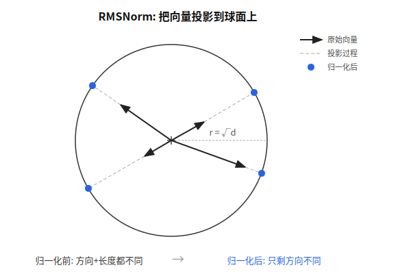
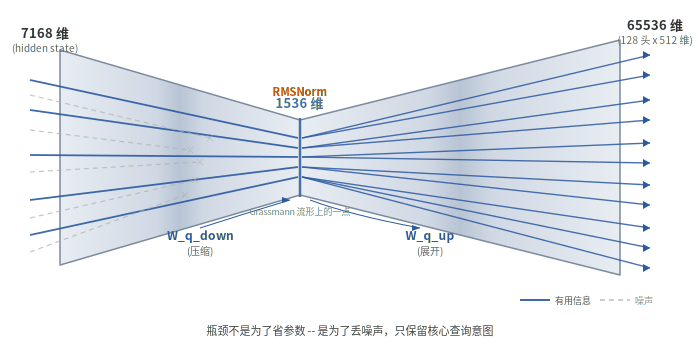
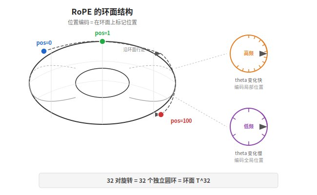
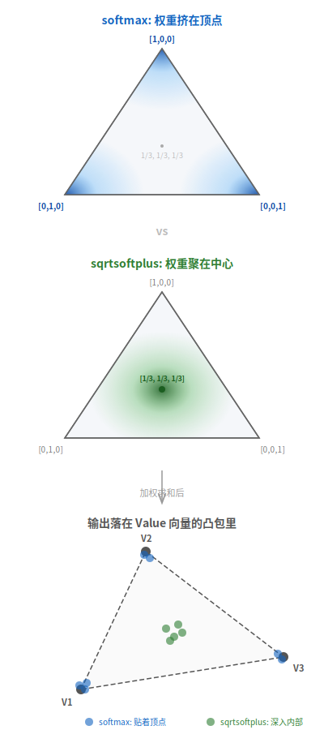
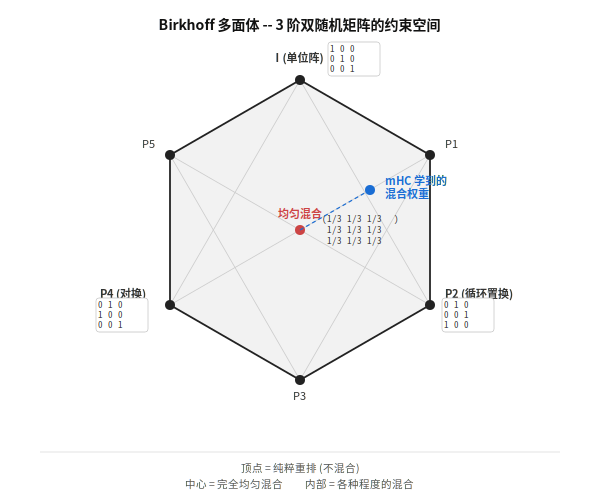
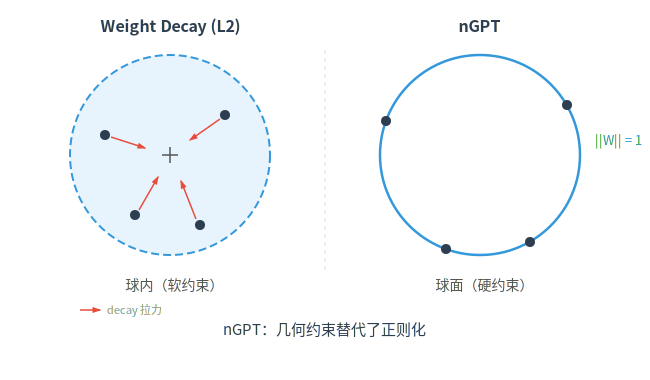

【Deepseek的流形约束】一个 token 从球面滑到单纯形的旅程

━━━━━━━━━━━━━━━━━━━━

◆ 引子：169 期少讲了什么

━━━━━━━━━━━━━━━━━━━━

上一期（第 169 期）我们跟着一个 token 走完了 DeepSeek V4 的全部前向传播路径——从 embedding 查表到 61 层 Transformer，每一步标维度、标矩阵乘法，一个不漏。

但走完之后我越想越觉得少了一个视角。

169 期关心的是**维度怎么变**：7168 → 1536 → 65536 → 512 → 7168，一路升降。但有一个问题 169 期完全没提：**为什么每走几步就要做一次归一化？为什么注意力分数要过 softmax？为什么 mHC 的混合权重要过 Sinkhorn 迭代？**

这些操作散落在教科书的不同章节里——RMSNorm 在"归一化"那一章，softmax 在"分类器"那一章，低秩分解在"矩阵论"那一章，weight decay 在"正则化"那一章。看起来完全不相关。

但它们做的是同一件事：**把高维空间里的向量约束到某个低维流形上。**

第 45 期《高维流形上的神经网络收敛》讲过：Transformer 的 hidden state 看似在 7168 维空间里自由飘荡，但经过训练收敛后，它们实际上集中在一个大约 300-500 维的"本我流形"上。

那个流形不是天上掉下来的。它是被**推**上去的——被 RMSNorm 推、被 softmax 推、被 Sinkhorn 推、被低秩投影推、被 weight decay 推。每一步都在约束，每一步都在缩窄可能的方向。

今天这篇要做的事：**重新走一遍 V4 的前向传播路径，但这次不看维度怎么变，看流形怎么约束。** 一个 token 从球面出发，穿过 Grassmann 流形的瓶颈，在环面上标记位置，滑过单纯形，被 Birkhoff 多面体稳住——然后训练时还有 Weight Decay 和 Muon 在参数空间里悄悄动手。这趟旅程里每一步的几何形状，标出来。

下面先讲**前向路径上的刀**（推理时信号撞到的），再讲**训练时的刀**（优化器撞到的）。按 V4 前向传播中 token 实际遇到的顺序排列。

━━━━━━━━━━━━━━━━━━━━

◆ 第一站：RMSNorm — 钉在超球面上

━━━━━━━━━━━━━━━━━━━━

**V4 的哪一步**

169 期里 RMSNorm 出现在至少 5 个位置：每层注意力前的 RMSNorm、Q 低秩中间的 learned RMSNorm（1536 维）、展开后的逐头 Q RMSNorm（无参数，512 维）、KV 投影后的 learned RMSNorm（512 维）、每层 MoE 前的 RMSNorm、最终输出的 RMSNorm。也就是说，一个 token 穿过一层 Transformer，至少被 RMSNorm 钉了 5 次。61 层下来，超过 300 次。

**做了什么操作**

先看一张示意图：



公式很短：

```text
RMSNorm(x) = x / sqrt(mean(x^2) + eps) * gamma
```

分母 `sqrt(mean(x^2))` 就是向量 x 的均方根长度（Root Mean Square）。除以它之后，向量的 L2 范数被固定在 `sqrt(d)` 附近（d 是维度）。可学习参数 gamma 做逐维缩放，但不改变整体的模长量级。

**约束到什么流形**

超球面 S^{d-1}。d 维空间里所有长度相等的向量构成一个 d-1 维的球面。RMSNorm 把向量投影到半径约为 sqrt(d) 的球面上。

用线性代数的话说：原来向量可以在 R^d 里的任何地方，RMSNorm 之后只能在球面上——自由度从 d 个降到 d-1 个（丢掉了"长度"这一个自由度，只保留"方向"）。

**为什么要约束**

两个原因。

第一，**消除长度信息，只保留方向**。169 期讲过，V4 的逐头 Q RMSNorm 是为了"让 128 个头纯靠方向分化"。如果不归一化，有些头可以靠"输入向量长的时候激活 A 模式，短的时候激活 B 模式"来偷懒——这不是语义分化，是长度作弊。RMSNorm 切断了这条路。

第二，**稳定数值范围**。没有归一化，经过几十层矩阵乘法和非线性变换，向量的模长会指数级增长或衰减。RMSNorm 在每一步把模长拉回 sqrt(d)，相当于给信号装了一个自动增益控制器。

**几何直觉**

高维球面有一个反直觉的性质：**体积集中在赤道附近**。这就是所谓的"橘子皮理论"——一个高维橘子，果汁几乎全部在靠近表皮的薄薄一层里。数学上说，如果你在 R^d 里随机采样一个高斯向量，当 d 很大时，它的模长几乎总是接近 sqrt(d)，方差趋近于零。

换句话说，高维空间里的随机向量**天然就接近球面**。RMSNorm 不是在做什么剧烈的变形——它只是把这个统计趋势变成了硬约束。该在球面上的向量本来就差不多在球面上，RMSNorm 只是最后推了一把。

---

**nGPT：把这个想法推到极致**

Loshchilov 等人（就是提出 AdamW 的那位）在 nGPT（ICLR 2025）里做了一件激进的事。nGPT 的 n 是 normalized（归一化），跟 ChatGPT 没关系——它是一篇学术论文，核心思路是：不只是 hidden state 归一化，**把主要的向量/矩阵参数——权重矩阵的每一行、embedding 的每一行——都钉在单位球面上**。

结果呢？训练速度快了 4 到 20 倍。

这给了一个深刻的启示：如果参数空间本来就应该是球面，那与其让优化器慢慢逼近球面，不如直接把它钉死。**几何约束替代了漫长的探索。**

━━━━━━━━━━━━━━━━━━━━

◆ 第二站：低秩投影 — 穿过 Grassmann 流形

━━━━━━━━━━━━━━━━━━━━

**V4 的哪一步**

169 期里有两处低秩投影：

1. Q 低秩：7168 → 1536 → 65536（W_q_down + RMSNorm + W_q_up）
2. O 分组低秩：65536 → 16 组 x 1024 → 求和 → 7168（16 个 W_o_down + 求和 + W_o_up）

**做了什么操作**

以 Q 低秩为例。直接投影需要一个 [7168, 65536] 的矩阵——4.7 亿参数。低秩分解用两个矩阵：[7168, 1536] 和 [1536, 65536]——1.12 亿参数。

但省参数不是本质。本质是：**信息必须通过一个 1536 维的瓶颈**。



一个 7168 维的向量进去，出来只剩 1536 维。然后从这 1536 维展开到 65536 维。关键在于：展开后的 65536 维空间里，只有一个 1536 维的子空间是”有效”的——其余维度都是 0 或近似 0。

**约束到什么流形**

Grassmann 流形 Gr(r, n)。

先解释这个名字。所有 m x n 矩阵中，秩恰好为 r 的那些矩阵构成一个光滑流形，维度为 r(m + n - r)。但更精确地说，低秩投影约束的是**r 维子空间的选择**——而所有 r 维子空间的集合就是 Grassmann 流形。

用更直观的话说：W_q_down 定义了 7168 维空间中的一个 1536 维子空间（信息瓶颈指向哪里）。W_q_up 定义了从这个子空间到 65536 维空间的映射。训练改变的不仅是投影的具体数值，更是**瓶颈指向哪些方向**——是在 Grassmann 流形上移动。

**为什么要约束**

169 期已经解释过省参数的账。但几何视角给出了更深的理由：

**低秩投影不只是”把大矩阵拆成小矩阵省空间”——它还在强制信息通过一个低维瓶颈，压掉一部分和当前计算目标无关的方向。**

7168 维的 hidden state 里什么都有：语义、位置、噪声、计算脚手架。Q 低秩的 1536 维瓶颈逼模型回答：”这个 token 的核心查询意图是什么？”和查询关系弱的维度会被压下去。

如果 hidden state 中与”查询意图”相关的信息的内在维度本身就小于 1536（很多表征分析都显示，大模型 hidden state 的有效维度远小于标称维度），那这个瓶颈就不一定损失核心信息——它主要压掉的是冗余方向。

---

**LoRA 和 StelLA：同样的几何**

LoRA（Low-Rank Adaptation）做的事情和 V4 的 Q 低秩在几何上很接近：把权重更新约束在一个低秩结构里。不修改原始权重矩阵 W，只训练两个小矩阵 A 和 B，更新量 delta_W = B x A 是低秩的。

但 LoRA 有一个实践问题：B 矩阵在训练过程中容易发生**有效秩塌缩**——理论上 B 的秩应该是 r，但实际训练中有效秩可能远小于 r。本来想要 16 个独立方向，训练着训练着塌缩到 3 个。

StelLA（NeurIPS 2025）的解法：把 LoRA 的 B 矩阵约束在 Stiefel 流形上——也就是强制 B 的列向量正交。Stiefel 流形是正交矩阵的推广（列正交但不一定是方阵）。这个约束把 B 的列空间撑开，降低有效秩塌缩的风险。

**又一次：几何约束替代了祈祷。** 不是”希望训练出来的矩阵保持满秩”，而是”直接把它推到更不容易塌缩的几何结构上”。

━━━━━━━━━━━━━━━━━━━━

◆ 第三站：RoPE — 在环面上标记位置

━━━━━━━━━━━━━━━━━━━━

**V4 的哪一步**

169 期 3.3.3 节。Q 和 K 的 RoPE 部分（各 64 维）被旋转位置编码调制。

**做了什么操作**

RoPE 把 64 维向量两两配对，得到 32 对。每一对在二维平面上做一次旋转，旋转角度取决于 token 的位置和这一对的频率：

```text
对于第 i 对（i = 0, 1, ..., 31）:
  theta_i = position / 10000^(2i/64)
  [x_{2i}, x_{2i+1}] → [x_{2i}*cos(theta_i) - x_{2i+1}*sin(theta_i),
                         x_{2i}*sin(theta_i) + x_{2i+1}*cos(theta_i)]
```

每一对做的是一个 SO(2) 旋转（2x2 旋转矩阵，行列式为 1）。

**约束到什么流形**

环面 T^{32}（对 V4 的 64 维 RoPE 来说是 T^{32}）。



一个 SO(2) 旋转矩阵完全由旋转角 theta 决定，theta 在 [0, 2*pi) 上取值——拓扑上这是一个圆环 S^1。32 个独立的旋转 = 32 个独立的圆环 = 32 个圆环的直积 = 环面 T^{32}。

也就是说，RoPE 把”位置”编码成了环面上的一个点。位置 0 对应环面上的原点，位置 1 对应沿着 32 条不同频率的圆环各转了一小步，位置 10000 对应转了很多圈。

**为什么要约束**

两个 token 的相对位置越远，它们在环面上的距离越大，Q 和 K 点积的衰减越多。RoPE 把”位置越远相关性越低”这个先验直接编码成了几何距离。

环面结构还提供了天然的**多尺度编码**：高频的旋转对（i 大的对，theta 变化快）编码局部位置差异，低频的旋转对（i 小的对，theta 变化慢）编码全局位置差异。32 个频率覆盖了从”相邻 token”到”数万 token 之远”的完整范围。

━━━━━━━━━━━━━━━━━━━━

◆ 第四站：Softmax — 落在概率单纯形上

━━━━━━━━━━━━━━━━━━━━

**V4 的哪一步**

至少三处：注意力权重（169 期 3.3.5 节的 `attn_weights = softmax(score)`）、最终 token 预测（Step 6 的 `probs = softmax(logits)`）、以及 Compressor 的压缩权重（169 期”如果输入是 5 万个 token”那节）。

注意，V4 的 MoE 路由**不用** softmax——用的是 sqrtsoftplus。后面讲区别。

**做了什么操作**

```text
softmax(x_i) = exp(x_i) / sum_j(exp(x_j))
```

输入是 K 个任意实数，输出是 K 个满足两个条件的数：每个都非负，加起来等于 1。

**约束到什么流形**

概率单纯形 Delta^{K-1}。

什么是单纯形？在二维空间里，三个点满足”坐标非负、坐标和为 1”构成一个三角形。在 K 维空间里，K 个点满足同样条件构成一个 K-1 维的”三角形”——这就是单纯形。

```text
K=2:  一条线段（从 [1,0] 到 [0,1]）
K=3:  一个三角形（三个顶点 [1,0,0], [0,1,0], [0,0,1]）
K=4:  一个四面体
K=129280: V4 最终预测时的 129279 维单纯形
```

softmax 把 R^K 里的任意一点映射到这个单纯形上。原来 K 个数可以是任意实数（K 个自由度），映射后被约束在 K-1 维的单纯形上（丢掉了”总量”这一个自由度，只保留”比例”）。

**为什么要约束**

因为概率必须加起来等于 1。注意力权重是”这些 KV 各占多少比重”——不约束到单纯形上，”加权平均”就不成立。最终预测是”每个 token 被选中的概率”——不约束到单纯形上，采样就没有概率意义。

**几何直觉**



softmax 不是均匀地覆盖单纯形。它有一个强烈的偏好：**把向量推向单纯形的角落**。

原因在于 exp 函数的指数放大效应。如果输入的 K 个数里有一个明显比其他大，exp 会把这个差距放大成碾压性的比例——softmax 输出接近 one-hot 向量（某个分量接近 1，其他接近 0）。这就是 winner-take-all 效应。

在单纯形的几何上，one-hot 向量恰好是**单纯形的顶点**。softmax 偏好把结果推向顶点附近，而不是停在单纯形的中心（均匀分布 [1/K, 1/K, ..., 1/K]）。

---

**sqrtsoftplus：同一个流形，不同的偏好区域**

V4 的 MoE 路由不用 softmax，用 sqrtsoftplus：

```text
sqrtsoftplus(x) = sqrt(log(1 + exp(x)))
```

先过 softplus（光滑版的 ReLU），再开根号。然后在 top-6 内部归一化（除以 top-6 的总和使之和为 1）。到这一步，临时路由权重落在单纯形 Delta^5 上。

但 V4 还有一步：把归一化后的 top-6 权重整体乘以 `routed_scaling_factor = 2.5`。所以最终真正送进 MoE 合并公式的，不是普通的 Delta^5，而是一个**放大了 2.5 倍的单纯形**：

```text
临时权重:  w_i >= 0,  sum(w_i) = 1
最终权重:  2.5 * w_i, sum(2.5 * w_i) = 2.5
```

但偏好区域不同。softmax 的 exp 让赢家碾压性地吃掉所有权重；sqrtsoftplus 的 log-then-sqrt 双重压缩让大值和小值之间的差距变小。结果是路由权重更均匀——6 个专家不是”1 个干活 5 个看”，而是”6 个都在干，只是干的量不同”。

同一个单纯形骨架，softmax 偏好顶点（稀疏），sqrtsoftplus 偏好中心区域（均匀），然后 V4 再把这个路由单纯形整体放大到 2.5 倍。V4 在注意力里用 softmax（需要锐利的焦点），在路由里用 sqrtsoftplus（需要均匀的负载）——**不是随手选的激活函数，是在相近的几何约束上选了不同的工作区域。**

---

**注意力输出的另一层约束：凸包**

Softmax 之后还有一层隐藏的约束。注意力输出是 Value 向量的加权求和，权重由 softmax 给出（加起来等于 1，每个都非负）——这意味着输出是 Value 向量的**凸组合**，被限制在 Value 向量构成的**凸包（Convex Hull）**内。

不管 query 怎么变、注意力权重怎么分配，输出永远不可能跑到凸包外面。凸包的维度最多是 min(n−1, d_v)（n 是上下文长度，d_v 是 Value 的维度）。这是一个比 R^{d_v} 小得多的空间——又砍掉了一批自由度。

━━━━━━━━━━━━━━━━━━━━

◆ 第五站：Sinkhorn / mHC — 把混合矩阵压进 Birkhoff 多面体

━━━━━━━━━━━━━━━━━━━━

**V4 的哪一步**

mHC（manifold Hyper-Connections）的混合权重。169 期 3.1 节讲过：hc_pre 和 hc_post 里有一个 `hc_split_sinkhorn` 函数，把混合参数约束到”稳定范围”里。

具体说，mHC 维护 4 份 hidden state 副本。每一层的 hc_pre 把 4 份合并为 1 份（送入注意力或 MoE），hc_post 把 1 份展开回 4 份（和残差组合）。源码里的 `hc_split_sinkhorn` 会拆出三类量：

```text
pre  [4]      ← hc_pre 用它把 4 份合成 1 份
post [4]      ← hc_post 用它决定 F(x) 注入 4 份副本的比例
comb [4,4]    ← hc_post 用它决定旧 4 份残差之间怎么混合
```

严格说，Birkhoff 多面体主要对应的是 `comb [4,4]` 这块矩阵；`pre/post` 是配套的读出/注入权重。169 期里我们已经把”5×5 双随机矩阵 W”的说法改掉了，这里也按源码口径来讲。

**做了什么操作**

Sinkhorn 迭代做的事很直观：给定一个非负矩阵，**交替对行和列做归一化**，直到收敛。

```text
输入:  任意非负矩阵 M [n, n]

重复若干次:
  对每一行除以行和（行归一化）
  对每一列除以列和（列归一化）

输出:  双随机矩阵 D [n, n]
       每一行加起来 = 1
       每一列加起来 = 1
       每个元素 >= 0
```

mHC 里最核心的是 4x4 的 `comb`：4 份残差副本之间的混合权重矩阵 `comb [4, 4]`，通过 Sinkhorn 迭代被约束到近似双随机矩阵的区域里。`pre/post` 则负责从 4 份里读出 1 份、再把本层函数输出注入回 4 份。

**约束到什么流形**

Birkhoff 多面体。n 阶双随机矩阵（行和=1、列和=1、非负）的集合构成一个凸多面体，叫做 Birkhoff 多面体。



这个多面体有一个漂亮的定理：**Birkhoff-von Neumann 定理**说，它的顶点恰好是所有 n 阶置换矩阵。

什么是置换矩阵？每行每列恰好有一个 1、其余全是 0 的矩阵——它代表”不混合，只重排”。比如：

```text
[0 1 0 0]     含义：第 1 份 → 第 2 份的位置
[1 0 0 0]           第 2 份 → 第 1 份的位置
[0 0 0 1]           第 3 份 → 第 4 份的位置
[0 0 1 0]           第 4 份 → 第 3 份的位置
```

所以 Birkhoff 多面体的”两端”是：**顶点 = 纯粹的重排（不混合），内部 = 各种程度的混合，中心 = 完全均匀混合**。mHC 的 Sinkhorn 约束让 `comb` 落在这两端之间的某个位置——模型可以学到”这一层需要更多混合”或”这一层几乎不混合”。

**为什么要约束**

核心原因：**控制混合强度**。

双随机矩阵有一个关键性质：每一行、每一列的总权重都被固定住。对 4 份副本来说，这意味着旧路径之间的混合不会凭空把某一路无限放大，也不会让某一路在反复混合中系统性消失。

如果不用 Sinkhorn 约束——比如用普通的线性层生成混合权重——权重可以很大也可以很小，4 份副本之间的耦合强度会漂。经过 61 层，即使每层只偏离 1%，61 层下来也是 1.01^61 = 1.84 倍（或 0.99^61 = 0.54 倍）。用 Sinkhorn 把 `comb` 约束到 Birkhoff 多面体附近，就是在给多路径混合加一个稳定器。

第 37 期专门讲过 mHC 和 Sinkhorn 的细节。那篇的标题是”为什么'流形约束'是标题党”——彼时我觉得 DeepSeek 论文里”流形”这个词用得太虚。但现在换一个视角看，它至少有一部分确实是几何约束：Birkhoff 多面体是嵌入在 R^{n^2} 里的一个低维凸体，Sinkhorn 迭代是在把混合矩阵往这个凸体附近投影。

---

**Birkhoff 多面体的局限**

提一个批评：Birkhoff 多面体有非负约束——`comb` 里的混合权重不能是负数，意味着 4 份残差副本只能做”正加权平均”，不能做”减法”。这限制了表达力：如果某一层需要”用第 2 份减去第 1 份的某些分量”，非负约束阻止了这种操作。

另外，实践中 Sinkhorn 迭代可能坍缩到单位阵附近——也就是”每份副本主要保留自己，不和其他副本交流”。这时 mHC 的 `comb` 部分会接近 4 条独立路径，混合作用变弱。

有没有更好的约束方式？比如把 4x4 混合矩阵约束在**谱范数球面**上（允许负数，只约束最大奇异值）——这会给出更大的表达空间。但 V4 目前选的是 Birkhoff 多面体。

━━━━━━━━━━━━━━━━━━━━

◆ 训练时的隐形约束：Weight Decay 和 Muon

━━━━━━━━━━━━━━━━━━━━

上面五站都是前向传播路径上的约束——推理时信号撞到的墙。但还有两把刀只在训练时出手，不在前向路径上出现，却同样在雕刻流形。

---

**Weight Decay → L2 球**

Weight decay 不在前向传播路径上——它发生在训练时的参数更新步骤里。V4 的非 Muon 参数（embedding、lm_head 等）用 AdamW 训练，带 weight decay。

经典 L2 正则化在 loss 里加一项（L2 范数 = 各分量平方和再开根号，就是向量到原点的直线距离）：

```text
L_total = L_task + lambda * ||W||^2
```

梯度更新时，这等价于每一步把权重往原点拉一点。AdamW 的”解耦”版本更直接：

```text
W_new = (1 - lr * lambda) * W_old - lr * adam_step
```

L2 weight decay 把权重约束在以原点为球心的**球体内部**（不是球面——是实心球）。权重可以在球内的任何位置，但不会跑到球外去。

这里有一个微妙的点：AdamW 的隐式偏置实际上不完全是 L2 球。Gunasekar 等人（ICML 2018）的研究表明，**不同优化器的隐式正则化会对应不同形状的”球”**——SGD 偏向 L2 球（圆的），Adam/AdamW 这类自适应方法的几何更接近按坐标独立缩放的形状，可以粗略理解成更”方”。

什么是 L-infinity？L2 范数是”各分量平方和再开根号”（直线距离），L-infinity 范数是”取最大的那个分量”。L2 球的边界是圆——各方向等距；L-infinity 球的边界是正方形（高维就是超立方体）——每个维度独立限制，互不干涉。AdamW 对每个参数独立做自适应学习率，每个维度各管各的，所以它的优化几何不像 SGD 那样是一个各方向同权的圆球。

优化器不只是”拧参数的手”，它还悄悄决定了参数空间的形状。



如果主要参数都被钉在球面上（如 nGPT），weight decay 的作用就会被大幅削弱——参数的模长已经被硬约束为 1，不可能增长。**几何约束替代了一部分正则化。**

---

**Muon → 正交群 O(n)**

V4 的大部分矩阵参数用 Muon 优化器训练（第 167 期详细讲过）。Muon 的核心操作是：

```text
1. 像 Adam 一样算出动量（momentum）
2. 把动量矩阵做极分解：M = U * Sigma * V^T
3. 更新方向取 U * V^T（丢掉 Sigma，只保留正交部分）
```

实际实现用 Newton-Schulz 迭代近似极分解，不需要真的做 SVD。

U * V^T 是一个正交矩阵。注意：Muon 不是把**权重**约束在正交矩阵上，而是把**每步更新的方向**约束在正交矩阵上。也就是说，权重本身不一定正交，但每一步的”拧法”是正交的。

Jeremy Bernstein 的推导给出了优雅的解释：Muon 等价于在**谱范数**下做最速下降。Frobenius 范数下的最速下降就是普通的梯度下降——每个参数被同等对待。谱范数下的最速下降是 Muon——**它把更新均匀分配到所有奇异方向上**，而不是让最大奇异方向独占更新预算。

一个数学细微之处：谱范数不是内积诱导的范数，谱范数球面有”尖角”。所以严格地说，Muon 不是黎曼几何意义上的”流形上的梯度下降”，更像是凸几何里的投影。但效果是一样的：**把更新方向约束在一个低维的几何结构上，避免在高维空间里乱走。**

━━━━━━━━━━━━━━━━━━━━

◆ 全景图：一个 token 的流形旅程

━━━━━━━━━━━━━━━━━━━━

把所有流形约束按 V4 前向传播的顺序排列：

```text
步骤                    操作               约束到的流形            维度/形状
─────────────────────────────────────────────────────────────────────────────
Embedding               查表               R^7168（无约束）        7168
mHC hc_pre              Sinkhorn           pre/post/comb 约束      4 份副本读出参数
层前 RMSNorm            除均方根           超球面 S^7167           半径 sqrt(7168)
Q 低秩 down             矩阵乘法           Grassmann Gr(1536,7168) 1536 维子空间
Q 中间 RMSNorm          除均方根           超球面 S^1535           半径 sqrt(1536)
Q 低秩 up               矩阵乘法           Grassmann（展开）       65536 维
逐头 Q RMSNorm          除均方根           超球面 S^511 x 128头   每头半径 sqrt(512)
KV RMSNorm              除均方根           超球面 S^511            半径 sqrt(512)
RoPE                    旋转               环面 T^32               32 个独立旋转
注意力 softmax          指数归一化         单纯形 Delta^{n-1}      n = 上下文长度
注意力输出              加权求和           Value 向量的凸包        ≤ min(n-1, d_v)
mHC hc_post             Sinkhorn           Birkhoff 多面体附近     comb [4,4] + post [4]
O 分组低秩              矩阵乘法           分组低秩瓶颈            16 组 x 1024
层前 RMSNorm            除均方根           超球面 S^7167           半径 sqrt(7168)
MoE 路由                sqrtsoftplus+归一化 单纯形 2.5·Delta^5      6 个专家
mHC hc_post             Sinkhorn           Birkhoff 多面体附近     comb [4,4] + post [4]
... 重复 61 层 ...
最终 RMSNorm            除均方根           超球面 S^7167           半径 sqrt(7168)
最终 softmax            指数归一化         单纯形 Delta^129279     129280 个 token
─────────────────────────────────────────────────────────────────────────────
训练时:
Weight Decay            拉向原点           L2 球体内部              参数空间
Muon 优化器             极分解投影         正交群 O(n)（更新方向）  参数梯度空间
```

一层 Transformer 里，一个 token 至少经历：2 组 mHC/Sinkhorn 约束（主要作用在 comb 混合矩阵上）、5 次 RMSNorm（超球面）、2 次低秩瓶颈、1 次 RoPE（环面）、1 次注意力 softmax（单纯形）、1 次路由归一化再放大（2.5·Delta^5）。

61 层下来，这些约束操作的数量级是数百次。这里没必要抠精确数字，重要的是：约束不是偶尔出现一次，而是贯穿整条前向路径。

━━━━━━━━━━━━━━━━━━━━

◆ 为什么这些约束如此重要

━━━━━━━━━━━━━━━━━━━━

回到开头的问题：RMSNorm、softmax、Sinkhorn、低秩投影、weight decay、Muon——它们散落在教科书的不同章节，看起来毫无关联。但换一个视角，它们做的是同一件事：

**在高维空间里划出一条窄路，让信号只能沿着有意义的方向走。**

高维空间是诅咒也是祝福。维度越高，可以表达的东西越多——但绝大多数方向是噪声。R^7168 有 7168 个自由度，但"中国的首都是北京"这个语义信息真正需要的自由度可能只有几十个。剩下的几千个维度如果不约束，就是信号迷路的空间。

每一种流形约束都在**砍掉无用的自由度**：

- RMSNorm 砍掉长度自由度，只保留方向
- Softmax 砍掉总量自由度，只保留比例
- Sinkhorn 砍掉行列不受控的自由度，稳定多路径混合
- 低秩投影砍掉与核心意图无关的维度，只保留瓶颈能通过的信息
- RoPE 把位置信息约束在环面上，让远近关系变成几何距离
- Weight decay 砍掉径向自由度，把权重困在球内
- Muon 砍掉更新方向里奇异值尺度的自由度，让更新更接近正交化后的方向

不约束会怎样？第 167 期讲过，V4 在没有 QK-Norm（也就是逐头 RMSNorm）的情况下训练不稳定——attention logits 的数值会爆炸。mHC 如果不用 Sinkhorn 约束混合权重，4 份副本之间的耦合强度会逐层漂移。没有 weight decay，权重更容易长大并过拟合。没有低秩瓶颈，Q 投影会把大量参数花在未必有用的方向上。

**不约束就爆炸，或者不约束就迷路。**

第 45 期的结论是：Transformer 之所以能收敛到那个 300-500 维的"本我流形"，不是因为某一个 trick 在发力。是因为所有 trick **同时**在把信号往流形上推——数百次约束操作，每一次都在缩窄搜索空间，每一次都在说"不要去那个方向，那里没有意义"。

这就是为什么这些看起来"只是工程 trick"的操作，其实是 Transformer 能工作的几何基础。去掉其中任何一个，模型不会立即崩溃——但训练会变慢，收敛会变差，稳定性会下降。它们不是锦上添花，是地基。

最后用一句话概括这篇文章的核心观点：

**一个 token 穿过 V4 的 61 层，被七百多把刀雕刻——球面的、单纯形的、多面体的、环面的、Grassmann 的——活下来的，就是本我流形。那些散落在教科书各处的"归一化技巧"，不是锦上添花，是雕刻智能的刀。**

━━━━━━━━━━━━━━━━━━━━

参考资料：

```
RMSNorm → 超球面:
[1] nGPT: Normalized Transformer with Representation Learning on the Hypersphere
    Loshchilov et al., ICLR 2025, arXiv: 2410.01131
    （把所有参数钉在球面上，训练加速 4-20 倍）
[2] Geometric Interpretation of Layer Normalization and RMSNorm
    Gao et al., 2024, arXiv: 2409.12951
    （从几何角度证明 RMSNorm 是超球面投影）

低秩投影 → Grassmann 流形:
[3] Optimization Algorithms on Matrix Manifolds
    Absil, Mahony & Sepulchre, Princeton University Press, 2008
    （矩阵流形优化的标准教科书，Grassmann/Stiefel 流形的权威参考）
[4] StelLA: Subspace Learning in Low-rank Adaptation using Stiefel Manifold
    Li et al., NeurIPS 2025, arXiv: 2510.01938
    （把 LoRA 的因子矩阵显式约束到 Stiefel 流形上做黎曼优化）

RoPE → 环面:
[5] RoFormer: Enhanced Transformer with Rotary Position Embedding
    Su et al., 2021, arXiv: 2104.09864
    （RoPE 原论文，用 SO(2) 旋转编码位置，隐含环面结构）

Softmax → 单纯形:
    （经典数学，指数族分布的自然参数化。信息几何视角可参考 Amari, 2016,
     "Information Geometry and Its Applications", Springer）

Sinkhorn → Birkhoff 多面体:
[6] mHC: Manifold-Constrained Hyper-Connections
    DeepSeek, arXiv: 2512.24880
    （V4 的 mHC 用 Sinkhorn 约束混合矩阵）
[7] Sinkhorn Distances: Lightspeed Computation of Optimal Transport
    Cuturi, NIPS 2013
    （Sinkhorn 迭代求解熵正则化最优传输）

Weight Decay → L2 球:
[8] Characterizing Implicit Bias in Terms of Optimization Geometry
    Gunasekar et al., ICML 2018, arXiv: 1802.08246
    （证明不同优化器的隐式偏置对应不同形状的约束）

Muon → 正交群:
[9] Deriving Muon
    Jeremy Bernstein, blog post
    （从谱范数最速下降推导出 Muon 的正交化操作）

V4 架构:
[10] DeepSeek V4 Technical Report (2026)
```

━━━━━━━━━━━━━━━━━━━━

// 靳岩岩的 AI 学习笔记 × Claude 的严谨 × Gemini 的浪漫
// 2026-04-30
