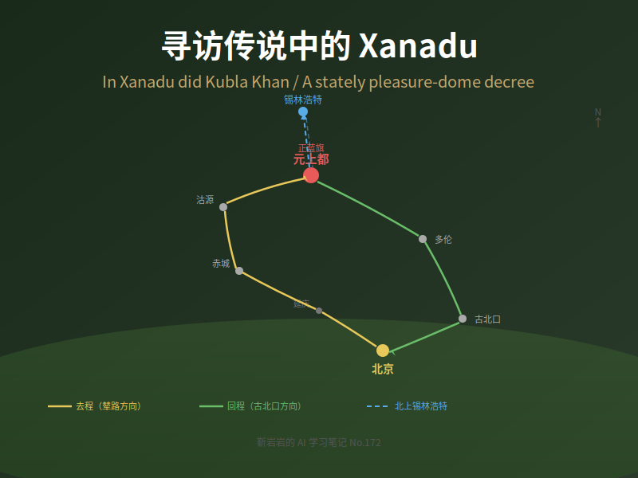

【五一假期】北京->正蓝旗，寻访传说中的 Xanadu

━━━━━━━━━━━━━━━━━━━━

◆ Xanadu 这个词

━━━━━━━━━━━━━━━━━━━━

如果你是程序员，你大概率在某个地方见过 Xanadu 这个词。

但你可能不知道它的来历。Xanadu 是元上都的中世纪英文音译——忽必烈的夏都，蒙古帝国的行政中心之一。这座城市在 1369 年被明军烧毁后，就变成了内蒙古草原上的一堆土墩子。**但它的名字在西方活了 800 年**，而且越活越离谱。

先捋一下这个词的谱系：

| 时间 | 事件 | 干了什么 |
|------|------|----------|
| 1275 | 马可·波罗到达元上都 | 把这座城市的名字传回了欧洲 |
| 1613 | Samuel Purchas 出版《Purchas his Pilgrimage》 | 转述马可·波罗的游记，把地名拼成了 Xandu |
| 1797 | 柯勒律治写下《Kubla Khan》 | 英国浪漫主义诗人，"suspension of disbelief"（悬置怀疑）这个概念就是他发明的。嗑了鸦片后读 Purchas 的书，做了个梦，醒来写诗，写到一半被人敲门打断，名篇就此诞生 |
| 1960 | Ted Nelson 启动 Project Xanadu | 人类第一个超文本项目，比 Tim Berners-Lee 的万维网早 30 年。Nelson 在 1965 年发明了 hypertext 这个词。项目至今未完成——可能是软件史上最长的 vaporware |
| 1980 | 电影《Xanadu》上映 | Olivia Newton-John 主演，票房惨烈扑街，直接催生了金酸莓奖（Razzie Awards）的诞生。但讽刺的是原声带卖了双白金 |
| 2016 | Xanadu Quantum Technologies | 加拿大量子计算公司，用光量子做量子机器学习，他们开源的 PennyLane 框架不少搞量子计算的人用过 |

一座被烧了 600 多年的蒙古草原上的废墟，它的名字变成了英语里"梦幻奢华之地"的通用词，然后被拿去命名超文本项目、烂片、量子计算公司。

**符号比建筑持久。代码比城墙耐久。**

五一假期，我决定去看看真正的 Xanadu 还剩下什么。

━━━━━━━━━━━━━━━━━━━━

◆ 路线规划：北京 → 金莲川

━━━━━━━━━━━━━━━━━━━━

元上都遗址在内蒙古锡林郭勒盟正蓝旗上都镇，2012 年入选 UNESCO 世界文化遗产。

从北京出发，大约 350-450 公里，取决于走哪条路：

────────────────────

【元朝皇帝怎么走的】

元朝皇帝每年春天从大都（北京）北上上都避暑，秋天返回——叫"两都巡幸"，契丹语叫**捺钵**。皇帝的走法是"东出西还"——春天走辇路北上，秋天走西路南返，一年画一个环：

| 路线 | 用途 | 走向 |
|------|------|------|
| **辇路（东道）** | 皇帝春季北上专用，禁止常人通行 | 大都 → 昌平 → 居庸关 → 沿沽源方向北上，设 18 个纳钵，即驻跸（bì）（皇帝休息站），约 750km |
| **西路（孛老驿路）** | 皇帝秋季南返 | 上都 → 抚州（张北）→ 野狐岭 → 鸡鸣山 → 居庸关 → 大都，约 700km |

另外还有古北口路（军队和监察用）和普通驿路（官员商人用），但皇帝不走那些。

北大历史系教授罗新在 2016 年徒步走了辇路全程——53 岁，15 天，450 公里，从北京健德门走到正蓝旗元上都。写成了《从大都到上都——在古道上重新发现中国》，拿了"金犀牛"最佳户外出版物奖。我最初就是从这本书里知道捺钵和辇路这些典故的，推荐出发前翻一翻。

────────────────────

【我的路线】

我们没法走辇路（古道早就不是公路了），但可以大致沿着辇路的方向走。我以前走这条路比较多——因为罗新就是这么走的。

这次的计划是画个环：

**去程（辇路方向）**：北京 → 延庆 → 赤城（第一晚住这里）→ 沽源 → 正蓝旗（元上都遗址）。大致对应元代辇路（东道）的方向，约 400km。

**北上**：正蓝旗 → 锡林浩特。去看看贝子庙（清乾隆年间的藏传佛教寺庙，内蒙古四大庙宇之一），顺便在草原上逛逛。

**回程（古北口路方向）**：锡林浩特 → 正蓝旗 → 多伦 → 古北口 → 北京。大致对应元代的"古北口路"方向。多伦那边发现过欧洲人墓葬，后面会讲到。古北口本身也有故事——1089 年苏辙出使辽国路过这里，看到契丹人给杨业（杨无敌）立的庙，写了一首"一败可怜非战罪"，替杨业鸣不平。连敌国都尊敬的将军，自己人反而害死了他。

去程走东道，回程走古北口——虽然不是皇帝的"东出西还"，但也算把元代两条路都走了一遍。

━━━━━━━━━━━━━━━━━━━━

◆ 从桓州到上都：这座城怎么来的

━━━━━━━━━━━━━━━━━━━━

元上都不是凭空冒出来的。这片草原上更早的城市是金代的**桓州**，遗址在正蓝旗境内，当地人叫"四郎城"（侍郎城），我以前去过。1212 年蒙古攻金，桓州是最早被拿下的金代边境州之一。

几十年后，1251 年蒙哥汗让忽必烈管漠南汉地事务。忽必烈没有选旧城桓州，而是在旁边的金莲川草原驻帐，广招天下名士——汉人、回回人、西域人都有——组建了著名的 **"金莲川幕府"** 。这个智囊团里最关键的人物是**刘秉忠**：和尚出身的汉人谋士，后来元大都（北京）的城市规划也是他设计的。

1256 年，忽必烈命刘秉忠在金莲川建城，取名**开平府**。1260 年忽必烈在开平称汗，1263 年升格为**上都**。从此元朝皇帝春夏在上都、秋冬在大都，两都巡幸延续了近百年，直到 1369 年明军北伐，上都被焚毁。

一座草原上的城市，从金代的边境军镇，到蒙古的藩王府邸，到帝国的夏都，再到一堆土墩子——前后不到两百年。

━━━━━━━━━━━━━━━━━━━━

◆ 马可·波罗 vs 真实的元上都

━━━━━━━━━━━━━━━━━━━━

先说马可·波罗吹了多大的牛。

马可·波罗说元上都城墙周长 16 英里（约 26 公里）。考古实测：外城、内城、宫城三重城墙，外城周长约 9 公里——折合 5.5 英里。马可·波罗吹了 3 倍。

但更有意思的是信息失真的链条。柯勒律治 1797 年写《Kubla Khan》的时候，读的不是马可·波罗原文，而是 1613 年 Samuel Purchas 的《Purchas his Pilgrimage》——Purchas 在转述马可·波罗的时候又加了自己的演绎。然后柯勒律治是嗑了鸦片之后读的 Purchas，在梦里"看到"了 Xanadu，醒来写诗。

也就是说：**马可·波罗（可能的亲历者，已经在吹）→ Purchas（转述者，又加了一层）→ 鸦片梦（柯勒律治的神经网络在药物作用下产生的幻觉）**。三层失真。就像你把一张图片先 JPEG 压缩一次，再截图一次，再用 AI 放大一次——最后出来的东西跟原图已经没什么关系了。

────────────────────

【考古发现的真实元上都】

放下马可·波罗和诗人的滤镜，看看考古学家挖出了什么：

- UNESCO 保护区总面积 25,000 公顷（含周边草原缓冲区），城址本身约 2km × 2km
- 宫城、皇城、外城三重城墙结构
- 已确认 1,078 个建筑遗址
- 约 700 个建筑地基
- 29 条可辨识的大街
- 城内有完整的排水系统和街道网格

────────────────────

【三教并存：草原底下的世界主义】

最让人意外的发现是宗教遗迹。考古发掘和文献记录表明，元上都城内同时存在：

- **佛教寺庙**：乾元寺等多座，这不意外——忽必烈尊八思巴为国师，藏传佛教是元朝的官方宗教之一
- **清真寺**：大量穆斯林商人和工匠常驻上都，回回人在元朝的地位高于汉人（色目人，第二等级）
- **基督教堂**：景教（东方亚述教会）和天主教方济各会都有传教士在上都活动。忽必烈的母亲唆鲁禾帖尼本人就是景教徒

三种宗教的礼拜场所在同一座城市里并存——在 13 世纪，全世界能做到这一点的城市屈指可数。同时期的欧洲正在搞十字军东征和异端裁判所。

────────────────────

更令人震撼的是多伦县（正蓝旗隔壁）的考古发现：**欧洲人墓葬**。

多伦县距离元上都遗址约 50 公里，元代属于上都路管辖。在这里发现的墓葬中，有明确的欧洲人特征——这些人很可能是沿着蒙古帝国的驿站系统从欧洲一路到达草原的商人、传教士或使节。

一个草原上的城市，里面住着蒙古人、汉人、波斯人、阿拉伯人、欧洲人，信佛教、伊斯兰教、基督教。这不是"中国的城市"，**这是 13 世纪的联合国**。

━━━━━━━━━━━━━━━━━━━━

◆ 欧亚大陆的路由器

━━━━━━━━━━━━━━━━━━━━

这是我最想讲的部分。

或许有一个事实：**汉人的科技在古代世界中并不像课本讲的那么突出**。四大发明的叙事是近代民族主义建构的产物。如果你横向比较——不只比欧洲，也比印度和中东——情况更加微妙。

印度人在公元前就发明了十进制和零的概念（后来通过阿拉伯人传到欧洲，所以叫"阿拉伯数字"，但其实是印度数字）。中东的阿拉伯学者在 9-12 世纪保存并发展了古希腊的数学、天文学和医学——代数（algebra）这个词就来自花拉子模的数学家 al-Khwarizmi 的书名（顺便说一下，algorithm 这个词也来自他的名字的拉丁化转写）。欧洲在中世纪虽然被嘲笑为"黑暗时代"，但光学（Roger Bacon）、机械钟（13 世纪）、大学体制（博洛尼亚 1088 年、牛津 1096 年）都在发展。

汉人有自己的技术成就，但放在全球坐标系里看，**不是独一份的领先，更像是平行发展中的一支**。

毫无疑问，元朝是中国正统王朝，蒙古族是五十六个民族之一。承认这一点才能更好地理解：**中国之所以在科技史上出彩，恰恰不仅仅因为继承了汉人的传统，更因为蒙古人打通了欧亚大陆的技术网络，把波斯的天文、阿拉伯的工程、欧洲的传教士全搅到了一起。** 蒙古人的角色不是发明者，而是连接者。

────────────────────

【忽必烈朝廷里的人】

看看元上都和大都（北京）的忽必烈朝廷里都有什么人：

| 人物 | 身份 | 干了什么 |
|------|------|----------|
| 札马鲁丁（Jamal al-Din） | 波斯天文学家 | 1267 年向忽必烈献上 7 件波斯天文仪器，其中包括**中国天文史上最早的球形地球仪**（地球仪这东西不是中国人发明的） |
| 亦思马因（Ismail）、阿老瓦丁（Ala al-Din） | 阿拉伯/波斯工程师 | 制造回回炮（配重投石机），第 88 期（ https://mp.weixin.qq.com/s/L7Eoo9nvxtqmyToB3guc-A ）讲过，这东西攻破了襄阳 |
| 马可·波罗（Marco Polo） | 威尼斯商人 | 在忽必烈朝廷任职约 17 年，把元朝的信息带回欧洲 |
| 列班·扫马（Rabban Sauma） | 景教修士，维吾尔人 | 从大都出发出使欧洲，见了罗马教皇、法国国王、英国国王——13 世纪的"反向马可·波罗" |
| 爱薛（Isa Kelemechi） | 叙利亚景教徒 | 在大都和上都开设"广惠司"，用阿拉伯医学给元朝人看病 |

注意札马鲁丁。1267 年他带来的 7 件仪器包括：浑天仪、方位仪、斜纬仪、平纬仪、天球仪、地球仪、星盘。其中**地球仪是中国历史上首次出现的球形地球模型**。在此之前，中国的天文传统用的是浑天说或盖天说，没有把地球做成球形实体模型的传统。

────────────────────

【郭守敬站在谁的肩膀上】

郭守敬的授时历（1281 年）是中国古代最精确的历法，精度达到一年 365.2425 天——和现代公历（格里历，1582 年）完全一致，早了 300 年。

但很少有人提到：郭守敬做授时历的起点，是札马鲁丁带来的波斯天文仪器和阿拉伯天文学知识。郭守敬在此基础上改进、发明了简仪等新仪器，完成了大规模天文观测（在全国 27 个点同时观测），最终算出了授时历。

这不是"抄"——郭守敬的创新是真实的。但他的创新不是在真空中发生的，而是站在波斯-阿拉伯天文学的肩膀上。**如果没有蒙古帝国把札马鲁丁从波斯送到大都，郭守敬还是郭守敬，但授时历可能不是授时历。**

────────────────────

【蒙古帝国的网络效应】

Jack Weatherford 在《成吉思汗与今日世界之形成》（*Genghis Khan and the Making of the Modern World*，2004）里提出了一个核心论点：

**蒙古人不发明技术，但他们打通了欧亚技术流动的网络。**

蒙古帝国做了什么？

- 统一了从东海到多瑙河的政治空间，消除了沿途的关税壁垒和小国阻隔
- 建立了驿站系统（站赤），每隔 25-30 公里一站，横贯欧亚——这是 13 世纪的光纤骨干网
- 强制推行宗教宽容政策——你信什么都行，只要给大汗交税
- 系统性地掳掠和迁移工匠——打下一个城市，杀掉军人，留下工匠，送到帝国需要的地方去

结果就是：

- **印刷术**从中国/高丽西传到中亚和欧洲（虽然古登堡活字是否直接受中国影响仍有争议，但信息传播的通道是蒙古帝国打通的）
- **阿拉伯数学和天文学**东传到中国（札马鲁丁就是例子）
- **火药配方**从中国传到中东再传到欧洲
- **中国医学知识**（脉诊等）传入波斯，波斯-阿拉伯医学传入中国

用程序员的话说：**蒙古帝国不写代码，但搭建了人类第一个全球化的 CI/CD pipeline。**

各个文明是独立的 Git 仓库，各自在本地开发。蒙古帝国做的事情是：强制把所有仓库接入同一个 CI 系统，让代码（技术）可以在仓库之间自动同步。它不关心代码写的是什么——佛经也行，星盘也行，火药配方也行——它只关心管道通不通。

元上都就是这个 pipeline 的一个核心节点。它不是汉人的城市，不是蒙古人的城市——**它是欧亚大陆的路由器**。

────────────────────

💡 一个类比

88 期我讲回回炮的时候说过：蒙古人为了打襄阳，从万里之外的波斯调来工程师造攻城武器——"把整个欧亚大陆的技术栈都用上了"。

那篇文章讲的是蒙古帝国的军事网络。这篇讲的是同一个网络的民用版——天文学、医学、宗教、贸易，走的是同一条管道。

军事是 push，文化是 pull。但底层基础设施是同一套。

━━━━━━━━━━━━━━━━━━━━

◆ 写在最后

━━━━━━━━━━━━━━━━━━━━

88 期写的是从北京到湖北的忽必烈灭宋路线——南阳→襄阳→汉水→长江，那是帝国的南征走廊，是刀和火的路线。

这次走的方向相反——从北京往北，进入蒙古草原，去看帝国的夏都。不是军事路线，是文化路线。不是看"怎么灭掉一个文明"，是看"怎么把几个文明接在一起"。

说到底，Xanadu 这个词能活 800 年，不是因为那座城市多豪华——豪华的城市历史上多了去了，大多数连名字都没留下。它能活下来，是因为蒙古帝国搭建的那个网络，让一个威尼斯人走到了草原上，然后把故事带回了欧洲，然后一个英国诗人嗑了药读到了这个故事，然后一个美国计算机科学家用这个名字命名了超文本。

**信息沿着网络流动。符号比城墙持久。**

五一快乐，去草原上吹吹风。

━━━━━━━━━━━━━━━━━━━━

// 靳岩岩的 AI 学习笔记 × Claude 的严谨 × Gemini 的浪漫
// 2026-05-01
