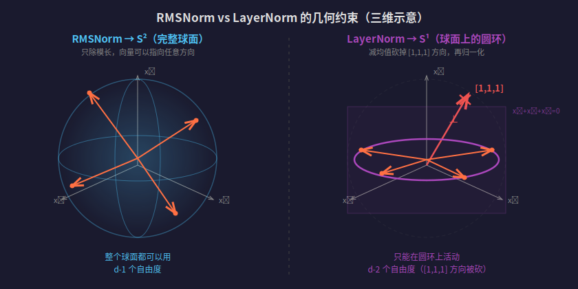
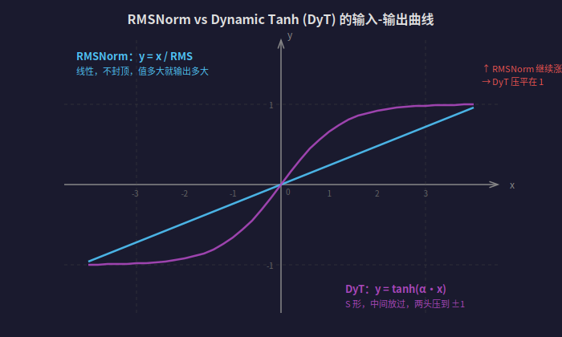

【Normalization】从一道面试题开始——RMSNorm 和 LayerNorm 到底差在哪

━━━━━━━━━━━━━━━━━━━━

◆ 一道陈词滥调的面试题

━━━━━━━━━━━━━━━━━━━━

我看见网上一道陈词滥调的面试题：RMSNorm 和 LayerNorm 的区别？

标准答案大家都会背：LayerNorm 减均值再除标准差，RMSNorm 只除均方根。快一点，效果差不多。面试官点点头，你松一口气，以为过了。

但如果面试官嘚瑟地追一句："为什么少了一步效果还不变？"

其实面试官自己多半也就背了个论文结论。但这个问题本身确实值得讲清楚——**为什么可以少这一步**。

170 期我们从流形几何的角度讲过一句：LayerNorm 约束到 S^{d-2}，RMSNorm 约束到 S^{d-1}，RMSNorm 多保留了一个自由度。当时一笔带过，今天把这句话拆开讲透。

━━━━━━━━━━━━━━━━━━━━

◆ 先把公式写清楚

━━━━━━━━━━━━━━━━━━━━

### LayerNorm

给一个 d 维向量 x = [x₁, x₂, ..., x_d]，LayerNorm 干四步：

1. 算均值：μ = (1/d) Σxᵢ
2. 算方差：σ² = (1/d) Σ(xᵢ - μ)²
3. 归一化：y = (x - μ) / σ
4. 缩放和平移：output = γ · y + β

γ（缩放）和 β（平移）是可学习参数，每个维度各一个。

### RMSNorm

同样的 d 维向量 x，RMSNorm 干三步：

1. 算均方根：RMS = √((1/d) Σxᵢ²)
2. 归一化：y = x / RMS
3. 缩放：output = γ · y

注意没有 β 偏移——原论文（Zhang & Sennrich 2019）就没有。也没有减均值。

区别就在**要不要减均值**这一刀。

────────────────────

### 用具体数字感受一下

拿向量 x = [3, 5, 4] 来算。

**LayerNorm 的处理：**

均值 μ = (3 + 5 + 4) / 3 = 4

减均值：x - μ = [-1, 1, 0]

标准差 σ = √((1 + 1 + 0) / 3) = √(2/3) ≈ 0.816

归一化：y = [-1/0.816, 1/0.816, 0/0.816] ≈ [-1.225, 1.225, 0]

注意看——原来的 [3, 5, 4]，经过 LayerNorm 变成了 [-1.225, 1.225, 0]。方向变了，"3、5、4 的平均值是 4"这个信息被丢掉了。

**RMSNorm 的处理：**

RMS = √((9 + 25 + 16) / 3) = √(50/3) ≈ 4.082

归一化：y = [3/4.082, 5/4.082, 4/4.082] ≈ [0.735, 1.225, 0.980]

方向没变——[0.735, 1.225, 0.980] 和 [3, 5, 4] 指向同一个方向，只是长度缩放到了 √d 附近。均值信息还在。

━━━━━━━━━━━━━━━━━━━━

◆ 几何视角：S^{d-1} vs S^{d-2}

━━━━━━━━━━━━━━━━━━━━

这是 170 期的流形分析展开版。先看一张图：



左边 RMSNorm：向量可以在整个球面上活动，d-1 个自由度。右边 LayerNorm：全 1 向量方向被砍掉，向量只能在球面和超平面交出来的圆环上活动，d-2 个自由度。

### RMSNorm → 投影到 S^{d-1}

RMSNorm 除以均方根，本质上就是把向量除以它的（缩放后的）模长，投影到 d 维空间中的单位球面。d 维空间里的球面是 d-1 维的（因为球面方程 x₁² + x₂² + ... + x_d² = 1 是一个约束，d 个变量减一个约束剩 d-1 个自由度），记作 **S^{d-1}**。

操作很直接：只管长度，不管方向。

### LayerNorm → 投影到 S^{d-2}

LayerNorm 干了两刀：

**第一刀：减均值。** x - μ 这一步，把向量投影到超平面 {x | Σxᵢ = 0}——所有"分量之和为 0"的向量构成的集合。

这个超平面什么形状？低维类比一下：二维里 {x₁ + x₂ = 0} 是一条过原点的直线（斜率 -1）；三维里 {x₁ + x₂ + x₃ = 0} 是一个过原点的平面，和 [1, 1, 1] 方向垂直。d 维同理——一个过原点的 d-1 维超平面，和 [1, 1, ..., 1] 方向垂直。

减均值干的就是：不管你原来的向量指向哪，把它沿着 [1, 1, ..., 1] 方向的分量砍掉，摁到这个超平面上。一个线性约束砍掉一个维度，超平面是 d-1 维的。

**第二刀：除标准差。** 在这个 d-1 维超平面上，再做长度归一化，把向量投影到这个超平面上的单位球面——一个 d-2 维的球面，记作 **S^{d-2}**。

所以 LayerNorm 比 RMSNorm **多砍了一个自由度**。

────────────────────

### 被砍掉的那个维度是什么

全 1 方向编码的是什么？是向量所有分量的均值——可以理解为"这个 token 的整体激活强度"。

比如两个 token 的隐藏状态分别是 [3, 5, 4] 和 [103, 105, 104]。这两个向量本来很不一样——一个比例是 3:5:4，另一个接近 1:1:1。但 LayerNorm 减完均值后，两者都变成 [-1, 1, 0]——完全相同的向量。原本能区分这两个 token 的信息，被一刀砍没了。RMSNorm 不减均值，[3,5,4] 和 [103,105,104] 归一化后方向不同，区分度保留下来。

你可能会反过来问：有没有 RMSNorm 之后一样、LayerNorm 之后反而不一样的情况？在不考虑后面的 γ、β 参数时，不会。RMSNorm 固定的是长度，LayerNorm 固定的是"长度 + 零均值"；后者相当于在前者的球面里再切一个零均值截面。**多一个约束只会让更多不同的向量被压成同一个，不可能凭空多出区分度。**

💡 翻译成人话：RMSNorm 只管你的体重（向量长度），不管你的长相（各分量比例）。LayerNorm 不光管体重，还要求你"不能有偏心"——所有分量的平均值必须是 0。

━━━━━━━━━━━━━━━━━━━━

◆ 为什么砍掉这个维度不影响效果——Gupta 2024 的发现

━━━━━━━━━━━━━━━━━━━━

上面的几何分析是从 RMSNorm 的角度看"LayerNorm 多砍了一个维度"。但大多数人的认知路径是反过来的——先认识 LayerNorm，后来发现 RMSNorm 少一步也行，自然的疑问是：**减均值这一步到底有没有用？不减会不会出问题？**

这个问题的答案，经历了三个阶段：

- **2016 年，Ba et al. 设计 LayerNorm**：他们很清楚直流分量会在点积里淹没有用信号（下面会算一个具体例子），所以主动帮模型减掉。判断是：模型自己处理不好这个问题，得我来帮它。
- **2019 年，Zhang & Sennrich 提出 RMSNorm**：试了一下不减——发现效果一样。但他们没解释为什么。
- **2024 年，Gupta et al. 解释了为什么**：模型自己就会减，你帮它减是多此一举。

2016 年的判断在当时完全合理——那时候模型还小，没人知道梯度下降能不能自己搞定这个问题。帮一把总没坏处。只是后来发现，帮了个寂寞。

Gupta, Ozdemir & Anumanchipalli 2024（arXiv: 2409.12951）做了一个关键实验。他们在 7 个 LLM 上测了隐藏层表征和全 1 向量的夹角：GPT-2 XL、GPT-J、Pythia、Llama-2-7B、Llama-3-8B 等。

结果：**隐藏层表征和全 1 向量的夹角已经是 ~89-90 度。**

89-90 度意味着什么？几乎正交。均值本来就接近 0。LayerNorm 的减均值操作在这些模型上几乎什么都没做——你减了个约等于 0 的数。

更妙的是：用 RMSNorm 训练的模型（Llama 系列）**自发学会了**和全 1 向量正交。没人强制它减均值，它自己训着训着就把均值压到了接近 0。

────────────────────

### 为什么模型会自发正交

这不是巧合，是 attention 的点积结构逼的。用具体数字算一遍就明白了。

假设三维空间，两个 token 的隐藏状态分别是 h₁ = [100, 102, 101]，h₂ = [100, 101, 103]。它们之间真正的差异是什么？是 [0, 2, 1] 和 [0, 1, 3] 之间的关系——各分量偏离均值的那部分。

但 attention 靠点积算相似度。算一下：

```
h₁ · h₂ = 100×100 + 102×101 + 101×103 = 30705
```

把每个向量拆成"均值部分"（直流）和"偏差部分"（交流）：

```
h₁ 的均值部分 ≈ [101, 101, 101]    偏差部分 = [-1, 1, 0]
h₂ 的均值部分 ≈ [101, 101, 101]    偏差部分 = [-1, 0, 2]
```

点积 ≈ 均值部分的点积 + 偏差部分的点积 = 101²×3 + (-1×-1 + 1×0 + 0×2) = 30603 + 1。

30603 是所有 token 对都有的"背景底噪"（因为大家的均值都差不多），真正区分不同 token 的信号只有那个 1。信噪比极低。softmax 出来所有 token 的注意力权重几乎一样大——attention 变成了均匀撒胡椒面，谁也没重点看。

因果链是连着的：loss 下不去 → 预测不准 → attention 分不清哪些 token 重要 → 点积被均值底噪淹没。梯度沿着这条链反向传播，最终的效果就是把均值压小——让每个向量的均值趋近于 0，向量自然就和全 1 方向正交了。

所以不是模型"聪明地学会了正交"，是**不正交 → attention 废了 → loss 降不下去 → 梯度把它逼到那个方向**。

💡 翻译成人话：LayerNorm 强制执行的"减均值"，模型自己就会做——因为不做的话 attention 就废了。就像公司规定"上班不许睡觉"——废话，不醒着就干不了活，大多数人本来就不会上班睡觉。这条规定存在的代价（多一步计算）大于收益。

不过要说清楚一件事：**没有人证明 RMSNorm 比 LayerNorm 效果更好。** 现在更稳的说法是：实验反复支持"去掉减均值不影响效果"——一样好，不是更好。RMSNorm 赢在更快，不是更强。前面那个 [3,5,4] vs [103,105,104] 的例子，看起来 RMSNorm "保留了更多区分度"，但 Gupta 的数据告诉我们：实际模型里那个均值维度的信号已经接近零了——保不保留都一样，因为本来就没什么可保留的。理论上多一个自由度是优势，实际上那个自由度里什么都没有。

━━━━━━━━━━━━━━━━━━━━

◆ 更激进的结论：连 Norm 都可以不要？

━━━━━━━━━━━━━━━━━━━━

如果说 RMSNorm 证明了"减均值可以省"，Zhu, Chen, He, LeCun & Liu 2025（arXiv: 2503.10622，CVPR 2025）走了更远一步：连 Norm 本身都可以换掉。

他们发现 LayerNorm 真正起作用的不是统计量计算（算均值、算方差、除以标准差），而是它产生的 **S 形压缩效果**——中间区域的值基本不变，但极端的大值和小值会被压缩回来。如果你画一条 LayerNorm 的输入-输出曲线，它长得很像 tanh。

基于这个观察，他们提出了 **Dynamic Tanh (DyT)**：

```
output = γ · tanh(α · x) + β
```

一个纯逐元素操作，α 是可学习标量。没有均值、没有方差、没有除法——就一个 tanh。

把一个维度单独拿出来，固定其他维度，画一下两者的有效输入-输出曲线就明白了：



在这个切片上，RMSNorm 更接近线性缩放——值越大输出越大，不主动封顶。DyT 是 S 形曲线——中间区域近似线性，两头压到 ±1。LeCun 团队的发现是：**LayerNorm 实际的输入-输出行为长得像 S 形，不像单纯的线性缩放**。所以真正起作用的未必是统计量本身，而是那个 S 形压缩。

在 LLaMA、ViT、语音模型、DNA 序列建模上，DyT 效果和 LayerNorm / RMSNorm 一样好。

这说明 Norm 的核心价值不是"归一化到球面"，而是**防止激活值炸裂**。RMSNorm 是硬约束——强制投影到球面，不管你想不想。DyT 是软约束——中心区域自由活动，只有快炸的时候才用 tanh 的饱和区压回来。

不过 DyT 主要是训练阶段的结构选择，不是给成品模型做手术的万能补丁——你把一个训好的 LLM 的 RMSNorm 层硬换成 DyT，大概率会直接崩。目前还是研究阶段，生产上的主流公开 LLM 仍然以 RMSNorm 为主。

━━━━━━━━━━━━━━━━━━━━

◆ 2023 年之后，主流公开 LLM 基本都转向 RMSNorm

━━━━━━━━━━━━━━━━━━━━

| 模型 | 发布时间 | Normalization |
|---|---|---|
| T5 1.1（Google） | 2020 | RMSNorm |
| PaLM（Google） | 2022 | RMSNorm |
| LLaMA 1/2/3（Meta） | 2023-2024 | RMSNorm |
| Mistral / Mixtral | 2023-2024 | RMSNorm |
| Qwen 1/2/3（阿里） | 2023-2025 | RMSNorm |
| DeepSeek V2/V3/V4 | 2024-2026 | RMSNorm |
| Gemma 2/3（Google） | 2024-2025 | RMSNorm |

至少在公开架构的主流 decoder-only LLM 里，趋势已经很清楚：能用 RMSNorm，就没人愿意回去多算一次均值。

原论文（Zhang & Sennrich 2019）报告 7%-64% 的加速，精度不掉。后面这一代公开大模型的工程选择，基本也在重复同一个判断——减均值这一刀，既不需要强制做，做了收益也不明显，还多花一次遍历的计算。该砍就砍。

━━━━━━━━━━━━━━━━━━━━

◆ 参考文献

━━━━━━━━━━━━━━━━━━━━

- Root Mean Square Layer Normalization（Zhang & Sennrich, 2019, https://arxiv.org/abs/1910.07467）
- Re-Introducing LayerNorm: Geometric Meaning, Irreversibility and a Comparative Study with RMSNorm（Gupta et al., 2024, https://arxiv.org/abs/2409.12951）
- On Layer Normalization in the Transformer Architecture（Xiong et al., 2020, https://arxiv.org/abs/2002.04745）
- Transformers without Normalization（Zhu et al., CVPR 2025, https://arxiv.org/abs/2503.10622）

━━━━━━━━━━━━━━━━━━━━

// 靳岩岩的 AI 学习笔记 × Claude 的严谨 × Gemini 的浪漫
// 2026-05-15
