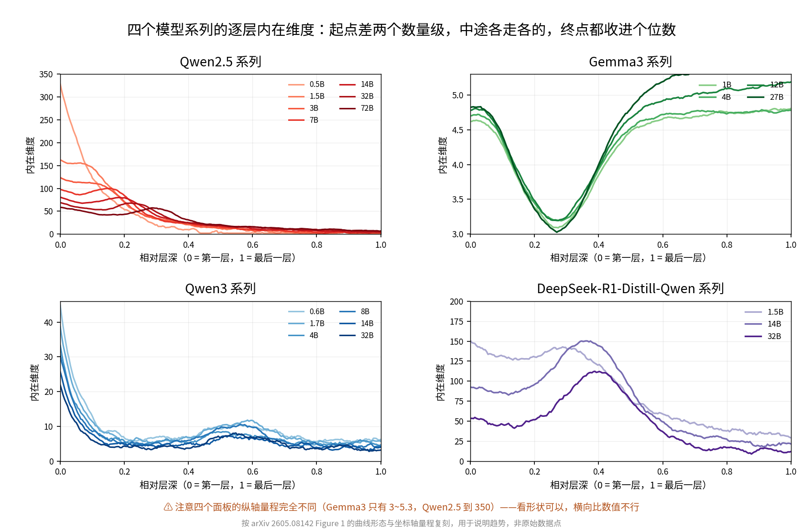
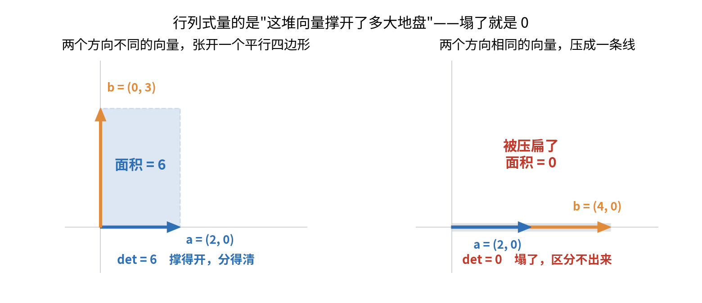

【推理机制】所有大模型推理时都在"降维"，但这解释不了谁更聪明

我们在第 45 期（《高维流形上的神经网络收敛》 https://mp.weixin.qq.com/s/0hOQt8onSJcuZGJLRE46Fw ）讲过一个说法：大模型在万维参数空间里"长出"了一个大约 300-500 维的低维子结构。

这个说法指向一件事：**模型内部的实际活动，远比它名义上的维度要"窄"。**

于是很容易顺出一个结论：窄就是好，模型越会压缩越聪明。

人大 + 清华 + 小米汽车 + 厦大的团队今年 5 月挂到 arXiv 上的一篇论文，《Reasoning emerges from constrained inference manifolds in large language models》，系统地测了这件事。结论的前半段确实如此——**所有模型推理时都在降维，无一例外。**

但也正因为无一例外，它解释不了任何事情。论文原话是这么说的：

> "such geometric compression, although pervasive, is not sufficient for stable or reliable reasoning."
>
> （这种几何压缩虽然普遍存在，但不足以支撑稳定或可靠的推理。）

推理垃圾的 0.5B 小模型也在降维，推理很强的 72B 也在降维。既然大家都在做同一件事，那"降维"这个观察本身就没有区分度。

**真正的问题不是降不降，是降下来之后剩了什么。**

这篇论文有意思的地方全在后半段。

━━━━━━━━━━━━━━━━━━━━

◆ 先把普遍现象说清楚：降维确实是真的

━━━━━━━━━━━━━━━━━━━━

先解释几个词。

**隐状态（hidden states）**：大模型每一层 Transformer 处理完输入后，内部产生的中间表示向量。你给模型一道数学题，它一层一层往下算，每一层都会产生一组向量——这些向量就是隐状态。它们不是最终输出的文字，而是模型"脑子里的草稿纸"。

**流形（manifold）**：高维空间里的低维曲面。想象一张纸，它是三维空间里的二维面——纸面就是三维空间里的一个流形。模型的隐状态名义上有 4096 维（或更高），但如果它们实际上都落在某个低维曲面上，那这个曲面就是流形。

**内在维度（Intrinsic Dimensionality, ID）**：衡量这个流形到底有多少个真正独立的方向。几千维空间里的隐状态如果都落在一个 8 维的曲面上，那 ID 就是 8。论文用的估计方法叫 TLE，属于近邻类算法——只看每个点周围最近的几个邻居是怎么排布的，从这个局部结构反推出维度。这类方法的好处是不假设空间是平的，曲面弯了也能测准。

论文测了四个系列的模型：

| 模型 | 参数量 |
|------|--------|
| Qwen2.5 | 0.5B ~ 72B |
| Qwen3 | 0.6B ~ 32B |
| Gemma 3 | 1B / 4B / 12B / 27B |
| DeepSeek-R1-Distill-Qwen | 1.5B / 14B / 32B |

（这几个系列的 hidden_dim 从 896 一直排到 8192，跨度接近十倍。这个数字是各模型官方配置里的，不是论文报的。）

这里要先说清楚一个前提，不然后面全是误读：**论文测的是每一层最后一个 token 的隐状态。** 模型生成一句话的时候，同一层上会依次冒出一串隐状态，把它们连起来就是一条轨迹——测的是这条轨迹的维度。所以它量的不是"一批句子在某层的表征散得开不开"，而是"模型在生成过程中，这一层的状态是沿着几个方向在走"。

测出来的结果是：

**随着层数加深，隐状态的内在维度急剧下降。论文的说法是"在许多情况下，最终收敛到不到十个自由度"。**

注意"在许多情况下"这个限定，论文自己留了余地——因为四个系列的曲线长得很不一样。

论文把各系列的逐层曲线画在了一起（Figure 1）。横轴是相对层深，0 是第一层、1 是最后一层；纵轴就是内在维度。四个面板的形状分别是：

- **Qwen2.5**：浅层最高能读到 300 以上，前 10% 的层断崖式下坠，之后一路震荡衰减
- **Qwen3**：起点四十上下，0.15 深度之前掉到 10 以内，然后是一段长长的低位震荡
- **Gemma3**：**全程就没超过 6**。而且不是下降曲线，是个浴缸形——先小升，两三成深度处触底，**后半程又一路爬回来**
- **DeepSeek-R1-Distill**：形状最怪，中间鼓一个大包——三到四成深度处 ID 反冲到接近 200，比起点还高，之后才震荡落下来

所以准确的说法不是"所有模型的曲线长得一样"，而是：**起点差着两个数量级、中途各走各的，但终点都收进了个位数。** 论文里另一张图统计了所有模型的最终层 ID，绝大多数落在 2 到 7 之间。

那个中间鼓包也不是噪声。论文提到，能力较弱或较早一代的模型"倾向于表现出更慢、更不稳定的维度下降"——DeepSeek 蒸馏系列那个大包，就是"不稳定"最直观的样子。

更关键的是那个对照组：**静态的词汇嵌入（embedding layer，模型把文字映射成向量的第一步），内在维度依然贴近它的名义维度**——论文的条形图里，这个值几乎和模型的 hidden size 一样长，大模型是几千的量级。

这个对照很重要。如果连词汇嵌入都是低维的，那说明模型压根就没什么表达能力，低维是"穷"。但嵌入层维度很高、推理时才坍缩，说明模型手里的家当还在，它只是在解题时主动只用了一小部分。

────────────────────

💡 这个"坍缩"在解题时意味着什么

模型做数学题的时候，不是 4096 个方向全在乱跑。深层的表现更像一个经验丰富的工程师——面对复杂问题，自动忽略掉 99% 的无关信息，只盯住真正重要的那几个变量。名义上的家当一样多，真正调用的少得多。

────────────────────

到这里为止，故事听着很顺：降维 = 聚焦 = 聪明。

问题是，**那些推理很烂的小模型，降得比谁都狠。**

━━━━━━━━━━━━━━━━━━━━

◆ 降维之后剩了什么：信息体积

━━━━━━━━━━━━━━━━━━━━

论文引入了第二个指标，叫**信息体积（Information Volume, V）**。公式长这样：

`V_l(x) = (1/2) · log det(I + [d_l / T(x)] · Z_l(x) · Z_l(x)ᵀ)`

别被这一串吓跑。公式里最唬人的是 det，而它恰恰是最好懂的一块。

**行列式（determinant）量的就是体积。** 给你两个向量，它们能张开一个平行四边形，行列式就是这个平行四边形的面积；三个向量就是平行六面体的体积；n 个向量就是 n 维空间里的"体积"。名字唬人，干的事就是量个大小。

真正有用的是它什么时候等于零。

两个向量如果方向相同，平行四边形就塌成一条线，面积是 0。三维里如果三个向量落在同一个平面上，体积同样是 0。

**所以 det = 0 的意思是：这堆向量塌了，它们实际占的维度比它们的个数少。** 这正是我们要的那个信号——det 大，说明这些方向各占各的地盘、彼此分得开；det 接近 0，说明名义上有那么多方向，实际全在重复同一件事。

────────────────────

💡 既然量的是面积，为什么叫"行列式"？

因为这个名字来自它最早的用途，跟面积没关系。十七世纪的人解二元一次方程组，消元之后发现分母上总会冒出同一个数（两个方程的系数交叉相乘再相减），而且这个数一旦为零，方程组就没有唯一解。于是它得名 determinant——拉丁词根的意思是"**决定者**"，决定这个方程组解不解得出来。

"det 等于向量张开的面积"这层几何意义，是两百年后才讲清楚的。名字冻在了第一步，含义长在了第二步。中译"行列式"取的是它的长相（从行列排成的方阵里算出来的式子），把"决定者"这层意思丢了。

两层意思其实严丝合缝：det = 0，几何上是向量塌成一条线，代数上是两个方程互为倍数、信息完全重复——**"塌了"和"信息重复了"本来就是同一件事**。这也正是这篇论文要用它的原因。

────────────────────

回到公式，剩下几块也就好念了。

**为什么要取 log？** 因为体积涨得太猛——10 个方向每个撑开 2 倍，体积就是 2¹⁰ = 1024 倍。取对数把它压回人能看的尺度。论文图上 V 的读数是一万到四万多的量级，那已经是取过对数之后的数了。

**那个 I + 是干嘛的？** 是个防炸的垫子。单看 det，数据一旦真塌了（det = 0），log 0 就是负无穷，公式直接爆掉。加上单位矩阵 I，相当于给每个方向都垫了个 1 的底：数据完全塌了就是 log 1 = 0，得零分而不是无穷；撑得开才得正分。

**剩下的**：d_l 是第 l 层的隐藏层宽度，T(x) 是模型生成的 token 数量——两者相除是个归一化系数，因为不同层宽度不同、生成长度也不同，得先拉到同一把尺子上才能比。Z_l(x) 是中心化后的轨迹矩阵，也就是前面说的那条"最后一个 token 的隐状态连成的线"。前面那个 1/2 是这类公式的老传统，不影响趋势。

整句念出来就是：**把这一层生成过程中扫出的那条轨迹看成一堆向量，量一量它们撑开了多大的体积，取个对数。**

维度已经降下来了，那么在剩下的这几个方向上，数据是挤成一团（信息体积低），还是充分展开、彼此可区分（信息体积高）？

────────────────────

💡 用整理书桌理解这两个指标

维度坍缩 = 把一堆杂物归类塞进 3 个抽屉，砍掉的是噪声。信息体积 = 每个抽屉里的东西有没有分门别类码好，保住的是信号。

如果你把所有东西塞进一个抽屉然后一屁股压扁——维度确实很低，抽屉数也少，但你什么都找不着了。低维度是压出来的，可里面装的是不是还能用，得另外量。

────────────────────

论文对这两件事的关系说得很精确：

> "This result demonstrates that dimensional compression during reasoning does not imply information loss. Instead, it reflects a focusing mechanism: deeper layers suppress irrelevant noise (reducing dimensionality) while amplifying task-relevant conceptual variations (increasing information volume)."
>
> （这一结果表明，推理过程中的维度压缩并不意味着信息丢失。相反，它反映了一种聚焦机制：更深的层抑制无关噪声——降低维度，同时放大与任务相关的概念变化——增加信息体积。）

一句话：**好的推理是降维的同时把信号放大，坏的推理是降维的时候把信号和噪声一起压扁了。**

论文单独画了信息体积的逐层曲线，走向和维度正好相反：**所有评测模型的信息体积都随深度上升。** 而且不是匀速上升——前六成的层几乎贴着地面爬，**主要的暴涨发生在最后三成的层里。**

把两件事对起来看，深层网络干的是一件两阶段的活：**先把方向数压下去，再在剩下的这几个方向里把内容铺开。** 前半程做减法，后半程做组织。

（补一句严谨的：维度曲线和信息体积曲线在论文里是两张分开的图，论文并没有把它们叠在同一副坐标里画成一把"剪刀"。这个对照是把两张图放一起看出来的。）

这就解释了开头那个矛盾：小模型不是不会压缩，问题出在压完之后——方向是砍下去了，可该在这几个方向上长出来的结构没长出来。**降维是个动作，不是个成绩。**

━━━━━━━━━━━━━━━━━━━━

◆ 三个条件，缺一不可

━━━━━━━━━━━━━━━━━━━━

把两个指标合起来，论文给出了推理能力的三个必要条件：

1. **表达能力**——静态嵌入的内在维度有多高。这代表模型"认识多少概念"，由预训练决定
2. **几何压缩**——推理时维度坍缩的程度。层越深，无关方向被抑制得越彻底
3. **信息保留**——在压缩后的低维空间里，任务相关的信号有没有被放大

三者缺一不可，缺哪个坏哪样：

- 表达能力弱 → 模型根本不认识足够多的概念，压缩得再漂亮也是在一堆残缺信息里打转
- 几何压缩弱 → 噪声没被过滤掉，深层还在处理无关信息
- 信息保留弱 → 过度压缩，信号和噪声一起被杀

论文还给了一个挺反直觉的观察：

> "Models with similar task accuracy may operate in fundamentally different internal regimes."
>
> （benchmark 准确率相近的模型，内部可能运行在根本不同的机制下。）

一个模型可能靠强表达 + 弱压缩拿分，另一个靠弱表达 + 强压缩 + 好的信息保留拿分——最终分数差不多，内部动力学完全不同。

这句话对天天看榜单选模型的人是个提醒：**分数相同不代表这两个模型是一类东西**，换个任务分布，它们的表现可能立刻分家。

━━━━━━━━━━━━━━━━━━━━

◆ 一把不看答案的尺子

━━━━━━━━━━━━━━━━━━━━

三个条件摆完了，论文的杀手锏来了：把它们塞进一个公式，做成一个叫 **H** 的诊断指标。

`H = log(D_world) · [V / exp(ε · D_stim)]`

其中 D_world 是静态嵌入的内在维度（表达能力），V 是信息体积（信息保留），D_stim 是推理时隐状态的内在维度（几何压缩），ε 是惩罚系数——**论文里所有模型统一固定为 0.1，没有逐模型调参。**

这个公式在说：**推理能力 = 表达能力 × 信息保留 / 几何压缩不足的指数惩罚**。表达能力取对数（边际收益递减），信息保留线性正比，该压缩的没压缩下去就指数级扣分。

关键在于：**H 的计算完全不需要看答案。** 不需要标注数据，不需要跑题对答案，只要给模型喂一批输入、抽出隐状态、算维度和信息体积就行。论文用的标准化输入是 MMLU 的 "Other" 子集。

结果是：**H 和 benchmark 得分的 Spearman 秩相关系数，在所有评测基准上都超过 0.9。**

0.9 是什么概念？统计上 0.7 以上就算强相关了，0.9 以上基本就是"看这个指标约等于看那个指标"的程度。

而且别忘了 ε 是全程固定 0.1 的。**一个没有逐模型调参的公式，跨四个系列、跨百倍参数量，还能和榜单排名对上 0.9——这比相关系数本身更能说明问题**，因为它排除了"指标是硬凑出来的"这种可能。

────────────────────

💡 这把尺子省掉了什么

以前想知道一个模型推理强不强，得跑一整套题然后对答案，题目、标注、评分一样都不能少。现在只要看看它的草稿纸长什么样——维度降没降、信息散没散——就能先预判个八九不离十。省掉的不是计算量，是那套需要标准答案的评测流程。

────────────────────

需要说清楚的是：**H 衡量的不是某一次推理答对没答对，而是模型的"推理体质"** ——内部几何结构适不适合做推理。就像体检报告量的是心肺功能和肌肉力量，不是某场比赛的成绩。体质好的运动员大概率跑得快，但个别比赛也可能发挥失常。

H 里三个变量的性质也不一样：D_world 是静态嵌入的维度，模型加载完就定了；D_stim 和 V 则取决于你喂什么输入——题目难度不同，坍缩程度和信息保留量都会变。所以论文的做法是喂一批标准化输入取平均。论文报告结果在不同模型系列、参数规模和刺激子集之间保持一致，说明 H 主要还是由模型自身结构决定的。

这把尺子最有价值的地方，是它天然免疫刷榜。benchmark 可以被训练数据污染，可以被针对性优化，但 H 量的是模型内部的几何形状，跟测试集里有什么题没关系。论文自己也把它定位成"benchmark 式评估的补充框架"，而不是替代品。

对实际工作，有两个用得上的场景：

**模型选择。** 面前十个开源模型不知道选哪个，以前要每个都跑完整套 benchmark。现在喂几批样本、抽隐状态、算指标，就能先排出大致顺序，再决定谁值得认真评测。

**训练诊断。** 微调的时候除了看 loss 和验证集，还可以盯着这三个量的配合——如果维度压得越来越狠而信息体积在掉，那就是压过头了，信号正在被一起碾平。

不过这两条都是这套框架的自然推论，论文本身并没有做微调前后的对照实验，别当成已验证的结论用。

顺带说一句，H 这个指标的构成本身，和我们在第 213 期（《SFT、RL、DPO、蒸馏…这些花活儿，到底动了模型哪根筋？》 https://mp.weixin.qq.com/s/kMwrIfhIfPlOHqeeUhuwow ）的结论是对得上的。那期的一句话是：**没有任何一种后训练能造出地形上本来不存在的山，能力都是预训练给的，后训练只决定你走到哪座山。**

H 的三个零件恰好是这句话的算术版：D_world 是静态嵌入的维度，模型加载完就定死了，这是地形本身；D_stim 和 V 描述的是模型解题时在这片地形上怎么走。**山是预训练造的，后训练只挑路。**

不过论文没有专门做后训练前后的对照实验，所以这只是两条线索指向同一个方向，不是这篇论文验证过的结论。

━━━━━━━━━━━━━━━━━━━━

◆ 总结

━━━━━━━━━━━━━━━━━━━━

三句话：

**第一，大模型推理时隐状态会坍缩到极低的维度，这是所有模型的共同行为——正因为共同，它不解释谁更聪明。**

**第二，区分好坏的是降维时信号有没有被同步放大。压缩是动作，信息体积才是成绩。**

**第三，把表达能力、几何压缩、信息保留组合成一个不看答案的指标，跨四个模型系列和百倍参数量，和 benchmark 排名的相关性超过 0.9，而且惩罚系数全程没调过参。**

最后补一句边界，顺便接一件我们自己干过的事。

这篇论文测的是**推理过程中隐状态的动态维度**——模型做题时草稿纸的形状。它和另一个问题是分开的：预训练权重本身，几何结构是几维的？前者是一次推理的切片，后者是模型的底子。

后面这个问题我们在第 194 期（《权重空间是弯曲的——满秩是假象，流形只有百维》 https://mp.weixin.qq.com/s/cG5eF1vHbSnh1j7jQelSLw ）自己动手量过。用的尺子叫 TwoNN——和这篇论文用的 TLE 是同一族的近邻类估计器，都只看每个点的局部邻居怎么排布，不假设空间是平的。我们把 DeepSeek V4 的权重矩阵行向量当点云跑了一遍：线性方法（eRank）说几乎满秩，1000 到 3600 维；TwoNN 说 30 到 277 维。**差了一个数量级。**

当时我们把这个差距解释成"权重空间是弯曲的，线性方法把弯曲误认成了多出来的维度"。**这个解释后来被我们自己推翻了。** 第 200 期（《满秩是假象——48 个抽屉撑开了一个柜子》 https://mp.weixin.qq.com/s/BsATyxtyK46XZDIzmtsTWw ）查明：那个数量级的差距，绝大部分来自**多个 head 被拼在同一张矩阵里**。一个 q_proj 矩阵把 48 个 attention head 的权重拼成一张大表，k 个子空间拼在一起，eRank 大约等于 k 乘 d，TwoNN 大约等于 d，两者的比值约等于 k——**它是子空间数量的代理指标，不是曲率指标。** 按 head 分开单独测，比值就从上百倍掉到 2 倍左右。

修正后的结论是：**权重不是揉成一团的连续流形，而是一堆低复杂度子空间被分格摆放、相互隔离。**

绕这么一圈说这段，是因为它和今天这篇论文讲的是同一个道理，只是站在不同的位置上。

我们在权重上踩的坑，是**把"包围盒很大"当成了"结构很复杂"**——数出来的维度多，不代表里面装的东西多，也可能只是很多简单的东西被摆在了不同格子里。而这篇论文提醒的是反过来的那一半：**维度数得少，也不代表模型抓住了重点**，也可能只是把信号和噪声一起压扁了。

一个是维度虚高，一个是维度虚低。两边犯的其实是同一种错——**光数方向的个数，不看那些方向里到底有什么。** 论文给出的补丁叫信息体积，我们给出的补丁叫按功能边界分开测。都是同一件事：**别只数抽屉，得打开看看。**

**模型好不好，别光看它答对了几道题。看看它的草稿纸。**

━━━━━━━━━━━━━━━━━━━━

◆ 参考资料

━━━━━━━━━━━━━━━━━━━━

- Ma et al., Reasoning emerges from constrained inference manifolds in large language models, arXiv:2605.08142（人民大学 + 清华 + 小米汽车 + 厦门大学，2026-05；本文全部数据与图形出处）

━━━━━━━━━━━━━━━━━━━━

金句：

**降维是个动作，不是个成绩。**

**分数一样，不代表这两个模型是一类东西。**

**一个没调过参的公式能对上榜单，比相关系数本身更值钱。**

━━━━━━━━━━━━━━━━━━━━

// 靳岩岩的 AI 学习笔记 × Claude 的严谨 × Gemini 的浪漫
// 2026-07-27
