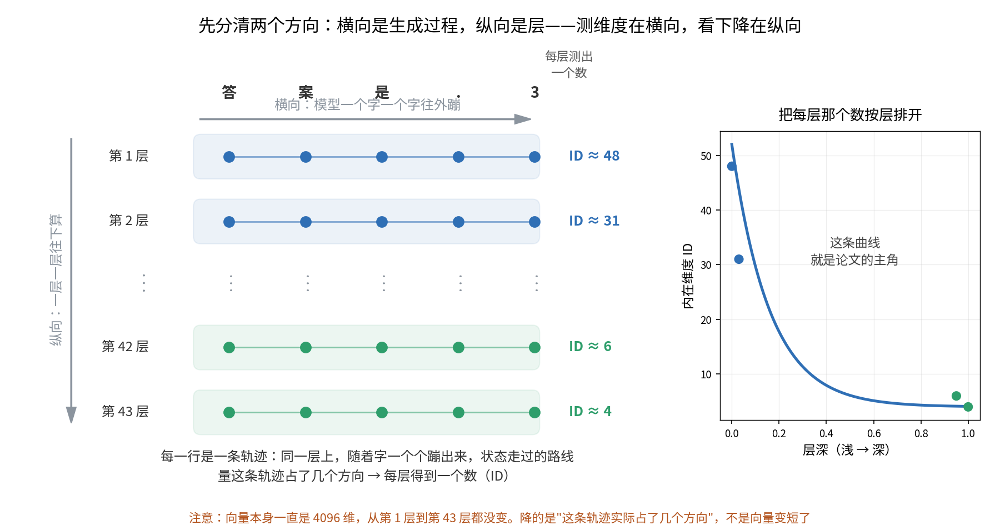

【推理机制】所有大模型推理时都在"降维"，但这解释不了谁更聪明

我们在第 45 期（《高维流形上的神经网络收敛》 https://mp.weixin.qq.com/s/0hOQt8onSJcuZGJLRE46Fw ）讲过一个说法：大模型在万维参数空间里"长出"了一个大约 300-500 维的低维子结构。这类说法这两年到处都是——模型内部会压缩、会聚焦、会收敛到低维。

听多了就容易顺出一个结论：**压缩得越狠的模型越聪明。**

人大 + 清华 + 小米汽车 + 厦大的团队今年 5 月挂到 arXiv 上的一篇论文，把这件事系统地测了一遍。结论的前半段确实成立——**所有模型推理时都在降维，无一例外。** 但论文接着说了句要紧的：

> "such geometric compression, although pervasive, is not sufficient for stable or reliable reasoning."
>
> （这种几何压缩虽然普遍存在，但不足以支撑稳定或可靠的推理。）

推理稀烂的 0.5B 小模型也在降维，推理很强的 72B 也在降维。**一个所有模型都满足的性质，是解释不了它们之间的差别的。**

所以这篇文章要讲三件事，一件比一件往下：

1. 那个"降维"到底是什么在降——这件事不说清楚，后面全是空话
2. 既然人人都降，真正拉开差距的是什么
3. 把这些量拼起来，能不能不看答案就判断一个模型推不推得动

━━━━━━━━━━━━━━━━━━━━

◆ 第一件事：到底是什么在降维

━━━━━━━━━━━━━━━━━━━━

这是全文的地基，得先把两个方向分清楚，不然后面每句话都会歧义。

模型生成一句话，比如"答案是 3"，是一个字一个字往外蹦的。**每蹦一个字，整个网络要从头到尾跑一遍**——第 1 层算到第 43 层，才吐出这一个字。

于是有了两个方向：

- **横向**：字一个个往外蹦，这是生成过程
- **纵向**：每个字都要从第 1 层走到第 43 层，这是网络深度

现在盯住**任意固定的某一层**，比如第 20 层。这一层上会先后出现一串隐状态——第一个字经过它时留下一个，第二个字经过它时又留下一个……把这些点连起来，就是一条**轨迹**。

**论文量的就是这条轨迹占了几个方向。**

每一层各有一条这样的轨迹，各测出一个数。43 层就是 43 个数，把它们按层排开画成曲线——**这条曲线才是论文的主角。**

所以那两个方向的分工是：**测维度在横向（沿着生成过程），看下降在纵向（沿着层）。**

这里有个最容易误解的地方，必须说死：**向量本身一直是 4096 维，从第 1 层到第 43 层从来没变过。** 降的不是向量长度，是这条轨迹**实际铺开的范围**——那几百个点没有散布在整个 4096 维空间里，而是全都挤在一个很薄的片上。深层的片比浅层的更薄。

────────────────────

💡 隐状态是什么，可以当成思维链来理解

隐状态就是模型"脑子里的草稿纸"——每一层处理完之后产生的中间向量，不是它最终吐出来的字。

如果觉得抽象，可以当成一条看不见的思维链：模型嘴上说"答案是 3"，脑子里其实一路走过了一串状态。区别在于，思维链是它写出来给你看的文字，隐状态是它没说出口的那部分，而且**每一层都有自己的一条**。

────────────────────

顺带把三个词交代清楚。

**流形**：高维空间里的低维曲面。一张纸是三维空间里的二维面，纸面就是三维空间里的一个流形。上面说的"很薄的片"，正式名字就是流形。

**内在维度（Intrinsic Dimensionality, ID）**：这个片实际有几个独立方向。4096 维空间里的一堆点如果都落在一个 8 维的面上，ID 就是 8。

**怎么测**：论文用的方法叫 TLE，属于近邻类算法——只看每个点周围最近的几个邻居怎么排布，从局部结构反推维度。好处是不假设空间是平的，片弯了也测得准。

━━━━━━━━━━━━━━━━━━━━

◆ 曲线长什么样：终点一致，路数各异

━━━━━━━━━━━━━━━━━━━━

论文测了四个系列：Qwen2.5（0.5B~72B）、Qwen3（0.6B~32B）、Gemma3（1B/4B/12B/27B）、DeepSeek-R1-Distill-Qwen（1.5B/14B/32B），参数量跨了两个数量级。

结果论文这么写：**随着层数加深，内在维度急剧下降，"在许多情况下"最终收敛到不到十个自由度。**

"在许多情况下"这个限定是论文自己加的，因为四条曲线长得很不一样。

- **Qwen2.5**：浅层能读到 300 以上，前 10% 的层断崖式下坠，之后一路震荡衰减
- **Qwen3**：起点四十上下，很快掉到 10 以内，然后一段长长的低位震荡
- **Gemma3**：**全程没超过 6**。而且不是下降曲线，是个浴缸形——触底之后后半程一路爬回来
- **DeepSeek-R1-Distill**：中间鼓一个大包，三四成深度处反冲到接近 200，比起点还高

所以准确的说法不是"大家长得一样"，而是：**起点差着两个数量级、中途各走各的，但终点都收进了个位数**（论文统计所有模型的最终层 ID，绝大多数落在 2 到 7 之间）。

那个中间鼓包也不是噪声。论文提到，能力较弱或较早一代的模型"倾向于表现出更慢、更不稳定的维度下降"——DeepSeek 蒸馏系列那个大包，就是"不稳定"最直观的样子。

还有一个对照组很重要：**静态的词汇嵌入**（模型把文字映射成向量的第一步，还没开始推理），内在维度依然贴近它的名义维度，大模型是几千的量级。

这个对照说明坍缩不是"穷"。如果连词汇嵌入都是低维的，那是模型压根没什么家当；家当明明有几千维，推理时才收到个位数——**说明它是主动只用了一小部分。**

────────────────────

💡 这个"收敛"在解题时意味着什么

模型做数学题的时候，不是 4096 个方向全在乱跑。深层的表现更像一个经验丰富的工程师——面对复杂问题，自动忽略掉 99% 的无关信息，只盯住真正重要的那几个变量。

家当一样多，真正调用的少得多。

────────────────────

到这儿故事听着很顺：降维 = 聚焦 = 聪明。

**问题是，那些推理很烂的小模型，降得比谁都狠。**

Gemma3 全程不到 6 个自由度，比谁都"聚焦"，但它显然不是四个系列里推理最强的。光看这条曲线，根本排不出高下。

━━━━━━━━━━━━━━━━━━━━

◆ 第二件事：那到底什么才拉开差距

━━━━━━━━━━━━━━━━━━━━

既然人人都降维，那就得再问一句：**降完之后，剩下的那几个方向里装的是什么？**

这就是论文第二个指标要回答的问题。同样是收到 8 个方向，可以是 8 个各司其职的方向，也可以是 8 个在重复同一件事的方向——**方向数一样，含金量差远了。**

论文管这个叫**信息体积（Information Volume, V）**：

`V_l(x) = (1/2) · log det(I + [d_l / T(x)] · Z_l(x) · Z_l(x)ᵀ)`

别被这一串吓跑。公式里最唬人的是 det，而它恰恰是最好懂的一块。

**行列式（determinant）量的就是体积。** 两个向量能张开一个平行四边形，行列式就是它的面积；三个向量就是平行六面体的体积；n 个向量就是 n 维空间里的"体积"。名字唬人，干的事就是量个大小。

真正有用的是它什么时候等于零。

两个向量如果方向相同，平行四边形就塌成一条线，面积是 0。三维里如果三个向量落在同一个平面上，体积同样是 0。

**所以 det = 0 的意思是：这堆向量塌了，它们实际占的地盘比它们的个数少。** 这正是我们要的信号——det 大，说明这些方向各占各的地盘；det 接近 0，说明名义上有那么多方向，实际全在重复同一件事。

────────────────────

💡 既然量的是面积，为什么叫"行列式"？

因为这个名字来自它最早的用途，跟面积没关系。十七世纪的人解二元一次方程组，消元之后发现分母上总会冒出同一个数（系数交叉相乘再相减），而且这个数一旦为零，方程组就没有唯一解。于是它得名 determinant——拉丁词根的意思是"**决定者**"，决定这个方程组解不解得出来。

"det 等于向量张开的面积"这层几何意义，是两百年后才讲清楚的。名字冻在了第一步，含义长在了第二步。中译"行列式"取的是它的长相（从行列排成的方阵里算出来的式子），把"决定者"这层意思丢了。

两层意思其实严丝合缝：det = 0，几何上是向量塌成一条线，代数上是两个方程互为倍数、信息完全重复——**"塌了"和"信息重复了"本来就是同一件事**。

────────────────────

回到公式，剩下几块也就好念了。

**为什么取 log？** 因为体积涨得太猛——10 个方向每个撑开 2 倍，体积就是 1024 倍。取对数压回人能看的尺度。

**那个 I + 是干嘛的？** 是个防炸的垫子。数据一旦真塌了（det = 0），log 0 就是负无穷，公式直接爆掉。加上单位矩阵 I，相当于给每个方向垫了个 1 的底：完全塌了就是 log 1 = 0，得零分而不是无穷。

**剩下的**：d_l 是这一层的隐藏层宽度，T(x) 是生成的 token 数量，两者相除是归一化系数——不同层宽度不同、生成长度也不同，得先拉到同一把尺子上。Z_l(x) 就是前面说的那条轨迹（中心化之后）。前面的 1/2 是老传统，不影响趋势。

整句念出来就是：**把这一层的那条轨迹看成一堆向量，量一量它们撑开了多大的地盘，取个对数。**

────────────────────

💡 用整理书桌理解这两个指标

维度坍缩 = 把一堆杂物归类塞进 3 个抽屉，砍掉的是噪声。信息体积 = 每个抽屉里的东西有没有分门别类码好，保住的是信号。

如果你把所有东西塞进一个抽屉然后一屁股压扁——抽屉数确实少了，维度确实低了，但你什么都找不着。**低维度是压出来的，可里面装的还能不能用，得另外量。**

────────────────────

量出来的结果，正好和维度反着走：

> "This result demonstrates that dimensional compression during reasoning does not imply information loss. Instead, it reflects a focusing mechanism: deeper layers suppress irrelevant noise (reducing dimensionality) while amplifying task-relevant conceptual variations (increasing information volume)."
>
> （推理过程中的维度压缩并不意味着信息丢失。相反，它反映了一种聚焦机制：更深的层抑制无关噪声——降低维度，同时放大与任务相关的概念变化——增加信息体积。）

**所有评测模型的信息体积都随深度上升**，而且不是匀速——前六成的层几乎贴着地面爬，**主要的暴涨发生在最后三成的层里。**

两件事对起来，深层网络干的是一件两阶段的活：**先把方向数压下去，再在剩下的这几个方向里把内容铺开。** 前半程做减法，后半程做组织。

于是开头那个矛盾解开了：**小模型不是不会压缩，是压完之后没长出东西来。** 方向砍下去了，可该在这几个方向上组织起来的结构没有。

**降维是个动作，不是个成绩。**

━━━━━━━━━━━━━━━━━━━━

◆ 第三件事：能不能不看答案就判断模型行不行

━━━━━━━━━━━━━━━━━━━━

有了两个指标，论文把推理能力分成三个必要条件：

1. **表达能力**——词汇嵌入的维度有多高，代表模型"认识多少概念"，由预训练决定
2. **几何压缩**——推理时维度收得够不够，代表会不会抓重点
3. **信息保留**——收下来的那几个方向里装没装东西

缺哪个坏哪样：

- 表达能力弱 → 认识的概念就不够，压缩得再漂亮也是在残缺信息里打转
- 几何压缩弱 → 噪声没滤掉，深层还在处理无关信息
- 信息保留弱 → 压过头了，信号和噪声一起被碾平

三个数塞进一个公式，就是论文的杀手锏 **H**：

`H = log(D_world) · [V / exp(ε · D_stim)]`

D_world 是词汇嵌入的内在维度（表达能力），V 是信息体积（信息保留），D_stim 是推理时的内在维度（几何压缩），ε 是惩罚系数——**论文里所有模型统一固定为 0.1，没有逐模型调参。**

公式在说：**推理能力 = 表达能力 × 信息保留 / 压缩不足的指数惩罚**。表达能力取对数（边际收益递减），信息保留线性正比，该收的没收下去就指数级扣分。

关键在于：**算 H 完全不需要看答案。** 不需要标注数据，不需要跑题对分，只要喂一批输入、抽出隐状态、算维度和信息体积。论文用的标准化输入是 MMLU 的 "Other" 子集。

结果是：**H 和 benchmark 得分的 Spearman 秩相关系数，在所有评测基准上都超过 0.9。**

统计上 0.7 以上就算强相关，0.9 以上基本就是"看这个指标约等于看那个指标"。而且别忘了 ε 是全程固定的——**一个没有逐模型调参的公式，跨四个系列、跨百倍参数量，还能和榜单排名对上 0.9**，这比相关系数本身更能说明问题，因为它排除了"指标是硬凑出来的"这种可能。

────────────────────

💡 这把尺子省掉了什么

以前想知道一个模型推理强不强，得跑一整套题然后对答案，题目、标注、评分一样都不能少。现在只要看看它的草稿纸长什么样——维度收没收、信息散没散——就能先预判个八九不离十。

省掉的不是计算量，是那套需要标准答案的评测流程。

────────────────────

还有一个副产品值得说。论文发现：**benchmark 准确率相近的模型，内部可能运行在根本不同的机制下。**

一个模型可能靠强表达 + 弱压缩拿分，另一个靠弱表达 + 强压缩 + 好的信息保留拿分——最终分数差不多，内部动力学完全不同。**分数相同不代表这两个模型是一类东西**，换个任务分布，表现可能立刻分家。

顺带一提，H 这个指标的构成，和我们在第 213 期（《SFT、RL、DPO、蒸馏…这些花活儿，到底动了模型哪根筋？》 https://mp.weixin.qq.com/s/kMwrIfhIfPlOHqeeUhuwow ）的结论对得上。那期说：**没有任何一种后训练能造出地形上本来不存在的山，能力都是预训练给的，后训练只决定你走到哪座山。** H 的三个零件恰好是这句话的算术版——D_world 加载完就定死了，那是地形本身；D_stim 和 V 描述的是模型解题时在这片地形上怎么走。

不过论文没做后训练前后的对照实验，这只是两条线索指向同一个方向，不是它验证过的结论。

━━━━━━━━━━━━━━━━━━━━

◆ 我们自己在这件事上栽过一次

━━━━━━━━━━━━━━━━━━━━

最后说一件相关的旧事，因为我们踩过一个对称的坑。

这篇论文测的是**推理时那条轨迹**的维度。另一个问题是分开的：**预训练权重本身**，几何结构是几维的？前者是模型解题时的动态，后者是模型的底子。

后面这个问题我们在第 194 期（《权重空间是弯曲的——满秩是假象，流形只有百维》 https://mp.weixin.qq.com/s/cG5eF1vHbSnh1j7jQelSLw ）自己动手量过。把 DeepSeek V4 的权重矩阵行向量当点云跑了一遍：线性方法（eRank）说几乎满秩，1000 到 3600 维；近邻方法（TwoNN，和这篇论文的 TLE 同族）说 30 到 277 维。**差了一个数量级。**

当时我们把这个差距解释成"权重空间是弯曲的，线性方法把弯曲误认成了多余的维度"。**这个解释后来被我们自己推翻了。**

第 200 期（《满秩是假象——48 个抽屉撑开了一个柜子》 https://mp.weixin.qq.com/s/BsATyxtyK46XZDIzmtsTWw ）查明：那个数量级的差距，绝大部分来自**多个 head 被拼在同一张矩阵里**。一个 q_proj 把 48 个 attention head 的权重拼成一张大表，k 个子空间拼在一起，eRank 大约等于 k 乘 d，近邻方法大约等于 d，比值约等于 k——**它是子空间数量的代理指标，不是曲率指标。** 按 head 分开单独测，比值就从上百倍掉到 2 倍左右。

修正后的结论是：**权重不是揉成一团的连续流形，而是一堆低复杂度子空间被分格摆放、相互隔离。**

说这段是因为它和今天这篇论文讲的是同一个道理，只是站在相反的位置上。

我们在权重上踩的坑，是**把"包围盒很大"当成了"结构很复杂"**——数出来的方向多，不代表里面装的东西多，也可能只是很多简单的东西被摆在了不同格子里。而这篇论文提醒的是另一半：**方向数得少，也不代表模型抓住了重点**，也可能只是把信号和噪声一起压扁了。

一个是虚高，一个是虚低。两边犯的其实是同一种错——**光数方向的个数，不看那些方向里到底有什么。**

━━━━━━━━━━━━━━━━━━━━

◆ 总结

━━━━━━━━━━━━━━━━━━━━

**第一，所谓"降维"，降的是同一层上那条隐状态轨迹占了几个方向，不是向量变短了。所有模型都在降——正因为都在降，它解释不了谁更聪明。**

**第二，拉开差距的是降完之后剩了什么。深层网络前半程做减法、后半程做组织，压缩和铺开是两件事，得分开量。**

**第三，把表达能力、几何压缩、信息保留拼成一个不看答案的指标，跨四个模型系列、跨百倍参数量，和 benchmark 排名的相关性超过 0.9，惩罚系数全程没调过参。**

**别只数抽屉，得打开看看。模型好不好，也别光看它答对了几道题——看看它的草稿纸。**

━━━━━━━━━━━━━━━━━━━━

◆ 参考资料

━━━━━━━━━━━━━━━━━━━━

- Ma et al., Reasoning emerges from constrained inference manifolds in large language models, arXiv:2605.08142（人民大学 + 清华 + 小米汽车 + 厦门大学，2026-05；本文全部数据与图形出处）

━━━━━━━━━━━━━━━━━━━━

降维是个动作，不是个成绩。

分数一样，不代表这两个模型是一类东西。

一个没调过参的公式能对上榜单，比相关系数本身更值钱。

━━━━━━━━━━━━━━━━━━━━

// 靳岩岩的 AI 学习笔记 × Claude 的严谨 × Gemini 的浪漫
// 2026-07-27
