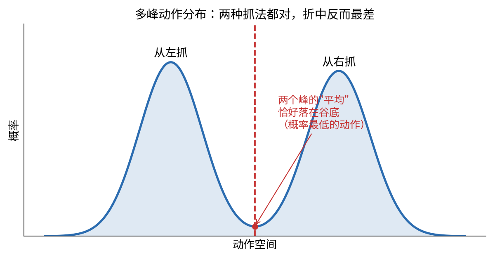
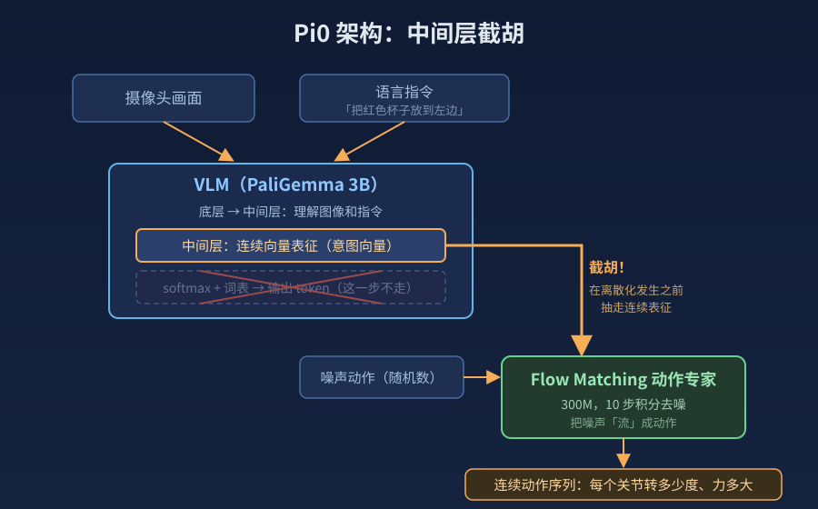

【机器人AI】VLA 三年战记：从 RT-2 到 π*0.6，大模型怎么长出手臂

━━━━━━━━━━━━━━━━━━━━

◆ 前情提要

━━━━━━━━━━━━━━━━━━━━

第 146 到 150 期我们聊过机器人 AI 的入门（合集： https://mp.weixin.qq.com/s/jFWX0y8aL5FHMADdNIR2RA ）——MuJoCo 物理引擎、Diffusion Policy 扩散策略、Push-T 推积木。那个系列讲清楚了"怎么控制"：给模型一张图，它输出关节位移。

但有个问题没碰：**原版 Diffusion Policy 只根据视觉和机器人状态生成动作，语言并不在它的输入里。**

你对着原版 Diffusion Policy 说"把红色杯子递给我"，它不知道你在说什么。它可以在训练过的任务分布里根据画面生成动作，却不能靠一句自然语言指令调用互联网上学来的物体概念和常识。要换到差异很大的新任务，通常还得补数据、再训练。

VLA（Vision-Language-Action）就是为了解决这件事：把"看懂"和"听懂"和"动手"连成一条链。

━━━━━━━━━━━━━━━━━━━━

◆ VLA 是什么

━━━━━━━━━━━━━━━━━━━━

VLA = Vision + Language + Action，视觉-语言-动作三合一模型。

```
输入：摄像头画面 + 语言指令（"把红色杯子放到左边"）
输出：机器人动作序列（每个关节的角度/位移）
```

和纯 Diffusion Policy 的区别一张表讲清楚：

| | Diffusion Policy | VLA |
|---|---|---|
| 视觉输入 | 有 | 有 |
| 语言输入 | 无 | 有 |
| 输出 | 连续动作 | 连续动作 或 离散 token |
| 换任务 | 通常补数据、再训练 | 可用语言切换已学技能，并尝试泛化到新组合 |
| 模型规模 | 取决于视觉骨架和策略网络 | 从数亿到数百亿参数都有 |

VLA 的共同目标，是用一个模型把视觉、语言和动作连起来。具体实现并不只有"给多模态大模型接一个头"：RT-2 把动作写进语言词表，π0 则让 VLM 与动作专家在同一个 Transformer 里通过注意力交换信息。

但这里有一个根本性的技术矛盾。

━━━━━━━━━━━━━━━━━━━━

◆ 核心矛盾：离散 vs 连续

━━━━━━━━━━━━━━━━━━━━

大语言模型的输出是**离散**的。它从一个词表（比如 32000 个 token）里选一个概率最高的 token 输出。这是分类问题——softmax 接 argmax，从有限选项里选一个。

机器人的动作是**连续**的。一个 6-DOF 机械臂的关节角度是 6 个实数，比如 [0.314, -1.207, 0.853, -0.042, 1.571, 0.000]，每个值可以是任意浮点数。这是回归问题。

矛盾来了：**怎么把一个离散的语言模型，接到一个连续的运动控制系统上？**

这是 VLA 过去三年的一条主要技术线。围绕动作表示和生成方式，出现了两类代表方案：

```
路线 A（离散化）：把连续动作量化成离散 token，让语言模型直接预测
路线 B（混合架构）：语言模型负责理解，另接一个连续生成器负责动作
```

下面按时间线，看这两类方案怎么各自发展，又怎样在 π0 里接到了一起。

━━━━━━━━━━━━━━━━━━━━

◆ RT-2（Google, 2023.07）：给 VLA 定下名字

━━━━━━━━━━━━━━━━━━━━

RT-2 走的是路线 A——把动作变成 token。

思路非常暴力：把机器人动作向量的每个维度分成 256 档（0 到 255），每一档对应一个整数。连续动作于是变成一串整数 token，可以和文字答案放进同一种输出格式。不同 RT-2 变体使用的机器人和动作空间并不完全相同，关键不是"七个关节"，而是**逐维量化成 256 档**。

────────────────────

💡 量化过程：一把尺子平分 256 格

拿一个归一化动作向量里的两个分量来算。假设它们的范围都是 [-1.0, 1.0]：

```
连续值 0.314 → 量化 → round((0.314 - (-1.0)) / (1.0 - (-1.0)) × 255) = round(167.535) = 168
连续值 -0.042 → 量化 → round((-0.042 - (-1.0)) / (1.0 - (-1.0)) × 255) = round(122.145) = 122
```

每个动作维度都变成一个 0 到 255 的整数。假设这个控制接口恰好有 7 个维度，模型输出的序列就会像这样：

```
[图像 + 语言条件] → [168, 58, 201, 122, 200, 128, 255]
                    ↑ 7 个量化后的动作维度
```

────────────────────

这样做的好处：**概念极其简单。** 动作变成 token 后，训练目标仍是标准的下一个 token 预测（next token prediction），大模型的注意力、词表和训练框架大都可以复用。当然，机器人观测、动作编码和数据混合管线仍然要专门改。

RT-2 的大版本以 PaLI-X 为骨架——Google 自研的 55B 视觉语言模型——在网页视觉语言任务和机器人轨迹上联合微调。论文还做了一个基于 PaLM-E 的较小版本。2023 年年中能直接拿来做这件事的强力开源 VLM 还很少；一年后，OpenVLA 才把这条路线真正做成开源方案。

────────────────────

💡 为什么敢用 55B：大就是卖点

RT-2 的完整思路是：拿一个已经在互联网规模的图文数据上训好的 VLM，让它**带着全部世界知识**去学机器人动作。联合微调时网页图文数据和机器人数据一起喂，专门防止模型把互联网上学的知识忘掉。

效果就是论文标题说的"网页知识迁移到机器人控制"。机器人训练数据里从来没有的概念，它靠网页知识能接住：

- 指令"把香蕉放到 2 加 1 的结果上"——桌上摆着数字卡片，它把香蕉放到了 3 上。加法是网页上学的，机器人数据里没有
- 指令"捡起灭绝的动物"——桌上一堆玩具，它抓起了恐龙。"恐龙 = 灭绝动物"这个知识来自互联网
- 指令要求根据图标、数字或语义类别选择目标——模型能把网页预训练里学到的概念带进机器人任务

在论文设置的未见物体、背景和环境测试上，RT-2 的泛化成功率从 RT-1 的 32% 提高到 62%。**这在 2023 年是爆炸性的**：它用大规模网页预训练显著拓宽了一个端到端机器人策略能接住的概念范围。当然，这不等于机器人从此"认识整个互联网"。

所以 55B 不是失误，是宣言：视觉语言模型的知识可以迁移到机器人控制。后来许多 VLA 沿用了"先拿预训练 VLM 当骨架，再教它动手"这个大前提；真正分叉的地方，是数据怎样混合、动作怎样表示、策略怎样继续从经验中学习。

────────────────────

**问题出在哪？**

1. **量化会损失精度。** 256 级量化给动作表示加上了分辨率上限，但它对应多少毫米，取决于动作究竟表示关节角、末端位姿增量还是别的控制量，不能拿一个统一的"0.5 度"替所有机器人下结论。

2. **自回归解码有延迟。** 动作维度要一个 token 接一个 token 地生成，大 VLM 本身又重。对需要高频闭环控制的任务，这会成为明显负担。

3. **逐维、逐 token 地生成，不擅长直接建模一整段高维连续动作。**

────────────────────

💡 什么是多模态动作分布：几个答案都对，平均反而最差

同一个场景下，机器人可能有多种"正确"的动作。比如桌上有一个杯子，指令是"把杯子拿起来"——你可以从左边抓，也可以从右边抓，也可以从上面罩下去。三种动作都对。

动作的概率分布不是单峰的（只有一个最优解），而是多峰的（有多个同样好的解）。拿"从左抓"和"从右抓"两个峰画出来：



这里必须纠正一个常见误会：**离散 token 并不天然只能"取平均"。** softmax 完全可以给"左抓"和"右抓"两个 token 都分配高概率；采样或 argmax 会选中其中一个峰，不会自动算出左右的平均值。真正麻烦的是，机器人动作是多维、连续、跨时间相关的：如果把每一维、每一时刻拆开预测，模型要靠很长的自回归序列，才能维持整段轨迹的一致性；逐维量化还会额外引入误差。

"模式平均"更典型地出现在用均方误差直接回归单个动作时。离散策略也有自己的表达和解码难题，但不能把这口锅一概扣给 softmax。

────────────────────

量化精度、自回归延迟、长动作序列建模——这三件事推动大家寻找更适合连续控制的输出方式。但在此之前，先看有人沿着 RT-2 的方向做了另一件事：把它做小、做开源。

━━━━━━━━━━━━━━━━━━━━

◆ OpenVLA（Stanford, 2024.06）：开源的 7B VLA

━━━━━━━━━━━━━━━━━━━━

RT-2 的思路对了，但 55B 太重。Stanford 和 Toyota Research Institute 合作的 OpenVLA 把同样的思路做小做开源。

架构：
- 视觉编码器：SigLIP（语义特征）+ DinoV2（空间特征），双流并行
- 语言骨架：Llama 2 7B
- 动作输出：仍然是离散 token 预测（和 RT-2 同路线）

这里别被"空间特征"带偏——DinoV2 不是雷达，输入和 SigLIP 一样是普通摄像头照片。区别在训练方式：SigLIP 靠图文配对训练，特征擅长"这是什么"（语义），但为了对齐文字会抹平空间细节；DinoV2 是纯图片自监督训练，没有文字参与，特征保留"东西在哪、边界在哪"（几何）。机器人两样都要——认出红色杯子靠前者，知道抓哪靠后者——所以两路特征拼起来用。

训练数据来自 Open X-Embodiment 混合数据，论文整理出约 970K 条真实机器人演示，覆盖多种机器人形态。

关键结果：**7B 参数，在论文覆盖 29 个任务、多个机器人形态的评测汇总里，绝对成功率比 55B 的 RT-2-X 高 16.5 个百分点。** 这是特定评测集合里的平均差，不是"任何基准都高 16.5%"。

────────────────────

💡 为什么 7B 能赢 55B：三件事一起变了

1. **视觉表征换了。** OpenVLA 同时融合 SigLIP 和 DINOv2，兼顾图文语义与纯视觉特征。

2. **参数量不是唯一变量。** 视觉编码器、机器人数据规模与多样性、训练配方都一起变了。这个结果证明"小得多也能打"，却不能单独推出"语言模型参数都是冗余"。

3. **数据更多样。** Open X-Embodiment 把多种机器人数据放进同一个训练配方，这和 RT-2 的数据设置并不相同。

────────────────────

但 OpenVLA 仍然采用逐维离散动作 token，量化精度和自回归解码负担还在。它证明的是：**在这组通用操作评测里，7B 开源模型可以胜过早一代的 55B 闭源模型。** 至于瓶颈究竟在骨架、数据还是动作输出，不能只靠这组对比拆开归因。

━━━━━━━━━━━━━━━━━━━━

◆ Diffusion Policy（Columbia, 2023.03）：连续路线的奠基

━━━━━━━━━━━━━━━━━━━━

在 VLA 领域忙着把动作变 token 的同时，另一条路线在旁边悄悄成熟了。

Columbia 大学的 Diffusion Policy 不是 VLA（原版没有语言输入），但它证明了一件关键的事：**把未来一段连续动作当成一个条件生成问题，是一条很强的路线。**

核心机制在第 147 期《扩散模型到底在算什么》（ https://mp.weixin.qq.com/s/j_pdmliVGlX-28AVyXcwSA ）里专门讲过一整篇，这里快速回顾：

```
训练时：
  正确动作序列 → 逐步加噪声 → 变成纯高斯噪声
  训一个去噪网络，学会把噪声还原成动作

推理时：
  采样纯噪声 → 去噪网络反复迭代去噪 → 输出动作序列
```

论文在 4 套机器人操作基准、12 个任务上，与当时多种方法比较，报告平均提升 46.9%。BeT 是其中一个重要基线，但 46.9% 不是专门对 BeT 一家的差值。

为什么有效？多模态动作分布是原因之一：扩散策略可以从不同噪声样本生成不同的合理轨迹。论文还把视觉条件、动作序列预测、滚动时域控制等设计放在了一起，所以不能把全部提升只归给"连续胜过离散"。

────────────────────

💡 从随机点反推，为什么"一定"能推回来？

147 期讲过把一个旋涡状的点云加噪成一团乱点、再训网络学着还原。这里容易卡住一个疑问：随机的一堆点，反过来凭什么一定变回旋涡？

答案是：**反推得到的不是"原来那个旋涡"，而是这个分布里采样出的一个新点。** 训练时网络学的不是背答案，而是在不同噪声强度下估计怎样把样本拉回干净数据分布。推理时从随机点出发反复更新，目标是得到落在已学分布附近的新样本。这里不是数学意义上的"任何起点都必然回去"；它是模型在训练分布内学到的近似生成过程，场景越出分布，越没有这种保证。

和机械臂的关系：把"旋涡"换成"动作分布"。一段动作是一串数字（比如未来 16 步、每步 7 个自由度，共 112 个数），就是 112 维空间里的一个点。人类演示过的动作在这个空间里形成复杂分布。训练刻箭头地图，推理撒随机数顺箭头走，目标是生成其中一个合理动作。摄像头画面是条件——场景一变，网络预测的箭头也跟着变。

────────────────────

但 Diffusion Policy 的局限也很明显：**没有语言输入。** 它只能学一个固定任务（推积木、倒水），不能通过语言指令切换任务。

所以问题变成了：**能不能把 VLM（视觉语言模型）的理解能力和 Diffusion Policy 的连续动作生成能力结合起来？**

这就是 π0 干的事。

━━━━━━━━━━━━━━━━━━━━

◆ π0（Physical Intelligence, 2024.10）：两条路线的汇合

━━━━━━━━━━━━━━━━━━━━

π0 是 Physical Intelligence 公司（由前 Google Brain 机器人组核心成员创立）2024 年 10 月发布的模型。它的架构设计直接回答了上面的问题：**不再让语言模型输出离散 token 来表示动作，而是让一个专门的连续生成器与 VLM 共同计算。**

────────────────────

**架构分两部分：**



关键设计：动作不再经过"softmax + 词表"变成离散 token。但 π0 也不是简单地从 VLM 某一层抽一根"意图向量"，再交给下游模块。

它实际上是一套 **Mixture-of-Transformer-Experts**：图像和语言 token 走预训练的 PaliGemma 权重；机器人状态、带噪动作和流匹配时间步走一套约 300M 参数的动作专家权重。两组 token 在每一层的自注意力里交换信息，动作侧最后输出连续速度场。整套模型约 3.3B 参数。

如果一定要用一句人话概括：**不是等 VLM 把理解翻译成一句话，而是让"看懂"和"动手"在 Transformer 内部边算边对齐。**

────────────────────

为什么不让动作走词表？

VLM 内部的表征本来就是连续高维向量。动作专家可以通过共享注意力读取这些视觉和语言条件，不必先把它们压成动作数字 token。

这绕开了动作量化与逐 token 解码，也允许模型一次生成一个连续动作块。不过，不能据此说语言 token 会"丢掉所有连续信息"——上下文和隐藏状态仍然存在；π0 的优势来自更适合控制的动作生成接口，而不是发现了某个神秘的"语言坍缩点"。

────────────────────

**Flow Matching 动作专家**

动作专家使用的不是传统的 Diffusion（扩散），而是 Flow Matching（流匹配）。两者目标一样——从噪声生成连续数据——但路径不同：

```
Diffusion（扩散）：
  先规定逐步加噪过程，再学习反向去噪
  可写成随机微分方程，也可转成概率流 ODE

Flow Matching（流匹配）：
  直接学习把一个概率分布运输到另一个分布的速度场
  π0 训练时采用噪声样本与真实动作之间的线性插值
  推理时用 10 步欧拉积分生成动作
```

数学上，Flow Matching 学的是一个速度场 v(x, t)，描述在时间 t、位置 x 处数据应该往哪个方向流动：

```
dx/dt = v(x, t)

其中：
  x 是当前的"噪声动作"
  t 从 0（纯噪声）到 1（干净动作）
  v 是神经网络预测的速度向量
```

训练目标是让 v(x, t) 预测从噪声到数据的直线方向：

```
Loss = || v(x_t, t) - (x_1 - x_0) ||²

其中：
  x_0 是纯噪声（从标准正态分布采样）
  x_1 是真实动作（训练数据里的正确动作）
  x_t = (1-t)·x_0 + t·x_1 是直线插值（t 时刻的中间状态）
```

loss 就是均方误差——让网络预测的速度方向尽可能接近真实的"噪声到数据"方向。

────────────────────

推理时，从纯噪声 x_0 出发，用欧拉法积分 10 步：

```
for i in range(10):
    t = i / 10
    x = x + (1/10) * v(x, t)    # 每步沿速度方向走 1/10
```

10 步后得到的 x 就是最终的连续动作序列。

10 步是 π0 在论文里的具体推理设置。它确实比传统扩散模型常见的长去噪链更短，但"Flow Matching 天生只需 10 步、Diffusion 天生至少 50 步"不是定理；求解器、训练方式和模型实现都会改变步数。

另外别把这 10 步当成机械臂动了 10 次——**这 10 步全发生在机械臂动之前，是纯计算**：在箭头地图上走 10 步，把噪声草稿捋成一个动作块。捋完之后机械臂才开始动——一块也不是动一下，π0 论文里一块是未来 50 个控制拍的控制量，机械臂高频连续执行，大约合一秒的连续运动。节奏就是"算 10 步 → 动 50 拍 → 再算 10 步 → 再动 50 拍"。一块一块出而不是每拍现算，一是模型太重来不及，二是整块一起生成的动作前后连贯不抖。计算的步数和手臂的动作数是两本账。

────────────────────

**π0 的训练流程**

两阶段：

1. **预训练**：在大规模多机器人数据集上训练（包含单臂、双臂、灵巧手等多种形态），让 VLM 和动作专家学会通用的视觉-语言-动作映射

2. **微调**：在特定任务的高质量数据上微调。所需数据量随任务和平台变化，论文不能概括成所有任务"100 到 1000 条就够"

────────────────────

**效果**

π0 展示了折叠衣物、收拾桌面、组装纸箱等灵巧或长序列任务，并在论文自己的任务和评分设置下显著胜过 OpenVLA、Octo 等基线。这说明 VLM 预训练与连续动作专家的组合很有潜力，但"第一次做到"需要更完整的机器人研究谱系才能成立，这里不抢这个头衔。

不过注意措辞：论文评测证明的是研究任务上的进步，不等于已经能连续上岗。成功率、速度、长时间运行和人工复位成本，都是部署时要另外回答的问题。这个坑留给后面填——它正是下一年主线剧情的伏笔。

━━━━━━━━━━━━━━━━━━━━

◆ 为什么 Flow Matching 而不是 Diffusion

━━━━━━━━━━━━━━━━━━━━

这个问题值得单独说一下，因为很多人会混淆。

用前面"箭头地图"的说法，关系一句话讲清：**两者都在学习怎样从简单噪声分布走到数据分布，但训练这张地图的方法不同。**

- **Diffusion 先定义加噪过程**：把数据逐渐扰动成噪声，再学习反向过程。它既可以写成随机微分方程（SDE），也可以对应到确定性的概率流 ODE
- **Flow Matching 直接监督速度场**：先选一条连接噪声分布与数据分布的概率路径，再让网络预测沿这条路径运动所需的速度。π0 采用的条件路径，是单个噪声样本与单个真实动作之间的线性插值

这里注意"噪声点"指什么：**不是机械臂的当前状态，是一份随机乱填的动作草稿** ——那 112 个数全部从正态分布里乱抽，每个关节每一步都是乱数。机械臂当前状态和摄像头画面走的是另一条通道：作为条件（conditioning）输入网络，决定这张箭头地图长什么样。地图随场景变，噪声点只是撒在地图上的起点。

这里还有一个反直觉点：训练时配对样本之间画的是直线，不等于模型推理时的整体轨迹永远是直线。网络学到的是对所有可能配对求平均后的边际速度场，积分轨迹仍然可能弯曲。

对比表：

| | Diffusion | Flow Matching |
|---|---|---|
| 训练起点 | 预先定义的加噪过程 | 预先选择的概率路径 |
| 常见预测目标 | 噪声、score 或 velocity | 概率路径的 velocity |
| 采样形式 | SDE 或 ODE | 通常积分 ODE |
| 推理步数 | 取决于训练与求解器 | 取决于训练与求解器；π0 用 10 步 |

对机器人控制来说，推理速度是硬约束。π0 选择 10 步欧拉积分，就是在生成质量与延迟之间取平衡。论文并没有给出一个跨硬件通用的"50ms、20Hz"保证，实际控制频率还取决于 VLM 前缀计算、动作块长度、硬件和系统流水线。

所以别把它记成"Diffusion 绕远路，Flow Matching 永远走直线"。更准确的记法是：**Diffusion 从加噪过程反推地图；Flow Matching 直接教速度场。π0 选后者，并用 10 步把连续动作块算出来。**

━━━━━━━━━━━━━━━━━━━━

◆ 2025 年的加速：三巨头各走各路

━━━━━━━━━━━━━━━━━━━━

π0 之后，VLA 领域在 2025 年爆发。三家头部玩家的路线各有侧重：

────────────────────

**π0.5（Physical Intelligence, 2025.04）**

π0 的升级版，核心目标是开放世界泛化。π0 本身已经会做一些长序列任务；π0.5 新加的是异构联合训练：机器人动作、网页图文、目标检测和高层语义子任务放进同一套多模态样本里训练。执行长任务时，模型可以先预测"打开抽屉"之类的语义子任务，再生成低层动作。重点不是从"单步"突然跳到"多步"，而是把高层语义知识更系统地灌进动作策略，并带到没见过的新家。

────────────────────

**GR00T 系列（NVIDIA, 2025.03 起）**

NVIDIA 的方案走了"双系统"架构——借鉴认知科学的快思考/慢思考：

```
System 1（快）：扩散策略，实时输出动作，负责运动控制
System 2（慢）：VLM 规划器，输出子目标，负责任务分解和决策
```

System 2 的 VLM 思考一个大方向（"先伸手靠近杯子"），System 1 的扩散策略在这个大方向下生成精细的关节动作。两个系统运行在不同频率上——VLM 慢慢想，扩散策略快速执行。

这条线从 2025 年 3 月的 N1 一路迭代，到 2025 年 12 月公开 N1.6：VLM 换成自家 Cosmos-2B 变体，动作生成器的 Diffusion Transformer 扩到 32 层（N1.5 是 16 层），并加入更多真实与仿真数据。NVIDIA 公开了模型权重和开发栈，再把训练、仿真和部署牢牢接进自家 GPU 生态——机器人时代继续卖铲子。

────────────────────

**Gemini Robotics 1.5（Google, 2025.09）**

Google 把 VLA 分成了两个模型，名字只差一个后缀，注意别看串：

- **Gemini Robotics-ER 1.5**：ER 指具身推理（embodied reasoning）。只想不动——看画面、拆步骤、调工具，甚至能上网查"这个垃圾在本地怎么分类"，输出的是计划
- **Gemini Robotics 1.5** （不带 ER）：VLA 本体，接收计划、生成动作

主打"先想清楚再动手"（think before acting）——不光 ER 在想，连动作模型自己执行前也会先用自然语言生成一段内部思考。

另一个卖点是 Motion Transfer（动作迁移）——这个词直接写进了技术报告的标题：把不同形态机器人的数据在训练中对齐，官方展示同一个模型在 ALOHA、双臂 Franka 和 Apptronik Apollo 等不同机器人上工作，并报告一个形态的数据能改善另一个形态的能力、技能可以零样本跨平台迁移。具体对齐机制的实现细节公开得有限。

────────────────────

**SmolVLA（HuggingFace, 2025）**

头部三家之外的一个反方向尝试：极端小型化，只有 450M 参数，消费级硬件就能跑。证明了 VLA 不一定要大——对于简单任务（桌面抓取、推物体），小模型足够。

━━━━━━━━━━━━━━━━━━━━

◆ 第三幕：π*0.6，从"会做"到"做得住"

━━━━━━━━━━━━━━━━━━━━

到这里为止，这条主线上的通用 VLA 大多仍以离线演示训练为主：**先看人类怎么做，再模仿动作。** 机器人强化学习当然早就存在；新变化是它开始被用于继续训练这种大规模通用 VLA。

模仿学习有个致命问题叫**复合误差（compounding errors）**。人类演示的轨迹都是"顺利路径"，机器人一旦出现小偏差（抓歪了 1 厘米），就进入了演示数据里从没出现过的状态——它没见过"抓歪之后怎么救"，于是越错越远，直到彻底失败。

这就是为什么演示视频都很惊艳、真拿去干活就翻车：demo 挑的是成功的那次，工业场景要的是**一百次里成功九十次以上，还得够快**。

Physical Intelligence 在 2025 年 11 月给出的答案是 π*0.6 和它背后的 RECAP 方法（RL with Experience and Corrections via Advantage-conditioned Policies）。

────────────────────

💡 星号不是笔误：π0.5 和 π*0.6 的命名规矩

注意这个名字里多出来的星号。π0、π0.5 都没有星号——它们是纯模仿训练的模型；基础版 π0.6 也一样。**加了星号的 π*0.6，专指经过强化学习改进之后的那一版。** 星号是强化学习文献的老记号：π 表示策略（policy），π* 表示最优策略。官方拿它当版本号用，正好把"这一代的卖点是强化学习"写进了名字里。

────────────────────

思路是让机器人像学徒一样分三步学：

```
第一步：看演示 —— 人类示范，模仿学习打底（和以前一样）
第二步：被纠正 —— 机器人实操出错时，人类遥操作实时接管纠正
         → 数据里系统加入"错了怎么救"的样本
第三步：批量改进 —— 用自主轨迹和纠正轨迹训练价值函数，估计动作优势
         → 再把"Advantage: positive / negative"作为条件，
           用监督学习训练一套倾向正优势动作的策略
```

关键洞察：第二步补上模仿学习缺的"错了怎么救"，第三步把机器人自己的成败轨迹也变成训练信号。它不是完全在线、无人值守的 RL：奖励标签、人工接管和环境复位仍需要人，训练也是"收一批数据、离线更新、再部署"的循环。

效果终于开始用更接近部署的口径来量：每小时成功完成多少次、失败率多少、能连续跑多久。论文报告，在多样衣物折叠和浓缩咖啡任务上，引入在机器人上采集的经验后，吞吐量超过翻倍，失败率约减半；除多样衣物外，最终策略在各任务上的成功率进入 90% 以上区间。团队还报告了从早上 5 点半到晚上 11 点半连续制作浓缩咖啡、在新家庭连续数小时折叠 50 件陌生衣物，以及在真实工厂场景组装包装箱。

还记得 π0 那节埋的伏笔吗——"可看"不等于"可连续运行"。π*0.6 就是在填这个坑：**动作生成器解决"怎样生成细腻动作"，经验学习开始解决"偏了怎么救、怎样更快更稳"。** 这和大语言模型从监督学习走向结果反馈有相似结构，但机器人多了真实世界的数据采集、人工接管和复位成本，不能简单说是"一步没少地重演"。

━━━━━━━━━━━━━━━━━━━━

◆ 2026：落地元年与中国开源

━━━━━━━━━━━━━━━━━━━━

2026 年的关键词不再是新架构，是**部署**。

海外这边，BMW 在斯帕坦堡工厂启动 Figure 03 项目，让它尝试物流排序任务；上一代 Figure 02 已在车身车间参与生产。日本航空旗下 JAL Ground Service 则从 2026 年 5 月起在羽田机场做地勤人形机器人的多年**实证实验**，计划研究行李装卸、客舱清洁等任务。一个是工厂项目，一个是机场试验，都比舞台 demo 更接近现场，但还不能统称为成熟商用部署。

中国这边走了另一条熟悉的路：**开源**。宇树（Unitree）公开了 UnifoLM-VLA 项目，官方仓库报告单一策略在真机上完成 12 类操作任务；智元则公开 X1 的推理模块、强化学习训练代码和硬件设计。开放程度和许可证要逐项目看，但"先把代码、权重或图纸铺出去抢生态"已经是一条清楚路线。

顺便说一句，机器人还有一层数据飞轮：部署越多，能采到的真实交互与失败恢复数据越多，模型又可能因此变得更好。它很可能是一座新数据矿，但"大语言模型预训练数据已经见顶"仍是判断，不是 NVIDIA、Google 公开承认的单一动机。

━━━━━━━━━━━━━━━━━━━━

◆ 演进主线总结

━━━━━━━━━━━━━━━━━━━━

画一条时间线：

```
2023.03  Diffusion Policy ── 连续动作块生成成为强路线
           │
2023.07  RT-2 ── 提出 VLA 名称，动作→token，55B
           │
2024.06  OpenVLA ── RT-2 思路做小，特定评测 7B 胜 55B，开源
           │
2024.10  π0 ── 两条路线汇合：VLM 条件 + Flow Matching 动作专家
           │
2025.03  GR00T N1 ── 双系统架构，公开权重与开发栈
           │
2025.04  π0.5 ── 异构联合训练，开放世界泛化
           │
2025.09  Gemini Robotics 1.5 ── 推理/执行分模型，动作迁移
           │
2025.11  π*0.6 ── 强化学习进场，从"会做"到"做得住"
           │
2026     部署提速 ── 工厂项目、机场试验；中国队开源入场
```

整条演进线的逻辑：

1. **起点**：大模型能理解语言和图像，但输出是离散 token
2. **第一步（RT-2）**：暴力统一——把动作也变成 token，用同一套机制
3. **发现问题**：逐维量化有精度损失，逐 token 生成有延迟，整段动作的一致性难建模
4. **另一条路（Diffusion Policy）**：连续动作块生成很强，但原版没有语言
5. **汇合（π0）**：VLM 权重与动作专家共享注意力，Flow Matching 生成连续动作块
6. **第三幕（π*0.6）**：离线模仿撞上复合误差，经验、纠正和价值函数进入通用 VLA
7. **部署（2026）**：架构继续迭代，现场项目和试验同时增加

**前两幕是"动作该怎样表示和生成"，第三幕换了战场：从"能不能做"到"偏了能不能救、能不能连续做"。** 它和大语言模型从预训练、监督微调走向结果反馈有一条相似的骨架，但机器人每个 token 都要落到物理世界里，代价和约束更重。

━━━━━━━━━━━━━━━━━━━━

◆ 给程序员的技术选型参考

━━━━━━━━━━━━━━━━━━━━

如果你想上手玩 VLA，目前可以跑的开源方案：

| 方案 | 参数量 | 硬件要求 | 适合场景 |
|------|--------|----------|----------|
| SmolVLA | 450M | CPU / 任意 GPU | 学习概念、简单任务 |
| OpenVLA | 7B | RTX 3090+ | 多任务泛化、研究 |
| openpi（π0/π0.5 开源权重） | 3B 级 | 单卡高端 GPU | 混合架构实战 |
| GR00T N1.x | 3B 级 | NVIDIA 生态 | 人形/双臂，配套仿真 |
| LeRobot 框架 | - | 取决于模型 | 全流程工具链 |

推荐路径：先用 LeRobot + SmolVLA 在仿真里跑通"语言指令 → 机器人动作"的全流程，理解 VLA 的输入输出格式。然后再深入 π0 的论文理解混合架构的设计。

━━━━━━━━━━━━━━━━━━━━

◆ 参考资料

━━━━━━━━━━━━━━━━━━━━

- Brohan et al., RT-2: Vision-Language-Action Models Transfer Web Knowledge to Robotic Control, arXiv:2307.15818（Google DeepMind，2023；提出 VLA 名称，离散动作 token 路线）
- Chi et al., Diffusion Policy: Visuomotor Policy Learning via Action Diffusion, arXiv:2303.04137（Columbia，2023；连续动作生成路线的奠基）
- Kim et al., OpenVLA: An Open-Source Vision-Language-Action Model, arXiv:2406.09246（Stanford + TRI，2024；7B 开源，离散路线做小）
- Black et al., π0: A Vision-Language-Action Flow Model for General Robot Control, arXiv:2410.24164（Physical Intelligence，2024；VLM + Flow Matching 混合架构）
- Physical Intelligence, π0.5: a Vision-Language-Action Model with Open-World Generalization, arXiv:2504.16054（Physical Intelligence，2025；长程复合任务）
- Physical Intelligence, π*0.6: a VLA That Learns From Experience（官方技术报告与博客，2025-11；Recap 三阶段强化学习）
- Google DeepMind, Gemini Robotics 1.5 官方发布（2025-09；ER 推理模型 + 动作模型分工，Motion Transfer）
- NVIDIA GEAR Lab, GR00T N1/N1.5/N1.6（2025—2026；双系统架构，公开权重与开发栈）
- Unitree, UnifoLM-VLA-0 开源发布（2026；G1 平台单权重 12 任务）

━━━━━━━━━━━━━━━━━━━━

**演示视频挑的是成功的那一次，工厂要的是一百次里的九十次。**

**模仿学习教会机器人怎么做对，却从没教过它错了怎么救。**

**大语言模型演过的"示范之后接反馈"，机器人正在用更昂贵的物理方式再走一遍。**

━━━━━━━━━━━━━━━━━━━━

// 靳岩岩的 AI 学习笔记 × Claude 的严谨 × Gemini 的浪漫
// 2026年8月7日
