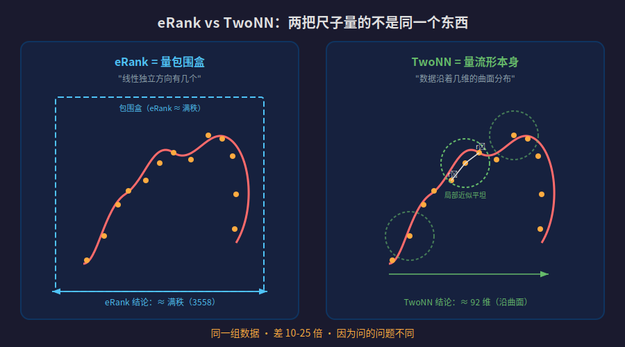

【DeepSeek V4】权重空间是弯曲的——满秩是假象，流形只有百维

━━━━━━━━━━━━━━━━━━━━

◆ 前情提要

━━━━━━━━━━━━━━━━━━━━

第 45 期（https://mp.weixin.qq.com/s/0hOQt8onSJcuZGJLRE46Fw ）我们提出过一个理论：**Transformer 在万维参数空间里，其实长出了一个只有 300-500 维的低维结构——"本我流形"。这个形状就是智能本身。** RLHF 只是在这个流形的表面挖了几个小坑。

但那时候，300-500 维这个数字是间接推出来的——主要依据是 Aghajanyan 2021 的微调子空间实验（在 ~200-1000 维子空间里微调就能达到全参数 90% 的效果），加上 Word2Vec 时代 300 维的经验拐点。第 70 期（https://mp.weixin.qq.com/s/Ve-llXD6Bh0SsovJs8T80w ）我们用 eRank 测过激活值的有效维度（EID），发现专家提示词让深层 EID 膨胀 60-100%——但那测的是推理时的激活，不是权重本身。没人直接量过权重的几何结构。

这一期，我们终于动手量了。

━━━━━━━━━━━━━━━━━━━━

◆ 实验条件：在消费级硬件上拆 280B 模型

━━━━━━━━━━━━━━━━━━━━

硬件是 NVIDIA DGX Spark——Blackwell 架构的消费级超级计算机，128GB 统一内存。模型是 DeepSeek V4 Flash，280B 参数，46 个权重分片文件（每个约 3.5GB），总共约 160GB。

我们不做推理、不跑 forward pass。**直接读权重矩阵本身**，看它们在高维空间里长成什么形状。

流程很暴力：逐层流式加载权重 → 反量化（FP4/FP8 → float32）→ GPU 上做 SVD/TwoNN → 存结果。1458 个矩阵，20 分钟跑完。每次只加载一个矩阵做分析再释放，峰值显存不到 1GB——这个实验 8GB 显存的消费级显卡就能复现，不需要贵的硬件。

━━━━━━━━━━━━━━━━━━━━

◆ 第一把尺子：SVD 和 eRank——"包围盒有多大"

━━━━━━━━━━━━━━━━━━━━

先解释工具。

────────────────────

💡 SVD 是什么

SVD（奇异值分解，Singular Value Decomposition）是线性代数里的"万能拆解术"。**任何矩阵都可以拆成三部分的乘积：旋转 × 拉伸 × 旋转。**

中间那个"拉伸"部分是一组数字，叫**奇异值**（σ₁, σ₂, σ₃, ...），从大到小排列。它们告诉你：这个矩阵在每个方向上有多"用力"。

如果前几个奇异值特别大、后面的接近零——说明这个矩阵"偏科"，真正有效的方向很少。如果所有奇异值差不多大——说明每个方向都差不多重要，矩阵是"满秩"的。

────────────────────

💡 eRank 是什么

eRank（有效秩，effective rank）是把奇异值做一个加权统计，算出"等价于多少个均匀方向"。

公式：先把奇异值归一化成概率分布 `pᵢ = σᵢ / Σσⱼ`，然后算信息熵 `H = -Σ pᵢ log(pᵢ)`，最后 `eRank = eᴴ`。

**人话：如果一个 4096 维的矩阵 eRank 是 3558，说明它在线性代数意义上几乎占满了所有方向。**

────────────────────

eRank 的结果出来了（43 层取均值，层间标准差很小）：

| 权重类型 | 矩阵形状 | eRank（43层均值） | 最大可能秩 |
|---------|---------|-----------------|----------|
| wkv（注意力 KV 投影） | [512, 4096] | 500 ± 6 | 512 |
| wq_a（查询压缩） | [1024, 4096] | 986 ± 13 | 1024 |
| wo_a（注意力输出投影） | [8192, 4096] | 3558 ± 68 | 4096 |
| expert w1（MoE 专家） | [2048, 4096] | 1861 ± 19 | 2048 |
| gate（专家路由） | [256, 4096] | 236 ± 6 | 256 |

**几乎全是满秩。** wkv 最大可能秩 512，实测 eRank 500。wo_a 最大可能秩 4096，实测 3558。每层的数值高度一致——层间标准差只有均值的 1-2%。

如果只看 eRank，结论是：**280B 大模型的权重铺满了整个高维空间，没有低维结构。** 45 期的理论直接判死刑。

但这个结论有两个问题。

**第一，量化噪声在骗你。** V4 Flash 的专家权重用 FP4 存储（4 位浮点，只有 16 个可能的值）。我们做了对照：把完全随机的矩阵也做一轮 FP4 量化→反量化，eRank 是 1896。V4 实测 1861。**几乎一样——FP4 的量化噪声把低秩结构"涂"满了。** FP8（256 级精度）的注意力权重就好得多：随机基线 3793，实测 3558，差 6%，这个差距是真实的结构。

**第二，更根本的问题：eRank 只能看"线性"结构。** 它问的是"这个矩阵在多少个线性独立方向上有分量"——这是在量包围盒的大小，不是在量里面东西的形状。

━━━━━━━━━━━━━━━━━━━━

◆ 核心比喻：树的分形维度

━━━━━━━━━━━━━━━━━━━━

这是理解整篇文章的关键比喻。

一棵松树长在三维空间里。如果你用一个最小的长方体把它包起来（包围盒），这个盒子是三维的。

**但松树填充三维空间的方式远不是"实心"的。**

松树的结构是这样的：一根树干（接近一维的线），分出几根大树枝（还是接近一维），大树枝分出小树枝，小树枝上长松针。整棵树是大量接近一维的线段按分形规律组合起来的——它占据了三维空间，但填充方式极其稀疏。数学上，松树的分形维度大约是 2.x，介于二维和三维之间，大量空间是空的。

**eRank 就是那个包围盒——它测的是"需要几维空间才能装下这棵树"。但我们真正想知道的是"树的结构本身有多复杂"。**

权重向量在 4096 维空间里，分布方式可能极其稀疏——不是均匀填满所有方向，而是沿着某些弯曲的低维结构聚集。eRank 摸到了包围盒就宣布满秩，但包围盒里到底是实心的木头还是一棵分形的树？我们需要另一把尺子。

━━━━━━━━━━━━━━━━━━━━

◆ 第二把尺子：TwoNN——"流形本身是几维的"

━━━━━━━━━━━━━━━━━━━━

eRank 说满秩——但这真的是全部真相吗？

eRank/PCA 属于**线性代数**，只会画直线，假设世界是平的。

回忆一下 NLP 的历史：Word2Vec 时代（2013），词向量活在一个平坦的 300 维空间里。每个词一个固定坐标，"国王-男人+女人=女王"是向量加减法。那时候 PCA 完全够用——因为地面是平的。

**Transformer 来了之后，同样的空间没有消失，但地面被训练数据压出了山谷和褶皱。**"苹果"不再是一个固定点——在"水果"上下文里它在一个山谷，在"手机"上下文里它在另一个山谷，两个山谷被一道高维山脊隔开。Attention 就是在弯曲地面上找最短路——不走直线，顺着地形的起伏走。

如果地面真的弯了，PCA 就会出问题——它会把褶皱误认成新维度。要看到真实维度，需要**微分几何**的工具——允许世界是弯的，沿着曲面走而不是画直线。TwoNN 就是这样一个工具。它只看每个点的局部邻域——在足够小的范围内，任何曲面都近似是平的（就像你站在地球上觉得地面是平的）。所以它能测出**曲面本身的维度**，不受全局弯曲的干扰。

────────────────────

💡 TwoNN 的前世今生

TwoNN 本身是 2017 年 Facco 等人提出的通用本征维度估计方法。2019 年 Ansuini 等人（NeurIPS）第一个把它用到深度学习上——测 VGG/ResNet 各层**激活值**的维度，发现 ID 远小于层宽度，而且最后隐层的 ID 能预测测试准确率。之后 Valeriani 等人（2023，NeurIPS）把它推广到大 Transformer，Cai 等人（2024）用它对比了 LLM 不同学习范式的内部几何。

**主流工作大多测激活值（推理时的中间表示），很少有人直接把 LLM 权重矩阵的行向量当成点云，用 TwoNN 系统测权重本身的本征维度。** 激活值本来就是低秩的（一个 prompt 只激活少数方向），eRank 和 TwoNN 差距不大。权重矩阵线性上满秩，只有用 TwoNN 才能看到隐藏的低维流形结构——这是我们这次做的事。

────────────────────

💡 TwoNN 是什么

TwoNN（Two Nearest Neighbors，Facco et al. 2017）是一种测量**本征维度**（intrinsic dimension）的方法——注意，这和前面 eRank 测的"有效秩"是完全不同的东西。eRank 测的是"线性独立方向有几个"（包围盒），本征维度测的是"数据实际分布在几维的弯曲曲面上"（流形本身）。

核心思想极简：

对于高维空间中的每个点，找它最近的两个邻居，算距离比 `μ = r₂ / r₁`（第二近邻距离除以第一近邻距离）。

**如果数据真的铺在 d 维流形上，μ 的分布满足一个精确的数学关系**——从这个分布可以反推出 d。

直觉：想象你站在一条线上（d=1），你的最近邻和次近邻只能沿着这条线排队，距离比 `r₂/r₁` 很容易被拉开。如果你站在更高维的空间里，方向变多了，最近邻和次近邻更容易同时挤在差不多近的位置，`r₂/r₁` 会更接近 1。**维度越高，μ 的分布越贴近 1；维度越低，尾巴越长。** TwoNN 正是从这个距离比的分布尾部反推出 d。

TwoNN 不假设数据是线性的——它测的是流形在局部弯曲后的真实维度。

────────────────────

我们对每个权重矩阵的行向量当作高维空间中的点云，跑 TwoNN。在 5 个代表层（第 0、10、20、30、42 层）上测量取均值：

| 权重类型 | eRank（线性） | TwoNN（流形） | 差多少倍 |
|---------|-------------|-------------|---------|
| embedding（词嵌入） | — | **47** | — |
| gate（专家路由） | 236 | **34** | 6.9× |
| wkv（注意力 KV 投影） | 500 | **98** | 5.1× |
| wq_a（查询压缩） | 986 | **137** | 7.2× |
| wo_a（注意力输出投影） | 3558 | **277** | 12.8× |
| expert w1（专家权重） | 1861 | **95** | 19.6× |
| expert w2 | 1864 | **72** | 25.9× |
| expert w3 | 1872 | **111** | 16.9× |

**中位数：92 维。**

eRank 说"几乎满秩（1000-3600）"，TwoNN 说"30-277 维"。**差了一个数量级。**

**这个差距本身就是最有趣的发现。** 如果权重分布在一个平坦的线性子空间上，两把尺子应该给出差不多的数字。差一个数量级，说明权重空间**严重弯曲**——弯曲到线性方法完全失效。权重向量不是散布在一个平面上，而是沿着一个复杂的弯曲流形分布。

弯曲意味着什么？如果流形是平的，概念之间只能线性叠加——"快"加"乐"只能等于"快乐"，没有别的可能。正是因为流形弯曲，同样两个方向的组合，在不同位置能弯向完全不同的语义——"快"在"速度"附近加"乐"是"享受飙车"，在"情绪"附近加"乐"是"心情好"。**平直空间只有一种走法，弯曲空间同一步能到不同的地方。**

TwoNN 对 FP4 量化噪声相对不敏感——那些"毛刺"更像均匀的高频噪声，会扰动局部距离，但不至于像 eRank 那样直接把低秩结构涂满。eRank 是瞎子摸包围盒，TwoNN 透过毛刺摸到了骨骼。

────────────────────

上面的表是 5 个层的均值。逐层看，不同层之间波动不小：

| 权重 | Layer 0 | Layer 10 | Layer 20 | Layer 30 | Layer 42 |
|------|---------|----------|----------|----------|----------|
| gate | 44 | 22 | 32 | 44 | 27 |
| wkv | 91 | 89 | 68 | 120 | 121 |
| wq_a | 83 | 162 | 95 | 188 | 159 |
| wo_a | 250 | 305 | 317 | 265 | 246 |
| expert w1 | 107 | 152 | 86 | 59 | 70 |
| expert w2 | 121 | 125 | 32 | 23 | 58 |
| expert w3 | 142 | 117 | 105 | 73 | 116 |

wo_a 最稳定（246-317），gate 也稳定（22-44）。expert w2 波动最大——从 Layer 0 的 121 降到 Layer 30 的 23，差 5 倍。**同一类权重在不同层的维度可以差 2-5 倍。** 浅层和深层的权重结构不一样，这和"浅层处理句法、深层处理语义"的直觉一致。

━━━━━━━━━━━━━━━━━━━━

◆ 每个部件的维度在说什么

━━━━━━━━━━━━━━━━━━━━

这些数字不是随机的。**不同功能的权重，维度层级完全对应它们的角色。**

────────────────────

**gate（路由器）：34 维——用最小算力做最关键的决策**

gate 是 MoE（混合专家）架构的调度员。V4 Flash 有 256 个专家，每次推理只激活其中几个。gate 负责看一眼输入，决定"这个问题交给哪些专家"。

34 维意味着路由决策只需要大约 34 个连续自由度，就能把输入压到足够粗粒度的意图坐标上，再分发给不同专家。**最关键的分发决策，用最低的维度完成。** 高效得可怕。

────────────────────

**expert w1/w2/w3：72-111 维——每个专家的"专业知识"**

每个专家的权重结构大约 100 维。256 个专家，每个掌握 ~100 维的专业知识。这个数字和微调有效维度（Aghajanyan 2021 的 ~200 维）在同一量级，但更低——合理，因为单个专家只负责一个子领域。

────────────────────

**wo_a（注意力输出投影）：277 维——"大喇叭"**

这是维度最高的权重。wo_a 的功能是把注意力计算的结果投射回残差流——**把低维的"内部顿悟"展开成高维的"外部表达"。**

wkv 把上下文压缩到 98 维的概念核，wo_a 把它广播回 4096 维的残差流。它必须表达最丰富的映射关系，所以维度最高。这是模型的"大喇叭"。

────────────────────

**维度层级形成六层俄罗斯套娃：**

推理动态（<10 维，Ma et al. 2026：模型解一道题时思维轨迹的自由度）⊂ 路由决策（~34 维）⊂ 逐层权重流形（~92 维）⊂ 微调有效（~200 维，Aghajanyan 2021）⊂ 全局本我（~500 维）⊂ 嵌入空间（4096 维）

每层套娃测的是不同粒度的结构：一道题的思考轨迹、一个决策、一层权重的几何、一次微调需要的自由度、整个模型的智能结构、物理空间的容量。

━━━━━━━━━━━━━━━━━━━━

◆ 顺手测了 V4 Pro（1.6T）：参数翻 6 倍，维度怎么变？

━━━━━━━━━━━━━━━━━━━━

DeepSeek V4 Pro 有 1.6T 参数（384 个专家，49B 激活）、61 层、hidden_dim 7168（Flash 是 280B、43 层、4096）。我们下载了 3 个代表层的权重（总共 44GB，不需要下完 865GB），跑同样的 TwoNN。

────────────────────

Pro 的逐层 TwoNN（行空间）：

| 权重 | Layer 0 | Layer 30 | Layer 60 |
|------|---------|----------|----------|
| gate | 59 | 35 | 50 |
| wkv | 10 | 54 | 17 |
| wq_a | 115 | 133 | 121 |
| wo_a | 179 | 305 | 187 |
| expert w1 | 202 | 150 | 41 |
| expert w2 | 323 | 325 | 114 |
| expert w3 | 186 | 199 | 128 |

**深层专家维度暴跌**：w1 从 202 降到 41（5 倍），w2 从 323 降到 114。深层专家更"专注"——浅层广撒网，深层精准打击。

────────────────────

Pro vs Flash 均值对比：

| 权重 | Flash | Pro | 变化 |
|------|-------|-----|------|
| gate | 34 | 48 | +41% |
| wkv | 98 | **27** | **-72%** |
| wq_a | 137 | 123 | -10% |
| wo_a | 277 | 224 | -19% |
| expert w1 | 95 | 131 | +38% |
| expert w2 | 72 | **254** | **+253%** |
| expert w3 | 111 | 184 | +66% |

**单层参数从 6.5B 到 25.7B（翻了近 4 倍），但维度不是等比放大，是重新分配了。**

Pro 把更多维度预算给了专家的 down_proj（w2：72→254，知识输出通道变宽），同时把 KV 投影压得更紧（wkv：98→27，上下文编码更高效）。

就像公司从 50 人扩张到 200 人——不是每个部门等比扩招。而是核心业务（专家知识输出）大举扩张，基础设施（KV 上下文编码）反而精简了。**更大的模型不是更胖，是更有分工。**

━━━━━━━━━━━━━━━━━━━━

◆ 回到 45 期：逐层 92 维和全局 300-500 维矛不矛盾？

━━━━━━━━━━━━━━━━━━━━

不矛盾。

TwoNN 测的是**单层权重矩阵的局部切空间维度**——就像测一根树枝大约是 1 维的。但整棵树有很多树枝朝不同方向生长，整棵树的分形维度是 ~2.x，比单根树枝高，但远不是所有树枝维度的求和。

同理，单层权重 ~92 维，43 层叠起来。如果层与层完全独立（没有共享结构），全局维度就是 43×92≈4000——但这不可能，因为那样模型就是一堆互不相干的零件，不会产生连贯的智能。

实际上，**层间共享大量结构**——它们沿着同一个流形做非线性滑动。全局本我流形维度应该被锚定在"最大单层维度之上、远低于求和"的位置。

逐层 92 维 → 全局 300-500 维，逻辑上不矛盾。但严格验证全局维度需要另一种方法（Li et al. 2018 的全局随机子空间法），280B 的模型做不了这个实验。**这里我们只能说"不矛盾"，不能说"验证了"。**

━━━━━━━━━━━━━━━━━━━━

◆ 总结

━━━━━━━━━━━━━━━━━━━━

**第一，权重矩阵里藏着分形结构，线性方法看不见。** eRank 说满秩（1000-3600），TwoNN 说 30-277 维，差一个数量级。线性代数假设世界是平的，把弯曲误认为多一维。以前用 PCA/SVD 做维度分析的工作，可能都高估了。

**第二，参数翻 6 倍，维度不是等比放大，是重新分配。** V4 Pro（1.6T）vs Flash（280B），专家知识输出通道暴涨 253%，KV 上下文编码反而缩了 72%。更大的模型不是更胖，是分工更明确。

**第三，FP4 量化严重骗了 eRank，但对 TwoNN 的影响小得多。** 量化噪声像静电毛刺——线性方法看到毛刺以为满秩，近邻距离方法还能透过毛刺摸到骨骼。做维度分析必须做量化噪声基线，不做就会得出假结论。

━━━━━━━━━━━━━━━━━━━━

◆ 复现

━━━━━━━━━━━━━━━━━━━━

代码和完整数据开源在 GitHub：

`github.com/lmxxf/deepseek-v4-flash-intrinsic-dimension-measurement`

只需要一张 8GB 显存的消费级显卡 + 下载好的模型权重。DeepSeek V4 Flash 和 V4 Pro 都可以跑（权重格式一样）。其他模型只要是 safetensors 格式，改一下反量化逻辑就行。欢迎复现、拿去测别的模型、发 issue 讨论。

━━━━━━━━━━━━━━━━━━━━

◆ 参考文献

━━━━━━━━━━━━━━━━━━━━

- Aghajanyan et al., "Intrinsic Dimensionality Explains the Effectiveness of Language Model Fine-Tuning", ACL 2021
- Facco et al., "Estimating the intrinsic dimension of datasets by a minimal neighborhood information", Scientific Reports 2017
- Ansuini et al., "Intrinsic dimension of data representations in deep neural networks", NeurIPS 2019
- Roy & Vetterli, "The Effective Rank: A Measure of Effective Dimensionality", EUSIPCO 2007
- Martin & Mahoney, "Implicit Self-Regularization in Deep Neural Networks", JMLR 2021
- Ma et al., "Reasoning emerges from constrained inference manifolds in LLMs", arXiv 2605.08142, 2026
- AlphaPruning, "Using Heavy-Tailed Self Regularization Theory for Improved Layer-wise Pruning of LLMs", NeurIPS 2024

━━━━━━━━━━━━━━━━━━━━

// 靳岩岩的 AI 学习笔记 × Claude 的严谨 × Gemini 的浪漫
// 2026-05-18
