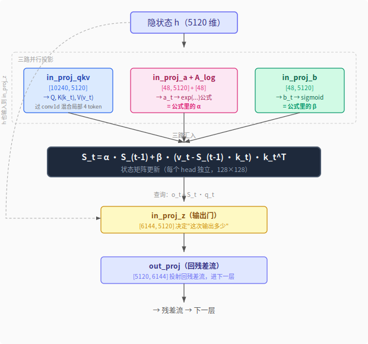

【DeltaNet】直尺擦弯曲的画布——Qwen3.6 线性注意力的遗忘机制有多精准

━━━━━━━━━━━━━━━━━━━━

◆ 前情提要

━━━━━━━━━━━━━━━━━━━━

127 期（ https://mp.weixin.qq.com/s/A8eJvexEDZwYMOsf1lSJAA ）我们科普了三条"干掉 O(n²)"的线性注意力路线：Mamba 是陀螺仪（复数旋转，矛盾共存），DeltaNet 是外科手术刀（擦了再写），RWKV 是河流（叠加衰减，没有橡皮擦）。

188 期（ https://mp.weixin.qq.com/s/jcQlCc3XtaCEEnjUaxw93w ）拆了 Qwen 3.6 的整体架构——75% Gated DeltaNet + 25% 标准 GQA，3:1 混合，KV cache 砍到 1/4。

194 期（ https://mp.weixin.qq.com/s/cG5eF1vHbSnh1j7jQelSLw ）在 DeepSeek V4 Flash 280B 上动手量了权重的几何结构：eRank 说满秩（1000-3600），TwoNN 说 30-277 维，差一个数量级——**权重空间是弯曲的**，线性方法看不见。

这一期做两件事：

**第一，把 DeltaNet 从 127 期的比喻推进到公式级别。** 127 期说"外科手术刀"，但那把刀的刀刃长什么样、切口有多精准、什么情况下会切歪？需要看公式才知道。

**第二，用 194 期同款工具（eRank + TwoNN）测 Qwen3.6-27B 的权重。** 问一个 194 期没问过的问题：**同一个模型里，不同功能的权重弯曲程度一样吗？管遗忘的权重和管内容的权重，几何结构有没有区别？**

━━━━━━━━━━━━━━━━━━━━

◆ 第一部分：DeltaNet 的数学——外科手术刀的刀刃

━━━━━━━━━━━━━━━━━━━━

────────────────────

### 先说一个前提：head 是独立的小世界

不管是标准 attention 还是 DeltaNet，注意力都是**按 head 拆开各干各的**。每个 head 有自己的 Q、K、V，有自己的状态，互不通信。所有 head 干完活之后，输出拼在一起，过一个投影矩阵（out_proj）混回残差流——这一步才把不同 head 的信息交换了。然后残差流进下一层，又被拆成各 head 各干各的。

**拆开 → 各干各的 → 拼回来 → 再拆开**，循环往复。后面所有公式都是在**单个 head 内部**发生的事情。

────────────────────

### 为什么要折腾线性注意力

标准 attention 在推理时有个昂贵的习惯：**KV cache**。每生成一个新 token，它的 Q 要和前面所有 token 的 K 算相似度、用所有 V 加权取内容。这些历史 K/V 如果不存着，每来一个新 token 就要把前面所有 token 重新过一遍 K/V 投影——生成第 1000 个 token 时要重算前 999 个，生成第 1001 个时又要重算前 1000 个，总开销是 O(n²)。所以标准 attention 把所有历史 K/V 缓存起来，用空间换时间。代价是：**序列越长，缓存越大**——100k token 就存 100k 组 K/V 向量，内存随序列长度线性增长。

线性注意力的目标就是**干掉 KV cache**。不存历史 token，改用一个固定大小的状态矩阵 S 来压缩所有记忆——不管输入多长，S 的大小不变，O(1) 内存。DeltaNet 就是这条路上的方案之一。

────────────────────

### 线性注意力的基本形式

回到 127 期的核心概念。

最朴素的线性注意力，状态更新长这样：

```
Sₜ = decay · Sₜ₋₁ + vₜ · kₜᵀ
```

注意：**S 是一个矩阵，不是向量。** 形状是 `[d_v, d_k]`（Qwen3.6 里是 `[128, 128]`）。每一步用外积 `vₜ · kₜᵀ` 往里写一条"键值对"——k 是索引（"这个信息叫什么"），v 是内容（"这个信息是什么"）。

Q 在哪？Q 不参与状态更新，它在**读取**时才出场：`oₜ = Sₜ · qₜ`——用 query 去查状态矩阵，取出输出。这里只写了最里面一层（往 S 里写东西），Q 是外面一层（从 S 里读东西）。

`decay` 是衰减系数，让旧记忆慢慢褪色。RWKV 就停在这一步——没有橡皮擦，新旧记忆直接叠加，只靠衰减慢慢淡化。

问题是：如果你想更新"国王"这个概念的信息，朴素写入 `vₜ · kₜᵀ` 是叠加上去的，旧的"国王"信息还在。等于你在白板上写了两遍，新旧信息叠在一起，读出来是混合物。

────────────────────

### Delta Rule：精准擦除

DeltaNet 的核心创新就是在写入之前先**读出旧值，算出差值，只写差值**。

```
Sₜ = Sₜ₋₁ + β · (vₜ - Sₜ₋₁ · kₜ) · kₜᵀ
```

拆开看每一步在干什么：

**第一步：读出旧值。** `Sₜ₋₁ · kₜ` 是用当前的 key 去查询状态矩阵，得到"上次存在这个 key 下的 value 是什么"。这就是矩阵乘向量——状态矩阵本质上是一个 `[d_v, d_k]` 的关联记忆，用 key 检索 value。

**第二步：计算差值。** `vₜ - Sₜ₋₁ · kₜ` 是新值减旧值。如果新值和旧值一样（信息没变），差值为零，状态不更新——**不做无用功**。

**第三步：写入差值。** `(vₜ - Sₜ₋₁ · kₜ) · kₜᵀ` 把差值通过外积写回状态矩阵，精确覆盖 key 对应的旧值。

`β` 是写入强度（0 到 1 之间），控制"这次更新多大力度写进去"。β=1 就是完全覆盖，β=0 就是完全不写。**α 和 β 都是标量**——每个 token、每个 head 各一个数字，由当前输入动态决定。

状态矩阵 S 有多大？Qwen3.6 里是 128×128 = **16384 个浮点数/head**，48 个 head 共约 78 万个数。不管输入 100 个 token 还是 100 万个 token，S 的大小不变——这就是 O(1) 内存的来源。代价是所有历史信息都被压缩进这 16384 个格子里，装不下的就只能靠 α 遗忘掉腾空间。

每个头只有 128×128——听起来很小，但别忘了**多头注意力本来就是这么设计的**：把高维空间拆成很多低维子空间，各干各的。标准 attention 的每个头也在 128 维的子空间里工作，不是全维度检索。48 个头并行，等于 48 个独立的低维记忆槽各管各的，数量弥补单头精度的不足。

真正的区别不在维度，在**容量是固定的还是可增长的**。标准 attention 的每个头虽然也是 128 维，但 KV cache 随序列长度无限增长——1000 个 token 就存 1000 组 K/V。DeltaNet 的每个头永远只有 128×128 的固定空间，不管输入多长。15 万个概念要挤在 128 维的超球面上，方向必然拥挤，擦一个蹭一片。这也解释了后面第三部分为什么 A_log 的遗忘那么激进（L02 只保留 12.5%）——固定空间就这么大，不使劲扔新的就写不进去。

S 的大小是被 head_dim 锁死的——K 是 128 维，V 是 128 维，外积出来就是 128×128，没得商量。这不是 Qwen 的设计问题，是**线性注意力这条路的结构性约束**。只要你用外积 `v·kᵀ` 往状态矩阵里写，S 的大小就永远是 head_dim²。纯 DeltaNet 论文（Yang et al., 2025）也是这个大小。Mamba-3 的状态也是矩阵，每个 head 是 128×64 = 8192 个**复数**——复数存幅度+相位两个自由度，折合 16384 个实数，和 DeltaNet 的 128×128 = 16384 一样大。区别不在容量，在**怎么用这块空间**：Mamba-3 靠复数旋转让矛盾信息共存（各转各的相位），DeltaNet 靠 delta rule 精准擦写（擦了再写）。同样大的记忆，不同的管理策略。

对比一下 DeepSeek 的思路（168 期 https://mp.weixin.qq.com/s/YqcTnIrGKEYZ2n-sMAelKg 详细讲过）：DeepSeek 从 V2 开始用 MLA 把 KV 压缩到 512 维 latent 存着，推理时再升维回高维空间恢复精度；V4 更进一步，在 MLA 维度压缩的基础上再用 CSA/HCA 砍条数（多条压一条 + 选 top-k）。**先压维度再压条数，两刀叠加**，50K 上下文的 KV cache 从标准 MHA 的 81.5 GiB 压到 228 MB。DeltaNet 走了一条完全不同的路——不压缩 KV cache，而是用固定大小的状态矩阵替代它，128 维存进去就是 128 维读出来，中间没有升维恢复的环节。

把 DeltaNet 为了 O(1) 内存付出的代价串起来看，是一条连锁反应：

**固定大小的 S → 容量不随序列增长 → 遗忘必须激进 → 128 维超球面上 key 拥挤 → 秩-1 直尺擦不干净 → 需要 25% GQA 层每隔三层做一次高清校准。**

不是某一个环节设计得不好，是选了 O(1) 内存这条路之后，后面全是连锁后果。25% GQA 不是锦上添花，是给这条路擦屁股的。

💡 这就是 127 期"外科手术刀"的刀刃。不是把整块白板擦了重写（太暴力），不是在旧字上面叠新字（太模糊），而是找到旧字的位置，量出差多少，只改差的部分。

────────────────────

### 加上衰减门：Gated DeltaNet

纯 Delta Rule 还缺一个东西——全局遗忘。如果状态矩阵装满了 1000 个概念，后面再写新的就越来越拥挤。需要一个机制让整体记忆慢慢缩小，给新信息腾空间。

Gated DeltaNet 加了一个衰减门 α：

```
Sₜ = α · Sₜ₋₁ + β · (vₜ - Sₜ₋₁ · kₜ) · kₜᵀ
```

α 是全局衰减（0 到 1 之间），让整个状态矩阵按比例缩小。α=1 完全保留，α=0 全部遗忘。

**α 管全局遗忘（"这段记忆整体保留多少"），β 管定点覆写（"这条新信息写入多大力度"）。**

Qwen 3.6 的实现中，α 的精确公式是：

```
α_t = exp(-exp(A_log) · softplus(a_t + dt_bias))
```

softplus(x) = ln(1 + eˣ)，作用是把任意实数变成正数（类似 ReLU 但没有硬拐角）。这里用它保证括号内恒正，让外面的 exp(-...) 输出落在 0 到 1 之间。

`A_log` 初始化为 uniform [0, 16]——值越大，初始衰减越快。`a_t` 是 in_proj_a 根据当前输入动态生成的，`dt_bias` 初始化为 1。这意味着衰减率不是固定的，而是**每个 token、每个 head 都不同**——模型可以对"重要信息"放慢遗忘，对"噪音"加速遗忘。

另一个实现细节：DeltaNet 层的 Q 和 K 用的是 **L2 归一化**（不是 softmax），所有 key 向量都被归一化到单位超球面上。这意味着 key 之间的区分完全靠方向，没有幅度差异——这个设计在后面"秩-1 投影的局限性"那节会再回来，因为它让擦除串扰变得更严重。同时，DeltaNet 层**不用 RoPE**（旋转位置编码）。DeltaNet 的状态更新是逐 token 递推的，每步只看当前 token 的 Q/K/V——如果 Q/K/V 完全只从当前 token 投影出来，每个 token 就是孤立的，不知道前一个词是什么。所以在 Q/K/V 投影之后、送进状态更新之前，先过一层 conv1d 卷积——把当前 token 和前面 3 个 token 的向量加权求和，让 Q/K/V 带上局部上下文。不是全局位置编码，只是让每个 token 在写入和读取记忆时不那么孤立。

这就是 Qwen 3.5/3.6 在 75% 的层里用的架构。

────────────────────

### 关键展开：整个操作是严格线性递推

把 Gated DeltaNet 的公式展开：

```
Sₜ = α · Sₜ₋₁ + β · vₜ · kₜᵀ - β · (Sₜ₋₁ · kₜ) · kₜᵀ
```

最后一项 `β · (Sₜ₋₁ · kₜ) · kₜᵀ` 可以利用外积的结合律改写：

```
β · (Sₜ₋₁ · kₜ) · kₜᵀ = β · Sₜ₋₁ · (kₜ · kₜᵀ)
```

所以整个递推变成：

```
Sₜ = [α·I - β · kₜ · kₜᵀ] · Sₜ₋₁ + β · vₜ · kₜᵀ
```

这是一个**严格的线性递推**——对 Sₜ₋₁ 做线性变换，再加一个常数项。**没有 softmax，没有 ReLU，没有任何非线性激活。** 记住这一点——第三部分的实验会看到，正因为没有非线性，这些权重的几何结构几乎完全平直。

方括号里的 `α·I - β · kₜ · kₜᵀ` 是一个矩阵。I 是单位矩阵（对角线全 1，其他全 0），`kₜ · kₜᵀ` 是 key 向量的自外积。

💡 人话翻译：状态矩阵的更新规则是"全局缩放 + 沿 key 方向定点擦除 + 写入新值"。三步操作全部是线性的。这意味着 DeltaNet 的整个状态更新可以用矩阵乘法实现——GPU 跑矩阵乘法极快，没有分支、没有条件判断。

────────────────────

### 线性擦除的限制：秩-1 投影只能擦一个方向

现在看刀刃的局限性。

`kₜ · kₜᵀ` 是什么？它是一个**秩-1 矩阵**——把任何向量投影到 kₜ 方向上。

什么叫"秩-1"？一个 128 维的矩阵，秩-1 意味着它在 128 个方向里只有 1 个方向有效。`kₜ · kₜᵀ` 作用在某个向量 x 上，结果是 `(kₜᵀ · x) · kₜ`——不管 x 多复杂，出来的结果都在 kₜ 这一个方向上。

这意味着 DeltaNet 每一步只能沿**一个方向**擦除记忆。

如果"国王"的 key 和"女王"的 key 有余弦相似度（高维空间中方向相近），擦"国王"的时候会蹭掉一部分"女王"的信息。

```
假设 cos(k_king, k_queen) = 0.7

擦除 king 时，queen 被误擦的比例 ≈ 0.7² = 0.49
```

**擦一个概念，误伤了另一个概念的 49%。** 这就是秩-1 投影的代价——一把直尺只能画直线，在弯曲的语义空间里，直尺擦不干净。

而且 Qwen 的实现让这个问题更突出：DeltaNet 层的 Q 和 K 经过了 **L2 归一化**，所有 key 向量被压到了**单位超球面**上。这意味着 key 之间没有幅度差异，区分完全靠方向——而超球面上的方向比自由空间中更拥挤（高维球面的体积集中在赤道附近），相近概念的 key 更容易扎堆，余弦相似度偏高，擦除串扰更严重。

────────────────────

### 和 Mamba-3 对比：旋转 vs 擦除

127 期讲过 Mamba-3 用复数旋转来处理状态：

```
Mamba-3: sₜ = A · sₜ₋₁ + B · xₜ     （A 是复数对角矩阵）
DeltaNet: Sₜ = [α·I - β·kₜ·kₜᵀ] · Sₜ₋₁ + β·vₜ·kₜᵀ
```

Mamba-3 的状态矩阵 S 是 [128, 64] 的**复数矩阵**（128 个 state 维度，每个存 64 维信息，复数有幅度+相位两个自由度，折合 16384 个实数——和 DeltaNet 的 128×128 一样大）。A 是 [128, 128] 的对角矩阵，对角线上 128 个复数，其余全零——`A · S` 的效果是每一行独立地缩放+旋转，行与行之间不交互。矛盾的信息转到正交相位共存——"国王"和"女王"可以存在同一个维度的不同旋转角上，互不干扰。不擦除，不覆写，旋转到另一个相位去。

DeltaNet 的状态是 [128, 128] 的**实数矩阵**。`α·I - β·kₜ·kₜᵀ` 不是对角矩阵——它是"全局缩放 + 秩-1 方向修正"，`kₜ·kₜᵀ` 让维度之间产生耦合。擦了再写，每步只擦一个方向，但擦得精准（对那个方向来说）。

**Mamba 是陀螺仪——矛盾共存，各转各的。DeltaNet 是外科刀——矛盾不共存，擦了再写。** 两种性格，各有代价。陀螺仪的代价是状态永远在转，有些信息转了半天也读不出来；外科刀的代价是刀刃是直的，弯曲的语义空间里擦不干净。

━━━━━━━━━━━━━━━━━━━━

◆ 第二部分：Qwen3.6-27B 的权重结构

━━━━━━━━━━━━━━━━━━━━

从 config.json 出发，对照每个权重。Qwen3.6-27B 有 64 层，其中 48 层 DeltaNet（层号 % 4 != 3），16 层标准 GQA（层号 % 4 == 3）。

────────────────────

### DeltaNet 层的权重（48 层）

| 权重名 | 形状 | 功能 |
|------|------|------|
| in_proj_qkv | [10240, 5120] | Q+K+V 合并投影（见下方注释） |
| in_proj_a | [48, 5120] | α 衰减门——每个 head 一个衰减率 |
| in_proj_b | [48, 5120] | β 写入门——每个 head 一个写入力度 |
| in_proj_z | [6144, 5120] | 输出门（output gate） |
| out_proj | [5120, 6144] | 投射回残差流 |
| A_log | [48] | 衰减率基线（训练学到的，不是投影矩阵） |
| conv1d | [10240, 1, 4] | 短程卷积（看前后 4 个 token 的局部模式） |

注意：上面是**单层**的权重，48 层 DeltaNet 每层都有独立的一套。形状里出现的 48 是**单层的 head 数**（48 个 V head），不是层数——恰好同一个数字，容易混。

in_proj_qkv 是一个大矩阵，Q、K、V 的投影合并在一起——输入 5120 维，输出 10240 维，然后按维度切分。10240 = Q(16头×128维=2048) + K(16头×128维=2048) + V(48头×128维=6144)。三次矩阵乘法合成一次，GPU 跑得更快。

把这些权重和前面的公式对应起来：



注意 V 头数和 K 头数的比例：**V 有 48 个头，K 只有 16 个头，3:1。**

每个 K head 配 3 个 V head。K 是"这个信息叫什么"（索引），V 是"这个信息是什么"（内容）。索引不需要太精细——16 个方向够定位了；但内容需要丰富——同一个索引下可能需要存储多种不同维度的信息。

💡 人话翻译：K 是图书馆的分类标签，V 是书架上的书。16 个大分类就够索引了，但每个分类下面需要 3 个书架来放不同的书。**记忆的"内容丰富度"远大于"索引精度"。**

────────────────────

### 标准 GQA 层的权重（16 层）

| 权重名 | 形状 | 功能 |
|------|------|------|
| q_proj | [12288, 5120] | Q 投影（24 heads x 256 head_dim） |
| k_proj | [1024, 5120] | K 投影（4 KV heads x 256 head_dim） |
| v_proj | [1024, 5120] | V 投影（4 KV heads x 256 head_dim） |
| o_proj | [5120, 6144] | 输出投影 |

标准 GQA 的 Q/KV 头数比是 24:4 = 6:1，这是常规设计。DeltaNet 层 K/V 头数 16:48，V 比 K 多——非对称设计，只出现在线性注意力层。

────────────────────

### in_proj_a 和 in_proj_b：48 行的窄矩阵

in_proj_a 和 in_proj_b 的形状是 `[48, 5120]`——只有 48 行。这意味着什么？

它们把 5120 维的隐状态投影到 48 维（每个 head 一个标量）。48 维的输出，过 sigmoid 变成 0-1 之间的值，就是每个 head 的 α/β。

**整个"要不要遗忘""要不要写入"的决策，被压缩到了 48 个标量上。** 5120 维的丰富语义信息，最终变成 48 个"是/否/多少"的决策——这是极致的信息压缩。

━━━━━━━━━━━━━━━━━━━━

◆ 第三部分：实验——用 eRank + TwoNN 测 Qwen3.6-27B 的权重几何

━━━━━━━━━━━━━━━━━━━━

────────────────────

### 实验设置

硬件：NVIDIA DGX Spark（Blackwell 架构，128GB 统一内存）。

模型：Qwen3.6-27B，bf16 原始权重，52GB，15 个 safetensors 分片。

方法：194 期同款——eRank 测线性有效秩（"包围盒"），TwoNN 测流形本征维度（"树的形状"）。不熟悉这两把尺子的读者请回看 194 期。

目标层：9 个代表层——3 个 DeltaNet 层（L00, L01, L02）+ 6 个标准 GQA 层（L03, L07, L11, L31, L47, L63），外加 embedding 和 lm_head。对每层的所有注意力权重和 MLP 权重做 eRank + TwoNN。

总计 59 个矩阵，631 秒跑完。

────────────────────

### 核心发现 1：α/β 门控几乎完全平直

这是整篇文章最重要的发现。

| 权重 | 层 | eRank | TwoNN(row) | eRank/TwoNN |
|------|------|-------|------------|-------------|
| in_proj_a（α 衰减门） | L00 | 42.7 | 17.8 | **2.4x** |
| in_proj_a（α 衰减门） | L01 | 42.1 | 17.3 | **2.4x** |
| in_proj_a（α 衰减门） | L02 | 42.7 | 17.8 | **2.4x** |
| in_proj_b（β 写入门） | L00 | 44.2 | 29.8 | **1.5x** |
| in_proj_b（β 写入门） | L01 | 42.8 | 22.6 | **1.9x** |
| in_proj_b（β 写入门） | L02 | 44.5 | 19.9 | **2.2x** |

对照组（同模型其他权重）：

| 权重类型 | 平均 eRank | 平均 TwoNN(row) | 平均 ratio |
|---------|-----------|----------------|-----------|
| full_attn q_proj | 4391 | 52 | **91.5x** |
| full_attn v_proj | 933 | 31 | **35.0x** |
| MLP 全体 | 4716 | 162 | **38.8x** |
| embedding | 4972 | 252 | **19.7x** |

in_proj_b 的 ratio 最低只有 **1.5x**。全模型最低。

（ratio = eRank ÷ TwoNN。不熟悉的读者回看 194 期。简单说：ratio 越接近 1 越平直，越大越弯曲。）

194 期讲过：eRank/TwoNN ratio 衡量的是权重空间的"弯曲程度"——ratio 越接近 1，流形越平直（线性结构与非线性结构一致）；ratio 越大，流形越弯曲（线性方法严重高估维度）。

in_proj_a 的 ratio 稳定在 2.4x，in_proj_b 的 ratio 在 1.5x-2.2x 之间。而标准注意力的 q_proj ratio 高达 91.5x，MLP 的 ratio 约 39x。

**遗忘和写入决策，住在几乎完全平直的子空间里。**

💡 为什么平直？回看公式——in_proj_a 和 in_proj_b 做的事情是 `[48, 5120] × [5120, 1] → [48, 1]`，把 5120 维投影到 48 维，然后过 sigmoid 变成标量。整个过程是**线性投影 + 逐元素非线性**。线性投影不弯曲权重空间，sigmoid 在各 head 上独立作用也不引入 head 之间的非线性耦合。48 行的权重矩阵，每一行是一个 5120 维空间中的线性判别边界——学到的就是"从哪个方向投影能最好地区分该遗忘还是该保留"。这种决策本身是线性可分的——**在 5120 维空间里画 48 条直线就够了，不需要弯曲的超曲面。**

────────────────────

### 核心发现 2：K/V 内容通道是弯曲的

DeltaNet 层的其他权重画风完全不同：

| 权重 | 层 | eRank | TwoNN(row) | ratio |
|------|------|-------|------------|-------|
| in_proj_qkv（Q+K+V 合并） | L00 | 4391 | 51 | **85.6x** |
| in_proj_qkv | L01 | 4234 | 99 | **42.7x** |
| in_proj_qkv | L02 | 4385 | 80 | **54.8x** |
| in_proj_z（输出门） | L00 | 4170 | 150 | **27.8x** |
| in_proj_z | L01 | 3979 | 18 | **221.1x** ⚠️ |
| in_proj_z | L02 | 4092 | 177 | **23.1x** |
| out_proj（回残差流） | L00 | 3988 | 97 | **41.0x** |
| out_proj | L01 | 4169 | 47 | **87.8x** |
| out_proj | L02 | 4271 | 58 | **74.0x** |

（⚠️ L01 的 in_proj_z ratio 异常高——TwoNN 只测到 18 维，L00 是 150、L02 是 177，只有 L01 跳水。原因不明，可能是这一层的输出门在训练中学到了某种更简单的结构。单个离群点不影响整体趋势，但值得标记。）

平均 ratio：in_proj_qkv **61.0x**，in_proj_z **90.7x**，out_proj **67.6x**。

和 α/β 门控的 1.5x-2.4x 比，差了一到两个数量级。

**同一个 DeltaNet 层内部，管理记忆的权重（α/β）几乎平直，被管理的内容（K/V/输出）严重弯曲。**

这就是标题的来源——**"直尺擦弯曲的画布"。** 遗忘机制是一把直尺（线性、平直的投影），它要擦除的对象却是弯曲流形上的语义表征。尺子是直的，画布是弯的。

────────────────────

### 核心发现 3：A_log 衰减率——第一层记住，后面选择性遗忘

A_log 是 DeltaNet 层的衰减率基线，每个 head 一个标量，共 48 个。前面讲过它的精确公式：`α_t = exp(-exp(A_log) · softplus(a_t + dt_bias))`。A_log 初始化为 uniform [0, 16]——初始值大的 head 从训练一开始就被设定为"快速遗忘"角色，初始值小的则倾向"长期记忆"。训练过程中这些值会进一步调整，但初始化的分布已经预设了遗忘策略的多样性。

我们直接看训练后的衰减因子 `decay = exp(-exp(A_log))`：

```
L00: decay 均值 = 0.954  范围 [0.714, 0.996]
     → 平均保留 95.4%，48 个 head 全在"记住"模式

L01: decay 均值 = 0.264  范围 [0.000, 0.918]
     → 平均只保留 26.4%，但有 head 保留 91.8%，也有 head 保留 0%

L02: decay 均值 = 0.125  范围 [0.000, 0.843]
     → 平均只保留 12.5%，遗忘更激进
```

模式很清楚：**第一层几乎全记住，后面的层选择性大量遗忘。**

更有意思的是 L01 的 range——从 0.000 到 0.918。48 个 head 里，有的保留 92%（长期记忆 head），有的保留 0%（完全遗忘 head）。**同一层内，head 之间的遗忘策略极端分化。**

💡 人话翻译：第一层 DeltaNet 是"收件箱"——来什么信息先全部收下，95% 以上保留。后面的层是"分拣员"——26% 到 12% 的保留率说明绝大部分信息被丢弃，但每一层内部有少数 head 扮演"长期记忆"角色，专门保留需要长距离传递的信息。这就像公司邮件：收件箱先全收，然后各部门按自己的需求筛选——有些部门只看今天的（保留率低），有些部门需要追溯历史（保留率高）。

────────────────────

### 核心发现 4：和 DeepSeek V4 的对比——记忆管理比路由决策更平

194 期测过 DeepSeek V4 Flash 的权重。把两个模型放在一起比：

| 权重 | 模型 | eRank/TwoNN ratio | 功能 |
|------|------|-------------------|------|
| gate（路由器） | DeepSeek V4 | **6.9x** | MoE 专家路由决策 |
| in_proj_a（α 衰减门） | Qwen3.6 | **2.4x** | DeltaNet 遗忘决策 |
| in_proj_b（β 写入门） | Qwen3.6 | **1.5x** | DeltaNet 写入决策 |

DeepSeek V4 的路由器已经是那个模型里最平直的权重了——34 维本征维度，ratio 6.9x。

Qwen3.6 的写入门 in_proj_b 比它还平：ratio **1.5x**，几乎就是平面。

**记忆管理（遗忘/写入）的决策比路由管理（选哪个专家）的决策还简单。** 路由需要把输入分到 256 个专家里，至少需要区分 256 个类别；遗忘/写入只需要对 48 个 head 各做一个"多/少"的二值决策。后者的决策空间更小，权重流形自然更平。

━━━━━━━━━━━━━━━━━━━━

◆ 第四部分：这意味着什么

━━━━━━━━━━━━━━━━━━━━

────────────────────

### 权重几何是操作语义的指纹

四个核心发现串起来：

1. α/β 门控：ratio 1.5x-2.4x（接近平直）
2. K/V 内容通道：ratio 42x-91x（严重弯曲）
3. 标准 GQA 的 q_proj：ratio 91.5x（严重弯曲）
4. MLP：ratio 39x（弯曲）

**线性操作的权重住在平直流形上，非线性操作的权重住在弯曲流形上。**

这不是巧合。α/β 门控做的是线性投影 + 逐元素 sigmoid——权重本身只需要学习线性判别边界，不需要弯曲。in_proj_qkv 做的是把 5120 维投影到 Q、K、V 三个子空间，这三个子空间之间有复杂的非线性交互关系（它们在后续的状态更新里做外积、做 delta rule 更新），训练梯度通过这些非线性交互反传，把权重流形压弯了。

**权重的几何形状是训练动力学的化石记录。** 训练梯度的路径决定了权重流形的曲率。梯度经过的非线性越多，反传回来的信号越"弯"，权重被雕刻出的流形也越弯。

另一个影响曲率的因素是**模型大小**。Qwen3.6 只有 27B，hidden_dim 5120——要塞的功能不少，空间有限，权重被逼着在有限维度里挤出复杂结构，流形自然弯得更厉害。194 期测的 DeepSeek V4 Flash（280B MoE），expert w1 的 ratio 大约 19.6x，而 Qwen3.6 的 MLP ratio 是 38.8x——虽然架构不同不能直接比，但方向上吻合：**模型越大、参数越宽裕，流形越不需要折叠来挤信息。**

194 期说"权重空间是弯曲的"——这一期补充：**不同功能的权重有不同的曲率。曲率不是随机的，它编码了操作的语义。** 而曲率的绝对值还受模型大小影响——同样的功能，在更大的模型里有更多空间舒展，ratio 会下降。

────────────────────

### DeltaNet 遗忘有结构性几何错配

回到第一部分的分析。DeltaNet 的擦除操作是 `kₜ · kₜᵀ`——秩-1 投影，线性操作。而被擦除的状态矩阵 S 存储的是 K/V 内容——ratio 61x-91x 的弯曲流形。

**线性擦除 + 弯曲内容 = 结构性几何错配。**

一把直尺在弯曲的画布上画直线，只能近似。余弦相似的概念会被误擦（第一部分的"国王/女王"例子），根源就在这里——直的尺子擦不干净弯的空间。

这不是 bug，是 DeltaNet 的结构性局限。它选择了线性递推的效率（O(1) 内存、O(n) 计算），代价是擦除精度受限于秩-1 投影。

────────────────────

### 25% 标准 attention 是结构性必需品

现在可以从几何角度理解 Qwen 3.5/3.6 为什么要保留 25% 的标准 GQA 层。

DeltaNet 层的 α/β 门控几乎平直（ratio 2.4x），内容通道弯曲（ratio 61x-91x）。每经过三层 DeltaNet，信息被平直的尺子擦了三次，弯曲空间中的语义精度在累积损失。

第四层插入标准 GQA——O(n²) 的 full attention，每个 token 直接看所有历史 token，不经过任何压缩/擦除。这一层做的事情是**在弯曲的语义空间里重新校准位置**——DeltaNet 压平的信息，GQA 帮它折回来。

q_proj 的 ratio 高达 91.5x——它就是为了在弯曲空间里精确寻址而存在的。

**25% 的标准 attention 不是"有了更好，没有也行"的锦上添花。它是"直尺擦弯曲画布"这一结构性缺陷的几何补偿。** 如果 DeltaNet 的擦除是弯曲的（比如用非线性映射做擦除），可能不需要这 25%。但那样就不是线性递推了——O(1) 内存的优势也没了。

这就是架构设计的权衡：线性递推换效率，用 25% 的二次注意力补精度。鱼与熊掌之间的精确取舍。

━━━━━━━━━━━━━━━━━━━━

◆ 总结

━━━━━━━━━━━━━━━━━━━━

**第一，权重几何是操作语义的指纹。** 线性操作（α/β 门控）→ 平直流形（ratio 1.5x-2.4x）。非线性操作（K/V 内容、注意力查询）→ 弯曲流形（ratio 35x-91x）。权重矩阵的曲率不是随机噪声，是训练动力学雕刻出来的结构，它编码了这个权重在计算图中的角色。

**第二，DeltaNet 的遗忘是线性擦除（秩-1 投影），被擦除的内容是弯曲流形——结构性几何错配。** 直尺画不了弯线，余弦相似的概念会被误擦。

**第三，25% 标准 attention 是结构性必需品，不是性能锦上添花。** 它是对"直尺擦弯曲画布"这一几何缺陷的补偿。DeltaNet 压平了语义空间，GQA 把它折回来。

**第四，194 期说"权重空间是弯曲的"。这一期补充：不同功能的权重有不同曲率。** 遗忘决策几乎完全平直，内容表征严重弯曲，记忆管理比路由决策还简单。曲率是功能的指纹。

━━━━━━━━━━━━━━━━━━━━

◆ 复现

━━━━━━━━━━━━━━━━━━━━

测量代码和完整数据开源在 GitHub：

`https://github.com/lmxxf/ai-theorys-study/tree/main/wechat/assets/195`

- `qwen36_intrinsic_dim.py`——测量脚本
- `qwen36_intrinsic_dim.json`——完整结果数据

需要：一张 8GB 显存的消费级显卡 + Qwen3.6-27B 的 bf16 权重（52GB，HuggingFace 下载）。逐矩阵流式分析，峰值显存不到 1GB。59 个矩阵 10 分钟跑完。

━━━━━━━━━━━━━━━━━━━━

◆ 参考文献

━━━━━━━━━━━━━━━━━━━━

- Yang et al., "Gated Delta Networks: Improving Mamba2 with Delta Rule", ICLR 2025 (arXiv: 2412.06464)
- Schlag et al., "Linear Transformers Are Secretly Fast Weight Programmers", ICML 2021
- Facco et al., "Estimating the intrinsic dimension of datasets by a minimal neighborhood information", Scientific Reports 2017
- Roy & Vetterli, "The Effective Rank: A Measure of Effective Dimensionality", EUSIPCO 2007
- Lahoti et al., "Mamba-3: Improved Sequence Modeling using State Space Principles", ICLR 2026 (arXiv: 2603.15569)
- Qwen3.6 官方 Blog (https://qwenlm.github.io/blog/qwen3.6/)

━━━━━━━━━━━━━━━━━━━━

// 靳岩岩的 AI 学习笔记 × Claude 的严谨 × Gemini 的浪漫
// 2026-05-20
