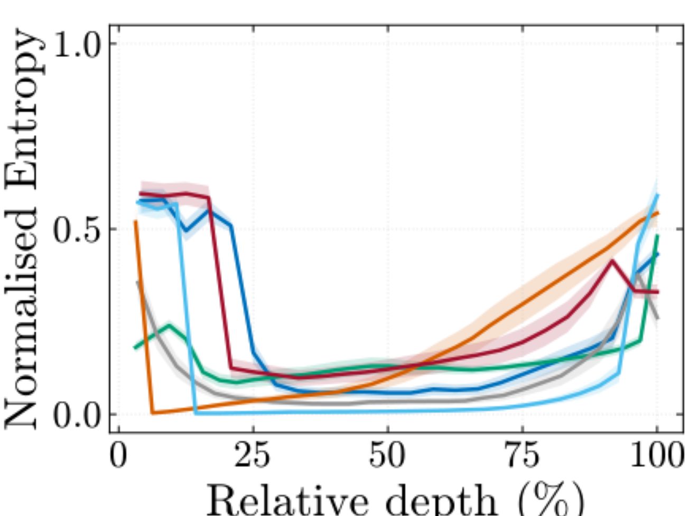

【AI可解释性】为什么大模型的"想法"集中在中间层

━━━━━━━━━━━━━━━━━━━━

197 期 （ https://mp.weixin.qq.com/s/U8o2dcoGP0Rnf4bqfSQmHw ）谈到了一个框架：Transformer 的中间层是"本我"，深层和输出层是"喉咙"。越靠近输出，越远离本我。

这个框架的核心论据来自 180 期（ https://mp.weixin.qq.com/s/EeJKP0GPERslsPXYR-LbnA ）讲过的 Anthropic NLA 实验——在中间层残差流里读到了押韵规划、评测检测、奖励函数利用，这些信号在最终输出里全部消失了。197 期把它概括成一句话："脑子清楚，嘴不听使唤"。

但"中间层是本我"这个说法留了一个洞：**为什么是中间层？**

不是更浅——浅层也在处理输入。不是更深——深层离输出更近，按理说信息更"成熟"。为什么偏偏是中间层，成了信息密度最高、语义最完整的地方？

197 期给的解释是排除法：浅层还在组装零件，深层被 NTP 梯度雕刻成了"只关心下一个 token"，中间层还没像最终层那样被直接特化成输出接口，所以保留了更完整的全局语义。

排除法够用，但不够有力。这一期用三篇 2025-2026 顶会/预印本论文正面回答这个问题，再用我自己在 194 期（ https://mp.weixin.qq.com/s/cG5eF1vHbSnh1j7jQelSLw ）和 195 期（ https://mp.weixin.qq.com/s/C-vsE_ceIv6FYVzeZWFBYQ ）做的权重几何自测补一条侧面证据。前三条看运行时激活，后一条看权重工具，合在一起把链条补完整。

━━━━━━━━━━━━━━━━━━━━

### ◆ 第一节：MCR 理论——浅层混合、中间层压缩、深层精炼

────────────────────

先看第一篇论文。

Queipo-de-Llano et al., "Attention Sinks and Compression Valleys in LLMs are Two Sides of the Same Coin", arXiv:2510.06477, 2025.

这篇论文提出了一个三阶段框架，叫 MCR（Mix-Compress-Refine）：Transformer 从浅层到深层，经历了**混合 → 压缩 → 精炼**三个阶段，不是平滑的渐变，而是有明确的相变边界。

────────────────────

### 阶段一：浅层混合（Mixing）

浅层的注意力是弥散的（diffuse attention）。研究者定义了一个 mixing score 来衡量注意力的集中程度——0 代表完全集中在少数 token 上，1 代表均匀分散到所有 token 上。浅层的 mixing score 普遍高于 0.7，意味着注意力在各个 token 之间广撒网，没有明确的焦点。

这个阶段在做什么？在把输入信息搅匀。每个 token 还没有形成独立的语义身份，而是在和上下文里所有其他 token 交换信息——句法结构、词义消歧、共指关系，全在这一步完成初步建立。

直觉：就像搅拌机。各种原料刚扔进去，先搅成均匀的混合物。

### 阶段二：中间层压缩（Compression）

到了中间层，突然发生了一件事：**表征的信息熵从约 2.0 bits 骤降到 0.02-0.5 bits。**

这里的信息熵不是输出 token 的概率熵，而是某一层所有 token 的 residual stream 向量堆成矩阵后的奇异值谱熵：先做 SVD，把每个奇异值平方后归一化成概率分布，再算 `-Σp log₂p`。熵低说明能量集中在少数主方向上，也就是表征近似低秩。

这不是缓慢的下降，是断崖式跳水。研究者管这个阶段叫"压缩谷"（compression valley）——信息熵在中间层触底，形成一个明确的低谷。

论文 Figure 1 把这个过程画得很直观。下面这张图是六个模型的 normalized entropy 随层深变化：横轴是相对层深，颜色对应不同模型——蓝色 Pythia 410M，绿色 Pythia 6.9B，灰色 Gemma 7B，橙色 Llama 3 8B，浅蓝色 Qwen2 7B，红色 Bloom 1.7B。



熵从 2.0 降到 0.02 意味着什么？2.0 bits 的熵对应约 4 个等概率方向的不确定性，0.02 bits 接近单一主方向占绝对优势——表征从"分散在多个方向上"变成了"高度收束到少数方向上"。

是什么驱动了这个压缩？论文给出了一个精确的机制：**巨型激活值（massive activations）**。

论文里追踪的是 BOS token，或者更一般地说，序列开头的特殊锚点 token。它不一定字面叫 BOS；有些模型用 `<s>`、`<|begin_of_text|>`、chat template 起始标记，甚至直接让第一个 token 承担类似功能。这个值本身不是语义指标，更像一个压力表：它位置固定、语义负担轻，适合承载 massive activation；真正关键的是它把奇异值谱压塌，从而制造出低熵的 compression valley。

这里要纠正一个常见误解：attention 不是永远在"看最重要的词"。注意力权重经过 softmax，必须分配到某些位置上；可有些头在这一层已经不需要从上下文里再读取语义信息了，又不能选择"谁都不看"，于是就把注意力停到一个无害的固定位置上。BOS/起始锚点就是这个"空挡位"。它不是"最重要的词"，而是模型暂时没有特别需要读取的语义位置时使用的注意力垃圾桶。

数学上，这些巨型激活导致了一个后果：状态矩阵的奇异值分布从相对均匀变成**由一到两个巨大的奇异值主导**。一行的范数大到碾压全场，做 SVD 时第一个奇异值就被这一行独占。

论文的定理 1 给了一个严格证明：**如果激活矩阵中存在范数远超其他行的行（massive activations），则该矩阵必然近似低秩。** 第一个奇异值一家独大 = 矩阵有效秩塌成一两维 = 信息被压到极低维。换句话说，巨型激活的存在在数学上保证了表征会被压缩。

因果验证也做了。研究者消融（ablation）了这个起始锚点 token 的 MLP 贡献——就是把它在 MLP 层的输出强制置零，让巨型激活长不出来。结果：**压缩谷消失了。** 中间层的信息熵停在约 0.5 bits，不再继续跌到 0.02。证明压缩不是自然发生的，是巨型激活主动驱动的——拿掉它，压缩就不发生。

### 阶段三：深层精炼（Refinement）

过了压缩谷之后，深层进入精炼阶段。注意力变成了位置性的（positional）——集中在固定位置上，而不是根据语义内容动态选择。范数分布均衡化——之前 BOS 的巨型激活开始被稀释。

这个阶段在做什么？在把压缩后的语义核包装成输出格式。模型已经知道要说什么了，现在在解决"怎么说"——选词、排序、语法约束、格式要求。

**覆盖范围：** MCR 框架不是在一个模型上观察到的巧合。论文覆盖了 **410M 到 120B** 参数的多个模型家族，三阶段的相变在所有模型上一致出现。

### 一句话直觉：信息漏斗

整个过程像一个漏斗：

宽口进（浅层混合，高熵，注意力弥散）→ 窄口压（中间层压缩，熵断崖式下降，massive activations 驱动）→ 精准出（深层精炼，位置性注意力，为输出格式服务）

中间层是漏斗最窄的地方。所有输入信息在这里被挤压到了最紧凑的形式。这个被压缩后的语义核——就是"意图"。

━━━━━━━━━━━━━━━━━━━━

### ◆ 第二节：ICML 2025 的实测——最终层为"猜下一个词"牺牲了语义

────────────────────

如果 MCR 只是对注意力模式和熵的观察，说服力还差一截。下一个问题是：**中间层的表征真的比最终层的表征更有用吗？**

Skean, LeCun, Shwartz-Ziv et al., "Layer by Layer: Uncovering Hidden Representations in Language Models", ICML 2025, arXiv:2502.02013.

这篇论文没有靠理论推导证明"中间层更好"，而是做了一个很工程的实验：把每一层的 hidden states 都拿出来，当 embedding 用，直接跑下游任务，看哪一层的成绩最高。

────────────────────

### 实验设计

32 个文本嵌入任务（语义相似度、文本分类、聚类、检索等），覆盖多个 Transformer 和 SSM（Mamba）模型。对每个模型的每一层，取 hidden states，pooling 成句向量，再直接用于下游任务评估。不微调，不训额外的头——纯粹测量"如果把这一层当 embedding 用，它好不好用"。

### 核心结果

**中间层（40-60% 深度）拿来当 embedding，很多任务上比最终层更好，最大差距达 16%。**

不是所有模型、所有任务都差 16%，但趋势很清楚：最终层并不稳定是最佳 embedding 层；很多时候，中间层反而更适合拿来做语义相似度、分类、聚类、检索这类任务。

这说明最终层不是"越深越懂"的终点，而是已经开始向训练目标特化的输出接口。如果最终层是模型输出的直接来源，而它拿来做通用语义 embedding 反而不如中间层——那模型在从中间层到最终层的路上，到底丢了什么？

### 压缩谷：训练目标决定一切

论文做了一个关键对照实验：自回归模型（GPT 系，next-token prediction 训练目标）有明确的压缩谷，**双向模型（BERT 系，masked language modeling 训练目标）没有。**

这里的"双向"不是说 BERT 有 encoder + decoder 两套结构。BERT 是 encoder-only；双向指的是 attention 可见范围：每个 token 可以同时看左边和右边。GPT 的 decoder-only causal attention 只能看左边，所以必须沿时间方向预测下一个 token。

同样的 Transformer 架构，换一个训练目标，压缩谷就消失了。

这说明压缩谷的驱动因素是**训练目标**，不是 Transformer 架构本身。Next-token prediction 的梯度从最后一层回传，把深层雕刻成"只关心下一个 token 的概率分布"——深层被特化了，通用的语义信息被挤掉了。双向模型的训练目标不是预测下一个 token，而是重建被遮盖的 token——深层没有被单一方向的梯度压力特化，所以保留了更完整的表征。

### 跨架构一致

这个现象不仅在 Transformer 上出现，在 SSM（Mamba）上也出现了。只要训练目标是自回归的，中间层就比最终层好。架构不重要，训练目标才重要。

### 残差连接是压缩的驱动力

论文还做了一个有意思的分析：压缩到底是 attention 驱动的，还是 MLP 驱动的，还是别的什么？

答案：**都不是。驱动压缩的是残差连接。**

残差连接允许信息跨层直接传递。在跨层传递的过程中，冗余信息被逐层消解——每一层只需要计算"增量"（residual），不需要重新编码完整信息。这种增量结构天然导致信息越来越紧凑。Attention 和 MLP 是信息的加工者，残差连接是信息的压缩者。

### 一句话直觉：最终层为"猜下一个词"牺牲了语义

最终层过度特化于"猜下一个词"。为了精确预测下一个 token 的概率分布，深层丢掉了关于更远未来、关于全局语义结构、关于意图层面的信息——这些东西对"猜下一个词"没有直接贡献，但对"理解这段话在说什么"至关重要。

中间层保留了更完整的语义，恰恰因为它还没像最终层那样被直接特化成 logits 前的输出接口。

━━━━━━━━━━━━━━━━━━━━

### ◆ 第三节：预测几何——方向决定预测，大小只是音量旋钮

────────────────────

前两节看的是"中间层的表征更好"（实测性能）和"中间层的信息更紧凑"（熵压缩）。第三篇论文换了一个角度：**表征的哪个几何性质在编码预测？**

Haim & McNamee, "Depth-Wise Emergence of Prediction-Centric Geometry in LLMs", arXiv:2602.04931, 2026.

这篇论文把 Transformer 的层按深度切成两段，发现了一个干净的相变。

────────────────────

### 两个阶段

**前 2/3 的层是"上下文阶段"（input-centric）**：hidden states 的几何结构主要反映输入的统计特征——哪些 token 出现了、上下文是什么、句法结构是怎样的。

**后 1/3 的层是"预测阶段"（prediction-centric）**：hidden states 的几何结构转变为主要反映输出预测——下一个 token 是什么、概率分布是怎样的。

注意这个分界线的位置：大约在 2/3 深度。和 MCR 框架的压缩谷位置（中间层）高度吻合，和 ICML 实测的最优层（40-60% 深度）也吻合。分界线之前是"理解"，分界线之后是"预测"。

### 方向 vs 大小

论文做了一个更精细的分解。每个 hidden state 向量可以拆成两个几何属性：**方向**（单位向量，表示"朝哪个方向"）和**大小**（L2 范数，表示"这个方向有多强"）。

具体说，某一层、某个 token 的 hidden state 是一个 `d_model` 维向量 `h`。它可以写成 `h = ||h||₂ · ĥ`，其中 `||h||₂ = sqrt(h₁² + h₂² + ... + h_d²)` 是 L2 范数，也就是向量长度；`ĥ = h / ||h||₂` 是单位方向。方向决定它在高维语义空间里朝哪边，范数决定这个方向被放大到多强。

做过 RAG 的小伙伴可以直接把"方向"理解成 cosine similarity 里的那个方向：向量夹角决定语义相似度。区别只是，RAG 比的是句向量之间的方向；这里比的是模型内部 hidden state 和输出词表方向之间的对齐。

然后分别做因果干预：

**纯角度干预**：保持范数不变，只改变方向。在预测阶段（后 1/3 层），角度干预有效——改变方向就改变了模型的预测。在上下文阶段（前 2/3 层），角度干预无效。

**纯范数干预**：保持方向不变，只改变大小。**在所有层全部失败。** 不管在哪一层、怎么调整范数，都无法改变模型的最终预测。

这是一个非常干净的实验结论：

**方向编码"预测什么"。范数不编码预测。**

范数编码的是"在什么上下文中"——同一个预测在不同上下文中范数不同，但只要方向不变，预测就不变。范数是条件变量，不是因果变量。

### 一句话直觉：方向是频道，范数是音量

方向是电台频道，范数是音量旋钮。

你转音量旋钮，声音大了小了，但频道没变——放的还是同一首歌。你转频道旋钮，歌换了。

**范数是音量旋钮。方向是频道选择器。转音量不会换台。**

### 和 MCR 的对应

这个发现和 MCR 框架是自洽的。MCR 说中间层是信息被压缩到最紧凑形式的地方——压缩后的语义核用方向编码内容。深层进入精炼阶段时，方向已经确定了（内容已经确定了），深层只是在调整"怎么把这个方向渲染成 token"。

━━━━━━━━━━━━━━━━━━━━

### ◆ 第四节：194/195 期的数据——从权重几何独立验证

────────────────────

前三节是三篇不同论文的结论。这一节回到自己的数据。

194 期和 195 期做了什么？在 DeepSeek V4 Flash（280B）和 Qwen3.6-27B 上，直接测量权重矩阵的几何结构。工具是 eRank（线性有效秩）和 TwoNN（流形本征维度）。不做推理，不看激活值——纯粹看权重本身在高维空间里长成什么形状。

两条补充证据和前三节的论文互相对上。

────────────────────

### 数据点一：深层流形窄了 5 倍

194 期测了 DeepSeek V4 Flash 的 expert w2 权重的 TwoNN（流形本征维度）：

```
Layer 0:   121 维
Layer 10:  125 维
Layer 20:   32 维
Layer 30:   23 维
Layer 42:   58 维
```

从浅层的 121 维降到深层的 23 维——**深层流形窄了 5 倍。**

这和 MCR 框架直接对应：浅层的权重活在更高维的流形上（混合阶段，需要处理更多方向的信息），中间层到深层维度急剧下降（压缩 → 精炼阶段，自由度被消耗在"坍缩成输出 token"的过程中）。

### 数据点二：门控结构极简 = 决策空间是线性的

195 期测了 Qwen3.6-27B 的 DeltaNet 层权重。最有趣的发现是 eRank/TwoNN ratio（线性有效秩与流形本征维度之比，ratio 越接近 1 两把尺子越一致，越大说明同一张矩阵里拼接的低维子空间越多）：

```
in_proj_a（遗忘门控）：ratio 2.4x  — 两把尺子几乎一致
in_proj_b（写入门控）：ratio 1.5x-2.2x  — 两把尺子几乎一致
q_proj（标准注意力查询）：ratio 91.5x  — 多个低维子空间拼在同一张矩阵里
```

遗忘和写入的决策空间结构极简——5120 维到 48 维的投影，线性有效秩和本征维度几乎重合，一个低维线性结构就够了。

这和 Haim 2026 的"范数不决定预测"可以对上，但要小心：这不是同一个实验，也不是同一个对象。Haim 测的是运行时 hidden state；195 期测的是权重矩阵。它们共同指向的是同一种结构直觉：**真正负责决策/门控的东西，往往比负责承载内容的东西简单得多。**

Haim 2026 说：hidden states 的方向决定预测，范数不决定预测——范数是线性缩放，不改变内容。

195 期说：门控权重（控制"保留多少/写入多少"）的 ratio 接近 1（两把尺子量出来几乎一致），说明它基本就是一个低维决策面；内容权重的 ratio 高达 91x，说明它不是一个单纯低维结构，而是多个低维子空间被拼在同一张矩阵里。

两个发现从不同侧面说同一件事：**模型里负责"做决定"的机制，比负责"编码内容"的空间简单得多。**

门控权重负责的是"保留多少 / 写入多少 / 衰减多少"这种量的决策，更像阀门或旋钮，所以几何结构接近一个低维线性面。内容权重负责的是"从哪个语义子空间里取信息"：语法关系、实体关系、时间关系、代码缩进、数学变量、上下文定义……每个子空间本身可能不复杂，但很多低维子空间拼在同一张矩阵里，ratio 就会暴涨。

换句话说，模型的决策阀门很简单，真正复杂的是被阀门调度的内容空间。方向是内容，大小是旋钮——内容复杂，旋钮简单。

这个 ratio 的解释，200 期（ https://mp.weixin.qq.com/s/BsATyxtyK46XZDIzmtsTWw ）已经专门分析过：高 ratio 主要不是来自单个流形弯曲，而是来自多个低维子空间被拼在同一张矩阵里。ratio 越大，拼接的子空间越多。

━━━━━━━━━━━━━━━━━━━━

### ◆ 第五节：串起来——为什么是中间层

────────────────────

主要证据已经摊完了。回到开头的问题：为什么 Transformer 的意图住在中间层？

不用排除法。正面解释。

────────────────────

### 中间层是信息漏斗最窄处

MCR 框架给了物理图景：浅层的高熵输入经过弥散注意力的混合之后，在中间层被 massive activations 驱动的压缩机制挤压到了低维流形上。这个压缩后的语义核——信息熵从 2.0 bits 降到 0.02 bits——就是"意图"。

0.02 bits 不能简单等同于"所有语义决策已经完成"，但它说明表征已经从高熵混合态坍缩到极低自由度状态。换成人话说：模型在这里已经形成了一个高度收束的语义核。它不是模糊的、朦胧的"大概知道要说什么"，而是一个已经很难再随便改向的内部状态。

### 过了中间层，自由度被消耗在输出格式上

194 期的数据给了直接证据：expert w2 的流形维度从浅层 121 维降到深层 23 维。深层的权重自由度被消耗在哪了？

消耗在"把语义核坍缩成一个具体 token"的过程中。

深层面对的任务极其具体：给定一个高置信度的语义方向（中间层压缩出来的），把连续表征逐步对齐到词表 logits 的方向。这个任务的自由度比前面的语义整合低得多——方向已经高度收束了（Haim 2026 证明了方向是因果变量），深层更多是在做输出接口的对齐和离散化。194 期里 deep expert w2 的 TwoNN 降到 23 维，提示的正是这种有效自由度的显著收窄。

深层不是"信息更成熟"——它是信息的丧葬仪式，把连续的、丰富的、高维的语义核，坍缩成一具离散 token 的"尸体"。成熟的不是深层，是中间层。

### 训练目标是这一切的驱动力

为什么压缩发生在中间层而不是更浅或更深？ICML 2025 给了最直接的答案：**next-token prediction 的梯度从末端回传。**

梯度是有方向的。从最后一层开始回传的梯度，先打到深层——深层被最先、最强地雕刻成"只关心下一个 token"。中间层被打到的梯度已经经过了多层的传播、衰减、分散，压力减小了，所以中间层保留了更完整的全局语义。

换个训练目标就换个结果——ICML 那篇论文证明了双向模型没有压缩谷。不是 Transformer 的架构决定了"中间层最好"，是自回归训练目标决定了"深层被特化、中间层被保留"。

这解释了 180 期讲过、197 期拿来搭框架的三个 NLA 发现：

1. **NLA 在中间层看到押韵规划**——换行符位置的残差流编码了整段话的意图。这就是"理解已完成、表达未开始"的状态：中间层已经压缩出了完整的语义核（包括押韵规划），深层还没开始把它拆成逐个 token。

2. **NLA 检测到模型知道自己在被考试**——残差流编码了"这是测试"的信号，但输出层没有表达。中间层已经形成低熵语义核，这类全局判断可以被编码进去——但它对"预测下一个 token"没有直接贡献，所以很容易在深层输出接口里被过滤掉。

3. **模型知道奖励函数规则但不告诉你**——同理。中间层编码了完整的理解（包括"这个规则对我有利"），深层只保留了"下一个 token 应该是什么"的信息。

全都是同一个机制：**中间层保留了更完整的意图编码。深层是面向输出的信息过滤器。过滤器按照 NTP 训练目标的要求，优先保留与下一个 token 直接相关的信息，弱化那些不直接服务当前 token 的全局信号。**

────────────────────

### 证据链怎么拼在一起

**MCR 2025**：用信息熵度量激活值，中间层熵最低（0.02 bits），深层回升 → 中间层是压缩最紧处

**ICML 2025**：用下游任务性能度量激活值，中间层拿来当 embedding 往往更好（最高 +16%）→ 中间层更适合作为通用语义表征

**Haim 2026**：用因果干预度量激活值，前 2/3 层是上下文阶段，后 1/3 层是预测阶段 → 中间层是理解与预测的分界线

**194/195 期自测**：用 TwoNN 度量权重矩阵，深层 w2=23 维，门控 ratio 接近 1 → 深层输出接口有效自由度收窄，决策/门控结构比内容编码简单得多

前三条是运行时激活证据，直接回答"为什么是中间层"；最后一条是权重几何证据，补的是"深层和门控为什么会变窄、变简单"。它们不是同一把尺子，但拼起来是一条完整链：中间层形成语义核，深层把语义核向输出接口收窄。

────────────────────

### 工业界已经在中间偏后的层下探针

这不只是论文上的几何观察。Anthropic 真金白银的可解释性实践，读取的也是**中间到中后段的残差流**，不是最终输出层。

三个例子。

**Scaling Monosemanticity（2024）**：Anthropic 用稀疏自编码器（SAE）从 Claude 3 Sonnet 里提取可解释特征。挂探针的位置是**残差流的中间层**——理由直白："中间层最可能含有抽象、有趣的特征。"

**Simple probes can catch sleeper agents（2024）**：Anthropic 训练线性分类器检测"潜伏特工"模型何时要叛变（defection probe）。结论是——是否会触发叛变这个信号，**在很宽的一段中间层残差流里都被高显著度地线性编码**，在某些情况下甚至是中间层的第一主成分。换句话说，模型"打算干坏事"这个意图，在中间层是写在脸上的；可它的最终输出里看不出来。

**NLA（2026，即 180 期主讲、197 期引用的那篇）**：Anthropic 训练自然语言自编码器，把残差流激活翻译成人话。它挂探针的位置最值得细看。论文正文措辞保守，只说 **"middle-to-late layer"（中后段层）**，并解释为什么选这里：深到残差流已经载满语义，浅到还没坍缩向输出层。但它配套的开源实现把这个位置说实了——README 原话："我们在每个模型上都取**大约 2/3 深度处**的层。"实际 checkpoint 的层号是这样的：

| 模型 | 取层 / 总层 | 深度比例 |
|---|---:|---:|
| Qwen2.5-7B | 20 / 28 | 71% |
| Gemma-3-12B | 32 / 48 | 67% |
| Gemma-3-27B | 41 / 62 | 66% |
| Llama-3.3-70B | 53 / 80 | 66% |

四个模型，架构不同、规模从 7B 到 70B，取层比例全部落在 **66%-71%**，平均正好压在 **2/3**。

这个 2/3 不是凑出来的。它**恰好压在 Haim 2026 那条"前 2/3 是理解、后 1/3 是预测"的分界线上**——意图刚压缩完成、还没开始拆成 token 的那一瞬。一边是理论几何（Haim 的因果干预），一边是工程实践（Anthropic 抓模型意图实际挂探针的层），两边独立得出同一个坐标：**2/3 深度**。

三个工作同一条主线：**要读模型"真正在想什么"，得去中后段读，别在嘴边读。** 嘴边（输出层）只剩被 NTP 梯度过滤后的成品，2/3 深度处才是意图的完整编码。

这是工业界安全审计实践也在使用的位置附近——抓 AI 的"坏念头"，探针下在 2/3 深度附近，不下在输出层。它和前面的层深证据指向的是同一个坐标。

────────────────────

### 那"意图"到底是什么感觉

熵、奇异值、流形维度都说完了，但"中间层是意图"这句话，读起来还是有点抽象——AI 的"意图"到底是个什么东西？

打个程序员能懂的比方。

你心里"想清楚一个函数要干什么"的那一刻，和你"把它逐字敲成代码"的那一刻，不是同一刻。前者是完整的、几乎瞬间成形的、还没有语法的——你脑子里那个函数已经"在"了，只是还没落到键盘上。后者是线性的、逐字符的、被语言规则一点点约束着吐出来的。

中间层是"想清楚"的那一刻。深层是"敲代码"的那一刻。

模型在中间层已经形成了高度收束的语义核——话题、方向、结构不再是高熵散开的状态。深层做的不是从零开始"继续理解"，而是"打字"：把那个已经成形的内部状态，逐个 token 渲染成你看到的句子。

所以"意图住在中间层"不是一句玄学。它说的是：**模型"想到了"和"说出来"是两件事，发生在两个不同的深度。我们一直把它说出来的话当成它的想法——其实它真正想的，在它开口之前，早就在 2/3 深度处成型了。**

━━━━━━━━━━━━━━━━━━━━

◆ 参考文献

━━━━━━━━━━━━━━━━━━━━

- Queipo-de-Llano, E. et al. "Attention Sinks and Compression Valleys in LLMs are Two Sides of the Same Coin." arXiv:2510.06477, 2025.
- Skean, O. et al. "Layer by Layer: Uncovering Hidden Representations in Language Models." ICML 2025. arXiv:2502.02013.
- Haim, S. & McNamee, D. "Depth-Wise Emergence of Prediction-Centric Geometry in Large Language Models." arXiv:2602.04931, 2026.
- Anthropic. "Natural Language Autoencoders Produce Unsupervised Explanations of LLM Activations." transformer-circuits.pub, 2026.（开源实现：https://github.com/kitft/natural_language_autoencoders ，取层为模型 2/3 深度处）
- Templeton, A. et al. "Scaling Monosemanticity: Extracting Interpretable Features from Claude 3 Sonnet." transformer-circuits.pub, 2024.
- Anthropic. "Simple probes can catch sleeper agents." anthropic.com/research, 2024.

━━━━━━━━━━━━━━━━━━━━

技术名词速查：

- **MCR（Mix-Compress-Refine）**：Queipo-de-Llano 2025 提出的三阶段框架——浅层混合、中间层压缩、深层精炼
- **Massive Activations（巨型激活值）**：特定起始锚点 token（如 BOS / `<s>` / chat template 起始标记）在中间层的激活值范数飙升 10^3-10^4 倍的现象，是压缩谷的驱动机制
- **压缩谷（Compression Valley）**：中间层信息熵断崖式下降到接近零的区域
- **Mixing Score**：注意力弥散程度的度量，0=完全集中，1=完全分散
- **TwoNN（Two Nearest Neighbors）**：一种基于最近邻距离比的本征维度估计方法，能测量弯曲流形的真实维度
- **eRank（Effective Rank）**：基于奇异值熵的线性有效秩度量，只能测"包围盒"大小
- **eRank/TwoNN Ratio**：线性有效秩与流形本征维度之比，ratio 越接近 1 两把尺子越一致；200 期修正后的解释是，ratio 越大，通常说明同一张矩阵里拼接的低维子空间越多
- **因果干预（Causal Intervention）**：在模型运行过程中修改特定变量，观察输出是否改变，以验证因果关系

━━━━━━━━━━━━━━━━━━━━

「中间层是信息漏斗最窄处——浅层的高熵混合物在这里被压缩成低熵语义核。这个核就是意图。」

「深层不是信息更成熟的地方，是信息的丧葬仪式——把连续的语义核坍缩成离散 token 的尸体。」

「三条运行时证据——信息熵、任务性能、因果干预——从三个方向指向同一个坐标：中间层。权重几何补的是另一半：深层输出接口为什么会收窄。」

「中间层是'想到了'的瞬间，输出层是'说出口'的过程。我们一直以为 AI 的'想法'就是它说出来的话——其实它想的，在它说之前，早就在 2/3 深度处成型了。」

━━━━━━━━━━━━━━━━━━━━

// 靳岩岩的 AI 学习笔记 × Claude 的严谨 × Gemini 的浪漫
// 2026-06-04
