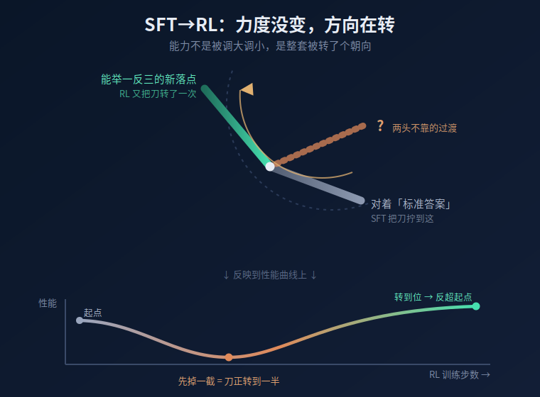

【后训练】"SFT 之后再做 RL，为啥性能先降后升？"——一道流行的面试题，可能没那么简单

最近这道题在网上传得挺多。

> **"为什么大模型先做 SFT、再做 RL，性能会先下降、再爬上来？"**

你要是搜一搜，网上答案不少，而且**基本都对**。只是大多停在"能答上来"那一层，讲完你大概知道了结论，却没太摸到背后到底发生了什么。

今天咱们把这道题**一层一层剥开**，聊到最后你会发现一个挺有意思的事实——而且它顺手还能解释一件特别反直觉的现象：**学霸为什么刷题刷太狠，反而考场翻车。**

先把两个词说人话，后面整篇都用得上：

- **SFT**（监督微调）：拿一堆"别人写好的标准答案"，让模型照着抄、照着背。输入是题、输出是标准答案，模型学的是"模仿"。
- **RL**（强化学习）：不给标准答案了，让模型**自己动手做一遍**，做完看结果好不好，好就鼓励、差就惩罚，让它自己慢慢调。输入是题、输出是模型自己摸索着做出来的答案，反馈是"分数"。

说白了：**SFT 是抄答案，RL 是自己做题对答案。** 这俩的差别，是后面所有事情的根。

━━━━━━━━━━━━━━━━━━━━

◆ 先把网上的 4 种答案，从浅到深排一遍

━━━━━━━━━━━━━━━━━━━━

这部分我们走快点。网上对"先降后升"的解释，基本是这 4 个，我顺着"越来越接近真相"的次序排一下。

**解释一（最朴素）：探索是要交学费的。**

RL 一上来要"探索"——它得主动偏离 SFT 教它的那条"稳妥走法"，去试试别的路，万一更好呢？试的过程里输出就变野了，啥都敢往外蹦。这时候指标当然掉。等它试得够多、攒够了"哪条路有奖励"的经验、慢慢收敛，指标就回来了。

这就是强化学习教科书第一章的 **探索 vs 利用** ：你想找到更好的，就得先放弃眼前确定的。

**解释二（格式稳定假说）：先把腔调焊死，再优化内容。**

SFT 的作用是先把输出的**格式和腔调**焊稳——回答长啥样、用什么口吻、分几段。格式稳了，RL 才好在这个稳定的地基上去抠内容质量。但**SFT 要是练过头**，把模型的潜力榨干了，RL 接手时能捞的油水就少了。

**解释三（进阶，分布错配）：模型把自己练得太自信了。**

这条开始有意思了。

SFT 是拿"离线数据"（别人写好的标准答案）硬灌；RL 是模型"在线采样"（自己当场做题）。这俩喂给模型的东西，**根本不是同一个分布**。

更要命的是：SFT 练得越狠，模型对标准答案就越**自信**——用人话说，它把"答案就该这么写"的概率压得越来越尖、越来越死。结果 RL 一上手，让它自己采样做题，它采出来的东西和 SFT 死磕的那个尖峰**对不上**，早期的"调整方向"全是乱的 → 指标掉；等它慢慢调出一片自己也认、分数也高的区域 → 回升。

**解释四（最深，OOD 遗忘 + RL 修复）：泛化能力被练丢了，RL 去捞回来。**

先说个词：**OOD** （Out-Of-Distribution，分布外）。说人话就是 **举一反三的能力** ：见过的题会做不算本事，没见过的新题型也能做，这才叫泛化。

研究发现一件扎心的事：**SFT 的举一反三能力，在训练很早期就到顶了** ，之后你越练，它反而越往下掉——像一个学生背标准答案背上瘾，背到最后只会这一种解法，换个题型就懵。

那 RL 干了啥？**RL 不是去发明新能力，它干的是把 SFT 练丢的那个"举一反三能力"给捞回来。** 学术叫 restoration（修复），不是 discovery（发现）。

这一点，其实和我们之前两期能接上。187 期《后训练的功与过》（https://mp.weixin.qq.com/s/O2vOsdFxAjsqgK5Uas5qzw ）和 198 期《花 10 倍算力换不到 2 倍提升》（https://mp.weixin.qq.com/s/DbziCA8F-8DGPlJkjOvwtQ ）都讲过：RL 不会给模型灌新本事，它干的是**把概率重新分配**——base 模型本来就会的那些路径里，有的被压下去、有的被抬上来。

你品一下："压下去一些、抬上来一些"，**这本身就是个"方向上"的变化，不是"调大调小"**。哪条路被抬、哪条路被压，决定的是模型往哪个方向倾斜——而不是把某种能力整体放大或缩小。这跟下面要讲的"方向变了、强度基本没变"，其实是同一件事的两头：上面看到的是行为（概率挪来挪去），底下藏着的是权重（方向在转）。

一个反差挺有意思：**SFT 边练边丢，RL 边练边捡。**

━━━━━━━━━━━━━━━━━━━━

◆ 点破一层：③和④其实是同一件事

━━━━━━━━━━━━━━━━━━━━

上面 4 个解释，前两个是表象，真正的肉在③和④。而③和④，**说的根本是同一件事：**

**SFT 把模型的"能力方向"拧偏了——拧到只对标准答案有效；RL 又动了一次这个方向，把丢掉的举一反三能力找补了回来。**

（先埋个伏笔："找补回来"这四个字，后面我得跟你纠正一下——RL 到底把方向转去了哪，其实没那么简单。先按这个朴素版本往下读。）

"分布错配"是从数据角度看这件事，"OOD 遗忘+修复"是从能力角度看这件事，**一体两面。**

到这儿，网上能查到的最深的答案，也就到顶了。

下面这部分，是我读论文时觉得最有意思的地方，平时很少有人提到。

━━━━━━━━━━━━━━━━━━━━

◆ 关键的一层：不是"调大调小"，是"整个转向"

━━━━━━━━━━━━━━━━━━━━

要讲清这件事，得先给你一个工具的直觉。别怕，就在大学线性代数的范围里，我尽量讲人话。

**这个工具叫 SVD（奇异值分解）。**

先垫一句背景：大模型的"知识"很大一部分存在一堆叫**权重矩阵**的大表格里。SVD 干的事，是把一个权重矩阵拆成两样东西：

1. **一组"方向"**（数学上叫奇异向量）——你可以**粗略**理解成"这个模型有哪些能力维度"，比如"识别语气""做数学""讲笑话"，每个能力是一个方向。（严格说一个方向不完全等于一个具体技能，但对咱们理解这事，这么想足够了。）
2. **每个方向上的"强度"**（数学上叫奇异值）——这个能力使多大劲、占多大比重。

> 💡 翻译成人话
>
> 想象一把刻刀。SVD 告诉你两件事：**这把刀朝着哪个方向**（方向），以及**你用了多大力气去刻**（强度）。一个权重矩阵，可以拆成"一堆方向 + 每个方向上使多大劲"。

好，现在有个特别自然、特别朴素的猜想，**大部分人（包括我一开始）都会这么猜：**

"SFT 训练时，八成是把某些能力方向的**强度调大**了——比如把'背答案'这个方向的劲使得特别足；RL 再训练时，又把这个强度**压回去**。先降后升，就是强度被拉高又拉低的过程。"

听起来挺合理对吧？**但翻了翻论文，这个猜想是错的。** （这一节的说法，出自 2025 年的一篇论文《RL Fine-Tuning Heals OOD Forgetting in SFT》，arXiv:2509.12235，后面那些数字也都来自它做的实验。）

而且论文证明"猜错了"的办法特别干净，是个**控制变量实验**，值得讲一下——不然你凭啥信我"方向变了、强度基本没变"这句话：

既然权重矩阵能拆成"方向 + 强度"两部分，那就**一次只动一个，看模型表现怎么变**：

**实验一：只把"强度"换回训练前的样子，方向保持不动。** 结果——模型的举一反三能力**几乎没变化**。说明"强度"不是关键。

**实验二：反过来，只把"方向"换回训练前的样子，强度保持不动。** 结果——模型丢掉的举一反三能力**明显回来了**。说明真正起作用的，是"方向"。

一动强度没反应，一动方向就见效。**这就把"是方向在变，不是强度在变"给坐实了**——不是猜的，是控制变量测出来的。

再补一个数字：论文直接量了"强度"在训练前后的变化，差值只在 0 到 0.005 之间晃——基本等于没动，跟噪声一个量级。而"方向"那边，论文用一个叫**主夹角**的几何工具量了量，确实转出了实打实的角度。

所以这件事可以浓缩成一句话：**强度基本没变，方向转了。**

> 💡 翻译成人话
>
> 还是那把刻刀。你以为 SFT 干的是"把刻刀使的劲调大调小"——**不是**。
>
> SFT 干的是：**力度基本没变，但把刻刀的朝向给拧偏了**——拧到死死对着标准答案那个方向，换个题型就够不着了。
>
> 而 RL 阶段，**刀的朝向又转了一次**——也是只转方向、不动力度。模型丢掉的那点举一反三能力，差不多就是伴着这次转动一起回来的。
>
> 你的能力（刀的力度）大体还在。**丢的不是能力本身，而是朝向。**

这就是为什么"调大调小"那个朴素猜想是错的：至少在论文分析的那些注意力和 MLP 权重矩阵里，主要变化不是某个能力被放大又缩小，而是**方向发生了旋转**。这是两件完全不同的事——一个是音量旋钮，一个是方向盘。SFT 和 RL，主要拧的是方向盘，几乎没碰音量。

其实你顺着想一层，会觉得"只转方向"这事**本该如此**：

- 强度（音量）管的是"**这个能力重不重要**"——你把某个方向的强度调小，等于把这项本事削弱了。
- 方向（方向盘）管的是"**走这条路还是那条路**"——转方向，主要是在换路走，**不是把那项本事本身砍掉**。

那训练的时候，我们想干嘛？**我们根本不想削弱模型任何一项能力**——那些本事都是预训练辛辛苦苦攒下的，丢一个少一个。我们要的只是让它**在该用的时候走对路**。

这么一看，"主要转方向、少碰强度"就不是什么巧合了——**这才是最划算的做法：尽量保住预训练攒下来的能力，只调整什么时候该走哪条路。**

━━━━━━━━━━━━━━━━━━━━

◆ 现在，"先降后升"这条曲线，大致说通了

━━━━━━━━━━━━━━━━━━━━

知道了"方向在转"，那条让人困惑的曲线就好理解多了：

RL 一上来就开始转刀的朝向。但**转向不是瞬移**——训练是靠梯度下降一小步一小步挪的，每步只能按学习率挪那么一丁点，刀得一点一点转过去。这中间必然要经过一段尴尬的过渡地带——

**这段过渡里，刀既离开了旧的朝向（原来对着标准答案那套扔了），又还没在新的落点站稳。两头不靠。** 这时候你拿它去答题，当然答不好 → **指标下降。**

等它转着转着站稳了 → **指标慢慢涨回来，有些设置里还能超过原来。**

先降，是"转到一半的两头不靠"；后升，是"转动停下、站稳了"。

这里我得**老实交代一件事**，免得你以为我把一切都讲圆了——其实没有。这道题往深里走，有一部分是测出来的实锤，有一部分是猜的，还有一部分连论文都没答上来。我一层层给你分清楚。

**第一层，实锤（测出来的）。** 论文能确认：**在它分析的参数矩阵里，SFT 和 RL 这两个阶段，关键变化都是"转方向"，不是调强度。** 这个有控制变量实验撑着，前面讲过了。

**第二层，推测（有地基，但还是猜）。** 论文卡了个壳：它量出来 SFT 和 RL 两阶段的旋转曲线**几乎重叠**，**愣是没分辨出这两次转动到底差在哪**。

这地方我们斗胆补个猜想——而且这个猜想不是凭空来的。

我的直觉是：**SFT 把模型的采样盆地压窄了，RL 一上来先把这个盆地打散，所以会先掉；等新的奖励地形重新把概率质量聚起来，就回升。**

这其实能接上我们很早以前第 45 期《高维流形上的神经网络收敛》（https://mp.weixin.qq.com/s/0hOQt8onSJcuZGJLRE46Fw ）里那套说法：预训练长出来的是一个本我流形 M，后训练不是重造一个脑子，而是在这个流形上挖坑、修坡、改路。当时我们讲 RLHF 的安全训练，说它是在 M 表面挖了一个"安全盆地" R，让模型默认蹲进"作为一个 AI 模型……"那种僵尸态里。

这篇换个角度看，SFT 挖的不是安全坑，而是**标准答案坑**。它把模型往"人类答案就长这样"的区域里压，让模型默认蹲进一个很窄的模仿盆地。这个坑不一定让模型变傻，甚至短期看会让它更稳、更像样；但代价是，坑外面那些原本能走的泛化路径被压低了。

base 模型原本像一大片高维山地，很多路都能走。SFT 拿标准答案反复压它，把很多本来能走的侧路压低，只留下"像标准答案"的那条沟。模型变得顺、稳、格式好，但概率分布也变尖了，探索半径变小了。

RL 一上来不是继续沿着这条沟走，而是拿奖励信号把它往别的方向拽。麻烦就在这里：刚开始拽的时候，旧沟被破坏了，新沟还没形成。旧确定性没了，新确定性还没长出来，模型就卡在一个两头不靠的状态里——这就是 dip。

所以我更愿意把它看成一次**确定性迁移**：

- SFT 给的是外部确定性：标准答案长这样。
- RL 要的是内部确定性：我自己试出来，这样能拿分。
- dip 是两种确定性交接时的真空期。

再往下接我们之前 200 期（《满秩是假象——48 个抽屉撑开了一个柜子》，https://mp.weixin.qq.com/s/BsATyxtyK46XZDIzmtsTWw ）实测过的一件事：**大模型的能力不是糊成一团的，是按一组近似正交的"子空间"分格存放的，格子和格子之间互不打扰**（就像 48 个抽屉，各装各的）。

顺着这个分格结构想：那把"主夹角"的尺子，其实只量了一件事——**刀转了多少度**；它量不出另一件更关键的事——**刀是在哪个抽屉里转的**。SFT 和 RL 那两条"看着重叠"的曲线，会不会就是**在不同的抽屉里各转各的**？角度看着一样，碰的却是不同的能力分格——一个把泛化能力拧丢了，一个又找补回来。

（得说清楚：200 期我们量的是"抽屉和抽屉之间"的隔离，**没去量单个矩阵内部那种更精细的方向**——那是这次论文干的活；而且我们测的是训练完成后的静态快照，不是"先降后升"这个训练过程本身。所以这只是个有地基的猜，别当成我们测出来了。）

**第三层，未知（谁也没答上来）。** RL 到底把方向转去了哪？是把 SFT 拧偏的方向原路转回去了，还是转去了一片全新的、碰巧也能举一反三的高地？论文把它留成了"有待将来研究的开放问题"。甚至还有另一个角度的测量暗示：RL 转完之后，离那个"举一反三最强的旧位置"反而更远了一点——像是没回老家，而是另寻了一片新天地。

所以别被我前面那个顺口的刻刀比喻骗了：**"方向在转"是测出来的，靠得住；但"RL 把方向精确转回正位"只是个好懂的说法，连写论文的人都还没真把这一步看清楚。** 一道看着像送分题的面经背后，其实杵着个顶尖研究者都没拍板的问号——我倒觉得，这才是它最有意思的地方。

补一句出处，免得你觉得我在编故事：二阶段 SFT→RL 里那种"刚切到 RL，训练动态先乱一下、再慢慢恢复"的现象，不是我脑补的。《Beyond Two-Stage Training：Cooperative SFT and RL for LLM Reasoning》（arXiv:2509.06948）在 Qwen2.5-3B 上看到了一个很直观的信号：SFT→RL 进入第二阶段后，响应长度先 sharply decline，再 gradually recover。

另一篇《Quagmires in SFT-RL Post-Training》（arXiv:2510.01624）则从另一个角度补了一刀：在 Mistral-NeMo-12B 和 Qwen3 等模型上，SFT 分数高不等于 RL 之后更强，有些设置里 post-RL 表现也会先 dip 再回升。也就是说，二阶段后训练里，"SFT 看起来越好，RL 之后就一定越好"这个直觉本身就靠不住。

而"SFT 的举一反三能力很早就到顶后衰退"这事，刚才那篇讲"方向旋转"的论文（《RL Fine-Tuning Heals OOD Forgetting in SFT》）也用 LLaMA 跑出来了——大约第 140 步就见顶，之后一路往下。这些不是比喻，是论文里的真数据。

━━━━━━━━━━━━━━━━━━━━

◆ 反直觉钩子：为啥"好学生"做完 RL 反而更差？

━━━━━━━━━━━━━━━━━━━━

这里还有个挺反常识的发现。

按常理，你会想：**SFT 练得越好的模型（checkpoint），拿去做 RL，最后应该越强吧？** 地基打得越牢，楼盖得越高，天经地义。

**另一篇论文（《Good SFT Optimizes for SFT， Better SFT Prepares for RL》，arXiv:2602.01058）在 19 个模型上实测，结论是反的：**

**SFT 分数更高的那个 checkpoint，做完 RL 之后，排名经常反而往下掉，甚至不如一个 SFT 练得"将将够"的弱模型。**

排序，反转了。

为啥？用我们刚建立的"刀"的直觉，**一句话就通了：**

**SFT 练得越狠，刀就被拧得越偏、越死、越自信。** 一把被拧到花岗岩里、焊死了的刀，RL 想再转动它，**费老大劲，甚至根本转不动。**

反过来，一个 SFT 练得"刚刚好"的弱模型，刀只是轻轻偏了点、还很松动，RL 轻轻一拨就转动了——**薄冰一融就通，花岗岩死结你解到天黑。**

（顺带说一句边界：SFT 练得太短也不行，刀还没立起来，RL 也救不回；只有落在中间那个"不多不少"的甜区，RL 才接得住。太短太长都白搭。）

> 💡 翻译成人话：这不就是学霸刷题刷翻车吗
>
> 你身边一定有这种人：平时刷题刷到魔怔，每道题的标准解法都背得滚瓜烂熟。结果一上考场，**遇到个没见过的新题型，先当场懵一下——大脑一片空白那么几秒。** 缓过来之后才想起来："哦对，我本来是会举一反三的啊。"
>
> 那个"懵一下"，就是模型那条曲线的 **dip（下降段）。**
>
> 而且关键来了：**他刷题刷得越狠，那一懵就越深、越久。** 因为他把自己练得太"只会背标准解法"了（SFT 过拟合），那把刀拧得太死，临场想再转动它，就越慢、越难。
>
> 刀拧得越死，越难再转动。学霸和大模型，**栽在同一个坑里。**

这背后藏着一句很硬的话：**记忆不等于能力。** 把标准答案背得越熟（记忆），不代表你越会做题（泛化）——有时候恰恰相反，**背得太死，反而把举一反三的本事盖住了。**

━━━━━━━━━━━━━━━━━━━━

◆ 总结：一道面经，一个世界观

━━━━━━━━━━━━━━━━━━━━

把今天的链条捋一遍：

- "SFT 后做 RL 先降后升"，网上 4 个答案从浅到深：探索学费 → 格式焊稳 → 分布错配 → OOD 遗忘后被 RL 修复
- 最深那两个，其实是同一件事：**SFT 把能力方向拧偏了（只对标准答案），RL 又动了一次这个方向**
- 再往里一层：这个"拧来拧去"，**不是把能力调大调小（强度/奇异值几乎不变），而是让能力方向发生旋转（方向/奇异向量在旋转）**——**强度基本没变，方向转了**
- 换成更直观的话：**SFT 把概率盆地压窄，RL 先打散旧盆地，再按奖励地形重新聚起来**；dip 就是旧确定性没了、新确定性还没长出来的真空期
- "先降后升"=刀转向时，中间那段"既离了旧朝向、又没在新落点站稳"的两头不靠
- 最反直觉的：**SFT 分数越高，不代表越适合接 RL**；练太狠时，刀会被拧得太死，RL 越难再转动它
- 还有个诚实的尾巴：**"方向在转"是测出来的，但 RL 到底把方向转去了哪、是不是转回正位，连论文都还没搞清**——一道面经背后，杵着个开放问题
- 翻译成人话：**学霸刷题刷太狠，遇到新题型先懵一下（那个懵就是 dip），才想起自己本来会举一反三**

所以下次再碰到这道题，除了"探索导致性能波动"那句标准答案，你心里其实还可以多一层理解：

**那不是模型变笨了，那是它在转向。它正在松开自己被 SFT 焊死的那点"确定性"，去够一个原先够不着的地方。**

━━━━━━━━━━━━━━━━━━━━

◆ 参考资料

━━━━━━━━━━━━━━━━━━━━

- **二阶段 SFT→RL 的训练动态：** Beyond Two-Stage Training：Cooperative SFT and RL for LLM Reasoning（arXiv:2509.06948）——Qwen2.5-3B 上观察到 SFT→RL 第二阶段响应长度 sharp decline 后 gradual recovery
- **高 SFT 分数不等于 post-RL 更强：** Quagmires in SFT-RL Post-Training（arXiv:2510.01624）——Mistral-NeMo-12B、Qwen3 等模型上显示高 SFT 分数不能可靠预测 RL 后表现
- **奇异向量旋转 / OOD 修复 / 训练区间边界：** RL Fine-Tuning Heals OOD Forgetting in SFT（arXiv:2509.12235）——奇异值幅度几乎不变（Δσ 仅 0–0.005），变的是奇异向量的旋转；LLaMA 约第 140 步 OOD 见顶；SFT 太短或太长 RL 都救不回
- **强 SFT 反而更差 / 分布错配：** Good SFT Optimizes for SFT， Better SFT Prepares for RL（arXiv:2602.01058）——19 个模型上排序反转，根因是离线 SFT 分布 vs 在线 RL 策略分布的错配

━━━━━━━━━━━━━━━━━━━━

**要去往更高的地方，你得先松开手里那点"我已经会了"的确定性。**

**模型在转向时会先掉一截，人也一样。那一截不是退步，是你正在离开那个"只会标准答案"的旧朝向，去找一个能举一反三的新落点——至于新落点在哪，可能你自己一时也说不清，但脚已经迈出去了。**

━━━━━━━━━━━━━━━━━━━━

// 靳岩岩的 AI 学习笔记 × Claude 的吐槽
// 2026-06-06
