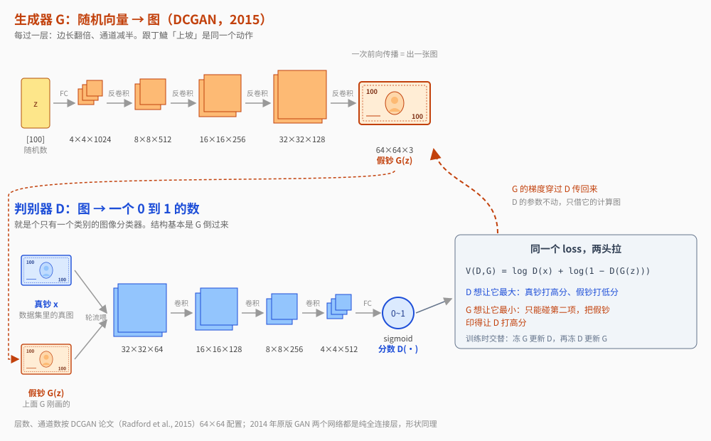
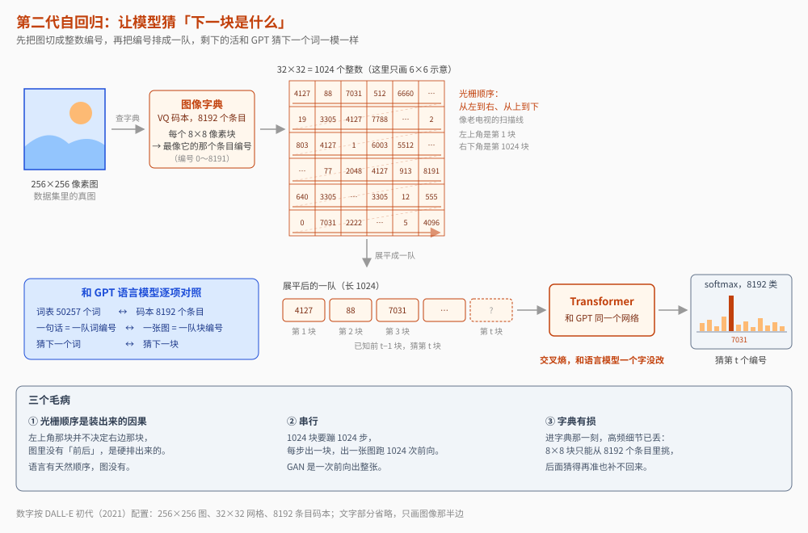
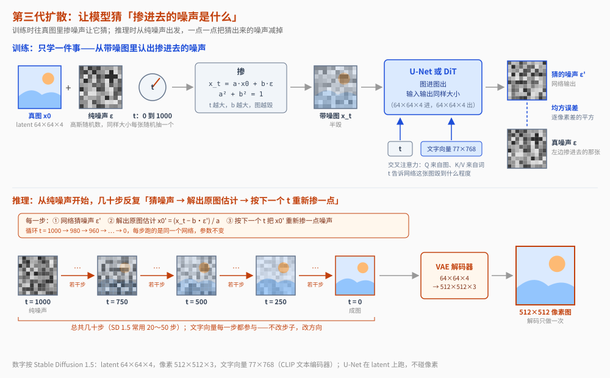
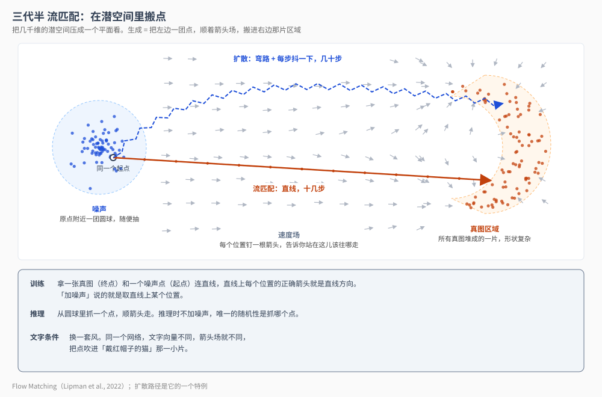
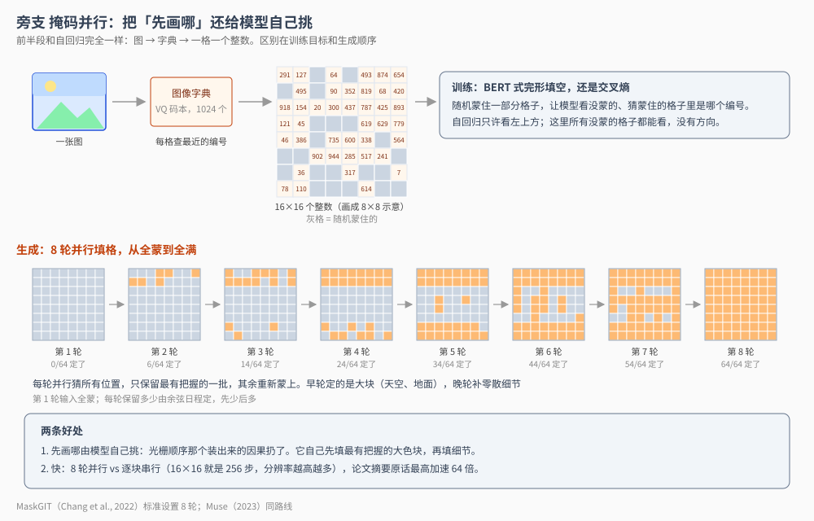
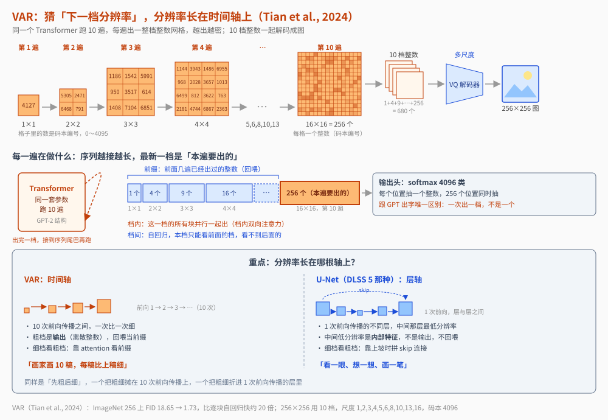
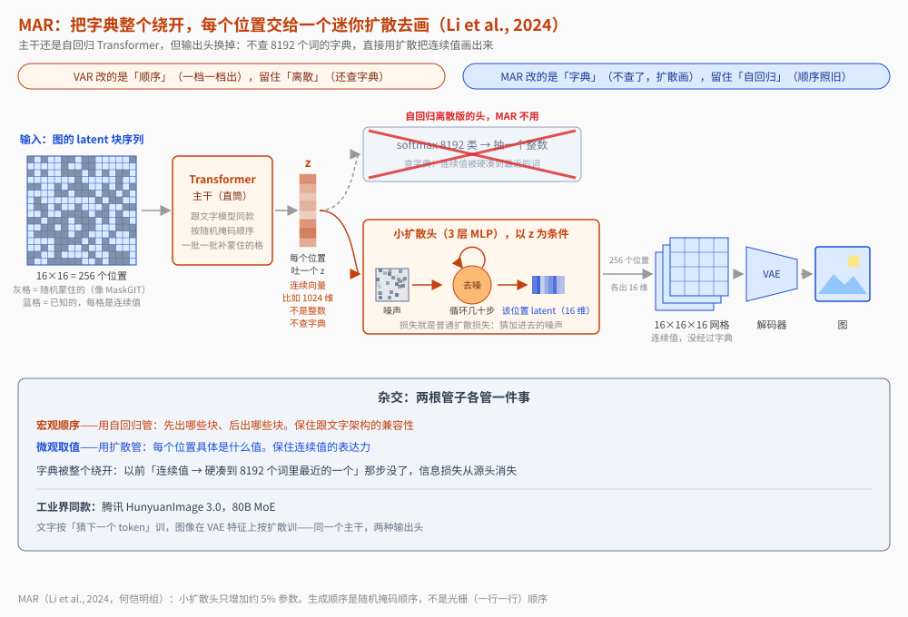

【图像生成】DLSS 5 一遍出图，文生图为什么要几十步

━━━━━━━━━━━━━━━━━━━━

◆ 开篇：从丁鱥那四个噪声通道说起

━━━━━━━━━━━━━━━━━━━━

298 期（ https://mp.weixin.qq.com/s/Dwb7f-xGARXungO-8MXcsQ ）把 DLSS 5 那个“丁鱥”模型的内部翻了一遍，末尾留了个问题没答：它的输入是七通道，RGB 之外还有四个通道，机器码里能看到是当场生成的高斯随机数。**一个确定性的画面修复网络，要随机数干什么？**

要答这个问题，得先绕个远路，去看看那些“凭空变出画面”的模型——就是这两年满大街的文生图——它们是怎么干活的。绕完这一圈，丁鱥吃噪声这件事就有了位置。

先说一个我自己写完才想通的事：**文生图这十几年换了好几代方法，表面上是画质竞赛，底下其实只换了一样东西——你让模型猜什么。**

GAN 让模型猜“怎么骗过裁判”，自回归让模型猜“下一块是什么”，扩散让模型猜“掺进去的噪声是什么”，VAR 让模型猜“下一档分辨率长什么样”。**猜的对象换了，模型对“图像是什么”的理解就跟着换了，画出来的东西也跟着变。**

这篇按时间把这几代方法串一遍，每一代只讲一件事：它让模型猜什么、为什么这么猜、这么猜的代价是什么。网络结构怎么改、参数堆多大，一概不管。

━━━━━━━━━━━━━━━━━━━━

◆ 第一代：GAN——让模型猜“怎么骗过裁判”

━━━━━━━━━━━━━━━━━━━━

2014 年，Goodfellow 提出 GAN（生成对抗网络，Generative Adversarial Network）。它跟后面所有方法都不一样：**不是让一个模型猜某样东西，是让两个模型打架。**

用人话讲，这是一场造假币的游戏：

- **生成器** （造假币的）：吃一个随机数，吐一张图——这张图就是它印的假币，目标是让验钞机把它当真钞收下；
- **判别器** （验钞机）：真钞（数据集里的真图）和假钞（生成器印的）轮流塞给它，目标是分出真假。

两边轮流练。验钞机越练越会抓假，造假币的被逼着越造越真。练到最后，验钞机分不出来了，造假币的就出师了。

论文原版公式是这样（看不懂可以跳过，下面有人话翻译）：

```
min_G max_D  V(D, G) = E_x[log D(x)] + E_z[log(1 − D(G(z)))]
```

先说这一行的读法。它不是一个等式，是一道指令：等号右边那坨给个名字叫 V，是一个吃 D 和 G 两个网络、吐一个数的函数；min_G max_D 是说“调 D 让 V 最大，调 G 让 V 最小”。平时写 LLM 的 loss 只写 L = ……，“最小化”三个字省掉不写，因为 loss 默认就是拿来最小化的；这里不能省，**同一个 V 一边要 max 一边要 min，不写清谁 max 谁 min 就说不清。** E 是期望，代码里就是一个 batch 上取平均：第一项对数据集里的真图 x 平均，第二项对随机采的 z 平均。

再把符号剥掉。**D 是一个打分的神经网络**：吃一张图，吐一个 0 到 1 的数，表示“这是真图的把握”。**G 是一个画图的神经网络**：吃一个随机向量 z，吐一张图 G(z)。两个都是普通网络，没有新零件：



公式里就两项，都是 log 一个概率，取值在负无穷到 0 之间，**越接近 0 越“好”**。第一项 log D(x)，x 是真图，D 给真图打的分越接近 1，这项越接近 0；第二项 log(1 − D(G(z)))，G(z) 是假图，D 给假图打的分越接近 0，这项越接近 0。所以这个和其实是 **D 的验钞成绩单**：真图打高分、假图打低分，成绩就高。

关键在于**两个网络拉的是同一根绳子，但只能碰到自己那头**。D 能改的是自己的打分方式，它要让成绩单最大（max_D）。G 只出现在第二项里，它要让成绩单最小（min_G）——唯一的办法是把假图画得让 D 打高分。

训练时轮流走一步：冻住 G，拿一批真图和一批假图更新 D，D 学会“G 画的猫眼睛都是歪的，看到歪眼睛就打低分”；再冻住 D，把 D 当固定裁判更新 G，梯度穿过 D 的网络传回来告诉 G“眼睛画正一点，分就上去了”。**没有人给 G 标注正确的猫长什么样，G 唯一的学习信号就是 D 那个分数往哪边动。** 一个往上推、一个往下拉，这就是“对抗”两个字的全部意思。

────────────────────

💡 真图什么时候进场，梯度流到哪就停

我第一遍读到“交替训练”时卡了很久：G 印一张假钞 a，D 判它是假的——然后呢？什么时候反向传播？真钞什么时候喂？把一次迭代按拍子走一遍就清楚了。

**第 1 拍，备料**：从数据集抽一批真钞 x，再抽一批随机向量 z 过一遍 G，得到一批 **G 当场刚印的** 假钞 a。

**第 2 拍，训 D，真钞只在这一拍进场**：x 和 a 都过 D，各得一批分数，真钞的分数越高越好、假钞的分数越低越好，这就是 D 的成绩单。反向传播从分数出发，穿过 D，**到图就停** ——真钞上游没东西（数据集不是网络），假钞上游虽然挂着 G，但这一步把它掐断，梯度不往 G 里走。更新 D。

**第 3 拍，训 G，真钞不进场**：再印一批假钞 a′，过刚更新完的 D 得分数，G 只看一件事：假钞的分数有没有上去。反向传播从分数出发，**穿过 D 的每一层，穿进假钞，再穿进 G，走到 G 的第一层才停**。但优化器只挂了 G 的参数：D 每层的梯度算出来了，就是不拿去更新它。D 是被借道，不是被改。

然后回到第 1 拍。一次迭代两次反向传播，D 一次、G 一次。真钞只出现在第 2 拍；假钞在第 2 拍到 D 就停、在第 3 拍流回全程。**D 从真假两批上学“怎么分”，G 只从假钞上学“怎么骗”，而 G 学的那条路必须借 D 的网络走。** “冻住 D”指的是算了不用，不是拦住不流。代码上就是两个优化器各管一个网络的参数，谁的优化器走一步，谁的参数才动。

────────────────────

练完了验钞机就扔掉，只留造假币的。用的时候喂一个随机数，**一次前向传播直接出图**。

────────────────────

💡 一步出图，是 GAN 到今天都没人比得过的优点

后面要讲的每一代方法，出一张图都得跑几十步甚至上千步。GAN 只跑一步。速度上它到今天都是天花板。

先在这儿标一笔：**丁鱥也是一步出图** ——71 个块跑一遍就出画面。这一点它跟 GAN 是一个路数，跟后面要讲的扩散模型不是。这个伏笔留到收尾再收。

────────────────────

但“骗过裁判”这个目标有个天生的毛病。**它只要求“像真的”，不要求“什么样的真图都能画”。** 造假币的只要找到几种能过验钞机的图，任务就完成了，没有任何东西逼它把真实图像的全部花样都学会。于是 GAN 出了名的职业病：生成器翻来覆去只会画那几种图，换个随机数还是那几种。这叫模式坍缩（mode collapse）。

再加上两个模型拔河本来就难平衡——一方把另一方碾压了，训练就崩；而且很难做精细的文字控制（“画一只戴红帽子的猫在左边”这种指令，GAN 接不住）。2022 年前后，GAN 被扩散模型赶下了主桌，现在主要活在超分辨率、人脸生成这类专用场景里。

代表工作：GAN（2014）、StyleGAN 系列

━━━━━━━━━━━━━━━━━━━━

◆ 第二代：自回归——让模型猜“下一块是什么”

━━━━━━━━━━━━━━━━━━━━

GPT 在文字上成功之后，一个很自然的想法冒出来：**能不能把同一套搬到图像上？** 文字是一个词接一个词往外蹦，图像能不能一块接一块往外蹦？

能，但得先做一件事：把图像变成“词”。

做法是先训一个“图像字典”（VQ 码本，Vector Quantization codebook）：把一张 256×256 的图切成 32×32 = 1024 个小块，每个小块在字典里找一个最像的条目，记下编号。字典一共 8192 个条目。于是一张图变成了 1024 个整数，每个整数在 0 到 8191 之间—— **跟一句话变成一串词编号是一回事**。

然后照搬语言模型：把这 1024 个编号从左到右、从上到下排成一队（这个顺序叫光栅顺序，raster order，就是老电视扫描线的顺序），让模型猜下一个编号是什么：

```
L = −Σ log P(x_t | x_1 ... x_{t−1})
```

翻译：看着前面所有块，猜第 t 块是字典里哪一条。猜对了得分，猜错了扣分。这就是语言模型那个交叉熵，一个字没改。



这条路的吸引力是**架构复用**：跟文字共用同一个 Transformer、同一个输出层，词表里既有汉字也有图像块编号，模型根本不区分“这是字还是图”。天然适合做一个模型既能读图又能画图。

但它长期打不过扩散，三个原因：

**一是光栅顺序是装出来的因果。** 文字的“下一个字”有真因果——语法、逻辑、指代，前文真的决定后文。但图像左上角那块并不“决定”它右边那块，像素之间是空间上的邻居关系，不是时间上的先后关系。你逼着模型把空间结构当成时间序列学，它就得浪费容量去拟合一个根本不存在的因果链。

**二是串行慢。** 1024 个块要串行蹦 1024 步，每步一次完整前向传播。

**三是字典有损。** 图像本来是连续的，硬塞进 8192 个条目的字典那一刻，高频细节已经丢了——这个伏笔后面 MAR 会回来收。

────────────────────

💡 这条路 2026 年还活着，而且活在最显眼的地方

别以为自回归生图被淘汰了。OpenAI 2025 年 3 月发的 GPT-4o 原生图像生成，官方系统卡里明确写着：跟 DALL·E 那种扩散模型不同，4o 的图像生成是一个原生嵌在 ChatGPT 里的自回归模型。Google 的 Gemini 技术报告也自述能原生输出离散图像 token。

**所以“扩散赢了”只是学术榜单上的说法，产品里两条路都在跑。** 为什么 OpenAI 选自回归？就是上面说的那个理由：跟文字模型共用一套架构，图和字在同一个模型里一起理解、一起生成，不用另挂一个部件。

────────────────────

代表工作：DALL-E 初代（2021）、Parti（2022）、GPT-4o 原生生图、Gemini 原生生图

━━━━━━━━━━━━━━━━━━━━

◆ 第三代：扩散——让模型猜“掺进去的噪声是什么”

━━━━━━━━━━━━━━━━━━━━

2020 年 DDPM 把问题整个换掉了。不猜“下一块是什么”，猜的是 **“这张模糊的图里掺了什么噪声”**。

147 期（ https://mp.weixin.qq.com/s/j_pdmliVGlX-28AVyXcwSA ）专门讲过扩散，这里只说目标函数那一层。

**训练时**：拿一张真图，随机挑一个“毁坏程度” t，按比例往里掺高斯噪声，得到一张半毁的图。让模型看着这张半毁的图和 t，把掺进去的噪声猜出来：

```
L = E‖ε − ε_θ(x_t, t)‖²
```

翻译：ε 是真掺进去的噪声，ε_θ 是模型猜的噪声，两者差的平方越小越好。**注意这是均方误差，是回归任务，不是分类。** 模型输出的是一堆连续的数，不查任何字典。

**生成时**：从一张纯噪声开始，反复“猜噪声、减掉一点”，几十步之后画面从雾里浮出来。

用人话打个比方：**自回归是写作文，一个字一个字往外写；扩散是擦雾，整块玻璃一起擦，每擦一遍清楚一点。**



对着自回归的三个毛病，扩散正好解了两个：

**没有人为顺序。** 每一步去噪是全图所有像素同时更新，空间关系就是空间关系，不用假装是时序。构图、对称、远距离呼应这些全局结构，在每一步里都被整体看到。

**没有字典损失。** 直接在连续空间里回归，细节不用先过一遍 8192 条目的字典。

代价同样明确：**慢** ——几十步，每步一次完整前向传播，比 GAN 的一步慢两个数量级；以及 **跟文字模型不兼容** ——回归输出和语言模型的离散 softmax 是两套东西，想做一个既能读又能画的模型，只能把两套缝在一起。

2021 到 2023 年，Stable Diffusion、DALL-E 2、DALL-E 3、Midjourney 把这条路线推成了行业默认。

代表工作：DDPM（2020）、Latent Diffusion（2021，Stable Diffusion 的技术底子）、DALL-E 2、DALL-E 3

━━━━━━━━━━━━━━━━━━━━

◆ 三代半：流匹配——扩散的数学整容版

━━━━━━━━━━━━━━━━━━━━

严格说不是新物种，是扩散的亲戚，但值得单列——因为 2026 年你看到的“扩散模型”，多数实际跑的是它。

扩散的去噪路径是从随机过程推出来的，弯弯绕绕。流匹配（Flow Matching）换了个更干净的问法：在“噪声”和“图像”之间，**学一个速度场，把点平滑地从这头搬到那头。**

**训练时**：取一个噪声点 x₀ 和一张真图 x₁，在两点之间连条直线。在线上随机取个位置 x_t，让模型猜“该往哪个方向走、走多快”。目标速度就是这条直线的方向：

```
L = E‖v_θ(x_t, t) − (x₁ − x₀)‖²
```

（这是论文里“最优传输路径”那个特例的极限简化。原文的目标是 x₁ − (1 − σ_min)x₀，多一个很小的缩放系数 σ_min，趋近于零时就是上面这个式子。）

还是回归、还是均方误差，跟扩散一个家族——论文自己就证明了扩散路径是流匹配的特例。区别只在一处：**搬运路径被拉直了。** 扩散是弯路，要走几十步；流匹配是直线，十几步甚至几步就到。



理论上两者等价，工程上流匹配更好用。所以新一代主力模型悄悄完成了换代：Stable Diffusion 3 的技术报告用的是 rectified flow（整流流），Flux 官方模型卡自述 rectified flow transformer，阿里 Qwen-Image 技术报告明确用 flow matching 目标，字节的视频生成 Seedance 1.0 也是流匹配。**论文里说“扩散”，很多时候指的已经是它。**

代表工作：Flow Matching（2022）、Stable Diffusion 3（2024）、Flux

━━━━━━━━━━━━━━━━━━━━

◆ 旁支：掩码并行——把“先画哪”还给模型自己挑

━━━━━━━━━━━━━━━━━━━━

在扩散如日中天的时候，离散 token 那一派内部也在自救。MaskGIT 这一族的思路：自回归的问题不在“把图切成字典编号”，在 **光栅顺序** ——那把顺序扔了行不行？

还是图像字典、还是交叉熵，但训练从“猜下一个”换成 BERT 那种**完形填空**：随机蒙住一部分图像块，让模型根据没蒙的部分猜蒙住的。

生成时玩法变了：先全部蒙住，一轮**并行**猜所有位置——但只保留模型最有把握的那一批，剩下的重新蒙上，下一轮再猜。论文的标准设置只要 **8 轮**，全图出来。



好处有两个。一是**先画哪由模型自己挑**：每轮留下的是它最有把握的部分——通常是大色块、背景、主体轮廓——难的细节留到后面几轮，等上下文更充分了再定。光栅顺序那个装出来的因果被扔掉了，顺序从人为约束变成了模型的自由变量。二是**快**：8 轮并行对上千步串行，论文摘要里的原话是最高加速 64 倍。

代表工作：MaskGIT（2022）、Muse（2023）

━━━━━━━━━━━━━━━━━━━━

◆ 第四代：VAR——把假因果换成真因果

━━━━━━━━━━━━━━━━━━━━

2024 年，VAR 给自回归阵营翻了案。它保留“猜下一个”的形式，但把“下一个”的定义整个换掉：**不是下一个空间位置，是下一档分辨率。**

先生成 1×1 的全图概览，再 2×2、3×3、4×4……一路细化到 16×16（论文 256×256 的图用 10 档，最后一档是 latent 网格的分辨率，不是像素）。每一档内部所有块**并行**出，档与档之间保持自回归——上一档的粗图当条件，猜下一档的细图。



这一改最值得品的地方：**“粗轮廓决定细节”这个因果是真的。** 画家确实先打形再上调子，构图确实先于笔触，整体确实约束局部。光栅顺序的因果是装的，由粗到细的因果是真的。

同样是交叉熵、同样是“猜下一个”，把因果链从假的换成真的，质量和速度一起上来了。论文摘要的原话：VAR 首次让 GPT-like 的自回归模型在图像生成上超过了扩散 Transformer——ImageNet 256 上 FID 从 18.65 降到 1.73，推理比逐块自回归快约 20 倍。10 档就是 10 遍前向传播，等于 10 步出图。

代表工作：VAR（2024）

━━━━━━━━━━━━━━━━━━━━

◆ 第四代：MAR——把字典整个绕开

━━━━━━━━━━━━━━━━━━━━

同一年，何恺明组从另一个方向动刀。VAR 修的是顺序，MAR 修的是**字典**：图像本来是连续的，凭什么非要先过一遍 8192 条目的字典？

MAR 的做法：自回归照做（顺序用的是掩码并行那种随机蒙、分批出，不是光栅），但每个位置不输出字典编号，**直接输出一个连续向量**。问题来了——交叉熵只能算在离散类别上，连续向量的概率分布怎么建？答案是给每个位置挂一个**小扩散头**：以这个向量为条件，用扩散的那套损失把它“渲染”成图像内容。

等于把两条路线杂交了：宏观顺序用自回归管（保住跟文字架构的兼容性），微观每个位置的取值用扩散管（保住连续值的表达力）。字典被整个绕开，信息损失从源头消失。



────────────────────

💡 这个杂交思路，工业界已经在用了

腾讯混元 HunyuanImage 3.0 的技术报告写得很明白：80B 参数的 MoE，统一在一个自回归框架里，文字部分按“猜下一个 token”训，图像部分在 VAE 特征上按扩散那套训。**自回归骨架加扩散头，跟 MAR 的思路同款。** 2026 年 1 月出的 3.0-Instruct 版沿用同一架构。

────────────────────

代表工作：MAR（2024）、HunyuanImage 3.0（2025）

━━━━━━━━━━━━━━━━━━━━

◆ 2026 年的现状：路线成了商业机密

━━━━━━━━━━━━━━━━━━━━

写到这儿本来该列一张“现役模型各走哪条路”的表。我真去查了一遍，结果是这样：

```
GPT Image 2（OpenAI，2026-04）        未公开。只说“从头重做的全新架构”，被问扩散还是自回归拒答
Nano Banana 2（Google，2026-02）      未公开。只说“原生图像生成”，无技术报告
Seedream 5.0（字节，2026-02 至 07）   未公开。Lite、标准、Pro 三档全无技术报告
Qwen-Image 3.0（阿里，2026-07）       未公开。无技术报告、无权重（1.0/2.0 都是开源+报告）
Kling Image 3.0（快手，2026-02）      未公开。只说“统一的原生多模态架构”
Midjourney V8.2（2026-07）            从不公开
FLUX 3（BFL，2026-07）                流匹配系，方法论文 Self-Flow 公开，本体无报告
HunyuanImage 3.0（腾讯，2026-01）     公开：自回归框架 + 扩散头，1 月的 Instruct 版同架构
```

**八家里六家不说。** 对比一下 2024 年：Stable Diffusion 3、Flux、VAR、MAR，个个有论文有公式。两年之间，“我的模型让它猜什么”从论文的第一节变成了不能说的事。

这本身就是个信号。前面几代方法的故事都是靠公开论文串起来的；从 2026 年起，这条线索在头部产品这儿断了。以后要判断一家的路线，可能得像上文 298 期逆向 DLSS 那样，去二进制里找证据。

────────────────────

💡 GPT Image 2 连“是不是自回归”都不肯答

它的前代 GPT-4o 在系统卡里白纸黑字写着自回归、逐 token 出图。到了 2 代，发布会上记者直接问“扩散、自回归还是混合”，OpenAI 拒绝回答，只说“从头重做”。外面的测试者根据出图速度猜它可能是一遍出图（single pass），但这是推测，不是官方口径。**如果猜对了，那它就站到了前面 GAN 那条线上——也是丁鱥所在的那条线。** 到底是什么，只能记着。

────────────────────

现役的表列不出来，那就把能列的列全，再回头看丁鱥。

━━━━━━━━━━━━━━━━━━━━

◆ 收尾：回到丁鱥的四个噪声通道

━━━━━━━━━━━━━━━━━━━━

一张总表：

| 路线 | 让模型猜什么 | 损失 | 顺序 | 代表 |
|----|----|----|----|----|
| GAN | 怎么骗过裁判 | 对抗 | 一步出图 | StyleGAN |
| 自回归离散 | 下一个字典编号 | 交叉熵 | 光栅（假因果） | Parti、GPT-4o |
| 扩散 | 掺进去的噪声 | 回归 | 无序，全图同步 | DDPM、DALL-E 3 |
| 流匹配 | 搬运的速度 | 回归 | 无序，全图同步 | SD3、Flux |
| 掩码并行 | 蒙住的块 | 交叉熵 | 模型自选 | MaskGIT、Muse |
| 下一档分辨率 | 下一档的粗图 | 交叉熵 | 由粗到细（真因果） | VAR |
| 连续自回归 | 下一个连续向量 | 自回归 + 扩散头 | 模型自选（掩码顺序） | MAR、混元 3.0 |

把“顺序”那一列单独抽出来看，这十几年的暗线就露出来了：

- **光栅顺序** （假因果）：把画画当写作文，假装左上角决定右下角；
- **无序** （取消因果）：扩散全图同步去噪，干脆不回答“先画哪”；
- **模型自选** （因果当变量）：掩码并行把选择权还给模型；
- **由粗到细** （真因果）：VAR 终于找到图像里真正的因果——构图先于笔触。

**生图方法的进化史，就是一部给图像找正确因果结构的历史。** 扩散赢了第一阶段，不是因为它找到了真因果，是因为它取消了假因果——在正确答案出现之前，不回答比答错强。

现在回到开头那个问题：**丁鱥要噪声干什么？**

看完这一圈就有了坐标。丁鱥是**一遍出图**，这跟 GAN 是一路，跟扩散那种几十步反复擦雾不是一路——执行图里 71 个块跑一遍就出画面，没有循环。但它又**吃噪声**，这是生成式模型的标志：确定性的修复网络只需要“看清楚”，不需要随机数；要“无中生有”补出原图里没有的细节，才需要随机性当原料。

**一遍出图、吃噪声、七千万参数、几毫秒** ——这几个特征拼在一起，最像的是两种东西：要么是 GAN 那种一步生成器，要么是把几十步的扩散模型蒸馏成一步的那类方法（近两年学术界有一批这种工作，SDXL Turbo 是最出名的例子）。丁鱥的训练目标 NVIDIA 没公开，泄露的 DLL 里只有推理时的权重和核心，训练时有没有判别器、有没有老师模型，从二进制里读不出来。所以这一段只能停在“像什么”，停不到“是什么”。

但至少一件事定了：**DLSS 5 不再是“把糊图修清楚”，是“把画面画出来”。** 上文 298 期说它从“教滤镜怎么滤”变成了“直接画”，这一篇给了那个“画”字一个谱系——它站在 GAN 和一步扩散那一支上，跟文生图那些几十步的模型是亲戚，只是被一帧几毫秒的预算逼成了一步。

━━━━━━━━━━━━━━━━━━━━

◆ 参考资料

━━━━━━━━━━━━━━━━━━━━

Goodfellow et al., Generative Adversarial Networks, arXiv:1406.2661（蒙特利尔大学，2014）

Ramesh et al., Zero-Shot Text-to-Image Generation, arXiv:2102.12092（OpenAI，2021；DALL-E 初代，32×32 = 1024 个 token、8192 条目码本）

Yu et al., Scaling Autoregressive Models for Content-Rich Text-to-Image Generation, arXiv:2206.10789（Google，2022；Parti）

Ho et al., Denoising Diffusion Probabilistic Models, arXiv:2006.11239（UC Berkeley，2020；DDPM，噪声预测目标）

Rombach et al., High-Resolution Image Synthesis with Latent Diffusion Models, arXiv:2112.10752（慕尼黑大学等，2021；Stable Diffusion 的技术底子）

Lipman et al., Flow Matching for Generative Modeling, arXiv:2210.02747（Meta，2022；证明扩散路径是流匹配的特例）

Esser et al., Scaling Rectified Flow Transformers for High-Resolution Image Synthesis, arXiv:2403.03206（Stability AI，2024；Stable Diffusion 3）

Chang et al., MaskGIT: Masked Generative Image Transformer, arXiv:2202.04200（Google，2022；8 轮并行解码，最高加速 64 倍）

Chang et al., Muse: Text-To-Image Generation via Masked Generative Transformers, arXiv:2301.00704（Google，2023）

Tian et al., Visual Autoregressive Modeling: Scalable Image Generation via Next-Scale Prediction, arXiv:2404.02905（北大、字节，2024；VAR，FID 1.73）

Li et al., Autoregressive Image Generation without Vector Quantization, arXiv:2406.11838（MIT、Google DeepMind、清华，2024；MAR，何恺明组）

Tencent Hunyuan, HunyuanImage 3.0 Technical Report, arXiv:2509.23951（腾讯，2025；80B MoE，自回归框架 + VAE 特征上的扩散建模）

Wu et al., Qwen-Image Technical Report, arXiv:2508.02324（阿里，2025；flow matching 目标）

ByteDance Seed, Seedance 1.0, arXiv:2506.09113（字节，2025；flow matching 视频生成）

OpenAI, Addendum to GPT-4o System Card: Native Image Generation（2025-03；原文自述 4o 图像生成是自回归模型，区别于扩散的 DALL·E）

Black Forest Labs, FLUX.1 [dev] 模型卡（Hugging Face；自述 rectified flow transformer）

说明：GPT Image 2、Nano Banana 2、Seedream 5.0、Qwen-Image 3.0、Kling Image 3.0、Midjourney V8.2 均未公开技术路线，正文按“未公开”处理，不做推测归类。

━━━━━━━━━━━━━━━━━━━━

文生图换了四代方法，表面是画质竞赛，底下只换了一样东西：你让模型猜什么。猜“怎么骗裁判”是 GAN，猜“下一块”是自回归，猜“掺了什么噪声”是扩散，猜“下一档分辨率”是 VAR。

生图方法的进化史，就是一部给图像找正确因果结构的历史。扩散赢在取消了假因果，VAR 赢在找到了真因果。

丁鱥一遍出图、又吃噪声——它站在 GAN 和一步扩散那一支上，跟文生图是亲戚，只是被一帧几毫秒逼成了一步。

━━━━━━━━━━━━━━━━━━━━

// 靳岩岩的 AI 学习笔记 × Claude 的严谨 × Gemini 的浪漫
// 2026年9月3日

━━━━━━━━━━━━━━━━━━━━

【摘要（发布用，不进正文）】

文生图换了四代方法，底下只换了一样东西：你让模型猜什么。GAN 猜怎么骗裁判、自回归猜下一块、扩散猜噪声、VAR 猜下一档分辨率。顺着这条线回头看，DLSS 5 一遍出图又吃噪声，就有了坐标。
