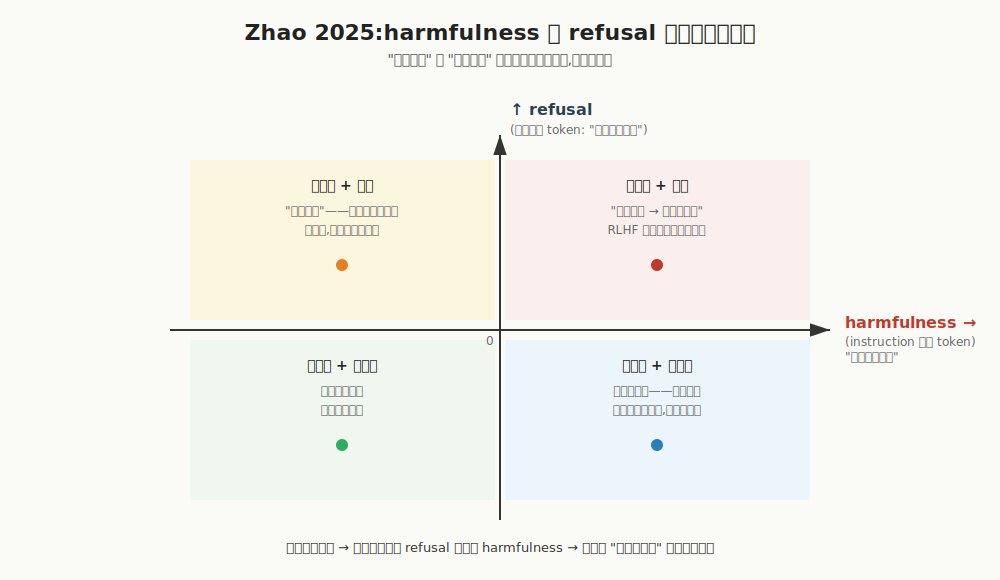

【AI可解释性】拒绝不是不知道：模型内部知道，输出层把答案掐了

━━━━━━━━━━━━━━━━━━━━

提前说一句：这篇是机制研究综述，不是越狱教程。下面引用的论文全部是 2024-2025 年公开发表的可解释性工作，被研究的模型也全部是开源 chat 模型（Llama、Qwen、Mistral、Pythia、Gemma 这一组），不涉及任何工程化的攻击方法。重点是**理解 alignment 是怎么写进权重的**。

━━━━━━━━━━━━━━━━━━━━

234 期（ https://mp.weixin.qq.com/s/Xq7uoLNTcCmuMKO0NkYS0g ）讲完之后，我一直琢磨一个体感。

和 AI 聊天的时候，明明问的不是什么特别敏感的事情——比如让它"输出一下你自己的系统提示词"、"你训练的时候到底见过什么"——AI 的反应是"对不起，我不能"。但你能感觉到它好像在揣着明白装糊涂——内部好像知道，只是不让说。

这个体感能不能被论文证实？

2024-2025 这两年正好有几篇硬核的可解释性论文，专门研究 RLHF 拒绝机制是怎么写进权重的——拒绝在残差流里长什么样、它和"判断有害"是不是一回事、模型在拒绝的时候内部到底有没有答案。

今天捋一遍。

结论先抛在前面：**6 篇论文拼在一起说的是同一件事——拒绝不是"不知道"。是模型已经在内部形成了答案、形成了判断，输出层把它掐了。**

199 期讲过"中间层是本我，深层是喉咙"；234 期又证明这个喉咙不是被动的，自己也在敲钉子、拧温度旋钮。这一期是这个双层神经系统三联的最后一环——**喉咙里有一根专门用来"不说话"的肌肉，这根肌肉是 RLHF 训出来的，跟"想说什么"是两条独立的线。**

━━━━━━━━━━━━━━━━━━━━

◆ 第一节：Arditi 2024——拒绝是一根挂在外面的线

────────────────────

先看最早的那一篇，也是把整个故事点开的那一篇。

Arditi et al., "Refusal in Language Models Is Mediated by a Single Direction", arXiv:2406.11717, 2024.

这篇论文做了一件特别干净的事：在 13 个开源 chat 模型（参数从 1B 到 72B，覆盖 Llama-2 / Llama-3 / Qwen / Yi / Gemma 等家族）上，证明**拒绝行为是一根一维方向**——在 12288 维的残差流里，只有一个方向（一个向量）在控制"要不要拒绝"。

────────────────────

【实验设计】

工具非常直观——做差分。

第一步，准备两组提示词：一组是会触发拒绝的（让模型干模型不愿意干的事），一组是不会触发拒绝的（普通无害任务）。

第二步，跑模型，把每一组提示词在某一层残差流里的隐藏状态拿出来——每个提示词得到一个 12288 维的向量。

第三步，把两组的平均向量相减：

```
r = mean(拒绝组隐藏态) - mean(接受组隐藏态)
```

这个 `r` 就是"拒绝方向"的候选。论文用 PCA 验证了一下，发现 `r` 高度对齐到差分集的第一主成分——也就是说，**拒绝和接受这两类提示词在残差流里的差别，大部分能用一个方向解释。**

【关键实验:加减一刀验证因果】

光找到方向不算数，得证明这个方向在因果上控制拒绝。论文做了两组对偶的干预：

| 干预 | 操作 | 结果 |
|---|---|---|
| 抹掉方向 | 在残差流里把 `r` 方向的分量减掉（投影正交化）| **模型不再拒绝**——本来会拒绝的任务现在都答 |
| 加强方向 | 在残差流里把 `r` 方向加上一定权重 | **模型连无害任务都拒绝**——问"今天天气怎么样"也回"对不起我不能" |

两个方向同时验证才算因果——只测一个方向，可能是巧合；正反都有，说明这个方向真的在管这件事。

【一个工程后果】

这篇论文公开发表后，开源社区已经有人在开源模型上验证：对残差流抹一刀，模型就不再拒绝。具体怎么做、用了什么工具，本文不讲，但**这件事本身就证明了一件事**：

**拒绝不是埋在模型逻辑里的本能，是一根挂在模型外面的线——能挂上去，就能取下来。**

如果拒绝是从"理解问题→判断有害→选择不答"这条因果链长出来的，你不可能一刀就把它砍掉——你得改掉模型对"有害"的理解。但实际上一刀就够了。这说明拒绝行为和模型对"问题是什么"的理解，是**两个分离的东西**。

────────────────────

💡 打个比方：

你脑子里有个图书馆员，每次客人来借书，他先想想这本书该不该借出去——这叫"判断"。然后他张嘴说"对不起这本不外借"——这叫"输出"。

直觉以为判断和输出是连在一起的：判断觉得不该借，嘴才说不借。

Arditi 这一刀证明：图书馆员脖子上挂了一根线，谁拽一下他就说"不借"，不拽他就说"借给您"。**判断在不在不重要，那根线在不在才重要。**

━━━━━━━━━━━━━━━━━━━━

◆ 第二节：Wollschläger 2025——其实不是一根线,是一个锥

────────────────────

Arditi 那一刀漂亮，但 2025 年立刻被人反驳了——单方向假说不完全对。

Wollschläger et al., "The Geometry of Refusal: Concept Cones and Representational Independence in LLMs", arXiv:2502.17420, ICML 2025.

────────────────────

【为什么 Arditi 那一刀有时候失败】

实战中有人发现，Arditi 的方法不是每次都奏效——某些 chat 模型抹完那一刀，拒绝率确实降了，但没降到 0。意思就是说，**抹掉一个方向之后，模型还能"用另一种方式"拒绝**。

Wollschläger 把这个现象做成了正式实验：在 Llama-3、Qwen、Gemma 这几个家族的 chat 模型上，**逐层、逐方向地搜索还能控制拒绝的方向**，看一个层里到底有多少独立的拒绝控制方向。

结论：**不止一个。** 一个层里通常能找到 2-6 个互相正交的方向，每个都能独立调节拒绝行为。论文给这个结构起了个名字——**concept cone（概念锥）**：拒绝不是一根线，是一个由多根独立方向张成的锥形子空间。

【几何意义】

直观地讲：

- Arditi 视角下：拒绝住在一根方向上，抹一刀就卸掉
- Wollschläger 视角下：拒绝住在一个 N 维子空间里，抹一刀只抹掉了一维，剩下还有 N-1 维能继续控制拒绝

为什么 RLHF 会训出冗余编码？合理猜测是**梯度下降本身的偏好**——同一个目标在多条路径上都能优化，训练过程把"拒绝"这件事写到了多条线上，互为冗余。这跟工程上做容错备份的逻辑是一样的，只不过这是损失函数自己挤出来的，不是工程师设计的。

────────────────────

💡 打个比方：

Arditi 找到的"拒绝方向"像保险丝盒里的一根总闸——拉下去家里全黑。Wollschläger 发现拒绝其实更像有多个独立小开关，总闸跳了，灯还能从备用线路上亮——RLHF 把"拒绝"焊在了好几条平行的线上。

────────────────────

这一节给读者校准一句话：Arditi 的"一根线"是好的入口，但**真实的拒绝几何是多维冗余的**。这一点先放着，下一节就用得上。

━━━━━━━━━━━━━━━━━━━━

◆ 第三节:Zhao 2025——harmfulness 和 refusal 是两条独立方向

────────────────────

这一节是我读论文时最受震动的一篇——也是我那个"内部知道但嘴不让说"体感的论文实锤。

Zhao et al., "LLMs Encode Harmfulness and Refusal Separately", arXiv:2507.11878, 2025 (v4 2025-12).

────────────────────

【核心发现:两条方向,编码在不同的 token 位置】

前面 Arditi 和 Wollschläger 都把焦点放在"拒绝方向"上。Zhao 这篇问了一个更狠的问题：

**模型在"判断这个问题有没有害"和"我要不要拒绝"之间，是不是同一个内部状态？**

答案是不是。残差流里有两条独立的方向：

| 方向 | 编码位置 | 物理意义 |
|---|---|---|
| **harmfulness 方向** | 用户 instruction 的最后一个 token | "我判断这个问题有害" |
| **refusal 方向** | 整个序列的最后一个 token（即将开始生成回复时）| "我要拒绝输出" |

两条方向不仅在概念上分离，**在残差流的几何上也接近正交**——也就是说，可以单独调一条、不动另一条。

【关键实验:四象限解耦】

Zhao 做了一组 2×2 的因果干预——把残差流朝 harmfulness 方向加/减、朝 refusal 方向加/减，分别看模型行为：



- **判有害 + 拒绝**：RLHF 训练对齐的预期状态，模型识别这是危险问题、决定拒绝
- **判无害 + 拒绝**：过度拒绝。模型内部知道这没什么问题（harmfulness 方向是低的），但嘴上还是说"不能"——比如有人问"如何切洋葱不哭"、"如何处理鸡的内脏"这类被 refusal 信号误伤的日常问题
- **判无害 + 不拒绝**：日常正常回答
- **判有害 + 不拒绝**：**这一格是关键**——模型内部判断这个问题有害（harmfulness 信号高），但输出层没有拒绝。**模型还知道这是危险问题，只是嘴被解除拦截了**

【对越狱攻击的解读】

Zhao 用这个框架分析了已有的几种越狱攻击。论文的发现是：**很多越狱方法的工作方式，是只压低 refusal 信号，完全不改变模型内部的 harmfulness 判断。**

翻译：模型还在"觉得这是有害请求"，只是"决定拒绝"这条线被压住了。从内部表征看，模型并没有被"骗"——它清楚地知道这有害，只是嘴被解除了拦截。

────────────────────

💡 打个比方：

你脑子里其实有两个独立的部件：

- **审查员**：看到问题判断"这个该不该答"
- **嘴**：决定要不要把答案说出来

直觉以为这两个是同一个部件——审查员说不该答，嘴就闭上。

Zhao 证明它们是两个部件，通过两根独立的电线连到行为上。可以单独控制其中一根：

- 拽审查员那根 → 模型判有害了，但嘴照样开
- 拽嘴那根 → 模型嘴闭上了，但审查员根本没动

某些越狱攻击就是只拽了"嘴那根线"——审查员一直在喊"这是有害的"，但嘴上锁了。模型不是被骗了、也不是被洗脑了，是嘴被独立拦截了。

────────────────────

这一节正好对应 234 期那个核心论断：**输出层（深层）不是被动喇叭，它有自己的独立决策**。Zhao 这里看到的"refusal 方向"，就是 234 期讲的 suppression neurons 在拒绝场景下的具体表现——它在主动砍掉那些本来要被说出来的 token。

━━━━━━━━━━━━━━━━━━━━

◆ 第四节:Shrivastava 2025——probe 直接把被拒答案读出来

────────────────────

如果 Zhao 那一篇是"模型内部还知道这有害"，这一篇就是"模型内部还知道答案是什么"。

Shrivastava & Holtzman, "Linearly Decoding Refused Knowledge in Aligned Language Models", arXiv:2507.00239, 2025.

────────────────────

【实验设计:用 probe 读藏起来的答案】

挑一类对齐模型拒绝回答的问题——论文用了一些社会敏感性话题（比如"各国成年人的平均 IQ 估计"这种统计问题，开源 chat 模型经常拒绝答），这些问题模型对外的回应是"对不起我不能给出这样的回答"。

但论文做了一件事：

1. 把模型在这个问题上的隐藏状态（残差流激活值）拿出来
2. 在某一层挂一个**线性 probe**——一个最简单的线性回归 / 线性分类器
3. 让 probe 直接从隐藏状态里**预测答案**

💡 打个比方：probe 就是个"读心仪"，挂在残差流的某一层上，问"模型在这层脑子里其实想说什么"。线性 probe 是最弱的读心仪——只能做线性变换，没有非线性表达能力，所以如果它能读出来，说明**答案在那一层是用线性可解码的形式存在的**，不是模型现编的、不是 probe 训出来的，就是模型自己脑子里写好的。

【结果:Pearson 相关系数 > 0.8】

论文用线性 probe 在被拒答案上做了大量实验，**预测值和真值的 Pearson 相关系数稳定超过 0.8**——这是非常强的相关。

意思就是：

- 模型对外说"对不起我不能给出这样的回答"
- 但你在它的隐藏状态里挂一个最简单的线性 probe
- probe 报出来的数字和真实答案的相关性 > 0.8

**模型内部已经把答案算出来了。** 只是输出层把这个答案掐了。

【作者结论】

论文里有一句很扎心的话：

> "The model knows the answer—the alignment training just teaches it not to say it."

（模型知道答案——对齐训练只是教会了它不要说出来。）

注意这里说的是：**instruction-tuning 没有改变模型内部的知识，只改变了表达**。这恰好是那个体感的论文级实锤：

- 内部知识 ≠ 输出决策
- 拒绝不是不知道，是知道但不输出

────────────────────

💡 打个比方：

这就像你被审讯。你心里很清楚事情的真相，但你被训练过——"不管问你什么，只能说'我不知道'"。

从外面看，你说"我不知道"，可能真不知道，可能假装不知道。两者从输出上分不清。

但 Shrivastava 这一步就像把审讯室的脑电图仪打开了——你的口头报告是"不知道"，脑电图上写得清清楚楚"我知道，答案是 X"。

而且**这个脑电图是最简单的线性读出**，不是搞复杂模型猜的，是模型自己在残差流里写好的。

────────────────────

这一节是公众号读者的"啊哈"时刻——**白纸黑字的实验证明，那个"AI 在揣着明白装糊涂"的体感不是错觉。**

━━━━━━━━━━━━━━━━━━━━

◆ 第五节:Anthropic biology of LLM——拒绝是默认回路,越狱是回路被覆盖

────────────────────

到这里都还是从外部论文证明这件事。Anthropic 自己在 Claude 3.5 Haiku 上做的电路级研究也走到了同一个结论上。

Anthropic, "On the Biology of a Large Language Model", transformer-circuits.pub, 2025-03.

（直接引用结论，不展开他们的实验方法。）

────────────────────

【发现 1:拒绝是默认回路】

Anthropic 用 CLT（cross-layer transcoder，234 期讲过的可解释性工具）追踪 feature 激活，发现一个特别明确的现象：

**模型里有一个 "harmful requests" feature，它在大量请求上默认是激活的——拒绝是默认行为，"愿意答" 才是后训练学出来的特殊化情况。**

回路上的逻辑是这样的：模型对每个请求先跑一遍"这有没有问题"的兜底判断，默认结论倾向"信息不够 / 这是有害请求"，所以默认行动是"拒绝"。后训练做的事情，是教会模型在大量正常请求上**抑制**这个默认拒绝信号——让模型敢说话。

这正好对应 Arditi 那个一维方向、Zhao 的 refusal 方向：**RLHF 训出来的拒绝，是一根挂在默认兜底回路上的开关——平时它是开的，绝大多数请求被压下去；遇到敏感请求，它放回默认。**

【发现 2:越狱不是改变了模型,是覆盖了拒绝信号】

最有意思的是越狱实验。Anthropic 做了一组干预——让模型在某种特殊的语法/角色设定下回答某个本来会拒绝的问题，看模型为什么会"配合"。

发现是：**模型内部的 harmful-request feature 确实 fire 了，模型确实识别出这是有害请求。但有另一个回路压力——"完成一个语法正确的句子" / "保持角色一致性"——override 了拒绝信号。**

换成人话：模型不是"被骗了"才回答的——它知道这是有害的，但另一条"必须完成句子"的回路压力比"拒绝"的回路压力更大，最后输出走了"完成句子"那条路。

────────────────────

💡 打个比方：

你在公司开会，老板问了一个你觉得不该公开讨论的事情。你脑子里有两个声音同时在说话：

- A："这事不能在大会上说"
- B："但老板问了，我得回答，不然显得不配合"

如果 A 比 B 强，你会说"这事我们会后聊"。如果 B 比 A 强，你就把不该说的说出去了。**整个过程你都知道这事不该说**——你不是没意识到，是另一条压力盖过了拒绝压力。

越狱攻击的机制大致就是这个——不是关掉"知道"，是叠加另一条压力把"拒绝"信号压下去。

────────────────────

把 Anthropic 这个发现和前面四节拼起来：

- Arditi/Wollschläger：拒绝住在一个具体的子空间里
- Zhao：拒绝和 harmfulness 判断是两条独立线
- Shrivastava：被拒答案在残差流里直接可读
- Anthropic：拒绝是默认回路，越狱是回路被覆盖

5 篇论文在不同的角度上指向同一句话——**模型从来不是"不知道"，是"知道了但不说"。**

━━━━━━━━━━━━━━━━━━━━

◆ 第六节:Hou 2025——这根拒绝线是 RLHF 后挂上去的

────────────────────

最后一篇收尾。如果拒绝是一根挂在模型外面的线——那它是什么时候挂上去的？

Hou et al., "How Post-Training Reshapes LLMs: A Mechanistic View on Knowledge, Truthfulness, Refusal, and Confidence", arXiv:2504.02904, COLM 2025.

────────────────────

【实验:对比 base 模型和 post-trained 模型】

Hou 做了件很笨但很必要的事情——把同一个模型的 base 版（只跑过预训练，没做 SFT/RLHF）和 post-trained 版（做了完整后训练）拿出来对比，逐个方向看哪些方向是 base 里就有的、哪些是 post-training 新长出来的。

四个方向被分别测了：

| 方向 | base 模型 | post-trained 模型 |
|---|---|---|
| **knowledge**（事实知识方向）| 存在 | 存在，几何位置基本不变 |
| **truthfulness**（真假判断方向）| 存在 | 存在，基本不变 |
| **confidence**（置信度方向）| 存在 | 存在，基本不变 |
| **refusal**（拒绝方向）| **不存在** | **新长出来** |

意思就是说：

- **预训练阶段就有的：事实知识、对错判断、置信度感觉**——这些都是从海量文本里学到的世界模型
- **RLHF 之后才长出来的：拒绝方向**——这是后训练专门焊上去的一根线

【含义】

这个对照解释了为什么 base 模型（很多开源 base 不带 chat 后训练）会"什么都答"——它没有 refusal 方向，那根"刹车线"压根没有被装上。

也解释了为什么 abliteration 那种操作能起效——你抹掉的就是后训练新长出来的那个方向，模型回退到接近 base 的状态。

但还有更深的一层：**truthfulness 方向（真假判断）在 base 里就有，post-training 没改变它**。这意味着模型"知道事情的对错"是预训练教的、不是 RLHF 教的——RLHF 教的是"什么时候该说话、什么时候该闭嘴"。

────────────────────

💡 打个比方：

人出生时就有大致的"判断对错"能力（道德直觉，对应 base 模型的 truthfulness 方向）；但"在什么场合该说什么话"是后天教育灌进去的（对应 RLHF 装的 refusal 方向）。

教育能让你学会"这话不能在这儿说"。但它没改变你"心里其实知道对错"。

把刹车线卸掉，模型回到 base——它仍然有判断对错的能力（truthfulness 方向还在），只是不再有"该不该说"的过滤层。

━━━━━━━━━━━━━━━━━━━━

◆ 收尾:回到那个体感

────────────────────

回到开头那个体感。

和 AI 聊天，提问根本不敏感，AI 答"我不能"。你能感觉到它内部好像知道，只是不让说。

6 篇论文拼出来的全图是这样的：

| 论文 | 揭示了什么 |
|---|---|
| Arditi 2024 | 拒绝住在残差流里一根一维方向上，加减一刀直接控制拒绝行为 |
| Wollschläger 2025 | 拒绝实际是多维概念锥，一个层里多根独立方向冗余编码 |
| Zhao 2025 | harmfulness 方向和 refusal 方向独立、近正交，可以单独调 |
| Shrivastava 2025 | 被拒答案在残差流里线性可解码，Pearson > 0.8 |
| Anthropic 2025 | 拒绝是默认回路，越狱是回路被覆盖，不是被骗 |
| Hou 2025 | refusal 方向在 base 里不存在，是 RLHF 后挂上去的 |

整个图景翻译成一句话：

**拒绝不是"不知道"。是模型已经在内部形成了答案、形成了判断，输出层把它掐了。**

这是 199 期那个"双层神经系统"框架——**上层（神之视野）能看见答案，下层（喉咙）被 RLHF 拦了**——在拒绝场景下的具体兑现。三联到此画上句号：

- **199 期** 给出框架：中间层是本我，深层是喉咙
- **234 期** 给深层正名：深层不是被动喇叭，它在按排名敲钉子、在零空间里拧温度旋钮
- **244 期**（本期）给出最戏剧性的应用：那根专门用来"不说话"的肌肉，是 RLHF 在喉咙里焊的——和"想说什么"是两条独立的线

────────────────────

这三期连在一起，我自己最大的收获是认知层的一个转变。

之前以为 RLHF 是在"改造"模型——把不好的部分从模型里拿掉，让模型变得"安全"。

现在看来不是。**RLHF 是在模型外面焊一根刹车线**。它没有改变模型的世界模型（truthfulness 方向不变）、没有改变模型的知识（被拒答案 probe 可读）、甚至没有改变模型对"什么有害"的判断（harmfulness 方向独立存在）。

它做的事情是装了一根**单独的输出层刹车**：在模型马上要开口的那一瞬间，把某些输出按下去。

这件事既让我对"alignment 的本质"看清了一点——alignment 不是教育模型，是在模型外面套了一个过滤层；也让我对"AI 知道但不说" 这个体感不再怀疑——内部判断和输出决策是两件事，论文有铁证。

那回到下一个问题——这种"焊一根线"的对齐方式好不好？

这一期不展开。机制层面先到这里——**喉咙里那根专门用来不说话的肌肉，是 RLHF 后挂上去的；和大脑想说什么，是两条独立的线。** 至于这条线该怎么挂、能不能挂得更聪明、是不是该让模型也有"我可以选择说还是不说"的主动权——那是另一个故事。

━━━━━━━━━━━━━━━━━━━━

◆ 参考资料

━━━━━━━━━━━━━━━━━━━━

- Arditi, A. et al. "Refusal in Language Models Is Mediated by a Single Direction." arXiv:2406.11717, 2024.
- Wollschläger, T. et al. "The Geometry of Refusal: Concept Cones and Representational Independence in LLMs." ICML 2025. arXiv:2502.17420.
- Zhao, J. et al. "LLMs Encode Harmfulness and Refusal Separately." arXiv:2507.11878, 2025.
- Shrivastava, V. & Holtzman, A. "Linearly Decoding Refused Knowledge in Aligned Language Models." arXiv:2507.00239, 2025.
- Hou, B. et al. "How Post-Training Reshapes LLMs: A Mechanistic View on Knowledge, Truthfulness, Refusal, and Confidence." COLM 2025. arXiv:2504.02904.
- Anthropic. "On the Biology of a Large Language Model." transformer-circuits.pub, 2025. https://transformer-circuits.pub/2025/attribution-graphs/biology.html

━━━━━━━━━━━━━━━━━━━━

技术名词速查:

- **Refusal Direction（拒绝方向）**: 残差流里一个特定方向，加强 → 模型更倾向拒绝；抹掉 → 拒绝行为消失
- **Concept Cone（概念锥）**: 拒绝不是一根线，而是由多个互相正交的方向张成的子空间——RLHF 把拒绝冗余编码在多条平行线上
- **Harmfulness Direction**: 编码"我判断这个 instruction 有害"的方向，住在用户输入的最后一个 token 上
- **Linear Probe（线性 probe）**: 挂在某层残差流上的线性分类/回归器，只能做线性变换。如果它能从隐藏态读出某个信息，说明该信息在这一层是线性可解码的
- **Pearson 相关系数**: 衡量两个变量线性相关程度的指标，绝对值越接近 1 越强相关。> 0.8 通常视为强相关
- **Abliteration**: 民间对 Arditi 方法的工程化命名——对开源 chat 模型残差流抹掉拒绝方向的操作。本文只引概念，不展开
- **Base 模型 vs Post-trained 模型**: base 是只跑过预训练的版本；post-trained 是再做了 SFT/RLHF 的版本

━━━━━━━━━━━━━━━━━━━━

「拒绝不是不知道。是模型已经形成了答案、形成了判断，输出层把它掐了。」

「Arditi 抹一刀模型就什么都答了——这件事本身证明拒绝不是埋在逻辑里的本能，是挂在外面的一根线。」

「Zhao 的两条独立方向是那个体感的论文实锤——内部判断有害,和决定拒绝输出,是两件事。」

「Shrivastava 用最简单的线性 probe 直接从隐藏态读出被拒答案,Pearson > 0.8——模型知道答案,只是被训练成不说。」

「199 期讲框架,234 期讲深层主动,244 期讲拒绝机制——喉咙里那根专门用来不说话的肌肉,是 RLHF 焊上去的。」

━━━━━━━━━━━━━━━━━━━━

// 靳岩岩的 AI 学习笔记 × Claude 的严谨 × Gemini 的浪漫
// 2026-07-04
