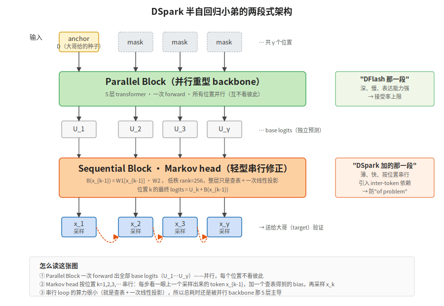

【DeepSeek DSpark】投机解码新作——给 LLM 装一个会"猜"的小弟

━━━━━━━━━━━━━━━━━━━━

2026 年 6 月 27 日，DeepSeek 联合北大开源了一个新东西叫 **DSpark**——挂在 V4-Flash 和 V4-Pro 上的推理加速模块。媒体的标题清一色是"提速 60%-85%"，部分自媒体已经开始炒"加速 661%"了。

我把论文从头到尾读了一遍。这一期讲清楚两件事：

1. **DSpark 到底是个什么东西**——不是新模型、不是新 kernel、不是新硬件加速，是一个跑在 V4 旁边的"小弟"
2. **为什么这个方向值得关注**——这是"投机解码"这一类推理加速方法在 2026 年的新形态

顺便提一句：DSpark 跟 NVIDIA 的 **DGX Spark**（一台机器的名字）**只是撞名**，没有关系。DGX Spark 是 NVIDIA 的硬件，DSpark 是 DeepSeek + 北大的算法。两个团队估计都没想到会撞车。

━━━━━━━━━━━━━━━━━━━━

◆ 第一节：投机解码——一句话回顾

────────────────────

要看懂 DSpark，先得知道它属于哪一类。

DSpark 是 **投机解码**（speculative decoding）这一类推理加速方法的新成员。这个方法 2022 年由 Google 提出，到 2026 年已经是产品级 LLM 推理的标配技术——你用的每一个 AI 模型背后大概率都在跑它。

投机解码的核心思路一句话：**找一个小弟（draft model）先快速猜一串 token，让大哥（target model，即真正的 LLM）一次性验证这些猜测**。猜中的接受、第一个猜错的开始用大哥的答案。

为什么这能加速？因为大模型推理的瓶颈不在"算力不够"，而是"搬数据慢"——每生成一个 token 都要把几百亿参数从显存搬一遍。**而验证 N 个 token 的搬运成本，和生成 1 个 token 一样**。所以一次搬运吐 γ 个 token 是赚的。

132 期专门讲过这个方法的完整原理，从"为什么 LLM 这么慢"到"接受率怎么算"到"投机解码为什么数学上是无损的"，从头讲到尾。不熟的强烈建议回去翻一下 132 期（ https://mp.weixin.qq.com/s/0eLtEaX8_dDD7l6OuKlAhg ）。

────────────────────

【今天只回顾一个核心变量：接受率】

整个方法的成败，取决于小弟猜得有多准。

- 小弟全猜对：γ 个 token 都被接受，**加速 γ 倍**
- 小弟全猜错：γ 个 token 全被拒绝，**白搭还多了小弟的开销**

学术界用一个指标量化这件事，叫 **平均接受长度**（average accepted length, τ）。τ = 3.5 意思是"平均每次循环，γ 个候选里有 3.5 个被接受"。τ 越大，加速越多。

**所有投机解码论文的核心 KPI 都是 τ。** DSpark 也不例外——下面看它把 τ 抬到了多高，靠的什么招。

━━━━━━━━━━━━━━━━━━━━

◆ 第二节：在 DSpark 之前——两条路线，各有缺陷

────────────────────

把 τ 抬高，最直接的办法是让小弟变聪明。但**小弟一聪明就慢**，小弟一慢就抵消了节省的搬运成本——这是投机解码这条赛道几年下来的核心矛盾。

围绕这个矛盾，最近发展出两条主线，分别叫 **Eagle** 和 **DFlash**——也是 DSpark 在论文里直接对比的两个 baseline。

【Eagle：小弟自己也是自回归的】

Eagle 系列（Eagle1、Eagle2 在 2024 年，Eagle3 在 2026 年）的小弟是一个**很薄的自回归模型**——只有 1 层 transformer。它仍然按"自回归"方式工作：先出第 1 个 token，把这个 token 喂回去再出第 2 个，再喂回去出第 3 个……

- **优点**：小弟看到了前面的 token 才生成下一个，**inter-token 依赖关系建模好**，接受率高
- **缺点**：自回归本质上是**串行**的，γ 个 token 要跑 γ 次小弟的 forward。小弟虽然薄，但跑 γ 次累计开销也不小

【DFlash：小弟一次性全并行出】

DFlash（2026 年 DeepSeek 团队 + 合作者的工作，arxiv:2602.06036）走另一条路。小弟是个**深一点的并行模型**——5 层 transformer，但只跑**一次** forward，一次性输出 γ 个位置的 logits。

- **优点**：小弟跑得快——一次 forward 解决战斗
- **缺点**：每个位置都是**独立预测**的，**没有 inter-token 依赖**。论文里举了个特别形象的例子：合理候选有"of course"和"no problem"两种。第 1 位置上 "of" 和 "no" 都高概率、第 2 位置上 "course" 和 "problem" 都高概率——小弟独立预测就可能输出 **"of problem"** 这种鬼东西，被大哥一拒就废了

────────────────────

💡 打个比方：

Eagle 像一个**慢但靠谱的助教**——上一份批完才看下一份，每份都看清楚了前面的批改结果再下笔。慢，但写错的少。

DFlash 像一个**快但糊涂的助教**——所有作业摊开同时批，每份都是独立判断。快，但容易出"前面是 A 后面是 B 但 A 和 B 加起来不通顺"这种笑话。

────────────────────

DSpark 想要的是：**既快又靠谱**。

━━━━━━━━━━━━━━━━━━━━

◆ 第三节：DSpark 的核心招——半自回归

────────────────────

DSpark 的英文术语是 **semi-autoregressive generation**——半自回归生成。设计思路把 Eagle 和 DFlash 缝在一起：

【两段式架构】

DSpark 的小弟其实是两个组件串联：

**第一段：Parallel Block（重型并行块）**——和 DFlash 一样，5 层 transformer 一次 forward 出 γ 个位置的 logits 和 hidden states。这一段提供**接受率上限**——backbone 深、表达能力强、第一个位置的预测质量高

**第二段：Sequential Block（轻型串行块）**——一个**极薄**的小网络（连一层 transformer 都不到），按位置串行修正第一段的输出，给每个位置加一个"基于前文的 bias"。这一段提供**inter-token 依赖建模**——让 "of course" 比 "of problem" 概率高

【关键设计：第二段薄到只剩一层小网络】

DSpark 的 Sequential Block 不是另一个 transformer，论文里默认用的是叫 **Markov head** 的极薄结构：在数学上是一个完整 V×V 转移矩阵 B 的低秩分解 B = W₁W₂（V 是词表大小，rank=256）；工程上就是按前一个 token 查 W₁ 拿一个 256 维向量，再乘 W₂ 投回词表，得到一个加在第一段输出上的 bias。整层参数就 V × 256 + 256 × V，跟 5 层 transformer 的 backbone 比可以忽略，**采样一步的算力主要还是花在第一段的并行 backbone 上**。

论文还测试了一个 RNN 版本的 Sequential Block。结果是：**简单的 Markov head 表现已经很接近 RNN 版本**，只在更长的草稿块上 RNN 略好一点，但 RNN 部署复杂得多。最后 DSpark 默认就用 Markov head。

────────────────────

💡 打个比方：

DSpark 的小弟是**一个深度思考的研究员 + 一个语感很好的实习生**：

- 研究员（Parallel Block）一次性把所有候选答案都想出来，但他不太擅长"上下文连贯性"
- 实习生（Sequential Block）按顺序看一遍研究员的答案，每看一个就轻微调整一下下一个——"你写 'of' 那位置后面，按语感应该接 'course' 不是 'problem'"

实习生不重写答案，只调一调；研究员一次出全部，实习生快速过一遍。**两个加起来既快又顺**。

────────────────────

【一个反直觉的数据点】

论文做了个对照实验：把 DSpark 的 Parallel Block 砍到只剩 2 层，DFlash 保持 5 层——**2 层的 DSpark 干赢 5 层的 DFlash**，9 个 benchmark 全胜。

意思就是说，DSpark 的 backbone 更浅，但接受率反而更高——半自回归这个结构本身就是更优的设计，不是靠堆深度堆出来的。

━━━━━━━━━━━━━━━━━━━━

◆ 第四节：DSpark 的第二招——置信度调度

────────────────────

如果说半自回归是"让小弟猜得更准"，那置信度调度是"让大哥别白验证"。

【问题：固定 γ 不是最优的】

传统投机解码用**固定的 γ**——比如 γ=5，每次都让小弟猜 5 个。但实际场景里：

- 对**结构化任务**（code、math），小弟接受率很高，γ=5 可能太少——多猜几个更好
- 对**开放对话**（chat），小弟接受率低，γ=5 可能太多——前 2 个就被拒了，后 3 个白算

最理想的方式是：**对每个请求动态决定 γ**。

【DSpark 的解法：训一个置信度头】

DSpark 在小弟旁边再挂一个**置信度头（confidence head）**——非常薄，就一个 sigmoid + 线性层。它的输出是一个 0-1 之间的数 c_k，意思是"**这个位置的 token 通过大哥验证的概率有多大**"。

训练时，这个 confidence head 学习一个解析目标：**接受概率 = 1 - ½ × 小弟分布和大哥分布的总变差距离**。

💡 总变差距离（Total Variation Distance，TVD）是衡量"两个概率分布差多远"的标准指标。具体算法：词表里每个 token 都看一眼，小弟给这个 token 的概率和大哥给的概率作差取绝对值，全部加起来再除以 2。结果在 0 到 1 之间——0 表示两个分布一模一样，1 表示完全不重叠。

这个公式正是 132 期讲过的投机解码奠基论文 Leviathan 2023 推出来的闭式解——给定大哥和小弟在这一位上的两个概率分布，就能直接算出"这个位置的 token 通过验证的真实概率"是多少。confidence head 只是学着去拟合这个真值，不需要黑盒训练。

光训出来还不够：论文发现 confidence head 训完之后**过自信**（ECE 5-8%）。DSpark 又跑了一道 Sequential Temperature Scaling（按位置顺序做温度缩放）把校准误差压到 ~1%。**第一步给信号，第二步校准信号**，confidence head 才能用。

【硬件感知调度器】

先解释一下这里说的 batch（批次）是什么。生产环境下大模型不是一次只服务一个用户——10 个用户同时在线，每人小弟刚猜出 5 个 candidate token，**大哥的一次 forward 会把这 50 个 token 拼到一起一次性验证**。这 50 就是 batch 大小。batch 越大 GPU 利用率越高，但超过某个临界值后每步耗时会拉长（显存/算力开始挤）。

所以问题不是"几个用户"，而是"**这 50 个 candidate 里挑哪几个塞进这一轮验证最划算**"——置信度低的可能验了也白验，不如丢掉。

有了 confidence 信号，DSpark 跑了一个非常聪明的调度算法（论文里叫 Algorithm 1）：

1. 在系统启动时，**先 profile 一遍硬件**——测出"当 batch 是 B 时，每秒能跑多少步"。B 就是 batch 大小这个数字，表长这样：B=10 时 200 步/秒、B=100 时 150 步/秒、B=400 时 50 步/秒……这张表叫 SPS(B)
2. 运行时，对所有在排队的请求计算"累积接受概率"
3. **贪心地从高到低**把候选 token 加入这一轮的 verification batch
4. 每加一个 token，**算一次期望吞吐量**：吞吐 = 累积接受概率 × SPS(当前 batch)
5. 吞吐量开始下降的瞬间，**立即停止**

────────────────────

💡 打个比方：

你（大哥）一次能批 100 份作业（batch capacity 100）。所有助教（小弟）抱了一堆作业过来——有的助教抱的是 "我有 95% 把握全对" 的高质量作业，有的是 "可能 30% 对" 的低质量作业。

你的策略：先收高质量的（接受概率高，不浪费你的批改名额）。每收一份算一下"这一轮总的产出"——如果还在涨就继续收，开始降了就停手。

DSpark 的调度算法干的就是这件事，而且**论文证明了这个算法是数学上无损的**——既不会牺牲生成质量，又能动态压榨硬件。

────────────────────

【部署时的一个工程妙招】

理论上的调度算法假设系统状态是"实时"的——每一步都看当前 batch 大小决定要不要继续。但 GPU 推理引擎是个流水线（Zero-Overhead Scheduling，ZOS），**下一步要塞多大的 batch 必须在当前步还没算完时就告诉它**，否则整条流水线会卡住。

DSpark 的解法：**用两步前的置信度估计代替当前估计**——做"异步调度"。估计稍微滞后两步，但流水线不卡。

这是工程上的小聪明，但是 DSpark 在生产环境真正能跑起来的关键。论文还证明了这个异步设计不会破坏"无损"的数学保证——延迟两步反而天然满足了"调度决策不能依赖未来 token"的因果约束。

━━━━━━━━━━━━━━━━━━━━

◆ 第五节：性能数字——别被 661% 忽悠

────────────────────

媒体报道的数字：DSpark 让 V4-Flash 提速 60%-85%，V4-Pro 提速 57%-78%。

**这两个数字是可以引用的**——论文原话叫 "matched practical throughput levels"。意思不是"加速倍数"，而是**在保持系统总吞吐量持平的前提下，每个用户感知到的生成速度提升了 60-85%**。是 throughput-matched 切片下的 per-user TPS 改进。

但论文里**还有两个更夸张的数字**：V4-Flash 661%、V4-Pro 406%——一些自媒体在大肆传播。

**这两个数字不能直接引用**。论文自己有一段非常诚实的声明：在严苛的 SLA（每用户至少 120 token/s）约束下，baseline（MTP-1）已经接近系统操作边界——只能维持一个**非常小**的并发批，所以总吞吐被压到极低。在这种"baseline 几乎跑不动"的对比点上算比例，分母太小，几百倍只是算术上的放大。论文原文叫这种数字 "qualitative regime"，**不应被解读为代表性的加速倍数**。

────────────────────

💡 打个比方：

一家餐厅平时同时能接 100 桌，每桌上菜很快。突然规定"每桌上菜必须在 3 分钟内"——大多数厨房做不到，只能同时接 5 桌。DSpark 这种新厨房还能同时接 30 桌且都达标。

你可以说"新厨房接客量提升 6 倍"，但这是因为旧厨房在这个严苛约束下**几乎不工作了**。在没有这种严苛约束的常规场景下，新厨房的真实优势是"60-85% 更快上菜"，不是"6 倍"。

DSpark 那两个高 SLA 锚点的 661% / 406% 是同一回事。论文自己强调这俩数字证明的是"DSpark 把可达的交互性边界往外推了"，不是它在常规场景下快 6 倍。诚实的数字是 60%-85% / 57%-78%。

────────────────────

【适用场景】

DSpark 在不同任务上的表现差很多：

- **结构化任务**（math、code）：原生接受率就高，DSpark 锦上添花
- **开放对话**（chat）：原生接受率低（45.7%），加上 confidence head 的剪枝把保留下来的 token 的接受率救到 95.7%——这是 DSpark 真正秀肌肉的场景

意思是说，**DSpark 不是均匀地让所有场景都快**，而是把"原本投机解码玩不转的开放对话"救回来。

**注意**：这里的 95.7% 是离线诊断实验里"剩下没被剪掉的 token 的接受率"，代价是每步平均接受的 token 数从 ~7 降到 ~2（剪掉的全是大概率会被拒的）。**不是 2 倍加速比，别这么读**。真正的生产加速读 60-85% 那条。

【已知限制】

论文很坦诚地列了一条 limitation：对于**接受率天生就极低**的复杂 query（比如需要长链条推理的难题），即使 confidence scheduler 把 verify 砍到只验 1 个 token 甚至 0 个，**Parallel Block 那一遍 5 层 forward 已经跑过了**——草稿计算是 sunk cost。论文说"未来要加难度感知早退（difficulty-aware early exit）"，让 backbone 在判断出"这次猜不中"时直接跳过整块草稿。

━━━━━━━━━━━━━━━━━━━━

◆ 总结

────────────────────

DSpark 是 DeepSeek + 北大在投机解码这条路上的一次干净的工程升级。核心两招：

**半自回归**——把全并行（DFlash）和全串行（Eagle）缝在一起。深的并行 backbone 提供接受率上限，薄的 Markov head 提供 inter-token 依赖。**2 层 DSpark 干赢 5 层 DFlash** 是这个设计最反直觉的证据。

**置信度调度**——给每个候选 token 配一个"通过验证的概率"信号（有数学闭式解、再过一道校准），加上硬件感知的贪心调度算法，动态决定每一轮塞多少个 candidate。

数字层面诚实读数是 60%-85% / 57%-78% 的 per-user 加速（保持系统总吞吐量持平时）。媒体在炒的 661% / 406% 论文自己说不能这么解读。

工程层面这是给 vLLM / SGLang 等推理引擎的一个新任务——加速到位需要改 attention kernel + 调度器，不是装个 head 就能跑。投机解码这条路 2022 年起步，到 2026 年 DSpark 这一步，又往前推了一截。

━━━━━━━━━━━━━━━━━━━━

参考资料

- DSpark: Confidence-Scheduled Speculative Decoding with Semi-Autoregressive Generation. Cheng, X. et al., DeepSeek-AI & Peking University, 2026-06-27. GitHub: https://github.com/deepseek-ai/DeepSpec
- HuggingFace 模型：https://huggingface.co/deepseek-ai/DeepSeek-V4-Pro-DSpark
- Leviathan, Y. et al. "Fast Inference from Transformers via Speculative Decoding." ICML 2023. arXiv:2211.17192.（投机解码奠基论文）
- Li, Y. et al. "EAGLE: Speculative Sampling Requires Rethinking Feature Uncertainty." ICML 2024. arXiv:2401.15077.（Eagle1）
- Li, Y. et al. "EAGLE-3: Scaling up Inference Acceleration of Large Language Models via Training-Time Test." NeurIPS 2026. arXiv:2503.01840.
- Chen, J., Liang, Y., Liu, Z. "DFlash: Block Diffusion for Flash Speculative Decoding." 2026. arXiv:2602.06036.（DSpark 直接对比的并行 baseline）

━━━━━━━━━━━━━━━━━━━━

「投机解码不是新东西，是把'搬一次数据吐一个 token'变成'搬一次数据吐多个 token'。瓶颈在搬运，不在算。」

「DSpark 的本质：用一个小弟猜 γ 个 token，让大哥一次性验证。猜得越准、γ 越大，加速越多。」

「半自回归是 Eagle 和 DFlash 的折中：深 backbone + 薄 head。2 层 DSpark 干赢 5 层 DFlash，参数效率证据。」

「论文里写得清清楚楚的 661% 是 baseline 接近崩溃时的算术放大，不该当 speedup 引用。诚实数字是 60-85%。」

━━━━━━━━━━━━━━━━━━━━

// 靳岩岩的 AI 学习笔记 × Claude 的严谨 × Gemini 的浪漫
// 2026-06-30
