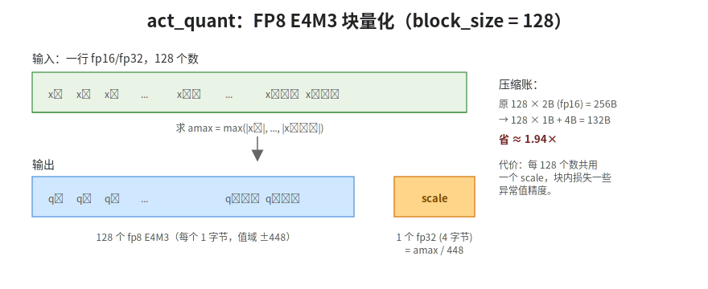
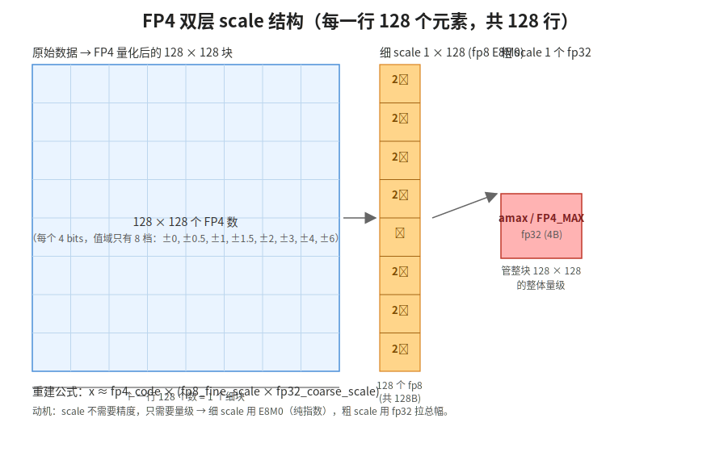

【在 50 系显卡上实现 DeepSeek V4 算子·第 1 站】量化的入口——act_quant 和 fp4_act_quant

━━━━━━━━━━━━━━━━━━━━

◆ 开篇：169 期讲完了我自己就忘了

━━━━━━━━━━━━━━━━━━━━

169 期跟着一个 token 走完了 V4 全程，从"中国的首都是"一路到"北京"。当时写得挺爽——MLA、HCA/CSA、MoE、SwiGLU、Lightning Indexer 全过了一遍。然后过了两个月再回头，自己看自己写的东西，**某一步算子的细节其实模糊了**。比如"专家权重 FP4 量化"——169 期就一句话提了一下，再追问"FP4 到底是哪 4 个 bit、scale 长什么样、为什么 scale 还要再量化"，我自己脑子里其实是空的。

所以这个系列开始——「在 50 系显卡上实现 DeepSeek V4 算子」，共 7 期日更，盯着我们自己在 sm_121 上写的 7 个 kernel 看，每期一站。今天打开 `kernel_sm121.py`（V4 Flash 跑在 DGX Spark 上的替换实现），第一站就是 `act_quant` 和 `fp4_act_quant`——**前向计算的第一道门，所有 GEMM 在算之前都要先过这里**。

这套 kernel 不是凭空来的。175 期在两台 DGX Spark 上把 V4 Flash 280B 的推理跑通、搭了一个能从任意层提取激活值的实验框架；186 期把里面的量化矩阵乘法从"先还原成浮点数再算"优化成 Triton 融合 kernel；227 期又填了一个长 prompt 会把两台机器一起 OOM 掉的坑。这个系列讲的就是这套框架——**但目的不是秀工程细节，是借着"每个函数到底在算什么"，把 DeepSeek V4 的推理流程再好好复习一遍**。

这一篇会反复被本系列后续期数引用，所以我把 fp8/fp4 块量化、E4M3、E2M1、E8M0、双层 scale 一次性讲清楚，后面 fp8_gemm、fp4_gemm、sparse_attn 那几期就不重复了。

参考：

- 169 期《一个 token 的旅程——Deepseek V4 全流程总复习》：https://mp.weixin.qq.com/s/mnbaXhQmQjDAyGD1dDdq5Q
- 166 期《DeepSeek V4 58 页技术报告精读》：https://mp.weixin.qq.com/s/iLObYwtZYqCWwRRYJVcpyA
- 175 期《提取 DeepSeek V4 Flash 的中间层激活值》：https://mp.weixin.qq.com/s/vYaa7HaUfE8ykPQGa-EHVg（这套 sm_121 平台怎么搭起来的）
- 186 期《激活值提取优化：dot_scaled 一行换掉手动 FP4 解包》：https://mp.weixin.qq.com/s/JEPXyW7PIy-mpdhVT47FQg（fp4_gemm 后来怎么用 Triton dot_scaled 提速，下一期会展开）
- 227 期《DeepSeek V4 推理：一次 OOM 的经验——注意力一波算不完》：https://mp.weixin.qq.com/s/XM-xSvJFXh1Y49YfvJ49DQ（实验平台线的后续坑，sparse_attn 那期会用到）

━━━━━━━━━━━━━━━━━━━━

◆ 第一章：为什么 V4 在 GEMM 前要先量化

━━━━━━━━━━━━━━━━━━━━

先回到 169 期的视角。一个 token `h` 在 V4 里大致这样流：

```text
h [1, 1, 7168]
   │
   ├── 投到 Q / KV  (attention)
   │     └── h × W_q_down, h × W_kv ...    ← 矩阵乘
   │
   └── 投到 384 个专家  (MoE)
         └── h × W1, h × W3, hidden × W2   ← 矩阵乘
```

图里标 **← 矩阵乘** 的那两行，就是实打实的矩阵乘法（GEMM）：`h` 或 `hidden`（激活）乘上某个 W（权重）。V4-Flash 总共 280B 参数，绝大部分都压在这些 W 上。如果**激活（左边的 h、hidden）和权重（右边的 W）都用 fp16/bf16 算**，每次 GEMM 都要拉 256 GB/s 量级的内存带宽。

V4 的核心节省点在这里——

- **权重侧**：W 在硬盘上就已经是 fp4/fp8 存的，不是 fp16
- **激活侧**：每次进 GEMM 之前，激活临时从 fp16/bf16 量化成 fp8 或 fp4

也就是说——**`act_quant` 是激活进 GEMM 的入口卡**，每一次矩阵乘之前都要先过它。一个 token 走 61 层 Transformer，每层 attention 的 Q/KV 投影、O 投影、MoE 7 个专家的 3 个 GEMM——单 token 单次前向至少触发上百次 `act_quant`。

💡【打个比方】

权重就像超市仓库里 384 个货架上的商品（已经按"小包装"码好）。激活是顾客买东西时手里那张购物清单。你不可能拿张超大尺寸的购物清单去货架翻——清单也得**先压成和货架一样的小包装规格**，店员才能并行扫码结账。`act_quant` 就是结账前那台把购物清单压成小标签的机器。

━━━━━━━━━━━━━━━━━━━━

◆ 第二章：FP8 E4M3 是什么——4 位指数 + 3 位尾数

━━━━━━━━━━━━━━━━━━━━

`act_quant` 的目标格式是 **FP8 E4M3**。E4M3 这三个字念清楚：**1 位符号 + 4 位指数（Exponent）+ 3 位尾数（Mantissa）**，加起来正好 8 个 bit = 1 字节。

对比一下熟悉的格式：

| 格式 | 符号 | 指数 | 尾数 | 总 bit | 最大可表示 | 最小正数 |
|-----|-----|-----|-----|-----|-----|-----|
| fp32 | 1 | 8 | 23 | 32 | 约 3.4 × 10³⁸ | 约 1.2 × 10⁻³⁸ |
| fp16 | 1 | 5 | 10 | 16 | 65504 | 约 6.1 × 10⁻⁵ |
| bf16 | 1 | 8 | 7 | 16 | 约 3.4 × 10³⁸ | 约 1.2 × 10⁻³⁸ |
| **fp8 E4M3** | 1 | 4 | 3 | 8 | **448** | 约 0.0019 |
| **fp8 E5M2** | 1 | 5 | 2 | 8 | 57344 | 约 1.5 × 10⁻⁵ |

V4 用的是 **E4M3**，不是 E5M2——指数少一位，所以范围窄（±448 而不是 ±57344），但尾数多一位，**同样量级下的精度更高**。激活值的"动态范围"通常被 LayerNorm/RMSNorm 控制得不算夸张，所以宁可牺牲范围换精度。

E4M3 能表示的数大致长这样（只看正数）：

```text
最小正常数:  2⁻⁶ × 1.000  = 0.015625
            2⁻⁶ × 1.001  = 0.017578
            ...
            2⁻⁶ × 1.111  = 0.029297
下一个指数: 2⁻⁵ × 1.000  = 0.03125
            ...
最大:        2⁸ × 1.110   = 448
```

这就是 E4M3 的全部世界——**256 个可能取值（包含 0 和 NaN），最大 ±448**。

代码里那个 `448.0` 不是魔法常数，**就是 E4M3 能表示的最大值**：

```python
amax = blocks.abs().amax(dim=-1).clamp(min=1e-4)
scale = amax / 448.0           # 把 amax 映射到 fp8 的最大表示
scaled = blocks / scale        # 数据除以 scale，落到 [-448, 448]
quantized = scaled.to(torch.float8_e4m3fn)
```

整段逻辑一句话——找到这块的最大绝对值，**把它对齐到 448**，剩下的数等比缩放，自然就落进 E4M3 的安全区。

━━━━━━━━━━━━━━━━━━━━

◆ 第三章：块量化 block_size=128 怎么做

━━━━━━━━━━━━━━━━━━━━

如果整个张量共用一个 scale，会出问题——一个张量里既有 100 也有 0.001，scale 取 100 / 448 = 0.223，那 0.001 / 0.223 = 0.0045，进到 fp8 之后变成 0 或者一个最小档。这叫**异常值（outlier）拖累整体精度**。

V4 的解法：**把张量按最后一维切成 128 个一组的小块，每个块自己算自己的 scale**。



代码里就是这几行的事（伪代码风格）：

```text
# 输入 x shape: [..., N]，要求 N 是 128 的整数倍
N = x.size(-1)
n_blocks = N // 128

# 1. 重组成 (M, n_blocks, 128) 的小块
blocks = x.view(M, n_blocks, 128)

# 2. 每块求 amax，钳一个最小值防 0
amax = blocks.abs().amax(dim=-1).clamp(min=1e-4)

# 3. 算 scale
scale = amax / 448.0

# 4. 缩放 + cast
scaled = blocks / scale.unsqueeze(-1)
y = scaled.clamp(-448, 448).to(torch.float8_e4m3fn)

return y, scale
```

返回值有两份：**量化后的 y（fp8）+ scale（fp32）**。后续 fp8_gemm 用的时候必须两份一起带，因为 fp8 值本身只是个"相对量"，还原成实际数值要靠 `y × scale`。

────────────────────

💡【打个比方】

像是 100 个员工平摊一个工资基准。如果全公司一万人共用一个基准（比如以 CEO 的 100 万为锚），扫地阿姨的实际工资就量化到 0 了——E4M3 的精度根本表达不出来。V4 的做法是**100 人一组，每组自己定基准**——CEO 那组锚 100 万、研发那组锚 5 万、清洁那组锚 5 千。各组内部相对差异保得住，每组只多付出一个 4 字节的 scale。

────────────────────

【为什么是 128 不是 64 或 256】

128 是个工程上的平衡：

- 太小（比如 16）：scale 太多，存储开销显著（一万个数要存 600 多个 scale）
- 太大（比如 1024）：又回到"异常值拖累整体"的问题
- 128 正好和 GPU 上的 warp/wavefront、tile 尺寸对得上，**fp8_gemm 内的循环展开也是按 128 走**，scale 读起来对齐很顺手

128 这个数字会在本系列后面 fp8_gemm 那期再出现——那时它的意义会更明确：每次 K 维推进 128，刚好对应一份 scale。

━━━━━━━━━━━━━━━━━━━━

◆ 第四章：FP4 E2M1——只能表示 8 个值的"邮票"

━━━━━━━━━━━━━━━━━━━━

讲完 fp8，再看 fp4。`fp4_act_quant` 用的格式是 **FP4 E2M1**：**1 符号 + 2 指数 + 1 尾数 = 4 bit**。

4 个 bit 能表示多少个不同数？**16 个**。去掉重复（±0 算一个）、规格化和次规格化怎么定义后，FP4 E2M1 的全部世界就是：

```text
±0,  ±0.5,  ±1,  ±1.5,  ±2,  ±3,  ±4,  ±6
```

**8 个绝对值 × 2 个符号 = 16 个 code 一一对应**。我们 sm_121 fallback 的实现里这一行就把它写死了：

```python
fp4_values = torch.tensor([0.0, 0.5, 1.0, 1.5, 2.0, 3.0, 4.0, 6.0])
# 量化 = 对每个 |x| 找最近邻 → 配回符号
```

注意几个事实：

- **最大值只有 6**（不是 fp8 的 448）
- **0 到 6 之间一共只有 8 档**，跳跃感非常明显（1 → 1.5 → 2 → 3 → 4 → 6）
- 没有"指数"上的远小数——最小正数就是 0.5

E2M1 的"分辨率"是肉眼可见的粗。你给它一个 2.3，它给你 2；给它 4.7，它给你 4 或 6（看四舍五入往哪边）。**单纯把激活做 FP4 量化，模型会崩**。

V4 怎么救？**用更小的块 + 双层 scale**。

────────────────────

代码里 `fp4_act_quant` 的 `block_size` 默认是 **32**，不是 128：

```python
def fp4_act_quant(x, block_size: int = 32, ...):
    ...
    amax = blocks.abs().amax(dim=-1).clamp(min=FP4_MAX * (2**-126))
    scale = _round_scale_pow2(amax / FP4_MAX)   # FP4_MAX = 6.0
```

更小的块 → 每块内部的动态范围更窄 → 量化误差更小。但 32 一个 scale 意味着 scale 的数量是 fp8 的 4 倍——存储开销马上变成问题。**这就是为什么 scale 自己也要被量化**。

━━━━━━━━━━━━━━━━━━━━

◆ 第五章：双层 scale 设计——scale 凭什么也要量化

━━━━━━━━━━━━━━━━━━━━

FP4 的 scale 走的是**两层结构**：

| 层 | 粒度 | 类型 | 字节数 |
|---|---|---|---|
| **细 scale** | 1 × 128 | fp8 E8M0 | 1 字节 |
| **粗 scale** | 128 × 128 | fp32 | 4 字节 |

也就是说——一个 128 × 128 的块（共 16384 个 FP4 数）要**两批 scale 共同伺候**：128 个细 scale（行级，每行一个 fp8）+ 1 个粗 scale（块级，fp32 拉总幅度）。

还原一个 FP4 数的实际值，公式长这样：

```text
x_real ≈ fp4_code × (fp8_fine_scale × fp32_coarse_scale)
         └─ 4 bit ─┘ └────── 这部分给整块拉量级 ───────┘
```



──────────────────── 

【为什么 scale 还要量化】

存储账算一下。假设激活 shape 是 `[M, K]`，K 很大。

- **若细 scale 全部存 fp32**：每 32 个 FP4 数（16 字节）就配一个 4 字节 scale。**额外开销 = 4/16 = 25%**
- **若细 scale 用 fp8 E8M0**：每 32 个 FP4 数配 1 字节。**额外开销 = 1/16 = 6.25%**

差了 4 倍。FP4 的全部意义就是省存储省带宽——scale 不省，省个寂寞。

──────────────────── 

【为什么细 scale 选 E8M0，不是 E4M3 或 E5M2】

E4M3 和 E5M2 都有"尾数"，能精细表达"2.7 倍"这种带零头的缩放。但**对 scale 这个量来说，精度根本不重要——重要的只是量级**。

举个例子。设你的一行 32 个数最大绝对值是 1.7。FP4_MAX = 6，所以理想 scale = 1.7 / 6 ≈ 0.283。但你完全可以把 scale 取 0.25 = 2⁻² 或 0.5 = 2⁻¹——选 0.5 的话有一点点压缩范围浪费，但**量化误差不会爆炸**。scale 取的是"该把这块压缩多少倍"的量级，不是"精确的缩放系数"。

所以 V4 直接用 **E8M0**——

- **1 个符号位？不要了，scale 总是正数**
- **0 个尾数位**——没尾数就只能表示 2 的整数次幂
- **8 个指数位** 全留给"量级"

E8M0 的全部表示就是 `2⁻¹²⁷, 2⁻¹²⁶, ..., 2⁰, 2¹, ..., 2¹²⁷`——**总共 256 档，全是 2 的整数次方**。代码里 `_round_scale_pow2` 这一行做的就是这件事：

```python
def _round_scale_pow2(scale):
    return torch.exp2(torch.ceil(torch.log2(scale)))
```

翻译：算出原始 scale 后，先 log2 拿到指数，再 ceil 取上整，再 exp2 还原——**等价于把任意正数四舍五入到最近的 2 的整数次方**。然后这个数就能用 8 位指数原样存下来。

E8M0 → fp32 的反向转换也漂亮：

```python
def _e8m0_to_fp32(scale):
    # E8M0 的 8 个 bit 直接就是 fp32 指数位
    # fp32 = sign(0) | exp(8 bit) | mantissa(23 个 0)
    return (scale.view(torch.uint8).to(torch.int32) << 23).view(torch.float32)
```

把 uint8 左移 23 位，就放到了 fp32 的指数位上，尾数全 0，符号 0。**纯 bit 操作，连乘法都不用**。这种位级的妥帖度，就是 V4 的设计味道。

💡【打个比方】

如果说 fp4_code 是身高（精确到厘米）、fp8 细 scale 是"哪个数量级"（人/楼/山），fp32 粗 scale 是"整块地形的海拔基准"。算一棵树多高，你要知道：**它本身多少厘米（fp4） × 它属于哪个数量级（fp8 E8M0） × 整片地形的总海拔（fp32）**。三个数相乘 = 真实的绝对高度。

scale 不需要"180.3 厘米"这种精度，只需要"它属于成年人那一档"这种归类。所以 E8M0 够用，省下来的 bit 拿去多分几档量级。

━━━━━━━━━━━━━━━━━━━━

◆ 第六章：把流程串起来——一次 act_quant 全程

━━━━━━━━━━━━━━━━━━━━

【FP8 路径（act_quant）】

```text
输入   x: [batch, seq, 7168] in fp16/bf16
       │
       ├─ 按最后一维切成 128 一组 → blocks [..., 56, 128]
       │
       ├─ amax = max(|blocks|, dim=-1)              ← 每块算最大绝对值
       ├─ scale = amax / 448                        ← 算缩放系数
       │
       ├─ scaled = blocks / scale
       ├─ clamped = clamp(scaled, -448, 448)
       │
       └─ y = clamped.to(fp8_e4m3fn)
          s = scale.to(fp32)
返回:  (y [..., 7168] fp8, s [..., 56] fp32)
```

【FP4 路径（fp4_act_quant）】

```text
输入   x: [batch, seq, hidden] in fp16/bf16
       │
       ├─ 按最后一维切成 32 一组 → blocks [..., n_blocks, 32]
       │
       ├─ amax = max(|blocks|, dim=-1)
       ├─ scale_raw = amax / 6                      ← FP4_MAX = 6
       ├─ scale = round_to_pow2(scale_raw)          ← 砍成 2 的整数次幂（细 scale, E8M0）
       │
       ├─ scaled = blocks / scale
       ├─ clamped = clamp(scaled, -6, 6)
       │
       ├─ y = nearest_fp4_value(clamped)            ← 投影到 8 个档之一
       │      （sm_121 用查表，正经硬件用专用指令）
       │
       └─ y * scale   ← 我们的 fallback 是直接乘回 fp16，
                        因为 sm_121 上没有 fp4 GEMM 指令
```

⚠️【sm_121 实现说明】

`fp4_act_quant` 本身只是量化，不涉及矩阵乘法。我们 sm_121 上的 fallback 走的是**模拟路线**：量化完立刻乘回 scale 还原成 fp16，"假装走了一遍 fp4"——精度损失保留了，但没有真正省下 fp4 的存储和带宽，这一步纯粹是为了先把数值对齐验证正确性。真正让 fp4 数据参与计算、把带宽优势兑现出来的是下一期要讲的 `fp4_gemm`。FP8 路径不一样：`act_quant` 输出的 fp8 数值会被直接丢给 `fp8_gemm` 参与矩阵乘，是真在用 fp8 算，不是模拟。

━━━━━━━━━━━━━━━━━━━━

◆ 第七章：一些没明说的细节

━━━━━━━━━━━━━━━━━━━━

【关于 `clamp(min=1e-4)`】

```python
amax = blocks.abs().amax(dim=-1).clamp(min=1e-4)
```

如果一整块 128 个数全是 0，amax = 0，scale = 0，除法就 NaN 了。`clamp(min=1e-4)` 是兜底——保证 scale 至少有一个最小值，宁可给 0 块一个稍微浪费的 scale，也不能让流程崩。

FP4 那侧的兜底更精细：`clamp(min=FP4_MAX * (2**-126))`——下界压到 2⁻¹²⁶ × 6，这个数字是 **E8M0 能表示的最小正数附近**，把整个 scale 全程都钉在 E8M0 的合法区间内。设计的细节都对得上格式。

────────────────────

【关于 `scale_fmt` 参数】

`act_quant` 有个 `scale_fmt` 可选参数：

```python
if scale_fmt is not None:
    scale = _round_scale_pow2(amax / 448.0)   # fp8 也走 2 的整数次幂 scale
else:
    scale = amax / 448.0                       # 普通 fp32 scale
```

也就是说——**fp8 路径也支持 E8M0 scale 模式**，只是默认走 fp32 scale。具体什么时候用哪种，看下游 fp8_gemm 的需要——某些路径上 fp8_gemm 要求 scale 是 pow2 才能用专门的快速路径。这一层细节留给 fp8_gemm 那期。

────────────────────

【关于 `inplace`】

```python
if inplace:
    quantized = clamped.to(fp8_e4m3fn).float() * scale.unsqueeze(-1)
    x.copy_(result)
    return x
```

inplace 模式做的是"假量化"——量化后立刻反量化回 fp16/fp32，写回原 tensor。**这条路径是为了和后续 fp16 GEMM 配合**（精度损失保留、带宽优势放弃）。非 inplace 才是真的把 fp8 数据丢出去给 fp8_gemm 用。

━━━━━━━━━━━━━━━━━━━━

◆ 收尾：量化是 V4 的起点，不是终点

━━━━━━━━━━━━━━━━━━━━

回头看 169 期那句"每个专家的 W1、W2、W3 都以 FP4 存储和计算"——单独看就是一句技术八股。今天把 `act_quant` 这一站从头到尾过完才知道：

- FP8 E4M3 的 **±448** 不是魔法，是格式上限
- 块量化的 **128** 不是经验值，是和 GEMM tile 对齐的工程数
- FP4 E2M1 只有 **8 档**，单靠它撑不住模型
- 双层 scale 里的 **E8M0**——scale 不要精度只要量级，所以指数位拿走全部 bit
- 整个 `act_quant` 的精髓在那一行 **`amax / 448`** 和 **`round_to_pow2`**：找到这一块在世界上的位置，再把它折叠进格式的合法区间

**一个 token 走完 61 层 V4，触发 `act_quant` 至少几百次**。每一次都是这套"找 amax → 折叠 → cast"的微型仪式。MoE 一秒钟跑出十几个 token，背后是几千次这种小小的折叠在并行。

到这里 V4 的"激活进 GEMM 之前的最后一道门"就讲完了。下一站——**fp8_gemm 和 fp4_gemm**：量化好的小箱子真正被搬进矩阵乘的车间，看 V4 怎么把 fp8 × fp8 + fp32 scale 这套组合在 Triton 上写出来。下一期见。

━━━━━━━━━━━━━━━━━━━━

【参考资料】

- FP8 Formats for Deep Learning, Micikevicius et al., 2022，https://arxiv.org/abs/2209.05433
- OCP Microscaling Formats (MX) Specification v1.0, Open Compute Project, 2023（定义 E8M0 scale 的标准），https://www.opencompute.org/documents/ocp-microscaling-formats-mx-v1-0-spec-final-pdf
- DeepSeek-V3 Technical Report, DeepSeek-AI, 2024（V4 沿用了 V3 的 block-wise fp8 量化策略），https://arxiv.org/abs/2412.19437
- 实验仓库：https://github.com/lmxxf/deepseek-v4-experimental-platform-on-dgx-spark ，`kernel_sm121.py`

━━━━━━━━━━━━━━━━━━━━

**找到这一块在世界上的位置，再把它折叠进格式的合法区间——这就是量化。**

**scale 不需要精度，只需要量级——所以 E8M0 把全部 bit 都让给了指数。**

━━━━━━━━━━━━━━━━━━━━

// 靳岩岩的 AI 学习笔记 × Claude 的严谨 × Gemini 的浪漫
// 2026-07-03
