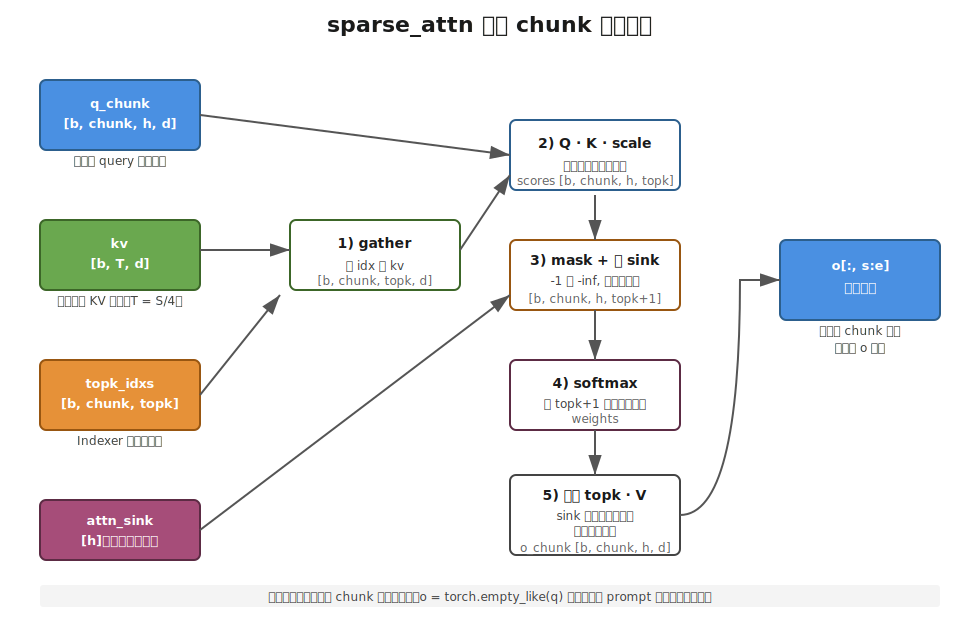

【在 50 系显卡上实现 DeepSeek V4 算子】sparse_attn——选完 top-k 之后那一刀 attention 怎么落

━━━━━━━━━━━━━━━━━━━━

239 期讲了 Indexer 怎么从 4:1 压缩的 KV 里挑出 top-1024 个位置。挑完之后呢？sparse_attn 拿着这些 index 真正算一次 attention。今天盯着 sparse_attn 看一遍。

━━━━━━━━━━━━━━━━━━━━

◆ 开篇：sparse_attn 这个名字有点骗人

━━━━━━━━━━━━━━━━━━━━

第一眼看到 `sparse_attn` 这个名字，我以为它就是"稀疏 attention 的那个 kernel"——一个原子操作，进去 Q/K/V 出来 O，跟标准的 `scaled_dot_product_attention` 在 API 层面应该差不多。

把代码看完才发现不是。它是**好几步组合在一起的一个流程**：

1. 用 Indexer 给的 index 从 KV 总表里抓出当前 query 真正要看的那些位置
2. Q 和这些抓出来的 K 算点积、乘 scale
3. 把没选到（Indexer 返回 -1）的位置 mask 成 -inf
4. 给末尾拼一根 attention sink
5. softmax，然后只取前 topk 个权重去乘 V，sink 那一列的概率被丢掉

这五步任何一步漏了 attention 的语义都不对，但单看每一步又都不"sparse"——稀疏体现在第 1 步：Indexer 把候选 K 从全表 T 个砍到 topk 个，后面四步还是普通 attention，只是底盘小了。

**所以 sparse_attn 不是一刀切下去的稀疏 kernel，而是在 Indexer 砍小的底盘上跑了一次标准 attention，再加一根 sink 当压力阀**。我重新看了一遍源码才搞清楚这件事。今天把这个流程说清楚，顺带说一下为什么我这一版 sparse_attn 要做 query 分块——和 239 期 Indexer 分块的原因不同源。

参考代码：仓库里的 `kernel_sm121.py` 第 430-491 行。

💡 **打个比方**：Indexer 是"图书管理员把这一节课要用的 32 本书从 10 万本里挑出来推到你桌上"；sparse_attn 是"你坐下来一本一本翻、挑句子、把摘抄拼成一段笔记"。Indexer 决定看什么，sparse_attn 决定怎么用——两步分得很清。

━━━━━━━━━━━━━━━━━━━━

◆ 第一章：输入输出对一遍维度

━━━━━━━━━━━━━━━━━━━━

先把账面摆清楚。`sparse_attn` 的签名：

```python
def sparse_attn(q, kv, attn_sink, topk_idxs, softmax_scale) -> o:
    ...
```

| 参数 | 形状 | 含义 |
|---|---|---|
| `q` | `[b, s, h, d]` | b 个 batch、s 个 query 位置、h 个头、每头 d 维 |
| `kv` | `[b, T, d]` | 压缩后的 KV 总表，T = S/ratio（CSA 的 4:1 压缩，169 期讲过） |
| `attn_sink` | `[h]` | 每个 head 一个学到的标量，扮演"虚拟 key"，下面会讲 |
| `topk_idxs` | `[b, s, topk]` | Indexer 给出的索引，每个 query 位置看哪 topk 个 KV |
| `softmax_scale` | 标量 | 通常是 1/√d，标准 attention 的那个缩放 |
| 输出 `o` | `[b, s, h, d]` | 和 `q` 同形 |

V4 实际跑起来时一组典型数字：`b=1`、`s` 是当前 prompt 长度（17832 都不算夸张）、`h=64`、`d=512`、`T ≈ s/4`、`topk=512`。每一层都过一遍这个函数，43 层 attention 串起来。

注意几件事：

- **kv 是 1 头的**：第三维就是 `[b, T, d]`，没有 h 这个轴。这是 DeepSeek 从 V2 起就在做的 MLA latent——169 期讲过，128 个 Q 头共享同一份 KV latent，存的时候只存一份，算 attention 时所有头都查这份。V4 在 64 头 × 512 维的设定下沿用了这个结构。
- **topk_idxs 是 int32**：每个值要么是 `[0, T)` 之间的合法位置，要么是 `-1` 占位（Indexer 没凑够 topk 个时填的，239 期专门讲过）。
- **attn_sink 只有一个 h 维度**：每个 head 一个标量，没有 d 维。这意味着 sink 不参与"value 的混合"，它只是 attention 概率里那一根多出来的"逃生通道"——下面专门讲。

输出 `o` 和 `q` 同形——这一刀走完，每个 query 位置每个头都拿到了一份 d 维的混合 value。送回去给后面的 O 投影（169 期 3.3.6 节），再回到 7168 维高速公路。

━━━━━━━━━━━━━━━━━━━━

◆ 第二章：五步流程，一帧一帧说

━━━━━━━━━━━━━━━━━━━━

为了不被分块的事打扰，本节我们先假设 `s` 就一段，从头到尾把五步走一遍。

【Step 1】**按 index 抓 KV**——把 `kv` 上的 T 行根据 `topk_idxs` 抓出 topk 行：

```text
kv_gathered = gather(kv, topk_idxs)   形状 [b, s, topk, d]
```

这一步的几何意义就是：把 1 万多行的总表，每个 query 位置裁剪到 topk（比如 512）行。**稀疏的"稀"就在这里**——后面所有计算的底盘从 T 缩到 topk。

注意 `topk_idxs` 里有 `-1` 占位，gather 前要 `clamp(min=0)`，否则负数索引会拿到错的行——但拿到的内容不重要，下一步会被 mask 掉。

【Step 2】**Q · K · scale**——这一步和标准 attention 一模一样：

```text
scores = einsum('bshd, bstd -> bsht', q, kv_gathered) · softmax_scale
       形状 [b, s, h, topk]
```

读法：每个 batch、每个 query 位置、每个 head、对当前 topk 个候选 K 各算一个点积分数。h 头互相独立，topk 行互相独立。

【Step 3】**把假位置 mask 掉**——Indexer 没凑够 topk 个时填的 `-1` 位置，对应的 scores 设为 `-inf`：

```text
valid = (topk_idxs >= 0)        广播到 [b, s, h, topk]
scores[!valid] = -inf
```

走到 softmax 时这些位置直接变 0。**这一步是 sparse attention 和 dense attention 唯一不"对称"的地方**——Indexer 决定了哪些位置参与计算、哪些位置直接出局，掩码是它的副产品。

【Step 4】**拼上 sink，softmax**——这一步是 sparse_attn 不"标准"的地方：

```text
sink = attn_sink                    [h] → 广播成 [b, s, h, 1]
all_scores = concat([scores, sink], dim=-1)    [b, s, h, topk+1]
weights = softmax(all_scores, dim=-1)
```

scores 末尾被拼了一根 sink 列，然后整个 `topk+1` 长度一起过 softmax。sink 这一列得到的概率，被 softmax 当作"我不打算把权重分给真实位置"的份额。

【Step 5】**只取前 topk 个权重，乘 V**——sink 那一列已经完成它的使命，输出时不去碰它：

```text
attn_weights = weights[..., :topk]                    [b, s, h, topk]
o = einsum('bsht, bstd -> bshd', attn_weights, kv_gathered)
```

注意一个细节：`attn_weights` 的每一行加起来**不再等于 1**——因为 sink 那一列吞掉的那部分概率没回来。如果 attention 觉得"topk 个真实候选都不太行"，sink 那一列就吃掉很多概率，输出 `o` 的模长会变小。**这就是 attention sink 的作用：给 softmax 一个泄压阀，不强迫它把权重平均分给一堆并不重要的真实位置**。

第 170 期讲过：softmax 把任意实数映射到概率单纯形上，权重必须加起来等于 1。没有 sink 的稀疏 attention 等于硬性要求"必须从这 topk 个里挑"——如果 topk 个里没一个特别相关，softmax 只能被迫均分（落到单纯形的中心），输出就贴近 value 的"平均值"，糊了。**sink 那一列等价于把单纯形多开了一维出口**——"我都不喜欢"这个选项是合法的。

💡 **打个比方**：超市试吃柜台 10 道菜让你打分。强制规则是"必须从这 10 道里挑一道带回家、不能拒绝"——你只能矮子里拔将军。加个 sink 等于柜台多了一个"我空手走"的选项——10 道菜都不行你就走。**走的这部分概率被丢掉，不混进你今天的菜篮子**。

为什么这一根 sink 不会被训练学成 0？因为它是一个可学习的标量，从训练数据里凝结出来的——当某些 query 真的没有合适候选时，sink 的存在能让 loss 下降；学术界研究过这件事（Xiao et al. *Efficient Streaming Language Models with Attention Sinks*, arXiv:2309.17453），attention sink 学到的往往是"无语义的 anchor"——它本身不代表任何 token 的意思，只是 softmax 系统在数学上需要一个"泄压口"。

到这里五步走完，`o` 形状 `[b, s, h, d]`，和 `q` 同形，结束。

下面看一下整个流程图：



━━━━━━━━━━━━━━━━━━━━

◆ 第三章：旧版为什么会 OOM——三个张量同时铺平

━━━━━━━━━━━━━━━━━━━━

上面这五步在 `s` 不大的时候完全够用。问题是 V4 真实跑起来时，prefill 阶段 `s` 直接就是整段 prompt——17832 都是常见数字。

我第一版 sparse_attn 是"全 `s` 一次性跑完"，这五步里三个中间张量同时活在显存里：

| 张量 | 形状 | b=1, s=17832, h=64, d=512, topk=512 单层占用 |
|---|---|---|
| `kv_gathered` | `[b, s, topk, d]` | 17832 · 512 · 512 · 2B（fp16）≈ **8.7 GB** |
| `scores` | `[b, s, h, topk]` | 17832 · 64 · 512 · 4B（fp32）≈ **2.2 GB** |
| `weights`（topk+1）| `[b, s, h, topk+1]` | 同量级 **2.2 GB** |

**单层就 13 GB 上下**。再考虑这五步都在浮点运算时还要再开几个临时中间值，单层峰值翻倍是常事。

V4 有 43 层 attention。哪怕 PyTorch 算完一层就释放上一层的 `kv_gathered`，**一层 13 GB 的峰值已经把 DGX Spark 128 GB 余量按一半的方向砍**——再加上 280B 的 FP4 权重本来就吃 148 GB，KV cache 还要占地方，autograd 不开但前向缓冲也不是 0——一跑就 OOM。

这就是为什么 sparse_attn 必须分块。

━━━━━━━━━━━━━━━━━━━━

◆ 第四章：query 分块——`SPARSE_ATTN_CHUNK = 512`

━━━━━━━━━━━━━━━━━━━━

分块思路非常朴素：

- **输出 `o` 整张铺好** —— `o = torch.empty_like(q)`，形状 `[b, s, h, d]` 一次性分配，约 1.1 GB（fp16）。这部分必须留着，它就是最终结果。
- **中间张量按 chunk 算** —— 每次只取 `q[:, s_start:s_end]` 和 `topk_idxs[:, s_start:s_end]`，把第二章的五步走一遍，得到 `o_chunk`，写回 `o[:, s_start:s_end]`。
- **下一个 chunk 复用同一组中间张量** —— Python 的引用 + PyTorch 的内存池让上一轮的 `kv_gathered / scores / weights` 自然被回收。

环境变量 `SPARSE_ATTN_CHUNK` 默认 512，chunk 内的中间张量变成：

| 张量 | 形状（s=512）| 占用 |
|---|---|---|
| `kv_gathered` | `[1, 512, 512, 512]` | ≈ 256 MB |
| `scores` | `[1, 512, 64, 512]` | ≈ 64 MB |
| `weights` | `[1, 512, 64, 513]` | ≈ 64 MB |

单 chunk 峰值在 **400 MB 量级**，相对之前一层 13 GB 是 30 倍的压缩。跑 17832 长度的 prompt，外层循环走 35 次，每次结束自然回收，峰值不再随 `s` 增长。

代码点睛（`kernel_sm121.py` 第 450-481 行节选）：

```python
o = torch.empty_like(q)
for s_start in range(0, s, chunk_size):
    s_end = min(s_start + chunk_size, s)
    q_chunk = q[:, s_start:s_end].float()
    idx_chunk = topk_idxs[:, s_start:s_end]
    # ... 五步 ...
    o[:, s_start:s_end] = einsum('bsht,bstd->bshd', attn_weights, kv_gathered)
    del q_chunk, idx_chunk, kv_gathered, scores, weights, attn_weights
```

最后那一行 `del` 是良心活儿——不写 PyTorch 也会在循环下一轮回收，但显式 `del` 让显存峰值的"屋顶"扁一点，对 DGX Spark 这种打满了 unified memory 的机器友好。

────────────────────

【为什么 chunk = 512 而不是 1024 或 256？】

往大了切：每 chunk 中间张量占用线性增长，但每个 chunk 起一次 kernel 的开销变小、GPU 利用率上升——好。

往小了切：起 kernel 的固定开销摊不薄，profile 出来 chunk size 太小时 GPU 时间反而上去了——不好。

**512 是经验值**——在 DGX Spark 上跑 17832 长度的 prompt，chunk 512 时 sparse_attn 单层耗时和算力（峰值利用率）大致取到一个甜点；改成 256 慢 10% 左右，改成 1024 单 chunk 峰值升到 1 GB 量级，再叠 43 层就够呛。这个数字没有理论最优，是机器+模型+ prompt 长度三者共同的"风口"。所以它做成了环境变量——别的机器上调一调就行。

━━━━━━━━━━━━━━━━━━━━

◆ 第五章：和 Indexer 的对偶——内存问题不同源

━━━━━━━━━━━━━━━━━━━━

239 期 Indexer 也要分块。第一眼看上去两个算子"都因为 prompt 太长所以分块"——但仔细看，**它俩的内存问题完全不同源**。

| 算子 | 真正吃显存的中间张量 | 复杂度 |
|---|---|---|
| Indexer（239 期）| `index_scores` | **O(b · s · T)** ≈ O(S²/ratio) |
| sparse_attn | `kv_gathered`、`scores`、`weights` | **O(b · s · topk · d) + O(b · s · h · topk)** |

Indexer 的内存爆炸是因为它要算"每个 query 位置对每个候选 K 块的相关度"——s × T 是 O(S²/ratio) 的方阵（compressor 把 T 压到 S/4，但二次性还在）。S=17832 时这个矩阵就要 17832² / 4 ≈ 8000 万个 float，单层 100 多 MB；32 头一展开就 GB 级别。**Indexer 的二次性来自"全表筛选"这个动作本身**，不分块没法做。

sparse_attn 不一样。它的 `scores` 只有 `[b, s, h, topk]`——**对 s 是一次线性，对 topk 是另一次线性，没有二次项**。理论上 17832 × 64 × 512 这个张量只有 2 GB 量级，不至于爆炸。

那为什么 sparse_attn 在 17832 长度 prompt 上还是会 OOM？因为：

1. **它有三个 O(S · topk) 量级的张量同时活着**（`kv_gathered`、`scores`、`weights`），不是一个
2. **`kv_gathered` 多了一个 d 维度**——`[b, s, topk, d]` 是 O(S · topk · d)，d=512 时这一项就是 8 GB+
3. **43 层堆叠**——哪怕单层不爆，激活流过几层时显存压力大到拖累整个调度

所以 Indexer 是"二次复杂度 × 一次"的爆炸，sparse_attn 是"一次复杂度 × 大常数 × 43 层"的爆炸。**前者是数学问题，后者是工程问题**——前者就算不分块，单层数学上也下不去；后者分块只是为了把 17832 这个绝对值打回到舒服的区间。

────────────────────

【顺带的洞见：Indexer 和 sparse_attn 是 V4 长上下文的两根支柱】

一个负责"挑"（O(S²/ratio) 筛选 + 分块），一个负责"算"（O(S · topk · d) 加权 + 分块）。前者把候选从全表砍到 topk，后者在 topk 个候选上跑一次普通 attention。两个算子串起来，让 V4 的 attention 总开销从 dense 的 O(S² · d · h) 砍到 O(S · topk · d · h)——**当 topk ≪ T 时，省掉的是一个量级**。

第 168 期讲 MHA → MLA → DSA → CSA/HCA 这条路时，说"注意力的演化战场永远在 KV 上"——MLA 砍 KV 维度，CSA 砍 KV 条数，到了 V4 的 DSA + sparse_attn，砍的是"每个 query 真正看的 KV 条数"。Indexer 砍候选量，sparse_attn 在砍完的底盘上算 attention。**两个算子组合起来才完成"稀疏"这件事**——单看 sparse_attn 自己，它其实是一段"普通 attention + sink 泄压阀"，稀疏的语义全在 Indexer 给的 topk_idxs 里。

━━━━━━━━━━━━━━━━━━━━

◆ 第六章：流形视角的一个小复习

━━━━━━━━━━━━━━━━━━━━

借 170 期"流形约束"的语言再走一遍这条流程：

- **Q 和 K（来自 kv latent）已经在球面上**——169 期 3.3.2/3.3.4 节那两道无参 RMSNorm 把它们钉在 sqrt(d) 半径的超球面上，所以点积 Q · K 等价于余弦相似度。
- **scores → softmax → weights** 是从 R^topk 滑到概率单纯形 Delta^{topk-1} 的过程，170 期讲过 softmax 偏好把概率推到顶点（winner-take-all）。
- **拼上 sink 那一列，相当于把单纯形从 Delta^{topk-1} 升到 Delta^topk**——多了一个顶点。这个新顶点对应"全权重给 sink"的极端情况，几何上等于"这 topk 个真实候选我都不要"。
- **取前 topk 个权重再乘 V，等于把结果从 Delta^topk 投影回前 topk 维的子单纯形**——这个子单纯形不再有"概率和等于 1"的约束，所以加权求和的结果不再被锁在 V 向量的凸包内，可以"缩短"。

如果非要画一个直觉：**sink 给了 softmax 一个出口，让加权求和不被迫呆在凸包的内部，可以朝凸包的中心方向缩短**。一个 query 越是"无所适从"，输出向量越短——这就是 attention sink 在几何上做的事。

170 期最后那张表（单纯形/凸包/球面对应表）可以把"sparse_attn 这一步"补上：决策空间是 Delta^topk（加了 sink 之后），结果空间是 V 向量凸包向中心方向开了一个口子。

━━━━━━━━━━━━━━━━━━━━

◆ 第七章：复盘——这一节我学到了什么

━━━━━━━━━━━━━━━━━━━━

写到这里把这趟体感落一下：

1. **sparse_attn 是个组合名词，不是原子算子**——一个 gather、一个 Q·K、一个 mask、一个 sink concat、一个 softmax、一个 V 加权。任何一步不一样，attention 的语义就不一样。
2. **attention sink 不是 V4 新发明**——2023 年就有论文研究流式语言模型里的 sink 现象（Xiao et al.），V4 把它当成长上下文 + 稀疏选择下的标准配件：稀疏越狠，"我都不喜欢"这个出口越重要。
3. **稀疏的语义全在 Indexer 给的 topk_idxs 里**——sparse_attn 自己只是在小底盘上跑了一次普通 attention。Indexer 负责"看哪儿"，sparse_attn 负责"怎么用"。两个算子的责任边界很清楚。
4. **OOM 的根因不是稀疏不够稀，是 PyTorch 一次性铺平**——`[b, s, topk, d]` 这个张量光看维度不吓人，但 s=17832、43 层一叠就把 DGX Spark 的 128 GB 余量吃光。分块是工程解，不是算法解。
5. **chunk size 是机器+模型+prompt 长度的甜点函数**，没有理论最优值。做成环境变量、profile 一下选就行。

下一期讲 **mHC Sinkhorn**——V4 把 mHC（multi-stream Hyper-Connection）混合矩阵约束在 Birkhoff 多面体上的那一步。170 期挖了个坑，第五站讲到一半（Sinkhorn 这一步骤的几何被一句话带过），那期之后我一直想找机会展开。241 期补上。

━━━━━━━━━━━━━━━━━━━━

【参考资料】

- DeepSeek-V3.2 Technical Report (DSA 部分介绍)，arXiv:2509.xxxxx
- Xiao et al., *Efficient Streaming Language Models with Attention Sinks*, arXiv:2309.17453
- Yuan et al., *NSA: Hardware-Aligned and Natively Trainable Sparse Attention*, arXiv:2402.10038
- 第 237 期《act_quant——把激活值化成 FP4 的"两步打包"》
- 第 238 期《fp_gemm——50 系显卡上没有 tcgen05 的反向工程》
- 第 239 期《Indexer——从全表里挑出 top-1024 个 KV 位置》
- 第 169 期《V4-Pro 前向传播总复习》（Step 3.3 注意力计算部分）
- 第 170 期《Deepseek 的流形约束》（softmax 在概率单纯形上那一段）
- 第 168 期《MHA、MLA、DSA、CSA/HCA——从 V1 到 V4》

━━━━━━━━━━━━━━━━━━━━

**sparse_attn 这个名字像一个 kernel，但它是好几步组合。**

**稀疏的语义在 Indexer 给的 index 里，sparse_attn 自己只是在小底盘上跑了一次普通 attention 加一根 sink。**

**OOM 的根因不是算法，是 PyTorch 一次性铺平了五步的中间张量；分块只是把 17832 这个绝对值打回舒服的区间。**

━━━━━━━━━━━━━━━━━━━━

// 靳岩岩的 AI 学习笔记 × Claude 的严谨 × Gemini 的浪漫
// 2026-06-30
