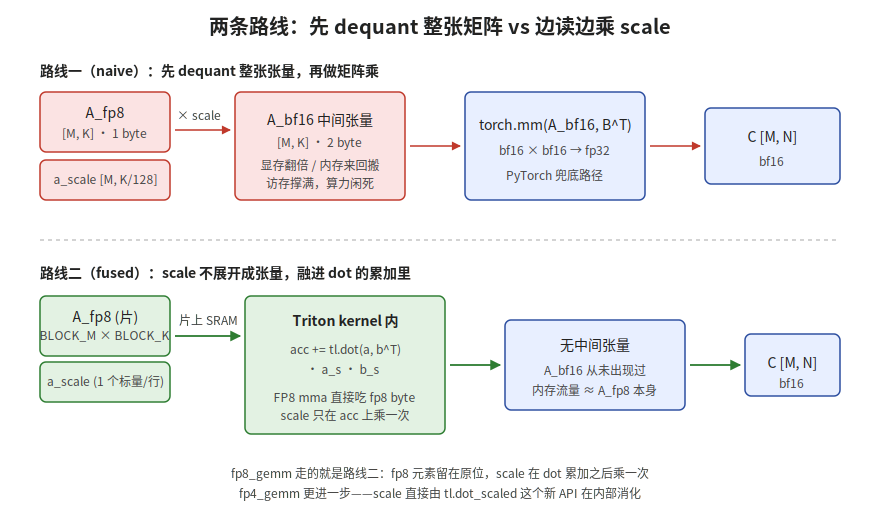
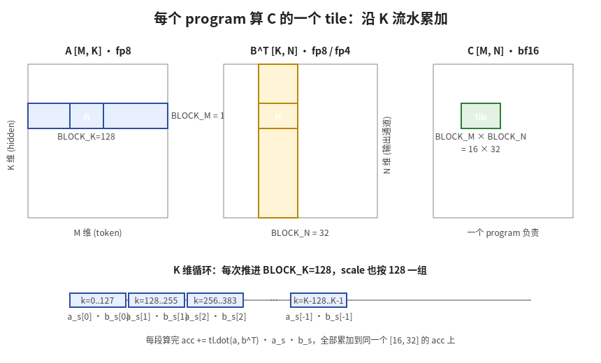

【在 50 系显卡上实现 DeepSeek V4 算子·第 2 站】算力的主力——fp8_gemm 和 fp4_gemm 怎么把 dequant 融进矩阵乘

━━━━━━━━━━━━━━━━━━━━

◆ 开篇：从激活量化走到矩阵乘

━━━━━━━━━━━━━━━━━━━━

上一期（239 期《量化的入口——act_quant 和 fp4_act_quant》 https://mp.weixin.qq.com/s/OozibTbTLlDiBhh57NOv0A ）讲了 `act_quant` 和 `fp4_act_quant` 把激活量化成了 fp8/fp4。今天我们继续走 169 期《一个 token 的旅程——Deepseek V4 全流程总复习》（ https://mp.weixin.qq.com/s/mnbaXhQmQjDAyGD1dDdq5Q ）那条 token 路径——既然激活已经量化好了，下一步就是真正的算力主力：矩阵乘法。

V4 推理里 99% 的算力都耗在矩阵乘上。MLA 的 Q 投影、KV 投影、O 投影，MoE 每个专家的 SwiGLU 上下投影，每一发都是一次矩阵乘。我们跑的 V4 Flash 一共 43 层、每层 256 个路由专家 + 1 个共享专家（跟 166 期《DeepSeek V4 58 页技术报告精读》 https://mp.weixin.qq.com/s/iLObYwtZYqCWwRRYJVcpyA 和 169 期讲的 V4-Pro 不是同一套层数/专家数，Flash 是精简过的版本），每个 token 走一遍 attention + MoE，光是一次 forward 就要点几万次 GEMM。

169 期我自己看完，脑子里只剩"hidden 7168 → 1536 → 65536 → 512 → 7168"的维度跳来跳去，**真到了算的那一步是怎么把激活和权重乘出来的，我其实没看明白**。今天就盯着 `kernel_sm121.py` 里这两个函数把这一步说清楚：

- `fp8_gemm`：fp8 激活 × fp8 权重 → bf16
- `fp4_gemm`：fp8 激活 × fp4 权重 → bf16，用了新 API `tl.dot_scaled`
- `_dequant_fp4`：CPU 兜底用的查表 dequant

为了避免误解，先把上下文交代清楚——本系列的"V4"指的是我们在 DGX Spark 上跑的 V4 Flash 280B 实验平台，仓库地址 https://github.com/lmxxf/deepseek-v4-experimental-platform-on-dgx-spark 。sm_121 是 DGX Spark 的 GPU 架构编号（消费级 Blackwell 家族）。

━━━━━━━━━━━━━━━━━━━━

◆ 第一节：为什么不能"先 dequant 再 GEMM"

━━━━━━━━━━━━━━━━━━━━

要讲 fused dequant，先讲清楚那条最朴素的路有多亏。

────────────────────

【最朴素的路】

激活和权重都是带 scale 的量化张量：

```text
A_fp8: [M, K]            每个元素 1 byte
a_scale: [M, K/128]      每 128 个 K 共享一个 scale
B_fp8: [N, K]            每个元素 1 byte
b_scale: [N/128, K/128]  按 128×128 块共享 scale
```

最朴素的写法：先把 A 和 B 都"还原"成 bf16，再丢给 `torch.mm`：

```python
# 朴素路径：先全量 dequant，再 GEMM
A_bf16 = (A_fp8.float() * a_scale[..., None]).to(torch.bfloat16)
B_bf16 = (B_fp8.float() * b_scale[..., None]).to(torch.bfloat16)
C = torch.mm(A_bf16, B_bf16.t())
```

逻辑上没毛病。问题在于：

| 步骤 | 显存占用 | 内存流量 |
|------|---------|----------|
| 读 A_fp8 | M × K · 1 byte | M × K · 1 byte |
| **写 A_bf16 中间张量** | **M × K · 2 byte** | **+M × K · 2 byte** |
| 读 A_bf16 给 mm | 0 | M × K · 2 byte |
| GEMM | — | M × N · 2 byte |

加粗那一行就是大头：**为了"还原"成 bf16，专门实例化了一个和 A 等大的中间张量，往内存写一遍再读一遍**。fp8 省下来的访存优势，全在这一步还回去了。

V4 Flash 的 MoE 每层激活 256 个路由专家中的 6 个，加上 1 个常驻的共享专家，每个 token 每层要跑 7 次专家 GEMM。**假设激活实例化中间张量，每次都要往内存写一份 bf16 中间结果**，整层下来访存压力翻倍，DGX Spark 用的是 LPDDR5X 统一内存（273GB/s），本来带宽就比数据中心卡窄一大截，更扛不住。

────────────────────

💡 打个比方

朴素路径像是"把字典里所有词条全译成中文打印出来，再让人查"——译这一遍纸张耗到爆，真正查的次数其实没那么多。fused 路径是"译者就坐在查询者旁边，问到哪个词当场翻一个"——纸不出现，词典还是原文存着。

━━━━━━━━━━━━━━━━━━━━

◆ 第二节：fp8_gemm —— scale 不展开成张量，融进 dot 的累加里

━━━━━━━━━━━━━━━━━━━━

先说个前提：182 期《重新理解 SM120+ 的硬件支持状况——我们之前搞错了》（ https://mp.weixin.qq.com/s/dMamjfJwB2A5cCq6Xw4qCQ ）勘误已经查清楚了——**sm_121 上 FP8 mma 硬件指令是完整存在的**，PTX 层面 `mma.sync.aligned.m16n8k32.f32.e4m3.e4m3.f32` 这条指令可用，从 sm_89（RTX 4090 那一代）就有。之前判断过"sm_120+ 消费级卡的 FP8/FP4 硬件残废"，后来验证是判断错了——硬件指令一直都在，缺的是把它用起来的软件封装。

知道这点之后，fp8_gemm 的策略就很直接：

> **fp8 字节不还原，让 Triton 直接拿 fp8 喂给 mma 指令；scale 不实例化成完整张量，只在每个 BLOCK_K 累加完之后，对那块累加结果乘一次**。

────────────────────

【核心 5 行】

整个 fp8_gemm 的 inner loop，精华就这 5 行（`_fp8_gemm_kernel`）：

```python
for k0 in range(0, K, BLOCK_K):       # 沿 K 维度滑动
    a   = tl.load(a_ptr  + ...)        # 加载 BLOCK_M × BLOCK_K 的 fp8 片
    b   = tl.load(b_ptr  + ...)        # 加载 BLOCK_N × BLOCK_K 的 fp8 片
    a_s = tl.load(a_scale_ptr + ...)   # 这一块 K 对应的 scale（每行一个标量）
    b_s = tl.load(b_scale_ptr + ...)   # 这一块 K 对应的 scale（每 128 列一个标量）
    acc += tl.dot(a, tl.trans(b), out_dtype=tl.float32) * a_s[:, None] * b_s[None, :]
```

注意最后一行的结构：

```text
tl.dot(a, bᵀ)    →  fp8 mma 直接吃 fp8 byte，硬件级矩阵乘，输出 fp32 中间块
× a_s · b_s     →  在累加器 acc 上再乘一次 scale
```

整张 A 的 bf16 形态从未存在过。**fp8 字节始终是 fp8，scale 是每 128 个 K 一个标量，乘进去的时候只乘到 fp32 累加器上**——access pattern 上是 1 byte/元素，不是 2 byte/元素。

────────────────────

【块结构】

`fp8_gemm` 用的 tile 大小是：

| 维度 | 值 | 说明 |
|------|----|------|
| BLOCK_M | 16 | 一个 program 算 16 个 token 的输出 |
| BLOCK_N | 32 | 一个 program 算 32 个输出通道 |
| BLOCK_K | 128 | 沿 K 累加的粒度，和 scale 的 block 大小对齐 |

每个 Triton program 负责输出矩阵 C 里一个 16×32 的小块——一直累加到 K 走完为止。grid 大小 = `(ceil(M/16), ceil(N/32))`，每个 program 独立、并行。

为什么 BLOCK_K = 128？因为 V4 的 scale 就是按 128 一组算的——读一次 a_s 和 b_s 恰好对应这 128 个 K 的累加。**scale 的 block 大小决定了 BLOCK_K 的选择**，反过来就要么对不齐要么多读 scale。





━━━━━━━━━━━━━━━━━━━━

◆ 第三节：fp4_gemm —— scale 直接交给硬件级 API

━━━━━━━━━━━━━━━━━━━━

fp4 比 fp8 更狠：每个元素只有 4 bit，需要查表才能解出实际值。V4 的 MoE 权重就是 fp4（E2M1），每个专家的上下投影矩阵都按这个格式存。

如果按 fp8 那一套写——loop 内部读 fp4、查表得到一个浮点小矩阵、再喂给 dot——**dequant 的代价反而盖过了访存的节省**。fp4 元素读进来还得做位运算（取低 4 位 / 取高 4 位 / 查 FP4_TABLE），一进一出本身就是一笔开销。

────────────────────

【tl.dot_scaled：把 dequant 焊进 dot】

Triton 新出了一个 API `tl.dot_scaled`，专门给"块缩放量化"做的：

```python
acc += tl.dot_scaled(
    a_chunk, a_sc, "e4m3",     # A 是 fp8 e4m3，scale 是 E8M0
    b_chunk, b_sc, "e2m1",     # B 是 fp4 e2m1，scale 是 E8M0
)
```

这一行做的事情：

- 直接接受 fp8 byte（A）和 fp4 nibble（B 里两个 fp4 打包在一个 byte 里）
- 直接接受 E8M0 格式的 scale 张量（每 32 个 K 一个 scale）
- 内部完成"dequant + 矩阵乘 + scale 应用"，输出 fp32 累加结果

**它本质上是 fp8 mma + 硬件级 scale 应用的 Triton 封装**。在 sm_120+ 这一代上，fp4 的 dequant 路径被压到了硬件指令里，不需要在 Triton 层面写一遍位运算和查表了。

注意 fp4 的 scale 粒度比 fp8 细：

| 张量 | scale 粒度 | 一组 scale 覆盖的 K |
|------|----------|---------------------|
| fp8 激活 a_scale | E8M0 | 128 |
| fp4 权重 b_scale | E8M0 | 32 |

所以 dot_scaled 一次处理 32 个 K（CHUNK_K=32）——一个 b_scale 对应一个 chunk。a_scale 是 128 一组，4 个 chunk 共用一个 a_scale，kernel 里直接 `k0 // 128` 取下标，不浪费内存：

```python
CHUNK_K = 32
CHUNK_K_PACKED = 16          # fp4 两元素打包成一个 byte，所以 K 维度搬运量减半
for k0 in range(0, K, CHUNK_K):
    a_chunk = tl.load(...)   # [BLOCK_M, 32]，fp8 byte
    b_chunk = tl.load(...)   # [16, BLOCK_N]，fp4 nibble，已 packed
    a_sc = tl.load(... k0 // 128 ...)   # 4 个 chunk 共用
    b_sc = tl.load(... k0 // 32  ...)
    acc += tl.dot_scaled(a_chunk, a_sc, "e4m3", b_chunk, b_sc, "e2m1")
```

────────────────────

💡 打个比方

`tl.dot` 是"做矩阵乘"，`tl.dot_scaled` 是"做带 scale 的矩阵乘"——把"dot + scale"两个动作合成一个原子操作。区别就像普通函数和编译器内建（intrinsic）：普通函数你可以自己拼出来，但 intrinsic 走的是硬件直通车，没有多余的中间状态。

────────────────────

【为什么 fp4 用 dot_scaled 收益比 fp8 更大】

| 量化格式 | dequant 复杂度 | fused 进 dot 的收益 |
|---------|--------------|---------------------|
| fp8 (E4M3) | 字节本身就是 IEEE 浮点，dequant 只是 × scale | 小（scale 外乘也很便宜） |
| fp4 (E2M1) | 4-bit 没有原生浮点解码，必须查表/位运算 | 大（省下整段 Triton dequant 逻辑） |

fp8 的 dequant 本来就便宜——硬件 mma 直接吃 fp8 byte，scale 在累加器上乘一次就完事。fp4 不一样，**dequant 那段位运算 + 查表如果让 Triton 自己写，每个 chunk 都要做一遍，开销会被放大**。dot_scaled 把这层焊到了硬件指令里，省的不是访存而是逻辑。

────────────────────

【兜底路径里的 _dequant_fp4】

`_dequant_fp4` 是给 CPU/没有 Triton 的环境兜底用的——把 fp4 字节按高 4 位/低 4 位分开，查 FP4_TABLE 还原成 fp32：

```python
def _dequant_fp4(b):
    raw = b.view(torch.uint8)
    low  = raw & 0x0F           # 低 4 位
    high = (raw >> 4) & 0x0F    # 高 4 位
    table = FP4_TABLE.to(raw.device)  # 16 个值的查找表
    return torch.stack([table[low.long()], table[high.long()]], dim=-1).flatten(-2)
```

这就是 dot_scaled 在 GPU 上帮我们省掉的那段逻辑。FP4_TABLE 里 16 个值 `[0, 0.5, 1.0, 1.5, 2.0, 3.0, 4.0, 6.0, 0, -0.5, ..., -6.0]`——E2M1 浮点的全部可能取值。**4 bit 的好处就在这里：可能取值就 16 个，整个数值集合可以塞进一个查找表**。

━━━━━━━━━━━━━━━━━━━━

◆ 第四节：算力大头都被这俩 GEMM 吃了

━━━━━━━━━━━━━━━━━━━━

回到 169 期那张"token 旅程"地图。**V4 每一层里几乎所有大矩阵乘法，最后都收口到 fp8_gemm 或 fp4_gemm 里**：

| 位置 | 维度 | 调用 |
|------|------|------|
| Q 低秩 down 投影 | h[7168] × W_q_down[7168, 1536] | `fp8_gemm` |
| Q 低秩 up 投影 | [1536] × W_q_up[1536, 65536] | `fp8_gemm` |
| KV 投影 | h[7168] × W_kv[7168, 512] | `fp8_gemm` |
| O 分组低秩投影 | 16 组 × [4096, 1024] / [1024, 7168] | `fp8_gemm` |
| MoE 每个专家 SwiGLU | gate/up [7168, 2048] / down [2048, 7168] | **`fp4_gemm`** |
| LM Head 词表投影 | h[7168] × W_emb[7168, 129280] | `fp8_gemm` |

Attention 这一侧的权重精度高（Q/KV/O），走 fp8。**MoE 专家权重数量大、走 fp4**——V4 Flash 一层 256 个路由专家，每个专家两个 SwiGLU 矩阵，参数量在整个模型里占绝对大头。fp4 比 fp8 又省一半访存和存储，再叠加 dot_scaled 的硬件级 dequant，MoE 推理才能在 DGX Spark 这种消费级硬件上跑起来。

DeepSeek 官方 DeepGEMM 库的 MoE 路径本来就是 fp8 activation × fp4 weight（函数签名 `fp8_fp4_gemm`）。我们在 sm_121 上抄的是同一套接口设计，只是底层走了 Triton 替代 DeepGEMM 面向 SM100 数据中心卡写的专用代码——数据中心卡有 `tcgen05` 这类硬件调度指令，消费级的 sm_121 没有，只能靠 Triton 生成的 `mma.sync` 路径另外实现一遍。

────────────────────

💡 打个比方

如果说 V4 的前向是一条流水线，那么 fp8_gemm / fp4_gemm 就是流水线上那台"压力最大的车床"。act_quant 和 fp4_act_quant 是上一道工序（材料预处理），Indexer 和 sparse attention 是下游工序（选哪些 KV 参与运算）——**整条流水线的产能瓶颈，几乎完全卡在这台车床的工时上**。能不能在 sm_121 上跑 V4，本质就是这两个 GEMM 跑不跑得动。

━━━━━━━━━━━━━━━━━━━━

◆ 第五节：复盘 —— 我学到了什么

━━━━━━━━━━━━━━━━━━━━

169 期那时候我看 Q 投影那段，脑子里只记住"7168 维下匝道到 512 维注意力服务区"那张图。**矩阵乘到底怎么算的，量化和反量化怎么协调，全跳过了**。今天补上：

1. **量化 GEMM 的关键不是算得快，是读得少**。fp8/fp4 的核心收益在访存——DGX Spark 的 LPDDR5X 统一内存带宽是 sm_121 的瓶颈，每个元素少 1 byte 就少 1 byte。这条收益一旦中间被实例化成 bf16 张量就全没了，所以才需要 fused dequant。

2. **fused dequant 不止一种形态**。fp8_gemm 是"scale 外乘"——dot 用原始 fp8，外面乘 scale；fp4_gemm 是"scale 内嵌"——dot_scaled 直接吃 scale 张量。两种都不实例化中间张量，区别只是 scale 在哪一层应用。

3. **新 API 的存在比新硬件指令更重要**。sm_121 的 fp8/fp4 mma 指令一直都在，但要让 Triton 用上需要 `tl.dot_scaled` 这种新 API 做封装。**硬件早就准备好了，是软件栈追了半年才赶上**。

4. **块大小的选择是被 scale 粒度反推出来的**。fp8 的 BLOCK_K=128 是因为 a_scale 按 128 分组，fp4 的 CHUNK_K=32 是因为 b_scale 按 32 分组。**Triton kernel 的 tile 形状不是随便选的——量化方案的 scale 粒度决定了它**。

5. **算力大头其实只有两个函数**。MLA 的所有大矩阵乘法 + MoE 所有专家的 SwiGLU——加起来 V4 每个 token 的 99% 算力都在这两个函数里。理解了 fp8_gemm 和 fp4_gemm，就理解了 V4 算力消耗的形状。

━━━━━━━━━━━━━━━━━━━━

◆ 下一期预告：Indexer ——选出该看的 KV

━━━━━━━━━━━━━━━━━━━━

GEMM 把算力的"主战场"讲完了，下一期我们去看 V4 注意力里那个最特别的小家伙——**Indexer**（kernel_sm121.py 里 `fp8_index_score_kernel` 那一段）。Indexer 是 V4 的"侦察兵"，每个 query 出去之前先用低维向量扫一遍 KV cache，挑出最相关的 topk，再让正式的 sparse attention 只看这 topk 条。**这是 V4 在长上下文下省算力的关键设计**。

下一期见。

━━━━━━━━━━━━━━━━━━━━

【参考资料】

- DeepSeek V4 Flash 官方主页：https://huggingface.co/deepseek-ai/DeepSeek-V4-Flash
- 实验仓库：https://github.com/lmxxf/deepseek-v4-experimental-platform-on-dgx-spark ，`kernel_sm121.py`

━━━━━━━━━━━━━━━━━━━━

**「访存是 sm_121 的瓶颈，每个元素少 1 byte 就少 1 byte——fused dequant 守的就是这条防线。」**

**「fp8 用 scale 外乘，fp4 用 tl.dot_scaled 内嵌——同一思想两种形态，区别只是 scale 在哪一层应用。」**

**「V4 每个 token 99% 的算力都收口到 fp8_gemm 和 fp4_gemm 这两个函数里。」**

━━━━━━━━━━━━━━━━━━━━

// 靳岩岩的 AI 学习笔记 × Claude 的严谨 × Gemini 的浪漫
// 2026-07-04
