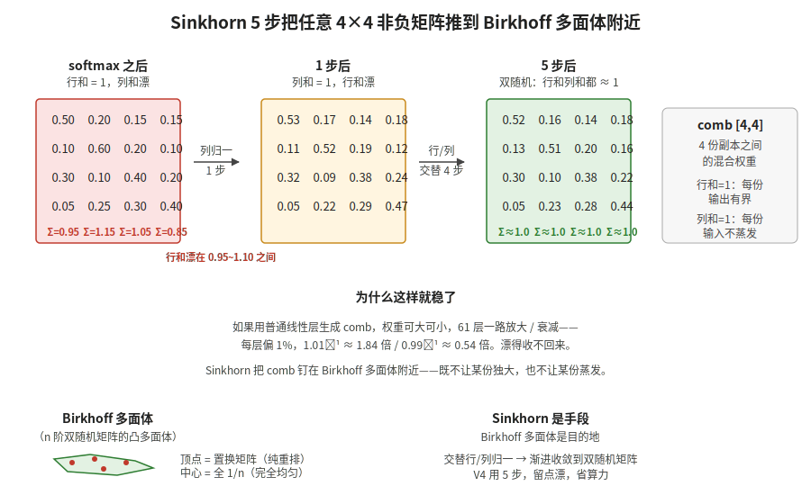

【在 50 系显卡上实现 DeepSeek V4 算子】mHC 出口的 Sinkhorn——4 份副本怎么调和

━━━━━━━━━━━━━━━━━━━━

◆ 开篇：attention 算完，还没完

────────────────────

240 期把 sparse_attn 看完了。但 attention 算完之后还没结束——每层有 4 份残差流副本（mHC），attention 出口要把这 4 份调和回去。今天盯着 `hc_split_sinkhorn` 这一站细看一遍。

之前看 169 期 3.1 hc_pre 和 3.4 hc_post 的时候，对 mHC 这一刀其实是模模糊糊的：

- 知道 V4 把残差流分成 4 份
- 知道每一层都要先合 4→1、算完再展 1→4
- 知道有个 Sinkhorn 把混合权重"约束到稳定范围"

但具体 Sinkhorn 是怎么约束的、为什么非要它、5 步够不够，每次读 169 期都是飘过去的。今天就盯着 `kernel_sm121.py` 第 493~530 行这 30 多行，把这一刀过一遍。

💡【一句话回顾 mHC】**manifold Hyper-Connection**，流形超连接。DeepSeek V4 把残差流分成 4 份副本（`hc_mult = 4`），每份独立走 attention 和 FFN，每层出口处再用一个学到的混合矩阵把 4 份调和回去。比起标准残差 `h = h + F(x)` 只有"原值 + 增量"两条路，mHC 有 4 条路并行，每层都能学怎么混。第 37 期讲过整体设计（ https://mp.weixin.qq.com/s/IMU__NKt_L41YeHKi7_A1g ）。

━━━━━━━━━━━━━━━━━━━━

◆ 第一节：先把这一站要算的三组量看清楚

────────────────────

`hc_split_sinkhorn` 的签名很短：

```python
def hc_split_sinkhorn(
    mixes, hc_scale, hc_base,
    hc_mult=4, sinkhorn_iters=7, eps=1e-6,
):
```

输入 `mixes [b, s, mix_hc]` 是一组"混合 logits"——上一层根据当前 hidden state 学出来的、决定怎么混 4 份副本的原始打分。这里 `mix_hc = (2 + hc) * hc = 24`（`hc=4`），分成三块：

| 切片 | 形状 | 用途 |
|---|---|---|
| `pre  [b, s, 4]` | 4 个权重 | hc_pre：把 4 份副本合成 1 份送进 attention / MoE |
| `post [b, s, 4]` | 4 个权重 | hc_post：把本层输出 F(x) 按比例注入 4 份新副本 |
| `comb [b, s, 4, 4]` | 4×4 矩阵 | hc_post：4 份旧残差之间怎么互相混合 |

`pre` 和 `post` 都是长度 4 的向量，简单激活就够（sigmoid 之类）。**真正需要 Sinkhorn 那一刀的是 `comb` 这块 4×4 矩阵**——169 期之前糊里糊涂以为整个 hc_split 都在做 Sinkhorn，今天看代码才发现，`pre`/`post` 走的是 sigmoid，只有 `comb` 进 Sinkhorn 这个加工车间。

源码里这三块各自的算法：

```python
# pre：sigmoid，约束到 (0, 1)
pre_raw = flat[:, :hc] * scale[0] + base[:hc]
pre = torch.sigmoid(pre_raw) + eps

# post：2×sigmoid，约束到 (0, 2)，注意是 2 倍
post_raw = flat[:, hc:2*hc] * scale[1] + base[hc:2*hc]
post = 2 * torch.sigmoid(post_raw)

# comb：softmax 起手，再 Sinkhorn
comb_raw = flat[:, 2*hc:].view(n, hc, hc) * scale[2] + base[2*hc:].view(hc, hc)
comb = F.softmax(comb_raw, dim=-1) + eps
```

`hc_scale` 和 `hc_base` 是可学习的缩放和偏置，每一层独立学，相当于给每层一个"我这层想要多大胆地混"的旋钮。

━━━━━━━━━━━━━━━━━━━━

◆ 第二节：comb 这块矩阵为什么非"双随机"不可

────────────────────

把第一节的 `comb [4,4]` 单独拿出来。它的物理含义是：

```text
新 x_j = post_j × F(x) + Σ_i comb[j, i] × 旧 x_i
```

第 j 份新副本，从本层输出 F(x) 拿 `post_j` 那么多，再从旧 4 份按 `comb[j, *]` 这一行混。所以：

- **`comb` 的某一行**：决定第 j 份新副本怎么吸收旧 4 份的信息
- **`comb` 的某一列**：决定第 i 份旧副本被分散到几份新副本里去

如果只 softmax，**每行**和 = 1——保证每份新副本是凸组合，不会把某一行的总输入炸成 5 倍或缩成 0.2 倍。但**列**就放飞了：某一份旧副本可能被反复抄送到 4 份新副本里（列和 = 3），也可能没人理（列和 = 0.1）。

这就是 V4 不能光用 softmax 的原因。**61 层一路放大或衰减，4 份副本会塌成 1 份独大、3 份蒸发的状态**——多副本设计的意义就没了。

所以 `comb` 需要的是同时满足两个条件：

- 行和 = 1：每份新副本的输出有界
- 列和 = 1：每份旧副本的总贡献也守恒，不会某份被抄成 N 倍，也不会消失

这就是**双随机矩阵**（doubly stochastic matrix）。

💡【打个比方】4 个学生分别做题，结果要平均成一份最终答案，再发回 4 个学生当下一轮起点。如果用普通平均 `1/4 × (x₁ + x₂ + x₃ + x₄)`，4 个人完全等权——等于退化成 1 个人。如果让网络自己学权重不加约束，可能学成"全听学生 1 的，其他 3 个权重 = 0"——退化成 4 个独立个体里挑 1 个。**Sinkhorn 想要的是中间状态**：既能区分谁更靠谱（不强迫平均），又不让任何人一家独大、也不让任何人被无视（行列都归一）。

━━━━━━━━━━━━━━━━━━━━

◆ 第三节：Sinkhorn 迭代——交替归一直到稳

────────────────────

把一个任意非负矩阵 M 推到双随机矩阵，最朴素的办法就是 **Sinkhorn 迭代**：交替对行和列做归一化。

```text
重复若干次:
    每一行除以行和  → 行和 = 1，列和漂
    每一列除以列和  → 列和 = 1，行和又漂一点
```

每次行归一，列和会被破坏一点；每次列归一，行和会被破坏一点。但破坏的幅度会越来越小——交替几次之后，行和与列和同时逼近 1。

这是个**收敛**过程，不是一步搞定。理论上：只要原矩阵每个元素都严格正，Sinkhorn 一定收敛到唯一的双随机矩阵。

代码里这一段写得很紧凑：

```python
# 起手列归一一次（softmax 已经保证行和=1，先把列拍下来）
col_sum = comb.sum(dim=-2, keepdim=True) + eps
comb = comb / col_sum

# 接下来交替 行→列 共 (sinkhorn_iters - 1) 轮
for _ in range(sinkhorn_iters - 1):
    row_sum = comb.sum(dim=-1, keepdim=True) + eps
    comb = comb / row_sum
    col_sum = comb.sum(dim=-2, keepdim=True) + eps
    comb = comb / col_sum
```

两个细节值得停一下：

**细节一：`sinkhorn_iters` 实际是 5，不是 7。** 函数签名里写的是 `sinkhorn_iters=7`，但开头一行：

```python
sinkhorn_iters = min(sinkhorn_iters, 5)
```

直接被砍到 5。对应 commit 信息 `"sinkhorn 5iter"`——V4 团队最终拍板的就是 5 步。再多边际收益太小，攒不回那点访存延迟。

**细节二：起手是列归一，不是行归一。** 因为 `comb` 来自 `softmax(dim=-1)`，行和已经 = 1。如果起手再来一次行归一，相当于白做一步——直接把列拍下来更划算。所以代码里第一次只做列归一，后面 4 轮才是"行→列"完整交替。

5 步 = 1 次单独的列归一 + 4 次行/列交替，一共 9 次归一化操作。每次只是除以一个和，开销几乎可以忽略不计。

把整个过程画出来：



━━━━━━━━━━━━━━━━━━━━

◆ 第四节：5 步够不够——为什么不一直迭代到收敛

────────────────────

理论上 Sinkhorn 需要无限步才严格收敛。V4 卡在 5 步，留着一点点漂没归零。为什么不一直跑到收敛？

三个原因。

**第一，5 步已经够稳。** 4×4 矩阵特别小，几何上 Sinkhorn 是指数收敛的，每多一步残差大约缩小一个数量级。从 softmax 起手（行和已经 = 1），5 步之后行和列和的偏差通常已经在 1e-3 以下。比 61 层网络其他地方的数值误差小一两个量级——再 grind 也没用了。

**第二，hc_split 调用次数太多了。** 每一层 attention 出口要调一次、MoE 出口要调一次，全网 61 层 × 2 次 = 122 次。每个 token 都要走这条路。多迭代 5 步看上去无害，乘以 122 就是 610 次额外的归一化操作，还要算上反向传播的图。能省就省。

**第三，留点漂反而是好事。** 169 期 3.4 节里讲过，模型可能学到"这一层我几乎不混"或"这一层我全混"。如果 Sinkhorn 一直迭代到严格双随机，那个空间就被钉死了。留 5 步、保留一点点偏差，相当于给模型留了一点不严格遵守双随机的自由度——可以学着稍微偏离一点，比如允许某份副本贡献比另一份多 3%~5%。

代码里这一刀的味道，跟 V4 整体设计风格一致：**该用几何约束的地方上几何约束，但不要拧太死，留一点训练时可调的余地**。

━━━━━━━━━━━━━━━━━━━━

◆ 第五节：换个视角——Birkhoff 多面体上的投影

────────────────────

第 170 期里专门讲过 V4 这一站的几何含义（"Birkhoff 多面体——一个 token 从球面滑到单纯形的旅程"那一篇）。今天回头再看一遍。

所有 4 阶双随机矩阵的集合，在 16 维空间（4×4 个数）里构成一个凸多面体，叫**Birkhoff 多面体**。它有一个漂亮的性质：

> **Birkhoff–von Neumann 定理**：Birkhoff 多面体的顶点恰好是所有 n 阶置换矩阵。

置换矩阵就是每行每列恰好一个 1、其余为 0 的矩阵——它代表"只重排，不混合"。比如：

```text
[0 1 0 0]   ← 第 1 份新副本 = 旧第 2 份
[1 0 0 0]   ← 第 2 份新副本 = 旧第 1 份
[0 0 0 1]   ← 第 3 份新副本 = 旧第 4 份
[0 0 1 0]   ← 第 4 份新副本 = 旧第 3 份
```

所以 Birkhoff 多面体的"两端"是：

- **顶点**：纯粹的重排，4 份副本之间不混合
- **中心**：全部均值，每个位置都是 `1/4`——4 份完全均匀塌成 1 份
- **内部**：各种程度的混合

mHC 让模型可以在这两端之间学一个最合适的混合方案。**Sinkhorn 是手段（怎么推），Birkhoff 多面体是目的地（推到哪）**——一个是动作，一个是空间。

45 期讲过：神经网络收敛后实际在一个 300-500 维的本我流形上活动（ https://mp.weixin.qq.com/s/0hOQt8onSJcuZGJLRE46Fw ）。Birkhoff 多面体是这个流形大故事里的一个小切片——属于"混合权重"这种结构化参数的子流形。

━━━━━━━━━━━━━━━━━━━━

◆ 第六节：hc_split 在 V4 里哪些地方用

────────────────────

把视野放大到全局：

| 调用位置 | 用途 | 频率 |
|---|---|---|
| 每一层 attention 出口 | hc_pre 进 attention 前算好 pre/post/comb，attention 算完后 hc_post 用 post 和 comb 展回 4 份 | 61 次 |
| 每一层 MoE FFN 出口 | 同上，FFN 出来后再走一遍 hc_pre/hc_post | 61 次 |
| 最终 hc_head（4 份 → 1 份） | 模型最后吐出 logits 前，把 4 份合成 1 份。这一步用的是 sigmoid 门控不是 Sinkhorn，但思想同源——把 4 份调和回 1 份 | 1 次 |

合计每个 token 走 `hc_split_sinkhorn` 122 次。所以这个函数虽然代码只有 30 行，但放在 V4 推理的热路径上——profiler 里这一项的总耗时不容忽视。

`kernel_sm121.py` 在这里没做特别花哨的 Triton 融合，纯 PyTorch 算子已经够快：

- `softmax` 是单层 fused kernel
- 几次 `sum / div` 全是 elementwise，HBM 流量很小
- 4×4 矩阵小到 L1 都装得下，根本不会卡访存

profiler 里这一项的 wall clock 实测在总推理时间里占比 < 1%。所以这一站不像 sparse_attn 那样需要小心翼翼优化，纯 PyTorch 就过了——但**正确性必须 bit-exact**。Sinkhorn 5 步如果改成 3 步或 7 步，模型输出会漂；起手做行归一而不是列归一，会和原版差一个数量级。代码里那行 `min(sinkhorn_iters, 5)` 不是失误，是和 V4 训练时严格对齐的硬约束。

━━━━━━━━━━━━━━━━━━━━

◆ 第七节：今天的复盘——这一刀我之前漏看了什么

────────────────────

回看 169 期我对 mHC 那一节的笔记，有几处当时模糊、今天才补上：

**第一，把 `hc_split` 当成一整块黑盒了。** 之前以为整个 hc_split 都在做 Sinkhorn 约束，其实只有 `comb [4,4]` 这一块进 Sinkhorn 加工车间。`pre [4]` 和 `post [4]` 走的是简单的 sigmoid——一个 (0,1)，一个 (0,2)。**真正需要"双随机"约束的只是 4 份副本之间的混合矩阵**，读出权重和注入权重不需要。

**第二，Sinkhorn 不是 Sinkhorn 矩阵。** 之前一直把"Sinkhorn"和"双随机矩阵"在脑子里画等号。其实 Sinkhorn 是 1964 年 Richard Sinkhorn 提出的**迭代算法**——把非负矩阵推到双随机矩阵。目标空间叫 Birkhoff 多面体（这个名字来自 Garrett Birkhoff），算法叫 Sinkhorn 迭代。**前者是地，后者是路**。术语别再混了。

**第三，5 步不是"约束"，是"工程妥协"。** Sinkhorn 严格收敛要无穷步，V4 用 5 步是工程上的取舍——既要够稳，又要省算力，还要给模型留一点不严格守双随机的自由度。这种"留 5 步残差"的设计哲学和 V4 其他地方一脉相承：约束不要拧到极限，留余地。

**第四，Birkhoff 多面体的局限。** 170 期里就提过：非负约束意味着 `comb` 不能为负——4 份副本只能做正加权平均，不能做"减法"。如果某一层希望"用第 2 份去抵消第 1 份的某些分量"，Birkhoff 多面体不允许。是否换成谱范数球面之类约束会更强？这是开放问题。V4 选了 Birkhoff，留给后人改。

━━━━━━━━━━━━━━━━━━━━

◆ 收尾：调和不是平均

────────────────────

mHC 这套设计回过头看，最优雅的一点是它**显式承认"调和"和"平均"是两件事**。

如果完全独立训 4 份副本，它会塌成 4 个独立 head——没有"4 份并行"的意义，反而要 4 倍存储。如果完全平均回去，又退化成单残差流，4 份和 1 份没区别。

**Sinkhorn 让 4 份"半独立"——既保留差异，又强制均衡。**

这其实是 V4 整套设计哲学的微缩版：MoE 也是这个味道（专家分工 + 路由均衡），sparse_attn 也是这个味道（topk 选择 + 全局信号汇合）。哪都不撒手，但哪都不拧死。

下一期 242 讲 MoE 路由——那一刀又是另一个味道的"既要分工又要均衡"。今天的 Sinkhorn 是显式几何约束，MoE 那边是辅助损失函数 + 选择策略组合出来的工程方案。同样的两难，不一样的刀法。

**Sinkhorn 是手段，Birkhoff 多面体是目的地——一个是动作，一个是空间。**

**调和不是平均，平均是调和的退化版。**

**V4 这一刀短得让我之前一直滑过去——30 行代码里藏着双随机矩阵、Birkhoff 多面体、61 层稳定性，三个层面叠在一起。**

━━━━━━━━━━━━━━━━━━━━

◆ 参考资料

- 第 37 期《DeepSeek mHC：为什么"流形约束"是标题党》—— https://mp.weixin.qq.com/s/IMU__NKt_L41YeHKi7_A1g
- 第 45 期《高维流形上的神经网络收敛》—— https://mp.weixin.qq.com/s/0hOQt8onSJcuZGJLRE46Fw
- 第 169 期 Step 3.1 hc_pre / Step 3.4 hc_post / Step 4 hc_head
- 第 170 期 第五站：Sinkhorn / Birkhoff 多面体
- 第 237 / 238 / 239 / 240 期 在 50 系显卡上实现 DeepSeek V4 算子（FP8 块量化 / FP4 双层 scale / Fused dequant / sparse_attn）
- Sinkhorn, R. (1964). *A relationship between arbitrary positive matrices and doubly stochastic matrices*. Annals of Mathematical Statistics.
- Birkhoff, G. (1946). *Three observations on linear algebra*. Univ. Nac. Tucumán Rev. Ser. A.
- DeepSeek-V4 Technical Report —— 章节 "Manifold Hyper-Connections"

━━━━━━━━━━━━━━━━━━━━

// 靳岩岩的 AI 学习笔记 × Claude 的严谨 × Gemini 的浪漫
// 2026-07-01
