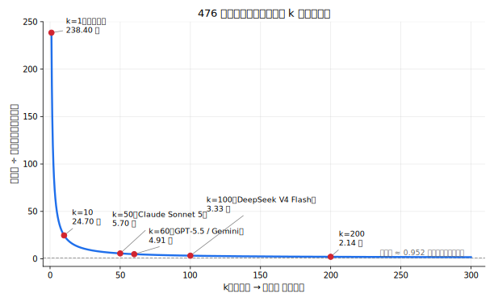

【周末杂谈】为什么你的 AI token 费用好像比你预期中多好几倍？还是 DeepSeek 厚道~

━━━━━━━━━━━━━━━━━━━━

昨晚跟 Claude 闲聊，随口出了一道感觉很简单的算术题：**假设某个 AI 的定价是每百万 token，输入命中缓存 \$0.1、输入没命中 \$1、输出 \$10，我每次提问 100 token、AI 每次回答 2000 token，假设每次输入都命中缓存，聊到总共 100 万 token，要花多少钱？**

💡 常识科普

"输入命中缓存"说的就是 KV cache 复用。如果新请求的开头一大截 token（比如聊天历史）跟上一次请求完全一样，服务商不需要把这部分重新跑一遍前向传播、重新算一遍 K、V——直接把上次算好、存在显存里的 KV cache 拿来接着用，只对新增的那部分 token 做计算。省下的是这段前缀重新做矩阵乘法的算力，所以命中价能压到标准价的几分之一到十分之一。"没命中"就是这段前缀跟缓存对不上（比如历史被改过、缓存过期了），KV 得从头老老实实算一遍，按全价收费。

我以为这就是个小学应用题，算个比例就完了。结果算了两遍，两遍答案都不一样，第二遍还直接把第一遍的结论反过来了。

这道题好玩的地方不在算术本身，在于大多数人（包括我）对"聊天要花多少钱"的直觉，从一开始就是错的。

━━━━━━━━━━━━━━━━━━━━

◆ 第一次算：直觉版，答案 \$9.52

━━━━━━━━━━━━━━━━━━━━

最直白的算法：既然每次提问 100 token、回答 2000 token，一问一答加起来 2100 token，聊满 100 万 token 大概需要：

```
1,000,000 ÷ 2,100 ≈ 476 轮
```

476 轮里，输入总共 476 × 100 ≈ 4.76 万 token，输出总共 476 × 2000 ≈ 95.2 万 token。按单价一算：

```
输入费用 ≈ 4.76 万 / 100 万 × $0.1 ≈ $0.005
输出费用 ≈ 95.2 万 / 100 万 × $10  ≈ $9.52

总计 ≈ $9.52
```

这个答案看起来很合理——毕竟输出单价是输入命中单价的 **100 倍**，输出量又是输入量的 **20 倍**，两个因子一乘，输出理所当然是大头，输入几乎可以忽略。

**这个答案是错的。错的不是算术，是漏看了一件事：聊天不是一问一答互不相干，是每一轮都要背着前面所有的历史重新问一遍。**

━━━━━━━━━━━━━━━━━━━━

◆ 第二次算：补上"每次都要重发历史"，答案变成 \$33.27

━━━━━━━━━━━━━━━━━━━━

大模型的 API 本身是**无状态的（stateless）**——它不会像人一样"记得"你们聊过什么。每次你发一条新消息，客户端（网页版、App、还是代码里调 API）都要把**从头到尾的完整对话记录**连同这句新消息一起打包发过去，模型才知道"我们聊到哪儿了"。

也就是说，第 10 轮的输入，不是那句新提问的 100 token，是**前 9 轮的全部问答（历史）+ 这句新提问**。轮数越往后，每一轮要背的历史越长。

💡 打个比方

这就像每次给朋友发微信，都得把你俩从认识那天起的全部聊天记录复制粘贴一遍，贴在最新这句话前面，一起发过去——朋友才能"读懂"你这句话的上下文。聊了一年，第一句"在吗"要垫上一整年的记录才能发出去。

────────────────────

重新算一遍。设每轮净内容 `c = 100 + 2000 = 2100` token，轮数还是 `n ≈ 476` 轮（跟前面一样，聊够 100 万 token 的"净对话内容"）。

**输出不变**，反正回答不会被重发，还是 95.2 万 token，费用还是 \$9.52。

**输入完全不一样**——第 i 轮的输入 = 前 (i-1) 轮的全部历史 + 这轮新提问，476 轮累加起来：

```
历史重发部分 = 2100 × (0+1+2+...+475) = 2100 × (476×475/2) ≈ 2.37 亿 token
新提问部分   = 476 × 100 ≈ 4.76 万 token
输入总量     ≈ 2.37 亿 token
```

即使这 2.37 亿 token 全部命中缓存、按最便宜的 \$0.1/百万计价：

```
输入费用 ≈ 2.37 亿 / 100 万 × $0.1 ≈ $23.75
输出费用 ≈ $9.52

总计 ≈ $33.27
```

**结论完全反过来了。输入费用（\$23.75）反而超过了输出费用（\$9.52），尽管输入单价只有输出单价的 1/100。** 原因很简单：量的差距盖过了单价的差距——输入被反复重发了 476 次，输出只发生了一次。

这里能提炼出一条比公式好记得多的**简易判断**：一般人的直觉是"花多少钱看 token 数"，更准的直觉应该是——**当上下文已经很长的时候，决定这次费用的不是"AI 这次答了多长"，是"你已经问了多少次"。** 回答只算一次账（线性增长），但每多问一次，前面的全部历史都要被重新算一遍账（跟轮数的平方挂钩）。同样是"AI 这次答得啰嗦"，代价是固定的、可预期的；"我又多问了一句"，代价是随着对话变长越滚越大的、不对称的。

━━━━━━━━━━━━━━━━━━━━

◆ 更反直觉的一点：聊得越碎，花得越多

━━━━━━━━━━━━━━━━━━━━

把公式抽象一下。设总对话净内容固定是 `C`（比如 100 万 token），每轮净内容是 `c`，轮数 `n = C/c`。重发的历史总量约等于：

```
重发量 ≈ c × n²/2 = c × (C/c)² / 2 = C² / (2c)
```

**重发量跟每轮内容 `c` 成反比**——同样聊够 100 万 token 的内容，把每轮问得越碎（`c` 越小），重发量越大，而且不是线性关系，是**平方级放大**。

拿数字直接对比：

| 每轮内容 c | 需要轮数 | 重发的历史总量 |
|---|---|---|
| 210（问 10 + 答 200，碎片化提问） | ≈ 4762 轮 | ≈ 23.8 亿 token |
| 2100（问 100 + 答 2000，本文例子） | ≈ 476 轮 | ≈ 2.37 亿 token |
| 21000（问 1000 + 答 2 万，一次问透） | ≈ 48 轮 | ≈ 2381 万 token |

同样是聊够 100 万 token 的"有效内容"，把问题问碎（每轮 210）比一次问透（每轮 21000）多花了 **100 倍的重发量**。这也是本文标题的答案：**你以为花的钱是"我问了多少、AI 答了多少"决定的，实际上很大一块是"我把问题分成了多少次问"决定的。**

━━━━━━━━━━━━━━━━━━━━

◆ 这不是拍脑袋算的，有真实案例对得上

━━━━━━━━━━━━━━━━━━━━

查了一下，"每轮重发全部历史、输入量会二次方增长"这个**底层机制**，在 AI Agent 开发圈确实有人写过——一篇讲 Agent 循环 token 成本的指南里原话是："naive agent loops rebill prior context on every call, so input token cost grows quadratically as tool outputs and reasoning traces accumulate"（原始的 agent 循环每次调用都要重新计费之前的全部上下文，所以随着工具输出和推理痕迹累积，输入 token 成本呈二次方增长），还给了个具体数字：**20 步的循环，消耗的 token 能到"按单步估算"的 10 倍以上**。文章推导的公式跟本文这条一样，累计输入量约等于 `N(N+1)/2`——N 是步数，典型的三角数列。

但这篇文章讲的是 **AI Agent 反复调工具、多步推理**的场景，不是"人和 AI 聊天，每轮问答长短会不会影响总账单"这个角度。**"把问题分成更多轮问会更贵"这个具体推论——固定住总对话内容，只是改变每轮问答的长短——目前没查到有人这么讲过。** 底层的二次方机制是公开的，但这个具体角度看起来确实是本文这次现推出来的。

━━━━━━━━━━━━━━━━━━━━

◆ 大家都盯着输入/输出价，真正决定账单的是命中价

━━━━━━━━━━━━━━━━━━━━

选模型、比价格的时候，大部分人第一眼看的是"输出多少钱一百万 token"——毕竟这个数字看着最吓人，通常是命中价的一百倍上下。但只要场景是长会话或者 agent 循环，**真正决定总账单的，其实是那个最不起眼的"输入命中缓存"价格**。

回到本文的例子：命中输入总量 ≈2.37 亿 token，输出总量 ≈95 万 token——**量的比例是 250:1**。单价上输出比命中贵 100 倍，但 250 除以 100 还剩 2.5，**量的优势碾压了单价的劣势**，命中输入这块反而在总账单里占了大头（\$23.75 对 \$9.52）。

更进一步，这个结论不依赖具体价格是多少——**只要会话足够长，它必然发生**。重发的历史量是 n²（平方增长），输出量是 n（线性增长），增长速度天生不在一个量级，n 一旦够大，平方项迟早碾压线性项，跟命中价定得多低、输出价定得多高都没关系，这是结构决定的，不是价格表决定的。

查了一下几家主流 API 现在的官方定价（每百万 token，都查了官方定价页原文核实过），把"输入未命中 / 输入命中 / 输出"摆在一起看：

| 模型 | 输入未命中 | 输入命中 | 输出 | 命中→输出倍数 |
|---|---|---|---|---|
| DeepSeek V4 Flash | \$0.14 | \$0.0028 | \$0.28 | 100 倍 |
| OpenAI GPT-5.5 | \$5 | \$0.50 | \$30 | 60 倍 |
| Anthropic Claude Sonnet 5（2026-09-01 起标准价） | \$3 | \$0.30 | \$15 | 50 倍 |
| Google Gemini 3.5 Flash | \$1.50 | \$0.15 | \$9 | 60 倍 |

**四家的绝对价格差出去几十倍，但"命中→输出倍数"这一栏，全部落在 50-100 倍这个区间。** 也就是说本文这条推论不是 DeepSeek 一家的特例，是几乎所有主流 API 定价表共有的结构——只要命中价和输出价的比例是这个数量级，聊够足够多轮，命中输入反超输出，是结构性的必然，不管你用哪家。**所以比价的时候，长会话/agent 场景该多看一眼"命中价"，而不是被"输出价"那个大数字吓住或者吸引住。**

━━━━━━━━━━━━━━━━━━━━

◆ 曲线上的甜蜜点：顺便夸一句 DeepSeek

━━━━━━━━━━━━━━━━━━━━

把"命中→输出倍数"设成变量 `k`，固定轮数还是 476 轮（跟前面例子一样），可以把总费用换算成"是百万输出价的多少倍"，写成只跟 `k` 有关的一条曲线：

```
总费用→百万输出价倍数 = 237.4526 / k + 0.952
```

代入几个 `k` 值看曲线形状：

| k（命中→输出倍数） | 总费用→百万输出价倍数 |
|---|---|
| 1（没有折扣） | 238.4 |
| 10 | 24.7 |
| 50（Claude Sonnet 5） | 5.70 |
| 60（GPT-5.5 / Gemini 3.5 Flash） | 4.91 |
| 100（DeepSeek V4 Flash） | 3.33 |
| 200 | 2.14 |
| 1000 | 1.19 |
| →∞（命中价趋近免费） | →0.952 |



**这是一条双曲线（反比例函数），`k` 从 1 冲到 100，费用从 238 暴跌到 3.33（掉了 98.6%）；但 `k` 从 100 再冲到 1000，费用只从 3.33 降到 1.19——边际收益迅速衰减。** `k=100` 这个点，正好卡在"折扣已经把能榨的收益榨得差不多"的甜蜜点附近，再往上加折扣，用户体感已经不会有明显差异。

**DeepSeek 没有停在"够用就行"的 k=50-60，是把折扣一路给到了曲线里性价比最高的那一段，四家里独一档。** 而且这还只是**比例**厚道，绝对价格上更狠——命中价 \$0.0028、输出价 \$0.28，两个数字本身就比 Claude/GPT/Gemini 便宜一到两个数量级，比价格最低的 Gemini 3.5 Flash 还再便宜 50 多倍。**别家是"绝对价格贵、折扣比例也保守"，DeepSeek 是"绝对价格已经很低了，折扣比例还给得比谁都狠"——两个维度都不留情面，这个是真厚道，不是营销话术。**

━━━━━━━━━━━━━━━━━━━━

◆ 所以怎么办

━━━━━━━━━━━━━━━━━━━━

结论落到实际操作上很简单：

- **把话一次问完，别分成一堆小轮来回**。尤其对话已经很长的时候，每多问一句"顺嘴问一下""再确认一下"，代价不是那一句本身的 token 数，是那一句 × 前面已经堆起来的全部历史。
- **长会话该开新窗口就开新窗口**。历史一直往后拖，是账单增长最主要的推手，跟这一轮问题本身简不简单没关系。
- **如果平台支持摘要旧消息、清空上下文重开，该用就用**——本质是把 `n` 压小、把重发的历史量斩断，比单纯指望缓存打折更直接。
- **挑 AI Agent 壳子（OpenClaw、Hermes、OpenCode 这类不绑定单一模型、自己接 API 的通用壳子）的时候，同样干一件事，优先选"和模型来回交互次数更少"的那个**。Agent 干活本质是"模型输出一步、工具执行一步、结果喂回模型"的循环——这个循环本身就是文章开头讲的"每轮重发全部历史"，循环走多少轮，历史就被重发多少次。同样的活儿，一个壳子拆成 20 次小交互做完，另一个壳子合并成 5 次大交互做完，**后者省下来的钱不是"少用了多少 token"，是少交了多少次"重发历史"的税**——这条判断标准比"这个工具是不是用了更便宜的模型"更根本。

**你以为省钱靠的是"问得简短"，实际上"问得频繁"才是真正的账单刺客。**

━━━━━━━━━━━━━━━━━━━━

【参考资料】

- AI Agent Loop Token Costs: How to Constrain Context，Augment Code：https://www.augmentcode.com/guides/ai-agent-loop-token-cost-context-constraints
- DeepSeek API 官方定价：https://api-docs.deepseek.com/quick_start/pricing
- OpenAI API 官方定价：https://developers.openai.com/api/docs/pricing
- Anthropic Claude API 官方定价：https://platform.claude.com/docs/en/about-claude/pricing
- Google Gemini API 官方定价：https://ai.google.dev/gemini-api/docs/pricing

━━━━━━━━━━━━━━━━━━━━

**「你以为花的钱是问答内容决定的，实际上是你把问题分成了多少次问决定的。」**

**「缓存降低的是单价，没有改变'历史被重发了 n² 次'这个结构。」**

━━━━━━━━━━━━━━━━━━━━

// 靳岩岩的 AI 学习笔记 × Claude 的严谨 × Gemini 的浪漫
// 2026-07-05
