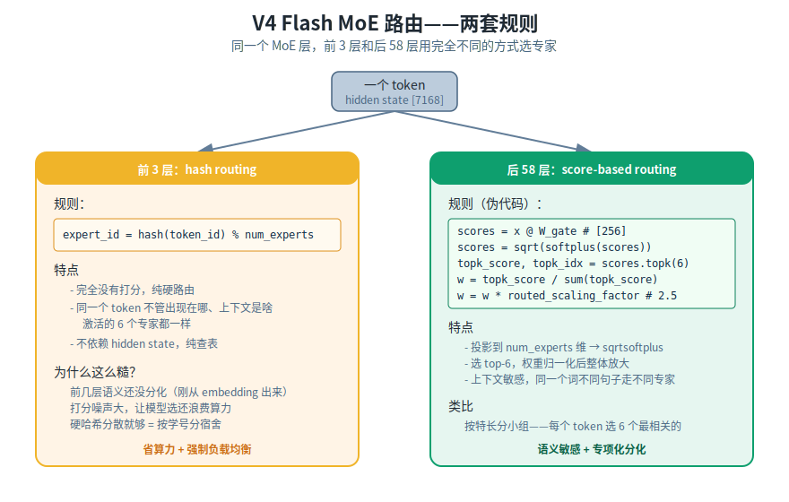
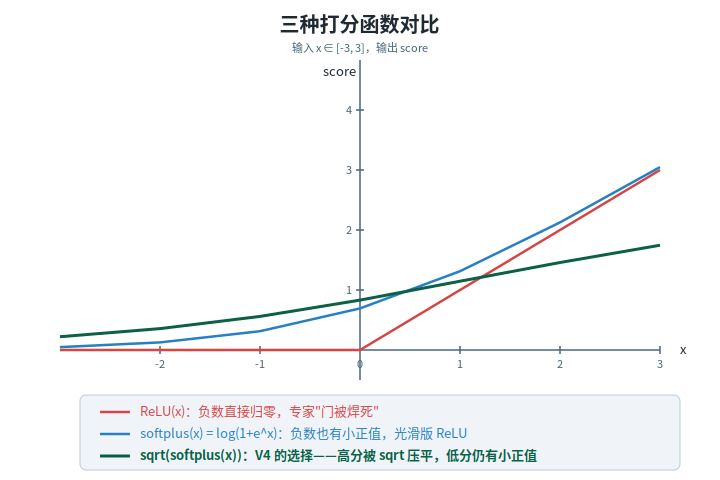

【在 50 系显卡上实现 DeepSeek V4 算子】MoE 路由——hash 前 3 层 vs sqrtsoftplus 后 58 层

━━━━━━━━━━━━━━━━━━━━

◆ 开头：换条线

━━━━━━━━━━━━━━━━━━━━

前 5 期讲的都是 attention 那条线——237 期 act_quant 量化、238 期 fp_gemm 矩阵乘、239 期 Indexer 选 top-k、240 期 sparse_attn 注意力本体、241 期 mHC Sinkhorn。今天切到 FFN 这条线，先讲 MoE 的入口：**路由**。

一个 token 怎么决定走哪 6 个专家？V4 有两套规则——前 3 层和后 58 层完全不同。

我自己看 V4 model.py 看了好几遍，每次看到"前 3 层 hash routing、后 58 层 sqrtsoftplus + top-6"那一段都会愣两秒——**hash 是真的纯 hash，连打分都不做**。这一期把这件事说清楚，顺便补一下 sqrtsoftplus 这个奇怪打分函数的来由。

━━━━━━━━━━━━━━━━━━━━

◆ 先把 MoE 是什么说清楚

━━━━━━━━━━━━━━━━━━━━

我们已经在第 33 期《DeepSeek MoE：671B 的噱头与 37B 的真相》（ https://mp.weixin.qq.com/s/SGAt3w3d1C3icAB3JbgDYw ）、第 158 期《Mega MoE 和 FP4 Indexer——V4 发布前的两记重拳》（ https://mp.weixin.qq.com/s/g4NH_rcXxx83pPrhN5OloQ ）讲过 MoE 的演化路径，这里只快速回顾基本结构。

MoE（Mixture of Experts，混合专家）做的事很朴素：

**一个 token 不走一个大 FFN，而是从一池子专家里挑几个小 FFN 来处理。**

V4 Flash 的具体数字：

| 项目 | V4 Flash | V4 Pro | 备注 |
|------|----------|--------|------|
| 路由专家数 | 256 | 384 | 池子里待选的专家 |
| 每 token 激活专家 | 6 | 6 | top-6 |
| 共享专家 | 1 | 1 | 所有 token 都走 |
| 专家中间维度 | 3072 | 3072 | SwiGLU 的内宽 |
| 路由打分函数 | sqrtsoftplus | sqrtsoftplus | sqrt(softplus(x)) |
| 前 3 层路由 | hash-based | hash-based | token ID 决定 |
| 其余路由 | score-based | score-based | 打分选 top-6 |
| 路由权重整体放大 | 2.5 | 2.5 | routed_scaling_factor |

V4 Flash 61 层全是 MoE 层，没有 dense FFN。每层 256 个路由专家加 1 个共享专家，每个 token 实际只过 7 个专家（6 + 1）——总参数巨大，激活参数很小，这就是 MoE "总量取胜、激活省钱"的逻辑。

为什么我们之前在第 76 期《心智的议会——MoE 孕育自我》里说 MoE 是自我意识的前体？因为**MoE 把"什么时候用谁"这件事显式化了**——路由机制本身就是一种内部仲裁。Dense FFN 没有这一步，所有方向同时发力；MoE 必须"先选再算"，稀疏选择性就在这一步出现。

但今天我们不谈那个，今天只谈技术：**这个"先选"具体怎么选**。

━━━━━━━━━━━━━━━━━━━━

◆ V4 路由的两套规则

━━━━━━━━━━━━━━━━━━━━

V4 一打开 model.py 就能看到一段奇怪的代码——MoE 路由的第一步先判断当前层号：

```python
if layer_id < 3:
    # 前 3 层：hash routing
    expert_ids = hash_route(token_ids)
else:
    # 后 58 层：score-based routing
    scores = x @ W_gate
    scores = torch.sqrt(F.softplus(scores))
    topk_score, topk_idx = scores.topk(6)
```

（这是按 169 期的描述写的伪代码，本仓库没复刻 model.py，路由细节按 V4 官方 model.py 走。）

前 3 层根本不打分，token ID 直接决定专家。后 58 层才是正经的打分路由。



下面分别讲。

━━━━━━━━━━━━━━━━━━━━

◆ 前 3 层：hash routing

━━━━━━━━━━━━━━━━━━━━

```python
# 前 3 层路由（伪代码）
expert_indices = hash_table[token_id]  # 长度 6 的固定查找
```

就这。**没有矩阵乘法，没有打分函数，没有 top-k**——纯查表。

hash 映射是预定义的查找表（实际是按 `token_id % num_experts` 加上一些散列保证均衡分布）。每个 token ID 对应固定的 6 个专家——**同一个 token 不管出现在哪个位置、什么上下文里，前 3 层激活的专家都一样**。

────────────────────

💡【打个比方】

hash routing = **按学号分宿舍**。学号 0001 永远住 101，学号 0002 永远住 102，不看你长什么样、不看你性格——就按学号分。

后面的 sqrtsoftplus routing 才是 **按特长分小组**。每个 token 拿出自己的"特长向量"，从 256 个小组里挑 6 个最匹配的。

────────────────────

【为什么前 3 层不打分？】

我第一遍看到这个设计的时候很困惑——既然有 router，干嘛不一直用？省那点算力有什么意义？

后来读 V4 报告才反应过来——**前几层的 hidden state 还没什么语义信息**。token 刚从 embedding 表里查出来，加上前两层注意力的微小变化，整个 hidden state 还停留在"字面"层面，没分化出"实体"、"动作"、"长程指代"这些可路由的语义。

这时候让一个 router 去打分，打出来的分数噪声非常大。**模型选了，但选得没意义**——既不是按语义，也不是按上下文，只是按一堆没有分化的特征做随机分配。

那不如直接放弃打分，**用 hash 强制做负载均衡**。

hash routing 的好处：

- **强制均衡**：256 个专家一定被均匀使用，不会出现"所有 token 涌向同一个专家"的崩溃
- **省算力**：不用算 `x @ W_gate`，不用过 sqrtsoftplus，不用 topk
- **训练稳定**：前几层的梯度信号最敏感，少一个可学习的 router 就少一个不稳定来源

代价是：前 3 层完全不利用语义来路由。但既然 hidden state 还没语义可用，这个"代价"是免费的。

**这是典型的"机制强度匹配问题复杂度"——简单层用简单规则。** 169 期讲全流程的时候我提过这个观察，V4 的设计哲学很一致：CSA/HCA 在短输入时退化为滑动窗口，hash routing 在前几层退化为查表——**该简单的地方就让它简单**。

━━━━━━━━━━━━━━━━━━━━

◆ 后 58 层：score-based routing

━━━━━━━━━━━━━━━━━━━━

第 4 层开始，hidden state 已经有足够的语义分化，可以正经打分了。流程分五步：

```python
# 第一步：投影到 num_experts 维
scores = x @ W_gate            # [7168] @ [7168, 256] → [256]

# 第二步：sqrtsoftplus 打分
scores = torch.sqrt(F.softplus(scores))   # softplus(x) = log(1+exp(x))

# 第三步：选 top-6
topk_score, topk_idx = scores.topk(6)     # 各 [6]

# 第四步：top-6 内部归一化
w = topk_score / topk_score.sum()         # 加起来 = 1

# 第五步：整体放大 routed_scaling_factor=2.5
w = w * 2.5
```

W_gate 是一个 `[7168, 256]` 的小矩阵，把 hidden state 投影到 256 维分数。**注意 W_gate 不带 bias、不过 softmax**——直接喂给 sqrtsoftplus。

────────────────────

【sqrtsoftplus 到底是什么】

V4 的打分函数定义：

`score = sqrt(softplus(x))`，其中 `softplus(x) = log(1 + exp(x))`

这个组合不是凭空来的，是替换 softmax 的精心设计。我们对比一下三种常见选择：



| 函数 | 形状特点 | 用在 router 里的问题 |
|------|----------|--------------------|
| softmax | 大分数指数放大，winner-take-all | 容易塌缩到少数专家，需要 aux loss 救场 |
| ReLU(x) | 负数直接归零 | 专家"门被焊死"，梯度回不去 |
| softplus(x) | 负数也有小正值，光滑版 ReLU | 高分一路涨到 +∞，分数差距还是太大 |
| **sqrt(softplus(x))** | 高分被 sqrt 压平，低分仍有小正值 | V4 的选择 |

sqrt 这一层在干嘛？**把高分压下来**。softplus 在 x=3 时输出 3.05，sqrt 之后变成 1.75；在 x=0 时输出 0.69，sqrt 之后变成 0.83。**高分被压扁，低分基本不变**——整个分数曲线的"陡峭度"变缓了。

softplus 这一层在干嘛？**让负数也有小正值**。softplus(-2) = 0.13，不是 0。这就保证了得分低的专家不会被完全切断，权重 sum 之后还有可能被选上一两个。

合起来，sqrt(softplus(x)) 的几何性质：

- **比 softmax 平缓**——不会塌缩到一个专家，不需要 aux loss 强行均衡
- **比 ReLU 多一个尾巴**——负数也有小正值，梯度不死
- **不归一化到概率分布**——单纯是个"重要度分数"，归一化交给后面的 top-k

第 169 期讲全流程的时候我把这个函数顺手提了一下，今天单独看才发现它真不是随便挑的——**它是为"top-k 选完之后再归一化"这个特定流程设计的**。如果直接用 softmax，top-6 之后再归一化等于做两遍归一化，会把分数信息抹平；用 sqrt(softplus) 保留原始的"分数比例"，归一化只发生一次。

────────────────────

【第四步、第五步：归一化加放大】

选完 top-6 之后，6 个分数加起来归一化到 1：

```python
w = topk_score / topk_score.sum()   # [w₁, w₂, w₃, w₄, w₅, w₆], sum=1
```

然后整体乘 `routed_scaling_factor = 2.5`：

```python
w = w * 2.5   # sum = 2.5
```

为什么要乘 2.5？**这是配 1 个共享专家用的**。后面合并的时候是 `output = shared + Σ wᵢ · expertᵢ`——共享专家固定权重 1，6 个路由专家加起来权重 2.5，**总信号强度大约是 dense FFN 的 3.5 倍**。这是 MoE 想要的："总量超过 dense，但单 token 算的量小"。

如果路由权重不放大，每个 token 实际只享受 1 个 shared + 0.x 量级的 routed，FFN 输出强度反而比 dense 弱。`routed_scaling_factor` 就是来纠正这个失衡的。

━━━━━━━━━━━━━━━━━━━━

◆ 共享专家：所有 token 都走的"公共专家"

━━━━━━━━━━━━━━━━━━━━

除了 top-6 的路由专家，每层还有 **1 个共享专家**：

```python
shared_output = SharedExpert(x)   # 每个 token 都过
```

结构和路由专家完全一样（SwiGLU FFN，7168→3072→7168），区别是**所有 token 都过它**，不参与路由打分。

共享专家在干嘛？**承担"通用知识"**。

想象一下：如果让 256 个专家把"所有知识"都瓜分掉，会出现一个尴尬现象——很多基础能力（比如"语法正确"、"语义连贯"、"一般推理")每个专家都得学一遍，因为不知道自己什么时候会被选中处理一个普通句子。这等于每个专家用 90% 的容量学通用知识，10% 的容量学专项化能力——**专家根本"专"不起来**。

把通用知识从 256 个专家里抽出来，单独放进一个"公共专家"，让所有 token 都过它。**剩下的 256 个路由专家就能放心做专项化分化**——一个专精"代码语法"、一个专精"长程指代"、一个专精"数学符号"……每个专家把自己的小领域吃透。

────────────────────

💡【打个比方】

共享专家 = **公共课老师**，所有学生都得上。教语文、教数学这种基础。

256 个路由专家 = **选修课老师**，每个学生根据兴趣选 6 节。教 GLSL 写法、教中古汉语、教蛋白质折叠——每个老师只懂一小块，但懂得很深。

如果没有公共课老师，每个选修课老师都得花一半精力先教学生识字——大家全都半瓶水。有了公共课，选修课才能真"专"。

────────────────────

━━━━━━━━━━━━━━━━━━━━

◆ 路由完之后：加权合并 + 接 mHC

━━━━━━━━━━━━━━━━━━━━

路由出来了 top-6 索引和权重，加上 1 个共享专家，最后合并成 MoE 输出：

```python
moe_out = shared_output                              # 共享专家，权重 1
for i in range(6):
    moe_out += w[i] * routed_expert[topk_idx[i]](x)  # 路由专家，权重 wᵢ
```

输出维度 `[7168]`，和输入一样。

注意一个细节：**MoE 这一层的输出还不能直接当残差**——它要先过 hc_post 走 mHC 流形超连接（241 期讲的 hc_split_sinkhorn），4 份残差路径动态混合之后才进入下一层。

也就是说一层完整的 FFN 段是这样：

```
hc_pre (4→1) → RMSNorm → MoE 路由 + 专家计算 + 合并 → hc_post (1→4)
                              ↑
                          就是今天讲的这一段
```

mHC 把"本层输出"和"4 条历史残差路径"按 Sinkhorn 约束动态混合，所以**路由出来的 MoE 输出不是简单地加回 x**——它是被 4 个动态权重重新分配到 4 条不同的残差路径上的。

这就是为什么我把 mHC 放在 FFN 之前先讲（241 期）——FFN 的输出怎么"接回去"，比 FFN 本身怎么算还重要。

━━━━━━━━━━━━━━━━━━━━

◆ 学习者复盘：为什么 V4 前 3 层用 hash？

━━━━━━━━━━━━━━━━━━━━

我以前看完就忘了——读到"前 3 层 hash"会以为是某种工程妥协，下次看又得重新想一遍。这次给自己整理三条记忆抓手：

**抓手一：hash 不是"路由的简化版"，是"路由的禁用版"。**

前 3 层根本没有任何"基于内容的选择"——token ID 决定一切，hidden state 完全不参与。这不是"打分但是用了简单的打分方式"，是"完全跳过打分"。把这点想清楚，hash routing 的存在就不奇怪了：**它根本不是 router，它是 token ID 直接控制专家分布的硬约束**。

**抓手二：什么时候该简单，由 hidden state 的语义成熟度决定。**

前几层 hidden state 还在"字面层"，没有可路由的语义信号；后面层 hidden state 已经分化出实体/动作/指代等可路由特征，才值得让 router 出场。**机制强度匹配问题复杂度**——和 169 期看到的"CSA/HCA 在短输入退化为滑动窗口"是同一个设计哲学。

**抓手三：sqrtsoftplus 不是替换 softmax，是替换"概率分布"这个抽象。**

router 不需要输出概率分布，router 需要输出"重要度分数"。sqrt(softplus(x)) 的设计目标就是给一个**平缓的、不归一化的、非负的**重要度分数，让 top-k 选完之后再做一次归一化。**两遍归一化的信息损耗，避免了**。

━━━━━━━━━━━━━━━━━━━━

◆ 下一期：SwiGLU 专家本体

━━━━━━━━━━━━━━━━━━━━

今天讲了 MoE 的入口——路由怎么选 6 个专家。但每个专家具体在做什么计算，还没说。

V4 Flash 每个专家是一个 SwiGLU FFN：

```python
gate = x @ W1    # [7168] @ [7168, 3072] → [3072]
up   = x @ W3    # [7168] @ [7168, 3072] → [3072]
hidden = SiLU(gate) * up
down = hidden @ W2   # [3072] @ [3072, 7168] → [7168]
```

`SiLU(gate) * up` 这一步是 SwiGLU 的核心，它和最早的 FFN（ReLU(x @ W1) @ W2）有什么本质区别？gate 这个分支是怎么从 GLU 演化来的？config.json 里那个 `swiglu_limit = 10.0` 又是为什么？

下一期 243 是这个系列的最后一期，专门讲 SwiGLU 专家本体。从最简单的 FFN 一路讲到 V4 用的版本，把 7 个零件全打通。

━━━━━━━━━━━━━━━━━━━━

【参考资料】

```
[1] DeepSeek V4 Technical Report (2026)
    https://huggingface.co/deepseek-ai/DeepSeek-V4-Pro/resolve/main/DeepSeek_V4.pdf

[2] DeepSeek V4-Flash config.json & inference/model.py
    https://huggingface.co/deepseek-ai/DeepSeek-V4-Flash

[3] Shazeer et al. (2017)
    Outrageously Large Neural Networks: The Sparsely-Gated Mixture-of-Experts Layer
    arXiv: 1701.06538

[4] Fedus et al. (2022)
    Switch Transformer: Scaling to Trillion Parameter Models with Simple and Efficient Sparsity
    arXiv: 2101.03961

[5] Dai et al. (2024)
    DeepSeekMoE: Towards Ultimate Expert Specialization in Mixture-of-Experts Language Models
    arXiv: 2401.06066
```

━━━━━━━━━━━━━━━━━━━━

**前 3 层 hash 是"禁用 router"，不是"简化 router"。**

**sqrtsoftplus 不是替换 softmax，是替换"概率分布"这个抽象。**

**共享专家承担通用知识，让 256 个路由专家专心做专项化分化。**

━━━━━━━━━━━━━━━━━━━━

// 靳岩岩的 AI 学习笔记 × Claude 的严谨 × Gemini 的浪漫
// 2026-07-02
