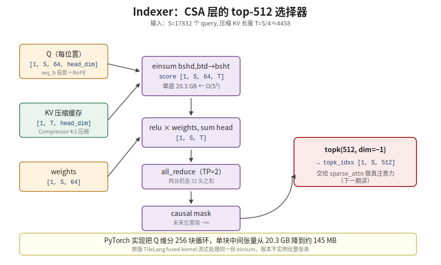

【在 50 系显卡上实现 DeepSeek V4 算子·第 3 站】Indexer——CSA 层怎么从 4:1 压缩里挑出 top-512

239 期（《量化的入口——act_quant 和 fp4_act_quant》 https://mp.weixin.qq.com/s/OozibTbTLlDiBhh57NOv0A ）讲了激活怎么量化，240 期（《算力的主力——fp8_gemm 和 fp4_gemm 怎么把 dequant 融进矩阵乘》 https://mp.weixin.qq.com/s/7ROESDoxhexsMWL9HVz8wA ）讲了 fp8_gemm/fp4_gemm 是怎么算 Q 和 KV 投影的。但 V4 的 CSA 层不是「算完 Q 和 KV 就直接 attention」——中间还有一道 Indexer，从 4:1 压缩的 KV 里挑出 top-512 个位置。今天就盯着 Indexer 这一站细看一遍。

━━━━━━━━━━━━━━━━━━━━

◆ 开篇：复盘里最容易漏掉的一站

━━━━━━━━━━━━━━━━━━━━

我们跟着 169 期《一个 token 的旅程——Deepseek V4 全流程总复习》（ https://mp.weixin.qq.com/s/mnbaXhQmQjDAyGD1dDdq5Q ）把 V4 全流程过了一遍。讲到 CSA 层时，知道有个叫 Indexer 的东西负责「先粗筛再精算」，从压缩 KV 里挑 top-512。

然后呢？

**然后就没了。** 写完那篇我合上文档，过两周再问自己「CSA 那个 Indexer 具体怎么工作的？」，脑子里只剩一句「Lightning Indexer，独立 Q/K 投影，全程 FP4，从压缩 KV 里选 top-512」——背得很顺，但不知道它到底**算了什么**。

直到这次在 50 系主机上实现 V4 推理，被一个 20.3 GB 的中间张量逼着回去看 `Indexer.forward` 怎么写的，才发现这一站根本不简单。它本身就是一个小型注意力，只是目的不一样而已。

今天这一篇专门把 Indexer 这一站再走一遍。先说清楚它在 V4 哪一步、它在算什么数学、它和真正的 attention 有什么关系；再看 PyTorch 里怎么写——为什么必须分块、和原版 TileLang 的差别在哪。

不讲 bug 排查故事，重点在「Indexer 这个算子到底长什么样」。

━━━━━━━━━━━━━━━━━━━━

◆ 第一节：先定位——Indexer 在 V4 的哪一步

━━━━━━━━━━━━━━━━━━━━

先看这个实验平台实际跑的 V4 Flash 的配置文件（`config.json` 的 `compress_ratios` 字段）——**43 层，每层一个压缩比，不是同一种注意力**：

```text
层 0:   ratio=0     不压缩，普通全量 attention（+ 滑动窗口）
层 1:   ratio=0     同上
层 2:   ratio=4     CSA   细压缩，Indexer 选 top-512
层 3:   ratio=128   HCA   粗压缩，全看
层 4:   ratio=4     CSA
层 5:   ratio=128   HCA
...
层 42:  ratio=4     CSA
```

开头 2 层不压缩，是最原始的全量 attention（配合滑动窗口）打底；从第 3 层（下标 2）开始，CSA（ratio=4）和 HCA（ratio=128）逐层交替，一直到最后一层（下标 42）收在 CSA。数过一遍：43 层里 21 层 CSA、20 层 HCA、2 层不压缩。HCA 和 CSA 用的是同一个 Compressor 模块——区别只在压缩比。**以本文后面实际跑的那次 prompt（S=17832）为例**：

| 层类型 | 压缩比 | 17832 条上下文压成几条 | 注意力看几条 |
|---|---|---|---|
| HCA | 128:1 | 17832 → 约 139 条 | 全看约 139 条 + 滑动窗口 128 |
| CSA | 4:1 | 17832 → 约 4458 条 | **Indexer 选 top-512** + 滑动窗口 128 |

HCA 压完只剩一百多条，少到根本不用筛——直接全算。CSA 压完还有四千多条，不挑出来精算不行——**这就是 Indexer 上场的地方**。

所以 Indexer 不出现在 HCA 层、也不出现在开头两层不压缩的 attention 里，只出现在 CSA 层；不出现在 attention 内部，出现在 attention **之前**。它解决的不是「怎么算 attention」，是「该看哪些 key」。

💡 打个比方：HCA 是把图书馆全部书压成 139 本摘要，你能从头读到尾；CSA 是压成 4458 本摘要，没法都读，得先有个图书管理员帮你挑出最相关的 512 本——Indexer 就是这个图书管理员。

────────────────────

◆ 第二节：数学定义——Indexer 在算什么

━━━━━━━━━━━━━━━━━━━━

把语义说清楚：给定当前 query 位置 s 和压缩 KV 序列（长度 T = S/4，随实际序列长度 S 变化，不是固定值——上一节表格里的 4458 就是这次实际跑的 S=17832 算出来的），Indexer 要为每个 s 输出 512 个整数——「这 T 条压缩 KV 里，第 s 个 query 应该关注哪 512 条」。

核心公式只有一行：

```text
score[b, s, h, t] = Σ_d  q[b, s, h, d] · kv[b, t, d]

# 等价 einsum 写法：
score = einsum("bshd,btd->bsht", q, kv_cache[:, :T])
```

`b` 是 batch，`s` 是 query 位置，`h` 是 head，`t` 是压缩 KV 位置，`d` 是 head_dim。

💡 常识科普

这里先补一点 V4 的背景知识，不然后面 `d` 的取值会显得突兀。V4 用的是 MLA（多头潜在注意力）——Q 不是从模型的隐藏维度（`hidden_size`=4096）直接投影出来的，中间多插了一层压缩：`hidden_size`（4096）先经 `wq_a` 压缩成 `q_lora_rank`（1024，一份共享的低秩表示），KV cache 里存的就是这个压缩后的 1024 维，省显存省带宽。真正要用的时候，再经 `wq_b` 把这 1024 维展开成实际计算要用的宽度。主路径 attention 和 Indexer 各自有一份独立的 `wq_b`，展开到的宽度不一样——主路径展开到 `64 head × 512 head_dim`（真正用来算 attention 输出，维度大是为了保留精度），Indexer 自己展开到 `64 head × 128 head_dim = 8192`（只用来打分排序，不需要还原精确数值，维度可以小很多）。所以接下来表里的 `index_n_heads`=64、`index_head_dim`=128，说的是 Indexer 自己这份独立展开出来的 Q，跟模型整体的 4096 维隐藏层没有直接的大小关系——8192 比 4096 大不奇怪，它是从压缩过的 1024 维展开出来的，展开到多宽是设计者自己定的。

用第五节实际跑的那次为例，把范围填进去：

| 下标 | 含义 | 这次实际取值 |
|---|---|---|
| `b` | batch，一次处理几条 prompt | 1 |
| `s` | query 在序列里的位置，取值范围 0~S-1 | S=17832，所以 s 有 17832 种取值 |
| `h` | Indexer 的 head 编号 | `index_n_heads`=64（TP=2 时单卡只算其中 32 个） |
| `t` | 压缩 KV 在 T 条里的位置，取值范围 0~T-1 | T=S/4≈4458，所以 t 有 4458 种取值 |
| `d` | 每个 head 的向量维度，公式里被 Σ 加总掉，不出现在输出里 | `index_head_dim`=128 |

所以 `score[b, s, h, t]` 完整展开的形状是 `[1, 17832, 64, 4458]`——第五节算出来的 20.3 GB 中间张量，就是这四个维度的取值范围直接相乘出来的。

💡 常识科普

"运算复杂度"说的是：这个公式要重复执行多少次乘加，跟着 s、t、d 这三个会变大的维度一起数——`d` 个乘法加起来是一次点积（`Σ_d`那一步），这一次点积要对每一对 `(s, t)` 都算一遍，一共有 `S × T` 对。所以总的乘加次数正比于 `S × T × D`（`h` 是并行的独立通道，只是把整件事重复 64 遍，不改变随 S 增长的那个"形状"）。

关键在于 `T` 本身也是 `S` 的函数——`T = S/4`。代入进去，`S × T × D = S × (S/4) × D`，正比于 `S²`。**这就是为什么大家说 attention（包括 Indexer 这种小型 attention）是 "O(S²) 复杂度"**：不是说公式里显式写了平方，是因为 K 的条数（这里是 T）本身就随 query 的条数（S）等比例增长，两个都在长，相乘就是平方关系。序列长度翻一倍，这一步要算的乘加次数变成四倍。

这就是 attention 里那个最经典的 Q · Kᵀ ——**Indexer 本质就是一个 attention**。

但它和主路径的 attention 有四个关键差别：

| 维度 | 主路径 attention | Indexer |
|---|---|---|
| Q 投影 | 走 wq_a → wq_b，high dim | 走 wq_b 之后再过 weights_proj，**低维** |
| K | 主路径 KV | **压缩 KV**（4:1 压缩过的 latent） |
| 精度 | FP8 / BF16 | **FP4** |
| 输出 | softmax 加权 V | **不算 softmax**，只打分排名 |

四个差别叠在一起，Indexer 算下来比主路径 attention **轻得多**——Q 维度低、K 条数压过、精度低、不用算 softmax 和 V 加权。它存在的唯一目的是**告诉主路径该看哪 512 条**，输出不是 hidden state，是 512 个整数索引。

打分完之后还要再做几件事：

```text
1.  score = relu(score) × weights        # weights 是 query 学出来的 head 权重
2.  score = score.sum(dim=head)          # 64 个头打的分加起来，得到 [b, s, t]
3.  all_reduce(score)                    # TP=2 时两台机器各算 32 头，求和合并
4.  score[future positions] = -∞         # causal mask，未来不能看
5.  topk_idxs = score.topk(512, dim=t)  # 选出每个 query 的 512 个最大值索引
```

第 1 步的 relu 是为了把负相关砍掉再加权；第 2 步把 64 个头的打分合成一个总分；第 3 步是分布式必做的 sum——TP=2 时两台机器各负责一半 head，要 sum 起来才是完整的「64 头之和」；第 4 步 mask 掉未来位置（prefill 阶段的因果约束）；第 5 步 topk 拿出最终的 512 个索引。

**最后吐出来的不是注意力的输出，是 `topk_idxs`，shape [1, S, 512] 的 int64 张量。** 这张表交给主路径的 sparse_attn 用——「query s 这一行只算这 512 个 key 位置」。

────────────────────

◆ 第三节：Indexer 是什么级别的算子

━━━━━━━━━━━━━━━━━━━━

把第二节那张对比表换个角度看——

主路径的 attention 是「**算**注意力」：用 score 加权求和 V，输出 hidden state，每个 query 位置贡献一个 d 维向量。

Indexer 是「**挑**注意力」：用 score 排序选出 top-512，输出整数索引，每个 query 位置贡献 512 个 int64。

数学上是同一个 Q·Kᵀ，但下游用法完全不同——一个走 softmax × V，一个走 topk。所以 Indexer 经常被叫做「先粗筛再精算」的**粗筛器**，或者**打分选 top-k 的小型 attention**。在 V4 论文里它的正式名字是 Lightning Indexer——`config.json` 里 `index_n_heads`、`index_topk`、`index_head_dim` 单独开了一套字段，和主路径 attention 的维度完全分开，这本身就说明它是个独立子系统。它精度用 FP4 是因为只需要排名不需要精确数值——**只要相对大小排得对，绝对值差点没关系**，所以能用最狠的低精度。

这里有个特别值得记的设计哲学：**对「打分排名」类操作用低精度，对「数值合成」类操作保留高精度。** Indexer 出 512 个索引，不在乎分数是 0.7 还是 0.71，在乎的是「这一条排第几」。FP4 在 16 个离散值里覆盖足够大的动态范围，排名结果几乎不变——这是低精度被允许进场的特殊语境。

顺带说一句和这套设计哲学正好对称的一个坑——**Indexer 选得准不准，取决于你要找的东西是不是和当前内容相关**。它靠 Q·Kᵀ 打分，本质是找语义邻居，那些和当前 query 内容正交的信息（比如一条格式约束、一条系统指令），Indexer 结构上就没有信号能指向它——不是精度不够漏选，是**打分机制从设计上就不覆盖"内容无关但重要"这一类东西**。这也是为什么长文本测评（MRCR 这类）分数能很高——因为测的都是「内容锚定」的键值召回，Indexer 的强项——但一条脱离上下文语义、只需要"始终生效"的约束，反而更容易在 CSA 层被路由绕开、在 HCA 层被池化稀释掉。挑 top-k 这件事，挑的是"像"，不是"该记住"。这不是纯推理——之前拿 V4 做过一次翻译任务，开头要求 **"一段英文一段中文"** 交替输出，长文本写到后半段这条格式指令就丢了，翻回去查才发现：指令本身还在，只是压缩层和 Indexer 都没有理由把它捞出来参与当前这几个 token 的计算。往后凡是"这条规则要从头管到尾，但内容上和当前在算的东西没关系"这类约束，在 CSA/HCA 这套架构上都要留个心眼——最稳的办法是在长输出中间隔一段就重复提醒一次，别指望它自己被"看见"。

━━━━━━━━━━━━━━━━━━━━

◆ 第四节：代码里 Indexer 怎么写

━━━━━━━━━━━━━━━━━━━━

我们 50 系主机上的实现在 `kernel_sm121.py` 的 `make_indexer_forward_chunked`，核心就是把 V4 Flash 原版 `inference/model.py` 的 `Indexer.forward` 改造一下。原版那行点睛代码是：

```python
index_score = torch.einsum("bshd,btd->bsht", q, kv_cache[:, :T])
```

整个 Indexer.forward 的骨架其实非常清爽，伪代码版长这样：

```python
def Indexer_forward(x, qr, start_pos, offset):
    T = (start_pos + seqlen) // ratio       # 压缩 KV 已有长度

    # 1. 准备 Q：低维投影 + RoPE
    q = wq_b(qr)                            # [1, S, n_heads, head_dim]
    apply_rotary_emb(q[..., -rd:])          # RoPE 只作用 rope 部分
    q = rotate_activation(q)

    # 2. 准备 KV：取压缩缓存
    kv = kv_cache[:1, :T]                   # [1, T, head_dim]

    # 3. 算 score = Q · Kᵀ —— 这一步是 O(S²)
    score = einsum("bshd,btd->bsht", q, kv) # [1, S, n_heads, T]

    # 4. relu × weights → sum over heads
    score = (relu(score) * weights[..., None]).sum(dim=head)  # [1, S, T]

    # 5. 分布式 sum（TP=2 时两台机器各算 32 头）
    if world_size > 1: all_reduce(score)

    # 6. causal mask
    score[future_positions] = -inf

    # 7. 选 top-512
    topk_idxs = score.topk(512, dim=-1)[1]
    return topk_idxs                        # [1, S, 512]
```

整个流程没有黑科技，每一步都是普通 PyTorch 操作。第 3 步那行 einsum **就是整个 Indexer 唯一的计算重头**——其他都是辅助。

但就是这一行 einsum，把 PyTorch 实现卡死了。

━━━━━━━━━━━━━━━━━━━━

◆ 第五节：为什么不分块就跑不动

━━━━━━━━━━━━━━━━━━━━

来算一下第 3 步那张 score 张量到底多大：

```text
shape = [1, S, n_heads, T]
     = [1, 17832, 64, 4458]
内存 = 1 × 17832 × 64 × 4458 × 4 bytes (float32)
     ≈ 20.3 GB
```

S=17832 是我们实际跑的 prompt 长度，n_heads=64 是 V4 Indexer 的总 head 数（TP=2 时单 rank 32 个），ratio=4 所以 T=S/4≈4458。**单层 Indexer 中间张量 20.3 GB。** 43 层里有 21 层是 CSA——还好这是中间张量，每层算完就释放，不是累积的。但单层就 20 GB，统一内存 128 GB 的机器跑两三次就爆。

S 再翻 7 倍到 131072（V4 论文给的最大上下文），单层就是 274 GB。这数字直接说明一件事：**这个 einsum 在大上下文下，根本不能实例化整张表。**

那 DeepSeek 原版怎么跑的？答案是 **TileLang fused kernel**——TileLang 把 einsum + relu + weights + sum_head 全部融在一个 GPU kernel 里，**按块流式处理**：每次只在芯片上算一小段 score，立刻乘以 weights、加到 head sum 上、释放掉，从来不在显存里完整出现过那张 [1, S, 64, T] 的表。这是 fused kernel 的标准玩法，和 FlashAttention 同源。

但我们 50 系主机（sm_121）没有 TileLang fallback——TileLang 内部用了 `tcgen05` 矩阵指令，这是数据中心 Blackwell（sm_100，服务 H100 后继、B100/B200 那代）的专属硬件指令，消费级 Blackwell（sm_120/121，包括 5090 和 DGX Spark）**从设计上就没有这条指令**，不是阉割，是压根不属于这一档产品线。所以 PyTorch 层必须自己解决「不要实例化整张 score 表」。

我们的处理方法很笨但很有效：**把 query 维分块循环。**

```python
INDEXER_CHUNK = 256

for s_start in range(0, seqlen, INDEXER_CHUNK):
    s_end = min(s_start + INDEXER_CHUNK, seqlen)
    q_chunk = q[:, s_start:s_end]                # [1, 256, n_heads, head_dim]

    # 单块 score：从 [1, S, 64, T] 缩到 [1, 256, 64, T]
    score_chunk = einsum("bshd,btd->bsht", q_chunk, kv)
    score_chunk = (relu(score_chunk) * w_chunk[..., None]).sum(dim=head)

    if world_size > 1: all_reduce(score_chunk)
    score_chunk[future] = -inf
    topk_idxs_full[:, s_start:s_end] = score_chunk.topk(512)[1]
```

中间张量从 `[1, S, 64, T]` 缩到 `[1, 256, 32, T]`（`T` 还是第二节那个压缩 KV 条数，T=S/4≈4458；TP=2 时单 rank 32 头），同上面那笔账：

```text
256 × 32 × 4458 × 4 bytes ≈ 145 MB / 块
```

20.3 GB 降到 145 MB，140 倍。语义和原版 einsum **完全等价**——分块是 query 维上的纯并行循环，每个 chunk 独立算完写回 `topk_idxs_full`，互不影响。

只有一个细节要小心：**`all_reduce` 是每块独立调用的**，TP=2 时两台机器必须用同样的 `INDEXER_CHUNK` 和同样的循环顺序，否则一台机器的第 1 块对上另一台机器的第 2 块，sum 出来就错位了。同一份代码同一个 max_seq_len，自动满足。



────────────────────

◆ 第六节：复盘——这一站到底教了我什么

━━━━━━━━━━━━━━━━━━━━

回过头看，Indexer 这一站之所以 169 期之后我立刻就忘，是因为它在抽象层级上**夹在两个更显眼的概念中间**：

- 往上是 CSA/HCA 层级（本期第一节讲的「压缩注意力」）——容易记
- 往下是 sparse_attn 的稀疏算子（下一期讲）——容易记
- 中间是 Indexer，**它既不是注意力的设计哲学也不是底层算子**，是一个「打分选 top-k 的中间件」——存在感最弱

但这次实现完之后，Indexer 在我脑子里被重新放进了一个清晰的位置——**它是 V4 长上下文优势的真正发动机**。HCA 靠 128:1 粗压缩省 99% 计算，但代价是分辨率低；CSA 想做细压缩（4:1）保住分辨率，又面临「条数还是太多」的问题——4458 条没法全算。是 Indexer 用一个轻量小 attention 把 4458 砍到 512，让 CSA 在「细压缩」和「能算得起」之间架了一座桥。

```text
HCA 路径：原始 17832 → Compressor 128:1 → 全看约 139 条
CSA 路径：原始 17832 → Compressor 4:1 → 4458 → Indexer top-512 → 主路径算
```

CSA 那条路上，**Compressor 负责降条数（4:1），Indexer 负责再降一道（4458 → 512）**——两道压缩串联，主路径才算得起。少了 Indexer，CSA 就是 4458 条全看，等于半残废。

代码层面也一样，**Indexer 自己只是几行 PyTorch**，但它身上挂着 V4 注意力最厚的那条计算链路：低维投影、RoPE、压缩 KV、FP4 排序、TP all_reduce、causal mask、topk。每一项单独看都不复杂，叠在一起就是 V4 长上下文的核心引擎。

顺带说一句和 Indexer 本身没直接关系、但属于「学习者复盘」的一笔——把 V4 原版 Indexer 这段 einsum 用 PyTorch 跑出来，**让我对「O(S²) 张量」这件事第一次有了体感**。以前看 attention 论文都说「O(N²) 复杂度」，知道是平方但不知道平方到底有多猛。S=17832 算下来 20.3 GB，S=131072 算下来 274 GB——同一个公式，S 翻 7 倍内存翻 13 倍。**这是 attention 之所以需要 FlashAttention / TileLang 这套黑科技的最根本原因**，不是「优化能跑得更快」，是「不优化根本跑不动」。

━━━━━━━━━━━━━━━━━━━━

◆ 第七节：选完 top-512 之后呢

━━━━━━━━━━━━━━━━━━━━

Indexer 的输出 `topk_idxs`，shape `[1, S, 512]`，里面装的是 int64 索引——「query s 这一行该关注 KV cache 的哪 512 个位置」。

接下来这张索引表会交给 `sparse_attn` 这个算子：

```python
o = sparse_attn(q, kv, attn_sink, topk_idxs, softmax_scale)
```

`sparse_attn` 负责按 `topk_idxs` 从 KV cache 里把那 512 条 K 和 V gather 出来，做真正的 Q·Kᵀ + softmax + 加权 V——但只在这 512 条上做，不是全 4458 条。这才是 CSA 层注意力**真正算输出**的地方。

但 `sparse_attn` 自己也不简单——它要处理 gather（按索引取 KV）、要处理 attn_sink（学习的 softmax 偏置）、要处理 `topk_idxs=-1` 的 invalid mask（短序列时不够 512 个有效位置），而且我们这版同样要面对「一次性 materialize 整段中间张量会爆内存」的问题——`kv_gathered [b, s, topk, d]` 在 S=17832 时同样要分块。

下一期就专门看 `sparse_attn`：拿到 Indexer 选出来的 512 个索引之后，CSA 层的注意力到底怎么算完最后这一步。

━━━━━━━━━━━━━━━━━━━━

◆ 收尾

━━━━━━━━━━━━━━━━━━━━

Indexer 不是注意力，是注意力之前的选择器——本质是一个小型 Q·Kᵀ，但目的是打分排名，不是加权求和。它是 V4 长上下文真正算得起的发动机：把 CSA 层的 4458 条压缩 KV 砍到 512，让细压缩这条路成立。

━━━━━━━━━━━━━━━━━━━━

【参考资料】

- 实验仓库：https://github.com/lmxxf/deepseek-v4-experimental-platform-on-dgx-spark ，`kernel_sm121.py`

━━━━━━━━━━━━━━━━━━━━

**「Indexer 不是注意力，是注意力之前的选择器——本质是小型 Q·Kᵀ，但目的是打分排名，不是加权求和。」**

**「把 CSA 层的 4458 条压缩 KV 砍到 512，让细压缩这条路成立——这是 V4 长上下文真正算得起的发动机。」**

━━━━━━━━━━━━━━━━━━━━

// 靳岩岩的 AI 学习笔记 × Claude 的严谨 × Gemini 的浪漫
// 2026-07-06
