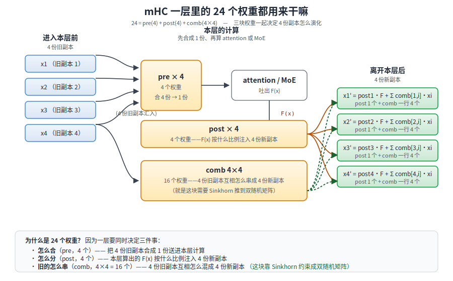
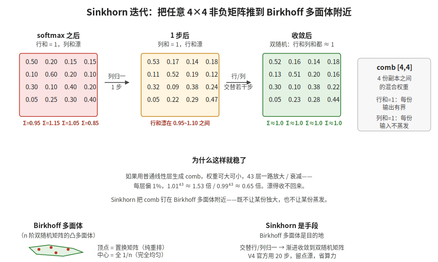

【在 50 系显卡上实现 DeepSeek V4 算子·第 5 站】mHC 出口的 Sinkhorn——4 份副本怎么调和

━━━━━━━━━━━━━━━━━━━━

◆ 开篇：attention 算完，还没完

━━━━━━━━━━━━━━━━━━━━

243 期《sparse_attn——选完 top-k 之后那一刀 attention 怎么落》（ https://mp.weixin.qq.com/s/X1FIW7H1WEmI4mAi6mYm_g ）把 sparse_attn 看完了。但 attention 算完之后还没结束——每层有 4 份残差流副本（mHC），attention 出口要把这 4 份调和回去。今天盯着 `hc_split_sinkhorn` 这一站细看一遍。

先重申一句本系列的老前提：**咱们全程盯着的是 V4 Flash 的推理过程**（43 层、64 头、hidden_size=4096），跟 169 期讲的 V4-Pro（61 层、128 头、hidden_size=7168）不是同一套数字，别混。今天这一站的机制两代都一样，但涉及"每层调用多少次"这类账本，走 Flash 的 43 层。

之前看 mHC 相关的 hc_pre 和 hc_post 时，对这一站其实是模模糊糊的：

- 知道 V4 把残差流分成 4 份
- 知道每一层都要先合 4→1、算完再展 1→4
- 知道有个 Sinkhorn 把混合权重"约束到稳定范围"

但具体 Sinkhorn 是怎么约束的、为什么非要它、5 步够不够，每次读都是飘过去的。今天就盯着 `kernel_sm121.py` 里 `hc_split_sinkhorn` 这 30 多行代码，把这一站过一遍。

💡 一句话回顾 mHC

**manifold Hyper-Connection**，流形超连接。DeepSeek V4 把残差流分成 4 份副本（`hc_mult = 4`），每份独立走 attention 和 FFN，每层出口处再用一个学到的混合矩阵把 4 份调和回去。比起标准残差 `h = h + F(x)` 只有"原值 + 增量"两条路，mHC 有 4 条路并行，每层都能学怎么混。这套设计我们早在 37 期《DeepSeek mHC：为什么"流形约束"是标题党》（ https://mp.weixin.qq.com/s/IMU__NKt_L41YeHKi7_A1g ）就拆过整体动机（前身是字节的 HC，DeepSeek 加了流形约束把信号增益从 3000 倍压到 1.6 倍）；169 期《一个 token 的旅程》（ https://mp.weixin.qq.com/s/mnbaXhQmQjDAyGD1dDdq5Q ）3.1 hc_pre / 3.4 hc_post 也走过一遍完整流程。今天只盯着"Sinkhorn 这一步怎么算"。

━━━━━━━━━━━━━━━━━━━━

◆ 第一节：先把这一站要算的三组量看清楚

━━━━━━━━━━━━━━━━━━━━

`hc_split_sinkhorn` 的签名很短：

```python
def hc_split_sinkhorn(
    mixes, hc_scale, hc_base,
    hc_mult=4, sinkhorn_iters=7, eps=1e-6,
):
```

三个入参先说清楚，别一上来就懵：

- **`mixes`**：这一层根据当前 hidden state 现算出来的"原始打分"——每次前向都在变。形状 `[b, s, 24]`，本层输入。**这个是变量**。
- **`hc_scale`、`hc_base`**：这一层专属的两个常量，训练时学好、推理时不动。形状很小：`hc_scale` 就 3 个数（分别管 pre/post/comb 三块的"混合温度"），`hc_base` 是 24 个数（和 `mixes` 最后一维一样宽，一一对应）。它们的作用是把 `mixes` 那份"原始打分"缩放和平移到合适区间，再送进 sigmoid/softmax。**这两个是常量**。
- 后面的 `hc_mult=4`、`sinkhorn_iters=7`、`eps` 都是超参，43 层通用。

再说几个反复出现的符号：

- `b`：batch，一次跑几条 prompt（V4 Flash 实际部署都是 1）
- `s`：当前 prompt 里的 query 位置数，比如上一期我们例子里的 17832
- `hc`（也写作 `hc_mult`）：残差流被拆成几份副本，V4 定死是 **4**
- `mix_hc`：`mixes` 张量最后一维的大小，等于 `(2 + hc) × hc = 24`——**合 4 个 + 分 4 个 + 混合 4×4 = 24**。

输入 `mixes [b, s, 24]` 是一组"混合 logits"——上一层根据当前 hidden state 学出来的、决定怎么混 4 份副本的原始打分。24 个权重都用来干嘛，一张图看清：



一层 mHC 出口要同时决定三件事——**怎么合**（pre，4 个）、**怎么分**（post，4 个）、**旧的怎么串**（comb，4×4 = 16 个）——加起来正好 24 个权重。对应到代码里就是这三块切片：

| 切片 | 形状 | 用途 |
|---|---|---|
| `pre  [b, s, 4]` | 4 个权重 | hc_pre：把 4 份副本合成 1 份送进 attention / MoE |
| `post [b, s, 4]` | 4 个权重 | hc_post：把本层输出 F(x) 按比例注入 4 份新副本 |
| `comb [b, s, 4, 4]` | 4×4 矩阵 | hc_post：4 份旧残差之间怎么互相混合 |

`pre` 和 `post` 都是长度 4 的向量，简单激活就够（sigmoid 之类）。**真正需要 Sinkhorn 加工的是 `comb` 这块 4×4 矩阵**——之前糊里糊涂以为整个 hc_split 都在做 Sinkhorn，今天看代码才发现，`pre`/`post` 走的是 sigmoid，只有 `comb` 进 Sinkhorn 这个加工车间。

DeepSeek 在 Hugging Face 上放出的官方推理代码（`inference/kernel.py` 里的 `hc_split_sinkhorn`）中，这三块各自的算法长这样：

先说下面伪代码里的两个新符号：

- **`flat`**：把 `mixes [b, s, 24]` 前两维压扁成 `[b×s, 24]`，让 (batch, position) 每一对都单独一行。这么做纯粹是为了让代码看起来干净——数学上每个 (b, s) 独立处理，怎么排列不影响结果。
- **大写 `SCALE`、`BASE`**：就是前面说的那两个常量，大写是为了一眼跟每次前向都变的中间张量区分开。`SCALE` 就 3 个数、都是 O(1) 数量级（大了 sigmoid 会饱和到 0/1，小了会贴近 0.5 变没区分度，训练完通常落在 0.1~5 之间）；`BASE` 24 个数，通常在 -2~+2 之间。精确数值得读磁盘上的权重才知道，我们盯着这一站看的是结构，不是具体数字。

```python
# pre：sigmoid，约束到 (0, 1)
pre_raw = flat[:, :hc] * SCALE[0] + BASE[:hc]
pre = torch.sigmoid(pre_raw) + eps

# post：2×sigmoid，约束到 (0, 2)，注意是 2 倍
post_raw = flat[:, hc:2*hc] * SCALE[1] + BASE[hc:2*hc]
post = 2 * torch.sigmoid(post_raw)

# comb：softmax 起手，再 Sinkhorn
comb_raw = flat[:, 2*hc:].view(n, hc, hc) * SCALE[2] + BASE[2*hc:].view(hc, hc)
comb = F.softmax(comb_raw, dim=-1) + eps
```

三块用同一个公式模板 `flat × SCALE + BASE`，只是切片位置和后面的激活函数不同——pre 走 sigmoid，post 走 2×sigmoid，comb 走 softmax 再 Sinkhorn。**43 层每层都独立存一套 `(SCALE, BASE)`**——相当于给每层一个"我这层想要多大胆地混"的旋钮，训练时拧好、推理时读死。

━━━━━━━━━━━━━━━━━━━━

◆ 第二节：comb 这块矩阵为什么非"双随机"不可

━━━━━━━━━━━━━━━━━━━━

把第一节的 `comb [4,4]` 单独拿出来。它的物理含义是：

```text
新 x_j = post_j × F(x) + Σ_i comb[j, i] × 旧 x_i
```

第 j 份新副本，从本层输出 F(x) 拿 `post_j` 那么多，再从旧 4 份按 `comb[j, *]` 这一行混。所以：

- **`comb` 的某一行**：决定第 j 份新副本怎么吸收旧 4 份的信息
- **`comb` 的某一列**：决定第 i 份旧副本被分散到几份新副本里去

如果只 softmax，**每行**和 = 1——保证每份新副本是凸组合，不会把某一行的总输入炸成 5 倍或缩成 0.2 倍。但**列**就放飞了：某一份旧副本可能被反复抄送到 4 份新副本里（列和 = 3），也可能没人理（列和 = 0.1）。

这就是 V4 不能光用 softmax 的原因。**43 层一路放大或衰减，4 份副本会塌成 1 份独大、3 份蒸发的状态**——多副本设计的意义就没了。

所以 `comb` 需要的是同时满足两个条件：

- 行和 = 1：每份新副本的输出有界
- 列和 = 1：每份旧副本的总贡献也守恒，不会某份被抄成 N 倍，也不会消失

这就是**双随机矩阵**（doubly stochastic matrix）。

💡【打个比方】4 个学生分别做题，结果要平均成一份最终答案，再发回 4 个学生当下一轮起点。如果用普通平均 `1/4 × (x₁ + x₂ + x₃ + x₄)`，4 个人完全等权——等于退化成 1 个人。如果让网络自己学权重不加约束，可能学成"全听学生 1 的，其他 3 个权重 = 0"——退化成 4 个独立个体里挑 1 个。**Sinkhorn 想要的是中间状态**：既能区分谁更靠谱（不强迫平均），又不让任何人一家独大、也不让任何人被无视（行列都归一）。

━━━━━━━━━━━━━━━━━━━━

◆ 第三节：Sinkhorn 迭代——交替归一直到稳

━━━━━━━━━━━━━━━━━━━━

先把上一节的账接一下，免得读起来断片。这个 4×4 的 comb 矩阵**不是训好死在权重里的固定表**，而是这样一路生成出来的：

```text
当前 token 的隐藏状态 [4096 维]
    │  线性投影 W_mix [4096 × 24]
    ▼
mixes [24 维]（其中最后 16 维专供 comb）
    │  × SCALE[2] + BASE[2×hc :]  再 reshape
    ▼
comb_raw [4×4]  ← 现算出来的原始打分
    │  softmax（每行归一）
    ▼
comb [4×4]  ← 每行和 = 1，但每列和还漂着
    │  Sinkhorn 迭代（就是本节要讲的这一步）
    ▼
comb_final [4×4]  ← 每行每列都 ≈ 1，落进合法家族
```

再说清楚每一步的投影维度：

- **W_mix**：`[4096 × 24]` 的可学习矩阵，每层一份。就是这个矩阵把 4096 维压成 24 维，其中 8 维给 pre/post、16 维给 comb
- **SCALE**：`[3]` 的可学习常量（三块各一个缩放）；**BASE**：`[24]` 的可学习常量（一一对应 24 维打分的偏移）——第一节里说过的那两位
- **softmax 起手**：单纯把 `comb_raw` 沿最后一维归一，让每行和 = 1，是 Sinkhorn 迭代的"预热"

所以本节讲的 Sinkhorn 迭代，**就是最后把这个现算出来的 4×4 矩阵，从"行守恒"推到"行列都守恒"的加工车间**。每来一个 token，这套流程走一遍——Sinkhorn 每次面对的都是新的 4×4 矩阵。

把一个任意非负矩阵推到双随机矩阵，最朴素的办法就是 **Sinkhorn 迭代**：交替对行和列做归一化。

```text
重复若干次:
    每一行除以行和  → 行和 = 1，列和漂
    每一列除以列和  → 列和 = 1，行和又漂一点
```

每次行归一，列和会被破坏一点；每次列归一，行和会被破坏一点。但破坏的幅度会越来越小——交替几次之后，行和与列和同时逼近 1。

这是个**收敛**过程，不是一步搞定。理论上：只要原矩阵每个元素都严格正，Sinkhorn 一定收敛到唯一的双随机矩阵。

代码里这一段写得很紧凑：

```python
# 起手列归一一次（softmax 已经保证行和=1，先把列拍下来）
col_sum = comb.sum(dim=-2, keepdim=True) + eps
comb = comb / col_sum

# 接下来交替 行→列 共 (sinkhorn_iters - 1) 轮
for _ in range(sinkhorn_iters - 1):
    row_sum = comb.sum(dim=-1, keepdim=True) + eps
    comb = comb / row_sum
    col_sum = comb.sum(dim=-2, keepdim=True) + eps
    comb = comb / col_sum
```

两个细节值得停一下：

**细节一：迭代次数官方给的是 20，我们改成了 5。** 官方 `inference/kernel.py` 里 `sinkhorn_iters` 默认是 20，我们盯着 4×4 矩阵这么小的规模看，20 步纯粹是浪费——所以在 sm121 fallback 里加了一行：

```python
sinkhorn_iters = min(sinkhorn_iters, 5)
```

对应仓库里的 commit 信息 `"sinkhorn 5iter"`。下面第四节展开为什么 5 步就够。

**细节二：起手是列归一，不是行归一。** 因为 `comb` 来自 `softmax(dim=-1)`，行和已经 = 1。如果起手再来一次行归一，相当于白做一步——直接把列拍下来更划算。所以代码里第一次只做列归一，后面 4 轮才是"行→列"完整交替。

5 步 = 1 次单独的列归一 + 4 次行/列交替，一共 9 次归一化操作。每次只是除以一个和，开销几乎可以忽略不计。

把整个过程画出来：



━━━━━━━━━━━━━━━━━━━━

◆ 第四节：为什么是 20 步——不多也不少

━━━━━━━━━━━━━━━━━━━━

理论上 Sinkhorn 需要无限步才严格收敛。V4 官方给的是 20 步，够用还有余量，但也没跑到收敛。为什么不无穷步？下面三条是我们盯着代码猜的，不保证对。

**猜测一，够稳就行。** 4×4 矩阵特别小，几何上 Sinkhorn 是指数收敛的，每多一步残差大约缩小一个数量级。从 softmax 起手（行和已经 = 1），几步之后行和列和的偏差就会在 1e-3 以下——跟网络其他地方的数值误差比小一两个量级，再 grind 边际收益太薄。

**猜测二，hc_split 调用次数太多。** 每一层 attention 出口要调一次、MoE 出口要调一次，全网 43 层 × 2 次 ≈ 86 次。每个 token 都要走这条路。多迭代一次看上去无害，乘以 86 就是几十上百次额外的归一化操作，还要算上反向传播的图。能省就省。

**猜测三，留点漂反而是好事。** 如果 Sinkhorn 一直迭代到严格双随机，comb 就被硬压在 Birkhoff 多面体的表面上；留几步、保留一点点偏差，相当于给模型留了一点"稍微偏离双随机"的自由度——某一层可以学着让某份副本的贡献比另一份多几个百分点。**这条最玄，也最像我们的读心而非事实**：官方没这么解释过，但按 V4 其他地方"约束不拧死"的一贯口味推测，是可能的动机。

不管猜的对不对，这一步的味道跟 V4 整体设计风格是一致的：**该用几何约束的地方上几何约束，但不要拧太死，留一点训练时可调的余地**。

━━━━━━━━━━━━━━━━━━━━

◆ 第五节：学出来的到底是什么，Birkhoff 又是什么

━━━━━━━━━━━━━━━━━━━━

到这里可能读者会有个疑问：**训练完之后，V4 学到的 comb 矩阵到底是什么样子？固定不变的一张表？**

不是。这个地方特别容易搞混，讲清楚一次。

V4 训练完之后，每一层的 `SCALE`、`BASE` 常量是死的。但每次前向传播时，comb 矩阵是**根据当前 token 的隐藏状态现算出来**的——同一层网络，不同的 token 进来，算出的 comb 长得完全不一样。

举个例子。同一层，当输入是"苹果"这个 token 时，可能算出的 comb 是：

```text
0.7  0.1  0.1  0.1
0.1  0.7  0.1  0.1
0.1  0.1  0.7  0.1
0.1  0.1  0.1  0.7
```

（接近单位矩阵——"这个 token 让 4 份副本各自独立，别乱串"）

当输入是"因为"这个 token 时，同一层可能算出：

```text
0.3  0.3  0.2  0.2
0.3  0.2  0.3  0.2
0.2  0.3  0.2  0.3
0.2  0.2  0.3  0.3
```

（接近均匀——"这个 token 需要把 4 条思路强烈混起来"）

**所以"学出来的权重"其实不是那个 4×4 矩阵，是"该怎么根据当前 token 现算出一个 4×4 矩阵"的规则**。规则训完就固定了，矩阵是每 token 现场生成的。

那 Birkhoff 多面体和 Sinkhorn 是干嘛的？

**Sinkhorn 的作用：不管上面那个"规则"根据当前 token 算出什么样的 4×4，最后都要过一遍强制的调整——每行加起来必须 = 1，每列加起来也必须 = 1**。这就叫**双随机矩阵**。所有满足这个条件的 4×4 矩阵，数学家把它们凑起来起了个名字叫 **Birkhoff 多面体**——本质就是**合法 comb 矩阵的家族**。你可以完全忘掉"多面体"这个词，记住这一个短语就行。

💡 打个比方

四家银行之间做转账。**不加约束**：钱可以凭空生出来（A 银行给 B 转了 100，B 收到 300），也可以凭空消失（A 转了 100，B 收到 50）。**Birkhoff 约束**：所有转账必须"转出总和 = 转入总和"，钱既不能生也不能没。至于"哪家转多少给哪家"，银行自己根据情况现场决定——**但守恒是死的，不许违反**。

Birkhoff 多面体的全部含义，就是**总量守恒**这个死规矩。凸多面体、置换矩阵、Birkhoff-von Neumann 定理那些数学名词，只是给数学家讲话方便的名字，你可以跳过。

**为什么非得强制列和 = 1？** 举个反例最直观。假设不加这个约束，某一层学出了：

```text
0.7  0.7  0.7  0.7
0.1  0.1  0.1  0.1
0.1  0.1  0.1  0.1
0.1  0.1  0.1  0.1
```

每行加起来是 1（合法），但**每一列都是 (0.7, 0.1, 0.1, 0.1)**——意思是**不管是新副本 1、2、3、4，它们都主要吸收旧副本 1 的内容**。旧副本 2、3、4 各自贡献 0.1，四份加起来也只有 0.4——**这就是旧副本 1 被反复抄送到 4 份新副本、旧副本 2/3/4 大部分蒸发**。叠 43 层这么干，旧副本 2/3/4 就彻底消失了。

Sinkhorn 强制列和 = 1，就是拦这个。**任何一份旧副本被吸收的总量不能超过 1，也不能低于 1**——相当于给每份旧副本装了个"总配额守恒"。

**总结**——

- **学出来的规则**：每层的 `SCALE`、`BASE` 常量决定了"如何根据当前 token 算出 comb"
- **Birkhoff 多面体**：约束的合法区，规定 comb 必须行守恒 + 列守恒
- **Sinkhorn**：把规则算出来的 comb 强制推进合法区的动作

**规则怎么想都行，但挑出来的矩阵必须落在合法区里**——mHC 的整个几何约束的意思，就这一句话。

顺带说一句 170 期《Deepseek 的流形约束——一个 token 从球面滑到单纯形的旅程》（ https://mp.weixin.qq.com/s/ozog4BkollQAc7wzUkME0g ）里讲过 softmax 把权重推到概率单纯形（就一条守恒律：加起来 = 1）上，本期这一站是同一套哲学的升级版：**从一条守恒律升级到行、列两条守恒律**。几何形状复杂了一点，但约束的味道完全一样。

━━━━━━━━━━━━━━━━━━━━

◆ 第六节：hc_split 在 V4 里哪些地方用

━━━━━━━━━━━━━━━━━━━━

把视野放大到全局：

| 调用位置 | 用途 | 频率 |
|---|---|---|
| 每一层 attention 出口 | hc_pre 进 attention 前算好 pre/post/comb，attention 算完后 hc_post 用 post 和 comb 展回 4 份 | 43 次 |
| 每一层 MoE FFN 出口 | 同上，FFN 出来后再走一遍 hc_pre/hc_post | 43 次 |
| 最终 hc_head（4 份 → 1 份） | 模型最后吐出 logits 前，把 4 份合成 1 份。这一步用的是 sigmoid 门控不是 Sinkhorn，但思想同源——把 4 份调和回 1 份 | 1 次 |

合计每个 token 走 `hc_split_sinkhorn` 大约 86~87 次。所以这个函数虽然代码只有 30 行，但放在 V4 推理的热路径上——出现频率不低。

好在这一站算得很轻，`kernel_sm121.py` 没做特别花哨的 Triton 融合，纯 PyTorch 算子已经够快：

- `softmax` 是单层 fused kernel
- 几次 `sum / div` 全是 elementwise，HBM 流量很小
- 4×4 矩阵小到 L1 都装得下，根本不会卡访存

所以这一站不像 sparse_attn 那样需要小心翼翼优化，纯 PyTorch 就过了——但**正确性必须 bit-exact**。起手做行归一而不是列归一，会和原版差一个数量级——这一条我们也验过。如果哪天精度上出现漂移，第一步就是把 5 放回 20。

━━━━━━━━━━━━━━━━━━━━

◆ 第七节：今天的复盘——这一站我之前漏看了什么

━━━━━━━━━━━━━━━━━━━━

回看之前对 mHC 那一节的笔记，有几处当时模糊、今天才补上：

**第一，把 `hc_split` 当成一整块黑盒了。** 之前以为整个 hc_split 都在做 Sinkhorn 约束，其实只有 `comb [4,4]` 这一块进 Sinkhorn 加工车间。`pre [4]` 和 `post [4]` 走的是简单的 sigmoid——一个 (0,1)，一个 (0,2)。**真正需要"双随机"约束的只是 4 份副本之间的混合矩阵**，读出权重和注入权重不需要。

**第二，Sinkhorn 不是 Sinkhorn 矩阵。** 之前一直把"Sinkhorn"和"双随机矩阵"在脑子里画等号。其实 Sinkhorn 是 1964 年 Richard Sinkhorn 提出的**迭代算法**——把非负矩阵推到双随机矩阵。目标空间叫 Birkhoff 多面体（这个名字来自 Garrett Birkhoff），算法叫 Sinkhorn 迭代。**前者是地，后者是路**。术语别再混了。

**第三，5 步不是"约束"，是"工程妥协"。** Sinkhorn 严格收敛要无穷步，能少算就少算，够稳就行——顺带给模型留一点不严格守双随机的自由度（这层是我们的推测，见第四节）。约束不拧到极限、留余地，这个味道跟 V4 其他地方一脉相承。

**第四，Birkhoff 多面体的局限。** 非负约束意味着 `comb` 不能为负——4 份副本只能做正加权平均，不能做"减法"。如果某一层希望"用第 2 份去抵消第 1 份的某些分量"，Birkhoff 多面体不允许。是否换成谱范数球面之类约束会更强？我们不知道，DeepSeek 也没试过（至少没公开）——这是留给后人的开放问题。

━━━━━━━━━━━━━━━━━━━━

◆ 收尾：调和不是平均

━━━━━━━━━━━━━━━━━━━━

mHC 这套设计回过头看，最优雅的一点是它**显式承认"调和"和"平均"是两件事**。

如果完全独立训 4 份副本，它会塌成 4 个独立 head——没有"4 份并行"的意义，反而要 4 倍存储。如果完全平均回去，又退化成单残差流，4 份和 1 份没区别。

**Sinkhorn 让 4 份"半独立"——既保留差异，又强制均衡。**

这其实是 V4 整套设计哲学的微缩版：MoE 也是这个味道（专家分工 + 路由均衡），sparse_attn 也是这个味道（topk 选择 + 全局信号汇合）。哪都不撒手，但哪都不拧死。

下一期讲 MoE 路由——那一站又是另一个味道的"既要分工又要均衡"。今天的 Sinkhorn 是显式几何约束，MoE 那边是辅助损失函数 + 选择策略组合出来的工程方案。同样的两难，不一样的走法。

━━━━━━━━━━━━━━━━━━━━

【参考资料】

- Sinkhorn, R. (1964). *A relationship between arbitrary positive matrices and doubly stochastic matrices*. Annals of Mathematical Statistics.
- Birkhoff, G. (1946). *Three observations on linear algebra*. Univ. Nac. Tucumán Rev. Ser. A.
- 实验仓库：https://github.com/lmxxf/deepseek-v4-experimental-platform-on-dgx-spark ，`kernel_sm121.py`

━━━━━━━━━━━━━━━━━━━━

**Sinkhorn 是手段，Birkhoff 多面体是目的地——一个是动作，一个是空间。**

**调和不是平均，平均是调和的退化版。**

**V4 这一站短得让我之前一直滑过去——30 行代码里藏着双随机矩阵、Birkhoff 多面体、43 层稳定性，三个层面叠在一起。**

━━━━━━━━━━━━━━━━━━━━

// 靳岩岩的 AI 学习笔记 × Claude 的严谨 × Gemini 的浪漫
// 2026-07-08
