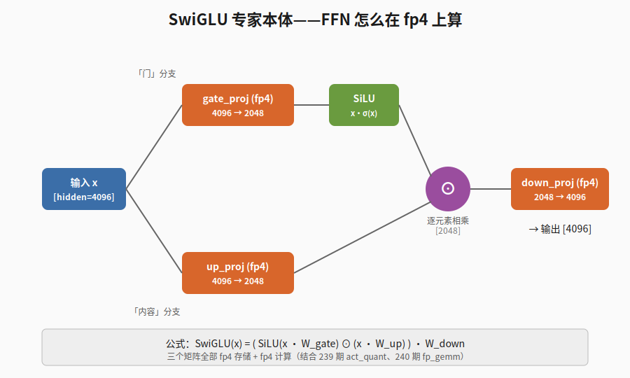

【在 50 系显卡上实现 DeepSeek V4 算子·第 7 站·收官】SwiGLU 专家本体——FFN 怎么在 fp4 上算

━━━━━━━━━━━━━━━━━━━━

◆ 开篇：最后一站

━━━━━━━━━━━━━━━━━━━━

246 期《MoE 路由——前 3 层查表，后 40 层打分》（【链接待补：246】）讲了路由怎么选出 top-6 专家。选完之后呢？6 个路由专家加 1 个共享专家，7 次 FFN forward。每个专家里面是什么？SwiGLU。

今天作为这个系列的收官，盯着专家本体看一遍。

老前提最后重申一次：**全程 V4 Flash 的数字**（43 层、hidden_size=4096），V4-Pro 的参数在 169 期《一个 token 的旅程》（ https://mp.weixin.qq.com/s/mnbaXhQmQjDAyGD1dDdq5Q ）里，别混。

说实话，**SwiGLU 这个公式我背得出来**——`SiLU(gate) ⊙ up`，三个矩阵乘法夹一个逐元素相乘——**但每次看 V4 我还是要回去查一遍**。原因有两个：一是 gate 和 up 哪个过激活、哪个不过，过几天就忘；二是 V4 的"中间维度"和我印象里 dense 模型的"中间维度是 hidden 的 4 倍"对不上，每次都得重新校准。这一篇把这两个点钉死，顺便把整个系列收个尾。

━━━━━━━━━━━━━━━━━━━━

◆ 一、专家长啥样：拿 V4 Flash 的数字摆出来

━━━━━━━━━━━━━━━━━━━━

先把关键参数列出来（全部来自官方 config.json）：

| 参数 | 值 | 说明 |
|------|-----|------|
| hidden_size | 4096 | 残差流维度 |
| moe_intermediate_size | 2048 | 每个专家的中间维度 |
| n_routed_experts | 256 | 路由专家总数 |
| n_shared_experts | 1 | 共享专家个数 |
| 每 token 激活 | 6 | top-6 |
| 激活函数 | SiLU | 也叫 swish |
| swiglu_limit | 10.0 | 乘法前的安全截断，第五节讲 |
| 权重精度 | fp4 | gate / up / down 三个矩阵 |

一个 V4 路由专家就是一个标准 SwiGLU FFN，三个矩阵：

```text
输入 x:  [4096]                                   一个 token 的残差流

gate = x @ W_gate    # [4096] @ [4096, 2048] -> [2048]   「门」分支
up   = x @ W_up      # [4096] @ [4096, 2048] -> [2048]   「内容」分支
hidden = SiLU(gate) ⊙ up                       # [2048]   逐元素相乘
out  = hidden @ W_down  # [2048] @ [2048, 4096] -> [4096] 投回残差流
```

三个矩阵乘法，夹一个逐元素相乘。形状变化只有两步：4096 → 2048 → 4096，先压再扩。

注意一个细节——**单个专家的中间维度 2048 比 hidden 4096 还小**。这和你印象里 LLaMA / Qwen 那种 dense 模型完全不一样（dense FFN 的中间维度通常是 hidden 的 4 倍上下，比如 LLaMA-3-8B 的 hidden=4096、intermediate=14336）。MoE 不是"把一个大 FFN 切成小块"，是**总量远大于 dense，但每个 token 只激活一小部分**。第六节会单独算这笔账。

━━━━━━━━━━━━━━━━━━━━

◆ 二、SwiGLU 是什么——Swish-Gated Linear Unit

━━━━━━━━━━━━━━━━━━━━

把名字分析一下就是它的本体：

- **Swish** —— 激活函数：swish(x) = x · σ(x)，σ 是 sigmoid。在 LLM 圈也叫 SiLU（Sigmoid Linear Unit），两个名字同一个东西。
- **Gated** —— 门控：FFN 不是一路投影完事，而是分成两路——一路过激活函数当「门」（gate），一路保持线性当「内容」（up），两路逐元素相乘。
- **Linear Unit** —— 名字保留 GLU 家族的传统称呼（GLU = Gated Linear Unit，2017 年 Dauphin 论文里的 sigmoid 版本），SwiGLU 是把 GLU 的 sigmoid 换成 swish。

写成公式：

```text
GLU(x)    = sigmoid(x @ W_gate) ⊙ (x @ W_up)
SwiGLU(x) = SiLU(x @ W_gate)    ⊙ (x @ W_up)

完整 FFN：
FFN(x)    = ( SiLU(x @ W_gate) ⊙ (x @ W_up) ) @ W_down
```

────────────────────

💡 打个比方

把 SwiGLU 想成**一个有调音台的混音器**：

- 麦克风进来一路声音（这是 x）
- 调音台把它劈成两路：一路过滤波器（gate 分支，过 SiLU 后大体是 0~1 之间的"音量旋钮"——严格说 SiLU 输出可以略小于 0，但大头落在 0~1）；另一路保留原声（up 分支，线性投影后是"音乐内容"）
- 旋钮乘内容——某个频段的旋钮关到 0，那个频段的内容就被静音；旋钮开到 0.8，原声打八折通过
- 最后 down_proj 合到一起送出去

ReLU 是"一刀切"——小于 0 直接哑火；SiLU 是"软切"——小于 0 也保留一点点尾巴，在 0 附近平滑过渡。**比 ReLU 平滑（梯度好传），比 GELU 算得快（GELU 要 erf 或 tanh 近似），效果还不差，所以变成了现代 LLM 的事实标准。** LLaMA、Qwen、DeepSeek 全用 SwiGLU。

────────────────────

⚠️ 顺便钉死一个常错的细节

**两路投影里，gate 那一路过 SiLU，up 那一路不过。** 我每次记反的概率大约一半——直到想清楚命名逻辑：

- "gate"——「门」，门当然要做激活——开还是关
- "up"——「向上扩张」，扩张的是内容，内容不需要被激活函数捏一下

这么记就不会反。

━━━━━━━━━━━━━━━━━━━━

◆ 三、整张流程图

━━━━━━━━━━━━━━━━━━━━



一个 token 从左边进入，劈两路，gate 过 SiLU，up 直通，逐元素乘合并，最后 down_proj 投回 hidden。三个橙色框都是 fp4 矩阵。

━━━━━━━━━━━━━━━━━━━━

◆ 四、共享专家：结构一模一样

━━━━━━━━━━━━━━━━━━━━

上一期讲过共享专家为什么存在（公共课老师，把通用知识从 256 个选修课老师手里抽出来）。这里只补结构上的一句话：**共享专家和路由专家是同一个 Expert 类、同一组尺寸**——官方 model.py 里两者都是 `Expert(dim=4096, moe_inter_dim=2048)`，连 swiglu_limit 都共用。没有任何特殊化，区别只有一个：它不参与路由，每个 token 都过。

合并公式（接上一期的路由结果）：

```text
moe_out = SharedExpert(x)                        # 权重固定 1
        + Σ_{i ∈ top6}  wᵢ · RoutedExpert_i(x)   # wᵢ 归一化后 ×1.5，六个加起来 1.5
```

用程序员的话说，共享专家 = **把公共子表达式提取出来**——把循环里不变的计算挪出循环，是同一个思路。

━━━━━━━━━━━━━━━━━━━━

◆ 五、fp4 怎么用在专家上

━━━━━━━━━━━━━━━━━━━━

到这里就接回系列前几站的主线了。专家本体不复杂，**真正的工程难点是这三个矩阵全部用 fp4**。

回顾一下最早的两站：

- **239 期 act_quant** —— 把激活值 x（bf16）按块量化成 fp4：每块取 absmax 当 scale，clamp 到 fp4 表示范围再 cast。一个 fp4 数只有 4 bit（E2M1：2 位指数 1 位尾数 1 位符号），能表示的最大值约 ±6。
- **240 期 fp_gemm** —— Triton 的 `tl.dot_scaled` 在硬件层把"fp8 激活 × fp4 权重"算成 fp32 累加，比手动把 fp4 解包成 fp16 再算快好几倍。

把这两块拼到 SwiGLU 上（顺序按官方 model.py）：

```text
1. x_q, x_scale = act_quant(x)                 # 239 期：量化激活
2. gate = fp_gemm(x_q, W_gate_fp4, scales...)  # 240 期：fp4 矩阵乘
3. up   = fp_gemm(x_q, W_up_fp4,   scales...)
4. gate = clamp(gate, max=10)                  # 只截上限
5. up   = clamp(up, -10, 10)                   # 双侧截断
6. hidden = SiLU(gate) * up                    # 这一步保持高精度
7. h_q, h_scale = act_quant(hidden)
8. out  = fp_gemm(h_q, W_down_fp4, scales...)
```

注意第 4、5 步的 clamp——**这就是 config 里那个 swiglu_limit=10.0，fp4 时代专门加的工程保护**。fp4 表示范围窄，如果 gate 或 up 冒出极端大的值，逐元素乘之后 hidden 会爆掉，下一轮 act_quant 算 absmax 就被一个离群值带跑，整块的有效精度全部丢光。所以在乘法之前先把两路各自截到安全范围。细看还能看出分工：gate 只截上限（SiLU 对很负的输入本来就输出趋近 0，下界不用管），up 双侧都截（它是线性直通的，两头都可能跑飞）。这和注意力那边的各种截断是同一个思路：**精度越低的地方，越要在乘法发生之前把分布约束住**。

────────────────────

💡 打个比方

fp4 就像**用三位整数（0~999）来记账**——日常没问题，但记账之前你得确认每一笔金额都"在量级内"。要是突然冒一笔一千万，三位数装不下，你得先把这笔金额按"千万为单位"重新缩放——这个"重新缩放"就是 scale；clamp 就是事先约定"任何一笔金额不许超过 999"。

────────────────────

**为什么专家用 fp4 用得最激进？**

- **权重占大头**：256 个专家 × 43 层，MoE 专家加起来占整个模型参数量的绝对大头
- **省一半 = 装得下和装不下的区别**：这个模型 fp8 权重约 300GB，两台 DGX Spark 的 256GB 统一内存装不下；fp4 一压约 148GB，刚好塞进去。**fp4 不是优化选项，是能不能跑的前提**——实验平台第一周就在这上面撞过墙：本想先走 fp8 路线"跑通再说"，发现根本装不下，只能把全部 kernel 换成 fp4 版本

attention 那边的投影矩阵反而没这么激进——它们本来就被 MLA 那套低秩压缩瘦过身，参数占比小，再省一倍收益不大。**量化的火力，永远优先对准参数最肥的地方。**

━━━━━━━━━━━━━━━━━━━━

◆ 六、每 token 实际算几个专家——一笔反直觉的账

━━━━━━━━━━━━━━━━━━━━

V4 Flash 每个 token 要算的 FFN 数：

```text
top-6 路由专家 + 1 共享专家 = 7 个 SwiGLU forward
```

**7 倍于 dense 模型**（dense 每个 token 只算 1 个 FFN）。听起来很贵——但每个专家很小。单 token 走一个专家的乘加次数（MAC）：

```text
gate:  4096 × 2048 ≈ 8.4M
up:    4096 × 2048 ≈ 8.4M
down:  2048 × 4096 ≈ 8.4M
合计：约 25M MAC / 专家
```

7 个专家：约 **176M MAC / token**。

对比一个传统 dense FFN（LLaMA-3-8B：hidden=4096，intermediate=14336）：

```text
gate:  4096 × 14336 ≈ 58.7M
up:    4096 × 14336 ≈ 58.7M
down:  14336 × 4096 ≈ 58.7M
合计：约 176M MAC / token
```

**两边几乎一模一样。** MoE 比 dense 多算了 7 次 FFN，但每次瘦了 7 倍——FLOPs 上没占便宜也没吃亏。

那 MoE 赢在哪？赢在**参数量**：256 个专家的总参数是"单个同算力 dense FFN"的几十倍。每个 token 花同样的算力，但模型能记的东西多得多——256 个专家分头学 256 种语义模式，每来一个 token，router 挑最对口的 6 个出力。**dense 模型让同一个 FFN 处理所有事，MoE 让 token 自己选最懂它的那几个。**

这就是 MoE 的核心账：**算力打平，参数翻几十倍**。33 期讲 V3 时那句"671B 总参数 / 37B 激活"（ https://mp.weixin.qq.com/s/SGAt3w3d1C3icAB3JbgDYw ），翻译过来就是这笔账。

━━━━━━━━━━━━━━━━━━━━

◆ 七、伪代码——把一层 MoE FFN 串起来

━━━━━━━━━━━━━━━━━━━━

把上一期的路由和今天的专家本体拼一起，一层 MoE FFN 的完整流程：

```python
def moe_ffn_layer(x, layer_id):
    # ---- Step 1: 路由（246 期）----
    scores = sqrtsoftplus(x @ W_router)       # [4096] @ [4096, 256] -> [256]
    if layer_id < 3:
        top6_idx = tid2eid[token_id]          # 前 3 层：查表选人 -> [6]
    else:
        top6_idx = topk(scores + bias, 6)     # 后 40 层：加 bias 的分数选人 -> [6]
    w = scores.gather(top6_idx)               # 发钱用原始分数 -> [6]
    w = w / w.sum() * 1.5                     # 归一化 + routed_scaling_factor

    # ---- Step 2: 共享专家（每个 token 都过）----
    out = swiglu_expert(x, W_shared)          # 权重 1

    # ---- Step 3: 路由专家（每个 token 算 6 次）----
    for i in range(6):
        out += w[i] * swiglu_expert(x, W_routed[top6_idx[i]])
    return out                                # [4096]


def swiglu_expert(x, W):
    """今天讲的专家本体——三次 fp4 GEMM 夹一个逐元素乘"""
    x_q, x_s = act_quant(x)                        # 239 期
    gate = fp_gemm(x_q, W.gate_fp4, x_s, W.gate_s) # 240 期  -> [2048]
    up   = fp_gemm(x_q, W.up_fp4,   x_s, W.up_s)   #         -> [2048]
    gate = clamp(gate, max=10)                     # swiglu_limit
    up   = clamp(up, -10, 10)
    hidden = silu(gate) * up                       # SwiGLU 核心 [2048]
    h_q, h_s = act_quant(hidden)
    return fp_gemm(h_q, W.down_fp4, h_s, W.down_s) # -> [4096]
```

实际工程里这段循环还要做 token 分组（把分到同一专家的 token 聚起来批量算）、并行调度、kernel 融合，但骨架就是这个。

━━━━━━━━━━━━━━━━━━━━

◆ 系列收官小结

━━━━━━━━━━━━━━━━━━━━

七站走完了。把整个系列摆到一张桌上：

| 期 | 算子 | 在 V4 一层 forward 里干什么 |
|----|------|----------------------------|
| 239 | **act_quant** | 把激活值从 bf16 按块量化到 fp4/fp8 |
| 240 | **fp_gemm** | fp8 激活 × fp4 权重的矩阵乘，硬件层加速 |
| 242 | **Indexer** | 给每个 query 打分选 top-512 个 key（稀疏注意力的前置） |
| 243 | **sparse_attn** | 拿 Indexer 选出的 key 做注意力本体 |
| 244 | **mHC Sinkhorn** | 4 份残差副本的出口调和，comb 矩阵推进双随机家族 |
| 246 | **MoE 路由** | 前 3 层查表、后 40 层打分选 top-6，bias 只管选人不管发钱 |
| 247 | **SwiGLU 专家** | 每个专家一个 fp4 SwiGLU FFN，乘法之前先把分布截住 |

每一篇都只盯**算子本身**——它的输入、输出、维度、为什么这么写。把 7 个算子摆齐，**就是 V4 Flash 一层 Transformer 的全部计算成分**。一层 forward 跑 43 次，就是整个网络的前向传播。

────────────────────

【169 期 vs 本系列的分工】

- **169 期是「token 旅程」**——拿一句话从 tokenizer 一路走到输出，重点是**维度怎么在算子之间流动**，每个算子当黑盒。
- **本系列是「打开黑盒」**——把那些盒子一个一个打开，重点是**内部具体怎么算、为什么这么算**。

先读 169 期建立全局地图，再回来看本系列填细节——这是我自己重新学这套东西最舒服的路径，分享给你。

────────────────────

【自己跑一遍】

最后强烈推荐你 git clone 实验仓库，在 50 系显卡（或 DGX Spark / 任何 sm_120 系设备）上自己跑一遍：

```
https://github.com/lmxxf/deepseek-v4-experimental-platform-on-dgx-spark
```

这个仓库把系列讲的算子全部用纯 PyTorch + Triton 重写了（kernel_sm121.py），不依赖工业级推理框架（TileLang、DeepGEMM、vLLM 全用不上），就是为了让消费级硬件能跑 V4 Flash 280B。每个 kernel 不到 200 行，照着这七期文章对应着读，比看论文直观。

跑通之后，你可以在任意一层插 hook，提取 4 份残差副本、注意力输出、MoE 路由决策、专家激活——做可解释性研究、探针实验、SAE 实验都可以。这是做实验平台、写这七期、开源代码的最终目的：**让"读懂 V4"和"动手改 V4"之间，没有黑盒挡路**。

━━━━━━━━━━━━━━━━━━━━

**SwiGLU 公式 30 秒能背完，但要在 fp4 上稳定跑起来，每一步乘法之前都得替它把分布约束住。**

**MoE 的账不在算力在参数：7 个瘦专家的 FLOPs 恰好等于 1 个胖 FFN，但 256 个专家记的东西是它的几十倍。**

**七个算子摆上桌，V4 一层的全部计算就在眼前——读懂和动手之间，不该有黑盒。**

━━━━━━━━━━━━━━━━━━━━

【参考资料】

- Shazeer (2020). *GLU Variants Improve Transformer*. arXiv: 2002.05202（SwiGLU 原始论文）
- Dauphin et al. (2017). *Language Modeling with Gated Convolutional Networks*. arXiv: 1612.08083（GLU 家族起点）
- DeepSeek V4-Flash config.json & inference/model.py: https://huggingface.co/deepseek-ai/DeepSeek-V4-Flash
- 实验仓库：https://github.com/lmxxf/deepseek-v4-experimental-platform-on-dgx-spark

━━━━━━━━━━━━━━━━━━━━

// 靳岩岩的 AI 学习笔记 × Claude 的严谨 × Gemini 的浪漫
// 2026-07-11
