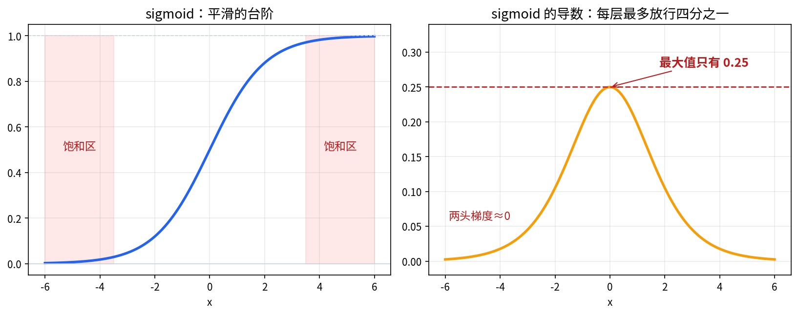
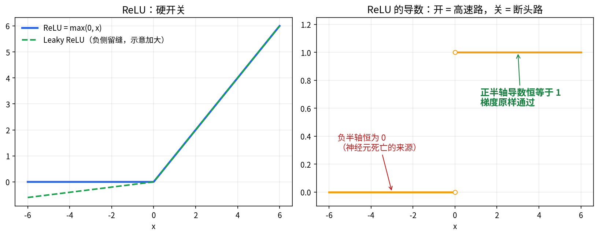
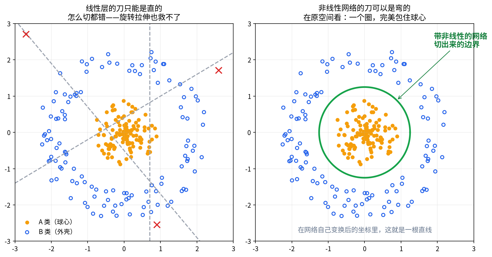
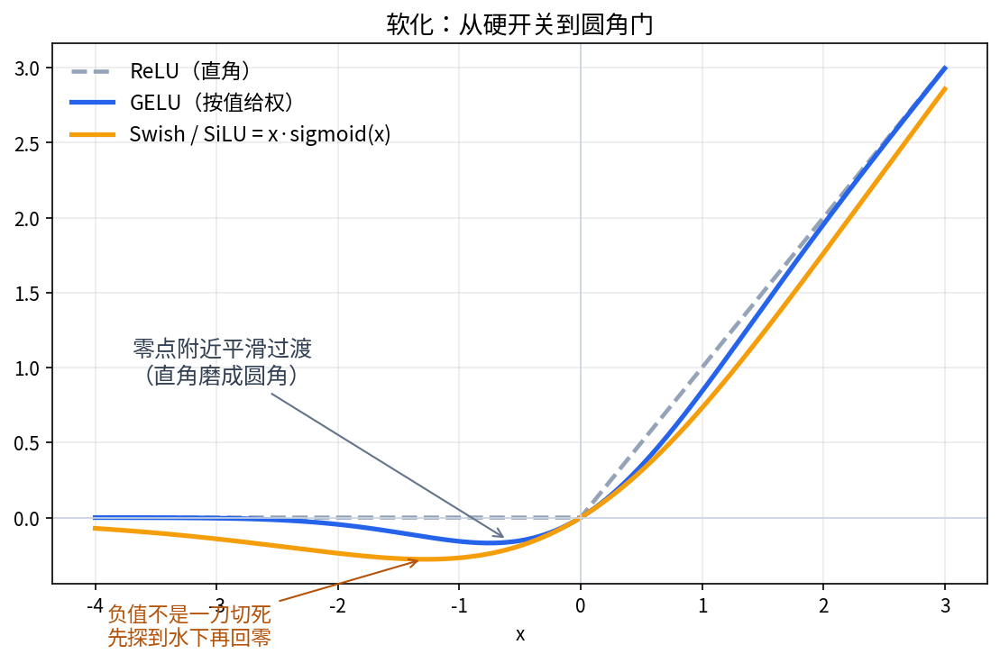
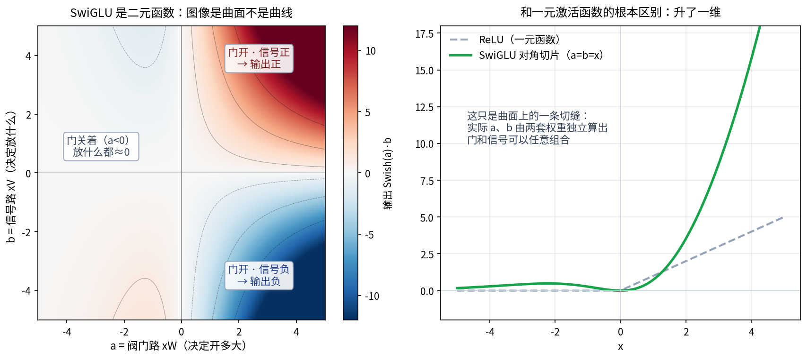

【激活函数】ReLU 为什么赢了，SwiGLU 又为什么赢了 ReLU？

━━━━━━━━━━━━━━━━━━━━

◆ 开篇：换了一个判据

━━━━━━━━━━━━━━━━━━━━

上一期 （ https://mp.weixin.qq.com/s/FhMVxRoPmXUZAuv9cyNgjw ）我们讲了为什么神经网络必须有非线性：不会折、不会选、不会记、不会忘。但那一期留了个尾巴——既然理论上**随便什么非线性都能折纸**（万能逼近定理对 sigmoid 成立，对 ReLU 也成立），为什么这个领域三十年里把激活函数换来换去？sigmoid 用了二十年被 ReLU 掀翻，ReLU 统治十年又被 SwiGLU 顶替，今天你打开任何一个主流开源大模型的 FFN 层，里面躺着的都是 SwiGLU。

答案是：**选激活函数的判据早就不是表达力了——表达力人人都够——判据是梯度的交通状况。** 正向传播管信号，反向传播管学习，一个激活函数好不好，主要看它给反向传播修的是高速公路还是烂泥地。

这一期沿时间线走：sigmoid 怎么死的，ReLU 怎么赢的，然后 GELU、Swish 一路软化，最后 SwiGLU 怎么把 "开关" 升级成 "乘法门"。终点有一句 ML 论文史上著名的摆烂，留到最后说。

━━━━━━━━━━━━━━━━━━━━

◆ 第一节：sigmoid 的死因——梯度交通堵塞

━━━━━━━━━━━━━━━━━━━━

sigmoid 函数 σ(x) = 1/(1+e⁻ˣ)，输出压在 0 到 1 之间，长得像个平滑的台阶。上个世纪它是标配，理由很朴素：像生物神经元的发放率，数学性质又好（处处可导）。

杀死它的是一笔求导的账。sigmoid 的导数是 σ'(x) = σ(x)·(1−σ(x))，它的最大值在 x=0 处取得：0.5 × 0.5 = **0.25**。注意，这是**最大值**——输入稍微偏离 0，导数就更小；到了两头的饱和区，导数几乎是 0。

反向传播的链式法则是**连乘**：梯度从最后一层往回走，每穿过一层激活函数，就要乘上一个 ≤ 0.25 的因子。十层下来，梯度最多剩下 0.25 的 10 次方——大约百万分之一。**深层网络的前几层根本收不到学习信号，等于没在训练。** 这就是梯度消失（vanishing gradient），深度学习第一次复兴时期最大的拦路虎。



────────────────────

💡 打个比方

把反向传播想成从山顶往山脚传话。sigmoid 是每一站的传令兵最多只把音量放到四分之一——传十站，声音只剩百万分之一，山脚的人只看到嘴动听不到词。梯度消失不是 "信号错了"，是 "信号还没走到就饿死了"。

────────────────────

注意这个死因和表达力无关。sigmoid 折纸折得很好，问题出在它**给梯度修的路上全是收费站，而且每站收走至少四分之三**。

━━━━━━━━━━━━━━━━━━━━

◆ 第二节：ReLU——正向管信号，反向管交通

━━━━━━━━━━━━━━━━━━━━

ReLU 是 max(0, x)：正数原样通过，负数归零。2010 年 Nair 和 Hinton 把它带进深度学习（ICML 2010，最初是给受限玻尔兹曼机用的），2011 年 Glorot、Bordes、Bengio 的《Deep Sparse Rectifier Neural Networks》（AISTATS 2011）把它为什么好使讲透了。这篇是本期的推荐精读，它说了三件事：

**一、梯度不衰减。** ReLU 在正半轴的导数恒等于 1——不是接近 1，是精确等于 1。梯度穿过一个激活着的 ReLU，**原样通过，一分钱过路费不收**。论文原话说：在神经元的活跃路径上梯度畅行无阻，不存在激活函数导致的梯度消失。对比 sigmoid 的 0.25，这是烂泥地和高速公路的差距。

**二、稀疏激活。** 负半轴归零意味着任意时刻网络里相当一部分神经元输出是**真零**（不是很小的数，是零）。论文报告：均匀初始化训练后约 50% 的隐层单元输出真零，加上稀疏正则还能更高。每个输入实际上只用网络的一半——**每个输入挑选自己的子网络**。这正是上一期说的 "不会选" 的解药：ReLU 让选择成为网络的默认行为。

**三、更像生物神经元。** 论文引神经科学的估计：大脑皮层同一时刻活跃的神经元只有 1% 到 4%——生物智能本来就是稀疏的。sigmoid 那种 "人人都出力、人人出一点" 的稠密激活，反而是不像大脑的那个。

当然 ReLU 有个众所周知的毛病，社区俗称 **dying ReLU**（神经元死亡）：一个神经元如果长期落在负半轴，梯度恒为零，就永远学不到东西了——开关卡在了 "关" 上。Leaky ReLU（Maas 等，2013）给负半轴留了条 0.01 斜率的缝，就是为了让死神经元还有救活的机会。



────────────────────

💡 导数恒为 1，那 ReLU 的非线性体现在哪？

体现在 "开和关的边界" 上。单看正半轴或负半轴，ReLU 都是线性的；非线性全部集中在 x=0 那个拐点——哪些神经元开、哪些关，这个**组合**随输入变化。上一期说过：ReLU 网络对每个输入是线性的，非线性藏在 "每个输入选了哪套开关" 里。所以它梯度上像线性函数一样通畅，表达上又有完整的折叠能力——两头的好处都占了，这是它赢的根本原因。

────────────────────

这里可以再升一维，把上一期折纸没说尽的话说狠一点。线性变换（含平移）能做的只有旋转、拉伸、剪切——这类操作在几何上是 "拓扑钝感" 的：**可逆的变形改变不了空间的缠绕结构**。如果两类数据在高维空间里像两个嵌套的皮球（A 类在球心、B 类在外壳），或者像扣在一起的两个环，线性层转到死也分不开它们——分不开不是精度问题，是拓扑定理。ReLU 的暴力恰恰在于它**不可逆**：把负半轴整个坍缩到零边界上，这一下是真的改变了拓扑——缠绕的结构被压扁、剪断、理顺一点，下一层线性层才有机会一刀切开。折纸剪窗花是它温柔的说法，冷酷的说法是：**非线性是隐空间里唯一能动拓扑的手术刀，线性层只配给病人翻身。**



ReLU 就此统治了深度学习的第一个十年。但那把 x=0 处的硬刀，接下来被人磨了又磨。

━━━━━━━━━━━━━━━━━━━━

◆ 第三节：软化——从硬开关到按值给权

━━━━━━━━━━━━━━━━━━━━

ReLU 的开关是 "硬" 的：x=0 处一刀切，符号决定生死。接下来的演化方向是把这一刀磨圆。

**GELU（2016）**：Hendrycks 和 Gimpel 提出（arXiv 1606.08415），定义是 GELU(x) = x·Φ(x)，Φ 是标准正态分布的累积分布函数。动机来自随机正则化：想象每个输入以某个概率被随机置零（像 dropout），概率取决于输入值本身——GELU 就是这个随机过程的期望。论文的说法很准：它**按值给输入加权，而不是按符号做门控**。大的正数几乎全通过，大的负数几乎全砍掉，零附近平滑过渡——像把 ReLU 的直角磨成了圆角。BERT 和 GPT-2 用的都是它，Transformer 时代前半场的标配。

**Swish（2017）**：Ramachandran、Zoph、Le（arXiv 1710.05941），定义 Swish(x) = x·sigmoid(βx)。这篇的卖点不是函数本身，是**它是搜出来的**——Google 用穷举加强化学习在一大堆候选组合里自动搜索，"最优激活函数不是人设计的，是搜出来的" 这个梗的出处就在这。

这里有桩公案值得一提：x·sigmoid(x) 这个函数，GELU 那篇 2016 年的论文里其实已经写下并命名为 **SiLU**；2017 年 Elfwing 等人在强化学习语境又独立提出一次；Swish 是第三次发明，作者后来公开承认漏查了先行工作。所以你在不同代码库里看到 SiLU 和 Swish 两个名字指同一个函数，不是 bug，是学术圈的命名事故现场。



不过软化这一步的收益说实话是渐进的——GELU、Swish 对 ReLU 的提升有，但不惊艳。真正的跳变在下一步。

━━━━━━━━━━━━━━━━━━━━

◆ 第四节：乘法门——SwiGLU 的胜利

━━━━━━━━━━━━━━━━━━━━

前面所有激活函数有个共同点：**一元函数**——输入一个数，输出一个数，每个神经元自己管自己。GLU（Gated Linear Unit，门控线性单元）改了这个前提。

**GLU（2016）**：Dauphin 等人在《Language Modeling with Gated Convolutional Networks》（arXiv 1612.08083，ICML 2017）里提出：把输入 x 做**两次**线性投影，一路当信号，一路过 sigmoid 当阀门，然后**逐元素相乘**：

```
GLU(x) = (Wx + b) ⊗ σ(Vx + c)
#         信号路          阀门路
```

符号说明：⊗ 在这里是**逐元素相乘**——两个同长度的向量，对应位置各乘各的（第 1 个信号乘第 1 个阀门、第 2 个乘第 2 个……），输出还是同长度向量。这个运算学名 Hadamard 积，规范符号其实是 ⊙，GLU 论文原文用了 ⊗（这个符号在数学里通常另有含义），我们跟着原文走。

如果你盯着 (Wx) ⊗ σ(Vx) 觉得眼熟——没错，**这就是 "没做最后一步求和的内积"**。相似度检测其实是个三级阶梯：逐元素相乘，加起来就是**内积**，再除以两个模长就是**余弦相似度**。attention 里 Q 和 K 的打分停在第二级——是完整的内积，但不除模长（只除 √d 缩个尺度）；GLU 停在第一级——算到逐元素相乘就停手，连求和都不做——求和那步下放给下一个线性层，它想怎么加权组合这些乘积项都行。所以 GLU 可以读成**保留了全部分辨率的相似度检测**：内积把 n 个分量压成一个分数，GLU 把 n 个分量原样留给后面的层自己拿主意。这个 "两路投影相乘" 的母题在架构史里反复投胎：LSTM 的门控（1997，GLU 论文自认的灵感来源）、attention 的 QK 打分，都是它的亲戚。

区别在哪？ReLU/GELU 的 "门" 是由信号自己的值决定的（x 大就开，x 小就关）；GLU 的门**由另一路独立学出来的投影决定**——开不开、开多大，和信号本身解耦了。而且两路信号**相乘**，这意味着相互作用（上一期说的 "组合出新义"）直接进了算子内部，不用再靠多层折叠去凑。

**SwiGLU（2020）**：Noam Shazeer 的《GLU Variants Improve Transformer》（arXiv 2002.05202），单人署名，正文四页。做的事情非常朴素：把 GLU 里的 sigmoid 阀门换成各种函数挨个试——换 ReLU 叫 ReGLU，换 GELU 叫 GEGLU，换 Swish 叫 SwiGLU：

```
SwiGLU(x) = Swish(xW) ⊗ (xV)
```

顺带一个值得停半秒的细节：**SwiGLU 画不出 "函数图像" 那条曲线**。sigmoid、ReLU、GELU 都是一元函数——进一个数出一个数，图像是曲线；SwiGLU 每个通道进的是两个数（阀门路的 a 和信号路的 b），出一个数，图像是**曲面**。"乘法门" 三个字落在几何上，就是从曲线到曲面的升维——门和信号的每种组合都对应曲面上的一个点。



在 T5 的实验设置下，GLU 一族普遍好于 ReLU 和 GELU，SwiGLU 和 GEGLU 最好。有个工程细节：GLU 一族要三个权重矩阵（两路投影加输出），比普通 FFN 多一个，为了参数量公平对比，Shazeer 把 FFN 隐层维度从 3072 缩到 2048（乘 2/3）——**即便隐层瘦了三分之一，带门的还是赢了**。后来 LLaMA 采用 SwiGLU 时的写法就是 "隐层维度用 ⅔·4d 而不是 4d"，你在开源模型 config 里看到的那些不整的 FFN 维度，来历就在这。

然后是那句著名的结尾。为什么 SwiGLU 更好？Shazeer 在论文里写道：

> 我们不对这些架构为什么好使提供任何解释；我们把它们的成功——像其他一切一样——归功于神恩浩荡。
> （We offer no explanation as to why these architectures seem to work; we attribute their success, as all else, to divine benevolence.）

四页纸，改一行代码，不解释原理，然后 LLaMA、Mistral、Qwen、Gemma 全跟进，成了今天大模型 FFN 的事实标配——我们在第 247 期剖 DeepSeek V4 专家结构时见过它的实物：gate 路和 up 路两次投影再相乘，就是 SwiGLU 的骨架。**工程先于理论，是深度学习的常态而不是耻辱**；只是大部分论文假装自己有理论，Shazeer 懒得装。

不过这几年社区倒是攒出了一个像样的直觉，值得说给你听（注意：是直觉，不是定论）。回想 attention 在干什么：在 token 维度上做动态交互——每个 token 该看谁、看多少，由内容现场算出来。SwiGLU 的乘法门干的是结构上相似的事，只是换了个维度：**在特征维度上做动态交互**——每个特征通道该放行多少，不由它自己的符号写死，而由另一路投影看完整个输入后现场决定。ReLU 的开关规则是出厂焊死的（看符号），SwiGLU 的门是每个输入现算的（看语境）。这也顺便解释了为什么隐层缩水三分之一还能赢：普通 FFN 的宽度花在 "更多固定开关" 上，SwiGLU 把一部分参数改花在 "让开关变聪明" 上——**买判断力比买人头划算**。

────────────────────

💡 打个比方

ReLU 是弹簧门：推力（输入值）够大就开，方向反了就关，门自己没有意见。SwiGLU 是带门童的门：门童（阀门路）单独受训，看人下菜碟地决定开多大——信号是信号，放行是放行，两件事分开学。多雇一个门童要花钱（多一个矩阵），所以把门厅缩小三分之一来补——结果服务质量还是更好。

────────────────────

到这儿，从 sigmoid 到 SwiGLU 的整条演化链走完了。

━━━━━━━━━━━━━━━━━━━━

◆ 收尾：三十年演化的一句话总结

━━━━━━━━━━━━━━━━━━━━

把这条线捋直：

| 年代 | 主角 | 一句话定位 |
|---|---|---|
| ~2010 前 | sigmoid / tanh | 平滑的台阶，梯度每层收走 3/4，深了就聋 |
| 2010-2011 | ReLU | 硬开关：正向管信号，反向管交通，稀疏是天赋 |
| 2013 | Leaky ReLU | 给死神经元留条活缝 |
| 2016-2017 | GELU / Swish | 软开关：按值给权，圆角过渡 |
| 2016→2020 | GLU → SwiGLU | 乘法门：阀门独立学习，相互作用进算子 |

判据从头到尾没变过：**不是谁更非线性，是谁让梯度走得更顺、让选择做得更准。** 表达力是入场券，交通是胜负手。

上一期说激活函数买四样：会折、会选、会记、会忘。这一期补上第五样——从 ReLU 到 SwiGLU，本质是把 "选" 这个动作本身也变成了可学习的：ReLU 的开关是写死的规则（看符号），SwiGLU 的门是训出来的判断（看语境）。**连选择的方式，都交给了梯度下降。**

━━━━━━━━━━━━━━━━━━━━

【技术名词速查】

| 术语 | 中文 | 一句话解释 |
|------|------|-----------|
| 梯度消失（vanishing gradient） | — | 反向传播连乘小于 1 的因子，深层梯度指数衰减，前层学不到东西 |
| 饱和区 | — | 激活函数两头平坦、导数接近 0 的区域；输入落进去梯度就没了 |
| 稀疏激活 | — | 大量神经元输出真零，每个输入只动用网络的一部分 |
| dying ReLU | 神经元死亡 | 神经元长期落在负半轴，梯度恒零，永远学不到东西（社区俗称） |
| GELU | — | x·Φ(x)，按值给输入加权的软开关，BERT/GPT-2 标配 |
| Swish / SiLU | — | x·sigmoid(βx)；同一函数被命名三次的事故现场 |
| GLU | 门控线性单元 | 两路投影逐元素相乘，一路信号一路阀门 |
| SwiGLU | — | 阀门用 Swish 的 GLU；当今开源大模型 FFN 标配 |

━━━━━━━━━━━━━━━━━━━━

【参考资料】

- Nair & Hinton (2010). *Rectified Linear Units Improve Restricted Boltzmann Machines*. ICML 2010
- Glorot, Bordes & Bengio (2011). *Deep Sparse Rectifier Neural Networks*. AISTATS 2011
- Maas, Hannun & Ng (2013). *Rectifier Nonlinearities Improve Neural Network Acoustic Models*. ICML 2013 Workshop
- Hendrycks & Gimpel (2016). *Gaussian Error Linear Units (GELUs)*. arXiv: 1606.08415
- Ramachandran, Zoph & Le (2017). *Searching for Activation Functions*. arXiv: 1710.05941
- Dauphin, Fan, Auli & Grangier (2016). *Language Modeling with Gated Convolutional Networks*. arXiv: 1612.08083
- Shazeer (2020). *GLU Variants Improve Transformer*. arXiv: 2002.05202
- Touvron et al. (2023). *LLaMA: Open and Efficient Foundation Language Models*. arXiv: 2302.13971

━━━━━━━━━━━━━━━━━━━━

**表达力是入场券，梯度交通是胜负手——sigmoid 不是不够弯，是每层收走四分之三的过路费。**

**ReLU 赢在两头占：梯度上像线性函数一样通畅，表达上有完整的折叠能力。**

**从 ReLU 到 SwiGLU：开关的规则写死在符号里，门的判断训在权重里——连选择的方式，都交给了梯度下降。**

━━━━━━━━━━━━━━━━━━━━

// 靳岩岩的 AI 学习笔记 × Claude 的严谨 × Gemini 的浪漫
// 2026-07-16
