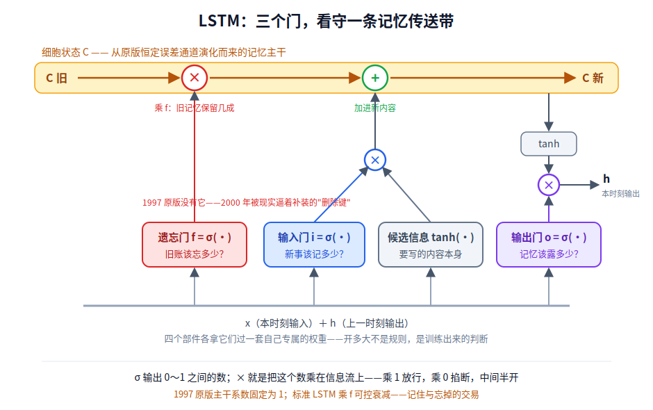
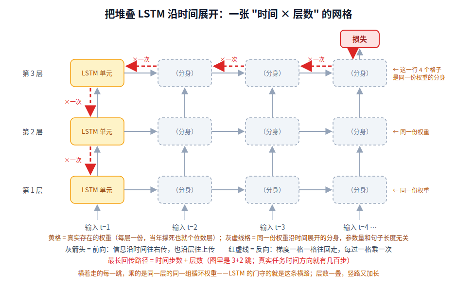
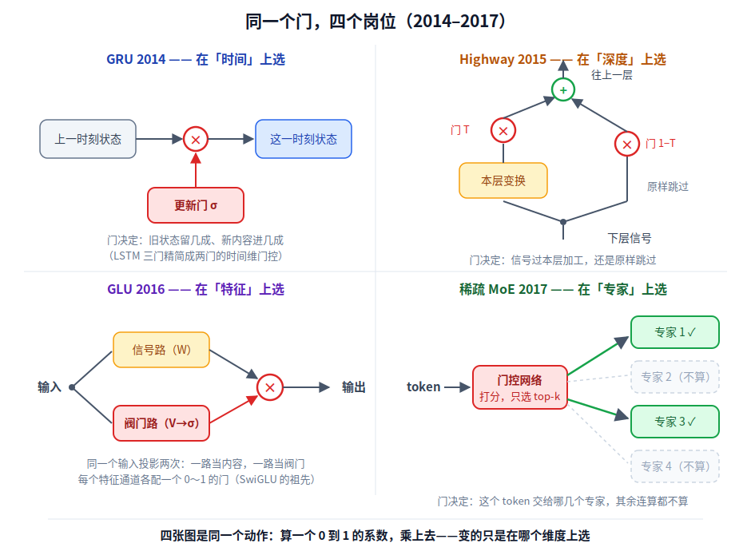

【门控】"LSTM 的三个门是什么？"——一道死掉的面试题，和一个活了三十五年的思想

━━━━━━━━━━━━━━━━━━━━

◆ 开篇：题死了，思想没死

━━━━━━━━━━━━━━━━━━━━

这个栏目又开张了。前几期我们做过 "为什么要用激活函数"（ 251 期 https://mp.weixin.qq.com/s/FhMVxRoPmXUZAuv9cyNgjw ），那是一道人人及格、没人满分的题。今天这道不一样——它是一道 **死掉的** 面试题。

"LSTM 的三个门是什么？各自干什么用？"

2018 年前后，这题是 NLP 岗位的必考题，背不出遗忘门公式的候选人会被面试官用眼神送走。今天你翻任何一份大模型面经，这题已经绝迹了——Transformer 一统天下，LSTM 进了历史课本，题跟着陪葬。

但有意思的地方在这：**题死了，题里那个思想活得比谁都好。** 你今天用的每一个大模型里都跑着它：SwiGLU 的乘法门（上一期 https://mp.weixin.qq.com/s/c2fkKq6OY-ux9bZsaZDZdA 刚讲过）、MoE 的路由门（ 246 期 https://mp.weixin.qq.com/s/EwUO9tVfrpCrcwsyPI42uw ）、Mamba 的选择机制、乃至 2025 年有人把遗忘门重新装回 softmax attention——全是同一个思想的转世。

这个思想一句话就能说清。上一期结尾我们说过：**矩阵乘法是 "全都要" 的世界**——同一个矩阵对所有输入做同一套变换，每个输出都是所有输入的加权和，它没有能力说 "这个留下、那个滚蛋"。门控（gating）干的事，就是往这个 "全都要" 的世界里装 "选择"：算一个 0 到 1 之间的数，乘上去——乘 1 是放行，乘 0 是掐断。

三十五年来它只干这一件事。变的只是 **在哪个维度上选**：时间上选（LSTM）、深度上选（Highway）、特征上选（GLU）、专家上选（MoE）、状态上选（Mamba）。这一期沿这条线走完全程——起点是 1991 年，一个巧合得像小说的年份。

━━━━━━━━━━━━━━━━━━━━

◆ 第一节：1991，门控的双源年

━━━━━━━━━━━━━━━━━━━━

历史有时候会开这种玩笑：一个思想的两条血脉，在同一年、在大西洋两岸，各自出生，互不相识，然后各走三十年，最后在今天的大模型里汇合。

**慕尼黑这头**，1991 年，慕尼黑工业大学一个叫 Sepp Hochreiter 的学生交了他的 Diplom 论文（相当于硕士毕业论文），题目是《Untersuchungen zu dynamischen neuronalen Netzen》——对，德语。指导他的是当时同在慕尼黑的 Jürgen Schmidhuber。这篇论文第一次系统诊断了循环神经网络的绝症：**梯度消失**——误差信号沿时间往回传，每一步都要乘一遍权重和激活函数的导数，传不了几十步就衰减到零。网络对 "很久以前发生的事" 彻底失聪。

────────────────────

💡 这个德语标题，词根级直译成英语是什么

别被吓住，逐词对一遍你会发现德语和英语根本是亲兄弟（同属日耳曼语族）：

- **Untersuchungen** = unter + such + ungen。unter 就是英语的 under；such- 是动词 suchen 的词根，和英语 seek 同源（都出自原始日耳曼语 \*sōkijaną，"寻找"）；-ungen 对应英语的 -ings。整个词逐词根拼出来就是 **"under-seekings"**——往下寻、深入查，也就是 investigations（研究、考察）
- **zu** = to（同源，一眼假不了）
- **dynamischen / neuronalen** = dynamic / neuronal——这两个不算本事，希腊语外来词，德英两家各自借的同一个词
- **Netzen** = **nets**。这对最有意思：德语词尾的 tz 对应英语的 t，是"高地德语辅音推移"留下的整齐脚印——同一条规律还管着 Wasser/water、essen/eat、sitzen/sit。看懂这一对，你就掌握了一条能批量破译德语词的密码

所以整个标题 = "Under-seekings to dynamic neuronal nets" = 《动态神经网络研究》。德语和英语两千多年前还是同一门语言（原始日耳曼语），分家之后各自演化，词根至今严丝合缝地对得上；把这个游戏再往上玩一层——日耳曼语、拉丁语、希腊语、梵语也曾是一家——就是"印欧语系"这个词的意思。

────────────────────

这篇论文因为是德语写的，很多年没被英语学界注意到，系统性的英文版发表迟至 1998 年；中间 Bengio 等人在 1994 年独立发表了类似的结论，拿走了更多引用。学术史上语言壁垒造成的损耗，这是个标准案例。顺便说，一篇标题里躺着 nets 的论文被英语学界因为"看不懂德语"错过了七年，配着上面那个词根表看，多少有点讽刺。

诊断书开出来了，药方还要再等六年——那就是 LSTM，下一节的主角。这条线催生的是 **时间维度上的门**。

**北美那头**，同一个 1991 年，Jacobs、Jordan、Nowlan、Hinton 四人（前两位在 MIT，后两位在多伦多）在 Neural Computation 上发了一篇只有 9 页的论文：《Adaptive Mixtures of Local Experts》。想法是：与其训一个大网络包打天下，不如训一群小 "专家" 网络，再训一个 **门控网络（gating network）** 决定每个输入该交给哪个专家。"gating network" 这个术语就是从这篇论文确立下来的（更早 Hampshire 和 Waibel 等人有过类似构造，所以准确说是 "确立并普及"，不是发明）。

两个细节值得停一下。第一，这个门控函数在数学上就是 softmax——但全文从头到尾没出现 softmax 这个词。不是作者不懂，是这个名字太新了：softmax 这个叫法是英国语音识别研究者 John Bridle 在 1989 年前后刚造出来的（在那之前大家只会描述性地叫它 "归一化指数"），到 1991 年还没流行开。今天每个大模型每输出一个 token 都要过一遍的函数，当年连个通用名字都还没混上。第二，论文里 gating 的最初设想是 **随机开关**：按门控给出的概率抽一个专家来干活，而不是把所有专家的输出加权混合——这个 "抽一个而不是全都要" 的思路，二十六年后会以 top-k 路由的形式还魂。

四位作者的后话也值得一提：Hinton 后来拿了图灵奖和诺贝尔物理学奖，Michael I. Jordan 成了机器学习一代宗师。这篇 9 页小论文催生的是 **专家维度上的门**。

一年，两地，两条线。一条要解决 "时间太长记不住"，一条要解决 "任务太杂管不过来"，给出的答案却是同一个动作：**算一个系数，乘上去。** 记住这个巧合，它是全文的脊柱——文章结尾我们会看到这两条线怎么在 2023 年之后重新拧成一股。

━━━━━━━━━━━━━━━━━━━━

◆ 第二节：LSTM——先学会记，再学会忘

━━━━━━━━━━━━━━━━━━━━

1997 年，Hochreiter 和 Schmidhuber 在 Neural Computation 发表了 LSTM（Long Short-Term Memory，长短期记忆网络），46 页，是那本期刊出了名的长文。它给六年前那份诊断书开出了药方：既然误差沿时间回传会被反复乘小，那就修一条 **不做任何乘法衰减的专用通道**——让误差以系数恰好为 1 的方式原地打转，论文管它叫 constant error carousel（常量误差旋转木马）。这条通道就是后来人人皆知的细胞状态（cell state）。

光有通道还不行——什么信息允许进这条通道、通道里的内容什么时候允许放出来，得有人把关。把关的就是门：**输入门决定写入，输出门决定读出**，每个门都是一个 sigmoid，输出 0 到 1 之间的数，乘在信息流上。论文摘要的原话："乘法门单元学会打开和关闭对恒定误差流的访问"。靠这套机制，LSTM 宣称能跨越 1000 步以上的时间延迟——在那个 RNN 传十几步就聋的年代，这是数量级的跨越。

这里必须替论文自己说一句诚实话：**乘法门不是 LSTM 发明的。** 论文 2.7 节明明白白列了前人——Watrous 和 Kuhn 1992 年的二阶网络用过乘法交互，更早的 sigma-pi 单元（Feldman 和 Ballard，1982）就已经被当 "门控装置" 用了。LSTM 的真正创新不是门本身，是 **把门用在了看守恒定误差通道这个位置上**——零件是旧的，岗位是新的。

顺带一个趣闻：这篇论文的 2.8 节干了件很损的事——他们发现 Bengio 1994 年论文里的很多基准任务，**纯随机猜权重都能解出来**，以此论证那些基准太简单，不足以检验长时依赖能力。九十年代的论文吵架，火药味不输今天。

────────────────────

💡 门的算式长什么样

以输入门为例：iₜ = σ(Wᵢxₜ + Uᵢhₜ₋₁ + bᵢ)。看结构——它就是一个小型神经网络层：拿当前输入 xₜ 和上一步的隐状态 hₜ₋₁，过一套 **自己专属的权重**，再过 sigmoid 压到 0 和 1 之间，然后逐元素乘在候选信息上。关键在 "自己专属的权重"：开多大不是写死的规则，是训练出来的判断——这正是上一期 SwiGLU 那节说的 "单独雇一个裁判"——那个裁判岗位，血缘上就是从这里传下去的。

────────────────────

现在说一个大多数人不知道的事实：**1997 年的原版 LSTM 只有两个门。** 输入门，输出门，没有遗忘门。设计者的心态很好理解——好不容易修出一条不衰减的记忆通道，满脑子想的都是 "记住、别丢"，谁会想到给它装个删除键？

结果通道很快出了事。细胞状态只进不出地累加，在连续运行的任务上会 **无限增长，最终把网络撑崩**——sigmoid 和 tanh 全被推进饱和区，梯度死绝。1999 年，Gers、Schmidhuber 和 Cummins 在 ICANN 会议上发表《Learning to Forget: Continual Prediction with LSTM》（期刊版 2000 年），给 LSTM 补上了第三个门：**遗忘门**（forget gate，有的文献也叫 keep gate）——一个乘在旧细胞状态上的系数 fₜ，让网络自己学会 "这段记忆该衰减了"。

所以严格说，**今天所谓 "标准 LSTM"——面试题里那个三门版本——其实是 2000 年的 Gers 版**。绝大多数引用 1997 年论文的人，用的都不是 1997 年的架构。这在引用史上是个挺普遍的现象：经典论文的名字活着，里面的架构早被后人悄悄换过件了。

把补装完遗忘门的完整版画出来，就是这张图——记不住公式没关系，记住结构就行：一条不衰减的传送带，三个拿 sigmoid 当阀门的门。



251 期我们讲过 "不会忘" 是线性系统的绝症——可逆的系统什么都丢不掉，而学习需要选择性遗忘。LSTM 的这段历史是同一个道理在架构史上的重演：**设计者最初只想造一台不会忘的机器，结果发现不会忘的机器根本没法持续工作。** 遗忘门是被现实逼出来的，而不是设计出来的——这大概是它日后成为整个家族里最重要的一个门的原因。这句不是虚言：后面你会看到，活到 2025 年还在各大架构里转世的，恰恰就是遗忘门。

────────────────────

💡 那个年代的 LSTM 模型长什么样

别拿今天的直觉去想它。今天的模型是几十层 "attention + FFN" 三明治；当年的 LSTM 模型是 **个位数层的堆叠，层里也没有标配的 FFN**——一层就是循环单元本身。参数全堆在几个巨大的循环矩阵里，"宽而浅"，和今天的 "窄而深" 正好反着。

深不上去有硬原因。把堆叠 LSTM 沿时间展开，得到的是一张 "时间步 × 层数" 的网格，每个格子是一个 LSTM 单元：信息既沿时间往右传（这一层的隐状态喂给下一时刻的自己），也沿层往上传（下层输出喂给上层）。注意网格和参数量的关系：**同一行的格子是同一份权重在不同时刻的分身**——"循环" 二字的意思就是每层权重只有一份、沿时间反复用，所以参数量只跟层数有关，跟句子多长无关。反向传播时梯度要在这张网格里一格一格往回走，**每过一格都乘一次**——时间方向本来就要走几百步（横着走的每一跳乘的还都是同一组权重），层数再往上一叠，最长回传路径变成 "时间步数 + 层数"，衰减雪上加霜，堆深了根本训不动。



顺便吐个槽：多数教材把 LSTM 单元内部那张接线图画得巨细无遗，却几乎从不画上面这张展开图——很多人（包括我）因此长期以为 LSTM 就是孤零零一个单元，直到看见今天的混合架构（几层线性注意力配一层全注意力地往上堆）才反应过来：原来循环网络也是这么一层层盖楼的。这个教学盲区不是 LSTM 专属。前两天有位前同事在后台问我：Transformer 到底有几层 FFN？我敢说大多数程序员都是这个状态——知道 Transformer，能背 QKV，但不知道 FFN 每一层都有一个（参数大头恰恰在它身上），更不知道 MoE 不是外挂了一个专家模块，而是把每一层的 FFN 都换成了专家组。原因是一样的：单元内部有公式、好出题；宏观结构是工程、不好考——于是可考的被画了一万遍，重要的没人画。

────────────────────

记住这张 "宽而浅" 的地图。接下来二十年，门控思想要做的事，就是在这张图的各个方向上重新安装自己。

━━━━━━━━━━━━━━━━━━━━

◆ 第三节：门的扩张——换个维度，再选一次

━━━━━━━━━━━━━━━━━━━━

LSTM 的门是装在 **时间** 维度上的：决定信息能不能从上一刻流到下一刻。接下来二十年，门控思想干的事情就是不断换维度重新安装。

【2014：GRU，时间维的精简版】

Cho 等人 2014 年的机器翻译论文（arXiv 1406.1078）里 "顺手" 提出了一种新的循环单元：把 LSTM 的三个门精简成两个——reset gate（重置门）和 update gate（更新门），去掉独立的细胞状态。有个冷知识：**这篇原始论文通篇没有 "GRU" 这个名字**，作者只管它叫 "一种新型隐藏单元"；GRU（Gated Recurrent Unit）这个名字是 Chung 等人同年年底的对比论文（arXiv 1412.3555）叫开的。孩子是 Cho 生的，名字是邻居起的。

【2015：Highway，把门装到深度上】

2015 年的 Highway Networks（arXiv 1505.00387）作者是 Srivastava、Greff 和 Schmidhuber。注意第三个名字——就是前面反复出现的那位 Jürgen Schmidhuber，同一个人：1991 年指导 Hochreiter 诊断梯度消失，1997 年 LSTM 合著者，1999 年遗忘门合著者，这时候在瑞士 IDSIA 研究所带着学生继续干。一个人追着 "门" 这个思想打了二十五年。这篇论文做了一个概念上很漂亮的平移：LSTM 的门管的是信息 **沿时间** 流动，那网络加深时信息 **沿层** 流动，是不是同一个问题？梯度穿过几十层衰减掉，和穿过几十个时间步衰减掉，病理一模一样。

先防一个误会：**Highway 不是 100 层的 LSTM，它里面根本没有时间轴**。它是纯前馈网络——图片进、标签出，一遍过，不循环。拿后面那张网格图的话说：Highway 只有竖着那一列，没有横向的时间分身，就是单纯把楼盖到 100 层高。它从 LSTM 借走的只是 "门" 这个零件：LSTM 用门守横路（时间），Highway 把同一个零件装到竖路（深度）上——病同构，药搬家，病人换了。

具体做法是给每一层装一对门：transform gate（变换门）T 决定放多少信号进本层变换，carry gate（携带门）决定放多少信号原样跳过本层（通常直接取 1−T，省一半参数）。论文原文明说灵感来自 LSTM。效果立竿见影：MNIST 上直接训到 100 层，还试过 900 层——在那个 20 层就训不动的年代，"深度高速公路" 名副其实。

【2016：GLU，把门装到特征上】

Dauphin 等人的 GLU（arXiv 1612.08083）把门装到了 **特征通道** 维度：两路投影，一路信号一路阀门，逐元素相乘。这条线上一期整篇都在讲，此处一笔带过——只补一句定位：LSTM 的门选 "哪些时刻的信息值得留"，GLU 的门选 "哪些特征通道值得放行"。同一个动作，第三个维度。

【2017：MoE 还魂，把门装到专家上】

北美那条专家线沉寂了二十多年后，2017 年 Shazeer 等人的 Sparsely-Gated Mixture-of-Experts（arXiv 1701.06538，作者名单里同时有 Hinton 和 Jeff Dean）把它带回了主舞台，而且明确引用了 1991 年的 Jacobs 论文——血缘认领得清清楚楚。核心改动是 noisy top-k gating：门控网络不再把所有专家的输出加权混合，而是只激活得分最高的 k 个专家，其余的连算都不算——1991 年 "按概率抽一个" 的随机开关设想，以确定性 top-k 的形式还魂了。靠这个稀疏门，他们把模型堆到 1370 亿参数，实验里最多试了 131072 个专家。这个数字的构成很说明问题：LSTM 本体撑死亿级参数，**1370 亿几乎全堆在专家里**——门控在这里已经不是锦上添花的小阀门，而是撑起整个参数规模的承重结构。

先交代下时代背景：2017 年初 Transformer 还没发表，语言建模和机器翻译这两大主力任务的霸主架构是堆叠 LSTM。Shazeer 他们的动机和今天一模一样——想把模型容量再抬一个数量级，但 "每个参数都参与每次计算" 的算力账扛不住；解法也和今天一模一样——每个 token 只激活一小撮专家。唯一不同的是宿主，于是出现了一个今天看来很有年代感的画面：**那个 MoE 层是夹在两层 LSTM 之间的**，专家维的门第一次大规模落地，宿主是时间维的门——两条 1991 年的血脉在这篇论文里物理意义上叠在了一起，然后又各自等了五年，才在 Transformer 时代真正爆发。事后看来，往 LSTM 之间插一层 FFN 性质的专家，倒像是提前几个月预演了 "序列层 + FFN 层交替" 的现代版式。

MoE 后来的故事（路由、负载均衡、DeepSeek 的细粒度专家）我们在 246 期和 33 期（ https://mp.weixin.qq.com/s/SGAt3w3d1C3icAB3JbgDYw ）都讲过，不再展开。

把这四站画在一起，"换维度重新安装" 就一目了然了——四张小图里的红圈 × 是同一个零件：



────────────────────

💡 四个维度的门，一张表看清

| 年份 | 架构 | 门装在哪个维度 | 门在选什么 |
|---|---|---|---|
| 1997/2000 | LSTM | 时间 | 哪些时刻的信息流进记忆、哪些被忘掉 |
| 2014 | GRU | 时间 | 同上，两个门的精简版 |
| 2015 | Highway | 深度 | 信号过本层变换，还是原样跳过 |
| 2016 | GLU | 特征 | 哪些特征通道放行、放多大 |
| 2017 | 稀疏 MoE | 专家 | 这个 token 交给哪几个专家处理 |

机制从头到尾没变：一个可训练的小网络算出 0 到 1 的系数，乘在信息流上。变的只是 "信息流" 三个字指的是什么。

────────────────────

到这里，门控看起来战无不胜——每换一个维度就下一城。但别忙着下结论。时间往回拨到 2015 年底——就在 Highway 发表几个月后、GLU 和 MoE 还没登场的时候，一记耳光其实已经落下了，只是它的分量要过几年才被完全掂出来。

━━━━━━━━━━━━━━━━━━━━

◆ 第四节：ResNet 的耳光——有时候，不选才是最好的选择

━━━━━━━━━━━━━━━━━━━━

2015 年底，He、Zhang、Ren、Sun 的 ResNet（arXiv 1512.03385）横空出世。它和 Highway 解决的是同一个问题（信息怎么无损地穿过很深的网络），给的答案却针锋相对：Highway 说 "跳不跳过本层，装个门让网络自己选"；ResNet 说 **不选了，永远全额跳**——跨层连接上不装任何门，就是裸的恒等映射：输出 = 本层变换 + 输入，输入原封不动搬过来，没有系数，没有 sigmoid，没有任何 "选择"。结果：比 Highway 晚几个月，比 Highway 简单，比 Highway 深得多（152 层起步），比 Highway 强得多。

这还只是战绩。真正的实锤在半年后的续作《Identity Mappings in Deep Residual Networks》（arXiv 1603.05027）：作者专门做了消融实验，在 CIFAR-10 上用 ResNet-110 把跨层连接换成各种带门的版本挨个比。结果：恒等连接错误率 6.61%；换成 Highway 式的门控连接，8.70%——而且高度依赖偏置初始化，初始化不对干脆不收敛；在跨层通路上加 dropout，直接训练失败。结论一句话：跨层通路必须保持 **"干净"** ——任何乘在这条路上的系数，哪怕是可学习的门，都在给梯度设卡。

站在本文的叙事线上，这记耳光打得极有教育意义。Highway 的逻辑是 "信息要不要跳过本层，让网络自己选"；ResNet 的回答是：**这件事根本不该选。** 梯度回传的主干道要的是无条件畅通，就像 LSTM 那条 constant error carousel 的初心——系数恒为 1，不乘任何东西。讽刺的是，LSTM 后来自己也在这条通道上装了遗忘门（乘 fₜ），而 ResNet 反而把 LSTM 的初心贯彻得更彻底。

所以门控思想三十五年史里必须记下这一笔：**选择是有成本的——每装一个门，就在信息流上多设一道可能出错的关卡。** 门该装在支路上（选什么内容进来），不该装在主干道上（信息能不能通过）。后来的 Transformer 把这个教训抄得明明白白：残差主干道全程无门，门控全部安置在支路的 FFN（SwiGLU）和旁路的注意力权重里。

────────────────────

💡 那注意力算不算门控

算，而且是把门控推到极致的形态——softmax 注意力权重本质上是一排和为 1 的软门，决定每个 token 从其他 token 那里各取多少信息。区别在于 LSTM 的门是 "标量乘信息流"，注意力是 "一整排门同时开、按比例分配"。本文不展开这条线（那是另一整篇的量），只需要记住：门控和注意力不是两个思想，是同一个 "算系数、做选择" 思想的不同带宽版本。

────────────────────

耳光归耳光，门控没有退场——它只是搬家了。下一站，是最近三年的事。

━━━━━━━━━━━━━━━━━━━━

◆ 第五节：当代汇流——所有新架构里都藏着那个门

━━━━━━━━━━━━━━━━━━━━

【Mamba：selection 就是 gate，有定理为证】

2023 年底 Gu 和 Dao 的 Mamba（arXiv 2312.00752）是状态空间模型（SSM）路线的爆点，卖点叫 "选择性状态空间"（selective SSM）：让状态转移的参数随输入变化，模型就能按内容决定记什么、忘什么。听着像新词？论文正文里的 Theorem 1 亲自揭了底：取一维状态、特定参数的特例（N=1、A=−1、B=1），选择性 SSM **精确退化** 为：

```
g_t = sigmoid(W @ x_t + b)            # [1,d] @ [d] + 标量 -> 标量，过 sigmoid 还是标量
                                      # （论文记号是 Linear(x_t)，就是 W@x+b 的框架黑话）
h_t = (1 - g_t) * h_prev + g_t * x_t  # 一个 0~1 的数，把旧状态和新输入按比例调和
```

这是定理里的一维特例，所以门是单个数字；真实模型里这套公式每个通道各跑一份——几千个通道几千个门，各开各的。

看第二行——这就是经典门控 RNN 的更新式，GRU 的 update gate 干的正是这件事。**Mamba 的 "选择"，在数学上就是 1991 年那条慕尼黑血脉的门，作者自己用定理承认了这层血缘。** 论文还给了个更漂亮的概念桥：门控等价于对离散化步长 Δ 的选择——Δ 大，相当于重置状态、专注当前输入；Δ 小，相当于忽略当前输入、保持旧状态。"忘" 和 "记" 变成了 "时间过得快" 和 "时间过得慢"。这条线一路走到今年的 Mamba-3，我们在 127 期（ https://mp.weixin.qq.com/s/A8eJvexEDZwYMOsf1lSJAA ）里详细讲过。

【Gated DeltaNet 与 KDA：遗忘门的精装修】

线性注意力这条线（195 期 https://mp.weixin.qq.com/s/C-vsE_ceIv6FYVzeZWFBYQ 梳理过战局）最近两年的进展，本质上是在给记忆状态矩阵装越来越精细的遗忘门。Gated DeltaNet（arXiv 2412.06464，MIT 与 NVIDIA 合作，188 期 https://mp.weixin.qq.com/s/jcQlCc3XtaCEEnjUaxw93w 专门讲过）的分工说得很直白：**标量数据依赖门 αₜ 负责快速清空记忆，delta rule 负责精确定向更新**——一个管大扫除，一个管改具体某条记录。2025 年 Kimi Linear 的 KDA（arXiv 2510.26692）再进一步：把那个标量门升级成逐通道的细粒度门——大扫除也要分房间打扫。从 Gers 2000 年那个标量 fₜ 到 KDA 的对角门控，遗忘门的分辨率涨了，职能一个字没变。

【FoX：遗忘门杀回 softmax attention，还顺走了位置编码】

最有戏剧性的是这个。2025 年 Mila 的 Forgetting Transformer（FoX，arXiv 2503.02130）干了一件循环路线的复仇之事：**把遗忘门装回标准 softmax attention**——对未归一化的注意力分数施加一个数据依赖的下调：越久远的 token，被累积的遗忘门压得越低。工程上兼容 FlashAttention，不用改底层算子。

彩蛋在副作用上：装了遗忘门之后，**位置编码可以不要了**。想想为什么——"越远的过去衰减越多" 本身就在给序列注入方向和距离感，遗忘门顺手把位置信息的活也干了。一个 1999 年为了防止细胞状态爆炸而打的补丁，2025 年在 Transformer 里把 RoPE 的岗位给兼并了。门控这个思想的生命力，大概没有比这更好的注脚。

回头看第一节埋的那个巧合：慕尼黑的时间之门（LSTM→Mamba→FoX）和北美的专家之门（MoE→今天几乎所有旗舰大模型的标配），1991 年分头出生，2023 年之后在同一批模型里汇合——一个 MoE 架构的混合模型里，状态维的门和专家维的门就在同一次前向传播里各司其职。两条线走了三十多年，谁也没死，在终点握了手。

━━━━━━━━━━━━━━━━━━━━

◆ 收尾：没人问的题，答案在每天跑着

━━━━━━━━━━━━━━━━━━━━

把三十五年缩成一段话：矩阵乘法是 "全都要" 的世界，门控往里装 "选择"。1991 年两篇论文分头出发；1997 年 LSTM 用门看守误差通道，2000 年被现实逼着补上遗忘门；此后门控沿维度扩张——深度（Highway）、特征（GLU）、专家（MoE）；2015 年 ResNet 教了它一课：主干道不许设卡，门只配管支路；然后它搬进当代架构——Mamba 用定理承认自己的选择机制就是门，线性注意力给遗忘门做精装修，FoX 把它装回 softmax attention 还兼并了位置编码。

所以回到开头那道死题。"LSTM 的三个门是什么" 没人问了，问了也确实没用——没有哪个岗位还需要你手写 LSTM。但如果哪天有面试官问 "Mamba 的 selection 机制和经典 RNN 什么关系"，或者 "MoE 的 router 为什么用 softmax"，或者 "FoX 为什么可以不要位置编码"——这三道活着的题，答案全埋在上面这段历史里。

**面试题会死，因为它绑定的是架构；思想不会，因为它绑定的是问题。** 只要 "有限的计算面对无限的信息" 这个问题还在，"算一个系数，决定留下什么" 这个动作就会一直转世下去。

━━━━━━━━━━━━━━━━━━━━

【技术名词速查】

| 术语 | 中文 | 一句话解释 |
|------|------|-----------|
| 门控（gating） | — | 用一个 0 到 1 之间的可训练系数乘在信息流上，实现 "选择性放行" |
| 细胞状态（cell state） | — | LSTM 里那条专用记忆通道，误差沿它回传不衰减 |
| constant error carousel | 常量误差旋转木马 | LSTM 原论文对上述通道的叫法：误差以系数 1 原地打转 |
| 遗忘门（forget gate） | — | 乘在旧记忆上的衰减系数，1999/2000 年 Gers 等人补进 LSTM；也叫 keep gate |
| gating network | 门控网络 | MoE 里决定输入交给哪个专家的小网络，1991 年 Jacobs 等人确立的术语 |
| Highway Networks | 高速公路网络 | 给每一层装 transform/carry 门，决定信号变换还是跳过，2015 |
| 恒等连接（identity shortcut） | — | ResNet 的无门跨层连接；消融实验证明它优于任何带门版本 |
| selective SSM | 选择性状态空间模型 | Mamba 的核心机制，参数随输入变化；特例下精确等于门控 RNN |
| FoX（Forgetting Transformer） | — | 把数据依赖遗忘门装进 softmax attention 的 Transformer，可免位置编码 |

━━━━━━━━━━━━━━━━━━━━

【参考资料】

- Hochreiter (1991). *Untersuchungen zu dynamischen neuronalen Netzen*. Diplom thesis, TU München
- Jacobs, Jordan, Nowlan & Hinton (1991). *Adaptive Mixtures of Local Experts*. Neural Computation 3(1)
- Hochreiter & Schmidhuber (1997). *Long Short-Term Memory*. Neural Computation 9(8)
- Gers, Schmidhuber & Cummins (2000). *Learning to Forget: Continual Prediction with LSTM*. Neural Computation 12(10)
- Cho et al. (2014). *Learning Phrase Representations using RNN Encoder-Decoder for Statistical Machine Translation*. arXiv: 1406.1078
- Chung et al. (2014). *Empirical Evaluation of Gated Recurrent Neural Networks on Sequence Modeling*. arXiv: 1412.3555
- Srivastava, Greff & Schmidhuber (2015). *Highway Networks*. arXiv: 1505.00387
- He, Zhang, Ren & Sun (2015). *Deep Residual Learning for Image Recognition*. arXiv: 1512.03385
- He, Zhang, Ren & Sun (2016). *Identity Mappings in Deep Residual Networks*. arXiv: 1603.05027
- Dauphin, Fan, Auli & Grangier (2016). *Language Modeling with Gated Convolutional Networks*. arXiv: 1612.08083
- Shazeer et al. (2017). *Outrageously Large Neural Networks: The Sparsely-Gated Mixture-of-Experts Layer*. arXiv: 1701.06538
- Gu & Dao (2023). *Mamba: Linear-Time Sequence Modeling with Selective State Spaces*. arXiv: 2312.00752
- Yang, Kautz & Hatamizadeh (2024). *Gated Delta Networks: Improving Mamba2 with Delta Rule*. arXiv: 2412.06464
- Lin et al. (2025). *Forgetting Transformer: Softmax Attention with a Forget Gate*. arXiv: 2503.02130
- Kimi Team (2025). *Kimi Linear: An Expressive, Efficient Attention Architecture*. arXiv: 2510.26692

━━━━━━━━━━━━━━━━━━━━

**矩阵乘法是 "全都要" 的世界，门控往里装的是 "选择"——三十五年只干这一件事，只是选择的维度不断转世。**

**设计者最初只想造一台不会忘的机器，结果发现不会忘的机器根本没法持续工作——遗忘门是被现实逼出来的。**

**面试题会死，因为它绑定的是架构；思想不会，因为它绑定的是问题。**

━━━━━━━━━━━━━━━━━━━━

// 靳岩岩的 AI 学习笔记 × Claude 的严谨 × Gemini 的浪漫
// 2026-07-20
