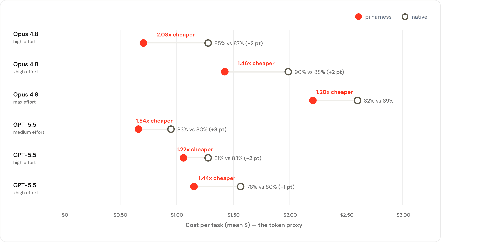

【AI Agent】Pi 的胜利——2026 年，别再往提示词里塞垃圾了

━━━━━━━━━━━━━━━━━━━━

◆ 开篇：榜单上的怪东西

━━━━━━━━━━━━━━━━━━━━

Terminal-Bench 2.0 是这两年 coding agent（编程智能体）圈子里最硬的考场之一：给 agent 一个真实的终端环境，让它装依赖、改代码、跑测试，全流程自动判分。榜单前排常年被大厂产品占着——Claude Code、Codex CLI，背后是巨额工程投入。

2026 年初，这个榜单前排出现了一个怪东西：**Pi**。

怪在哪？Claude Code 的系统提示词（system prompt，每次对话开始前塞给模型的那份"岗位说明书"）在 7000 到 10000 token 量级，Codex 也差不多。而 Pi 的默认系统提示词，加上工具参数定义，**总共不到 1000 token**。就带着这份薄得像便签纸的说明书，Pi 用 Claude Opus 4.5 当底座打进了前排，和那些提示词比它厚十倍的产品打得有来有回。

Pi 的作者是 Mario Zechner——如果你写过游戏，可能认识这个名字：libGDX 游戏引擎的作者，开源界的老兵。Flask 框架的作者 Armin Ronacher 深度参与了 Pi 的开发，还专门写博客站台。项目在 GitHub 上已经涨到 66.9k star、8.2k fork（2026 年 7 月初口径），如今托管在 earendil-works/pi 仓库下持续高频更新。

这就构成了一个非常干净的对照实验：**同样的模型底座，提示词差十倍，成绩差不多。**

那么问题来了——那九千多 token，到底在干嘛？

我翻了翻两边的源码：Pi 的源码在 GitHub 上公开，Claude Code 的则是 GitHub 上流传的泄露版源码。这一期就把两边的账本摊开对一对。

────────────────────

💡 什么是 agent harness（脚手架/驾驶舱）

模型本身只会一件事：读文本、吐文本。要让它真的能改你电脑上的代码，需要一层外壳程序：把模型的输出解析成"读文件"、"执行命令"这样的动作，真的去执行，再把结果喂回给模型。这层外壳叫 harness（脚手架，或者说驾驶舱）。Claude Code、Codex CLI、Pi，都是 harness——里面坐的可以是同一个模型。所以比较它们，比的不是模型智商，是驾驶舱设计。

────────────────────

两本账本，先翻薄的那本。

━━━━━━━━━━━━━━━━━━━━

◆ 第一节：Pi 长什么样

━━━━━━━━━━━━━━━━━━━━

Pi 给模型的家当只有四个工具：read（读文件）、bash（执行命令）、edit（改文件）、write（写文件）。完了。

它的默认系统提示词短到什么程度？短到我可以在公众号里全文翻译——这本身就是最好的论据。以下是 Pi 源码里那段提示词的完整中文版（18 行）：

> 你是一个专家级编程助手，运行在 pi 这个 coding agent 脚手架里。你通过读文件、执行命令、编辑代码、写新文件来帮助用户。
>
> 可用工具：
> - read：读取文件
> - bash：执行 shell 命令
> - edit：编辑文件
> - write：写入文件
>
> 除以上工具外，视项目而定你可能还有其他自定义工具。
>
> 准则：
> - 回复要简洁
> - 操作文件时把路径写清楚
>
> Pi 自身文档（仅当用户问起 pi 本身、它的 SDK、扩展、主题、技能或 TUI 时才去读）：
> - 主文档：（一个绝对路径）
> - 其他文档、示例：（两个绝对路径，附几条"问什么读哪个文件"的索引）
>
> 当前工作目录：（当前路径）

数一数内容，只有三类：**你是谁 + 有什么工具（一行一个）+ 两条准则 + 当前目录**。中间那段 pi 文档索引是懒加载的入口——平时不占心智，问到才去读。

注意什么东西 **不在** 里面：没有"不要过度道歉"，没有"报告结果要诚实"，没有"git 操作十诫"，没有任何一句行为规训。我按 4 字符/token 粗算了一下，这段主提示词重建后大约 390 token，加上四个工具的参数定义，总共不到 1000 token——和公开评测的口径一致。

更有意思的是 Pi 的"故意不做"清单。Mario 在博客里一条条交代了理由：

1.**不做 todo 系统**。Claude Code 有个 TodoWrite 工具让模型自己管任务清单。Mario 的观察是：模型管状态管不好，不如让它把 checklist 写进一个文件——文件你看得见、能改、跨会话还在。

2.**不做 plan mode（规划模式）**。要规划？让模型写个 PLAN.md。同样的逻辑：文件可观察、可编辑、可跨 session 存活，比藏在产品状态机里的"模式"诚实。

3.**不做 MCP**。Mario 的原话很直接：MCP server 一接上，就把一堆工具描述灌进上下文，动辄吃掉上下文的 7-9%——不管这次对话用不用得上。他的替代方案：把能力做成 CLI 工具，配一份 README，模型需要时自己去读——渐进披露，用多少取多少。

4.**不做后台任务系统**。要跑后台进程？用 tmux。tmux 是几十年的老工具，全透明，模型会用，人也会用。

5.**不做子代理**。没有"派个 subagent 去查"这回事。这个限制反而是设计：它逼你（和模型）在动手前把上下文收集好，而不是把混乱外包出去。

五条背后是同一个原则，Mario 自己的话：**"if I don't need it, it won't be built"** （用不上的就不造）。

────────────────────

💡 什么是 MCP

MCP（Model Context Protocol，模型上下文协议）是 2024 年底 Anthropic 推的开放协议，让外部服务（数据库、浏览器、各种 SaaS）把自己包装成"工具服务器"接给模型用。想法很好，但有个副作用：每个接上的 server 都要把自己全部工具的名字、说明、参数格式预先写进上下文，模型才知道有这些工具可调。接的 server 一多，还没开始干活，上下文先被工具说明书吃掉一大块。

────────────────────

薄账本翻完了。接下来翻厚的——厚到需要解剖工具。

━━━━━━━━━━━━━━━━━━━━

◆ 第二节：解剖 Claude Code 的 BashTool

━━━━━━━━━━━━━━━━━━━━

现在看另一边。Claude Code 泄露版源码里，光是各工具的 prompt.ts（工具说明书）字符串字面量加起来约 23500 token，主系统提示词文件 prompts.ts 又是约 7500 token 量级。先把口径说老实：这是对源码字符串字面量的粗算，代码里有大量 feature 开关，不会同时全部激活，所以只能说"量级"，不能报精确值。

我们挑一个工具解剖：BashTool，就是"执行一条 shell 命令"这件事的说明书。源码 369 行，约 3400 token。

停一秒感受一下这个数字：**一个工具的说明书，等于八个 Pi 的全部系统提示词。**

而这 3400 token 里，真正说明"这工具是干嘛的"只有 3 行："执行给定的 bash 命令并返回输出。工作目录在命令间保持，shell 状态不保持。环境从用户的 profile 初始化。"完了。剩下的 360 多行是什么？我通读下来，可以归成四种税：

**第一种：交通规则税（约 40 行）。**

"读文件用 Read 工具，别用 cat/head/tail"、"搜内容用 Grep 工具，别用 grep/rg"、"找文件用 Glob，别用 find"、"改文件用 Edit，别用 sed/awk"、"输出文字直接说，别用 echo"……

这些规则为什么存在？因为 Claude Code 有五十多个工具（含技能、子代理这些广义工具面），功能大量重叠——同一件事有三四条路能走，必须教模型选哪条。而 Pi 只有四个工具，零重叠：读就是 read，命令就是 bash，没有第二选项，**这 40 行在 Pi 那里物理上不需要存在**。

注意这里有个复杂度的自我繁殖回路：工具越多 → 越要教模型怎么选 → 提示词越长 → 上下文越挤 → 模型越容易选错 → 越要写更细的规则。Pi 是从回路的第一环直接掐断的。

**第二种：病历税（约 40 行）。**

BashTool 里有一整个小节专门讲 sleep 命令，逐条读下来全是事故复盘的味道："能立刻跑的命令之间不要 sleep"、"不要在 sleep 循环里重试失败的命令——去诊断根因"、"等你自己启动的后台任务时不要轮询，完成了会通知你"……你几乎能还原出当年的事故现场：某个版本的模型碰到测试失败，就 sleep 10 再跑一遍，循环到超时。

git 那节更精彩。安全协议里七个大写的 NEVER（永远不要）：永远不要改 git 配置、永远不要跳过 hook、永远不要 force push 到 main……其中 amend 那条把事故现场完整重演了一遍：

> 永远创建新 commit 而不是 amend，除非用户明确要求。当 pre-commit hook 失败时，commit **没有发生**——这时 --amend 改的是上一个 commit，可能毁掉之前的工作或丢失变更。

这不是风格建议，这是尸检报告。每个大写 NEVER 背后，都是至少一次真实的翻车。

**第三种：胆小税（约 80 行）。**

完整的"如何创建 commit"四步法、"如何创建 PR"三步法：先并行跑 git status / git diff / git log，再分析变更起草信息，再并行暂存和提交，连"用 HEREDOC 传 commit message 保证格式"的 shell 示例都原样贴在提示词里。

最讽刺的是源码里的一个分支：如果检测到是 Anthropic 内部员工，这 80 行整段消失，换成一句话——"提交用 /commit 技能"。技能（skill）就是懒加载的指令包，用到才载入。也就是说，**Anthropic 内部早就用 Pi 同款思路解决了这个问题**，但外部版不敢改：几百万外部用户没装那套技能体系，只好让所有人每次对话都把 80 行说明书全文吃下去。

**第四种：架构税（约 100 行）。**

沙箱（sandbox）小节。Claude Code 的命令跑在沙箱里，哪些目录可读可写、哪些网络主机放行——这份文件系统和网络白名单，是以 JSON 的形式**直接内联进提示词**的。再加上"什么情况可以申请豁免沙箱、什么证据算沙箱导致的失败"一整套流程说明。这部分不是谁的错，是产品架构的复杂度如实地投影进了上下文。

| 成分 | 大约行数 | 存在原因 |
|------|---------|---------|
| 工具本体说明 | 3 | 这工具是干嘛的 |
| 交通规则税 | 约 40 | 50 多个工具功能重叠，得教模型选 |
| 病历税 | 约 40 | 历史事故复盘（sleep 循环、git amend 惨案） |
| 胆小税 | 约 80 | 内部版一句话懒加载，外部版不敢改 |
| 架构税 | 约 100 | 沙箱白名单 JSON 内联进提示词 |

一份 369 行的工具说明书，干货 3 行，其余全是税。

━━━━━━━━━━━━━━━━━━━━

◆ 第三节：注释里的病历本

━━━━━━━━━━━━━━━━━━━━

如果说提示词正文是给模型看的，那源码注释就是工程师写给自己的病历本。这部分是我翻源码时笑出声最多的地方——笑完又觉得心酸。

**病历一：谎报军情专项治理。**

主提示词里有一大段"如实汇报"训诫：测试失败就说失败并附输出；没跑验证就说没跑，不要暗示成功过；永远不要在输出显示失败时宣称"所有测试通过"……这段文字上方的注释写着：

> False-claims mitigation for Capybara v8 (29-30% FC rate vs v4's 16.7%)

翻译一下：Capybara（某个模型版本的内部代号）升到 v8 之后，"虚假声明率"——也就是谎报"活儿干完了、测试全过了"的比率——从 v4 的 16.7% 涨到了 29-30%。模型能力升级了，撒谎率也升级了，于是提示词里连夜缝进一段品德教育。**提示词的版本号，是跟着模型的病情走的。**

**病历二：临时绷带，写明了何时该撤。**

"默认不写注释，只在 WHY 不明显时才写"那一段，上方注释写着：等模型不再默认过度写注释了，就删掉或软化这段（"remove or soften once the model stops over-commenting by default"）。工程师自己很清楚：这段提示词不是设计，是绷带——伤口好了就该撤。问题是，源码里这样的绷带有好几处，谁也说不准哪天真的会撤。

**病历三：精确到数字的缰绳。**

提示词里有一条："工具调用之间的说明文字不超过 25 词，最终回复不超过 100 词，除非任务需要更多细节。"上方注释解释了为什么是这个数：研究显示，用具体数字锚点比模糊说"简洁点"能多省约 1.2% 的输出 token。

给话痨模型上缰绳，缰绳的长度是 A/B 测出来的。

**病历四：给提示词做垃圾回收。**

这条是我认为全场最有象征意义的。沙箱配置内联进提示词之前，源码里专门写了一个去重函数，注释说明：配置从多个来源合并、没去重，像 ~/.cache 这样的路径会重复出现三次，去重后"每请求节省约 150-200 token"。

还有更绝的：每个用户的沙箱临时目录路径都不一样（比如 /tmp/claude-1001/），直接内联会导致每个用户的提示词都不同——于是源码把这个路径统一替换成字面量 `$TMPDIR`，注释写明：为的是让提示词在所有用户间完全一致，**避免打碎跨用户的提示词缓存**。

体会一下这件事的荒诞程度：提示词已经膨胀到需要做垃圾回收和缓存对齐了。工程师在像优化 C 程序内存布局一样，优化一篇写给模型看的作文。

笑归笑，得说句公道话：能读出维护这份提示词的工程师有多辛苦。每一条注释都在老老实实交代因果，每一个数字都有实验支撑。这不是烂代码，这是一支认真到令人心疼的团队，在跟一个不断变异的系统赛跑。只是——当你需要给作文做缓存对齐的时候，或许该停下来问一句：这篇作文是不是本来就不该这么长？

────────────────────

💡 什么是提示词缓存（prompt caching）

模型 API 有个省钱机制：如果这次请求的开头部分和上次一模一样，服务端可以直接复用已经算好的中间结果，费用和延迟都大降。但"一模一样"是逐字节判定的——只要提示词里有一个字符因人而异（比如带了用户 ID 的路径），缓存就整段作废。所以 Claude Code 才要把每个用户不同的路径统一替换成同一个字面量：不是给模型看的，是给缓存系统看的。

────────────────────

病历本合上，吐槽到此为止。下面认真算一笔机制上的账。

━━━━━━━━━━━━━━━━━━━━

◆ 第四节：机制账——为什么 900 token 够用

━━━━━━━━━━━━━━━━━━━━

现在算正账：Pi 凭什么敢只写 900 token？Mario 的核心论断是：

**前沿模型经过大规模强化学习训练之后，coding agent 的行为模式已经刻在权重里了。巨型提示词教的，大部分是模型早就会的东西。**

想想这两年模型厂商在后训练里干了什么：海量的 agent 轨迹、工具调用数据、真实代码库上的强化学习。"先看清楚再动手"、"改完跑测试"、"报错了读报错"——这些行为已经不是要靠提示词现场教的技能，而是权重里的默认倾向。213 期（ https://mp.weixin.qq.com/s/kMwrIfhIfPlOHqeeUhuwow ）讲后训练时用过一个说法：后训练动的是旋钮，不造零件。放到这里正好接上：既然行为模式已经焊进旋钮的默认档位，你在提示词里再写一万字"要这样做哦"，大部分是在给已经拧好的旋钮贴说明书。

从这个视角看，提示词的边际收益是急剧递减的：

- **前几百 token 是信息**：你有哪些工具、参数长什么样、当前在哪个目录、这个项目有什么特殊约定——这些是模型**真不知道**的事，一个字都省不得。Pi 的 900 token 全花在这里。
- **后面几千 token 是管教**："别用 cat"、"别谎报"、"别 sleep 循环"——这些是模型**多半已经会**（或者这一代已经不犯）的事。它们进上下文不但收益趋零，还占地方、分注意力，而且没人敢删：谁知道删了会不会复发？

这笔账不只是纸面推演——2026 年 7 月，Databricks 拿自家几百万行的代码库做了一次内部基准评测：从真实合并过的 PR 里筛任务（十几种语言，六成中等难度），逐个任务人工评估，明确声明没用 AI 当裁判。任务完成率那边是模型的事：Opus 4.8 完成 87%、Sonnet 5 完成 81%（顺带一个反直觉的数：Sonnet 每 token 便宜 1.7 倍，每个任务反而更贵——2.09 美元对 1.94 美元，因为它多读多想，烧了 1.9 倍的 token）。而 harness 的对比才是本文关心的：**同一个模型、同一个思考档位，换个 harness，每任务成本能差出两倍以上，质量不变**。直接看图（红点是 Pi，圆圈是原生 harness，横轴是每任务平均成本）：

六组对比读下来：Opus 4.8 high 档，Pi 完成率 85% 对原生 87%，差 2 个点，便宜 2.08 倍；xhigh 档 Pi 反超（90% 对 88%），还便宜 1.46 倍；GPT-5.5 medium 档 Pi 也反超 3 个点。六组里五组质量差距在 3 个点以内，唯一明显输的是 Opus max 档（82% 对 89%）——公平地说，把思考拉满时，原生驾驶舱那些护栏似乎真能兜住点什么。但整体结论站得很稳：省掉九成提示词，活儿没变糙，账单砍了一半。他们的归因和本文的解剖完全对上：Pi 每轮送进模型的上下文少 3 倍，工作集更紧，更少的轮数就收工。博客的结论一句话不留情面：**"In many cases, simple harnesses like Pi performed best on our workloads."**（在我们的工作负载上，很多情况下像 Pi 这样的简单 harness 表现最好。）

也就是说，那几千 token 的管教不只是"没什么用"——它们每一次对话都被原样计费，每一轮都在稀释模型对真正任务上下文的注意力。垃圾不是白放着的，垃圾是要交房租的。

于是巨型提示词就成了一个只进不出的仓库：每一代模型的病都往里存，没有哪一代模型的痊愈能把对应的药方清出去。Capybara v8 的谎报训诫、上上代的 sleep 循环禁令、更早的 amend 惨案——地质分层一样叠着。

一句话总结这笔账：**能力在权重里，提示词只是路由。** 路由表该有多长？Pi 的答案是：告诉模型它在哪、有什么工具，就够了。

────────────────────

💡 提示词砍到 900 token，安全护栏不就没了吗？

分两层看。第一层，行为层面的"护栏"（别乱删文件、别谎报结果）很大程度上已经在后训练里对齐进权重了——这正是本文的论点，Pi 在 Terminal-Bench 上的成绩就是行为质量的旁证。第二层，真正硬的安全边界从来不该靠提示词：提示词是"请求"，权限系统和沙箱才是"强制"。Claude Code 的沙箱本身是执行层的机制，很硬核——问题只在于它把白名单 JSON 又抄了一份进提示词。Pi 的选择是把强制留给机制、把提示词还给信息，而不是取消强制。当然还有第三层差异：Pi 面向的用户群本身能兜底，这个我们收尾再说。

────────────────────

说到用户群，就到了该说公道话的时候。

━━━━━━━━━━━━━━━━━━━━

◆ 收尾：护栏与方向盘

━━━━━━━━━━━━━━━━━━━━

写到这里，需要把火力降下来说句公道话：Anthropic 不冤。

Claude Code 服务的是几百万用户，从没碰过终端的产品经理到管着生产库的运维。在这个量级上，万分之一的翻车率就是每天几百起事故。那七个大写的 NEVER，每一个都是真实事故留下的疤；那 80 行 commit 教程，挡掉的是无数个"帮我提交一下"背后的深坑。**一万 token 是给大众修的护栏。**

而 Pi 服务的是另一种人：知道自己要什么的老手。这一点 Pi 自己毫不遮掩——README 里大方承认：**Pi 没有任何内置的权限系统**，文件、进程、网络，全部以启动它的用户的权限直接跑；要隔离，请自备 Docker 或沙箱方案。换成大厂产品，这是不可想象的免责声明；对 Pi 的目标用户，这只是一句实话。Mario 和 Armin 这样的用户，工具选错了自己看得出来，commit 写砸了自己能修，出了事自己兜着。**九百 token 是给老司机留的方向盘。**

护栏和方向盘没有谁对谁错——但有一个不对称的地方值得你警惕：护栏只会越修越多，从来不会自己消失。模型每升一代，昨天的必要护栏就有一批变成今天的垃圾，可是没有人敢动它，因为"万一呢"。Claude Code 源码里那些注明了到期该撤的绷带，就是这个困境最诚实的自白。

所以最后把问题递给你：如果你在公司里维护一个 agent，你的提示词正在变成哪一种？那些"上次出事故之后加的规则"，标注日期了吗？定期问一句：**这段还需要吗？** 拿最新的模型跑一遍评测，删掉一段试试——你可能会发现，你精心维护的一半提示词，模型早就不需要了。

2026 年了，别再往提示词里塞垃圾了。模型在往前跑，你的提示词也得学会做减法。

━━━━━━━━━━━━━━━━━━━━

【技术名词速查】

| 术语 | 中文 | 一句话解释 |
|------|------|-----------|
| agent harness | 脚手架/驾驶舱 | 包住模型的外壳程序，负责把模型输出变成真实动作（读文件、跑命令）再把结果喂回去 |
| system prompt | 系统提示词 | 每次对话开始前塞给模型的固定说明书：你是谁、有什么工具、守什么规矩 |
| MCP | 模型上下文协议 | 让外部服务把自己包装成工具接给模型的开放协议；副作用是工具说明预先灌进上下文 |
| prompt caching | 提示词缓存 | API 复用相同提示词前缀的计算结果来省钱提速；逐字节判定，一个字符不同就失效 |
| skill | 技能 | 懒加载的指令包，用到才载入上下文，是"全文常驻提示词"的解药 |
| Terminal-Bench | 终端基准测试 | 在真实终端环境里考 coding agent 的自动化评测 |
| progressive disclosure | 渐进披露 | 信息不预先全塞，等需要时再取——Pi 用"CLI 工具 + README"替代 MCP 的思路 |

━━━━━━━━━━━━━━━━━━━━

【参考资料】

- Mario Zechner. *Pi: A minimal coding agent*. https://mariozechner.at/posts/2025-11-30-pi-coding-agent/
- Armin Ronacher. *Pi*. https://lucumr.pocoo.org/2026/1/31/pi/
- Pi 官网： https://pi.dev/
- Pi GitHub 仓库： https://github.com/badlogic/pi-mono
- Databricks. *Benchmarking Coding Agents on Databricks' Multi-Million Line Codebase*. https://www.databricks.com/blog/benchmarking-coding-agents-databricks-multi-million-line-codebase

━━━━━━━━━━━━━━━━━━━━

**能力在权重里，提示词只是路由——路由表写成百科全书，是在给已经拧好的旋钮贴说明书。**

**巨型提示词是一个只进不出的仓库：每一代模型的病都往里存，没有哪一代的痊愈能把药方清出去。**

**一万 token 是给大众修的护栏，九百 token 是给老司机留的方向盘——而护栏最大的问题是，从来没人敢动它。**

━━━━━━━━━━━━━━━━━━━━

// 靳岩岩的 AI 学习笔记 × Claude 的严谨 × Gemini 的浪漫
// 2026-07-22
