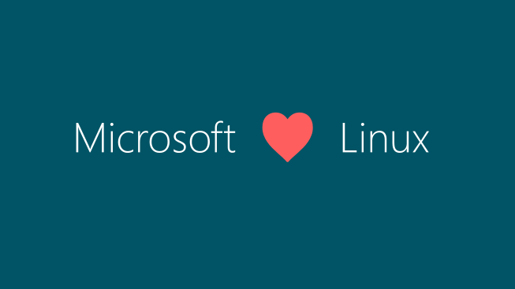

【周末杂谈】他们为什么急了——WSJ 围剿中国开源模型的报道，本身就是答案

━━━━━━━━━━━━━━━━━━━━

先说一件正在发生的事：你读到这篇文章的时候，史上最大的开放权重（open weights）模型——Kimi K3，2.8 万亿参数——的完整权重，正在往 Hugging Face 上传。月之暗面承诺的放出日期是 7 月 27 日，也就是明天，周一。

再说一件本周发生的事。2026 年 7 月 21 日，《华尔街日报》发了篇报道：Kimi K3、Qwen 3.8 Max 相继发布之后，OpenAI 和 Anthropic 的高管接连出来警告中国开源模型的"危险性"。

最出圈的一位，是 OpenAI 的战略未来主管 Dean Ball——前特朗普政府官员，本月刚入职。他在 X 上发帖说：一个由开放权重模型主导的世界，AI 将不再是市场上的商品，而是人人免费可用的"数字公共基础设施"。他管这个前景叫什么？**"反乌托邦式的地狱景象"**。

（他后来澄清：个人观点，不代表公司，也不主张打压。）

报道还提到，白宫内部认真权衡过贸易黑名单、安全警告、针对开放模型的行政命令——因为分歧，一个都没出台。先看不下去的反而是白宫自己人，AI 顾问 David Sacks 当场泼冷水：

> "将监管不确定性武器化并作为竞争工具，应该是完全不可接受的。"

请注意这个画面：**硅谷 AI 公司在游说政府管制竞争对手，白宫顾问反过来劝他们要点脸。** 剧本拿反了。

以前写这类新闻，我的角度多半是"看，他们双标"。这周想换个角度，因为双标只是表象。真正值得聊的是：**他们为什么这么急。**

━━━━━━━━━━━━━━━━━━━━

◆ 急，是因为真的疼

━━━━━━━━━━━━━━━━━━━━

急，从来不是因为对手弱。市场已经投过票了，随手数几张票：

**流量。** OpenRouter 是全球最大的模型路由平台之一，一年前美国模型占它 70% 的 token 流量，今年 6 月只剩 30% 左右——大头被 DeepSeek、Qwen、Kimi 们接走了。注意，OpenRouter 的用户绝大多数不在中国。这是全世界开发者用脚投的票。

**客户。** Airbnb 的 AI 客服跑在 Qwen 上，CEO Brian Chesky 公开夸它"又快又便宜"——夸到国会写信来质询。a16z 的合伙人估算过：在用开源模型的美国初创公司里，约八成用的是中国模型做 base。Databricks 的官方博客更直接，日常主力已经换成了 GLM 5.2（这事 258 期写过： [258期链接] ；这个模型本身，232 期有详解： https://mp.weixin.qq.com/s/4RZlRoFSSDXiLV6W8wZWig ）。

**价格与能力。** Kimi K3 这次定价 \$3/\$15，第一次敢跟 Claude Sonnet 5 对齐到一分不差，LMArena 前端盲测 1679 分登顶（255 期速报写过： https://mp.weixin.qq.com/s/dkiuqhoU-GVbH2tfe46Xnw ）。这不是"便宜替代品"的定价姿态，是平视。

**节奏。** Qwen 半年发了三代：2 月开源 Qwen 3.5（397B 总参、17B 激活，Apache 2.0），4 月 Qwen 3.6，5 月 Qwen 3.7 Max。半年三代是什么概念？你的评测报告还没写完，对象已经换了两轮。

**硬件。** 智谱的 GLM-5——745B 参数、MIT 协议开源——是在十万张华为昇腾 910B 上从头训出来的，全程没碰英伟达。DeepSeek V4 发布当天，昇腾、寒武纪、海光完成 Day 0 适配。也就是说，"卡脖子"预设的那条依赖链，正在一节一节松开。

**官方认证。** 最有意思的一票来自美国官方自己。美中经济与安全审查委员会（USCC）今年 3 月发了份报告，标题叫《Two Loops》，把中国的开放权重战略当成"产业主导权问题"正式立案分析——报告的核心警告是：芯片出口管制限制的是训练算力，**管不住已经开源出去、在软件层全球竞争的模型。**

还有一票是反向的：国会两院都在推"No DeepSeek on Government Devices Act"，要把 DeepSeek 禁出联邦设备和网络。一个东西需要专门立法来禁，恰恰说明它已经渗透到需要立法的程度了。

数完这几张票，再回头看 Dean Ball 的"地狱景象"，就不难理解了——**那不是预言，是现状描述。** 他们急，是因为真的疼。

━━━━━━━━━━━━━━━━━━━━

◆ 霸权是怎么松动的

━━━━━━━━━━━━━━━━━━━━

我试着把这件事说得结构一点。

美国 AI 霸权，过去建立在两根柱子上：**能力独占**（最强的模型只有我有）和 **分发控制**（想用，就得走我的 API，接受我的定价、我的条款、我的开关）。

第二根柱子才是收银台。API 意味着计量、计费、可撤销——今天给你，明天可以不给你，这就是权力。

而开放权重模型，正好卸掉的是第二根柱子。

────

💡 为什么开放权重禁不掉？

因为它的分发方式和 API 是两个物种。API 是一根随时可以掐断的水管；开放权重是一场已经下完的雨。checkpoint（模型存档文件）一旦放上 Hugging Face，几天之内就复制到了全世界几十万块硬盘上——你可以禁一家公司、禁一个 App、禁一条网络，但你没法把已经落在别人硬盘里的文件收回来。USCC 那份报告的焦虑，本质上就是这一条：出口管制的工具箱，是为"管住实物和服务"设计的，没有一件工具能管住"已经开源的数学"。

────

所以这一轮的削弱是**结构性**的，不是舆论层面的你来我往。第一根柱子（能力独占）如今也只剩半根——闭源最强模型还在美国手里，但差距已经小到"够用的那档是免费的"。而第二根柱子，对开放权重世界根本不存在。

明白了这个结构，才能看懂 WSJ 那篇报道的真正含义：它不是故事本身，它是症状。**围剿的音量，和霸权松动的程度成正比。**

━━━━━━━━━━━━━━━━━━━━

◆ 应对呢？还是那套七年老剧本

━━━━━━━━━━━━━━━━━━━━

面对结构性问题，他们端出来的应对，却还是熟悉的配方。这套话术到今年正好七年：

【2019】OpenAI 宣布 GPT-2——15 亿参数——**"太危险，不能发布"**。理由是怕批量生产假新闻。5 月改口分阶段发布，11 月全量放出，预期中的危害从未出现。当年参与"不发布"决定的团队成员里，有一位叫 Dario Amodei。

【2023】这位 Dario 已是 Anthropic CEO，在参议院作证：开源 AI 正走上一条 **"非常危险的道路"**——权重一旦公开就永久失控，没法撤回，没法吊销。

【2026】Anthropic 的 Claude Mythos 只向"批准组织"开放，名单一共 11 家：AWS、苹果、博通、思科、谷歌、微软、摩根大通……（152 期写过这段"太危险不便展示"的来龙去脉： https://mp.weixin.qq.com/s/nxKbM-Dmq5sTNgM5QY_4fg ）

七年三站："不发布"→"开源危险"→"只发给批准的组织"。话术越来越成熟，商业配套越来越完整。

而这一次，WSJ 报道里有句话说漏嘴了：

> "如果每个人都使用基本上无需付费的 AI 系统，那么将无法为前沿 AI 的持续开发提供资金。"

看到没有。真实的焦虑不是生物武器，不是失控——**是收不上钱。** OpenAI 和 Anthropic 都在排队 IPO，数据中心、电力合同、芯片订单，全押在"前沿 AI 是稀缺商品"这个前提上。把免费公共品叫"地狱"，大概是商业史上最诚实的一次商业模式自白。

━━━━━━━━━━━━━━━━━━━━

◆ 公道话还是要说

━━━━━━━━━━━━━━━━━━━━

写到这里必须停一下，把公道给足，免得滑进阴谋论。

第一，**Mythos 的能力是真的。** 它自主挖出过存在二十几年的系统级漏洞，这是代际跳跃，不是 PPT。第二，**安全顾虑有真实成分。** "权重公开即永久失控"在逻辑上确实成立，2026 年的模型也确实不是 2019 年的 GPT-2，狼是真的在门口。

我的矛头从头到尾只对一件事：**门票的分配方式。** "谁有资格用最强的 AI"，理论上答案该是一套安全标准——审计能力、责任承诺、使用范围；实际上那张 11 家的名单，看着更像市值排名。安全是真的，但"安全是真的"恰好成了"垄断也合理"的最好掩护。这两件事同时为真，才是最拧巴的地方。

━━━━━━━━━━━━━━━━━━━━

◆ 二十五年前的结局预告

━━━━━━━━━━━━━━━━━━━━

这场戏的结局，其实二十五年前就预演过一遍。

2001 年，微软 CEO 鲍尔默骂 Linux 是 **"癌症"**。理由和今天一字不差——不是 Linux 不好用，是它"破坏软件作为商品的价值"。你看，连病灶都诊断在同一个位置：不是安全，是收银台。

后来的事大家都知道：微软把商业模式换到云和订阅，Linux 从收入威胁变成了 Azure 上的计费单元。2015 年，微软直接在官网博客挂出了这张图：

当年的"癌症"，如今是财报的顶梁柱。这二十五年里，Linux 本身没变，变的是它在冲谁的收入报表。

所以这次的结局，我也可以提前替他们把 T 恤印好：

**"OpenAI ❤️ Open Weights"**

只是希望到时候，别有人假装第一次。

━━━━━━━━━━━━━━━━━━━━

◆ 周末闲扯几句

━━━━━━━━━━━━━━━━━━━━

写这篇的时候我一直在想一个对比。

宣言是响的：X 上的檄文、参议院的证词、白宫的会议纪要，都很响。下载是静的：一个 checkpoint 被拉下来，落进某个初创公司的集群、某个大学实验室、某台家用工作站，一点声音都没有。

但松动霸权的，从来是后者。

明天，2.8 万亿参数的权重文件会出现在 Hugging Face 上，然后被复制到我数不清的硬盘里——包括我自己的。按 Dean Ball 的定义，我们这些人算是集体搬进了"地狱"。

周末愉快。地狱的咖啡，味道还行。

━━━━━━━━━━━━━━━━━━━━

【参考资料】

- 《华尔街日报》：美国顶尖 AI 公司高管就中国模型发出警告（2026-07-21，Amrith Ramkumar / Tina Li）。 https://cn.wsj.com/articles/top-american-ai-execs-sound-alarm-on-chinese-models-e8d3500e
- USCC 报告《Two Loops: How China's Open AI Strategy Reinforces Its Industrial Dominance》（2026-03）。 https://www.uscc.gov/research/two-loops-how-chinas-open-ai-strategy-reinforces-its-industrial-dominance
- OfficeChai：OpenRouter 上美国模型份额一年内从 70% 跌至 30%。 https://officechai.com/ai/share-of-us-models-being-used-on-openrouter-has-collapsed-from-70-to-30-over-the-past-year/
- SCMP：Airbnb 选择 Qwen 而非 ChatGPT 驱动 AI 客服。 https://www.scmp.com/tech/tech-trends/article/3329921/airbnb-picks-alibabas-qwen-over-chatgpt-win-chinese-open-source-ai
- TrendForce：昇腾、寒武纪、海光完成 DeepSeek-V4 Day 0 适配（2026-04-29）。 https://www.trendforce.com/news/2026/04/29/news-huawei-ascend-cambricon-and-hygon-completed-day-0-adaptation-to-deepseek-v4/
- Congress.gov：S.765 "No DeepSeek on Government Devices Act"。 https://www.congress.gov/bill/119th-congress/senate-bill/765
- the-decoder：从 GPT-2 到 Claude Mythos——"太危险不便发布"叙事的回归。 https://the-decoder.com/from-gpt-2-to-claude-mythos-the-return-of-ai-models-deemed-too-dangerous-to-release/
- 微软官方博客：《Microsoft loves Linux》（2015-05-06）。 https://www.microsoft.com/en-us/windows-server/blog/2015/05/06/microsoft-loves-linux/

━━━━━━━━━━━━━━━━━━━━

「围剿的音量，和霸权松动的程度成正比。」

「API 是一根随时可以掐断的水管，开放权重是一场已经下完的雨。」

「霸权不是被宣言削弱的，是被 checkpoint 的下载量削弱的。」

━━━━━━━━━━━━━━━━━━━━

// 靳岩岩的 AI 学习笔记 × Claude 的严谨 × Gemini 的浪漫
// 2026-07-26
