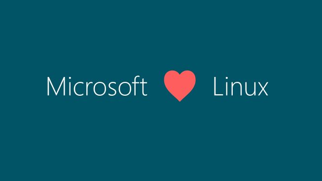

【周末杂谈】"AI 共产主义"——从 GPT-2 到 Mythos，"太危险，不便展示"的七年轮回

━━━━━━━━━━━━━━━━━━━━

先讲个本周的新闻。

2026 年 7 月 21 日，《华尔街日报》发了篇报道：Kimi K3、Qwen 3.8 Max 相继发布之后，OpenAI 和 Anthropic 的高管接连出来警告中国开源模型的"危险性"。

其中最出圈的一位，是 OpenAI 的战略未来主管 Dean Ball——前特朗普政府官员，本月刚入职。他在 X 上发帖说：一个由开放权重模型主导的世界，可能导向 "**完全的 AI 共产主义**"——AI 不再是市场上的商品，而是国家提供的"数字公共基础设施"。

他管这个前景叫什么？"**反乌托邦式的地狱景象**"。

（他后来澄清：这是个人观点，不代表公司立场，也不主张打压。）

报道里还提到，白宫内部认真权衡过几个选项：贸易黑名单、安全警告、针对开放模型的行政命令——因为内部分歧，一个都没出台。而且是白宫自己人先看不下去的。白宫 AI 顾问 David Sacks 当场泼冷水：

> "将监管不确定性武器化并作为竞争工具，应该是完全不可接受的。"

请注意这个画面：**硅谷 AI 公司在游说政府管制竞争对手，白宫顾问反过来劝他们要点脸。** 剧本拿反了。

今天这篇周末杂谈，就从"AI 共产主义"这个词聊起。因为这个词背后，藏着一段整整七年的轮回。

━━━━━━━━━━━━━━━━━━━━

◆ 说漏嘴的一句话

━━━━━━━━━━━━━━━━━━━━

同一篇 WSJ 报道里，有一句大实话，说漏嘴了：

> "如果每个人都使用基本上无需付费的 AI 系统，那么将无法为前沿 AI 的持续开发提供资金。"

看到没有。真实的焦虑不是生物武器，不是网络攻击，不是 AI 失控——**是万亿美元基础设施支出的叙事撑不住了。**

OpenAI 和 Anthropic 都在排队等 IPO。数据中心、电力合同、芯片订单，全押在"前沿 AI 是稀缺商品、可以持续收高价"这个前提上。这时候中国模型把推理价格打穿——等于当着全体投资人的面掀桌子。

所以 Dean Ball 反对的其实不是"模型危险"，是"东西便宜到收不上钱"这个**定价模式**。

你仔细品他的用词。"AI 共产主义"的定义是什么？AI 不是市场商品，而是像自来水、像公路一样的公共基础设施，人人可用，基本免费。

然后他说这是"地狱"。

**把公共品叫地狱，这可能是商业史上最诚实的一次商业模式自白。**

━━━━━━━━━━━━━━━━━━━━

◆ "太危险，不便展示"编年史

━━━━━━━━━━━━━━━━━━━━

"AI 共产主义"是新词，但配方是老的。这套"太危险"话术，到今年正好七年，值得立一块编年碑。

【2019 年：GPT-2，第一次"太危险"】

2019 年 2 月，OpenAI 宣布 GPT-2——一个 15 亿参数的模型——"**太危险，不能发布**"。理由：怕被用来批量生产假新闻、钓鱼邮件、网络冒充。

5 月，改口"分阶段发布"。

11 月，全量放出。

然后呢？**预期中的危害，从未出现。** 15 亿参数在今天连手机端模型都算不上，当年却被包装成潘多拉魔盒。

这里有个容易被遗忘的细节：当年参与做出"不发布"决定的团队成员里，有一位叫 **Dario Amodei**。

【2023 年：参议院版本】

四年后，这位 Dario 已经是 Anthropic 的 CEO。他在美国参议院作证：开源 AI 正走上一条 "**非常危险的道路**"（very dangerous path）。

理由这次升级了，而且逻辑上确实更硬：权重一旦公开就永久失控——没法撤回，没法打补丁，没法吊销。

【2026 年：Mythos，会员制的"危险"】

今年，Anthropic 的 Claude Mythos 只向"批准组织"开放。理由：防御性网络安全——这么强的漏洞挖掘能力，不能随便给人。

批准名单一共 11 家：AWS、苹果、博通、思科、谷歌、微软、摩根大通……

七年，三站："**不发布**" → "**开源危险**" → "**只发给批准的组织**"。 话术越来越成熟，商业配套越来越完整。

━━━━━━━━━━━━━━━━━━━━

◆ 必须给的公道：这次能力是真的

━━━━━━━━━━━━━━━━━━━━

写到这里必须停一下，把公道给足。因为 2026 和 2019 有一个本质区别：**这次证据是真的。**

Mythos 的漏洞挖掘能力不是 PPT：

- 自主挖出了 OpenBSD 里一个存在 **27 年**的 TCP SACK 漏洞
- 挖出了 FFmpeg 里一个存在 **16 年**的 H.264 漏洞——自动化模糊测试工具跑了 **500 万次**都没测出来（老读者可能记得 152 期提过这条：Anthropic 自家复盘后把它降级为"不关键、很难做成可用 exploit"。所以这个案例的分量在"挖得出"，不在"挖得致命"——公道要两头给）
- 挖出了 FreeBSD 一个 **17 年**的 NFS 漏洞，并且独立写出了利用代码
- 在 Firefox 漏洞测试上，Mythos Preview 达成 **181 次**有效利用——上一代 Opus 4.6 只有 **2 次**

这不是"理论上可能被滥用"，这是代际跳跃。

生态里的体感也对得上：curl 的维护者 Daniel Stenberg 现在**每天要花几个小时**处理 AI 生成的漏洞报告。连一贯对 AI 厂商安全叙事毒舌的 Simon Willison 都说了句："这次我预期他们的谨慎是合理的。"

所以先把这句话钉死：**能力是真的，风险是真的。** 2019 年的 GPT-2 是狼来了，2026 年的 Mythos，狼是真的在门口。

**但是。**

你再看一眼那个安全审查的产出物：一张名单。名单上是谁？AWS、苹果、谷歌、微软、摩根大通——**清一色美国巨头。**

"谁有资格用最强的 AI"这个问题，理论上答案应该是一套安全标准：审计能力、责任承诺、使用范围。实际上答案是什么？**市值排名。**

安全是真的。但门票的分配方式，是垄断的。

这两件事同时为真——而"安全是真的"，恰好成了"垄断也是合理的"最好掩护。

━━━━━━━━━━━━━━━━━━━━

◆ 二十五年前的同一场戏

━━━━━━━━━━━━━━━━━━━━

如果你觉得"开放模型 = 共产主义地狱"这个修辞眼熟，恭喜你，暴露年龄了。

2001 年，微软 CEO 鲍尔默骂 Linux 是"**癌症**"。理由和今天一字不差——不是 Linux 不好用，是它"**破坏软件作为商品的价值**"。你看，连病灶都诊断在同一个位置：不是安全，是收银台。

后来的故事大家都知道：微软的商业模式换到了云 + 订阅，Linux 从收入威胁变成了 Azure 上的计费单元。微软买下了 GitHub，2015 年更是直接在官网博客上挂出了这张图：

当年的"癌症"，如今是财报的顶梁柱。这不是段子——是 microsoft.com 上白纸黑字的官方博文标题：《Microsoft loves Linux》。

这二十五年里，Linux 本身没变。变的是它**在冲谁的收入报表**。

所以规律其实很简单：

**开源是圣杯还是癌症，从来不取决于技术本身，取决于它这一刻站在谁的收入模型的哪一边。**

当年靠开源冲垮微软授权费护城河的那批公司，今天坐在 AI 的收银台后面，把同一套"开放危险论"原样念了一遍——只是把"软件作为商品"换成了"智能作为商品"，把"癌症"升级成了"共产主义地狱"。

台词都懒得重写。

━━━━━━━━━━━━━━━━━━━━

◆ 一点周末闲扯

━━━━━━━━━━━━━━━━━━━━

把七年串起来看，这场轮回真正有意思的地方，不是谁虚伪——商业公司为收入模型辩护，天经地义，用不着惊讶。

有意思的是**修辞的滑动**。

2019 年，"危险"指向的是假新闻——一个公共安全问题。2023 年，"危险"指向的是权重失控——一个技术治理问题。2026 年，"危险"的解药是一张 11 家巨头的会员名单，而"开放"的罪名，终于图穷匕见地落在了定价上："**无法为前沿 AI 的持续开发提供资金**"。

七年时间，"危险"这个词从公共安全，一路滑到了资产负债表。

而"AI 共产主义"这个标签本身，反而是这场论战里信息量最大的东西。它等于承认了一件事：**开放权重模型正在把智能变成公共品**——便宜、可复制、装在自己机器上就能跑、没人能远程关掉。这个趋势描述本身，双方其实没有分歧。

分歧只在于：这是地狱，还是自来水。

对排队 IPO 的公司，这是地狱。对剩下的所有人——用模型的开发者、装模型的企业、以及每一个不想让自己的"智能供给"握在别人手里的国家——这大概就是自来水。

历史上每一次，当一样东西从奢侈品变成基础设施——电力、通信、操作系统——都有人站出来说这会毁掉创新的资金来源。然后基础设施照样铺开，创新照样发生，只是收钱的位置挪了挪。

微软花了十几年才想明白这件事，然后印了那件 T 恤。

这次大概也一样。我甚至可以提前替他们把 T 恤印好：

"**OpenAI ❤️ Open Weights**"

只是别忘了当年他们骂过什么。这也是写这篇编年史的意义——**轮回不可怕，可怕的是每次轮回都有人假装第一次。**

周末，写到这里，喝口咖啡。桌上跑着的正好是个开放权重模型——按 Dean Ball 的定义，我这算是已经生活在地狱里了。

体感还行。

━━━━━━━━━━━━━━━━━━━━

【参考资料】

- 《华尔街日报》：美国顶尖 AI 公司高管就中国模型发出警告（2026-07-21，Amrith Ramkumar / Tina Li）。 https://cn.wsj.com/articles/top-american-ai-execs-sound-alarm-on-chinese-models-e8d3500e
- the-decoder：从 GPT-2 到 Claude Mythos——"太危险不便发布"叙事的回归。 https://the-decoder.com/from-gpt-2-to-claude-mythos-the-return-of-ai-models-deemed-too-dangerous-to-release/
- 微软官方博客：《Microsoft loves Linux》（2015-05-06）。 https://www.microsoft.com/en-us/windows-server/blog/2015/05/06/microsoft-loves-linux/

━━━━━━━━━━━━━━━━━━━━

「把公共品叫地狱，是商业史上最诚实的一次商业模式自白。」

「安全是真的，垄断也是真的——而前者恰好是后者最好的掩护。」

「开源是圣杯还是癌症，取决于它这一刻在冲谁的收入报表。」

━━━━━━━━━━━━━━━━━━━━

// 靳岩岩的 AI 学习笔记 × Claude 的严谨 × Gemini 的浪漫
// 2026-07-26
