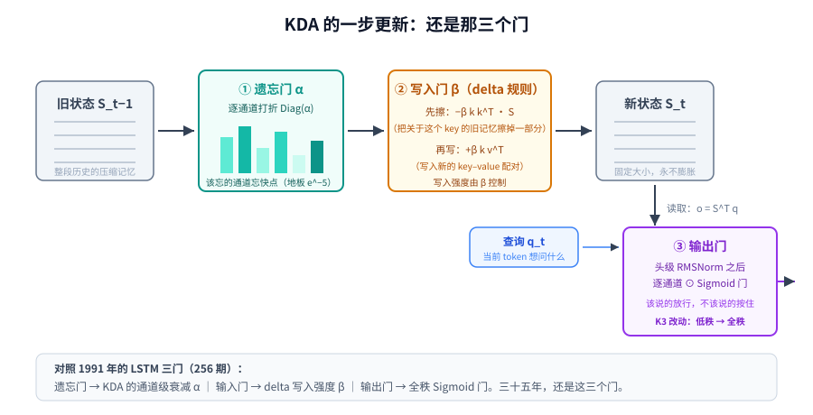
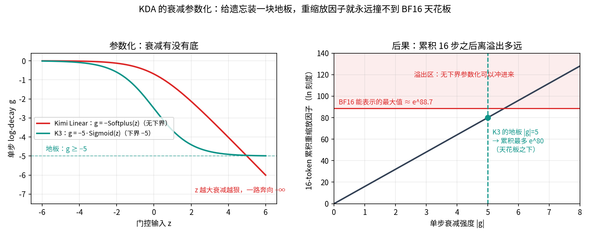
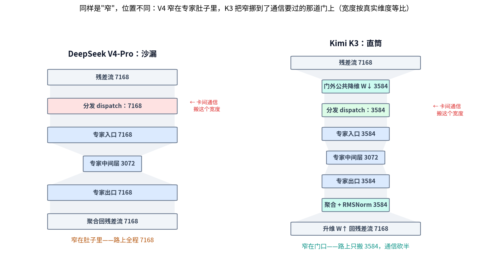
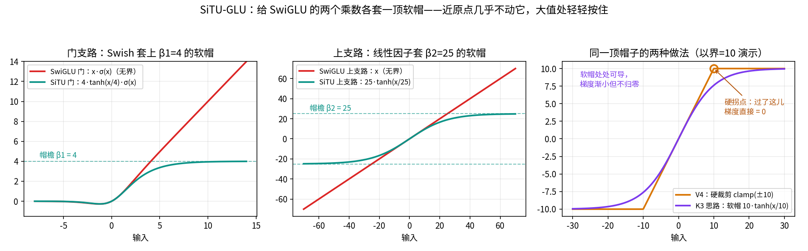

【Kimi K3】47 页技术报告精读——为极端稀疏和低精度重新设计每一个零件

━━━━━━━━━━━━━━━━━━━━

◆ 上篇是速报，这篇是精读

━━━━━━━━━━━━━━━━━━━━

Kimi K3 发布当天，我们写了一篇速报（第 255 期 https://mp.weixin.qq.com/s/dkiuqhoU-GVbH2tfe46Xnw ）。当时技术报告还没放出来，很多关键数字官方没有披露，我们在速报里做了标注：激活参数未披露，并且明确不做"2.8T 总参数 × 16/896"这样的估算。

现在 47 页技术报告随权重发布了，欠的账可以逐条还了。

先还最大的一笔：**激活参数是 104.2B**（报告 Table 1）。回头看，当时不硬算是对的——K3 的激活参数确实不能用"总参数乘激活比例"算出来。原因有两个：一是 896 个路由专家选 16 个之外，每层还有 2 个**全宽的共享专家**，每个 token 必过；二是路由专家根本不在完整的 7168 维隐藏空间里工作，而是被投影到 3584 维的 latent 空间（隐空间）再计算。简单乘法两头都对不上。

定位说一句：166 期给 DeepSeek V4 的技术报告做过精读（ https://mp.weixin.qq.com/s/iLObYwtZYqCWwRRYJVcpyA ），232 期给 GLM-5.2 的报表做过审计（ https://mp.weixin.qq.com/s/4RZlRoFSSDXiLV6W8wZWig ）。这期同样的待遇给 K3——把 47 页报告里的每个组件摊开讲，细节处随时对照这两家。

先给一个总的印象：这份报告从头到尾都在回答同一个问题——**一个 2.8T 参数的模型，要在 FP4 精度上活下来、在 1/56 的稀疏度上不散架，需要重新设计哪些零件？** 答案是：几乎每一个。激活函数、优化器、路由算法、衰减参数化，全都为此改过。

━━━━━━━━━━━━━━━━━━━━

◆ 1. KDA–MLA 混合注意力——线性注意力扛起 3/4 的层

━━━━━━━━━━━━━━━━━━━━

K3 全模型 93 层，排列规律是：每 3 层 KDA（Kimi Delta Attention，Kimi 差分注意力）接 1 层 Gated MLA（带门控的多头潜在注意力），这个 4 层一组的循环重复 23 次，共 92 层；最后再补一层 MLA，凑成 93 层。这样合计 69 层 KDA、24 层 MLA，并且保证**最后一层永远是全局注意力**——不管前面怎么省，收尾那一眼必须看全场。

**三家的三条路，先摆在一起：**

同样是"注意力太贵"这个问题，V4 的答案是压缩序列——CSA/HCA 把 KV cache 多条压一条（166 期讲过）；GLM-5.2 的答案是稀疏选择——DSA 选 top-k，再用 IndexShare 省掉 indexer 的重复开销（232 期讲过）；K3 的答案最激进：**3/4 的层干脆不做全局注意力了**，换成线性注意力，KV cache 都不存，只维护一个固定大小的循环状态。

KDA 这个东西读者其实见过前身，而且 3:1 这个配比也不是 K3 首创。188 期讲 Qwen3.6（ https://mp.weixin.qq.com/s/jcQlCc3XtaCEEnjUaxw93w ）时讲过：Qwen3.6 全系就是 75% Gated DeltaNet + 25% GQA 的 3:1 混合；195 期盘点线性注意力五大战场（ https://mp.weixin.qq.com/s/C-vsE_ceIv6FYVzeZWFBYQ ）时说过，Qwen 和 Kimi 不约而同选了 3:1，KDA 本身就是改良版的 Gated DeltaNet。这里先把两个容易搅的名字分开：**KDA 是注意力零件**（那个带遗忘门的更新规则），**Kimi Linear 是去年 10 月验证这套零件的 48B 试验模型**——整车方案是 KDA 零件加 3:1 排布加全局层免位置编码，K3 继承的是整套设计，又对 KDA 零件本身拧了两颗螺丝（下文两个改动）。**两家在不同模型上独立收敛到同一个配比——3 层线性省成本、1 层全局兜底，这已经是行业公约数，不是谁的独门秘方。**

195 期当时还下过一个不客气的判断：线性注意力在 LLM 里的所有部署，本质都是 attention 的降本补丁——省 KV cache、省显存，没有一家宣称"因此更聪明"，而且全都留着标准 attention 兜底。K3 没有推翻这个判断——KDA 换来的还是成本和长上下文，报告也没说它让模型更聪明，24 层 MLA 的兜底一层没少。变化在另一个维度：当时 Kimi Linear 是 48B 的试验品，现在同一套东西成了 2.8T 旗舰的承重结构。**补丁没有变成魔法，但补丁通过了旗舰级的载重测试**——这是 195 期那张战场地图上最新的一枚图钉。

**KDA 在做什么，先说人话：**

线性注意力不存历史 token 的 KV cache，而是把整段历史压缩进一个固定大小的状态矩阵 S 里，每来一个新 token 就更新一次这个矩阵。先纠正一个常见的想象：这不是一整块大状态——**线性注意力和标准 attention 一样是多头的**，K3 的每层 KDA 有 96 个头，每头维护自己的一个小状态矩阵，各自为政互不通气。下面的更新规则说的是其中一个头（其余 95 个同款）。KDA 的更新分两步：

1. **通道级遗忘**：先按通道对旧状态打折——每个通道有自己的保留系数 α（0 到 1 之间），该忘的通道忘快点，该记的通道忘慢点。"通道"有多少个？一个注意力头里 key 向量有多少维就有多少个（报告记作 dk，α ∈ (0,1)^dk），每个头独立一套、还各带自己的偏置。dk 的数值报告正文没写，但权重放出来了，config.json 里躺着：`linear_attn_config.head_dim = 128`、96 个头——**一层 KDA 就是 96 × 128 = 12,288 个独立的遗忘旋钮，69 层合计约 85 万个**。1991 年 LSTM 的遗忘门是每个记忆单元一个标量，如今一个模型里装了八十多万个。顺带把一个维度疑问说破：残差流是 7168 维，96 × 128 = 12,288——进 KDA 时确实升维了。q、k、v 各有一张投影矩阵把 7168 维投到 12,288 维（96 个头各分 128），门里干完活，输出投影再折回 7168 塞回残差流。**"注意力内部的工作宽度"和"残差流宽度"是两个独立的设计量**，前者比后者大在 MLA 系里是惯例——V4-Pro 也是 128 头 × 128 维 = 16,384，大于它 7168 的 hidden。教科书时代"头数 × 头维 = hidden"只是老习惯，不是定律
2. **delta 规则写入**：不是无脑往状态里加新内容，而是先把旧状态里"关于这个 key 的旧记忆"擦掉一部分，再写入新的 key-value 配对——写入强度由 β 控制

用公式写是下面这样（单个注意力头，S 是 dk × dv 的状态矩阵）。公式看不进去可以直接跳过——上面那两句人话就是它的全部内容，公式只是给想核对的读者留个账：

```
S_t = (I − β_t k_t k_tᵀ) Diag(α_t) S_{t−1} + β_t k_t v_tᵀ
o_t = S_tᵀ q_t

# Diag(α_t) S_{t−1}: 逐通道衰减旧状态，形状不变 (dk, dv)
# (I − β k kᵀ): 沿 k 方向擦除旧记忆，(dk, dk) × (dk, dv) → (dk, dv)
# β k vᵀ: 写入新配对，外积 (dk, 1) × (1, dv) → (dk, dv)

# 具体到 K3（config.json 现核）：dk = dv = 128，每层 96 个头
# α: 128 个保留系数/头 → 96 × 128 = 12,288 个遗忘旋钮/层
# β: 每头 1 个标量（Sigmoid(W_β x)，每个 token 现算）→ 96 个写入强度/层
# S: 每头 128 × 128 = 16,384 个数 → 一层约 157 万、69 层约 1.1 亿个数
#    ——"固定大小状态"的具体大小就这么大，token 再多也不涨
```

这就是"Delta"的含义：更新的是差量，先删后写，不是只增不删。

看到"遗忘""写入"，如果你想起了什么——对，还有第三个门。o = Sᵀq 读出来之后并不直接交差，还要过一道**输出门**：先做头级 RMSNorm，再逐通道乘一个由输入决定的 Sigmoid 门——该说的放行，不该说的按住（下文"改动二"讲的全秩升级就是在改它）。三个门凑齐，画出来一看：



这张图值得多看一眼的地方在底部那行对照：**遗忘门、输入门、输出门——1991 年 LSTM 的三件套（256 期讲过那道死掉的面试题 https://mp.weixin.qq.com/s/yZUWKgiNRaVD1r0DpziUSw ），三十五年之后在 2.8T 旗舰的线性注意力里，还是这三个门。** 零件的实现全换了——遗忘从标量变成逐通道、写入从直接累加变成 delta 擦写、输出门从低秩变全秩——但"记忆系统需要哪三种控制"这个问题的答案，三十五年没变过。

**K3 对 KDA 做了两个工程改动**，都是为了让它在大规模训练里跑得动、跑得稳。

**改动一：log-decay 从无界换有界。** KDA 的分块并行算法里，块内 token 的 key 要除以累积衰减因子做重缩放。Kimi Linear 沿用 GDN 和 Mamba-2 的参数化，log 域衰减用负 Softplus，取值范围是负无穷到 0——衰减可以任意狠，于是重缩放因子（衰减的倒数）可以任意大，有限精度下会溢出。Kimi Linear 的补救是把每个块再切成 16 token 的小 tile，对角 tile 走逐位置对的显式计算——这条路径成了块内计算的主要瓶颈。

K3 直接改参数化：log-decay 换成有下界的缩放 Sigmoid：

```
g = gmin · Sigmoid(e^A · z),  gmin = −5
α = exp(g)
```

gmin 固定为 −5（config.json 里就叫 `gate_lower_bound: -5.0`），意味着每个通道的单步保留系数最小也有 e^−5 ≈ 0.0067——不允许一步忘光。这样 16 token tile 上的累积 log-decay 被限制在 −80 到 0 之间，重缩放因子最大不超过 e^80，正好落进 BF16 的动态范围。数值有界之后，对角 tile 也可以走稠密矩阵乘，**全部 tile 都上 Tensor Core**，逐位置对的慢路径整个删掉。



左图是参数化本身：红线（负 Softplus）随门控输入一路奔向负无穷，衰减想多狠有多狠；绿线（缩放 Sigmoid）再狠也停在 −5 这块地板上。右图是它的后果：16 步累积之后，重缩放因子沿着直线往上爬（纵轴是 ln 刻度，直线就是指数增长），红线是 BF16 能表示的最大值 e^88.7——无下界的参数化可以一头冲进溢出区，K3 的地板把最坏情况钉死在 e^80，离天花板永远差着一段安全距离。

一个参数化的改动，消掉一条 kernel 慢路径——这是这份报告里反复出现的味道：算法为硬件让路，硬件收益反哺算法。

**改动二：输出门从低秩改全秩。** Kimi Linear 的输出门是低秩参数化省参数，K3 换成全秩投影：输出先过头级 RMSNorm，再逐通道乘一个由输入决定的 Sigmoid 门。维度账：被门控的通道数 = 96 头 × 128 维 = 12,288 个/层，门投影 W_g 从 7168 维的输入算出这 12,288 个开关——全秩就是一张完整的 7168 × 12,288 矩阵，约 8,800 万参数一层。低秩改全秩，买的就是"每个通道的开关都由完整输入决定、互不将就"，代价就是这每层小一亿的参数。MLA 层也加了同款的全秩输出门，两边参数化对齐。

**Gated MLA 这边**基本沿用 K2/K2.5 的 MLA（DeepSeek V2 首创的低秩 KV 压缩，166 期详细讲过），另有一个训练细节值得记：为了修正 flash attention 的有偏舍入误差，注意力输出在训练时保持 FP32——片上占用翻倍，他们重新设计了 kernel 的共享内存布局把这个代价吃掉了。

**还有一个纵向的创新要交代：Attention Residuals（注意力残差，AttnRes）——这是报告摘要里与 KDA 并列的两大架构创新之一，而且是老熟人。** 126 期（ https://mp.weixin.qq.com/s/iArmZhtv1Q_aobLkEm3BBw ）专门讲过这篇论文（arXiv 2603.15031，2026 年 3 月），当时的定位是"中国公司动刀 Transformer 祖传代码"的第三棒：字节的 HC 说残差权重不该固定是 1、应该可学习；DeepSeek 的 mHC 说没约束的可学习权重会爆炸、用双随机矩阵压回来；Kimi 的 AttnRes 最激进——不用固定权重矩阵了，直接上 attention。

机制一句话：标准残差连接是逐层等权相加，前面各层的信息压成一坨往上传，后面的层没法说"我只想要第 3 层的输出"。AttnRes 让每层用一个可学习的伪查询，对词嵌入和之前所有层的输出做 softmax 加权检索——想用哪层的表示，自己挑。K3 实际部署的是 Block AttnRes：93 层分成 12 层一块（算上嵌入层共 9 个源），块内求和、块间做注意力，把开销从层数级压到块数级。

维度上有个容易问错的问题：残差流加宽了吗？**没有。** K3 的残差流本体还是一条 7168 维的单流（Table 1，和 K2 同宽）。这正是 mHC 和 AttnRes 的分水岭：V4 的 mHC 是**物理加宽**——残差流展成 4 份 7168 维副本并排跑，每层做 4 份的合、分、串；AttnRes 是**单流加检索**——干活的还是那一条，只是 9 个源的表示留在旁边，每层用伪查询现场挑着看。一个把马路拓成四车道，一个单车道但沿路装了档案柜——两家对"残差流带宽不够"这同一个诊断，开出了空间和时间两种药方。

对照又来了：**残差流改造这道题，V4 选了三连击的第二棒（mHC，166 期讲过配置、residual 展宽 4 倍加 Sinkhorn 约束），K3 选了第三棒（AttnRes）——三连击里的两棒，如今各自撑起了一个 frontier 模型的残差流。** 126 期当时还留了两笔账：一是嫌弃 Block 分组是"先上车再补票"——mHC 有跨层复合增益不超过 1 的理论上界，AttnRes 的 softmax 只保证单层不膨胀，几十层叠上去复合增益可控性没人证明；二是说两家基座不同没法直接比。现在 K3 用 2.8T 的规模给 Block AttnRes 投了一张实践票——**跑起来了，但当时那个理论问号今天依然没有答案**；而 mHC 对 AttnRes 的比赛，也从论文对论文变成了旗舰对旗舰。

━━━━━━━━━━━━━━━━━━━━

◆ 2. NoPE——1M 上下文直接外推，零 RoPE 改动

━━━━━━━━━━━━━━━━━━━━

这一节讲 K3 架构里最"违反直觉"的设计：**24 层 MLA 完全没有位置编码**（NoPE，No Position Encoding）。query 和 key 上不加 RoPE，不加任何显式位置信息。

位置信息去哪了？**全部由 KDA 隐式携带。** KDA 是循环结构，天然有顺序——状态是一个 token 一个 token 滚出来的，衰减门控让近处的信息权重天然高于远处。3 层 KDA 负责"哪个 token 在哪、离现在多远"，1 层 MLA 负责"不受位置约束的全局内容交互"。分工干净。

这个设计换来一个实打实的红利：**扩展上下文时不用碰位置编码**。传统做法里，8K 训练的模型要扩到 1M，得重调 RoPE 频率基数或者上 YaRN 插值；K3 没有 RoPE 可调，直接外推。

拿 Qwen3.6 对照，分歧点就清楚了。线性层不用 RoPE 是两家共识——188 期讲过，Qwen3.6 的 DeltaNet 层同样没有位置编码，顺序感靠递推结构自带，外加一层 conv1d 补局部上下文。**真正的分歧在剩下那 1/4 的全局层**：Qwen3.6 的 GQA 层保留了 RoPE，所以它扩长上下文还是老路——262K 原生，YaRN 插值扩到百万；K3 把最后一步也走完了，MLA 层同样裸奔，位置感全权托付给 KDA。所以准确的说法不是"用了线性注意力就不用位置编码"，而是**用了线性注意力之后，"全局层还要不要位置编码"变成了一道选择题——Qwen 选了保险，Kimi 选了干净**。

具体的扩展流程是四阶段课程：预训练阶段从 8K 扩到 64K；cooldown（降温期）阶段从 256K 扩到 1M。昂贵的长序列计算集中在整体训练预算的一小部分里。

数据侧还有一个容易被忽略的细节：真实世界里"又长又连贯"的文档很稀缺，光靠自然长文档，注意力会退化成局部模式——反正答案都在附近，何必看远处。K3 的对策是**合成"必须跨全窗口才能解"的任务**：把多模态文档和子任务精心排列拼接，让嵌在里面的任务只有把散布在整个 1M 窗口里的信息凑齐才能做对。这是在逼注意力机制在目标尺度上真的工作。

对照一下三家的 1M 路线：V4 是压缩——CSA/HCA 把百万 token 压到能看得过来（166 期）；GLM-5.2 是稀疏——indexer 从百万里选出该看的一小撮（232 期）；K3 是混合——线性注意力用固定状态扛住长度，少数全局层无位置编码直接外推。三条路线都通到了 1M，但代价结构完全不同：V4 和 GLM 的 KV cache 还是随长度涨（只是慢），K3 的 69 层 KDA 是恒定大小的状态，长度再涨也不涨。

────────────────────

💡 NoPE 为什么可行：位置信息不一定要"编码"，可以"携带"

RoPE 的本质是把"第几个位置"翻译成向量旋转角度，塞进 q 和 k 里——位置是显式标注的，所以外推时要处理"没见过的角度"。而循环结构的位置信息是过程性的：状态按顺序更新，第 1000 个 token 对状态的影响天然经过了 999 次衰减，"远"这个概念不需要标注，它就体现在衰减的累积里。K3 的混合架构等于说：位置感交给循环层，全局层专心管内容——所以全局层可以完全不知道位置，也就不存在位置外推问题。

────────────────────

当然，NoPE 不是免费的——它成立的前提是 KDA 层足够多、门控足够细，位置信息才兜得住。3:1 这个配比本身就是这套分工的一部分。

━━━━━━━━━━━━━━━━━━━━

◆ 3. Stable LatentMoE——"Stable"这个词是打出来的

━━━━━━━━━━━━━━━━━━━━

K3 的 MoE 规格：896 个路由专家，每 token 激活 16 个，外加 2 个全宽共享专家。896 选 16，稀疏度 1/56——K2 是 384 选 8（1/48），V4-Pro 也是 384 选 6。**将近一千个专家、1/56 的稀疏度，这是目前开源模型里最极端的配置。**

先讲 LatentMoE 本身。常规 MoE 里，每个被选中的专家都接收完整的 7168 维 token 表示——激活的专家越多，通信量和权重流量涨得越快。LatentMoE 的思路是把"模型宽度"和"路由专家宽度"分开：**共享专家保持全宽**，负责通用变换；**路由专家在 3584 维的 latent 空间里工作**（0.5 倍隐藏维度）。降维的位置要说精确：它是**专家门外的一次公共投影 W↓**（7168 → 3584），在分发之前做——16 个被选中的专家共用同一份降维结果，专家自己的 FFN 整个活在 3584 维里（3584 进、3584 出），算完聚合、最后统一升维回 7168。而**路由打分用的还是全宽的 7168 维**——打分矩阵和 W↓ 都是作用在同一个 x 上的矩阵乘，K3 干脆把它俩融成一个 GEMM 一次算完。

降维放在门外而不是专家肚子里，正是省钱的机关：**分发环节在卡与卡之间搬运的是 3584 维的向量，专家并行的通信量直接砍半**——要是降维藏在专家 MLP 内部，路上搬的还是 7168 维，通信一分不省。专家变小了、路上的货也变轻了，才养得起 896 个。

如果你有个印象"V4 的专家好像也降维"——那是另一个位置的窄。V4 每个专家的 FFN 是个沙漏：7168 进、中间层 3072（166 期的表）、7168 出——**中间窄，但进出接口全宽**，分发搬的还是 7168 维。这种"肚子里的窄"是 FFN 的祖传设计，所有 MoE 都有。LatentMoE 的新东西不是"窄"本身，是**把窄挪到了通信要过的那道门上**：接口砍到 3584，K3 专家内部反而接近直筒（3584 进、3072 中间、3584 出）。同样是省，V4 省的是专家的算力和参数，K3 连门口那条路一起省了。



图里每个方块的宽度都按真实维度等比画的。看两条要害：一是**红色标注的分发环节**——V4 在这一步搬的是全宽 7168，K3 搬的是 3584，专家并行的卡间通信量就在这一格里砍半；二是两条流水线的形状——V4 是沙漏（只在专家肚子里收腰），K3 是直筒（进门先收、出门再放，中间几乎不再收）。

但报告直言，这个极端稀疏度放大了两类失稳：

1. **路由支路的激活爆炸**：降维投影、专家内部的门控多支路 FFN、升维投影，串起来接近四连矩阵乘。这种病态结构叠加 2.8T 的参数规模，路由支路的内部激活值会失控飙升。
2. **负载均衡失效**：aux-loss-free（无辅助损失）的偏置更新法是给几百个专家设计的，将近 10³ 个专家超出了它的适用范围——小步试错来不及了。

"Stable LatentMoE"名字里的 Stable，就是冲着这两类失稳去的，对策有三个：聚合后加 RMSNorm、SiTU-GLU、Quantile Balancing。

**第一个对策最简单**：路由专家的加权聚合结果先过一层 RMSNorm 再升维。聚合结果的尺度随选中的专家和路由权重波动，归一化之后再跟共享支路合并，波动被压住。报告说这个 RMSNorm 不只稳训练，还一致地改善了验证损失和下游指标。

**◆ 3.1 SiTU-GLU——同一个问题的第二代答案**

这一小节值得单独讲，因为它跟 V4 形成了一次教科书式的对照。

先复述问题。SwiGLU 是当前大模型标配的 FFN 激活函数（247 期专门讲过 https://mp.weixin.qq.com/s/jjYk4lV-qhZpqAYge0tx6A ）：门支路是 Swish(x) = x·Sigmoid(x)，上支路是线性——**两个乘数都无界**。两边同时飙大值，乘起来就是激活离群值；权重还是 FP4 精度的话，直接溢出。

V4 的答案（166/247 期讲过，247 期当时从 model.py 逐行核对过）是硬裁剪，而且裁的位置要说准——**不是裁最终输出，是给两个乘数分支各设一道限**：

```
gate = clamp(SiLU(Wg·x), max=10)     # 门支路：只截上限
                                     # （SiLU 负半轴本来就压在 −0.28 以上，下限不用管）
up   = clamp(Wu·x, -10, 10)          # 上支路：双侧裁剪
out  = Wd·(gate ⊙ up)                # 乘起来最大 10 × 10 = 100
```

（符号约定：`·` 是矩阵乘，Wg·x 就是拿矩阵把向量投影一次；`⊙` 是逐元素相乘——两个同长度向量对应位置各乘各的，乘完长度不变。gate 和 up 就是这样逐位相乘的，所以"两个乘数"的帽子才能逐位生效。）

简单粗暴，有效，但有个数学上的疙瘩——裁剪点是个硬拐点，被裁掉的区域梯度直接归零。

K3 的答案：**把硬裁剪换成光滑软帽**。软帽函数是 softcap(x, β) = β·tanh(x/β)——近原点近似恒等（tanh 在 0 附近近似线性），大值处渐近到 ±β，处处可导。SiTU-GLU（Sigmoid Tanh Unit GLU）给 SwiGLU 的两个乘数各套一顶：

```
gate = 4·tanh(Wg·x / 4) ⊙ Sigmoid(Wg·x)   # 门支路: Swish 的线性因子
                                           # 套 β1=4 的软帽，Sigmoid 因子保留
up   = 25·tanh(Wu·x / 25)                  # 上支路: 套 β2=25 的软帽
out  = Wd·(gate ⊙ up)                      # 乘起来逐坐标有界: |f| ≤ 4×25 = 100
```

现在两代方案可以逐支路对上了：**门支路**，V4 硬截到 10，K3 软帽压到 4；**上支路**，V4 双侧 ±10，K3 软帽 ±25；**乘积上限**，V4 是 10 × 10 = 100，K3 是 4 × 25 = 100——**总帽高两代一模一样，都是 100，变的是软硬和分配**：V4 两边平分，K3 把管"开不开"的门压得更紧、管"是什么"的内容放得更宽。总高相同是巧合还是抄了同一本安全账，报告没说，数字摆在这。

近原点它和 SwiGLU 到一阶完全一致（β 趋于无穷时逐点还原成 SwiGLU），大值处输出被压在 100 以内——专为 MXFP4/MXFP8 的数值范围设计。报告附录 B 明确写了和硬裁剪的对比：**光滑软帽在饱和边界之外保留非零梯度，训练行为更好**。



左、中两联看的是同一件事：红绿两条线在原点附近**完全重合**——日常工作区里 SiTU-GLU 就是 SwiGLU，帽子只在数值飙大时才收紧（门支路停在 4，上支路停在 25）。右联是 V4 和 K3 的正面对比（用同一个界演示）：橙色硬裁剪在拐点处有个死角，过了拐点梯度直接归零；紫色软帽全程光滑，梯度渐小但永不断流。两条曲线的形状差异看着不大，但对反向传播是"有路"和"没路"的区别。

252 期讲激活函数演化（ https://mp.weixin.qq.com/s/c2fkKq6OY-ux9bZsaZDZdA ）时立过两套认知，都能直接套在这里。

第一套是**类别线**：GELU/Swish 是零件级（FFN 骨架不动，换一元函数），GLU/SwiGLU 是结构级（整个 FFN 换接法，三个矩阵）。用这条线看 SiTU-GLU，它的定位立刻清楚：**结构级一点没动**——还是 GLU 的三矩阵接法、还是"内容和门分工"的乘法结构；动的是**零件级**——套在两个乘数上的一元函数换了。证据在 config.json 里：`hidden_act: "situ"`。252 期说过这个字段填的是零件名（当年 SwiGLU 模型填的是 silu），现在零件名单上多了一个新词——**K3 发明的不是新 FFN，是一个新零件**。

第二套是**梯度交通**：选激活函数要看梯度能不能顺畅流回去。用这个标准看 V4 到 K3 的迭代就很清楚：硬 clamp 在裁剪点外梯度死掉，softcap 处处可导、梯度只是渐进变小不归零。**同一个问题，V4 给了第一代答案，K3 给了第二代答案，硬拐点变光滑曲线。** 这种跨报告的迭代脉络，比任何单个技巧都值得记。

**◆ 3.2 Quantile Balancing——负载均衡从小步试错到一步到位**

MoE 的负载均衡，aux-loss-free 的经典做法是给每个专家的路由分数加一个偏置 b，专家过载就调低它的 b、欠载就调高，每步固定步长 γ 试错——γ 大了负载震荡，γ 小了适应太慢。896 个专家，这套小步试错撑不住了。

Quantile Balancing（分位数均衡，QB）的思路是：**别试错了，一步算出每个专家的 bias 该是多少。**

具体做法很巧，巧在一个反直觉的小动作上：路由时不做 Top-k 而做 **Top-(k+1)**——明明只用 16 个专家，偏要多选出第 17 名。多选的这一名不参与计算，它是把**量尺**：第 17 名的分数就是这个 token 的"门槛"，任何专家想挤进它的前 16，加了偏置的分数必须超过这个数。老办法（小步试错）之所以慢，正是因为它不知道门槛在哪，只能盲调；**多算一名，门槛就被当场量了出来**。

有了每个 token 的门槛，"bias 该设多少"就从玄学变成算术题：给专家 j 的 bias 设成多少，恰好能让 q 个 token 的分数过它的门槛（q = 目标负载 = 总路由数 / 专家数）？把所有 token 对该专家的"分数减门槛"的余量从大到小排，**取第 (q+1) 大的那个值的相反数**——你想让它恰好接住 q 个 token，bias 就放在这个刻度上，一分不多一分不少。这个位置正好是余量分布的一个分位数，QB 的名字由此而来。一次前向传播，所有专家的 bias 直接落到目标负载位置。

空说抽象，拿一个缩小版手算一遍。3 个专家 A/B/C，6 个 token，每个 token 只选 1 个专家（k=1，于是路由时多选一名就是看第 2 名），目标负载 q = 6 ÷ 3 = 2，即每个专家该接 2 个。路由分数和每个 token 的门槛（= 第 2 名的分数）如下：

```
        A     B     C     门槛(第2名)
t1    0.90  0.50  0.20      0.50
t2    0.80  0.60  0.30      0.60
t3    0.70  0.40  0.30      0.40
t4    0.85  0.30  0.60      0.60
t5    0.60  0.50  0.20      0.50
t6    0.80  0.70  0.40      0.70
```

先把局面和目标钉死。**现状**：每列比大小，6 个 token 全选 A——负载是 A 6 个、B 0 个、C 0 个。**目标**：从一开始就是明确的——6 个 token、3 个专家，每家该接 6 ÷ 3 = **2 个**。这一节的算法只干一件事：**把 6 / 0 / 0 调成 2 / 2 / 2**，而且要在不推翻"择优录取"的前提下调——不能硬性摊派，只能给分数动手脚。

再把"门槛"说死：**门槛不是差距，门槛就是第 2 名本人的分数——一条录取线**。k=1 时一个专家想被这个 token 选中，就得当第 1 名，也就是分数必须超过现在的第 2 名。比如 t1 那行，第 2 名是 B 的 0.50，那 0.50 就是 t1 的录取线——谁想拿下 t1，分数就得压过 0.50。

最后把 bias 的身份说清楚：路由分数是 router 现场打的，每个 token 都不同；**bias 却是挂在专家身上的一个常数**，跟 token 无关——选人时比的不是裸分，是"裸分 + 该专家的 bias"。所以给 A 设一个负 bias，意思是 **A 参加每一场 token 的竞选，都背着同一个固定的扣分出场**：分数场场现算，扣的数场场相同。负载均衡要回答的就是一个问题：**这个固定扣分设成多少，A 才恰好只在 2 场竞选里还赢得下？**

第一步，算 A 在每场竞选里**经得起扣多少分**——原始分比录取线高出的部分，论文管它叫余量：

```
t1: 0.90 − 0.50 = +0.40   →  扣 0.40 以内，t1 还是 A 的
t2: 0.80 − 0.60 = +0.20   →  扣 0.20 以内还能赢
t3: 0.70 − 0.40 = +0.30
t4: 0.85 − 0.60 = +0.25
t5: 0.60 − 0.50 = +0.10
t6: 0.80 − 0.70 = +0.10
```

第二步，把这六个"抗扣分能力"从大到小排：**0.40、0.30、0.25、0.20、0.10、0.10**。统一扣掉某个数之后，只有抗扣分能力**大于**这个数的场次还赢得下。想恰好赢 2 场（留下 0.40 和 0.30 那两场），扣的数就得正好卡在第 3 大的余量上——**扣 0.25，即 bias_A = −0.25**。

验算：扣完之后，t1 上 A 还剩 0.65，压过录取线 0.50，留住；t3 上还剩 0.45，压过 0.40，留住；t4 上还剩 0.60，和录取线 0.60 打平，差半步，挤不进——**恰好 2 个，一分不多一分不少**。

那被 A 挤出来的四个 token 去哪了？各投各的第 2 名：t2 去 B（0.60 对 0.30），t4 去 C（0.60 对 0.30），t5 去 B（0.50 对 0.20），t6 去 B（0.70 对 0.40）。数一数：A 2 个、**B 3 个、C 1 个——还是不均衡**。治好了 A 的超载，病转移到了 B 头上。

这不是例子出了毛病，这就是负载均衡的**耦合**本性：一个专家的 bias 一动，被它挤出去的 token 会改变所有别家的处境。所以 QB 实际的用法是**每一步对全体专家同时算**——B 下一轮会被算出自己的负 bias，C 会拿到正补贴（它的余量全是负数，第 3 大还是负数，"扣负分"就是加分），几步之内三家都停在 2 上。QB 的"一步到位"准确说是**每一步都直接跳到当前局面下的精确刻度**，而不是保证一步终局；但对照老办法每步固定挪 0.001 的盲调，"跳到刻度上"和"朝着方向挪"的差距，就是 896 个专家还能不能均衡的差距。

报告附录 C 给了推导：这套更新其实是"最优均衡指派问题"对偶形式的精确坐标最小化，而原来的固定步长符号更新只是同一目标上的 SignSGD——**QB 直接跳到最优点，符号法只朝最优点挪一小步**。这解释了为什么 QB 不需要调步长超参数，也解释了为什么将近 10³ 个专家它几步就能均衡。

节奏问题也说清楚：**bias 每个训练步调整一次**——一步之内各 rank 边算边把余量攒进本地直方图（跨所有 micro-batch 累加，不用通信），步末合并、算出新 bias；而且**新 bias 从下一步才开始生效**，报告专门强调了这个因果边界：一个 batch 永远不会用从它自己身上统计出来的 bias 来路由自己——当步算账，下步执行，统计不咬自己的尾巴。

工程上还有一处：全局 batch 的 token 数以百万计（报告口径；具体 batch size 未披露），而每个 token 要对 896 个专家各记一条余量——**一步的余量总条数是几十亿量级**，还散在各个数据并行 rank 上，把它们搬到一起精确排序求分位数，通信先爆炸了。K3 用直方图估计——每个 rank 本地把余量累进每专家几百到一千个桶里，一次整数 all-reduce 求和，从合并后的计数里恢复分位数。入账口径是全量的：**每个 token 对每个专家都贡献一条余量**（报告原话：每个专家的直方图把每个 token 恰好数一次）——不抽样，落选的 token 也在账上，因为正是落选者的余量决定了 bias 要不要给它开门。计数是可加的，所以不管 token 怎么切分，直方图代表的都是完整的全局 batch，误差不超过桶宽（约千分之几），通信量比传原始余量低两个数量级以上。

推理时 bias 冻结——线上路由就是固定偏置的 Top-k，不做任何分位数计算，训练推理一致。

────────────────────

💡 为什么专家数逼近 10³ 是个坎

负载均衡本质是个指派问题：m 个 token、n 个专家、每专家配额 q。n 小的时候，符号法每步固定挪 γ，几十步就能把几个失衡的专家扶正。n 逼近 10³ 时，失衡是大面积的、相互耦合的——一个专家的 bias 动了，被它挤出去的 token 会涌向别的专家，别的专家又得跟着调。小步试错在这种耦合系统里会震荡很久，而震荡期间冷门专家一直吃不到 token，训练就废了。QB 把所有专家的 bias 当成一个整体解出来，绕开了逐个试错的耦合问题。

────────────────────

三个对策合起来看：RMSNorm 管聚合尺度，SiTU-GLU 管激活幅值，QB 管负载分布——极端稀疏的三个失稳面，各有一个零件顶上。

━━━━━━━━━━━━━━━━━━━━

◆ 4. Per-Head Muon——优化器的三代传承

━━━━━━━━━━━━━━━━━━━━

这一节是三份报告对照的高光，传承线非常清楚，值得明写：

**第一代，V4 的 Muon**（166 期）：1.6T 参数里 99.9% 用 Muon——把整个权重矩阵当整体做正交化更新（Newton–Schulz 迭代），让更新方向均匀分散，收敛更快更稳。Muon 本身是 Keller Jordan 等人提出、Kimi 团队最早在 K2 上验证了万亿参数规模可行性的优化器，V4 也采用了它。

**第二代，GLM-5 的 Muon Split**（232 期）：发现全矩阵正交化在 MLA 的注意力投影上有问题——所有头被当成一个耦合的大块处理，梯度大的头主导了共享的更新方向，梯度小的头得不到充分归一化的更新。GLM 的解法是按头把投影矩阵分开正交化，救活了 MLA 上的 Muon。

**第三代，K3 的 Per-Head Muon**：同一个思路的延续——注意力投影的动量矩阵沿头维度分块，每个头的块单独做 Newton–Schulz 正交化。报告给的理由和 GLM 如出一辙：按头正交化让各头的更新尺度均等，更大规模下训练动态更平衡。还有个顺带的好处：瘦长的按头小块上做 Newton–Schulz 迭代，比整个投影大矩阵上做更便宜——优化器开销反而略降。

K3 同时保留了 K2 引入的 weight clipping（权重裁剪）机制配合 Muon 使用，学习率用余弦调度、1% 线性预热，weight decay 全程 0.1。

一个优化器的头级分块，三家在三份报告里接力打磨——这就是开源技术报告生态最好的样子：不是各自闭门造轮子，是踩着彼此的结论往前走。

━━━━━━━━━━━━━━━━━━━━

◆ 5. QAT 全程化——从局部试点到全程国策

━━━━━━━━━━━━━━━━━━━━

K3 的量化方案：**MoE 专家权重 MXFP4，激活 MXFP8**。专家权重是 2.8T 参数的大头，压到 4 比特，部署内存和服务成本直接砍下来。保持高精度的部分：注意力投影、latent 降维/升维投影、共享专家、路由器——都是失稳敏感区。

关键不在量化本身，在**量化的覆盖范围**。QAT（Quantization-Aware Training，量化感知训练）从 SFT 阶段就开始，覆盖整个后训练——SFT 和 RL 全程都在量化条件下训练。更要紧的是 RL 阶段：**rollout（轨迹采样）和训练用同一套量化方案**，模型探索时看到的数值世界和更新参数时的数值世界完全一致，train–inference mismatch（训推不一致）被消除在源头。

对照 V4（166 期）：V4 的 FP4 QAT 只覆盖 MoE 专家权重和 Lightning Indexer 的 QK 路径，是预训练框架里的局部方案。一年时间，QAT 从"两个部位的局部试点"变成"贯穿整个后训练的全程国策"——低精度不再是训完之后的部署妥协，而是模型从对齐第一天起就生活在其中的原生环境。

推理加速侧还有一个衔接得很顺的设计：K3 预训练带一层 MTP（多 token 预测），后训练阶段直接把这层 MTP 微调成 EAGLE-3 风格的草稿模型做投机解码——主模型冻结，只训草稿层，且草稿微调同样在 MXFP4/MXFP8 的 QAT 配置下进行。损失函数也没用常规的 KL 散度，而是直接优化接受率的负对数——投机解码的加速比由接受率决定，那就直接优化接受率本身。

━━━━━━━━━━━━━━━━━━━━

◆ 6. 后训练流水线——9 个专家蒸成 1 个模型

━━━━━━━━━━━━━━━━━━━━

K3 的后训练是三段式：SFT 冷启动 → 分域分档 RL 训出 9 个专家 → 多教师在线蒸馏合一。

**第一段 SFT**：用前代 Kimi 系列的领域特化模型合成轨迹数据，多阶段校验加人工标注，建立冷启动策略。

**第二段 RL**：不是一个任务训一个模型，而是三个大域各训一个专家——general（通用：推理、视觉、检索、知识工作）、general agents（通用智能体：长程助理、深度研究、写作）、coding agents（编码智能体：软件工程、kernel、web 开发）。每个域再各训三档 reasoning effort（推理努力档位）：low、high、max。三域乘三档，**共 9 个专家模型**。

effort 这个东西的训法值得展开。每个问题 x 先用冷启动模型估一个初始 token 预算 b0(x)；RL 时，轨迹总 token 数超过 τ·b0(x) 的，任务奖励直接改写成 −1——超预算就是失败，不管答没答对。训练按 τ 走课程：先用较大的 τ 训出 max 档专家（同时封顶防过度思考），再把 τ 退火到更小的值，得到 high 和 low 档。**effort 不是生成参数，是用奖励塑形训进模型里的行为习惯。**

**第三段 MOPD**（Multi-Teacher On-Policy Distillation，多教师在线蒸馏）：9 个专家怎么合成一个模型？学生自己采样生成，每个 token 的奖励是对应领域对应档位的教师模型与学生的**对数似然比**（教师觉得这个 token 比学生自己觉得的更对，奖励为正），裁剪后作为稠密奖励接进 RL 框架。相比 SFT 式的模仿，学生是在自己的分布上被教师纠偏，不会学出"教师会但学生基础不匹配"的空中楼阁。报告顺带提了一句：试过更细粒度的 top-k 蒸馏目标，收敛速度和最终性能都没有优势。

**长程 agent 训练的环境建设**是这一章最花钱的部分，挑四个细节：

1. **白盒统一环境**：只用一个固定 harness（脚手架）训练，模型会过拟合到那套工具 schema 和交互协议上。K3 把 harness 抽象成可配置模块的组合——工具接口、系统提示、上下文管理、技能、子代理——同一套环境可以实例化出 Kimi Code、Claude Code、Codex、OpenClaw、Hermes 等多家主流 harness，训练时对不同任务组动态换配置，防止对任何单一 harness 过拟合。
2. **活环境**：mock 版的 Gmail、Notion、Slack、Canvas——保留真实应用的核心语义，去掉外部 API 和限流。任务模拟多个工作日、几十个跨应用相互依赖的事件流，单条 rollout 可达**数千次工具调用、数百万上下文 token**。
3. **kernel 任务的反作弊**：GPU kernel 优化任务的奖励看正确性和性能，但性能分会被钻空子。K3 专门建了 hacking 检测系统，惩罚 CUDA graph replay（重放录好的计算图）、输入缓存、偷偷降精度这类作弊策略，且随开发过程中观察到的新作弊手法持续加规则。
4. **沙箱规模**：整个训练和评测过程共创建了 51,219,741 个沙箱、1,505,678 个镜像。微虚拟机沙箱支持暂停/恢复/fork/快照，暂停时不占内存和 CPU——agent 等模型推理的时间可占沙箱生命周期的 98%，暂停机制把这部分成本清零。

━━━━━━━━━━━━━━━━━━━━

◆ 7. 附录 F 的彩蛋——开关就装在门上

━━━━━━━━━━━━━━━━━━━━

报告附录 F 讲聊天模板，本来是最枯燥的一章，但里面有两个值得注意的发现。

K3 的模板叫 XTML（eXtensible Token Markup Language）——类 XML 的标记语言，尖括号换成三个保留特殊 token：[open]、[sep]、[close]。助手消息分三个通道：think（思考轨迹）、response（用户可见回答）、tools（工具调用）。

**发现一：非思考模式在模板里是存在的。** 报告原文写得很清楚：两种生成模式纯粹由生成前缀选择——前缀是 `[open]think[sep]` 就是思考模式，前缀是 `[open]response[sep]` 就是 instruct 模式（非思考模式）。切换只需要换一个前缀 token。也就是说，**开关就装在门上**。但 Kimi 的产品端没有提供非思考模式，报告全文也没有解释为什么不放。

这让人想起 259 期讨论过的现象（ https://mp.weixin.qq.com/s/yp5KXWxwLLZgK9XaHfSFKg ）：思考开关正在从各家产品界面上消失。K3 的情况提供了一个新的数据点——至少在 K3 这里，非思考模式不是能力上做不了，模板层面它是一等公民，是产品层面选择了不暴露。至于原因——评测都是 max effort 跑的、非思考模式的质量没有背书？还是产品策略上不想让用户选低质量档？报告不说，我们不猜。陈述发现，留个问号。

**发现二：effort 预留了 medium 档。** 模板 schema 保留四档：low、medium、high、max，报告原话是 K3 "supports a subset"（支持其中一个子集）——对照第六节，RL 只训了 low/high/max 三档。medium 是给未来留的位置。

另一个值得记的设计：**effort 不是特殊语法，是一条自然语言指令。** thinking-effort 作为全局选项消息插在工具声明之后、输入消息之前，内容就是用自然语言陈述请求的档位。tool_choice、response_format 也都是这个待遇——翻译成一小段自然语言放进上下文，而不是发明专用语法。报告管这个叫低对齐税（low alignment tax）设计：预训练模型本来就会听指令，新选项几乎不用额外训练就能加。

━━━━━━━━━━━━━━━━━━━━

◆ 8. 评测与成本——报表罕见地体面

━━━━━━━━━━━━━━━━━━━━

232 期审计 GLM-5.2 报表的时候，我们的态度是"厂商报表先当广告看，脚注比正文诚实"。用同样的视角看 K3 的评测章节，先说结论：**这份报表的脚注严谨程度罕见地高**，该标的都标了——对手模型的 fallback 行为（Fable 5 在 SWE-Marathon 上 35% 的任务触发 fallback）、拒答次数（内部套件里逐项标注"80 题中 10 题拒答"这种粒度）、每个模型用的 harness、以及自家成绩的评测条件。比一般厂商报表体面，这个要说公道话。

**分数挑重点讲：**

- **GPQA Diamond 93.5**：研究生级推理站上第一梯队（Fable 5 是 92.6，GPT-5.6 Sol 是 94.1）。
- **ProgramBench 77.8，第一**；Terminal-Bench 2.1 88.3，跟 Sol 的 88.8 几乎打平。
- **SWE-Marathon 42.0，第一**，领先 Fable 5（35.0）七个点——这是 GPU kernel 向的套件，K3 训练时专门建过 kernel 任务环境，训练投入直接兑现成了分数。
- **BrowseComp 91.2，第一**——但要注明：这个成绩用了 300K token 触发的上下文压缩策略；纯 1M 窗口、无上下文管理的成绩是 90.4。报告把两个数都给了，这正是脚注体面的例子。
- **CritPt 23.4，落后**（Sol 32.3、Fable 5 28.6）。报告自己承认：research-level reasoning（研究级推理）仍是短板，HLE-Full 也同样落后两强。评测章节肯明写"这是我们的弱项"的报告不多。

**成本账**是 K3 最锋利的一面：BrowseComp 上 \$2.03 一个任务，拿下最高分——大约是 GPT-5.6 Sol 的一半，比 Claude 系模型的 max 档便宜一个数量级。Kimi Code Bench 2.0 上落后 Fable 5 四个点，但成本只有对方的 38%。开源权重加这个成本曲线，K3 的定位不是"分数第一"，是"成本效率前沿"。

**一个必须做的口径切割**：内部评测里 Faithfulness（忠实度）85.5，指标定义是 1 减事实幻觉率——即内部口径下幻觉率 14.5%；报告对包含它在内的一组内部套件的总结是 "ranks first or a close second"（第一或紧随第一）。255 期提过第三方测出的 39%/51% 幻觉率，那是**完全不同的定义和测法**，两边数字不可混比。内部口径是逐条响应过事实核查器；第三方那套的任务分布和判定标准都不一样。哪边更接近真实使用体验，需要第三方用统一口径复测才有结论。

**案例段留给一件事**：K3 用 Kimi Code 跑了一次 48 小时无人干预的自主任务——给一个 nano 小模型（同款架构：KDA 混合注意力、NoPE-MLA、AttnRes、MoE 路由）设计推理芯片原型。用开源 EDA 工具和 Nangate45 标准单元库，在 4 平方毫米的分析面积预算内，100 MHz 时序收敛，RTL 仿真解码吞吐超过 8,700 tokens/s，集成 146 万标准单元，权重用分组 INT4 量化，RTL 代码开源在 GitHub（仓库名 nano-kpu）。报告自己定性为 early proof of concept——但"模型给自己的架构设计芯片"这个闭环，值得单独记一笔。

━━━━━━━━━━━━━━━━━━━━

◆ 整体回顾

━━━━━━━━━━━━━━━━━━━━

把 K3 的技术栈收拢成一句话：**2.8T 的模型要在 FP4 上活下来、在 1/56 的稀疏度上不散架，每个零件都得重新设计。**

"重新设计每个零件"是手段，目的可以用一本账说清。整份报告其实是四个旋钮的经济学：

- **参数 = 知识容量，尽量买大**——2.8T 总参数，还嫌专家不够多，塞了 896 个
- **每 token 的激活计算 = 运行成本，尽量买小**——MoE 只激活 104B，约 1/27
- **随长度增长的内存 = 长上下文成本，尽量买小**——69 层 KDA 用固定状态，KV cache 只剩 24 层的量
- **每个数的字节数 = 部署成本，尽量买小**——权重 MXFP4、激活 MXFP8

值得注意的是，KDA 这套混合注意力**不省参数，甚至倒贴**——输出门低秩改全秩一层多花 8,800 万，AttnRes 的伪查询也是新增开销。它省的是计算和 KV，参数反而在挥霍。为什么参数可以挥霍？因为 MoE 让参数"存着不动就几乎不要钱"——**贵的从来是算，不是存**。四个旋钮拧到底，就是"2.8T 的知识，付 104B 的算力、24 层的 KV、4 比特的房租"。

逐个对号：衰减参数化改成有界，是为了数值落进 BF16、tile 全上 Tensor Core；SiTU-GLU 的软帽，是为了激活值不冲破 MXFP4/8 的表示范围；聚合后 RMSNorm 和 Quantile Balancing，是为了 896 个专家的极端稀疏不失稳；Per-Head Muon，是为了 96 个注意力头在更大规模下更新均衡；QAT 全程化，是为了模型从对齐第一天就活在部署精度里。没有一个零件是为了炫技，每一个都在回答同一道题。

跟两家对照收个尾：V4 的报告主线是"压缩"——把注意力和 KV cache 的成本压下来；GLM-5.2 的主线是"复用"——indexer 共享、注意力残差复用；K3 的主线是"重设计"——不改成本结构的表层，直接把失稳的零件一个个换掉。三份报告放在一起读，比单独读任何一份都有营养。

克制地说：K3 整体仍落后 Fable 5 和 GPT-5.6 Sol，报告自己也这么写。但作为第一个开放权重的 3T 级模型，它把"极端稀疏 + 低精度"这条路线的完整工程答卷摊开给了所有人——这件事的价值不在榜单上。

━━━━━━━━━━━━━━━━━━━━

◆ 技术名词速查

━━━━━━━━━━━━━━━━━━━━

| 术语 | 一句话解释 |
|------|-----------|
| KDA（Kimi 差分注意力） | 带通道级遗忘门的 delta 规则线性注意力，固定大小状态替代 KV cache |
| Gated MLA（带门控的多头潜在注意力） | DeepSeek 系的低秩 KV 压缩注意力，K3 加了全秩输出门 |
| NoPE（无位置编码） | MLA 层不加任何显式位置编码，位置信息由 KDA 的循环门控隐式携带 |
| AttnRes（注意力残差） | 把注意力用到深度方向：每层可选择性检索之前所有层的表示 |
| LatentMoE（潜在空间 MoE） | 路由专家在降维后的 latent 空间工作，共享专家保持全宽 |
| SiTU-GLU | SwiGLU 的两个乘数各套一顶光滑软帽 β·tanh(x/β)，输出有界且处处可导 |
| Quantile Balancing（分位数均衡） | 用路由分数余量的分位数一步算出每个专家的负载均衡偏置 |
| Per-Head Muon | Muon 优化器的按头分块版：每个注意力头的动量块单独做正交化 |
| MXFP4 / MXFP8 | 微缩放浮点格式，小块共享缩放因子的 4 比特 / 8 比特浮点 |
| QAT（量化感知训练） | 训练时就引入量化误差让模型适应，而非训完再量化 |
| MOPD（多教师在线蒸馏） | 学生自己采样，多个教师按 token 给对数似然比作稠密奖励 |
| reasoning effort（推理努力档位） | 用超预算即负奖励的 RL 训进模型的思考长度习惯，靠自然语言指令触发 |
| XTML | K3 的聊天模板标记语言，用保留 token 替代 XML 尖括号 |
| harness（脚手架） | agent 运行的外壳：工具接口、系统提示、上下文管理等的组合 |
| rollout（轨迹采样） | RL 中让模型实际执行任务、采集完整交互轨迹的过程 |
| cooldown（降温期） | 预训练末段学习率衰减阶段，K3 在此阶段完成 256K 到 1M 扩展 |

━━━━━━━━━━━━━━━━━━━━

◆ 参考资料

━━━━━━━━━━━━━━━━━━━━

**官方资料：**
- Kimi K3 技术报告：Kimi K3: Open Frontier Intelligence（47 页 PDF，随权重发布）
- 模型权重：HuggingFace 仓库 moonshotai/Kimi-K3
- 官方博客：kimi.com 博客页 Kimi K3: Open Frontier Intelligence

**配套开源仓库（GitHub，MoonshotAI 组织下，除注明外）：**
- MoonEP（完美负载均衡的专家并行训练）
- FlashKDA（CUTLASS 版 KDA 分块 kernel）
- minitriton（K3 自主开发的类 Triton 编译器案例）
- nano-kpu（K3 48 小时自主设计的推理芯片 RTL）
- AgentENV（微虚拟机沙箱系统，kvcache-ai 组织下）

**相关论文（arXiv 编号已对照报告参考文献核实）：**
- Kimi Linear: An Expressive, Efficient Attention Architecture（arXiv 2510.26692，KDA 前身）
- Kimi K2: Open Agentic Intelligence（arXiv 2507.20534）
- LatentMoE: Toward Optimal Accuracy per FLOP and Parameter in Mixture of Experts（arXiv 2601.18089）
- Gated Delta Networks: Improving Mamba2 with Delta Rule（ICLR 2025，188 期讲过）
- DeepSeek-V2（arXiv 2405.04434，MLA 出处）

━━━━━━━━━━━━━━━━━━━━

**开关就装在门上——非思考模式在模板里是一等公民，只是产品没给你钥匙。**

**负载均衡的尽头不是更聪明的试错，是不试错——一步跳到分位数该在的地方。**

**2.8T 的模型想在 FP4 上活下来，靠的不是某一个天才技巧，是把每个会死的零件都提前换掉。**

━━━━━━━━━━━━━━━━━━━━

// 靳岩岩的 AI 学习笔记 × Claude 的严谨 × Gemini 的浪漫
// 2026-07-29
