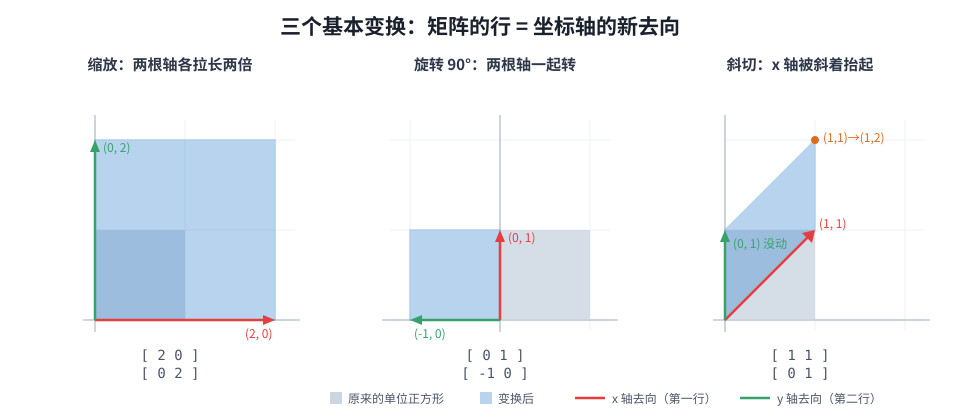

【老靳学线代】第二期：矩阵乘法——一层网络干的事，就是按分量点菜

━━━━━━━━━━━━━━━━━━━━

◆ 先立一条全系列的规矩：向量都是行

━━━━━━━━━━━━━━━━━━━━

第一期（总第 267 期： https://mp.weixin.qq.com/s/mFRQl-5qUstz7fbZ0tvpvQ ）讲了向量（一组数当成一个东西）和点积（对齐程度的一个数）。这期轮到那个被我用了两年、前几天才真正算明白的东西：矩阵乘法。

动手之前先立一条约定，不然后面每一步都要纠结一次：**本系列的向量，一律是行向量**——一横排数。

课本多半用列向量（一竖排），但我们选行，理由很硬：**这是 AI 面向的线性代数，代码里就是行**。

- 模型里一层的输入张量是 [序列长度, 4096]——**每一行是一个 token 的向量**，多少个 token 就摞多少行
- embedding 词表是 [词表大小, 4096]——**每一行是一个词**，查一个 token 就是取一行
- 代码里的线性层写的是 x @ W——**行向量在左，矩阵在右**

所以变换写成 **x · W**：向量从左边进，矩阵在右边等着。论文里常见的 W · x 是列向量记法，说的是同一件事，方向反着写而已——遇到了心里翻译一下就行，这个翻译本身也是本领：知道两套记法为什么长得不一样的人，读论文不会晕。

行约定还附赠一个甜头，这期结尾你会看到：**变换的先后顺序和阅读顺序一致**，x 先过 A 再过 B 就写 x · A · B，从左读到右。列向量的世界里这串要反着写，逆序读，很折磨人。

━━━━━━━━━━━━━━━━━━━━

◆ 话题 1：向量 × 矩阵——按分量点菜

━━━━━━━━━━━━━━━━━━━━

课本教矩阵乘法，是那句著名的"行乘列"口诀：结果的每个位置，等于左边某行和右边某列的点积。口诀没错，我当年也背下来了——但只背口诀的人（比如我）永远不知道这个运算**在干什么**。

换一个能看见画面的读法。x · W 里，x 是一个行向量，W 是一摞行向量（每行和 x 一样长短不限，行数必须等于 x 的分量个数）。那么：

**x · W = 用 x 的各个分量当权重，把 W 的各行加权求和。**

x 的第一个分量说"W 的第一行我要这么多"，第二个分量说"第二行我要这么多"……全部要完加在一起，就是输出。**一个向量过一层线性变换，就是拿自己的分量当菜单，把矩阵的行点一遍菜。**

分量是 0 的位置，对应的那行根本没被点到——这个细节手算题里会看见。

────────────────────

💡 手算一：同一次乘法，两种算法，一个答案

x = (1, 2, 0)，W 是 3×2 矩阵，三行分别为 (1, 0)、(0, 1)、(2, 3)。求 x · W。

**算法一：按行点菜**（行视角，几何视角）

x · W = 1×(1, 0) + 2×(0, 1) + 0×(2, 3)
      = (1, 0) + (0, 2) + (0, 0)
      = (1, 2)

注意第三行 (2, 3)：x 的第三个分量是 0，这行菜没点，白写。

**算法二：逐列点积**（列视角，课本口诀）

W 的第一列是 (1, 0, 2)，第二列是 (0, 1, 3)。

输出第一个分量 = x · (1, 0, 2) = 1 + 0 + 0 = 1
输出第二个分量 = x · (0, 1, 3) = 0 + 2 + 0 = 2

结果 (1, 2)——**两种算法，同一个答案，永远如此。**

这是第 1 期"算术版 = 几何版"的续集：同一次矩阵乘法，行视角读出来是"点菜"（输出由 W 的行拼成），列视角读出来是"打分"（输出的每个分量是 x 和 W 某列的点积）。**矩阵乘法 = 一排点积**，点积就是它的原子。

────────────────────

**它在大模型里是谁：每一层的主体动作。**

拿本系列的标本 DeepSeek V4 Flash（残差流 4096 维，数字都来自它的 config.json）算几笔真账：

- **Q、K、V 投影**：attention 里每个 token 的 q、k、v 向量，都是残差流向量过 x · W 点菜点出来的。先看 2017 年《Attention Is All You Need》的原版：d_model 是 512 维，8 个头、每头 64 维，**每个头有自己独立的三张小矩阵** W_q、W_k、W_v，各是 [512, 64]——q、k、v 三兄弟完全平等，各点各的菜，谁也不压谁（工程上把 8 个头的小矩阵拼成三张 [512, 512] 一次乘完，数学上是一回事）。这个"三张平等矩阵"的形态才是注意力的默认长相，大部分模型至今如此。V4 Flash 是个特例：q 接力两张矩阵 [4096] @ [4096, 1024] → [1024] 再展开成 64 个头，k 和 v 更狠，64 个头共用一份 [4096] @ [4096, 512] → [512] 的压缩包。为什么放着 4096 维不用、非要先压小——这是"秩"的主菜，本系列后面专门讲，这里先把两种形状账都记下
- **FFN 的升维和降维**：先一次 x · W 升上去，过激活函数，再一次乘回来——第 252 期（ https://mp.weixin.qq.com/s/c2fkKq6OY-ux9bZsaZDZdA ）讲的 SwiGLU，骨架就是三张矩阵。V4 Flash 的 FFN 是专家制（MoE）：256 个专家每人揣一套三张矩阵（[4096, 2048]、[4096, 2048]、[2048, 4096]），每个 token 挑 6 个专家再加 1 个常驻专家——7 套"三张矩阵"各自点菜，结果加权合并。骨架没变，只是从一大套变成很多小套
- **出口给全词表打分，是全模型最大的一次矩阵乘**：入口的 embedding 查表是按索引取行，不算乘法；但走到出口，模型要回答"下一个词是十二万九千个候选里的哪个"——残差流向量乘输出矩阵：[4096] @ [4096, 129280] → [129280]，一次点菜点出全词表的分数。按列视角读：129280 列，每列是一个候选词的"标准像"，输出的每个分量就是当前向量和这个词的点积——**给全词表打分 = 十二万九千次点积，一次矩阵乘打包完成**。第一期说过点积是"对齐程度"，模型选词就是在找和当前状态最对齐的那个词

反向投影一下（这是本系列的固定动作：不光认出它，还要问为什么非它不可）：**为什么每层的主体是矩阵乘？** 因为"全连接"这个需求——输出的每个旋钮，都要听取输入所有旋钮的加权意见，而"每个输出 = 输入的一种加权组合"写成数学，就恰好是一次矩阵乘法，不多不少。想让 4096 个旋钮互相通气，矩阵乘是最朴素的那个答案。

还有一层硬件的所以然：矩阵乘 = 一大排**互相独立**的点积，谁先算谁后算无所谓——天然并行。GPU 整张卡的设计就是围着这件事转的，第 240 期（ https://mp.weixin.qq.com/s/7ROESDoxhexsMWL9HVz8wA ）逐行装过的 GEMM，就是这个运算在 CUDA 里的名字。**模型选择全连接，硬件选择陪它把这一种运算做到极致**——软硬两边在矩阵乘上会师，才有了今天的大模型。

━━━━━━━━━━━━━━━━━━━━

◆ 话题 2：矩阵 × 矩阵——变换的接力

━━━━━━━━━━━━━━━━━━━━

矩阵乘矩阵，不用学新东西：**A · B 就是把 A 的每一行，各自拿去乘 B**。A 有几行，就做几次"向量 × 矩阵"，结果摞起来。

这个读法直接给出大模型里最常见的用法：**一摞向量同时过同一个变换**。序列里有 500 个 token，把 500 个行向量摞成矩阵 X（500 行、4096 列），一句 X · W 就把所有 token 一次投影完——不是循环 500 次，是一次矩阵乘。你在代码里见到的每个 `@`，几乎都是这种"批量点菜"。

**形状账**是读模型代码的基本功，规则一条：

```
[m, k] @ [k, n] -> [m, n]
# 左边的列数必须等于右边的行数（k 对上 k），
# 输出取"左边的行数 × 右边的列数"

X [500, 4096] @ W [4096, 减小或增大的维度] -> [500, 新维度]
# 500 个 token 各自换了一身维度，行数（token 数）不动
```

中间那个 k 消掉了——它是"接口"，两边必须严丝合缝，这就是为什么代码注释里总在标形状：形状对不上，乘法根本不成立。

形状账是代数脸，矩阵还有一张几何脸：**一个 n×n 方阵就是一个"空间变换"——把每个点搬到新位置**。二维里最好看，三个基本动作各是一张 2×2：

```
缩放 [ 2  0 ]    旋转90° [  0  1 ]    斜切 [ 1  1 ]
     [ 0  2 ]            [ -1  0 ]         [ 0  1 ]
```

怎么读？用**话题 1 手算一里的"算法一：按行点菜"**——特意提醒一句：上学时我们背的都是算法二（行乘列口诀），用算法二看下面这段会一头雾水，必须切到算法一的视角。拿两个最特殊的点下单就看懂了。先说清"轴"指什么：x 轴指它上面的标杆点 (1, 0)——沿 x 方向走一步的位置；y 轴同理是 (0, 1)。让它俩过矩阵：

```
(1, 0) · W = 1×第一行 + 0×第二行 = 第一行
(0, 1) · W = 0×第一行 + 1×第二行 = 第二行
```

这是最简单的两份订单：(1, 0) 只点了第一行一份菜，落地位置就是**第一行本身**；(0, 1) 落在第二行。所以：**矩阵的第一行 = 点 (1, 0) 被搬去了哪，第二行 = 点 (0, 1) 被搬去了哪**——不是新规则，就是点菜算法代入两个特殊点。

这两个点为什么值得单独看？因为任何点都是它俩配出来的：(x, y) = x 份 (1, 0) + y 份 (0, 1)。过完矩阵，配方不变、原料换新——变成 x 份"新 (1,0) 位置" + y 份"新 (0,1) 位置"。**盯住两个标杆点的去向，整个平面怎么动就全知道了。**下面三条里说"x 轴搬到哪"，都是"点 (1, 0) 搬到哪"的简写。

- 缩放：x 轴搬到 (2, 0)，y 轴搬到 (0, 2)——两根轴各自拉长两倍，整个平面放大
- 旋转：x 轴搬到 (0, 1)（原来 y 轴的位置），y 轴搬到 (-1, 0)——两根轴一起转了 90 度
- 斜切：y 轴原地不动，x 轴被斜着抬到 (1, 1)——点 (1, 1) 跟着被搬到 1×(1, 1) + 1×(0, 1) = (1, 2)，正方形被推成平行四边形，一摞扑克牌被推歪的那个形状



回头看手算二的 A 和 B——它们就是两张斜切矩阵，一张竖着推、一张横着推。所以那道题算的其实是：先竖推再横推 vs 先横推再竖推，落点不同。这就引出：

**另一件必须亲手撞一次的事：A · B ≠ B · A，顺序不能换。**

────────────────────

💡 手算二：亲手撞一次"不能交换"

A 的两行是 (1, 1) 和 (0, 1)；B 的两行是 (1, 0) 和 (1, 1)。算 A · B 和 B · A。

**A · B**：拿 A 的每行去乘 B——

第一行：(1, 1) · B = 1×(1, 0) + 1×(1, 1) = (2, 1)
第二行：(0, 1) · B = 0×(1, 0) + 1×(1, 1) = (1, 1)

A · B 的两行 = (2, 1) 和 (1, 1)

**B · A**：拿 B 的每行去乘 A——

第一行：(1, 0) · A = 1×(1, 1) + 0×(0, 1) = (1, 1)
第二行：(1, 1) · A = 1×(1, 1) + 1×(0, 1) = (1, 2)

B · A 的两行 = (1, 1) 和 (1, 2)

**不相等，而且不是差一点，是两个不同的变换。**

────────────────────

不能交换这件事，几何上一点都不神秘：矩阵是变换，乘法是**接力**——x · A · B 是"先做 A，再做 B"。先斜切再旋转，和先旋转再斜切，落点当然不同；先穿袜子再穿鞋，和先穿鞋再穿袜子，更是两种人生。**顺序就是信息**，这是矩阵乘法和数字乘法最大的性格差异。

────────────────────

💡 为什么屏幕上的二维变换要用 3×3 矩阵

做过界面或游戏的人都见过：屏幕坐标是二维的，变换矩阵却是 3×3。多出来的一维不是花架子，是在修线性变换的一个先天缺陷——**平移装不进矩阵乘法**。

矩阵乘法有条死规矩：零向量乘任何矩阵还是零向量——**原点永远不动**。旋转、缩放、斜切都是绕着原点做的，2×2 矩阵全能胜任；但"整体挪三个像素"要求原点也跟着挪，2×2 写不出来，只能在乘法之外单独加一笔：x · A + b。加法一混进来，"一长串变换预乘成一张矩阵"的好处就没了。

修法是个聪明的补丁：给坐标**多带一个恒为 1 的分量**——点 (x, y) 写成 (x, y, 1)。这样 3×3 矩阵的第三行就有了用武之地：

```
(x, y, 1) · [ 1   0   0 ]
            [ 0   1   0 ]  =  (x + 3, y + 5, 1)
            [ 3   5   1 ]
```

按点菜读法一目了然：第三个分量那个 1，把第三行 (3, 5, 1) 原封不动点了一份加进来——**平移被那个 1 "点"出来了**。加法被藏进了乘法，于是旋转、缩放、平移全是 3×3 矩阵，一条 UI 变换链再长也能预乘成一张，一次乘完。

这个"多带一个 1"的补丁在神经网络里也有同款：线性层的 x · W + b，那个偏置 b 一样可以折进增广矩阵——数学上是同一个把戏。顺带一提，图形学两大阵营的记法之争也和本系列有关：DirectX 用行向量（和我们一致），OpenGL 用列向量——又一个"同一件事、两套写法"。

────────────────────

这也兑现了开头行约定的甜头：x · A · B，从左往右读就是执行顺序。43 层网络就是一场 43 棒的接力——残差流向量从左边进，一路 · 过去（当然，层与层之间还夹着激活函数和归一化这些非线性零件，不然 43 张矩阵可以预先乘成一张，43 层白盖——为什么必须夹，第 251 期讲过（ https://mp.weixin.qq.com/s/FhMVxRoPmXUZAuv9cyNgjw ），本系列讲到矩阵的"拍扁"时还会回来）。

━━━━━━━━━━━━━━━━━━━━

◆ 本期小结

━━━━━━━━━━━━━━━━━━━━

- **行向量约定**：向量是行，变换写 x · W，和代码的 x @ W 对齐；论文的 W · x 是列记法，心里翻译
- **向量 × 矩阵 = 按分量点菜**：x 的分量当权重，加权组合 W 的各行；列视角读出来是一排点积——矩阵乘法的原子是点积
- **矩阵 × 矩阵 = 批量点菜 + 变换接力**：形状账 [m, k] @ [k, n] → [m, n]，接口 k 必须严丝合缝；A · B ≠ B · A，顺序就是信息
- **为什么是它**：全连接的数学形式恰好是矩阵乘，独立点积天然并行恰好是 GPU 的最爱——软硬会师

两期下来，模型的日常已经能看懂一半了：token 是行向量，打分是点积，过层是点菜，批量是摞行。剩下的另一半——为什么点完菜信息会压缩、会丢、会只剩几个方向——从秩开始讲。

━━━━━━━━━━━━━━━━━━━━

◆ 技术名词速查

━━━━━━━━━━━━━━━━━━━━

| 术语 | 一句话解释 |
|------|-----------|
| 行向量 | 一横排数；本系列所有向量的默认形态，对齐代码里的张量行 |
| x · W | 行向量右乘矩阵：拿 x 的分量当权重，加权组合 W 的各行 |
| W · x | 同一件事的列向量记法，论文常用；心里翻译成 x · W |
| 形状账 | [m, k] @ [k, n] → [m, n]；中间的 k 是接口，必须相等 |
| lm_head（输出矩阵） | [4096, 129280]；残差流向量乘它 = 给全词表 129280 个候选各算一次点积打分 |
| GEMM | 通用矩阵乘法的 CUDA 名字，GPU 上最热的运算 |
| Q/K/V 投影 | 残差流向量各过一次 x · W，得到打分和取货用的三个向量 |
| 接力（复合变换） | x · A · B = 先做 A 再做 B；顺序不能换 |

━━━━━━━━━━━━━━━━━━━━

**只背"行乘列"口诀的人，永远不知道矩阵乘法在干什么——它在拿你的分量当菜单，点矩阵的行。**

**形状账里中间那个 k 会消掉——它是接口，两边严丝合缝，这就是代码注释里总标形状的全部原因。**

**A · B ≠ B · A：先穿袜子再穿鞋，和先穿鞋再穿袜子，是两种人生——顺序就是信息。**

━━━━━━━━━━━━━━━━━━━━

// 靳岩岩的 AI 学习笔记 × Claude 的严谨 × Gemini 的浪漫
// （发布日期待定）
