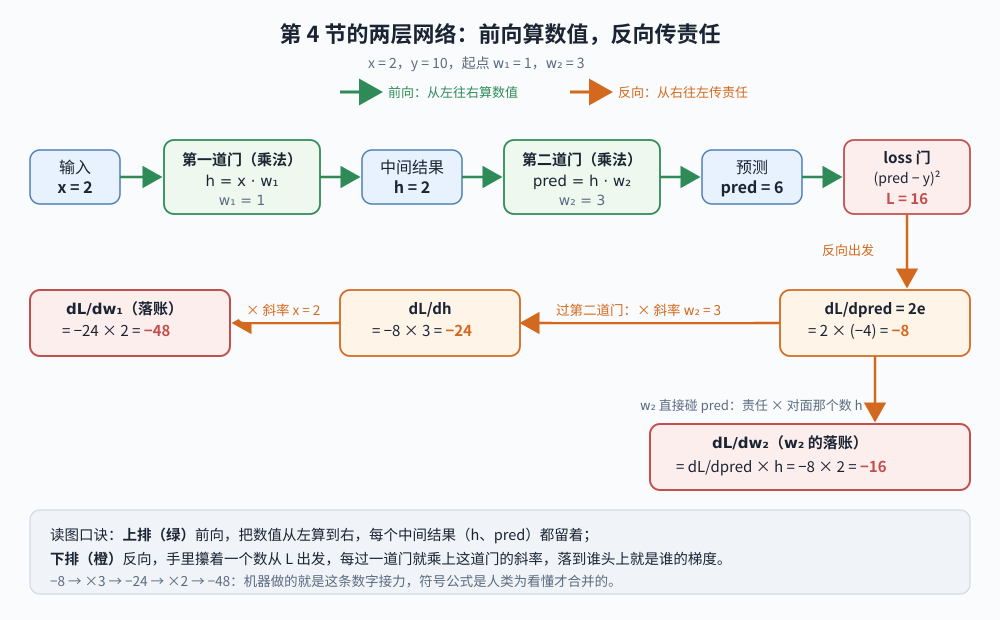
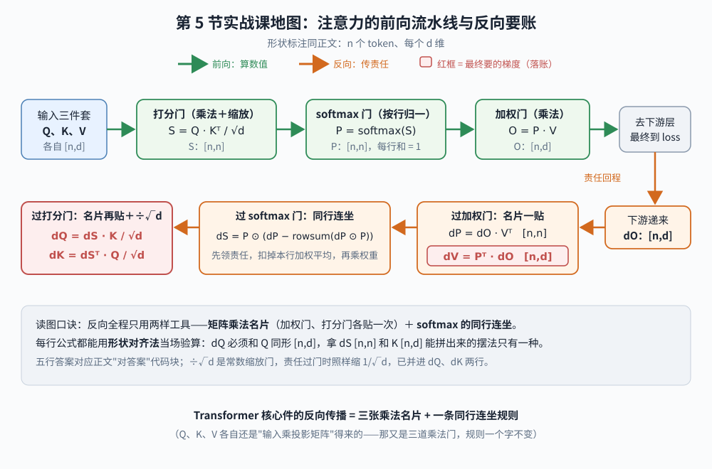

【老靳学算法】第一期：梯度下降到底怎么算——学会手算 attention 的反向传播公式

━━━━━━━━━━━━━━━━━━━━

◆ 起因：一笔两百多期的旧账

━━━━━━━━━━━━━━━━━━━━

先坦白：这个号写了快三百期 AI 文章，"训练就是梯度下降"这句话少说出现过几十次，但"梯度下降到底怎么算"——就是拿笔在纸上，一个数一个数地算出来那种"怎么算"——我一直没真算过。每次都是"沿着梯度反方向走一小步"一句话滑过去，至于梯度是个什么数、反方向是哪个方向、一小步是多小，全靠意会。

前阵子开了《老靳学线代》系列，纸笔上手算了两期，越算越发现一件事：**我缺的课哪里只有线性代数**。线代补的是"矩阵是什么形状"这种静态结构，可模型是怎么一步一步被训练出来的——那些动态过程，是另一摞没还的账。所以再开个姊妹系列《老靳学算法》，还是同一套办法：纸笔实算，一期焊死一个概念。第一期就从欠得最久的这笔还起：**把梯度下降从头到尾手算一遍**。全程只用得上初中的代数和一点点求导（用到的地方现推，忘了导数也能跟上）。算完你会发现：这个支撑起整个 AI 时代的算法，核心真的就是小学除法级别的四则运算——难的从来不是算，是想清楚每个数在干什么。

━━━━━━━━━━━━━━━━━━━━

◆ 1. 困境先摆出来：几百万个旋钮，该往哪儿拧

━━━━━━━━━━━━━━━━━━━━

按系列规矩，先说它解决什么困境，再说机制。

训练一个模型，本质是这么个处境：你有一个函数，输入是模型的全部参数（权重），输出是一个数——loss，衡量"模型现在错得有多离谱"。你想让这个数变小。麻烦在于：参数不是一个，是几百万、几十亿个，每个都是一个可以拧的旋钮。**你面前是一堵旋钮墙，每个旋钮该往左还是往右、拧多少，谁告诉你？**

穷举肯定不行——每个旋钮试两个方向，组合是 2 的几十亿次方。梯度下降的回答简单到让人起疑：**挨个问每个旋钮一个问题："我把你往右拧一丁点，loss 是变大还是变小、变多快？"然后所有旋钮朝着让 loss 变小的方向，同时各拧一小步。** 这个"变多快"，就是导数；几十亿个导数排成一列，就是梯度。

听着还是抽象？好，上纸笔。

━━━━━━━━━━━━━━━━━━━━

◆ 2. 一个旋钮的世界：手算三轮，loss 从 16 到 0.001

━━━━━━━━━━━━━━━━━━━━

把世界缩小到只有一个参数，造个最小的"模型"：

- 模型：pred = x · w（pred 是 prediction 的缩写，模型的**预测值**——输入 x 乘权重 w，吐出一个预测。就这一个权重；输入在左权重在右，沿用线代系列 x @ W 的约定）
- 数据：x = 2 时，正确答案 y = 10（也就是说，w 的理想值是 5——但模型不知道，我们看它自己摸过去）
- loss：L = (pred − y)²，预测和答案差多少，平方一下（平方是为了不分正负、错得越多罚得越狠）
- 起点：w₀ = 3（下标记轮数：w₀ 是出发点，拧一次变 w₁，再拧变 w₂……）

**第一步，先算现在错多少。** pred = 2 × 3 = 6。预测和答案的差专门起个名，叫误差 e（error 的缩写）：e = pred − y = 6 − 10 = −4，loss = e² = (−4)² = 16。这个 e 后面会反复出场，它就是"错多少"的本体。

**第二步，问旋钮那个问题：w 动一丁点，L 怎么动？** 这就是求导。L = (xw − y)²，复合函数求导——外层平方的导数是"2 倍的里面"，里层 xw − y 对 w 的导数是 x，连乘：

dL/dw = 2 · (xw − y) · x = 2 · (−4) · 2 = **−16**

（先认一下记号：dL/dw 念"L 对 w 的导数"，d 不是除法——分母写"谁动"，分子写"看谁跟着动"。求导时 x 和 y 是定死的数据、当常数处理，全场唯一的变量是 w。）

────────────────────

💡 求导公式我早忘光了：全场只用三条，含我记错的那条

坦白：写到这步我卡住了。我只记得 (x²)' = 2x，于是把上面的求导写成了 2·(xw−y)'——错的。全场用到的公式其实只有三条，一次补齐：

**① 幂函数**：(u²)' = 2u。"平方的导数是 2 倍的它自己"——注意是 2u 不是 2，里面那坨要原样保留。

**② 常数**：常数的导数是 0；(c·w)' = c。所以 (xw)' = x（x 是定死的数据，等同系数），(y)' = 0（y 压根不含 w，w 怎么动它都纹丝不动，直接扔掉——这就是"y 怎么处理"的答案）。这条我还额外栽了一跤：上学时求导永远是"对 x 求"，见了 x 手就痒——我顺手把 x 当变量求了一遍。**这里角色恰好反转：x 是数据、定死的，w 才是要拧的旋钮**，训练场上永远是对 w 求导。这个反转不适应，后面全乱。

**③ 链式法则**：套娃函数求导，外层里层各求各的，然后**相乘**：(f(g(w)))' = f'(g(w)) · g'(w)。我记错的就是这条——只记得外层的 2，忘了还要乘里层的导数。

拿本题走一遍：里层 g = xw − y，外层 f = g²。外层求导按 ①：2(xw − y)，里面原样抄；里层求导按 ②：(xw − y)' = x − 0 = x；最后按 ③ 相乘：2(xw − y) · x。缺谁都不行——验算 f = 3w 的情形：(3w)² = 9w²，求导是 18w，正好等于 2·(3w)·3；只乘外层就只剩 6，对不上账。

为什么会多这一乘？直觉是**变化率层层放大**：w 动一丁点，里层以 x 倍速跟着动，外层平方再按 2 倍的自己放大——两级齿轮，传动比相乘。记住这个感觉，第 4 节它会换个名字隆重登场。

────────────────────

这个 −16 念出来就是："w 往右拧一丁点，loss 以 16 倍的速率**下降**"（负号=下降）。所以该往右拧——**沿导数的反方向走**，负的反方向就是正方向。

**第三步，拧。** 梯度下降的全部更新公式就一行：

w ← w − 学习率 × 导数

学习率（learning rate）就是步子大小，先取 0.1。把公式里每个符号先对上号再代数：学习率 = 0.1，导数就是第二步算出的 dL/dw = −16，旧值 w₀ = 3，拧完得到 w₁：

w₁ = w₀ − 学习率 × dL/dw = 3 − 0.1 × (−16) = 3 − (−1.6) = 3 + 1.6 = **4.6**

注意那步负负得正：导数是负的（往右拧 loss 降），公式里的减号把它翻成加——w 变大，正好朝理想值 5 挪。**"沿反方向走"不用你操心方向，减号自动搞定**：导数为负就加、为正就减，永远朝 loss 下降的方向。

有没有用？验算：pred = 2 × 4.6 = 9.2，e = −0.8，loss = 0.64。**一步之内（w₀ → w₁），loss 从 16 掉到 0.64。**

再来一轮，还是那三步，代入时盯紧两个容易混的角色：**pred 是模型这轮的猜测（刚变成 9.2，每轮都变），y 是标准答案（永远是 10，全场不动）**。求导公式里的 xw 就是 pred：

dL/dw = 2 · (xw − y) · x = 2 × (9.2 − 10) × 2 = 2 × (−0.8) × 2 = −3.2

更新：w₂ = w₁ − 0.1 × (−3.2) = 4.6 + 0.32 = 4.92。验算：pred = 2 × 4.92 = 9.84，e = −0.16，loss = 0.0256。第三轮：导数 = 2 × (−0.16) × 2 = −0.64，w₃ = 4.92 − 0.1 × (−0.64) = 4.984；再验算：pred = 9.968，e = −0.032，loss = 0.001024。可以看出 w 正在一轮一轮自己爬向理想值 5（3 → 4.6 → 4.92 → 4.984），而且每一步误差都恰好缩成上一步的 0.2 倍——等比数列一样干脆。

**这就是梯度下降的骨架**：算错多少 → 问导数 → 反方向拧一步 → 循环。GPT 训练仍靠这副骨架，只是实际更新通常还会由 AdamW 一类优化器接手，替"拧多大一步"加上动量和自适应缩放。

────────────────────

💡 学习率的三种命运：0.1 收敛、0.25 荡秋千、0.5 爆炸

上面取步长 0.1 显得理所当然，其实这是全场最娇气的数。同一道题，只改学习率，纸笔再算两遍（强烈建议真算，五分钟，比读十遍有用）：

**取 0.5**：w₁ = w₀ − 0.5 × (−16) = 3 + 8 = 11。验算：pred = 22，e = +12，loss = 144——**这一步（w₀ → w₁）比不动还惨**（16 → 144）。再来一轮：导数 = 2 × 12 × 2 = 48，w₂ = 11 − 0.5 × 48 = −13，pred = −26，loss = 1296。步子太大，每次都冲过头，而且越冲越远——这叫**发散**，训练圈的说法是"loss 飞了"。

**取 0.25**：w₁ = w₀ − 0.25 × (−16) = 3 + 4 = 7。验算：pred = 14，e = +4，loss = 16——和起点一模一样！再算一轮会跳回 w₂ = 3。它永远在 3 和 7 之间荡秋千，理想值 5 就在秋千正中间，永远路过、永远不停——**震荡**。

**取 0.1**：就是正文里的等比收敛。

三种命运说明：学习率不是"细节参数"，它直接决定训练是收敛、震荡还是爆炸。论文里那些"warmup""lr decay""训练又炸了"，很大一部分都在伺候这个数。顺便把黑话对齐：**这套"从当前点沿反方向挪步"的操作，配上后面要说的 minibatch 抽样，就是最朴素的 SGD（随机梯度下降）**——名字唬人，本体就是刚才三行算式。

────────────────────

一个旋钮的世界就这么多。接下来把旋钮加到两个，看规则变不变。

━━━━━━━━━━━━━━━━━━━━

◆ 3. 两个旋钮：偏导数就是"各拧各的"

━━━━━━━━━━━━━━━━━━━━

真模型的参数不止一个，先扩到两个看规则怎么变。模型改成 pred = x₁w₁ + x₂w₂（两个输入各配一个权重）。先说一句下标换岗：第 2 节的下标数的是"第几轮"，从这节起 w₁、w₂ 数的是"第几个旋钮"——本节只看一步之内的事，不追轮数，不会打架。

问题来了：两个旋钮互相影响吗？求导的答案是：**问 w₁ 的时候，把 w₂ 当成定死的常数，反之亦然**——这就是"偏导数"，偏心的偏，一次只偏爱一个变量（记号也跟着换：d 写成 ∂，念"偏"；其实上一节把 x、y 按住只动 w，干的已经是同一件事了）。对 w₁ 求偏导，x₂w₂ 整项是常数、导数为零，剩下的和单旋钮世界一模一样。

于是几十亿个参数的场面也不神秘了：**每个参数各自算一个偏导数（算法完全同上一节），排成一个长长的向量——这个向量才叫"梯度"**（一个参数时它退化成一个数，所以刚才我们其实一直在算"一维的梯度"）。梯度的反方向，就是这几十亿个旋钮"同时各拧各的"之后，loss 下降最快的那个联合方向。267 期 https://mp.weixin.qq.com/s/mFRQl-5qUstz7fbZ0tvpvQ 说过向量就是"一串数打包"——梯度就是把几十亿个"往哪儿拧"打了个包。

━━━━━━━━━━━━━━━━━━━━

◆ 4. 层摞层怎么办：链式法则是一条追责链

━━━━━━━━━━━━━━━━━━━━

还差最后一块。真网络是层摞层的：第一层的输出是第二层的输入。第一层的权重 w₁ 并不直接碰 loss，它的影响要**穿过第二层才到达** loss——这账怎么算？

再造个最小例子，两层，每层一个权重：

- 第一层：h = x · w₁（中间结果 h）
- 第二层：pred = h · w₂
- 数据还是 x = 2，y = 10；起点 w₁ = 1，w₂ = 3

前向算一遍：h = 2，pred = 6，误差 e = pred − y = −4（还是第 2 节那个 e），loss = 16。

**w₂ 好办**，它直接碰 pred，套第 2 节的公式：dL/dw₂ = 2e · h = 2 × (−4) × 2 = −16。

**w₁ 得穿墙。** 链式法则说：影响要过几道门，导数就把几道门的"放大倍数"连乘起来。三道门各自求导，用的全是第 2 节那三条公式：

- 第一道，loss 对 pred：L = (pred − y)²，平方求导（公式①，y 常数归零）→ dL/dpred = 2(pred − y) = 2e = 2 × (−4) = −8
- 第二道，pred 对 h：pred = h · w₂，问 h 的时候 w₂ 是系数（公式②）→ dpred/dh = w₂ = 3
- 第三道，h 对 w₁：h = x · w₁，x 是系数（公式②）→ dh/dw₁ = x = 2

链式法则（公式③）把三道门连乘：

dL/dw₁ = dL/dpred × dpred/dh × dh/dw₁ = 2e × w₂ × x = (−8) × 3 × 2 = **−48**

（顺带解开一个疑问：框架会自动推出"2e × w₂ × x"这个式子吗？不会——**它算的是数，不是式子**。反向时它手里只攥着一个数，每过一道门就乘上这道门的斜率：−8 出发，过第二道门乘 3 变 −24，过第三道门乘 2 变 −48。符号公式是人类为了看懂才合并的，机器只做数字接力。）

字母有点多了，把整个第 4 节画成一张图——读到这儿或者读完全节回头看都行，每个字母旁边就是它的数：



念出来是一条**追责链**：损失先追究 pred（差了 −4，敏感度 −8）；pred 说"我是 h 乘 3 得来的"，于是责任乘 3 传给 h；h 说"我是 w₁ 乘 2 得来的"，责任再乘 2，最终落到 w₁ 头上。**每一层只干一件事：把下游传来的责任，乘上自己这道门的局部斜率，继续往上游递。**

这个"从 loss 出发、逐层往回传责任"的记账顺序，就是大名鼎鼎的**反向传播**（backpropagation）。它不是梯度下降之外的另一个算法——它是"几十亿个偏导数怎么算得又对又不重复"的记账法：每层的中间结果（比如那个 h）前向时留着，反向时直接用，一趟回传把所有参数的导数全算完。

注意一个顺序：拧，要等**反向全部走完之后**才动手——刚才算 dL/dw₁ 时过门乘的 w₂ 还是旧值 3，要是半路先把 w₂ 更新了，上游的账就会用到新旧混杂的权重，全乱。所以规矩是：前向从头到尾、反向从尾到头、然后所有参数拿着各自的梯度**一起更新**——这一整套叫一个 step。现在拧（两层梯度大，步子得放小到 0.01）：w₂ ← 3 + 0.16 = 3.16，w₁ ← 1 + 0.48 = 1.48。新的前向：h = 2.96，pred ≈ 9.35，loss ≈ 0.42。16 → 0.42，机制运转正常。顺便你已经亲手摸到了一个真实现象的雏形：**层一多，责任链上的连乘会把梯度越乘越大或越乘越小**——训练深网络那些"梯度爆炸/消失"的故事，根子就在这串乘法里，今天不展开。

**到这儿可以提一件事：讲梯度下降的视频遍地都是，我也看过不少，但基本都停在上面这种"每层长一样"的玩具链上——这正是我每次"似懂非懂"卡住的地方。** 真实网络的麻烦在于：层摞层没错，可**每层干的计算完全不同**——线性层是乘加、后面跟个激活函数、再往上是注意力、归一化、softmax……每种层"输入动一丁点、输出动多少"的答案（局部斜率）长得都不一样。追责链还转得动吗？

转得动，而且这正是反向传播最漂亮的设计：**它对"你这层是什么"毫不关心，只要求每种层回答同一个问题——报出你的局部斜率。** 把几种常见的"门"摆一起看：

- **乘法门**（y = x · w）：斜率是"对面那个数"——对 w 的斜率是 x，对 x 的斜率是 w。刚才一直在算的就是它
- **加法门**（y = a + b）：斜率是 1——下游传来的责任原样分发给两边，一分不加不减（残差连接为什么能治梯度消失，答案就藏在这儿：加法门给责任留了条不衰减的直通道）
- **ReLU 门**（负数归零、正数放行）：斜率是个开关——输入为正时是 1（责任原样通过），输入为负时是 **0**（责任当场断路）。较真的读者会问：恰好等于 0 那个点呢？数学上那儿折着个角、导数没定义，PyTorch 等框架约定取 0——浮点数正好踩中 0.0 的概率微乎其微，这个约定几乎永远用不上

ReLU 那个 0 值得手算一遍：把上面例子的起点换成 w₁ = −1，中间插一层 ReLU。前向：h = −2，ReLU 输出 0，pred = 0，错得离谱（loss = 100）。可反向追责时，ReLU 这道门的斜率是 0，链式法则一连乘——**dL/dw₁ = 任何数 × 0 = 0，w₁ 这轮纹丝不动**。错得最离谱的参数反而收不到任何责任，因为责任在半路被断路了。这不是玩具里的怪事，是真网络里著名的"死神经元"问题的本体。

那怎么办？先说个宽慰：真训练每步换一批数据，这条数据断路、下条数据可能就把门打开了——如果一个神经元对训练中遇到的输入长期都落在负半轴，它才会持续收不到直接梯度，成为所谓"死神经元"。治的办法是换门：Leaky ReLU 给负半轴留一丝小斜率，责任只衰减不断路；现代大模型 FFN 里常见的 GELU、SwiGLU 更是几乎处处斜率非零——252 期 https://mp.weixin.qq.com/s/c2fkKq6OY-ux9bZsaZDZdA 讲的 ReLU→SwiGLU 演化，动机之一就是这个断路问题。

**每种层出厂时自带一张"斜率名片"，反向传播只管拿着责任挨家串门、按名片连乘。** 这就是为什么框架里随便发明一种新层，只要写清楚前向计算和局部斜率，训练管线一秒接纳它。

────────────────────

💡 那 QKV、softmax 那些吓人的公式呢——理论视频不提、你一想就发怵的那块

看到这儿多半会冒出这个疑问：乘法门、ReLU 门的斜率是简单，可注意力那种"Q 乘 K 转置除以根号 d 过 softmax 再乘 V"的怪物，导数得复杂成什么样？这里有个卡了我很久的误会。

**原理上，"复杂层"拆开全是小学门。** QKV-softmax 在框架眼里根本不是一道门，是一串基本门的流水线：Q 乘 K 的转置是乘法门、除以 √d 是除法门、softmax 拆开是"指数门 → 求和门 → 除法门"、最后乘 V 又是乘法门。自动微分记账记到的就是这个粒度——每道基本门的斜率都和本文手算的一样简单（指数门的斜率是它自己；除法门用商法则——分数求导那条公式，没几个人记得住，知道有它、用时能查着就够）。追责链穿过 softmax，无非是多串几道小门，机制零新增。教科书里"softmax 的导数"之所以看着复杂，是因为把这串小门的连乘**合并化简**成了一个紧凑公式——那是化简让式子变紧了，不是求导变难了。

**工程上，热门大块会有人手推"合并名片"。** 一道小门一道小门地记账，正确但慢——每道门的中间结果都得存着等反向用，显存和速度都吃不消。所以 softmax、注意力、归一化这些高频组件，会由工程师手工推导整块的合并导数、直接写成一张大名片注册给框架。名声很响的 FlashAttention 就是这类手工活的极致（它的主业是省显存搬运：分块计算，从头到尾不把那张巨大的注意力矩阵写进显存——前向反向都受益）。它的反向 kernel 还多干了一件反直觉的事：前向没存注意力矩阵，反向需要时**现场重算一遍**——多算的这点比"存下来再搬回"还便宜，又一个"瓶颈在搬运不在计算"的案例。总之整块导数是人肉推导加手工实现，不靠框架逐门拆。

所以"求导很难"这个印象的真正来源解开了：**不存在导数复杂的层，只存在由很多简单门组成的层——难的是化简和高效实现，不是求导本身。** 这句话记住，尾声还会再见到它。

────────────────────

名片这套协议说完，剩下的就是把黑话对上号。

────────────────────

💡 你每天听说的那些词，现在全能对上号了

**loss.backward()**：PyTorch 里这一行，干的就是第 4 节那条追责链——框架把每层的局部斜率都记着，自动从后往前连乘。所谓"自动微分"（autograd），自动的就是这个记账。

**训练循环**：典型大模型训练代码，剥掉工程外壳后是三句话的循环——前向算 loss（第 2 节第一步）、反向算梯度（第 4 节）、更新参数（第 2 节第三步）。反复跑很多 step，就是"训练了一个模型"。

**minibatch 与 SGD 的"随机"**：大模型训练不会拿全部数据算一次梯度再更新（算不起），每步只取一小批数据，用它们的平均梯度估计整体梯度——抽样估整体，便宜得多。SGD 里那个 S（stochastic，随机），指的就是这一抽。更新的节奏也跟着定了：**整批一起前向、一起反向、梯度按批平均，然后更新一次权重**——每个 batch 拧一回，不是每条数据拧一回（太抖），也不是全数据集拧一回。贵的不是"平均"这个动作，是平均号底下每条数据都得先完整跑一遍前向反向：全数据集算一遍才换来拧一下；同样的算力切成一百万个 batch，就是一百万次更新——每步方向差点意思，但走一步纠一步。较真的读者会追问：一步大平均和一百万小步，走出来的路肯定不一样啊？**对，不一样——batch 大小真实地影响走哪条路、落哪个谷。** 之所以不纠结，是因为训练不是求唯一正确答案，是找一个够好的谷底：loss 地形上够好的谷底有无数个，不同的路落进不同的谷，但都够好。小 batch 的噪声甚至常被认为有意外之喜——路径抖，容易从窄而尖的小坑里晃出去。这也是为什么 batch size 和学习率并列为最重要的两个超参数，还得搭配着调。loss 的账目也顺便说清：每条数据各有各的 loss，代码里会先把整批平均成**一个数**再 backward——求导是线性的，"先平均再求导"等于"先求导再平均"，而且这样反向只用跑一趟。所以标准写法里，**反向传播的出发点是一个标量**，追责链从一个点出发、往整个网络扇开。

**270 期 https://mp.weixin.qq.com/s/3jZ0Krnj69jz6Y5eSWPISA 的镜像操作**：那期 AI 嗑药实验里"冻结权重、反向更新像素"，现在看就一目了然——同一条追责链，只是把"责任最终落给谁"从权重换成了输入像素。链式法则不关心你最后拧的是哪个旋钮。

**后训练也是同一台机器**：261 期 https://mp.weixin.qq.com/s/nLFv6m-ONkXd7frHevgPOQ 讲的 GRPO、各种 RLHF 变体，一个关键差别在"优化目标怎么定义、训练信号怎么构造"；目标一旦落成可优化的 loss，往下走的仍是今天这套：求导、回传、拧旋钮。213 期 https://mp.weixin.qq.com/s/kMwrIfhIfPlOHqeeUhuwow 说后训练"动旋钮不造零件"——今天你知道旋钮具体是怎么被动的了。

────────────────────

词都对上号了。最后是本期真正的重头戏——把今天这套"挨门串、按名片乘"的功夫，直接用到真家伙上。

━━━━━━━━━━━━━━━━━━━━

◆ 5. 实战课：推一遍标准注意力的反向传播

━━━━━━━━━━━━━━━━━━━━

这节不叫练习，叫**实战课**——因为科普视频讲到这儿基本都一笔带过：要么作者自己也模模糊糊算不清楚，要么默认"太难，读者理解不了"。其实**不需要任何新数学**，就是把注意力拆成四道门、从后往前挨门要账。走完它，你对"反向传播"的理解就从"知道原理"升级成"推过 Transformer 的核心件"——多数视频没带你到过的地方。

**先把前向流水线摆出来**（单头版，多头无非是这套复制几份）：

```
S = Q · Kᵀ / √d        # 打分：[n,d] @ [d,n] -> [n,n]
P = softmax(S)          # 按行归一成权重：[n,n]
O = P · V               # 加权求和：[n,n] @ [n,d] -> [n,d]
```

三行、四道门：乘法门（QKᵀ）、除法门（÷√d）、softmax 门、乘法门（PV）。先立一条记号规矩：**从这儿起 dX 一律是 dL/dX 的缩写——求导的永远是 loss 对某某**，链条最末端那个 loss 对路上每个量挨个问"你动一丁点我变多少"。第 4 节的 dL/dpred、dL/dh 写全了分子，这里量太多，分子 L 省掉不写，但它一直在。X 是矩阵怎么理解？**L 永远是一个数，矩阵无非是一堆旋钮排成了方阵**——对每个元素单独问老问题得一个标量偏导数，全部答案按元素原来坐的位置排回同形状的一张表，这张表就是 dL/dX。第 3 节"偏导数打包成梯度"的矩阵版，排成什么形状纯属整理习惯，好处是更新时对号入座：X ← X − 学习率 × dX，逐元素一减就完事。反向传播的任务：下游递来责任 dO（即 dL/dO，形状同 O），求 dQ、dK、dV。

**工具箱只需要补一张名片——矩阵乘法门。** 慢着，前面手算的全是单个数，怎么突然升矩阵了？别慌，把桥一步一步搭稳。**核心一句话：矩阵里每个元素都是一个普通的数，对它求导用的还是前面那三条公式——矩阵公式只是把一堆标量求导一次性记完账的速记。** 下面拿最小标本手算验证这句话。

**矩阵乘法的最小标本，就是一行乘一列**（273 期 https://mp.weixin.qq.com/s/iT0_PbnghTDiVaohrFWLFg 讲过：大矩阵相乘，无非是"某一行乘某一列"这个动作重复很多遍，所以把它弄懂就够了）。取具体数字：

A = [2, 3]（一行），B = [4, 5]ᵀ（一列，ᵀ 表示竖过来写），Y = A · B = 2×4 + 3×5 = 23——就一个数。

现在反向。假设下游递来的责任是 dY = −4（也是一个数，别管它怎么来的，反正下游算好了递过来）。问 A 的第一个元素 a₁ = 2 那个老问题："你动一丁点，loss 变多快？"链式法则两段乘：loss 对 Y 的敏感度（就是 dY）× Y 对 a₁ 的敏感度。后者用前 4 节的旧公式：Y = a₁×4 + a₂×5，对 a₁ 求偏导——a₂×5 整项常数归零（"各拧各的"），a₁×4 是系数形式（公式②）→ 导数 = 4，**正是 a₁ 对面那个数**。所以：

dL/da₁ = dY × 4 = −4 × 4 = −16。同理 dL/da₂ = dY × 5 = −20。

按 A 的形状把两个答案排好：dA = [−16, −20]。现在对答案——名片公式说 dA = dY · Bᵀ = −4 × [4, 5] = [−16, −20]。**一模一样。** 名片没有变魔术，它就是把"每个元素领到的责任 = 下游责任 × 自己对面那个数"这句话写成了矩阵记号。dB 同款验算：∂Y/∂b₁ = a₁ = 2（对面那个数），dL/db₁ = −4 × 2 = −8；名片说 dB = Aᵀ · dY = [2, 3]ᵀ × (−4) = [−8, −12]ᵀ——又对上。

大矩阵比标本只多一件事：**一个元素会出场好几次，责任要相加**。这也用数字搭一级台阶——A 不动，B 加宽成两列（第一列还是 [4, 5]ᵀ，加一列 [6, 7]ᵀ），Y 就变成两个数：y₁ = 2×4 + 3×5 = 23（A 乘 B 第一列，就是刚才的标本），y₂ = 2×6 + 3×7 = 33（A 乘 B 第二列，同款动作再来一遍）。先把字母摆清楚。B 的元素记 bᵢⱼ（第 i 行第 j 列）：b₁₁ = 4、b₂₁ = 5、b₁₂ = 6、b₂₂ = 7。两个输出的字母式：

y₁ = a₁b₁₁ + a₂b₂₁，y₂ = a₁b₁₂ + a₂b₂₂

关键变化：**a₁ 出场两次了**——在 y₁ 里搭档 b₁₁，在 y₂ 里搭档 b₁₂。下游的责任也成了两份，设 dY = [dy₁, dy₂] = [−4, 10]。a₁ 的账，字母式先行：

dL/da₁ = dy₁ × b₁₁ + dy₂ × b₁₂ = (−4) × 4 + 10 × 6 = −16 + 60 = **44**

（每一项都是老配方"下游责任 × 对面那个数"，出场几次就几项，**相加**——加法门的规矩：责任照单全收。）同理：

dL/da₂ = dy₁ × b₂₁ + dy₂ × b₂₂ = (−4) × 5 + 10 × 7 = −20 + 70 = **50**
对答案：dY · Bᵀ = [−4×4 + 10×6, −4×5 + 10×7] = [44, 50]——又一模一样，而且中间那步"乘完再加"就是矩阵乘法本来的动作，这就是总账恰好能写成一个乘式的原因。最后一级台阶白送：A 再加行呢？什么也不会发生——A 的第二行只造 Y 的第二行，各行井水不犯河水，各自重复上面的账。到此，矩阵名片全部还原成了标量旧公式，一步没跳。名片全文：

```
Y = A · B 时：  dA = dY · Bᵀ     dB = Aᵀ · dY
```

（再念一遍记号：dA 是 dL/dA——loss 对 A 的梯度，不是什么"对 Y 移项"。Bᵀ 是转置不是逆矩阵，从 Y = A·B 反解不出 A；这行公式长得像移项纯属巧合，它的来路就是上面那座桥——每个元素领"下游责任 × 对面那个数"、多份相加，总账恰好凑成这个乘式。）

先说清一件事：这里的 A、B 是**占位符**，不分数据和权重——谁站在乘号左边谁就套 dA 那条，右边套 dB 那条。线代系列里 x · A · B 那种连乘也不需要新名片：那是两道门（先 x · A 得中间结果，再乘 B），名片贴两次、责任逐门往回递就是了——链式法则天然把长链拆成一门一门。

那这行公式要背吗？可以背（干活的人确实就是记住了用，地位类似九九乘法表），但有个比背省事的办法——**形状对齐法，忘了当场重建**，而且就算上面那座桥没完全消化也不影响用。规则两条：dA 必须和 A 同形状（它是 A 的座次表）；手里的材料只有 dY 和 B。拿非方矩阵走一遍就看清了：设 A 是 [1,2]、B 是 [2,5]，那 Y 和 dY 都是 [1,5]，目标是拼出 [1,2]——dY · B 根本乘不了（[1,5] @ [2,5]，内维对不上），**dY · Bᵀ = [1,5] @ [5,2] = [1,2]，是唯一能乘且形状正确的摆法**。dB 同理：目标 [2,5]，材料 Aᵀ 是 [2,1]、dY 是 [1,5]，唯一摆法 Aᵀ · dY = [2,5]。一句口诀：**想要谁的梯度，就拿 dY 和对面那家拼形状，拼不上就转置，能拼上的摆法只有一种。** 这招（上文 273 期的"看形状办事"）在反向传播里百试百灵——下面逐门要账时的形状标注，就是它在打卡。

**逐门要账，从最后一道门开始：**

第一步：O = P · V，套矩阵乘法门名片，写出 dP 和 dV。（一行，白送。）

第二步：穿 softmax 门，由 dP 求 dS。这是全场唯一有点内容的一步。不想碰一般公式的话，先做二维热身：两个分数 a、b，s₁ = eᵃ/(eᵃ+eᵇ)，亲手算 ∂s₁/∂a 和 ∂s₁/∂b。工具箱得临时补两张卡（都属于"知道有、用时查"级别，没人真背）：**指数门** (eᵃ)′ = eᵃ——e 的指数求导等于它自己；**商法则**（分数求导）(u/v)′ = (u′·v − u·v′)/v²，念"上导乘下，减上乘下导，除以下平方"。先消个歧义：指数里这个 e 是自然常数 2.718…，不是前面"误差 e"那个 e——字母不够用是数学界的老毛病，认准上下文。再给个降噪技巧：记 E₁ = eᵃ、E₂ = eᵇ（别用 A、B，那俩刚在矩阵标本里当过主角），那么 E₁ 对 a 的导数就是 E₁ 自己、E₂ 不含 a 归零，s₁ = E₁/(E₁+E₂)，套商法则拆括号消项，几步就出 s₁·s₂ = s₁(1−s₁)；∂s₁/∂b 同款得 −s₁s₂。项数多了也不换花样：n 项 softmax 的偏导永远只有这两种——自己对自己 sᵢ(1−sᵢ)，自己对别人 −sᵢsⱼ（分母变长，商法则照套，自己贡献一次正、其他每项各一次负）；把这两种按"责任相加"拼起来，就是下面这行一般结论：

```
dS = P ⊙ (dP − rowsum(dP ⊙ P))     # ⊙ 逐元素乘，rowsum 按行求和后广播
```

念出来：每个位置先领自己的责任 dP，再扣掉本行的"加权平均责任"，最后乘上自己的权重 P。为什么要扣？因为 softmax 按行归一、和恒等于 1——**一个位置想涨，同行其他位置必须跌**，责任自然要连坐。（这个"同行连坐"就是教科书里 softmax 雅可比矩阵那一坨的全部人话内容。顺带说破：这行合并公式在 PyTorch 里就是工程师手写、注册给框架的那张"合并名片"——前面 QKV 灯泡说的机制，落地就落在这儿。你要是自己用指数门、求和门、除法门拼一个 softmax，一行反向代码都不用写，autograd 逐门接力出来的数值和这行公式一模一样，只是慢些、费显存些。）

第三步：穿除法门（÷√d 是常数缩放，责任照样缩放 1/√d），再套一次矩阵乘法门，从 dS 写出 dQ 和 dK。

**对答案：**

```
dV = Pᵀ · dO                        # [n,n]ᵀ @ [n,d] -> [n,d] ✓ 和 V 同形
dP = dO · Vᵀ                        # [n,d] @ [d,n] -> [n,n] ✓ 和 P 同形
dS = P ⊙ (dP − rowsum(dP ⊙ P))      # [n,n]
dQ = dS · K / √d                    # [n,n] @ [n,d] -> [n,d] ✓
dK = dSᵀ · Q / √d                   # [n,n]ᵀ @ [n,d] -> [n,d] ✓
```

五行，就是标准缩放点积 attention backward 的核心矩阵公式。说句实话给期望值定个位：自己一步没卡地推出这五行，不现实，我反正是不到——**能对着答案说出"每行是哪道门的账、形状为什么对得上"，这节的目的就达到了**。哪天你需要真刀真枪推它，工具都在这页上。FlashAttention 算的仍是同一组梯度，但会把这些账分块、融合，并在反向时重算没有保存的注意力块。至于 Q、K、V 各自还是"输入乘投影矩阵"得来的——那又是三道乘法门，责任继续往上游递，规则一个字不变。

整个实战课收进一张地图——上排前向打分，下排逐门要账，红框就是最后要的三个梯度：



实战课走完回头看：**Transformer 核心件的反向传播，等于两道矩阵乘法门、一层常数缩放，再加一条 softmax 的"同行连坐"规则。** 视频里常跳过去的那块"实际情况"，核心账目就这么多。

━━━━━━━━━━━━━━━━━━━━

◆ 尾声：难的不是算

━━━━━━━━━━━━━━━━━━━━

今天手算的东西：一次求导、三次更新、一条追责链，用到的数学不超过"复合函数求导"，四则运算占了九成。从这几张草稿纸到 GPT 的训练，**求梯度的基本机制没有换**——参数和数据规模暴涨，算梯度仍靠链式法则与反向传播；真正更新参数时，则通常还会叠上 AdamW、学习率调度等机制。

那难在哪儿？难在这套四则运算要在几万张卡上同时跑、梯度要在层间乘几百次不爆不灭、学习率要在几百万步里精心排布——**难的全是工程和调理，不是这几页纸上的数学**。这大概是我拖了两百多期才来算这笔账的报应，也是算完之后最大的安慰：原来最核心的那笔账，一支笔和半小时就能算完，我欠了它两百多期。

补一句历史：反向传播 1986 年由 Rumelhart、Hinton、Williams 在 Nature 上定型——发明权另有前史，这篇是让它广为人知、教会多层网络学出内部表征的里程碑。到今天整四十年，AI 的引擎室里换过无数零件，这台主机没换过。

三位作者的命运倒是各走各路：第二作者 Hinton 拿了 2018 年图灵奖、2024 年诺贝尔物理学奖（颁奖词是"为使人工神经网络机器学习成为可能的基础性发现和发明"，官方技术说明里点的是玻尔兹曼机——但世人一提他，第一个想起的还是这篇 1986）。第一作者 Rumelhart 没这个运气——上世纪九十年代患上 Pick 病（额颞叶痴呆的一种），1998 年停止教学，2011 年去世，没等到 2012 年深度学习爆发。认知科学界以他命名的 Rumelhart Prize 2000 年设立，设立时他已因病离开讲台两年。

━━━━━━━━━━━━━━━━━━━━

◆ 求导公式速查：本期全部家当

━━━━━━━━━━━━━━━━━━━━

前三条值得重新焊进脑子，后面的知道存在、用时来查就行。

| 公式 | 内容与口诀 |
|------|-----------|
| ① 幂函数 | (u²)′ = 2u——平方的导数是"2 倍的它自己"，里面那坨原样保留 |
| ② 常数 | 常数的导数是 0；(c·w)′ = c——不含变量的项直接归零（训练场上 x、y 都是定死的数据） |
| ③ 链式法则 | (f(g(w)))′ = f′(g(w)) · g′(w)——外层里层各求各的，再相乘；反向传播的本体 |
| 指数门 | (eᵃ)′ = eᵃ——求导等于它自己。别和 ① 混：x² 是变量在底座上（求导降次），eᵃ 是变量在指数上（另一条规则）；e = 2.718… 这个数就是专门挑出来让"系数恰好为 1"的底座 |
| 商法则 | (u/v)′ = (u′·v − u·v′) / v²——"上导乘下，减上乘下导，除以下平方"；softmax 热身用到 |
| 乘法门 | y = x · w 时，对 w 的斜率是 x——斜率 = 对面那个数 |
| 加法门 | y = a + b 时，两边斜率都是 1——责任原样分发，残差连接的直通道 |
| ReLU 门 | 输入为正斜率 1、为负斜率 0——开关，0 就是断路 |
| 矩阵乘法门 | Y = A · B 时，dA = dY · Bᵀ，dB = Aᵀ · dY——忘了就用形状对齐法当场重建 |

━━━━━━━━━━━━━━━━━━━━

◆ 技术名词速查

━━━━━━━━━━━━━━━━━━━━

| 术语 | 一句话解释 |
|------|-----------|
| pred（预测值） | prediction 的缩写，模型对答案的猜测；和正确答案 y 的差距喂给 loss |
| e（误差） | error 的缩写，e = pred − y；平方一下就是 loss |
| loss（损失） | 一个数，衡量模型当前错得多离谱，训练的目标就是让它变小 |
| 导数 | "这个参数动一丁点，loss 变多快"——正负号指方向，大小是速率 |
| 梯度 | 所有参数的偏导数打包成的向量，指向 loss 上升最快的方向 |
| 偏导数 | 多参数时"只问一个、其余当常数"的导数——各拧各的 |
| 学习率 | 每步拧多少；太大发散、临界震荡、合适才收敛 |
| 链式法则 | 影响穿过几道门，导数就把几道门的放大倍数连乘 |
| 反向传播 | 从 loss 逐层往回传"责任"的记账法，一趟算完全部梯度 |
| SGD | 随机梯度下降：每步抽一小把数据估梯度，然后照常更新 |
| step | 前向→反向→全体更新，完整一圈；训练就是跑几百万个 step |
| AdamW | 主流优化器：在梯度基础上给"拧多大一步"加动量和自适应缩放 |
| 自动微分 | 框架自动记录每层局部斜率并连乘，loss.backward() 干的事 |
| 梯度爆炸/消失 | 追责链上连乘太多，梯度被乘得过大或过小 |
| 局部斜率 | 每种层对"输入动一丁点、输出动多少"的回答——层的"斜率名片" |
| 死神经元 | ReLU 输入长期为负→斜率 0→责任断路，这个参数再也收不到更新 |

━━━━━━━━━━━━━━━━━━━━

◆ 参考资料

━━━━━━━━━━━━━━━━━━━━

- Rumelhart, Hinton & Williams, Learning representations by back-propagating errors, Nature, 1986（让反向传播广为人知的里程碑论文）
- ACM, 2018 A.M. Turing Award citation（Hinton、Bengio、LeCun 的获奖口径）
- Nobel Prize, The Nobel Prize in Physics 2024: Press release / Award ceremony speech（诺奖总颁奖词与玻尔兹曼机说明）
- Stanford Report, David Rumelhart, pioneer in cognitive neuroscience, dies at 68, 2011（疾病、停止教学与逝世时间）
- Dao et al., FlashAttention: Fast and Memory-Efficient Exact Attention with IO-Awareness, arXiv:2205.14135（斯坦福等，2022；分块、减少 HBM 读写与反向重算）
- 本期手算数字均可纸笔复算，无需外部数据

━━━━━━━━━━━━━━━━━━━━

**梯度下降三步循环：算错多少、问导数、反方向拧一步——GPT 训练干的还是这副骨架。**

**学习率的三种命运五分钟能手算出来：0.1 收敛、0.25 永远荡秋千、0.5 爆炸——论文里的 warmup 和"loss 飞了"，全是在伺候这个数。**

**反向传播是一条追责链：每层把下游传来的责任乘上自己的局部斜率继续上递——难的从来不是算，是想清楚每个数在干什么。**

━━━━━━━━━━━━━━━━━━━━

// 靳岩岩的 AI 学习笔记 × Claude 的严谨 × Gemini 的浪漫
// 2026年8月11日
