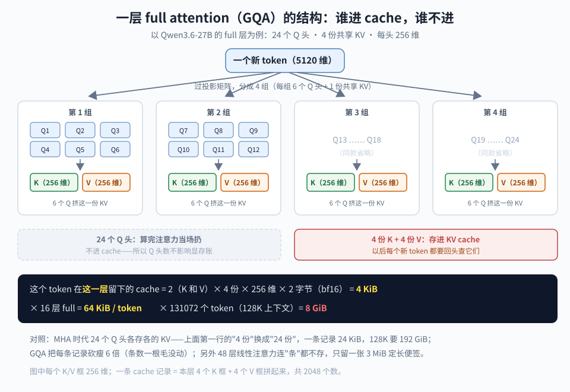

【老靳学算法】第二期：KV cache 到底占多少显存——拿 Qwen3.6-27B 和 DeepSeek V4 Flash 算两本账

━━━━━━━━━━━━━━━━━━━━

◆ 起因：这期算笔实用的账

━━━━━━━━━━━━━━━━━━━━

第一期（总第 276 期 https://mp.weixin.qq.com/s/tLQSZbOd9ap4GSEzZZfvyg ）手算了梯度下降——那是训练的账。这期换一笔部署的账：**KV cache 到底占多少显存**。

这笔账实用得多。买卡、租机、本地跑模型，第一个问题永远是"我这配置能跑多长上下文"——答案的大头就是 KV cache。227 期 https://mp.weixin.qq.com/s/XM-xSvJFXh1Y49YfvJ49DQ 记过我在 DGX Spark 上反复 OOM 的惨案，当时每次都是跑起来才知道爆；其实这笔账**拿到 config.json 就能纸笔算出来**，根本不用跑。

这期就教这个：一条公式，两个实算例子。例子挑了两个 2026 年的当红架构——**Qwen3.6-27B**（混合线性注意力）和 **DeepSeek-V4-Flash**（压缩注意力），恰好代表了省 KV cache 的两条路线。算完你会看到一个反直觉的结果：**27B 的小模型，KV cache 反而比 284B 的大模型贵一个数量级**——账是结构决定的，不是参数量决定的。

按第一期立的规矩交个底：所有数字都从两份 config.json 现算，你可以拿计算器逐个验；看一遍知道账怎么算的、每一项是什么意思，就够本了。

━━━━━━━━━━━━━━━━━━━━

◆ 1. 一条万能公式：三个杠杆

━━━━━━━━━━━━━━━━━━━━

先一句话复习 KV cache 是什么（机制细账在 168 期 https://mp.weixin.qq.com/s/YqcTnIrGKEYZ2n-sMAelKg ，本期只管算钱）：自回归生成时，每个新 token 都要回头看前面所有 token 的 K 和 V；这些 K、V 每层都会用到、每步都一样，所以算一次存下来——存的这堆东西就是 KV cache。**它随上下文变长而线性增长，是推理显存的头号变量。**

标准注意力的账一行写完。每个 token、每一层要存 K 和 V 各一份：

**每 token 每层字节数 = 2 × KV 头数 × 每头维度 × 每个数占的字节**

（那个 2 是 K 和 V 各一份；bf16 每个数 2 字节，FP8 是 1 字节。）然后：

**总占用 = 每 token 每层字节数 × 层数 × 上下文长度 × 并发条数**

公式里藏着三个可以砍的杠杆，全行业这几年的花活都是在砍它们：

- **砍"每条多大"**：减 KV 头数（MQA/GQA）、减每头维度（MLA 压 latent）、降字节数（FP8 量化）
- **砍"存多少条"**：把多个 token 压成一条（压缩注意力），或干脆不按条存（线性注意力）
- **砍"多少层在存"**：让一部分层根本不长 KV cache（混合架构）

两个例子恰好各占一路。上账本。

━━━━━━━━━━━━━━━━━━━━

◆ 2. 账本一：Qwen3.6-27B——64 层里只有 16 层在花钱

━━━━━━━━━━━━━━━━━━━━

从 HF 上把 config.json 拉下来，挑出记账要用的字段：

```text
num_hidden_layers   = 64          # 一共 64 层
layer_types         = 48 层 linear_attention + 16 层 full_attention
full_attention_interval = 4       # 每 4 层里 1 层是 full，3 层是 linear
num_attention_heads = 24          # Q 头数
num_key_value_heads = 4           # KV 头数——和上面一比：24 个 Q 共享 4 份 KV，这就是 GQA
head_dim            = 256         # 每头维度
dtype               = bfloat16    # 2 字节
max_position_embeddings = 262144  # 最长 256K 上下文
```

第一眼要看懂的是 layer_types：**这 64 层不是一种层**。每 4 层一组，3 层线性注意力（Gated DeltaNet）配 1 层普通全注意力——188 期 https://mp.weixin.qq.com/s/jcQlCc3XtaCEEnjUaxw93w 专门拆过 Qwen3.6-27B 这台机器，今天只对它算账。两种层的记账方式完全不同，得分开算。

先解开一个术语撞车：这 16 层**既是 full attention 又是 GQA**，俩词不打架——它们说的是两个不同的轴。full / linear 分的是"**看多少**"（看全部历史，还是只留一张定长便签）；MHA / GQA / MQA / MLA 分的是"**存几份**"（每个 token 的 KV 存几套）。这 16 层 = 看全部历史（full）× 24 个 Q 头共享 4 份 KV（GQA），两轴各选各的。

────────────────────

💡 GQA 是什么：24 个人提问，共用 4 份资料

先纠一个默认印象：讲机制的文章（包括上文第一期的单头简化版）常说"每个 token 算一个 Q、一个 K、一个 V"——真机上不是一个，是**一堆**。一个 token 的 5120 维向量，在每一层要过 24 个不同的 Q 投影，切出 24 个各 256 维的 Q；同时出 4 个 K、4 个 V。为什么要一堆？**一个头只能从一个角度看关系**（有的头盯语法、有的头盯指代、有的头盯位置），多个角度并行才凑出完整的注意力——这就是"多头"的本意。讲机制时单头够用，算显存账时头数必须回来。换个说法：**注意力内部的最小结算单位不是 token，是头**——token 是长度方向的一条，头是宽度方向的一块，打分、加权、进 cache 全按头进行；显存账本质是这个二维网格的面积：条数 × 块数 × 每块 256 维。GQA 砍块数，等会儿 V4 的压缩注意力砍条数，各攻一个方向。

回忆一句注意力在干嘛：每个新 token 拿自己的 Q（问题）去和历史每个 token 的 K（索引）对分数，再按分数把对应的 V（内容）加权拿走。**Q 是提问，K/V 是被查的资料。**

**MHA（2017 原版）**：24 个头、每头一整套 Q/K/V——相当于 24 个人各问各的问题、各自维护一套资料库。表达最丰富，但资料要存 24 份，cache 大到离谱。

后来大家看明白一件事：**24 个人的问题确实得不一样**（提问角度的多样性正是"多头"的价值所在），**但查的资料没必要人手一份**——K/V 是被动的一方，只是躺着等人查，多印几份一模一样的副本纯属浪费显存。

**MQA（激进版）**：24 个人共用 1 份资料，cache 砍 24 倍——但资料只剩一种"整理方式"，质量有可感知的下降。

**GQA（折中版）**：分 4 组，每组 6 个人共用 1 份。资料保留 4 种整理方式，质量几乎不掉，cache 砍 6 倍。2023 年谷歌论文定型（LLaMA-2 70B 用的就是它），之后迅速成了行业默认配置。

最后一问：为什么共享 KV、不共享 Q？——共享 Q 等于 24 个人问同一个问题，多头就白多了；共享 KV 只是大家查同一份资料，问题照样各问各的。这和显存账也严丝合缝：**Q 反正不进 cache，砍它不省钱；KV 进 cache，砍它立竿见影。**

────────────────────

**先算这 16 层 full attention 的账，套公式：**

每 token 每层 = 2 × 4 × 256 × 2 字节 = **4096 字节 = 4 KiB**

四个数字逐个对号：第一个 **2** 是 K 和 V 各存一份（两样东西）；**4** 是 num_key_value_heads（存 4 份共享 KV，GQA 的那个比值）；**256** 是 head_dim（每个头 256 维，即 256 个数）；最后的 **2 字节**是 bf16 每个数的体积。连起来念：K 和 V 两样 × 各 4 份 × 每份 256 个数 × 每个数 2 字节。

（那个"2 字节"的依据：KV cache 的精度默认跟着模型精度走，config 里 dtype = bfloat16，所以每个数 2 字节。部署时可以额外开 KV cache 量化压到 FP8，这笔账直接减半——但那是部署选项，本文按原生口径记。）

刚才那两个轴，在这条算式里各占一个位置：**GQA 就是那个 4**——24 个 Q 头共享 4 份 KV，公式里站着的是 4 不是 24；要是 MHA，这里就得填 24，账立刻翻 6 倍。Q 头数压根不出现在公式里——**Q 从来不进 cache**，用完就丢，这正是 GQA 敢砍 KV 不砍 Q 的原因。而 **full（看全部历史）体现在等会儿乘的那个"上下文长度"上**——每个历史 token 都得留一条；待会儿你会看到，线性层就是在这一项上造反的。

一层的结构和它的账，画成一张图（谁进 cache、谁不进，一眼分清）：



16 层加起来，每个 token 要交 **64 KiB**。上下文拉满就是乘法：

| 上下文 | KV cache（16 层 full） |
|------|------|
| 32K（32768 token） | 2 GB |
| 128K（131072 token） | 8 GB |
| 256K（262144 token，拉满） | 16 GB |

（本文统一用 1 GB = 1024 MB 的口径，和显存报数对齐。）

**再算 48 层线性注意力——它不存"条"，存"便签"。** 线性注意力的思路（195 期 https://mp.weixin.qq.com/s/C-vsE_ceIv6FYVzeZWFBYQ 讲过这一族）是不保留每个 token 的 K/V，而是把整个历史滚动压进一个**固定大小的状态矩阵**：来一个 token 就往里揉一次，矩阵尺寸永远不变。config 里能读出这张便签多大：

```text
linear_num_value_heads = 48       # 48 个头
linear_key_head_dim    = 128      # 每头的状态是一张 128 × 128 的矩阵
linear_value_head_dim  = 128
mamba_ssm_dtype        = float32  # 状态用 4 字节存
```

每层状态 = 48 × 128 × 128 × 4 字节 = **3 MB**。48 层共 **144 MB**——注意这个数**不随上下文变长**，1K 是它，256K 还是它。（这是全文唯一按 4 字节记的东西：状态是滚动累加的，每来一个 token 往里揉一次，误差一轮一轮攒，bf16 扛不住几十万步的累积，所以 config 专门给它开了 float32。）48 层的"KV cache"加起来抵不上 full 层的零头。

**汇总。** 权重按原生精度：27B 参数 × bf16 2 字节 = **54 GB**。整机账（单条上下文）：

| 项目 | 32K | 128K | 256K |
|------|------|------|------|
| 权重（bf16） | 54 GB | 54 GB | 54 GB |
| KV cache（16 层 full） | 2 GB | 8 GB | 16 GB |
| 线性层状态（48 层，定长） | 0.14 GB | 0.14 GB | 0.14 GB |
| 合计 | 约 56 GB | 约 62 GB | 约 70 GB |

一台 128 GB 统一内存的机器（DGX Spark、Mac，参考 210 期 https://mp.weixin.qq.com/s/WKVRvtr3wt19w7hJm-no7Q ），跑满 256K 绰绰有余。

**这本账里最值钱的部分，是往回倒两步、算一条"砍价阶梯"**（都按 128K、bf16 记）：

- **2017 年的 MHA**：24 个 Q 头各存各的 KV，公式里填 24——每 token 每层 2 × 24 × 256 × 2 = 24 KiB；64 层全 full，128K 要 **192 GB**。光 KV cache 就能吃掉一整台 H100 集群节点，这就是老架构撑不起长上下文的原因
- **换 GQA**：24 份砍成 4 份共享，公式里的头数因子 24 变 4，直接除以 6——**32 GB**。注意砍的是**每条的宽度**（一条记录从 24 KiB 瘦成 4 KiB），条数一根毛没动——full attention 的条数永远是层数 × 上下文长度，每个历史 token 每层都得留一条
- **再换混合架构**：64 层里只留 16 层 full，其余换定长便签，再除以 4——**8 GB**

两刀合计砍了 24 倍。GQA 砍的是"存几份"，混合砍的是"多少层在存"——正好是第 1 节三个杠杆里的两个，一人负责一个乘法因子。这就是 2025 年之后新模型扎堆上混合线性注意力的第一动机：**省的不是算力，是这笔随上下文疯长的显存**。

━━━━━━━━━━━━━━━━━━━━

◆ 3. 账本二：DeepSeek-V4-Flash——284B 的模型，1M 上下文只要 2.7 GB

━━━━━━━━━━━━━━━━━━━━

V4 Flash 走的是另一条路：不换线性注意力，而是把标准注意力的两个维度都往死里压。这套机器我们不算陌生——「在 50 系显卡上实现 DeepSeek V4 算子」系列（239–247，合集导读 https://mp.weixin.qq.com/s/w3zBkGtpN0Xe3AXNJqoqhQ ）把它的 Indexer、稀疏注意力这些零件逐个 kernel 手搓过一遍；今天不碰实现，只对显存账。它的 config 里记账相关的字段：

```text
num_hidden_layers    = 43         # 主干 43 层
num_key_value_heads  = 1          # MLA：每 token 每层只存 1 份 latent
head_dim             = 512        # latent 维度
qk_rope_head_dim     = 64         # 位置信息占的维度（折在上面 512 里，不另加）
max_position_embeddings = 1048576 # 最长 1M 上下文
quant: fp8                        # 原生 FP8；cache 按生产口径 FP8 记，每个数 1 字节（见免责声明）
compress_ratios = [0, 0, 4, 128, 4, 128, ..., 4, 0]   # 每层一个压缩比（下面细说）
```

两刀是叠着砍的（机制全在上文提过的 168 期，这里只对账）：

**第一刀，MLA 砍"每条多大"。** 标准注意力每 token 每层存 K、V 两大摞；MLA 只存**一份 512 维的压缩 latent**，K、V、位置信息全在里面——官方 model.py 里写得明白：512 = 448 维内容 + 64 维位置（config 里那个 qk_rope_head_dim = 64 就是折在里面的位置部分，不另外算）。按 FP8 每个数 1 字节：

每条 cache = 512 × 1 字节 = **512 字节**

对比 Qwen 那边一条 4096 字节——每条先便宜 8 倍。

**第二刀，Compressor 砍"存多少条"。** compress_ratios 给每层各配了一个压缩比：4 表示每 4 个 token 压成 1 条（CSA 层），128 表示每 128 个压 1 条（HCA 层）。那 0 呢？我一开始想当然以为"0 = 不压缩、全量存"，翻官方 model.py 才发现正相反——**压缩比 0 的层压根不存历史，是纯滑动窗口层，只留最近 128 条，占用是常数**。把数组逐个数一遍，43 层主干 + 1 个 MTP 块的分布是：

```text
开头 2 层：      压缩比 0——纯滑窗，只看最近 128 个 token，几乎不花钱
中间交替：      21 层 CSA（每 4 条压 1 条）+ 20 层 HCA（每 128 条压 1 条）
数组末尾的 0：  MTP 预测块，也是纯滑窗
（另外每层还各带一段 128 条的滑窗兜底，44 段合计约 3 MB，零头）
```

于是每层存的条数不再等于上下文长度 N，而是 N 除以本层压缩比。逐类算（以 1M = 1048576 token 为例）：

| 层类型 | 层数 | 每层条数 | 每层占用 | 小计 |
|------|------|------|------|------|
| CSA（比 4） | 21 | 262144 | 128 MB | 2688 MB |
| HCA（比 128） | 20 | 8192 | 4 MB | 80 MB |
| 纯滑窗（比 0） | 3 | 128 | 0.06 MB | 约 0.2 MB |

合计 **约 2.7 GB**——一个 284B 的模型，上下文拉到一百万 token，KV cache 只要 2.7 GB。同口径算 128K 是 **约 0.35 GB**。摊到每个 token 头上，平均 2.7 KB——**是 Qwen 每 token 64 KiB 的二十四分之一**。

这张表的结构比数字还有意思：**全部家当的 97% 押在 21 层 CSA 上**——只有它们既保细节（4 个 token 一条摘要）又存得起。20 层 HCA 管着"扫全局"的活，却只花 80 MB——128:1 的压缩比狠到近乎免费。而三个纯滑窗层干脆不留历史。**这是一套显存上的分工：贵的层管精读，便宜的层管扫描，不花钱的层管眼前**——每层该记多少历史，是架构师一层一层排出来的。

**权重的账。** V4 Flash 是原生低精度训练：主干 FP8（1 字节）、专家 FP4（半字节），284B 参数里专家占绝对大头，权重文件合计**约 150 GB**。所以它的整机账长这样：

| 项目 | 128K | 1M |
|------|------|------|
| 权重（FP8 主干 + FP4 专家） | 约 150 GB | 约 150 GB |
| KV cache | 约 0.35 GB | 约 2.7 GB |

看出味道了吗：**这个模型的显存账里，KV cache 几乎是白送的，权重才是唯一的门槛**。单台 128 GB 的机器装不下它的权重（所以我家是两台 Spark 拼起来跑），但只要权重装下了，上下文从 128K 拉到 1M，代价不到 3 GB。

────────────────────

💡 这笔账的免责声明：哪些数是硬的，哪些是估的

按系列规矩把口径交代干净。**源码钉死的**：两份 config.json 的所有字段；V4 每条 cache = 512 个数（位置的 64 维折在里面，官方 model.py 明写）；压缩比 0 的层是纯滑窗；Indexer 打分直接复用主 cache，不另占显存（也是 model.py 里读出来的——我初稿在这三处全按想当然写错了，被官方源码逐条打脸）。**还剩两处口径要交代**：① cache 精度按 FP8（1 字节）记，这是生产部署的口径；官方参考实现里 buffer 是 bf16，那样所有 cache 数字翻倍（1M 也就 5.4 GB，结论不变）；② 权重"约 150 GB"是按参数量和精度估的整数，不是文件逐个加出来的。另外 Qwen 边的卷积状态是常数级小账，忽略。**结论对数量级负责，不对最后一位小数负责。**

────────────────────

━━━━━━━━━━━━━━━━━━━━

◆ 4. 两本账对着看：结构决定账，不是大小决定账

━━━━━━━━━━━━━━━━━━━━

| | Qwen3.6-27B | DeepSeek-V4-Flash |
|------|------|------|
| 参数量 | 27B | 284B（大 10 倍） |
| 权重（原生精度） | 54 GB | 约 150 GB |
| 每 token 的 KV 账 | 64 KiB | 平均约 2.7 KB（1M 时） |
| 128K 的 KV cache | 8 GB | 约 0.35 GB |
| 拉满上下文的 KV cache | 16 GB（256K） | 约 2.7 GB（1M） |
| 省钱路线 | 砍层数：48/64 层换成定长便签 | 砍每条 + 砍条数：MLA × Compressor |

参数大 10 倍的模型，KV cache 反而便宜一个数量级，还多扛 4 倍上下文。**决定 KV cache 的从来不是模型多大，是注意力怎么设计**——这也是为什么这两年读新模型的发布页，注意力结构永远排在参数量前面。

两条最后的提醒，都是把纸面账接到真机上的：

**一，上面全是"单条上下文"的账。** 服务场景要乘并发：Qwen 那本账每多接一路 128K 的用户就多 8 GB，接 8 路并发就是 64 GB——比权重还贵了。KV cache 决定的不只是"能跑多长"，还有"能同时伺候几个人"。这就是上文 168 期讲过的：API 价格表本质是 KV cache 的价格表。

**二，config 在手，账就能算。** 这期的全部计算没有超出乘法和除法。下次看到一个新模型，去 HF 把 config.json 点开，找到层数、KV 头数、每头维度、精度这四个数，一分钟就能报出它在你机器上的命——**不用等 OOM 教你**。

━━━━━━━━━━━━━━━━━━━━

◆ 技术名词速查

━━━━━━━━━━━━━━━━━━━━

| 术语 | 一句话解释 |
|------|-----------|
| KV cache | 生成时缓存的历史 K/V，随上下文线性增长，推理显存头号变量 |
| GQA（分组查询注意力） | 多个 Q 头共享一份 KV，砍"每条多大"的经典手段 |
| MLA | 把 K/V 压成一份低维 latent 存，DeepSeek 家砍维度的刀 |
| 线性注意力 | 不按条存历史，把全部历史滚动压进定长状态矩阵（便签） |
| 混合架构 | 线性层和 full attention 层按比例交替，只让少数层长 KV cache |
| CSA / HCA | V4 的压缩注意力：每 4 条 / 每 128 条压成 1 条，砍"存多少条" |
| compress_ratios | V4 config 里每层一个压缩比的数组，0 = 不压 |
| MTP | 末尾的多 token 预测块，只留滑窗，不进 KV 大账 |
| 统一内存 | CPU/GPU 共享一池内存的机器（Spark/Mac），权重+cache 一起挤这一池 |
| OOM | Out of Memory，显存爆了——本期教你在爆之前算出来 |

━━━━━━━━━━━━━━━━━━━━

◆ 参考资料

━━━━━━━━━━━━━━━━━━━━

- Qwen/Qwen3.6-27B, config.json, HuggingFace（本期账本一的全部字段来源）
- Ainslie et al., GQA: Training Generalized Multi-Query Transformer Models from Multi-Head Checkpoints, arXiv:2305.13245（Google，2023；GQA 定型之作）
- deepseek-ai/DeepSeek-V4-Flash, config.json 与 inference/model.py, HuggingFace（本期账本二的字段与 cache 布局来源；2026-08 官方正式版）
- 本期全部数字均可由上述两份 config 纸笔复算

━━━━━━━━━━━━━━━━━━━━

**KV cache 一条公式：2 × KV 头数 × 每头维度 × 字节数，再乘层数、长度、并发——config 在手，不用等 OOM 教你。**

**27B 的 Qwen 跑 128K 要 8 GB，284B 的 V4 Flash 跑 1M 只要 2.7 GB——决定 KV cache 的不是模型多大，是注意力怎么设计。**

**两条省钱路线殊途同归：混合架构让四分之三的层不再长 cache，压缩注意力让每条更小、条数更少——全行业都在砍同一笔账。**

━━━━━━━━━━━━━━━━━━━━

// 靳岩岩的 AI 学习笔记 × Claude 的严谨 × Gemini 的浪漫
// （落款日期发布时补）
