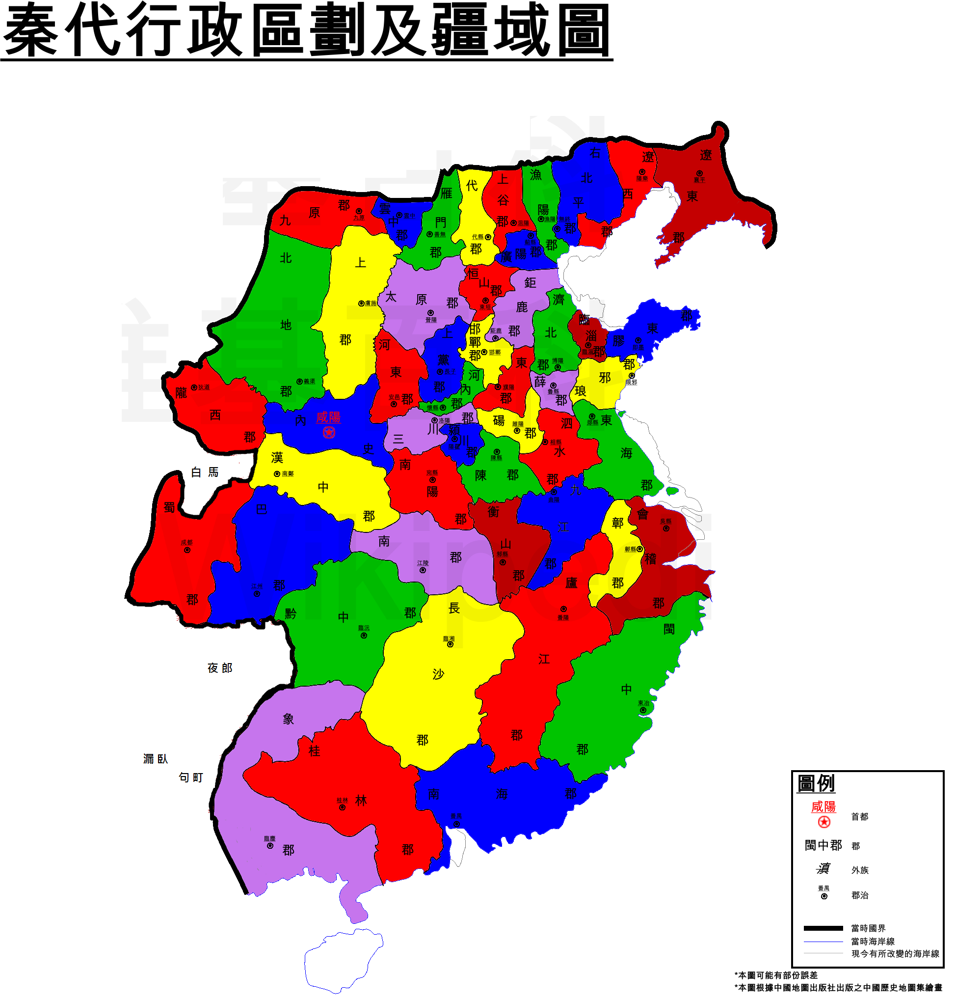
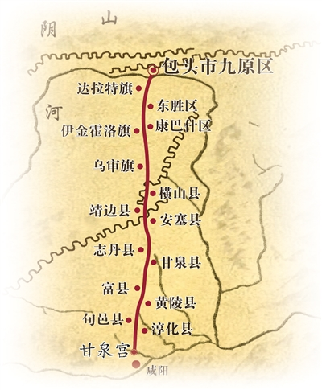

【旅行杂谈】出发去鄂尔多斯之前，我想搞清楚：这块地是什么时候变成"中国"的

━━━━━━━━━━━━━━━━━━━━

◆ 起因："统一六国"我倒背如流，六国外面的账一笔糊涂

━━━━━━━━━━━━━━━━━━━━

这几天休假，路线定的是呼和浩特—鄂尔多斯—榆林，一天一城，沿着黄河"几"字弯的怀里走。出发前查资料，知道鄂尔多斯这片高原在秦代叫"河南地"——黄河三面抱着它，站在中原看，它在河的南边。

然后我习惯性地问了自己一个问题：秦是什么时候拿下这块地的？

一查吓一跳。我对"秦灭六国"的顺序倒背如流——韩赵魏楚燕齐，前 230 到前 221，十年收官。但这块地不在账上。再往下挖，发现我对整个秦帝国的了解，其实就只有"统一六国"这四个字：**六国之外，帝国还打了谁、什么时候打的、对面站着什么人，我一个都答不上来。**

"六国"这个词本身就是个过滤器。韩赵魏楚燕齐有名有姓有谥号，教科书里排排坐；可秦人四百年纠缠不休的义渠、赵武灵王学骑射的对象林胡和楼烦、岭南丛林里的西瓯——这些名字全被滤掉了。"统一六国"四个字，把一场大陆规模的多民族重组，压缩成了中原兄弟阋墙的大结局。

这篇就把滤掉的账补一补。补完你会发现，鄂尔多斯在这本账里的位置相当特殊：**它是帝国最后打下的领土之一，也是最先丢掉的。**

━━━━━━━━━━━━━━━━━━━━

◆ 1. 一张时间表：统一是中点，不是终点

━━━━━━━━━━━━━━━━━━━━

把秦的扩张按时间排开（本文年份均为公元前，下同）：

| 时间 | 拿下的地方 | 距统一 |
|------|------|------|
| 316 年 | 巴蜀（四川） | 早 95 年 |
| 278 年 | 白起拔郢，得南郡（湖北核心） | 早 57 年 |
| 272 年 | 灭义渠（陇东） | 早 51 年 |
| 230–221 年 | 韩、赵、魏、楚、燕、齐 | 十年灭六国 |
| **221 年** | **统一** | **——** |
| 215–214 年 | 蒙恬取河南地（鄂尔多斯） | **晚 6 年** |
| 219–214 年 | 五十万大军征岭南，214 年设三郡 | **晚 6 年** |

几个看点。

**第一，四川人做秦人，比统一早了将近一百年。** 我们习惯把"秦国变秦朝"当成一瞬间的事，其实帝国的地基是一块一块、隔着几十年铺的。巴蜀并入时，秦始皇的爷爷的爷爷还没出生。

**第二，统一不是句号。** 前 221 年之后，这台战争机器根本没停：北边三十万人跟着蒙恬出塞，南边五十万人钻进岭南丛林。帝国真正的句号画在**前 214 年**——这一年，最北的河南地设了四十四个县，最南的岭南设了南海、桂林、象三个郡。**同一年，帝国在黄河后套和珠江口同时立下界碑。**

**第三，两笔"新单"的配套工程也对仗**：北边修直道、连长城，南边凿灵渠——都是把兵和粮泵到帝国血管最末梢的基建。这个后面细说。

所以鄂尔多斯的身份很清楚了：它不是秦统一天下时继承的遗产，是**统一之后帝国新打的增量**——用今天的话说，六国是收购来的存量资产，河南地和岭南是上市之后才开的新业务。

━━━━━━━━━━━━━━━━━━━━

◆ 2. 对面站着谁：被滤掉的那些名字

━━━━━━━━━━━━━━━━━━━━

"统一六国"叙事最大的损失，是把对手全写没了。补几个名字。

**义渠——秦的北门。** 陇东庆阳一带（王城约在今宁县），筑城定居的戎人，半农半牧，和秦纠缠了四百年，是西戎诸部里最难啃的一块。它的位置正卡在关中通往河套的必经之路上——秦想往北够到鄂尔多斯，必须先过义渠这道门。

这道门是怎么开的，《史记》用三句话讲完了一个电视剧都拍不完的故事：

▎义渠戎王与宣太后乱，有二子。宣太后诈而杀义渠戎王于甘泉宫，遂起兵伐残义渠。

三十多年的情人、两个儿子，然后设局杀于甘泉宫，接着发兵灭国。前 272 年，义渠亡，"秦有陇西、北地、上郡，筑长城以拒胡"——秦的北疆版图就是这一刀切出来的。看过《芈月传》的对这段应该有印象，电视剧演的就是她。

记住"甘泉宫"这个地名，结尾要考。

**林胡、楼烦——高原的老住户。** 在匈奴登场之前，鄂尔多斯和它周边草原的主人是这两拨人。赵武灵王"胡服骑射"，学的是他们的装备，打的也是他们——打完在黄河北岸设了云中郡（治所就在今呼和浩特托克托一带，我这趟第一站的地界）。楼烦人的骑术好到什么程度？国亡了之后，"楼烦"直接变成了各国军队里"精锐骑兵"的代名词，人成了兵种。

这两拨人没有文字，没给自己写过一个字的历史。中原史书里他们只在"被谁谁谁击破"的句式里出现。他们留下的唯一自述，是地下出土的一批批动物咬斗纹的青铜牌饰——考古学界管这批东西叫"鄂尔多斯式青铜器"，用的正是我此行目的地的名字。这个后面单独写一篇。

**头曼单于——被撵走的那位。** 到蒙恬北上时，坐在河南地的已经是匈奴了。当时的单于叫头曼——冒顿的父亲。蒙恬把头曼撵到阴山以北，秦人在河套修城设县；十几年后头曼的儿子冒顿鸣镝弑父上位，趁着中原大乱把河南地整个收了回去。这个也放结尾说。

**南边的对照组：百越。** 岭南那边的对手统称百越——番禺（今广州）一带是南越，广西是西瓯，再往南是骆越。没有王、没有城、没有文字，就是无数部落泡在丛林水网里。整场战争里对手一方留下姓名的只有两个人，还都是音译：西瓯君译吁宋（被秦军所杀），和继起反击、阵斩秦军主帅屠睢的桀骏——出处是《淮南子》，中原自己的战报。

对手的社会结构，直接决定了两场战争的形状：

- **北边是闪电战**：匈奴有单于、有组织，打不过就整体后撤——所以蒙恬前 215 年出兵，一两年就"略定"；但也正因为人家是整建制撤走的，后面还能整建制回来
- **南边是消耗战**：百越没有可摧毁的中心，杀了首领照样在丛林里耗——所以岭南从前 219 年打到前 214 年，主帅战死，前 213 年还在往南边谪戍移民填线

**有中心的对手会退，无中心的对手会耗**——这条规律，此后两千年的帝国边疆史里会反复应验。

━━━━━━━━━━━━━━━━━━━━

◆ 3. 摊开地图：这块高原上有一道"统一前的国界"

━━━━━━━━━━━━━━━━━━━━

那"取河南地"之后，鄂尔多斯在帝国版图上算哪个郡？我原以为是一个郡，摊开地图才发现——它是被三四个郡分食的，而且各块并入的时间差了一百多年：

- **上郡**（高原东南部）：最老的一块——前 328 年魏国就把"上郡十五县"献给了秦，比统一早一个多世纪。治所肤施，在今榆林一带——我这趟的第三站，就是当年的上郡首府地区
- **北地郡**（西南缘）：义渠故地，前 272 年那一刀之后设的
- **九原郡**（北部河套沿岸）：蒙恬的新地盘，四十四县归在它名下，治所九原在今包头西——这才是"河南地"的正主
- **云中郡**（东北隔河相望）：赵武灵王的遗产，秦灭赵后接收

更有意思的是上郡和九原郡之间的那条缝。灭义渠之后，秦沿着陇西、北地、上郡的北界修了一道长城（后世叫秦昭王长城），走向大致是今天的吴起—靖边—横山—榆林一线。**在蒙恬北上之前，这道墙就是秦的国界**——墙以南的鄂尔多斯东南角，做了一百年秦地；墙以北的大半个高原，是匈奴的牧场。

也就是说，这片高原上叠着两条长城：南边一条是"统一之前的国界"（昭王长城），北边沿阴山一条是"统一之后的国界"（蒙恬连缀的秦长城）。**两道墙之间夹着的，就是帝国最后打下的那块地。** 我这趟从呼和浩特往榆林开，等于从新国界穿到旧国界。

━━━━━━━━━━━━━━━━━━━━

◆ 4. 直道：给一块只握了十年的土地，修一条用了两千年的路

━━━━━━━━━━━━━━━━━━━━

新领土到手，配套工程立刻上马。前 212 年，蒙恬开始修直道：南起云阳的甘泉宫（今陕西淳化，咸阳北边的军事指挥中枢——对，就是义渠王被杀的那座甘泉宫，六十年前宣太后在这里打开北门，如今她的重孙从同一个坐标把路修出去），北抵九原，约七百公里，"堑山堙谷，直通之"。

看路线图会发现它纵穿鄂尔多斯全境：乌审旗、伊金霍洛旗、东胜、达拉特旗——和今天西安到包头的包茂高速走廊基本重合，所以包茂常被叫"现代版秦直道"。我这趟的自驾路线，就是踩着它的平行线倒着开。

但走廊重合，选线哲学正好相反，这是我觉得直道最有嚼头的地方：

────────────────────

💡 秦人把路修在山脊上，现代人把路修在河谷里

直道南段沿子午岭的**分水岭主脊**走——"岭上跑马"。为什么专挑山脊？在没有钢筋混凝土的年代，山脊是最优解：不过河，就不用架桥；骑在分水岭上，雨水往两边自己排，路基不泡水；视野开阔，辎重队不怕伏击。代价是要"堑山堙谷"——把山头削平、把垭口填起来，用人力硬凿出一条平直的脊背路。

现代公路全走河谷，因为约束反过来了：桥梁隧道便宜了，而城镇、耕地、加油站全在谷底，路要跟着人走。

同一条走廊，两套工程约束，两个完全相反的答案。顺带一提：直道有些段落夯土密实到**至今寸草难生**——两千两百年前的路基，比沿线不知多少代王朝的国界都活得长。

────────────────────

直道的账，快、狠、短：前 212 年开修，前 210 年蒙恬死时尚未全部竣工。而它通车后干的头一件载入史册的大活，荒诞得像黑色幽默——**前 210 年秦始皇死在最后一次巡游路上，车队为了秘不发丧，绕道九原、沿着直道把他的灵柩运回咸阳**，同车还压着一筐用来盖尸臭的咸鱼。这条为帝国远征修的高速路，第一单大生意是给帝国创始人送葬。

━━━━━━━━━━━━━━━━━━━━

◆ 尾声：最后征服的，最先脱手

━━━━━━━━━━━━━━━━━━━━

然后就是收尾了，快得让人反应不过来。

前 210 年始皇死，前 209 年陈胜吴广起事，蒙恬已被赐死，三十万戍边军团南调平乱，河套的移民作鸟兽散。《史记》记这段只用了一句：**"诸秦所徙适戍边者皆复去，于是匈奴得宽，复稍度河南。"**——人一走，匈奴慢慢又渡过黄河，回到河南地。

巧的是，同一年，草原上也换了主人：冒顿鸣镝弑父，杀头曼自立。此后几年他东灭东胡、西逐月氏，把整个草原拧成了一个帝国。**秦帝国和匈奴帝国几乎同龄——一个前 221 年成型、十五年就崩了；一个前 209 年成型，压着整个汉朝打了几十年。**长城两边，两台整合机器几乎同时开动，很难说是巧合：草原上那些松散的部落，正是在中原统一帝国的军事压力下，才被挤压成了自己的帝国。

算总账：

- **河南地**：前 214 年到手，前 209 年前后丢掉——秦帝国握了它**不到十年**。汉武帝前 127 年派卫青复取，设朔方郡，才算真正拿稳
- **岭南**：秦亡时，南海郡尉赵佗关闭五岭通道，自立南越国——将近一个世纪后汉武帝才收回
- **六国故地**：楚汉打成一锅粥，但没有一寸地"退出中国"

核心资产纹丝不动，两笔新业务全部脱手。**帝国的边际领土，维持成本永远高于征服成本**——这条规律往后两千年也会反复应验。

只有那条路不认账。国土丢了，王朝没了，直道的夯土还在鄂尔多斯的草皮底下延伸，汉代复取河南地走的还是它，此后历代北征、贸易、迁徙，一遍遍从它身上碾过去。

所以这趟出门，我其实是去看一个悖论：**一块被帝国握了不到十年的土地，和一条为它修的、用了两千年的路。** 政治的寿命和工程的寿命，在鄂尔多斯高原上当面对质。

━━━━━━━━━━━━━━━━━━━━

◆ 参考资料

━━━━━━━━━━━━━━━━━━━━

- 司马迁，《史记·秦始皇本纪》《史记·匈奴列传》《史记·蒙恬列传》（扩张年表、义渠与宣太后事、河南地取失、直道与始皇灵柩事）
- 刘安 等，《淮南子·人间训》（秦征岭南与译吁宋、桀骏事）
- 陕西省考古研究院，秦直道遗址（富县桦沟口段）考古发掘资料
- 地图：中国地图出版社《中国历史地图集》秦代图组（正文政区图据此绘制的版本）

━━━━━━━━━━━━━━━━━━━━

**"统一六国"是个过滤器：六国有名有姓排排坐，义渠、林胡、楼烦、百越全被滤掉——一场大陆规模的重组，被压缩成了中原兄弟阋墙的大结局。**

**前 214 年，帝国在黄河后套和珠江口同时立下界碑——统一不是句号，是中点；真正的句号画在鄂尔多斯和岭南。**

**河南地秦人只握了不到十年，为它修的直道却用了两千年——政治的寿命和工程的寿命，在这片高原上当面对质。**

━━━━━━━━━━━━━━━━━━━━

// 靳岩岩的 AI 学习笔记 × Claude 的严谨 × Gemini 的浪漫
// （落款日期发布时补）
